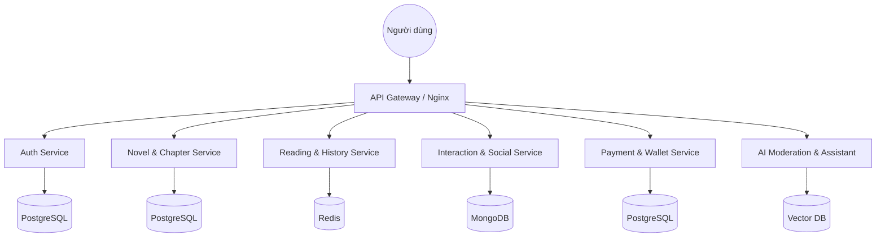

# 03. Kiến trúc, Công nghệ và Mô hình thiết kế (Architecture & Tech Stack)

Tài liệu này mô tả hạ tầng kỹ thuật và các lựa chọn công nghệ cho hệ thống Ephurin.

## 1. Kiến trúc hệ thống (System Architecture)

Ephurin được thiết kế theo kiến trúc **Microservices** để đảm bảo khả năng mở rộng và bảo trì độc lập cho từng phân hệ.

## 2. Lựa chọn Công nghệ (Technology Stack)

### 2.1 Frontend (Web & Mobile)
- **Framework**: Next.js (React) cho Web để tối ưu SEO và tốc độ tải trang (SSR/ISR).
- **Styling**: Tailwind CSS cho giao diện hiện đại và linh hoạt.
- **State Management**: Redux Toolkit hoặc React Query.
- **Mobile App**: React Native (chia sẻ logic code với Web).

### 2.2 Backend (Microservices)
- **Runtime**: Node.js với NestJS Framework (đảm bảo tính cấu trúc và dễ mở rộng).
- **Communication**: REST API cho giao tiếp bên ngoài, gRPC hoặc RabbitMQ cho giao tiếp nội bộ giữa các services.
- **Security**: JWT (JSON Web Token) cho xác thực, OAuth 2.0 cho SSO.

### 2.3 Database & Storage
- **Primary Database**: PostgreSQL (lưu trữ dữ liệu có quan hệ như người dùng, tác phẩm, giao dịch).
- **Caching**: Redis (lưu session, lịch sử đọc gần đây, ranking).
- **NoSQL**: MongoDB (lưu trữ logs, draft chương truyện và dữ liệu không cấu trúc).
- **File Storage**: AWS S3 hoặc Cloudinary (lưu trữ ảnh bìa, tài nguyên tĩnh).

### 2.4 AI & Data Analysis
- **Content Moderation**: OpenAI API hoặc Fine-tuned Llama 3 để kiểm duyệt nội dung tự động.
- **Author Assistant**: Tích hợp RAG (Retrieval-Augmented Generation) để hỗ trợ tác giả tra cứu thông tin nhân vật/cốt truyện.

## 3. Mô hình thiết kế sơ bộ (Preliminary Design Model)

- **UI/UX Pattern**: Mobile-first, Dark mode default, Clean & Minimalist.
- **Deployment**: Containerization với Docker, quản lý bởi Kubernetes (K8s).
- **CI/CD**: GitHub Actions hoặc Jenkins để tự động hóa quy trình test và deploy.
