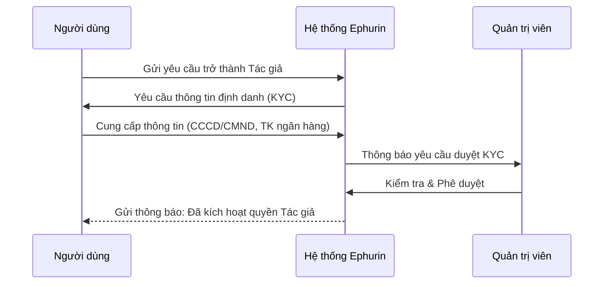
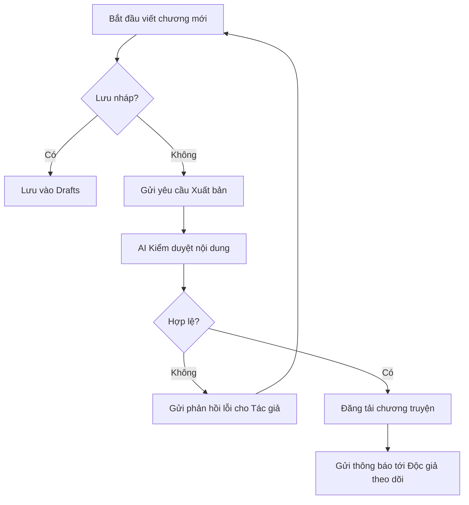
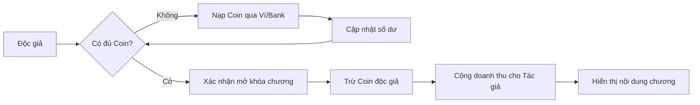

# 04. Phân tích và Trực quan hóa nghiệp vụ (Business Process Analysis)

Tài liệu này trực quan hóa các quy trình nghiệp vụ cốt lõi của hệ thống Ephurin bằng sơ đồ luồng (Flowchart/BPMN).

## 1. Quy trình Đăng ký Tác giả & Xác thực (Author KYC)

Để đảm bảo chất lượng nội dung và tính minh bạch trong thanh toán, tác giả cần thực hiện quy trình xác thực.

## 2. Quy trình Sáng tác & Xuất bản (Publishing Workflow)

Quy trình tích hợp kiểm duyệt tự động bằng AI để rút ngắn thời gian xuất bản.

## 3. Quy trình Thanh toán & Mở khóa nội dung (Monetization)

## 4. Phân tích các bên liên quan (Stakeholder Analysis)

| Bên liên quan | Vai trò & Trách nhiệm | Mục tiêu chính |
| :--- | :--- | :--- |
| **Độc giả** | Tiêu thụ nội dung, tương tác, trả phí. | Tìm kiếm truyện hay, trải nghiệm đọc mượt. |
| **Tác giả** | Sáng tạo nội dung, quản lý tác phẩm. | Tiếp cận độc giả, kiếm thu nhập minh bạch. |
| **Quản trị viên** | Quản lý hệ thống, kiểm duyệt cao cấp. | Đảm bảo hệ thống vận hành ổn định, đúng pháp luật. |
| **Nhà quảng cáo** | Cung cấp tài trợ, quảng bá thương hiệu. | Tiếp cận đúng đối tượng khách hàng mục tiêu. |
| **Đối tác thanh toán** | Xử lý giao dịch tài chính. | Đảm bảo giao dịch nhanh chóng và an toàn. |
| **Đội ngũ Phát triển** | Xây dựng và bảo trì phần mềm. | Tối ưu hóa tính năng và hiệu năng hệ thống. |
| **Giảng viên (SQA)** | Giám sát chất lượng và quy trình. | Đánh giá tính tuân thủ quy chuẩn phần mềm. |
