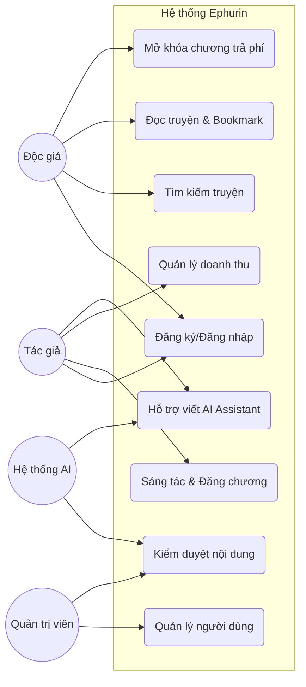

# 05. Đặc tả Use Case và User Story (Requirements Specification)

Tài liệu này chi tiết hóa cách thức người dùng tương tác với hệ thống Ephurin.

## 1. Sơ đồ Use Case (Use Case Diagram)

## 2. Đặc tả Use Case chi tiết (Detailed Use Case)

### Use Case: Mở khóa chương truyện trả phí (UC4)
- **Actor**: Độc giả.
- **Mô tả**: Độc giả sử dụng Coin để mở khóa quyền truy cập vĩnh viễn vào một chương truyện trả phí.
- **Tiền điều kiện**: 
    - Độc giả đã đăng nhập.
    - Tài khoản độc giả có đủ số dư Coin.
    - Chương truyện ở trạng thái "Trả phí".
- **Luồng sự kiện chính**:
    1. Độc giả chọn chương truyện muốn đọc.
    2. Hệ thống kiểm tra quyền truy cập. Nếu chưa mở khóa, hiển thị thông báo Paywall.
    3. Độc giả nhấn "Mở khóa bằng X Coin".
    4. Hệ thống kiểm tra số dư Coin.
    5. Hệ thống trừ Coin và ghi nhận giao dịch.
    6. Hệ thống cộng doanh thu cho Tác giả.
    7. Hệ thống hiển thị nội dung chương truyện.
- **Ngoại lệ**:
    - Số dư không đủ: Hệ thống thông báo và gợi ý nạp thêm Coin.

### Use Case: Sáng tác và Đăng chương mới (UC5)
- **Actor**: Tác giả.
- **Mô tả**: Tác giả soạn thảo nội dung, thiết lập các thuộc tính và xuất bản chương truyện mới cho tác phẩm của mình.
- **Tiền điều kiện**: 
    - Tác giả đã đăng nhập.
    - Tác giả đã có ít nhất một truyện đã được tạo trên hệ thống.
- **Luồng sự kiện chính**:
    1. Tác giả truy cập vào "Quản lý truyện" và chọn tác phẩm cần thêm chương.
    2. Hệ thống hiển thị giao diện soạn thảo văn bản.
    3. Tác giả nhập tiêu đề và nội dung chương truyện.
    4. Tác giả có thể tùy chọn sử dụng công cụ AI (UC8) để gợi ý nội dung hoặc sửa lỗi chính tả.
    5. Tác giả thiết lập trạng thái chương (Miễn phí / Trả phí / Lên lịch đăng).
    6. Tác giả nhấn "Xuất bản".
    7. Hệ thống tự động kiểm tra nội dung qua bộ lọc (UC7).
    8. Hệ thống lưu trữ chương truyện và gửi thông báo đến các độc giả đang theo dõi truyện.
    9. Hệ thống hiển thị thông báo "Đăng chương thành công".
- **Ngoại lệ**:
    - Nội dung vi phạm chính sách: Hệ thống từ chối đăng tải và yêu cầu tác giả chỉnh sửa các đoạn vi phạm.
    - Lỗi định dạng: Hệ thống yêu cầu kiểm tra lại các ký tự đặc biệt không hợp lệ.

### Use Case: Kiểm duyệt nội dung (UC7)
- **Actor**: Quản trị viên (Biên tập viên), Hệ thống AI.
- **Mô tả**: Đảm bảo các nội dung được đăng tải trên nền tảng (truyện, chương, bình luận) tuân thủ quy tắc cộng đồng và chính sách của hệ thống.
- **Tiền điều kiện**: 
    - Quản trị viên đã đăng nhập vào hệ thống quản lý.
    - Có nội dung mới được xuất bản hoặc có báo cáo (Report) vi phạm từ người dùng.
- **Luồng sự kiện chính**:
    1. Hệ thống AI tự động quét nội dung và gắn cờ (Flag) các trường hợp nghi ngờ vi phạm (từ ngữ toxic, nội dung nhạy cảm).
    2. Quản trị viên truy cập vào Dashboard kiểm duyệt để xem danh sách nội dung bị gắn cờ hoặc bị báo cáo.
    3. Quản trị viên xem chi tiết nội dung và các bằng chứng vi phạm liên quan.
    4. Quản trị viên đưa ra quyết định xử lý:
        - **Chấp nhận**: Nội dung hợp lệ, gỡ trạng thái gắn cờ.
        - **Yêu cầu chỉnh sửa**: Tạm ẩn và thông báo cho tác giả lý do cần sửa.
        - **Gỡ bỏ/Khóa**: Xóa bỏ nội dung vi phạm nghiêm trọng và có thể khóa tài khoản vi phạm.
    5. Hệ thống cập nhật trạng thái nội dung và ghi lại nhật ký kiểm duyệt.
    6. Hệ thống gửi thông báo kết quả xử lý cho các bên liên quan (Tác giả, người báo cáo).
- **Ngoại lệ**:
    - Khiếu nại từ tác giả: Quản trị viên xem xét lại quyết định nếu tác giả cung cấp giải trình hợp lý.
    - Báo cáo ảo/spam: Quản trị viên bác bỏ báo cáo và giữ nguyên nội dung.

---

## 3. Danh sách User Stories (Product Backlog)

| ID | User Story (Dưới góc độ người dùng) | Priority | Acceptance Criteria (AC) |
| :--- | :--- | :--- | :--- |
| **US-01** | Là một độc giả, tôi muốn tìm kiếm truyện theo thể loại để dễ dàng tìm thấy nội dung yêu thích. | High | Kết quả tìm kiếm trả về đúng thể loại trong < 2s. |
| **US-02** | Là một tác giả, tôi muốn lên lịch đăng chương để giữ nhịp độ cập nhật truyện ngay cả khi tôi bận. | Medium | Chương truyện tự động chuyển sang "Public" đúng giờ đã hẹn. |
| **US-03** | Là một độc giả, tôi muốn chế độ đọc ban đêm để giảm mỏi mắt khi đọc truyện vào buổi tối. | High | Màu nền chuyển sang tối, chữ sáng, không bị lỗi hiển thị. |
| **US-04** | Là một tác giả, tôi muốn nhận thông báo khi có người tặng quà để kịp thời cảm ơn fan. | Low | Thông báo đẩy (push) gửi đến App/Web ngay khi có giao dịch. |
| **US-05** | Là một quản trị viên, tôi muốn hệ thống tự động gắn cờ các bình luận toxic để làm sạch môi trường cộng đồng. | High | AI lọc được 90% từ ngữ vi phạm dựa trên bộ quy tắc. |
| **US-06** | Là một tác giả, tôi muốn AI gợi ý tên nhân vật dựa trên bối cảnh truyện để tiết kiệm thời gian sáng tạo. | Medium | AI cung cấp ít nhất 5 gợi ý phù hợp với ngữ cảnh. |
