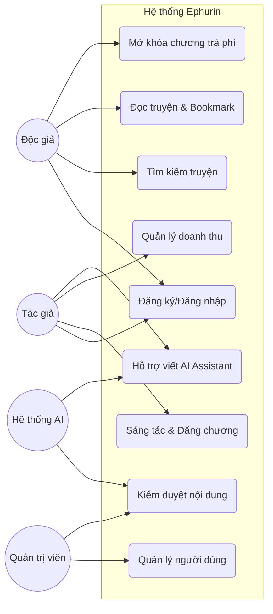

# 05. Đặc tả Use Case và User Story (Requirements Specification)

Tài liệu này chi tiết hóa cách thức người dùng tương tác với hệ thống Ephurin.

## 1. Sơ đồ Use Case (Use Case Diagram)

## 2. Đặc tả Use Case chi tiết (Detailed Use Case)

### Use Case: Mở khóa chương truyện trả phí (UC4)
- **Actor**: Độc giả.
- **Mô tả**: Độc giả sử dụng Coin để mở khóa quyền truy cập vĩnh viễn vào một chương truyện trả phí.
- **Tiền điều kiện**: 
    - Độc giả đã đăng nhập.
    - Tài khoản độc giả có đủ số dư Coin.
    - Chương truyện ở trạng thái "Trả phí".
- **Luồng sự kiện chính**:
    1. Độc giả chọn chương truyện muốn đọc.
    2. Hệ thống kiểm tra quyền truy cập. Nếu chưa mở khóa, hiển thị thông báo Paywall.
    3. Độc giả nhấn "Mở khóa bằng X Coin".
    4. Hệ thống kiểm tra số dư Coin.
    5. Hệ thống trừ Coin và ghi nhận giao dịch.
    6. Hệ thống cộng doanh thu cho Tác giả.
    7. Hệ thống hiển thị nội dung chương truyện.
- **Ngoại lệ**:
    - Số dư không đủ: Hệ thống thông báo và gợi ý nạp thêm Coin.

---

## 3. Danh sách User Stories (Product Backlog)

| ID | User Story (Dưới góc độ người dùng) | Priority | Acceptance Criteria (AC) |
| :--- | :--- | :--- | :--- |
| **US-01** | Là một độc giả, tôi muốn tìm kiếm truyện theo thể loại để dễ dàng tìm thấy nội dung yêu thích. | High | Kết quả tìm kiếm trả về đúng thể loại trong < 2s. |
| **US-02** | Là một tác giả, tôi muốn lên lịch đăng chương để giữ nhịp độ cập nhật truyện ngay cả khi tôi bận. | Medium | Chương truyện tự động chuyển sang "Public" đúng giờ đã hẹn. |
| **US-03** | Là một độc giả, tôi muốn chế độ đọc ban đêm để giảm mỏi mắt khi đọc truyện vào buổi tối. | High | Màu nền chuyển sang tối, chữ sáng, không bị lỗi hiển thị. |
| **US-04** | Là một tác giả, tôi muốn nhận thông báo khi có người tặng quà để kịp thời cảm ơn fan. | Low | Thông báo đẩy (push) gửi đến App/Web ngay khi có giao dịch. |
| **US-05** | Là một quản trị viên, tôi muốn hệ thống tự động gắn cờ các bình luận toxic để làm sạch môi trường cộng đồng. | High | AI lọc được 90% từ ngữ vi phạm dựa trên bộ quy tắc. |
| **US-06** | Là một tác giả, tôi muốn AI gợi ý tên nhân vật dựa trên bối cảnh truyện để tiết kiệm thời gian sáng tạo. | Medium | AI cung cấp ít nhất 5 gợi ý phù hợp với ngữ cảnh. |
