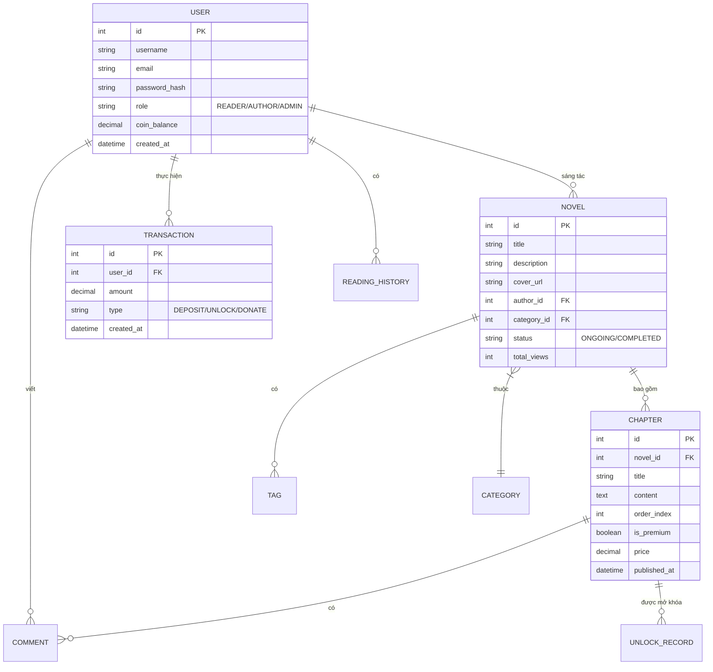

# 06. Phân tích thực thể liên quan (Data Modeling)

Tài liệu này mô tả cấu trúc dữ liệu và mối quan hệ giữa các thực thể cốt lõi trong hệ thống Ephurin.

## 1. Sơ đồ Quan hệ Thực thể (Entity Relationship Diagram - ERD)

## 2. Từ điển dữ liệu (Data Dictionary)

### 2.1 Thực thể: USER (Người dùng)
| Trường dữ liệu | Kiểu dữ liệu | Ràng buộc | Mô tả |
| :--- | :--- | :--- | :--- |
| `id` | Integer | PK, Auto Increment | Định danh duy nhất cho người dùng. |
| `username` | String | Unique, Not Null | Tên đăng nhập. |
| `role` | Enum | Not Null | Phân quyền: Độc giả, Tác giả hoặc Quản trị viên. |
| `coin_balance` | Decimal | Default 0 | Số dư tài khoản hiện có. |

### 2.2 Thực thể: NOVEL (Tác phẩm)
| Trường dữ liệu | Kiểu dữ liệu | Ràng buộc | Mô tả |
| :--- | :--- | :--- | :--- |
| `id` | Integer | PK | Định danh tác phẩm. |
| `author_id` | Integer | FK (USER.id) | ID của tác giả sáng tác. |
| `status` | Enum | Default 'ONGOING' | Trạng thái: Đang tiến hành hoặc Hoàn thành. |

### 2.3 Thực thể: CHAPTER (Chương truyện)
| Trường dữ liệu | Kiểu dữ liệu | Ràng buộc | Mô tả |
| :--- | :--- | :--- | :--- |
| `is_premium` | Boolean | Default False | Xác định chương có thu phí hay không. |
| `price` | Decimal | Default 0 | Giá mở khóa chương (nếu là premium). |
| `order_index` | Integer | Not Null | Thứ tự chương trong tác phẩm. |

## 3. Phân tích thực thể phụ trợ
- **TAG**: Các từ khóa để phân loại truyện chi tiết hơn (ví dụ: #XuyenKhong, #HeThong).
- **READING_HISTORY**: Lưu vết chương truyện cuối cùng người dùng đã đọc để tính năng "Tiếp tục đọc" hoạt động.
- **UNLOCK_RECORD**: Bảng trung gian xác nhận người dùng đã mua chương nào để tránh trừ tiền nhiều lần.
