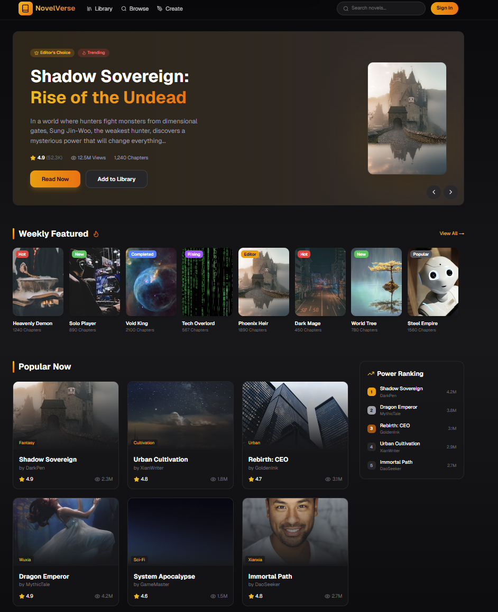
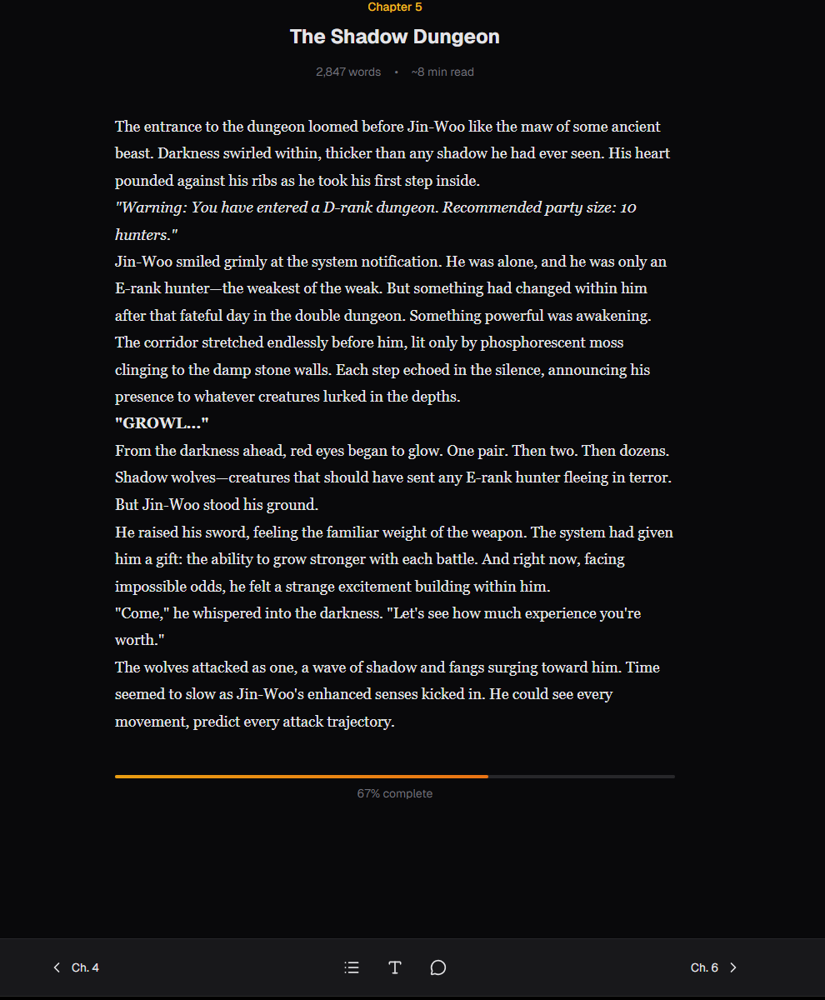
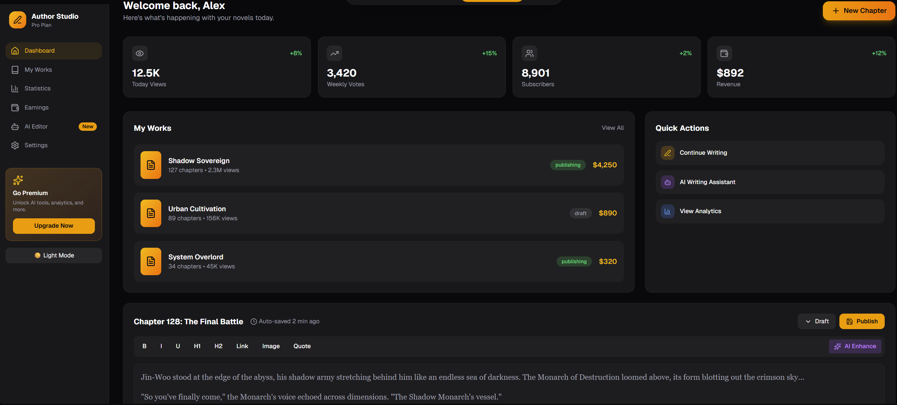
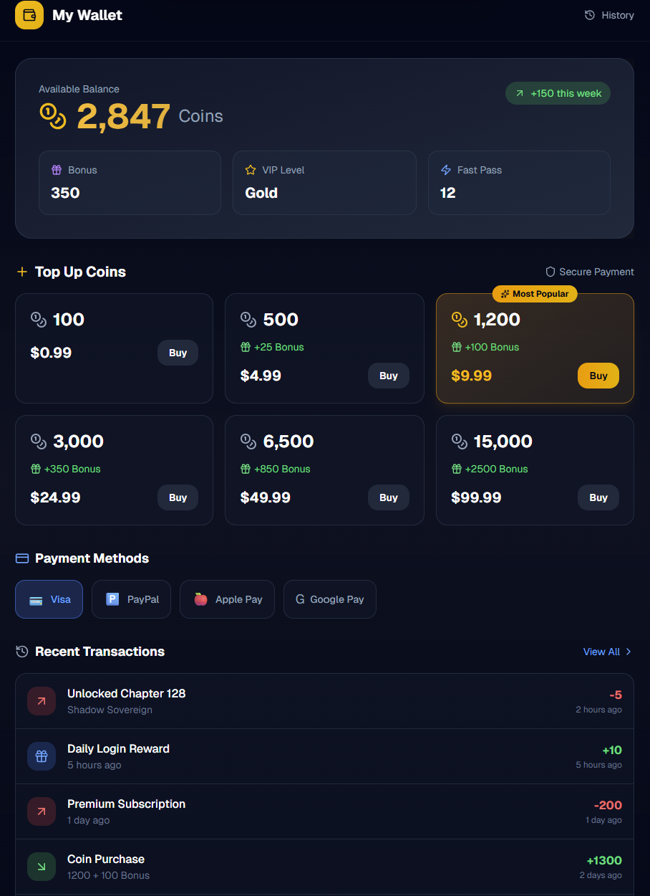
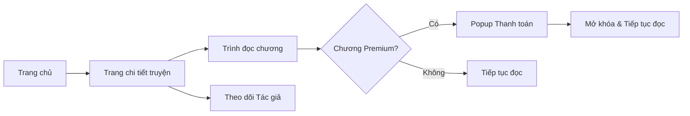

# 07. Thiết kế phác thảo giao diện (UI/UX Mockups)

Tài liệu này trình bày phong cách thiết kế và các sơ đồ bố cục (Layout) cốt lõi của Ephurin.

## 1. Phong cách thiết kế (Design Language)
- **Concept**: Hiện đại, tối giản (Minimalism) và tập trung vào nội dung.
- **Color Palette**: 
    - **Primary**: Deep Purple (#2D1B69).
    - **Secondary**: Neon Cyan (#00F2FF).
    - **Background**: Dark Mode Default (#0F0F1A).
- **Typography**: Sử dụng font "Inter" hoặc "Outfit" để tăng tính hiện đại và khả năng đọc.
- **Effects**: Glassmorphism (hiệu ứng kính mờ), Soft Gradients.

## 2. Giao diện Trang chủ (Landing Page)

**Mô tả**:
- Thanh điều hướng (Navbar) cố định trên cùng với các menu: Trang chủ, Khám phá, Sáng tác, Ví tiền.
- Section Hero: Giới thiệu tác phẩm nổi bật với nút "Đọc ngay" và "Thêm vào thư viện".
- Danh mục truyện Trending: Sử dụng các Card mờ (Glassmorphism) hiển thị bìa truyện, tên và số lượt xem.

## 3. Giao diện Trình đọc (Reading Interface)
- **Bố cục**: Toàn màn hình, không quảng cáo chen ngang nội dung.
- **Floating Toolbar**: Thanh công cụ nổi phía dưới hoặc bên cạnh để tùy chỉnh:
    - Font chữ, kích thước, khoảng cách dòng.
    - Chế độ nền: Sáng, Tối, Sepia (giả giấy cũ).
- **Inline Comment**: Nhấn vào từng đoạn văn để hiển thị các bình luận của độc giả khác tại chính vị trí đó.

## 4. Giao diện Dashboard Tác giả (Author Center)
- **Sidebar**: Quản lý truyện, Thống kê, Tài chính, Trợ lý AI.
- **Editor**: Trình soạn thảo tập trung (Distraction-free mode).
- **Real-time Analytics**: Biểu đồ đường hiển thị tăng trưởng lượt xem và doanh thu theo ngày/tháng.

## 5. Giao diện Thanh toán & Ví (Monetization & Wallet)
- **Hệ thống ví**: Hiển thị số dư Coin và các gói nạp tiền.
- **Lịch sử giao dịch**: Danh sách các giao dịch nạp tiền và mở khóa chương.

## 6. Luồng người dùng (User Flow - Sơ đồ di chuyển)

