CVT-QLTP – Tài liệu đặc tả yêu cầu phần mềm	v1.9

CVT-QLTP – Tài liệu đặc tả yêu cầu phần mềm	v1.9

CÔNG TY CỔ PHẦN TẬP ĐOÀN CÔNG NGHỆ OSP

HỆ THỐNG QUẢN LÝ NGHIỆP VỤ VÀ BÁO CÁO THU PHÍ, LỆ PHÍ VIỄN THÔNG

TÀI LIỆU ĐẶC TẢ YÊU CẦU PHẦN MỀM

Mã hiệu dự án:

CVT-QLTP

Mã hiệu tài liệu:

CVT-QLTP_SRS

Hà Nội, 04/2022

PHÊ DUYỆT

		Người lập:

		Đinh Thủy Tiên

		Ngày:

		06/04/2022

		Nhân viên phân tích nghiệp vụ

		Người xem xét:

		Đỗ Đăng Quân

		Ngày:

		06/04/2022

		Quản trị dự án

		Người phê duyệt:

		Lê Quang Dũng

		Ngày:

		06/04/2022

		Giám đốc dự án

BẢNG GHI NHẬN THAY ĐỔI

*A – Tạo mới, M – Sửa đổi, D – Xóa bỏ

	Ngày

	Phiên bản

	* A, M, D

	Mô tả

	Người cập nhật

	06/09/21

	1.0

	A

	Lập mới SRS module Quản lý thu BCDT, Module Xuất cv thu phí năm đầu P. CPTN (mục III.2), xuất cv thu phí P. KHTC (mục III.3), Quản lý thu phí CCDV (mục III.4)

	Lê Thị Hiền

	22/09/21

	1.1

	M

	- Thêm mới Mục III/5: Module Quản lý biên lai

	- Thêm mới Mục III/6: Module Quản lý Thông tin DN

	- Mục III/2/2.1: Update hiển thị số tiền năm đầu của các g/p Gia hạn/Cấp lại/Sửa đổi, bổ sung

	- Mục III/3/3.1; III/4/4.1/4.2/4.3/4.4: Bổ sung tên file excel khi xuất

	Lê Thị Hiền

	Đinh Thủy Tiên

	16/10/21

	1.2

	M

	- Thêm mới Mục III/7: Module Quản lý thu phí TLM viễn thông công cộng

	- Thêm mới Mục III/8: Quản lý thu phí một lần

	- Thêm mới Mục III/9: Quản lý thu lệ phí

	- Update Mục III/2: Xuất công văn P. CPTN (bổ sung xuất cv thu phí 1 lần, xuất cv thu lệ phí)

	- Update Mục III/3: Xuất công văn P. KHTC (bổ sung xuất cv thu phí TLM viễn thông công cộng, xuất cv đối chiếu công nợ)

	- Update Mục III/6/6.3: Thông tin đầu mối liên hệ các phí cập nhật theo đầu mối hành chính khi chưa có dữ liệu

	- Update Mục III/5/5.2 và Mục III/5/5.3: Trường hợp trong năm 1 Loại phí/lệ phí có tỉ lệ % trích xuất được thay đổi => hiển thị số dòng Loại phí/lệ phí với số tiền và % trích xuất tương ứng

	- Update Mục III/5/5.1/5.1.4: Số còn phải nộp của Năm = Số phải nộp – Số đã nộp 4 quý

	- Update Mục III/4/4.1: Số đã nộp Kỳ Năm = Số đã nộp 4 quý + biên lai phân bổ cho Năm

	- Update Mục III/2/2.1: Mô tả luồng bổ sung chi tiết các trường hợp tính lại tiền năm đầu theo giấy phép cấp lần đầu, cấp mới

	Lê Thị Hiền

	Lâm Mai Anh

	08/11/21

	1.3

	M

	Thêm mới nghiệp vụ các module liên quan đến phí sử dụng mã, số viễn thông. Bao gồm các mục: Mục III/2/2.3: Xem danh sách quyết định phân bổ mã, số viễn thông P.CPTN cần xuất công văn

	Mục III/2/2.4: Xuất công văn thu lệ phí phân bổ mã, số viễn thông

	Mục III/3/3.3: Xem danh sách DN cần xuất công văn thu phí sử dụng mã, số viễn thông

	Mục III/3/3.4: Xuất công văn thu phí sử dụng mã, số viễn thông của P.KHTC

	Mục III/9/9.2: Xem danh sách Theo dõi thu lệ phí phân bổ mã, số viễn thông

	Mục III/10: Quản lý thu phí sử dụng mã, số viễn thông

	Lê Thị Hiền

	Đinh Thủy Tiên

	Lâm Mai Anh

	30/11/21

	1.4

	M

	Thêm mới nghiệp vụ Quản lý biểu mẫu điện tử và Trang chủ

	Lê Thị Hiền

	Đinh Thủy Tiên

	Lâm Mai Anh

	10/12/2021

	1.5

	- Thêm mới nghiệp vụ:

	+ Quản lý công văn (Mục III/13)

	+ Quản lý giấy phép cho phép lắp đặt cáp viễn thông trên biển (Mục III/14)

	+ Quản lý công văn cho phép sửa chữa, bảo dưỡng cáp viễn thông trên biển (Mục III/15)

	+ Theo dõi thu phí sửa chữa, bảo dưỡng cáp viễn thông trên biển (Mục III/16)

	+ Thêm mới Quản lý địa chỉ Chi cục thuế (Mục III/17)

	- Update mục III/2/2.1: Bổ sung thêm Loại giấy phép lắp đặt cáp viễn thông trên biển

	- Update mục III/2/2.2: Bổ sung thêm Loại giấy phép lắp đặt cáp viễn thông trên biển

	- Update mục III/6/6.2: Bổ sung thêm trường File đính kèm khi ủy quyền Doanh nghiệp

	Update mục III/3/3.4: Điều chỉnh công văn đối chiếu công nợ phí kho số theo giai đoạn,

	Update mẫu file phụ lục đối chiếu công nợ (phí quyền và phí kho số), công văn đôn đốc (bổ sung phần Nơi nhận có Chi cục thuế quận/huyện …)

	Update mục III/4/4.1: Bổ sung cột Số tiền thừa đầu kỳ

	Update mục III/4/4.2: Bổ sung cột Số dư đầu kỳ, Số dư cuối kỳ

	Update mục III/7/7.1: Bổ sung cột Số tiền thừa đầu kỳ

	Update mục III/10/10.4: Bổ sung cột Số dư đầu kỳ, Số dư cuối kỳ

	Update mục III/3/3.1: Bổ sung cột Số tiền phải nộp thực tế

	Lê Thị Hiền

	Đinh Thủy Tiên

	Lâm Mai Anh

	22/12/2021

	1.6

	- Thêm mới nghiệp vụ (mục 18, 19):

	+ Quản lý tin nhắn SMS

	+ Quản lý tỷ lệ tờ khai phí, lệ phí

	- Update chức năng Quản lý Chi cục Thuế (mục 17.2; 17.3):

	+ Thêm mới chi cục thuế

	+ Chỉnh sửa chi cục thuế

	Lê Thị Hiền

	Đinh Thủy Tiên

	Lâm Mai Anh

	24/01/2022

	1.7

	A

	Thêm mới nghiệp vụ

	- Quản trị hệ thống (Mục 21)

	- Quản lý thông tin tài khoản cá nhân (Mục 22)

	- Quản lý danh mục đơn vị hành chính (Mục 23)

	Lê Thị Hiền

	Đinh Thủy Tiên

	Lâm Mai Anh

	04/03/2022

	1.8

	A, M

	- Chỉnh sửa module Quản lý biên lai/Xem danh sách biên lai (mục 5.1.1): thêm trường thông tin “Phân bổ cho kỳ VT”.

	- Chỉnh sửa module Thêm mới doanh nghiệp, Thêm mới giấy phép trên phase 1 (mục 24,25).

	- Chỉnh sửa màn Theo dõi thu phí CCDV, TLM (mục 4.1.a; mục 7.1.a): tìm kiếm theo kỳ viễn thông thì danh sách hiển thị thêm cả các giấy phép có số dư nợ đầu kỳ ≠ 0.

	- Cập nhật chức năng Xóa thông tin cuộc gọi, Chỉnh sửa thông tin cuộc gọi, Xem chi tiết công văn thông báo/đôn đốc các phí (Mục 6.7).

	- Bổ sung “Người gửi” trong module Lịch sử gửi tin nhắn (Mục 18.5), sắp xếp lại thứ tự các trường thông tin tại màn xem danh sách và xem thông tin chi tiết tin nhắn SMS.

	- Làm rõ thông tin module Quản lý thông tin Doanh nghiệp, màn lịch sử đôn đốc của DN (mục 6.7), trường thông tin Loại giấy phép và Số giấy phép.

	- Update Cấu hình mức thu phí, lệ phí (Mục 20): update thời gian bắt đầu – kết thúc từng loại phí; Thêm trường thông tin “Số thông tư”, “Ngày thông tư”.

	Update module Cấu hình mức thu:

	- Bổ sung thông tin ngày thông tư, số thông tư

	- Update thời gian bắt đầu, kết thúc (định dạng theo tháng đối với phí CCDV, TLM công cộng, phí kho số; định dạng theo ngày đối với lệ phí, phí thu 1 lần).

	Lê Thị Hiền

	Đinh Thủy Tiên

	05/04/2022

	1.9

	A, M

	Thêm mới chức năng:

	- Xử phạt hành chính (mục 25)

	- Báo cáo thống kê (mục 26)

	- Đăng nhập/Đăng xuất (mục 27)

	Cập nhật chức năng:

	- Danh sách lịch sử hệ thống (mục 21.9)

	- Thêm mới Doanh nghiệp Phase 1 (mục 23)

	Đinh Thủy Tiên

	Lâm Mai Anh

MỤC LỤC

	I. GIỚI THIỆU CHUNG	1

	1. Mục đích tài liệu	1

	2. Mục đích, yêu cầu nghiệp vụ của chức năng	1

	3. Khái niệm, thuật ngữ	2

	4. Tài liệu liên quan	2

	II. MÔ HÌNH PHÂN RÃ CHỨC NĂNG	4

	III. ĐẶC TẢ YÊU CẦU HỆ THỐNG	13

	1. Quản lý Báo cáo doanh thu	13

1.1. Theo dõi nộp Báo cáo doanh thu	13

	1.1.1. Xem danh sách Báo cáo doanh thu	13

	1.1.2. Xem chi tiết BCDT	28

	1.1.3. Xem lịch sử chỉnh sửa báo cáo doanh thu	30

	1.1.4. Xem chi tiết lịch sử chỉnh sửa BCDT	35

	1.1.5. Xuất công văn	38

1.2. Quản lý dữ liệu BCDT	50

	1.2.1. Thêm mới BCDT	50

	1.2.2. Chỉnh sửa BCDT	68

	1.2.3. Xóa BCDT	74

	2. Xuất công văn P. CPTN (thực hiện trên hệ thống cũ)	76

2.1. Xem danh sách giấy phép P. CPTN cần xuất công văn	76

2.2. Xuất công văn thu lệ phí/phí quyền hoạt động viễn thông của P. CPTN	84

2.3. Xem danh sách quyết định phân bổ mã, số viễn thông P. CPTN cần xuất công văn	96

2.4. Xuất công văn thu lệ phí phân bổ mã, số viễn thông	101

	3. Xuất công văn P. KHTC	107

3.1. Xem danh sách Doanh nghiệp P. KHTC cần xuất công văn phí quyền hoạt động viễn thông	107

3.2. Xuất công văn phí quyền hoạt động viễn thông của P. KHTC	121

3.3. Xem danh sách Doanh nghiệp P. KHTC cần xuất công văn phí sử dụng mã, số viễn thông	134

3.4. Xuất công văn thu phí sử dụng mã, số viễn thông của P. KHTC	140

	4. Quản lý thu phí CCDV	156

4.1. Xem danh sách Theo dõi thu phí CCDV	156

4.2. Xem báo cáo Theo dõi công nợ theo kỳ viễn thông	171

4.3. Xem báo cáo Theo dõi công nợ theo kỳ kế toán	182

4.4. Xem báo cáo Theo dõi công nợ lũy kế	194

4.5. Mức phí quy định tại TT03/2018/TT-BTC	204

	4.5.1. Phí CCDV	204

	4.5.2. Phí TLM viễn thông công cộng	204

	4.5.3. Phí Thử nghiệm mạng và dịch vụ viễn thông	206

	4.5.4. Phí TLM viễn thông dùng riêng	207

	4.5.5. Chú ý	207

	5. Quản lý biên lai	208

5.1. Danh sách biên lai	208

	5.1.1. Xem danh sách biên lai	208

	5.1.2. Xem chi tiết biên lai	221

	5.1.3. Hủy biên lai	231

	5.1.4. Thêm mới biên lai	236

	5.1.5. Chỉnh sửa biên lai	249

5.2. Tờ khai thu nộp phí/lệ phí	252

5.3. Tờ khai quyết toán phí/lệ phí	263

	6. Quản lý thông tin Doanh nghiệp	275

6.1. Xem danh sách Doanh nghiệp	275

6.2. Xem chi tiết/cập nhật thông tin chung Doanh nghiệp	284

6.3. Xem chi tiết/cập nhật thông tin liên hệ Doanh nghiệp	296

6.4. Xem chi tiết thông tin lịch sử cấp phép của Doanh nghiệp	305

6.5. Xem chi tiết thông tin nộp BCDT	312

6.6. Xem chi tiết Công nợ chung của Doanh nghiệp	320

6.7. Xem chi tiết/Cập nhật thông tin lịch sử đôn đốc của Doanh nghiệp	326

	7. Quản lý thu phí Thiết lập mạng viễn thông công cộng	339

7.1. Xem danh sách Theo dõi thu phí TLM viễn thông công cộng	339

7.2. Xem báo cáo Theo dõi công nợ theo Kỳ kế toán	352

7.3. Xem báo cáo Theo dõi công nợ lũy kế	363

	8. Quản lý thu phí một lần	373

8.1. Xem danh sách Theo dõi thu phí một lần	373

	9. Quản lý thu lệ phí	386

9.1. Xem danh sách Theo dõi thu lệ phí cấp phép	386

9.2. Xem danh sách theo dõi thu lệ phí phân bổ mã, số viễn thông	397

	10. Quản lý thu phí sử dụng mã, số viễn thông	407

10.1. Xem danh sách Biến động phí sử dụng mã, số viễn thông	407

10.2. Xem chi tiết thông tin thu phí sử dụng mã, số viễn thông của từng doanh nghiệp	416

10.3. Xem danh sách Theo dõi thu phí sử dụng mã, số viễn thông	422

10.4. Xem báo cáo Theo dõi công nợ theo kỳ viễn thông	435

10.5 Xem báo cáo theo dõi công nợ kế toán	442

10.6	Xem báo cáo Theo dõi công nợ lũy kế	453

	11. Quản lý biểu mẫu điện tử	461

11.1. Xem danh sách biểu mẫu điện tử	461

11.2. Xem chi tiết biểu mẫu	474

11.3. Thêm mới biểu mẫu điện tử	482

11.4. Chỉnh sửa biểu mẫu điện tử	505

	12. Xem Trang chủ	518

	13. Quản lý công văn	526

13.1. Xem danh sách công văn	526

13.2. Thêm mới công văn đến/đi – Import công văn	552

13.3. Xem chi tiết thông tin công văn	586

13.4. Chỉnh sửa thông tin công văn	598

	14. Quản lý giấy phép cho phép lắp đặt cáp viễn thông trên biển	618

14.1. Thêm mới giấy phép cho phép lắp đặt cáp viễn thông trên biển	618

14.2. Xuất công văn thu phí/lệ phí lắp đặt cáp viễn thông trên biển.	621

	15. Quản lý công văn cho phép sửa chữa, bảo dưỡng cáp viễn thông trên biển	625

15.1. Danh sách công văn cho phép sửa chữa cáp viễn thông trên biển	625

15.2. Thêm mới công văn cho phép sửa chữa cáp viễn thông trên biển	632

15.3. Xem chi tiết công văn cho phép sửa chữa cáp viễn thông trên biển	638

15.4. Chỉnh sửa thông tin công văn cho phép sửa chữa cáp viễn thông trên biển	642

15.5. Xuất công văn thông báo thu phí sửa chữa, bảo dưỡng cáp biển	644

	16. Theo dõi thu phí sửa chữa, bảo dưỡng cáp viễn thông trên biển	649

16.1. Theo dõi thu phí sửa chữa, bảo dưỡng cáp viễn thông trên biển	649

	17. Quản lý địa chỉ Chi cục thuế	658

17.1. Xem danh sách Chi cục Thuế	658

17.2. Thêm mới Chi cục Thuế	664

17.3. Chỉnh sửa thông tin Chi cục Thuế	668

	18. Quản lý tin nhắn SMS	675

18.1. Xem danh sách mẫu tin nhắn	675

18.2. Xem chi tiết mẫu tin nhắn	684

18.3. Cập nhật mẫu tin nhắn SMS	687

18.4. Xem lịch sử gửi tin nhắn SMS đến Doanh nghiệp	695

18.5. Gửi tin nhắn SMS đột xuất đến Doanh nghiệp	710

	19. Cấu hình tỷ lệ tờ khai phí, lệ phí	724

19.1. Xem Danh sách cập nhật tỷ lệ tờ khai	724

19.2. Xem chi tiết cập nhật tỷ lệ tờ khai	730

19.3. Xem lịch sử cập nhật tỷ lệ tờ khai	735

19.4. Thêm mới tỷ lệ tờ khai	741

19.5. Chỉnh sửa tỷ lệ tờ khai	748

	20. Cấu hình mức thu phí, lệ phí	754

20.1. Xem danh sách các mức thu phí, lệ phí	754

20.2. Thêm mới mức thu phí/lệ phí	764

20.3. Xem chi tiết mức thu phí/lệ phí	788

20.4. Cập nhật mức thu phí/lệ phí	794

	21. Quản trị hệ thống	799

21.1. Xem danh sách tài khoản người dùng	799

21.2. Tạo mới tài khoản người dùng	807

21.3. Xem thông tin tài khoản người dùng	812

21.4. Chỉnh sửa tài khoản người dùng	818

21.5. Xem danh sách nhóm quyền	822

21.6. Thêm mới nhóm quyền	826

21.7. Xem chi tiết nhóm quyền	837

21.8. Chỉnh sửa thông tin nhóm quyền	842

21.9. Xem danh sách lịch sử hệ thống	845

	22. Quản lý danh mục đơn vị hành chính	851

22.1. Xem danh sách đơn vị hành chính	851

22.2. Thêm mới đơn vị hành chính	860

22.3. Chỉnh sửa thông tin đơn vị hành chính	872

	23. Doanh nghiệp (phase 1) (giữ nguyên form cũ, chỉ thêm trường “Cơ quan quản lý thuế”)	876

Thêm mới/chỉnh sửa/Xem chi tiết thông tin doanh nghiệp	876

	24. Thêm mới/chỉnh sửa giấy phép (phase 1)	877

Giao diện chức năng	877

	25. Xử phạt hành chính	878

25.1. Thêm mới thông tin xử phạt	878

25.2. Cập nhật thông tin xử phạt	887

25.3. Xem danh sách ghi nhận xử phạt vi phạm hành chính	895

25.4. Xem chi tiết thông tin xử phạt vi phạm hành chính	905

	26. Báo cáo thống kê	910

26.1. Báo cáo công nợ phí, lệ phí khó đòi tính đến ngày	910

26.2. Báo cáo công nợ, lệ phí khó đòi chi tiết theo đối tượng	920

26.3. Báo cáo thống kê hoạt động doanh nghiệp theo năm	931

	27. Đăng nhập – Đăng xuất	940

27.1. Đăng nhập	940

27.2. Đăng xuất	947

	IV. CÁC YÊU CẦU PHI CHỨC NĂNG	949

	1. Yêu cầu bảo mật	949

	2. Yêu cầu sao lưu	951

	3. Yêu cầu về tính ổn định	962

	4. Yêu cầu về hiệu năng	962

	5. Yêu cầu về giao tiếp	965

5.1. Giao diện người dùng	965

5.2. Giao tiếp phần cứng	966

5.3. Giao tiếp phần mềm bên ngoài	966

	6. Yêu cầu về tính hỗ trợ	967

	7. Yêu cầu về công nghệ và ràng buộc	967

	8. Các yêu cầu tài liệu người dùng và hỗ trợ trực tuyến	968

	9. Các thành phần mua ngoài	968

	10. Yêu cầu về vận hành khai thác	968

	11. Yêu cầu về giải pháp hạ tầng	968

	12. Yêu cầu về tính logic	968

	13. <Thêm các loại yêu cầu khác, nếu cần>	969

GIỚI THIỆU CHUNG

Mục đích tài liệu

Tài liệu này nhằm mục đích đặc tả các yêu cầu của hệ thống quản lý, phân tích số liệu nghiệp vụ viễn thông. Tài liệu đặc tả các chức năng mà hệ thống có để đáp ứng yêu cầu người sử dụng yêu cầu

--	Tài liệu này được sử dụng làm đầu vào cho các quá trình thiết kế, lập trình, kiểm thử của việc xây dựng hệ thống

--	Đối tượng sử dụng tài liệu

Người sử dụng

Mục đích

Người dùng (đối tượng sử dụng phần mềm)

Giúp người dùng hiểu về hệ thống sẽ được xây dựng (những yêu cầu nghiệp vụ nào mà hệ thống sẽ đáp ứng, hay mức độ đáp ứng yêu cầu đó).

Nhóm phát triển hệ thống

Để hiểu các chức năng và đặc tính của hệ thống được phát triển (hiểu được những yêu cầu người dùng nào mà hệ thống đáp ứng). Và sử dụng trong quá trình thiết kế hệ thống.

Nhóm kiểm thử

Phục vụ xây dựng tài liệu test và test chức năng hệ thống (system test)

QA

Sử dụng để tham chiếu thẩm định chất lượng phần mềm, kiểm tra tài liệu thiết kế, tài liệu nhóm Test.

Nhóm quản lý dự án

Theo sát tiến độ thực hiện các yêu cầu của dự án

Mục đích, yêu cầu nghiệp vụ của chức năng

Hệ thống quản lý nghiệp vụ và báo cáo thu phí, lệ phí phải đáp ứng được các mục tiêu sau:

--	Cho phép chuyên viên P. KHTC có thể quản lý, theo dõi tình hình nộp phí/ lệ phí của DN

--	Cho phép chuyên viên P. KHTC có thể quản lý biên lai của các loại phí/lệ phí

--	Cho phép chuyên viên P. KHTC có thể quản lý thông tin công văn và trạng thái gửi công văn của các loại phí/lệ phí

--	Cho phép chuyên viên P. Kinh tế có thể quản lý BCDT

--	Cho phép chuyên viên P. Thanh tra pháp chế nhập thông tin xử phạt hành chính

--	Cho phép chuyên viên P. Cơ sở hạ tầng có thể nhập thông tin cấp phép lắp đặt cáp viễn thông trên biển

--	Cho phép Lãnh đạo Cục, Trưởng phòng có thể xem Báo cáo thống kê, tra cứu tình trạng nộp phí của DN

Khái niệm, thuật ngữ

Thuật ngữ

Định nghĩa

Ghi chú

BCDT

Báo cáo doanh thu

NSD

Người sử dụng

DN

Doanh nghiệp

CCDV

Cung cấp dịch vụ

MST/ Số ĐKKD

Mã số thuế/ Số Đăng ký kinh doanh

HT

Hệ thống

P. Thanh tra

Phòng Thanh tra

STT

Số thứ tự

Tài liệu liên quan

Loại tài liệu

Tên tài liệu

Phiên bản

Ghi chú

URD

CVT-QLTP_URD_v1.0

v1.0

Mockup

https://www.figma.com/file/QA6ez1v5WdY3wfVVCt8k4O/Qu%E1%BA%A3n-l%C3%BD-BCDT-(draft)?node-id=596%3A143716

MÔ HÌNH PHÂN RÃ CHỨC NĂNG

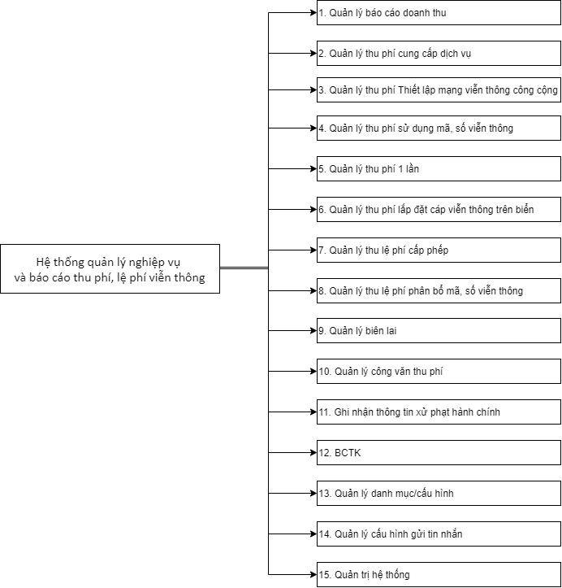

Module Quản lý thu BCDT

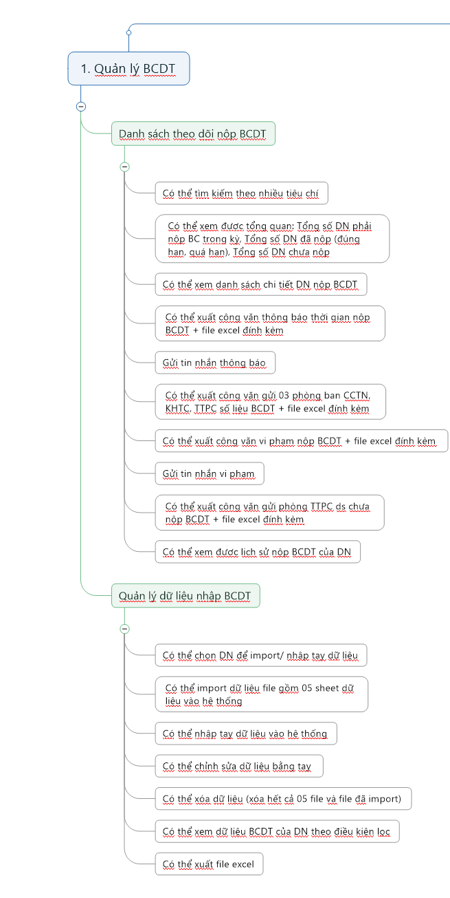

Quản lý thu phí CCDV

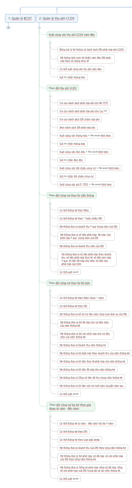

Module Xuất công văn P. CPTN

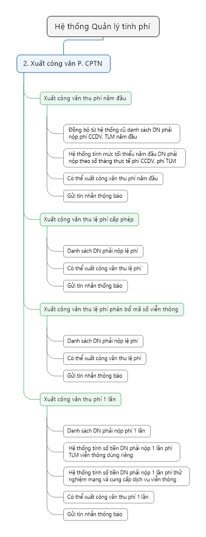

Module Xuất công văn Phòng KHTC

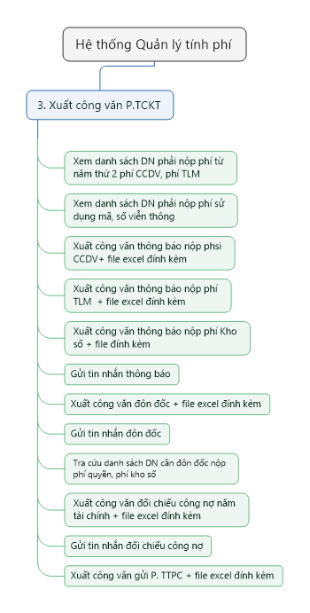

Module Quản lý biên lai

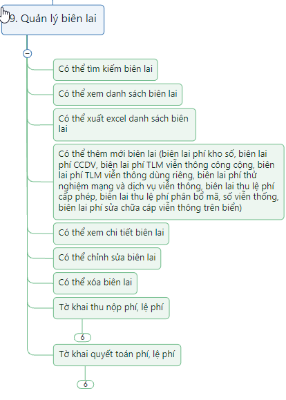

Module Thông tin Doanh nghiệp

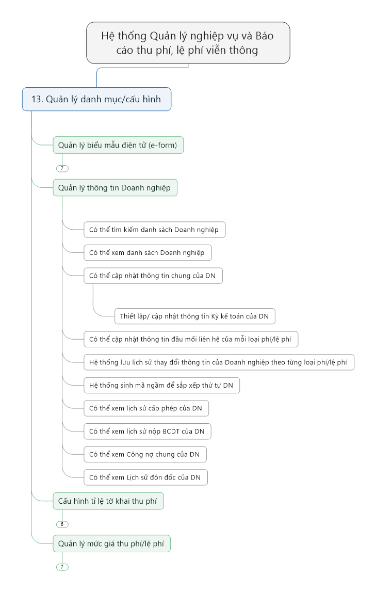

Module Quản lý thu phí TLM viễn thông công cộng

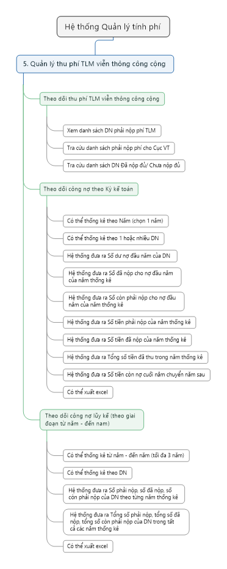

Module Quản lý thu phí một lần

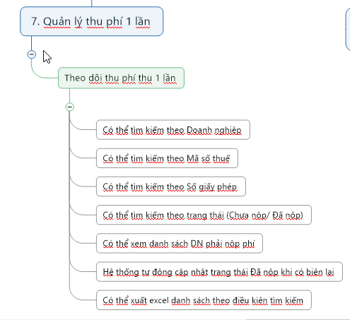

Module Quản lý thu lệ phí

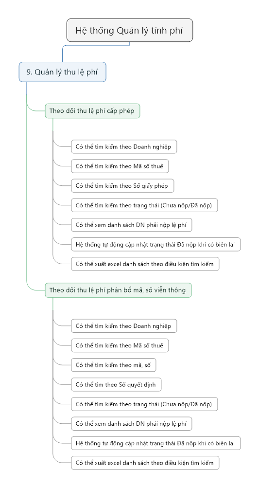

ĐẶC TẢ YÊU CẦU HỆ THỐNG

Quản lý Báo cáo doanh thu

Theo dõi nộp Báo cáo doanh thu

Xem danh sách Báo cáo doanh thu

Luồng chức năng

Thông tin chung

Tên chức năng

Xem danh sách Báo cáo doanh thu.

Mô tả

Chức năng cho phép xem thông tin tổng quan và danh sách theo dõi nộp BCDT của các doanh nghiệp trong từng kỳ báo cáo.

Tác nhân

Lãnh đạo, Cán bộ Phòng Kinh tế.

Điều kiện trước

Đăng nhập vào hệ thống, có phân quyền chức năng.

Điều kiện sau

Xem, tìm kiếm được danh sách BCDT.

Ngoại lệ

N/A

Các yêu cầu đặc biệt

N/A

Luồng quy trình

--	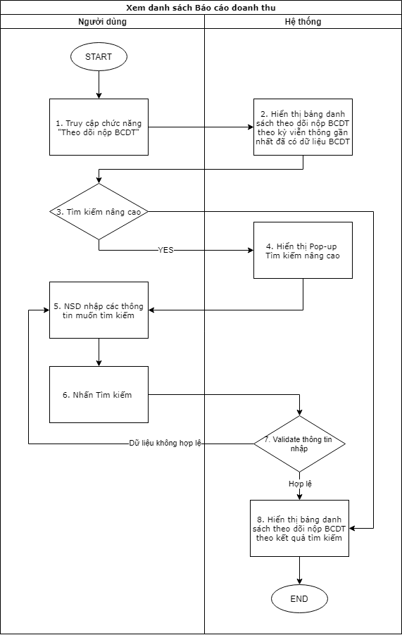

Mô tả luồng xử lý

Bước

Mô tả

Bước 1

NSD truy cập chức năng Theo dõi nộp BCDT trong module Quản lý BCDT trên hệ thống quản lý nghiệp vụ và báo cáo thu phí, lệ phí viễn thông.

Bước 2

Hệ thống mặc định hiển thị danh sách theo dõi nộp BCDT của tất cả doanh nghiệp có giấy phép CCDV tại kỳ viễn thông gần nhất đã có dữ liệu BCDT.

Bước 3

Nếu NSD muốn tìm kiếm dữ liệu BCDT theo nhiều tiêu chí khác => Nhấn button  trên giao diện “Theo dõi nộp BCDT”

- Nếu có, chuyển bước 4.

- Nếu không, chuyển bước 8.

Bước 4

Hệ thống hiển thị các tiêu chí tìm kiếm nâng cao.

Bước 5

NSD nhập thông tin muốn tìm kiếm.

Bước 6

Nhấn [Tìm kiếm].

Bước 7

Hệ thống kiểm tra điều kiện hợp lệ của dữ liệu tìm kiếm.

- Nếu hợp lệ, chuyển bước 8.

- Nếu không hợp lệ, quay lại bước 5. Hệ thống hiển thị “Không có dữ liệu” tại bảng khi không có kết quả tìm kiếm.

Bước 8

Hệ thống hiển thị bảng danh sách theo dõi nộp BCDT theo kết quả tìm kiếm NSD nhập.

Kết thúc luồng.

Giao diện chức năng

Giao diện tìm kiếm cơ bản

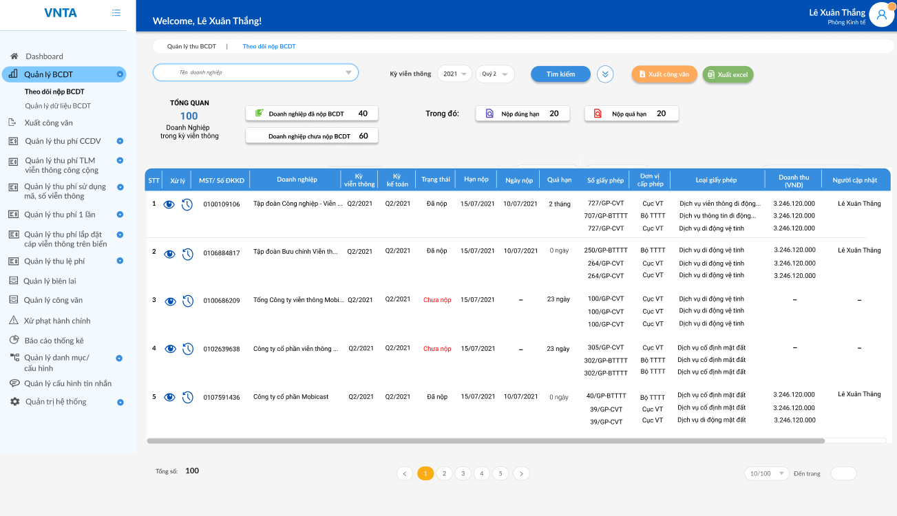

Giao diện tìm kiếm nâng cao

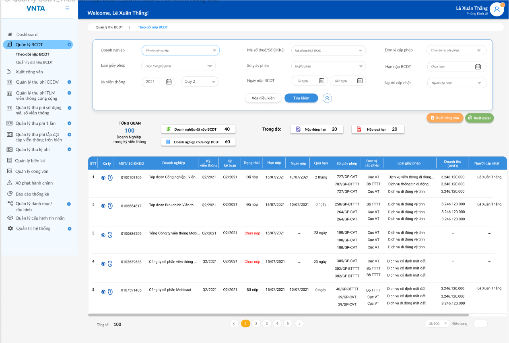

STT

Thông tin

Kiểu dữ liệu

Bắt buộc

Mô tả

Database

1

Tra cứu rút gọn

Tra cứu rút gọn

Tra cứu rút gọn

Tra cứu rút gọn

Tra cứu rút gọn

1.1

Tên doanh nghiệp

combobox search

- Chứa all DN có giấy phép CCDV (ko phân biệt Cục hay Bộ cấp)

- Cho phép người dùng nhập tên DN

- Autocomplete gõ nhập tên doanh nghiệp hệ thống tự động gợi ý

- Sắp xếp các option theo thứ tự Mã định danh tăng dần (quy định ngầm trong hệ thống khi thêm mới DN)

1.2

Năm

datepicker

x

- Mặc định hiển thị năm của kỳ BCDT có dữ liệu gần nhất

- Cho phép người dùng chọn năm

1.3

Quý

combobox

- Mặc định quý có BCDT có dữ liệu gần nhất (nếu ko có sẽ để trống)

- Gồm:

+ Quý 1

+ Quý 2

+ Quý 3

+ Quý 4

1.4

Icon Tìm kiếm nâng cao

Button

- Nhấn  hệ thống xổ xuống các tiêu chí Tìm kiếm nâng cao.

- Ngược lại khi hiển thị các tiêu chí nâng cao, nhấn icon  sẽ thu gọn lại.

1.5

Tìm kiếm

button

Tìm kiếm theo các trường thông tin tìm kiếm. Hệ thống hiển thị bảng danh sách bên dưới.

1.6

Xuất công văn

Button

Nhấn => hệ thống mở popup nhập thông tin xuất công văn

1.7

Xuất excel

button

Cho phép người dùng xuất file excel bảng danh sách đang hiển thị (trừ cột Xử lý)

2

Tìm kiếm nâng cao

Tìm kiếm nâng cao

Tìm kiếm nâng cao

Tìm kiếm nâng cao

Tìm kiếm nâng cao

2.1

Doanh nghiệp

combobox search

- Chứa all DN có giấy phép CCDV (ko phân biệt Cục hay Bộ cấp)

- Cho phép nhập tên doanh nghiệp

- Autocomplete

- Sắp xếp các option theo thứ tự Mã định danh tăng dần (quy định ngầm trong hệ thống khi thêm mới)

2.2

 Mã số thuế/Số ĐKKD

combobox search

- Chứa MST/ số ĐKKD của all DN có giấy phép CCDV

- Cho phép nhập Mã số thuế/ Số ĐKKD

- Autocomplete

2.3

Số giấy phép

combobox search

- Gồm tất cả giấy phép là Cung cấp dịch vụ viễn thông (ko phân biệt Cục hay Bộ cấp)

- Cho phép nhập số GP

- Autocomplete

2.4

Loại giấy phép

combobox

Cho phép NSD tìm kiếm theo tên loại giấy phép:

- Dịch vụ viễn thông cố định mặt đất

- Dịch vụ thông tin di động mặt đất

- Dịch vụ viễn thông cố định vệ tinh

- Dịch vụ viễn thông di động vệ tinh

- Dịch vụ viễn thông di động hàng hải

- Dịch vụ thông tin di động hàng không

2.5

 Đơn vị cấp phép

combobox

Cho phép chọn đơn vị cấp phép:
- Bộ Thông tin truyền thông

- Cục Viễn thông

2.6

Kỳ viễn thông

2.6.1

 Năm

datepicker

x

- Mặc định hiển thị năm của kỳ BCDT có dữ liệu gần nhất

- Cho phép người dùng chọn năm

2.6.2

Quý

combobox

- Mặc định quý có BCDT có dữ liệu gần nhất (nếu ko có sẽ để trống)

- Gồm:

+ Quý 1

+ Quý 2

+ Quý 3

+ Quý 4

2.7

Ngày nộp BCDT

datepicker

- Cho phép NSD tự nhập ngày nộp BCDT

- Định dạng dd/mm/yyyy

- Từ ngày – đến ngày

2.8

Hạn nộp BCDT

datepicker

- Cho phép NSD tự nhập hạn nộp BCDT

- Định dạng dd/mm/yyyy

2.9

Người cập nhật

combobox

- Gồm all Họ tên của tài khoản được phân quyền Quản lý dữ liệu BCDT

- Cho phép NSD chọn tên người cập nhật số liệu BCDT

2.10

Xóa điều kiện

Button

Nhấn [Xóa điều kiện], hệ thống xóa toàn bộ dữ liệu tiêu chí tìm kiếm đã nhập, giữ nguyên kết quả tìm kiếm

2.11

Tìm kiếm

Button

Nhấn [Tìm kiếm], hệ thống check hợp lệ của điều kiện tìm kiếm và trả về tổng quan + danh sách kết quả.

3

Tổng quan ... DN trong kỳ viễn thông

button

Hiển thị số lượng all DN phải nộp BCDT theo kỳ viễn thông đang tra cứu.

Nhấn chuột vào số lượng => bảng danh sách sẽ hiển thị danh sách các DN tương ứng.

4

DN đã nộp báo cáo

button

Hiển thị số lượng DN có trạng thái “đã nộp” trong kỳ viễn thông đang tra cứu.

Nhấn chuột vào đây bảng danh sách sẽ hiển thị danh sách các DN tương ứng.

5

Nộp đúng hạn

button

Hiển thị số lượng DN có Trạng thái “đã nộp” và Quá hạn bằng “0” trong kỳ viễn thông đang tra cứu.

Nhấn chuột vào đây bảng danh sách sẽ hiển thị danh sách các DN tương ứng.

6

Nộp quá hạn

button

Hiển thị số lượng DN có Trạng thái “đã nộp” và Quá hạn khác “0” trong kỳ viễn thông đang tra cứu.

Nhấn chuột vào đây bảng danh sách sẽ hiển thị danh sách các DN tương ứng.

7

Tổng số đơn vị chưa nộp

button

Hiển thị số lượng DN có trạng thái “chưa nộp” trong kỳ viễn thông đang tra cứu.

Nhấn chuột vào đây bảng danh sách sẽ hiển thị danh sách các DN tương ứng.

8

Grid danh sách

Grid danh sách

Grid danh sách

Grid danh sách

Grid danh sách

8.1

STT

Number

Hiển thị STT

8.2

Xử lý

button

Bao gồm chức năng Xem chi tiết BCDT và Xem lịch sử chỉnh sửa BCDT

8.2.1

  

(Xem chi tiết)

button

Nhấn để hệ thống chuyển sang màn Quản lý dữ liệu BCDT, cho phép xem chi tiết dữ liệu BCDT của DN trong kỳ viễn thông tương ứng.

8.2.2

  

(Xem lịch sử chỉnh sửa)

button

Nhấn => hệ thống mở popup Lịch sử chỉnh sửa báo cáo doanh thu (bắt đầu lưu từ khi thêm mới BCDT thành công)

8.3

MST/Số ĐKKD

Number

Hiển thị mã số thuế và số đăng ký kinh doanh của DN

8.4

Doanh nghiệp

Text

Hiển thị tên DN

8.5

Kỳ viễn thông

Text

Định dạng hiển thị:

--	“Qx/yyyy” đối với kỳ quý

--	“yyyy” đối với kỳ năm

8.6

Kỳ kế toán

Text

Định dạng hiển thị:

--	Qx/yyyy đối với kỳ quý

--	yyyy đối với kỳ năm

8.7

Trạng thái

Text

Hiển thị “Chưa nộp” hoặc “Đã nộp”

- Đã nộp: Font chữ màu đen, (khi 1 trong 3 phụ lục + phụ lục 05)

- Chưa nộp: Font chữ màu đỏ, (khi chưa có 1 trong 3 phụ lục + phụ lục 5)

8.8

Hạn nộp

Date

- Hiển thị hạn nộp ghi trên công văn thông báo nộp BCDT

- Trường hợp xuất công văn cho 1 or nhiều Doanh nghiệp của Qúy:

Hệ thống ăn theo ghi nhận hạn của all các DN trong quý đó giống nhau

- Trường hợp xuất công văn cho 1 or nhiều DN của Năm:

Hệ thống ăn theo ghi nhận hạn của all các DN trong năm đó có cùng kỳ kế toán

8.9

Ngày nộp

Date

- Ngày doanh nghiệp nộp BCDT

- Nếu chưa có ngày nộp sẽ hiển thị dấu “-”

8.10

Quá hạn

Text

Số ngày quá hạn nộp BCDT tính từ hạn nộp

- Nếu chưa quá hạn hiển thị 0 ngày

- Nếu < 1 tháng: hiển thị số ngày (VD: 3 ngày) tính từ sau ngày hết hạn

- Nếu 1-2 tháng: hiển thị 1 tháng

- Nếu 2-3 tháng: hiển thị 2 tháng

…

- Nếu 1-2 năm: hiển thị 1 năm

...

8.11

Số giấy phép

Text

Số giấy phép cung cấp dịch vụ viễn thông đã cấp phép

8.12

Đơn vị cấp phép

Text

Đơn vị cấp phép:
- Bộ Thông tin và Truyền thông

- Cục Viễn thông

8.13

Loại giấy phép

Text

Hiển thị loại giấy phép

8.14

Doanh thu

Currency

- Doanh thu của DN

- Số nguyên, ngăn cách phần nghìn bằng dấu “.”

- Đơn vị VNĐ

- Công thức tính BCDT như sau: Cộng tương ứng các mục 1,2,3,4,5,6 của các Phụ lục tại các cột (Phụ lục 1 - cột Tổng số, Phụ lục 2 - cột Chênh lệch, Phụ lục 3 - cột Chênh lệch).

- Nếu chưa có Doanh thu sẽ hiển thị dấu “-”

- Ghi nhận cả doanh thu âm

8.15

Người cập nhật

Text

Tên người cập nhật BCDT gần nhất

- Nếu chưa có Người cập nhật sẽ hiển thị dấu “-”

Xem chi tiết BCDT

Luồng chức năng

Thông tin chung

Tên chức năng

Xem chi tiết Báo cáo doanh thu

Mô tả

Chức năng cho phép cán bộ xem chi tiết dữ liệu Báo cáo doanh thu theo từng kỳ báo cáo của mỗi doanh nghiệp (bản cập nhật mới nhất)

Tác nhân

Cán bộ Phòng Kinh tế

Điều kiện trước

Nhấn vào icon tại giao diện danh sách Theo dõi nộp BCDT

Điều kiện sau

Hiển thị chi tiết dữ liệu BCDT (bản cập nhật mới nhất)

Ngoại lệ

N/A

Các yêu cầu đặc biệt

N/A

Luồng quy trình

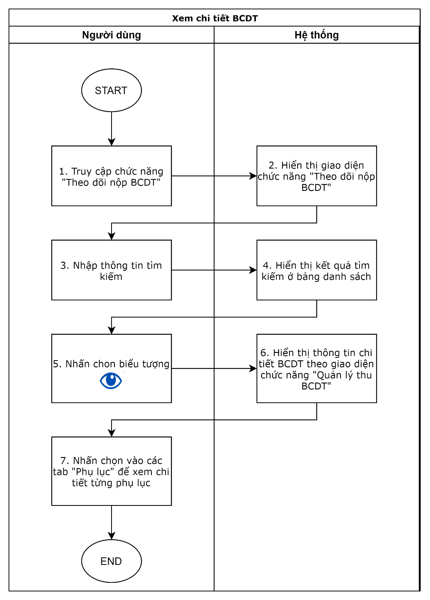

Mô tả luồng xử lý

Bước

Mô tả

Bước 1

NSD truy cập chức năng Theo dõi nộp BCDT trong module Quản lý BCDT trên hệ thống quản lý nghiệp vụ và báo cáo thu phí, lệ phí viễn thông.

Bước 2

Hệ thống mặc định hiển thị danh sách theo dõi nộp BCDT của tất cả doanh nghiệp có giấy phép CCDV tại kỳ viễn thông gần nhất đã có dữ liệu BCDT.

Bước 3

NSD nhấn button  trên giao diện “Theo dõi nộp BCDT”. Hệ thống hiển thị pop-up tìm kiếm nâng cao => NSD nhập thông tin muốn tìm kiếm. Nhấn [Tìm kiếm].

Bước 4

Hệ thống hiển thị bảng danh sách theo dõi nộp BCDT theo kết quả tìm kiếm.

Bước 5

NSD nhấn  để xem chi tiết dữ liệu BCDT theo từng doanh nghiệp.

Bước 6

Hệ thống chuyển sang màn “Quản lý dữ liệu BCDT” => hiển thị chi tiết số liệu BCDT theo từng phụ lục.

Bước 7

NSD nhấn chọn từng tab phụ lục (phụ lục 1/2/3/4/5) để xem chi tiết số liệu từng phụ lục.

Kết thúc luồng.

Giao diện chức năng

Reference đến mục 1.2/1.2.1: Thêm mới BCDT

Xem lịch sử chỉnh sửa báo cáo doanh thu

Luồng chức năng

Thông tin chung

Tên chức năng

Xem lịch sử chỉnh sửa Báo cáo doanh thu

Mô tả

Chức năng cho phép cán bộ xem toàn bộ các lưu vết thay đổi trên một dữ liệu Báo cáo doanh thu của DN (Thêm mới/Sửa/Xóa)

Tác nhân

Cán bộ Phòng Kinh tế

Điều kiện trước

Nhấn vào icon  tại giao diện “Theo dõi nộp BCDT”

Điều kiện sau

Hiển thị popup Lịch sử chỉnh sửa BCDT

Ngoại lệ

N/A

Các yêu cầu đặc biệt

N/A

Luồng quy trình

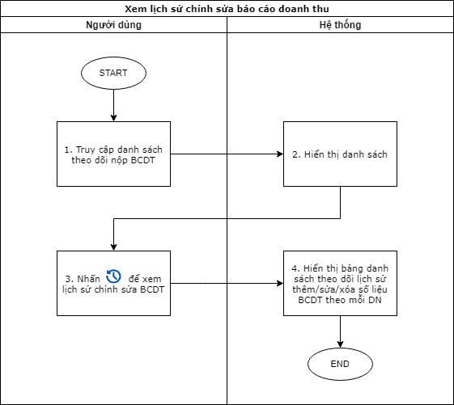

Mô tả luồng xử lý

Bước

Mô tả

Bước 1

NSD truy cập chức năng Theo dõi nộp BCDT trong module Quản lý BCDT trên hệ thống quản lý nghiệp vụ và báo cáo thu phí, lệ phí viễn thông.

Bước 2

Hệ thống mặc định hiển thị danh sách theo dõi nộp BCDT của tất cả doanh nghiệp có giấy phép CCDV tại kỳ viễn thông gần nhất đã có dữ liệu BCDT.

Bước 3

NSD nhấn  để xem lịch sử chỉnh sửa BCDT.

Bước 4

Hệ thống hiển thị pop-up là bảng danh sách theo dõi lịch sử chỉnh sửa BCDT ghi chi tiết lý do kèm các theo tác thêm mới/cập nhật/xóa số liệu BCDT của mỗi DN.

Giao diện chức năng

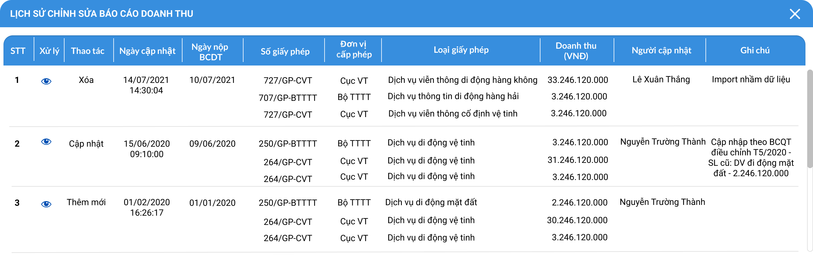

STT

Tên

Kiểu dữ liệu

Bắt buộc

Mô tả

Database

Grid danh sách

Grid danh sách

Grid danh sách

Grid danh sách

Grid danh sách

1

STT

Number

Hiển thị số thứ tự

2

Xử lý

Button

(Nhấn button để Xem chi tiết dữ liệu BCDT tại từng phiên bản chỉnh sửa)

Nhấn để hệ thống chuyển sang màn Quản lý dữ liệu BCDT tương ứng, cho phép xem chi tiết dữ liệu BCDT tương ứng

3

Thao tác

Text

Hệ thống tự động cập nhật trạng thái thao tác của NSD khi NSD thêm mới/chỉnh sửa/xóa BCDT.

4

Ngày cập nhật

Date

Hệ thống tự động cập nhật ngày và giờ chính xác khi NSD thao tác trên dữ liệu BCDT.

Giờ định dạng hh:mm:ss

Ngày định dạng dd/mm/yyyy.

5

Ngày nộp

Date

Hiển thị ngày DN nộp BCDT theo định dạng dd/mm/yyyy.

6

Số giấy phép

Text

Hiển thị all số giấy phép cung cấp dịch vụ viễn thông của doanh nghiệp trong kỳ

7

Đơn vị cấp phép

Text

Hiển thị đơn vị cấp phép của mỗi giấy phép: Bộ Thông tin Truyền thông hoặc Cục Viễn thông

8

Loại giấy phép

Text

Hiển thị loại giấy phép theo từng số giấy phép:

- Dịch vụ viễn thông cố định mặt đất

- Dịch vụ viễn thông di động mặt đất

- Dịch vụ viễn thông cố định vệ tinh

- Dịch vụ viễn thông di động vệ tinh

- Dịch vụ viễn thông di động hàng hải

- Dịch vụ thông tin di động hàng không

9

Doanh thu

Currency

Hiển thị doanh thu đã tính tổng theo từng loại giấy phép tại từng phiên bản. Đơn vị (VNĐ)

10

Người cập nhật

Text

Hiển thị họ tên người cập nhật số liệu BCDT

11

Ghi chú

Text

- Lý do sửa/xóa dữ liệu BCDT gồm: DN cập nhật số liệu, Do người dùng cập nhật sai, …

- Hiển thị 30 ký tự còn lại hiển thị tooltip.

Xem chi tiết lịch sử chỉnh sửa BCDT

Luồng chức năng

Thông tin chung

Tên chức năng

Xem chi tiết lịch sử chỉnh sửa BCDT

Mô tả

Chức năng cho phép cán bộ P. Kinh tế xem chi tiết dữ liệu BCDT của từng phiên bản chỉnh sửa tại các thời điểm khác nhau.

Tác nhân

Cán bộ Phòng Kinh tế

Điều kiện trước

Nhấn vào icon tại giao diện “Lịch sử chỉnh sửa BCDT”

Điều kiện sau

N/A

Ngoại lệ

N/A

Các yêu cầu đặc biệt

N/A

Luồng quy trình

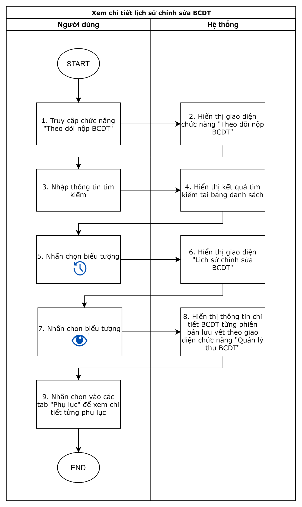

Mô tả luồng xử lý

Bước

Mô tả

Bước 1

NSD truy cập chức năng Theo dõi nộp BCDT trong module Quản lý BCDT trên hệ thống quản lý nghiệp vụ và báo cáo thu phí, lệ phí viễn thông.

Bước 2

Hệ thống mặc định hiển thị danh sách theo dõi nộp BCDT của tất cả doanh nghiệp có giấy phép CCDV tại kỳ viễn thông gần nhất đã có dữ liệu BCDT.

Bước 3

NSD nhấn button  trên giao diện “Theo dõi nộp BCDT”. Hệ thống hiển thị các tiêu chí tìm kiếm nâng cao => NSD nhập thông tin muốn tìm kiếm. Nhấn [Tìm kiếm].

Bước 4

Hệ thống hiển thị bảng danh sách theo dõi nộp BCDT theo kết quả tìm kiếm.

Bước 5

NSD nhấn  để xem lịch sử chỉnh sửa BCDT.

Bước 6

Hệ thống hiển thị pop-up là bảng danh sách theo dõi lịch sử chỉnh sửa BCDT ghi chi tiết lý do kèm các theo tác thêm mới/cập nhật/xóa số liệu BCDT của mỗi DN.

Bước 7

NSD nhấn  => hệ thống chuyển sang màn “Quản lý dữ liệu BCDT”

Bước 8

Hệ thống hiển thị chi tiết số liệu từng phiên bản lưu vết cập nhật BCDT

Bước 9

NSD nhấn chọn từng tab phụ lục (phụ lục 1/2/3/4/5) để xem chi tiết số liệu từng phụ lục.

Kết thúc luồng.

Giao diện chức năng

Reference đến mục 1.2/1.2.1: Thêm mới BCDT

Đối với các bản lưu vết cũ => hệ thống disable các button Import, Lưu, Xóa, Hủy, Ngày nộp báo cáo, File đính kèm

Xuất công văn

Luồng chức năng

Thông tin chung

Tên chức năng

Xuất công văn

Mô tả

Chức năng cho phép cán bộ P. Kinh tế xuất các loại công văn gửi tới DN, công văn gửi 3 phòng hoặc gửi P. TTPC

Tác nhân

Cán bộ Phòng Kinh tế

Điều kiện trước

Đăng nhập vào hệ thống, có phân quyền chức năng

Điều kiện sau

Xuất công văn thành công

Ngoại lệ

N/A

Các yêu cầu đặc biệt

N/A

Luồng quy trình

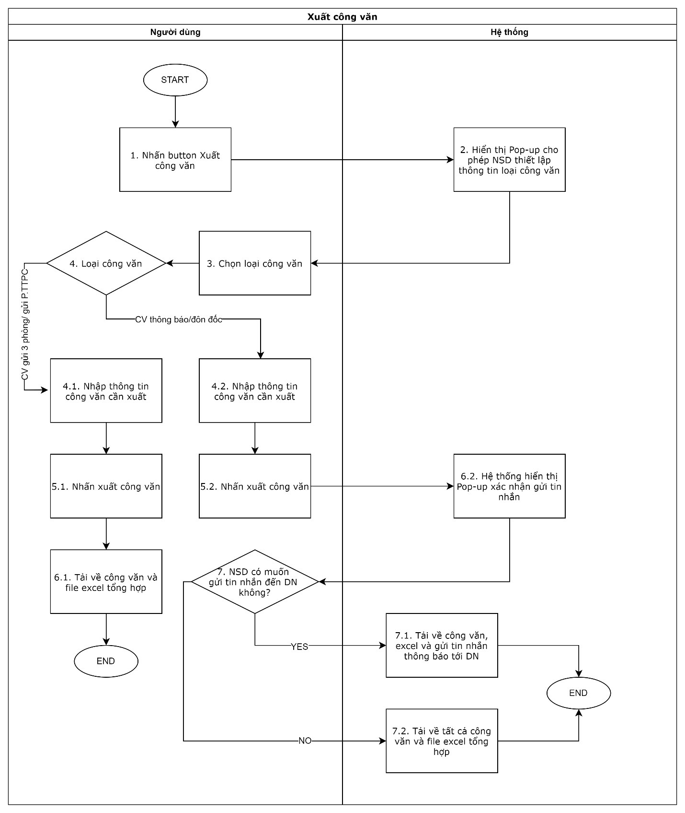

Mô tả luồng xử lý

Bước

Mô tả

Bước 1

NSD nhấn button [Xuất công văn] tại giao diện “Theo dõi nộp BCDT” thuộc module “Quản lý BCDT”.

Bước 2

Hệ thống hiển thị pop-up cho phép NSD nhập thông tin xuất công văn theo từng loại công văn.

Bước 3

Tại popup, hệ thống focus mặc định vào trường đầu tiên (trường [Loại công văn]). NSD tiến hành chọn loại công văn cần xuất.

Bước 4

- Nếu NSD chọn công văn thông báo/đôn đốc nộp BCDT, chuyển bước 4.2

- Nếu NSD chọn công văn gửi 3 phòng/công văn gửi phòng TTPC, chuyển bước 4.1

Bước 4.1

NSD tiếp tục nhập thông tin công văn cần xuất tại các trường nhập dữ liệu. Chuyển sang bước 5.1

Bước 4.2

NSD tiếp tục nhập thông tin công văn cần xuất tại các trường nhập dữ liệu. Chuyển sang bước 5.2

Bước 5.1

Nhấn button [Xuất công văn]. Chuyển sang bước 6.1

Bước 5.2

Nhấn button [Xuất công văn]. Chuyển sang bước 6.2

Bước 6.1

Hệ thống tự động tải về file công văn và file excel tổng hợp danh sách.

Tên file công văn:

CV Thông báo thời hạn nộp:

Tên file công văn:

[STT]_Về việc thông báo thời hạn nộp BCDT [Kỳ] của [Tên Doanh nghiệp]

(đánh STT đầu các công văn gửi các DN, thứ tự các DN sắp xếp tặng dần theo Mã định danh)

Ví dụ: 1. Về việc thông báo thời hạn nộp BCDT Quý I năm 2021 của Tập đoàn viễn thông quân đội

Tên file excel đính kèm: [Ngày xuất công văn]_Danh sách DN phải nộp BCDT [Kỳ]

(thứ tự các DN sắp xếp tặng dần theo Mã định danh)

CV Thông báo vi phạm thời hạn:

Tên file công văn:

[STT]_Về việc vi phạm thời hạn nộp BCDT [Kỳ] của [Tên Doanh nghiệp]

(đánh STT đầu các công văn gửi các DN, thứ tự các DN sắp xếp tặng dần theo Mã định danh)

Ví dụ: 1. Về việc vi phạm thời hạn nộp BCDT Qúy I năm 2021 của Tập đoàn viễn thông quân đội

Tên file excel xuất kèm: [Ngày xuất công văn]_Danh sách DN chưa nộp BCDT [Kỳ]

(thứ tự các DN sắp xếp tặng dần theo Mã định danh)

Cv gửi 03 phòng ban:

Tên file công văn: [Ngày xuất công văn]_Cv gửi 03 phòng ban doanh thu [Kỳ]

Ví dụ: 05/05/2021_Cv gửi 03 phòng ban doanh thu Quý I năm 2021

Tên file excel xuất kèm: [Ngày xuất công văn]_Số liệu tổng hợp BCDT [Kỳ]

Cv gửi Thanh tra:

Tên file công văn: [Ngày xuất công văn]_Cv gửi P.TT Doanh nghiệp chưa nộp BCDT [Kỳ]

Ví dụ: 06/05/2021_Cv gửi P.TT Doanh nghiệp chưa nộp BCDT Qúy I năm 2021

Tên file excel đính kèm: [Ngày xuất công văn]_Danh sách Doanh nghiệp chưa nộp BCDT [Kỳ] gửi P. TT

[Ngày xuất công văn]: Ngày thực hiện xuất công văn trệ hệ thống

Kết thúc luồng.

Bước 6.2

Hệ thống hiển thị pop-up xác nhận gửi tin nhắn đến DN:

Bước 7

NSD xác nhận gửi tin nhắn đến DN:

- Nhấn [Có] => chuyển sang bước 7.1

- Nhấn [Không], chuyển sang bước 7.2

Bước 7.1

Hệ thống ghi nhận thao tác gửi tin nhắn đến DN đồng thời tải về file công văn và file excel tổng hợp danh sách.

Kết thúc luồng.

Bước 7.2

Hệ thống ghi nhận thao tác tải về file công văn và file excel tổng hợp danh sách.

Kết thúc luồng.

Giao diện chức năng

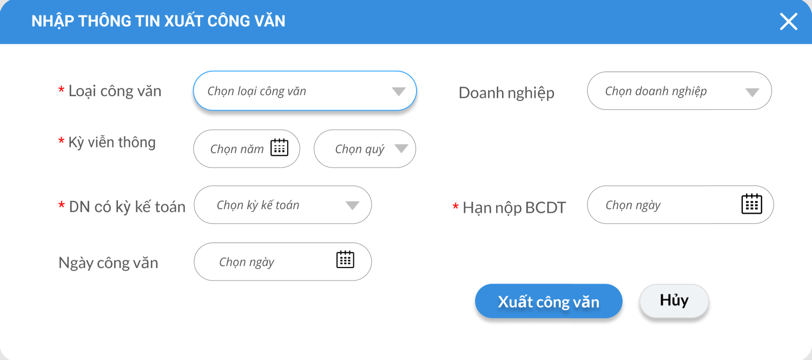

STT

Tên

Kiểu dữ liệu

Bắt buộc

Mô tả

Database

1

Loại công văn

Combobox

x

- Cho phép người dùng chọn loại công văn cần xuất

+ Công văn thông báo thời hạn nộp BCDT

+ Công văn thông báo vi phạm thời hạn BCDT

+ Công văn gửi 03 phòng ban

+ Công văn gửi P. Thanh tra

- Mặc định focus vào trường đầu tiên

2

Doanh nghiệp

Combobox search

- Gồm all DN có giấy phép CCDV

- Mặc định là Tất cả

- Cho phép chọn 1 or nhiều

- Autocomplete

3

Kỳ viễn thông

3.1

Năm

Datepicker

 x

- Cho phép chọn năm

3.2

Quý

Combobox

- Nếu chọn Quý = ẩn trường [DN có Kỳ kế toán]

- Gồm: Quý 1/Quý 2/Quý 3/ Quý 4.

- Sắp xếp từ Quý 1 - Quý 4

- Cho phép NSD chọn 1 Quý

4

DN có kỳ kế toán

Combobox

 x

- Cho phép NSD chọn kỳ kế toán cho những doanh nghiệp có kỳ kế toán đặc biệt, gồm:

+ Từ 01/01 đến 31/12

+ Từ 01/04 đến 31/03 năm sau

+ Từ 01/07 đến 31/06 năm sau

+ Từ 01/10 đến 31/09 năm sau

- Lưu ý: nếu NSD chọn Quý trước thì trường “DN có kỳ kế toán” sẽ bị ẩn khỏi pop-up Xuất công văn.

- Khi chọn Loại công văn là CV gửi 03 phòng ban or cv gửi P. Thanh tra sẽ ẩn trường này

5

Hạn nộp BCDT

Datepicker

x

- Cho phép NSD chọn hạn nộp BCDT sẽ hiển thị trên công văn

- Cho phép NSD tự nhập hạn nộp BCDT

- Định dạng dd/mm/yyyy

- Khi chọn Loại công văn là CV gửi 03 phòng ban or cv gửi P. Thanh tra sẽ ẩn trường này

6

Ngày công văn

Datepicker

- Cho phép NSD chọn ngày công văn

- Cho phép NSD tự nhập ngày công văn.

- Định dạng dd/mm/yyyy

7

Xuất công văn

Button

- Đối với Loại công văn là Thông báo thời hạn nộp: Hệ thống check chỉ xuất đối với những DN chưa có BCDT (trạng thái chưa nộp). Nếu chọn DN đã có BCDT để xuất => khi nhấn xuất cv hệ thống thông báo: “Vui lòng chọn Doanh nghiệp chưa nộp BCDT để xuất công văn thông báo thời hạn nộp!” Nếu chọn nhiều hơn 1 DN để xuất (trong đó có cả DN đã nộp và DN chưa nộp => xuất đối với DN chưa nộp)

- Cv thông báo thời hạn/thông báo vi phạm: Nếu chọn DN đều ko phải nộp phí trong kỳ => khi nhấn xuất cv hệ thống thông báo: “Vui lòng chọn Doanh nghiệp phải nộp BCDT để xuất công văn thông báo thời hạn nộp!”

- Đối với Loại công văn là Thông báo vi phạm => Có thể xuất khi chưa hết hạn nộp phí => sẽ xuất ra công văn của all DN có trạng thái “Chưa nộp”

- Đối với công văn thông báo vi phạm nếu chọn DN đã có BCDT để xuất => khi nhấn xuất cv hệ thống thông báo: “Vui lòng chọn Doanh nghiệp chưa nộp BCDT để xuất công văn thông báo vi phạm thời hạn nộp!” Nếu chọn nhiều hơn 1 DN để xuất (trong đó có cả DN đã nộp và DN chưa nộp => xuất đối với DN chưa nộp)

- Đối với Loại công văn là cv gửi 03 phòng ban, cv gửi phòng Thanh tra => ko cần hết hạn mới được xuất

- Đối với Loại công văn là Thông báo thời hạn nộp và Thông báo vi phạm => Nhấn hệ thống hiển thị pop-up xác nhận gửi tin nhắn

- Đối với 2 công văn còn lại (cv gửi 3 Phòng và cv gửi P. TTPC) sẽ xuất file cv và file excel đính kèm, không hiển thị popup xác nhận gửi tin nhắn

- Tất cả các file excel đính kèm công văn đều gồm all DN phải nộp BCDT trong kỳ (all gp của Bộ và Cục cấp), trừ TH nếu chọn cụ thể DN nào file đính kèm sẽ chỉ có DN đó

8

Hủy

Button

Nhấn => hệ thống đóng popup thiết lập thông tin công văn đồng thời ghi nhận hủy thao tác xuất công văn, quay lại màn hình Theo dõi nộp BCDT.

	

STT

Tên

Kiểu dữ liệu

Bắt buộc

Mô tả

Database

Pop-up xác nhận gửi tin nhắn

Pop-up

- Sau khi NSD nhấn Xuất công văn từ giao diện thiết lập thông tin xuất công văn (Loại công văn là Thông báo thời hạn nộp và Thông báo vi phạm), hệ thống hiển thị pop-up xác nhận việc gửi tin nhắn tới tất cả các DN: Bạn có muốn gửi tin nhắn thông báo đến doanh nghiệp không?

1

Có

Button

Nhấn có => hệ thống tự động tải về tệp zip bao gồm tất cả công văn gửi tới doanh nghiệp, file excel tổng hợp danh sách đồng thời gửi tin nhắn thông báo/đôn đốc đến all DN đã chọn.

2

Không

Button

Nhấn [Không] => hệ thống chỉ tải về tệp zip bao gồm tất cả công văn thông báo/đôn đốc gửi tới doanh nghiệp, file excel tổng hợp danh sách và không gửi tin nhắn

Quản lý dữ liệu BCDT

Thêm mới BCDT

Luồng chức năng

Thông tin chung

Tên chức năng

Thêm mới BCDT (Import BCDT)

Mô tả

Chức năng cho phép NSD import dữ liệu BCDT của từng doanh nghiệp lên hệ thống.

Tác nhân

Cán bộ Phòng Kinh tế

Điều kiện trước

Đăng nhập vào hệ thống, có phân quyền chức năng

Điều kiện sau

Thêm mới BCDT thành công

Ngoại lệ

N/A

Các yêu cầu đặc biệt

N/A

Luồng quy trình

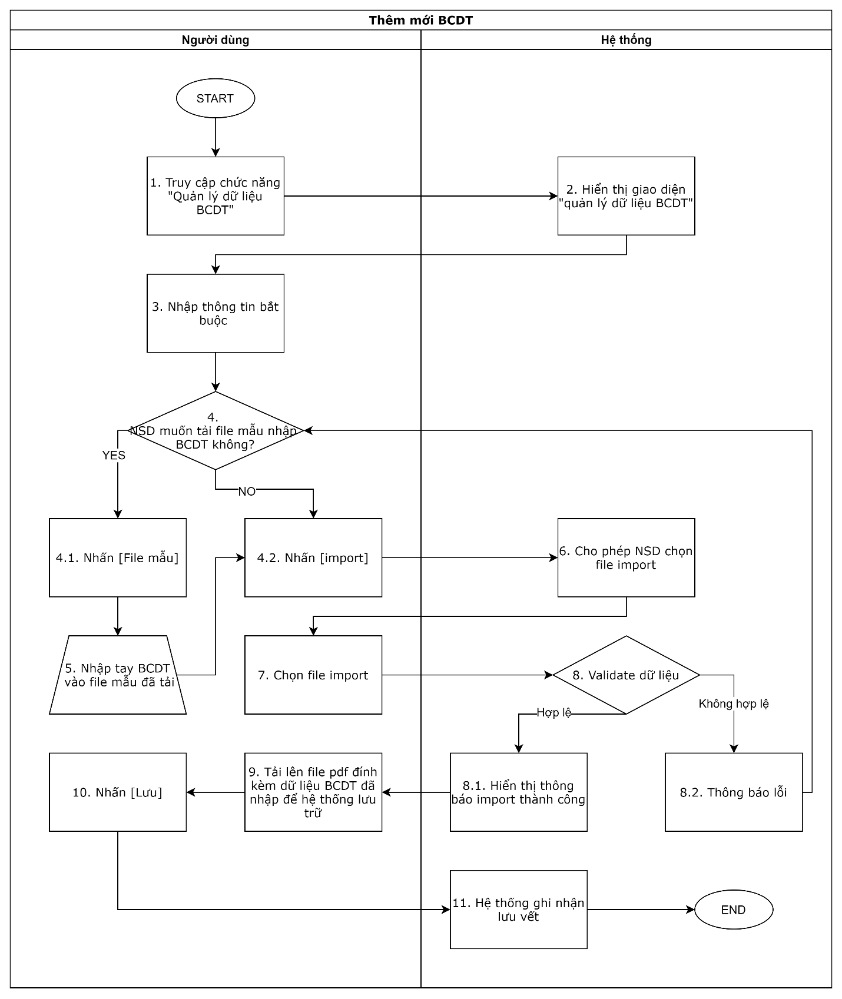

Mô tả luồng xử lý

Bước

Mô tả

Bước 1

NSD truy cập chức năng “Quản lý dữ liệu BCDT” trong module “Quản lý BCDT” tại hệ thống quản lý nghiệp vụ và báo cáo thu phí, lệ phí viễn thông.

Bước 2

Hệ thống mặc định hiển thị BCDT của doanh nghiệp có mã định danh nhỏ nhất trong kỳ gần nhất đã có dữ liệu BCDT.

Bước 3

NSD nhập thông tin bắt buộc trước khi thêm mới dữ liệu BCDT: tên doanh nghiệp, kỳ viễn thông, ngày nộp BCDT

Bước 4

NSD có thể import file excel dữ liệu BCDT lên hệ thống hoặc tải về file mẫu cho phép tự nhập dữ liệu tại máy tính:

- Nếu tài về file mẫu, chuyển sang bước 4.1

- Nếu import, chuyển sang bước 4.2

Bước 4.1

Nhấn [File mẫu] tại màn hình giao diện trên hệ thống => hệ thống tự động tải về file excel mẫu BCDT. Chuyển sang bước 5.

Bước 4.2

Nhấn [Import] tại màn hình giao diện trên hệ thống => Thực hiện import file gồm 05 sheet phụ lục theo các tên được quy định (Phụ lục 1, Phụ lục 2, Phụ lục 3, Phụ lục 4, Phụ lục 5). Chuyển sang bước 6.

Bước 5

NSD nhập tay BCDT vào file excel mẫu đã tải về máy. Sau khi nhập xong tiến hành lưu lại dữ liệu tại máy. Chuyển sang bước 4.2

Bước 6

Hệ thống hiển thị cửa sổ cho phép NSD chọn file import. Chuyển sang bước 7.

Bước 7

NSD tiến hành chọn file muốn import dữ liệu BCDT trong máy tính.

Bước 8

Hệ thống tiến hành kiểm tra tính hợp lệ của dữ liệu import.

- Nếu hợp lệ, chuyển sang bước 8.1

- Nếu không hợp lệ, chuyển sang bước 8.2

Bước 8.1

Hệ thống hiển thị thông báo “Import dữ liệu thành công. Vui lòng xem lại dữ liệu và nhấn Lưu để xác nhận”.

Từ dữ liệu file import vào hệ thống => hệ thống check cộng dồn cấp con đến cấp cha (hệ thống ko tự động cộng để fill dữ liệu, chỉ check và báo lỗi).

Định dạng: Dấu “.” ngăn cách hàng nghìn.

Chuyển sang bước 9.

Bước 8.2

Hệ thống thông báo lỗi:

- Định dạng file không đúng! Khi định dạng file không phải excel or ko đúng với file mẫu

- Tên sheet [n] không đúng! Khi tên sheet sai

- Vui lòng kiểm tra lại dữ liệu. Doanh nghiệp không có giấy phép [Tên loại giấy phép] trong [Kỳ]! Khi DN ko có gp có hiệu lực trong Kỳ nhưng lại có số liệu BCDT

- Doanh thu [Tên loại giấy phép] không được bỏ trống (Doanh nghiệp có giấy phép trong [Kỳ])! Khi DN có giấy phép nhưng dữ liệu BCDT của dịch vụ đó để trống

- [Tên phụ lục - Cột [Tên cột] - Dòng [STT dòng] dữ liệu không hợp lệ! Khi số liệu không hợp lệ

Ví dụ: Phụ lục 1 - Cột Tổng - Dòng 1/1.1/a dữ liệu không hợp lệ.

Quay lại bước 4.

Bước 9

NSD tải lên file pdf BCDT để đính kèm lên hệ thống cho phép hệ thống lưu lại dữ liệu.

Bước 10

Nhấn [Lưu]

- Mặc định disable. Khi có hành động import file thành công, cập nhật Ngày nộp bc, cập nhật file đính kèm => enable button [Lưu]

- Nhấn [Lưu] => Hệ thống check và báo lỗi khi các trường thông tin bắt buộc để trống với cú pháp: [Tên trường] là trường bắt buộc

Bước 11

Hệ thống ghi nhận lưu vết thao tác “Thêm mới” dữ liệu BCDT. Cập nhật chính xác ngày giờ và tên người cập nhật tại thời điểm import thành công.

Kết thúc luồng.

Giao diện chức năng

Phụ lục 1

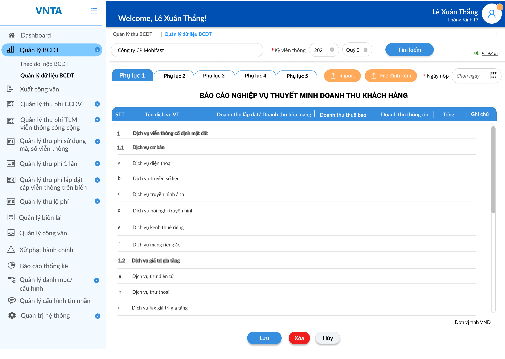

Giao diện khi nhấn vào button File đính kèm (khi đã có file đính kèm thành công)

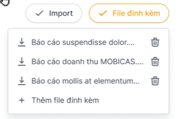

Giao diện khi nhấn button Import (khi đã có file import thành công)

STT

Tên

Kiểu

dữ liệu

Bắt buộc

Mô tả

Database

1

Doanh nghiệp

Combobox search

x

- Mặc định chọn DN đầu tiên trong ds DN phải nộp BCDT của kỳ (sx theo Mã định danh ngầm)

- Cho phép chọn 1 DN

- Autocomplete

- Dữ liệu BCDT các phụ lục sẽ tự động hiển thị tương ứng khi chọn DN

2

Kỳ viễn thông

2.1

Năm

Datepicker

x

- Mặc định hiển thị năm của kỳ có BCDT gần nhất có dữ liệu

- Cho phép người dùng chọn năm

2.2

Qúy

Combobox

- Mặc định là Qúy có dữ liệu BCDT gần nhất (nếu ko có sẽ để trống)

- Gồm:

 + Quý I

 + Quý II

 + Quý III

 + Quý IV

- Dữ liệu BCDT các phụ lục sẽ tự động hiển thị tương ứng khi chọn DN, kỳ BC

3

Tìm kiếm

Button

Nhấn để tìm kiếm

4

Ngày nộp BC

Datepicker

x

Ngày DN nộp BCDT

5

Tải file đính kèm

Button

x

- Định dạng: pdf

- Dưng lượng tối đa <= 15MB

6

File mẫu

Link

- Nhấn hệ thống tải file mẫu về máy

7

Import

Button

- Nhấn "Import" hệ thống cho phép NSD chọn file import tương ứng. Import đồng thời 5 sheet trong file lên hệ thống

8

Lưu

Button

Nhấn để Lưu dữ liệu

- Mặc định disable. Khi có hành động import file thành công, cập nhật Ngày nộp bc, cập nhật file đính kèm => enable button [Lưu]

9

Xóa

Button

Xóa toàn bộ dữ liệu đã nhập/ import và file import tương ứng của bản cập nhật gần nhất

10

Hủy

Button

Hủy thao tác nhập dữ liệu

- Mặc định disable. Khi có hành động import file thành công, cập nhật Ngày nộp bc, cập nhật file đính kèm => enable button [Hủy]

- Hủy sẽ quay lại thao tác trước đó

11

Phụ lục

tab

Danh sách 05 phụ lục của BCDT cần nhập lên HT. NSD nhấn chọn vào 1 phụ lục -> hệ thống hiển thị màn nhập thông tin, các trường thông tin sẽ tương ứng vs phụ lục đã chọn.

Phụ lục 1

1

Tên phụ lục 1

text (readonly)

Chọn tab Phụ lục 1 => HT hiển thị tên phụ lục: "Báo cáo nghiệp vụ thuyết minh doanh thu khách hàng"

2

STT

number

STT theo đúng mẫu phụ lục 1

3

Tên dịch vụ viễn thông

text

HT hiển thị danh sách tất cả các dịch vụ viễn thông theo mẫu phụ lục 1

4

Doanh thu lắp đặt/doanh thu hòa mạng

currency

- Maxlength: 20 ký tự

- Nhập doanh thu tương ứng với từng loại dịch vụ

- Số nguyên, ngăn cách phần nghìn bằng dấu “.”

5

Doanh thu thuê bao

currency

- Maxlength: 20 ký tự

- Nhập doanh thu tương ứng với từng loại dịch vụ

- Số nguyên, ngăn cách phần nghìn bằng dấu “.”

6

Doanh thu thông tin

currency

- Maxlength: 20 ký tự

- Nhập doanh thu tương ứng với từng loại dịch vụ

- Số nguyên, ngăn cách phần nghìn bằng dấu “.”

7

Tổng

currency

- Maxlength: 20 ký tự

- Nhập tổng doanh thu tương ứng với từng loại dịch vụ

- Báo lỗi nếu số liệu nhập vào # tổng các cấp con cộng lại

- Số nguyên, ngăn cách phần nghìn bằng dấu “.”

8

Ghi chú

textbox

-  Maxlength: 500 ký tự

- Nhập ghi chú thêm (nếu có)

Phụ lục 2

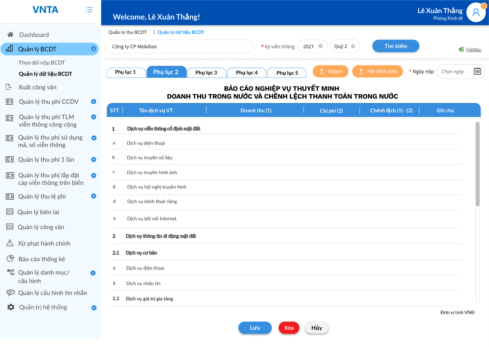

1

Tên phụ lục 2

text (readonly)

HT hiển thị tên phụ lục: "Báo cáo nghiệp vụ thuyết minh doanh thu trong nước và chênh lệch thanh toán trong nước"

2

STT

number

STT theo đúng mẫu phụ lục 2

3

Tên dịch vụ viễn thông

text

HT hiển thị danh sách tất cả các dịch vụ viễn thông theo mẫu phụ lục 2

4

Doanh thu (1)

currency

- Maxlength: 20 ký tự

- Nhập doanh thu tương ứng với từng loại dịch vụ

- Số nguyên, ngăn cách phần nghìn bằng dấu “.”

5

Chi phí (2)

currency

- Maxlength: 20 ký tự

- Nhập chi phí tương ứng với từng loại dịch vụ

- Số nguyên, ngăn cách phần nghìn bằng dấu “.”

6

Chênh lệch (3)

currency

- Maxlength: 20 ký tự

- Nhập chênh lệch

- Báo lỗi nếu hệ thống check thấy (3) # (1) - (2)

- Số nguyên, ngăn cách phần nghìn bằng dấu “.”

7

Tổng

currency

- Maxlength: 20 ký tự

- Nhập tổng doanh thu tương ứng với từng loại dịch vụ

- Báo lỗi nếu số liệu nhập vào # tổng các cấp con cộng lại

- Số nguyên, ngăn cách phần nghìn bằng dấu “.”

8

Ghi chú

textbox

- Maxlength: 500 ký tự

- Nhập ghi chú thêm (nếu có)

Phụ lục 3

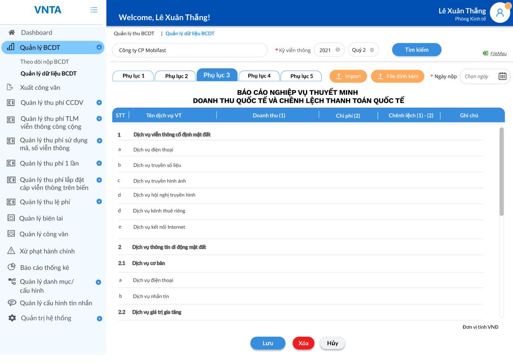

1

Tên phụ lục 3

text (readonly)

HT hiển thị tên phụ lục: "Báo cáo nghiệp vụ thuyết minh doanh thu quốc tế và chênh lệch thanh toán quốc tế"

2

STT

number

STT theo đúng mẫu phụ lục 3

3

Tên dịch vụ viễn thông

text

HT hiển thị danh sách tất cả các dịch vụ viễn thông theo mẫu phụ lục 3

4

Doanh thu (1)

currency

- Maxlength: 20 ký tự

- Nhập doanh thu tương ứng với từng loại dịch vụ

- Số nguyên, ngăn cách phần nghìn bằng dấu “.”

5

Chi phí (2)

currency

- Maxlength: 20 ký tự

- Nhập chi phí tương ứng với từng loại dịch vụ

- Số nguyên, ngăn cách phần nghìn bằng dấu “.”

6

Chênh lệch (3)

currency

- Maxlength: 20 ký tự

- Nhập chênh lệch

- Báo lỗi nếu hệ thống check thấy (3) # (1) - (2)

- Số nguyên, ngăn cách phần nghìn bằng dấu “.”

7

Tổng

currency

- Maxlength: 20 ký tự

- Nhập tổng doanh thu tương ứng với từng loại dịch vụ

- Báo lỗi nếu số liệu nhập vào # tổng các cấp con cộng lại

- Số nguyên, ngăn cách phần nghìn bằng dấu “.”

8

Ghi chú

textbox

- Maxlength: 500 ký tự

- Nhập ghi chú thêm (nếu có)

Phụ lục 4

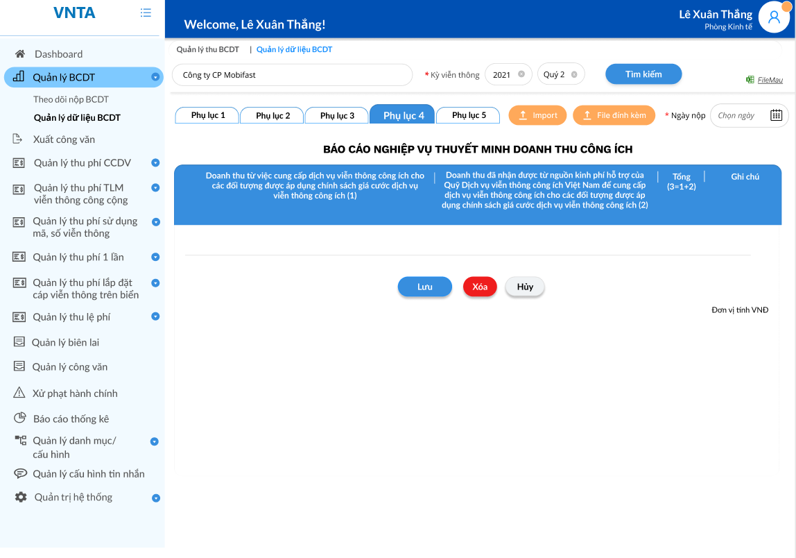

1

Tên phụ lục 4

text (readonly)

HT hiển thị tên phụ lục: "Báo cáo nghiệp vụ thuyết minh doanh thu công ích"

2

Tên dịch vụ viễn thông

text

HT hiển thị danh sách tất cả các dịch vụ viễn thông theo mẫu phụ lục 2

3

Doanh thu từ việc CCDV VT công ích (1)

currency

- Maxlength: 20 ký tự

- Nhập doanh thu

- Số nguyên, ngăn cách phần nghìn bằng dấu “.”

4

Doanh thu kinh phí hỗ trợ (2)

currency

- Maxlength: 20 ký tự

- Nhập doanh thu

- Số nguyên, ngăn cách phần nghìn bằng dấu “.”

5

Tổng doanh thu

currency

- Maxlength: 20 ký tự

- Nhập tổng doanh thu

- Báo lỗi nếu số liệu nhập vào # tổng (1) + (2)

- Số nguyên, ngăn cách phần nghìn bằng dấu “.”

6

Ghi chú

textbox

- Maxlength: 500 ký tự

- Nhập ghi chú thêm (nếu có)

Phụ lục 5

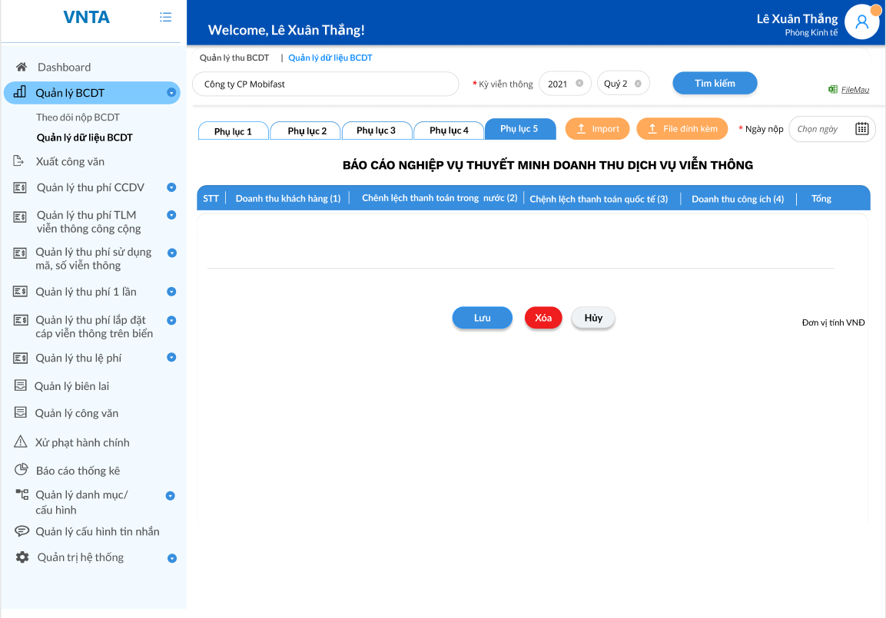

1

Tên phụ lục 5

text (readonly)

HT hiển thị tên phụ lục: "Báo cáo nghiệp vụ thuyết minh doanh thu dịch vụ viễn thông"

2

Doanh thu khách hàng (1)

currency

x

- Maxlength: 20 ký tự

- Nhập doanh thu

- Báo lỗi nếu # Tổng doanh thu ở Phụ lục 1

- Số nguyên, ngăn cách phần nghìn bằng dấu “.”

3

Chênh lệch thanh toán trong nước (2)

currency

x

- Maxlength: 20 ký tự

- Nhập doanh thu

- Báo lỗi nếu # Tổng chênh lệch ở Phụ lục 2

- Số nguyên, ngăn cách phần nghìn bằng dấu “.”

4

Chênh lệch thanh toán quốc tế (3)

currency

x

- Maxlength: 20 ký tự

- Nhập doanh thu

- Báo lỗi nếu # Tổng chênh lệch ở Phụ lục 3

- Số nguyên, ngăn cách phần nghìn bằng dấu “.”

5

Doanh thu công ích (4)

currency

x

- Maxlength: 20 ký tự

- Nhập doanh thu

- Báo lỗi nếu # Tổng Doanh thu ở Phụ lục 4

- Số nguyên, ngăn cách phần nghìn bằng dấu “.”

6

Tổng

currency

x

- Maxlength: 20 ký tự

- Nhập doanh thu

- Báo lỗi nếu # (1) + (2) + (3) + (4)

- Số nguyên, ngăn cách phần nghìn bằng dấu “.”

7

Ghi chú

textbox

- Maxlength: 500 ký tự

- Nhập ghi chú thêm (nếu có)

Chỉnh sửa BCDT

Luồng chức năng

Thông tin chung

Tên chức năng

Chỉnh sửa BCDT

Mô tả

Chức năng cho phép NSD thay đổi dữ liệu.

Tác nhân

Cán bộ Phòng Kinh tế

Điều kiện trước

Đăng nhập vào hệ thống, có phân quyền chức năng

Điều kiện sau

Thay đổi dữ liệu BCDT thành công

Ngoại lệ

N/A

Các yêu cầu đặc biệt

N/A

Luồng quy trình

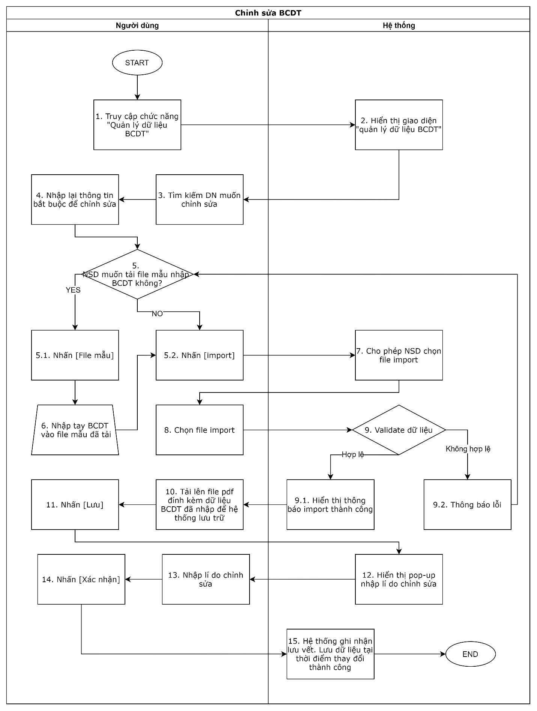

Mô tả luồng xử lý

Bước

Mô tả

Bước 1

NSD truy cập chức năng “Quản lý dữ liệu BCDT” trong module “Quản lý BCDT” tại hệ thống quản lý nghiệp vụ và báo cáo thu phí, lệ phí viễn thông.

Bước 2

Hệ thống mặc định hiển thị BCDT của doanh nghiệp có mã định danh nhỏ nhất trong kỳ gẫn nhất đã có dữ liệu BCDT.

Bước 3

NSD tìm kiếm doanh nghiệp và kỳ viễn thông của DN muốn chỉnh sửa dữ liệu BCDT

Bước 4

NSD nhập lại thông tin bắt buộc trước khi chỉnh sửa dữ liệu BCDT: tên doanh nghiệp, kỳ viễn thông, ngày nộp BCDT.

Bước 5

NSD có thể import file excel dữ liệu BCDT lên hệ thống hoặc tải về file mẫu cho phép tự nhập dữ liệu tại máy tính:

- Nếu tài về file mẫu, chuyển sang bước 5.1

- Nếu import, chuyển sang bước 5.2

Bước 5.1

Nhấn [File mẫu] tại màn hình giao diện trên hệ thống => hệ thống tự động tải về file excel mẫu BCDT. Chuyển sang bước 6.

Bước 5.2

Nhấn [Import] tại màn hình giao diện trên hệ thống => Thực hiện import file gồm 05 sheet phụ lục theo các tên được quy định (Phụ lục 1, Phụ lục 2, Phụ lục 3, Phụ lục 4, Phụ lục 5). Chuyển sang bước 7.

Bước 6

NSD nhập tay BCDT vào file excel mẫu đã tải về máy. Sau khi nhập xong tiến hành lưu lại dữ liệu tại máy. Chuyển sang bước 5.2

Bước 7

Hệ thống hiển thị cửa sổ cho phép NSD chọn file import. Chuyển sang bước 8.

Bước 8

NSD tiến hành chọn file muốn import lại dữ liệu BCDT trong máy tính.

Bước 9

Hệ thống tiến hành kiểm tra tính hợp lệ của dữ liệu import.

- Nếu hợp lệ, chuyển sang bước 9.1

- Nếu không hợp lệ, chuyển sang bước 9.2

Bước 9.1

Hệ thống hiển thị thông báo “Import dữ liệu thành công. Vui lòng xem lại dữ liệu và nhấn Lưu để xác nhận”.

Từ dữ liệu file import vào hệ thống => hệ thống check cộng dồn cấp con đến cấp cha (hệ thống ko tự động cộng để fill dữ liệu, chỉ check và báo lỗi).

Định dạng: Dấu “.” ngăn cách hàng nghìn.

Chuyển sang bước 10.

Bước 9.2

Hệ thống thông báo lỗi:

- Định dạng file không đúng! Khi định dạng file không phải excel or ko đúng với file mẫu

- Tên sheet [n] không đúng! Khi tên sheet sai

- Vui lòng kiểm tra lại dữ liệu. Doanh nghiệp không có giấy phép [Tên loại giấy phép] trong [Kỳ]! Khi DN ko có gp có hiệu lực trong Kỳ nhưng lại có số liệu BCDT

- Doanh thu [Tên loại giấy phép] không được bỏ trống (Doanh nghiệp có giấy phép trong [Kỳ])! Khi DN có giấy phép nhưng dữ liệu BCDT của dịch vụ đó để trống

- [Tên phụ lục - Cột [Tên cột] - Dòng [STT dòng] dữ liệu không hợp lệ! Khi số liệu không hợp lệ

Ví dụ: Phụ lục 1 - Cột Tổng - Dòng 1/1.1/a dữ liệu không hợp lệ.

Quay lại bước 5.

Bước 10

NSD tải lên file pdf BCDT để đính kèm lên hệ thống cho phép hệ thống lưu lại dữ liệu.

Bước 11

Nhấn [Lưu]

Bước 12

Hệ thống hiển thị pop-up cho phép NSD nhập lí do chỉnh sửa dữ liệu BCDT.

Bước 13

NSD nhập lí do chỉnh sửa BCDT.

Bước 14

Nhấn [xác nhận].

Bước 15

Hệ thống ghi nhận lưu vết thao tác “Chỉnh sửa” dữ liệu BCDT. Cập nhật chính xác ngày giờ và tên người cập nhật tại thời điểm import thành công.

Giao diện chức năng

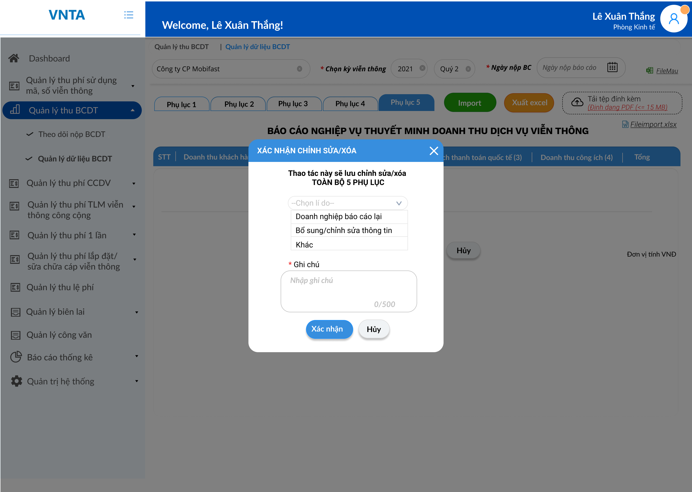

STT

Tên

Kiểu

dữ liệu

Bắt buộc

Mô tả

Database

1

Giao diện chỉnh sửa (reference đến mục 1.2/1.2.1: Thêm mới BCDT)

2

Pop-up xác nhận lưu thay đổi

pop-up

pop-up này nhằm lưu lý do thay đổi của NSD

2.1

Chọn lý do

combobox

x

- Gồm:

+ Doanh nghiệp báo cáo lại

+ Bổ sung/chỉnh sửa thông tin

+ Khác

- Cho phép chọn 1

2.2

Ghi chú

textbox

x

- Hiển thị khi chọn Lý do là [Khác]

- Maxleght: 500 ký tự

2.3

Xác nhận

Button

Nhấn Xác nhận => ghi nhận dữ liệu, cập nhật vào bảng lưu vết

2.4

Hủy

Button

Đóng popup => ko ghi nhận dữ liệu, ko cập nhật bảng lưu vết

Xóa BCDT

Luồng chức năng

Thông tin chung

Tên chức năng

Xóa BCDT

Mô tả

Chức năng cho phép NSD xóa cả 5 phụ lục BCDT đã import hoặc đã nhập và file import.

Tác nhân

Cán bộ P. Kinh tế

Điều kiện trước

Đăng nhập vào hệ thống, có phân quyền chức năng

Điều kiện sau

Xóa BCDT thành công

Ngoại lệ

N/A

Các yêu cầu đặc biệt

N/A

Luồng quy trình

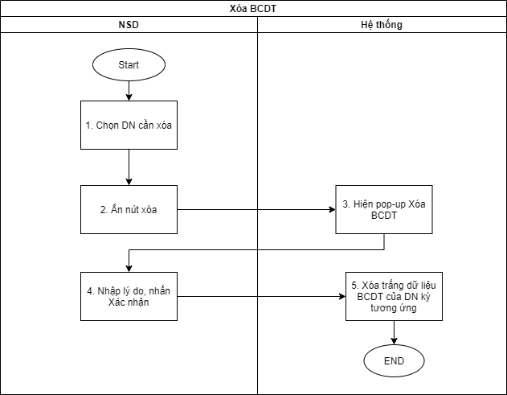

Mô tả luồng xử lý

Bước

Mô tả

Bước 1

Tại màn quản lý dữ liệu BCDT, NSD chọn tên doanh nghiệp/kỳ viễn thông có dữ liệu BCDT cần xóa.

Bước 2

Hệ thống hiển thị BCDT theo kết quả tìm kiếm.

Bước 3

Nhấn [Xóa]

Bước 4

Hệ thống hiển thị pop-up cho phép NSD chọn lí do xóa BCDT.

Bước 5

NSD chọn/nhập lí do xóa hoặc thêm ghi chú.

Bước 6

Nhấn [Xác Nhận]

Bước 7

Hệ thống ghi nhận xóa trắng toàn bộ dữ liệu 5 phụ lục của BCDT đang chọn.

Bước 8

Hệ thống ghi nhận lưu vết thao tác “Xóa” dữ liệu BCDT. Cập nhật chính xác ngày giờ và tên người cập nhật tại thời điểm xóa thành công.

Giao diện chức năng

Giao diện xóa (reference đến mục 1.2/1.2.2: Chỉnh sửa BCDT)

Xuất công văn P. CPTN (thực hiện trên hệ thống cũ)

Xem danh sách giấy phép P. CPTN cần xuất công văn

Luồng chức năng

Thông tin chung

Tên chức năng

Xem danh sách giấy phép P. CPTN cần xuất công văn

Mô tả

Thực hiện update trên chức năng [Cấp giấy phép] của hệ thống QLVT cũ

Danh sách chứa all giấy phép P. CPTN nhập vào hệ thống => bổ sung button Xuất công văn

Tác nhân

Cán bộ P. CPTN

Điều kiện trước

Đăng nhập vào hệ thống, có phân quyền chức năng

Điều kiện sau

Xem danh sách giấy phép P. CPTN cần xuất công văn thành công

Ngoại lệ

N/A

Các yêu cầu đặc biệt

N/A

Luồng chức năng

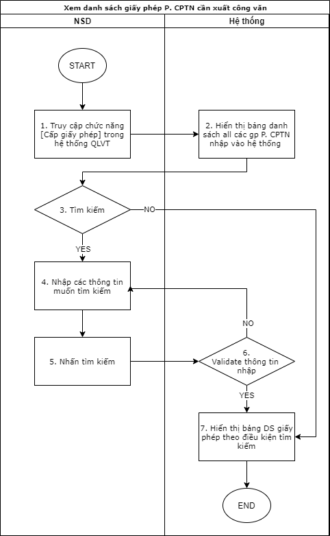

Mô tả luồng xử lý

Bước

Mô tả

Bước 1

NSD truy cập chức năng “Cấp giấy phép” trong module “Quản lý cấp phép” tại hệ thống quản lý phân tích dữ liệu viễn thông.

Bước 2

Hệ thống hiển thị giao diện danh sách giấy phép bao gồm thông tin tất cả GP đã nhập lên hệ thống.

Bước 3

NSD nhấn button [Hiển thị bộ lọc] => tiến hành tìm kiếm các thông tin.

- Nếu có, chuyển bước 4

- Nếu không, chuyển bước 7

Bước 4

Hệ thống hiển thị khung tìm kiếm. NSD nhập các thông tin tìm kiếm tại các trường dữ liệu tương ứng.

Bước 5

Nhấn [Tìm kiếm].

Bước 6

Hệ thống kiểm tra tính hợp lệ thông tin nhập:

- Nếu hợp lệ, chuyển bước 7

- Nếu không hợp lệ, hệ thống đưa ra thông báo tại các trường nhập không hợp lệ. Quay lại bước 4.

Bước 7

Hệ thống hiển thị danh sách thông tin giấy phép theo điều kiện tìm kiếm.

Kết thúc luồng.

Quy tắc tính Số phải nộp

1. Đối với giấy phép CCDV, TLM viễn thông công cộng: Hiển thị số tiền doanh nghiệp phải nộp trong năm đầu tiên được cấp giấy phép.

- Số tiền phải nộp chỉ tính đối với các giấy phép là Cấp lần đầu/ Cấp mới. Đối với các hình thức khác (Gia hạn, Sửa đổi bổ sung, Cấp lại) sẽ hiển thị dấu “-”

- Công thức tính số tiền phải nộp trong năm đầu của từng giấy phép:

Số tiền phải nộp = (Mức tối thiểu/ 12) x số tháng thực tế.

Trong đó:

+ Số tiền tối thiểu quy định theo thông tư 03/2018/TT-BTC theo từng loại dịch vụ đã được quản lý trong chức năng “Quản lý mức giá thu phí” tại hệ thống QLTP.

+ Số tháng thực tế khi GP được cấp phép vào ngày 01/xx/yyyy: là số tháng doanh nghiệp sử dụng dịch vụ viễn thông tính từ tháng được cấp phép đến hết năm. (Ví dụ DN được cấp GP ngày 01/8/2021 => số tiền phải nộp năm 2021 = (số tiền tối thiểu/12) * 5

+ Số tháng thực tế khi GP được cấp phép vào ngày 02-31/xx/yyyy: là số tháng doanh nghiệp sử dụng dịch vụ viễn thông tính từ sau tháng cấp phép đến hết năm. (Ví dụ DN được cấp GP ngày 25/8/2021 => số tiền phải nộp năm 2021 = (số tiền tối thiểu/12) * 4

- Số tiền phải nộp năm đầu của giấy phép cấp mới/cấp lần đầu sẽ không thay đổi khi:

+ Có giấy phép cấp lại thay thế giấy phép Cấp mới trong năm đầu

+ Có giấy phép Gia hạn, Sửa đổi bổ sung: Không thay đổi nếu không khác về số tiền tối thiểu phải thu so với giấy phép Cấp mới

- Số tiền phải nộp năm đầu của giấy phép Cấp mới/Cấp lần đầu sẽ được tính lại khi thuộc 1 trong các trường hợp sau:

+ Gia hạn, Sửa đổi bổ sung: Tính lại nếu khác về số tiền tối thiểu phải thu so với giấy phép Cấp mới

+ Thu hồi giấy phép Cấp mới/Cấp lần đầu: Tính lại số tiền phải nộp của giấy phép cấp mới

+ Có thay đổi về mức tính phí có ngày áp dụng trong năm đầu của giấy phép cấp lần đầu/cấp mới

2.  Thử nghiệm mạng và dịch vụ viễn thông: Hiển thị số tiền doanh nghiệp phải nộp cho toàn bộ giấy phép

+ Số tiền phải nộp chỉ tính đối với các giấy phép là Cấp lần đầu/ Cấp mới. + Đối với các hình thức Gia hạn, Sửa đổi bổ sung: Hệ thống check nếu có sự khác biệt về Tài nguyên, Phạm vi sẽ tính tiền và đưa ra số tiền phải nộp. Ngược lại nếu giống giấy phép cũ sẽ không phải nộp tiền hiển thị dấu “-”

+ Đối với hình thức Cấp lại: Không phải nộp tiền sẽ hiển thị dấu “-”

+ Số tiền thu quy định theo thông tư 03/2018/TT-BTC theo từng loại dịch vụ đã được quản lý trong chức năng “Quản lý mức giá thu phí” tại hệ thống QLTP.

3. Đối với giấy phép TLM viễn thông dùng riêng: Hiển thị số tiền doanh nghiệp phải nộp cho toàn bộ giấy phép

+ Số tiền phải nộp chỉ tính đối với các giấy phép là Cấp lần đầu/ Cấp mới.

+ Các hình thức khác (Sửa đổi, bổ sung, Gia hạn, Cấp lại): Không phải nộp phí, hiển thị dấu “-”

+ Số tiền thu quy định theo thông tư 03/2018/TT-BTC theo từng loại dịch vụ đã được quản lý trong chức năng “Quản lý mức giá thu phí” tại hệ thống QLTP.

4. Đối với giấy phép lắp đặt cáp viễn thông trên biển (Cấp mới): Hiển thị số tiền phải nộp theo chức năng Quản lý mức phí, riêng đối với phí Lắp đặt cáo sẽ mở ngoặc thêm đơn vị của số tiền được áp dụng VD: 1.000.000 (USD)

Giao diện chức năng

--	Giao diện update màn “Cấp giấy phép”

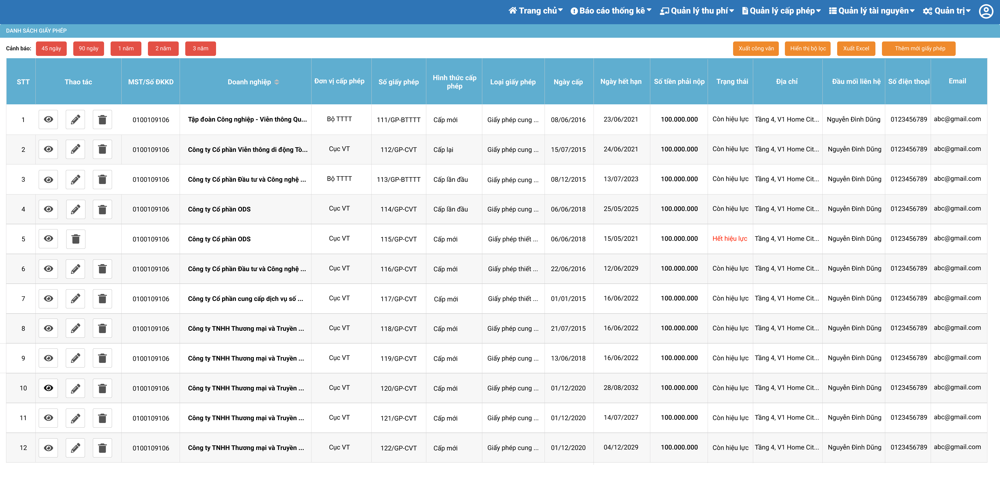

STT

Tên

Kiểu

dữ liệu

Bắt buộc

Mô tả

Database

1

Xuất công văn

button

Nhấn => hệ thống hiển thị pop-up nhập thông tin xuất công văn cho phép cán bộ P.CPTN xuất công văn thu Lệ phí/Phí năm đầu/Phí TLM viễn thông dùng riêng/Phí thử nghiệm mạng và dịch vụ viễn thông

2

Bảng thông tin giấy phép

(Bổ sung các cột cần thêm trong bảng “Danh sách giấy phép”)

Bảng thông tin giấy phép

(Bổ sung các cột cần thêm trong bảng “Danh sách giấy phép”)

Bảng thông tin giấy phép

(Bổ sung các cột cần thêm trong bảng “Danh sách giấy phép”)

Bảng thông tin giấy phép

(Bổ sung các cột cần thêm trong bảng “Danh sách giấy phép”)

Bảng thông tin giấy phép

(Bổ sung các cột cần thêm trong bảng “Danh sách giấy phép”)

2.1

MST/ Số ĐKKD

number

Hiển thị MST/Số ĐKKD của doanh nghiệp.

2.2

Đơn vị cấp phép

Text

Hiển thị tên đơn vị cấp giấy phép, bao gồm:

- Bộ Thông Tin Truyền Thông

- Cục Viễn thông.

2.3

Số tiền phải nộp

Currency

- Nếu là số thập phân làm tròn chỉ lấy phần nguyên, phần thập phân >=5 sẽ làm tròn phần số nguyên lên 1 đơn vị, ngược lại giữ nguyên phần số nguyên ko làm tròn nếu phần thập phân<5

- Ngăn cách phần nghìn bằng dấu “.”

Đối với giấy phép lắp đặt cáp viễn thông trên biển (Cấp mới): Hiển thị số tiền phải nộp theo chức năng Quản lý mức phí, riêng đối với phí Lắp đặt cáo sẽ mở ngoặc thêm đơn vị của số tiền được áp dụng VD: 1.000.000 (USD)

2.4

Địa chỉ

Text

Hiển thị địa chỉ liên hệ của doanh nghiệp

2.5

Đầu mối liên hệ

Text

Hiển thị tên đầu mối liên hệ tới doanh nghiệp

2.6

Số điện thoại

number

Hiển thị số điện thoại liên hệ tới doanh nghiệp.

2.7

Email

Text

Hiển thị email liên hệ tới doanh nghiệp.

Xuất công văn thu lệ phí/phí quyền hoạt động viễn thông của P. CPTN

Luồng chức năng

Thông tin chung

Tên chức năng

Nhập thông tin xuất công văn thu phí CCDV, TLM viễn thông công cộng năm đầu, thu phí 1 lần, thu lệ phí

Mô tả

Chức năng cho phép nhập thông tin xuất công văn:

- Cv thu phí CCDV, phí TLM viễn thông công cộng năm đầu tiên của Doanh nghiệp đã được cấp giấy phép CCDV, TLM viễn thông công cộng

- Cv thu phí TLM viễn thông dùng riêng, Thử nghiệm mạng và dịch vụ viễn thông

- Cv thu lệ phí cấp phép

- Cv thu phí/ lệ phí lắp cáp đặt viễn thông trên biển

- Cv thu phí sửa chữa cáp viễn thông trên biển

Chức năng “Nhập thông tin xuất công văn thu phí năm đầu” được update trong chức năng “Cấp giấy phép” – màn “Danh sách giấy phép” của hệ thống QLVT.

Phần mô tả sẽ mô tả các thông tin sẽ được thêm vào hệ thống QLVT.

Tác nhân

Cán bộ P. CPTN

Điều kiện trước

Đăng nhập vào hệ thống, có phân quyền chức năng

Điều kiện sau

Xuất công văn thành công

Ngoại lệ

N/A

Các yêu cầu đặc biệt

N/A

Luồng chức năng

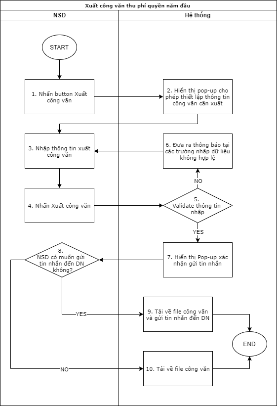

Mô tả luồng xử lý

Bước

Mô tả

Bước 1

NSD nhấn button [Xuất công văn] trên màn “Danh sách giấy phép” của hệ thống QLVT.

Bước 2

Hệ thống hiển thị pop-up cho phép NSD nhập thông tin xuất công văn.

Bước 3

NSD tiến hành nhập thông tin tại các trường dữ liệu.

Bước 4

Nhấn [Xuất công văn]

Bước 5

Hệ thống kiểm tra tính hợp lệ thông tin nhập:

- Nếu hợp lệ, chuyển bước 7

- Nếu không hợp lệ, chuyển bước 6

Bước 6

 Hệ thống đưa ra thông báo tại các trường nhập không hợp lệ. Quay lại bước 3.

Ví dụ: Số giấy phép không được để trống!, Loại công văn không được để trống!, Hạn nộp không được để trống!

Bước 7

Hệ thống hiển thị pop-up xác nhận gửi tin nhắn thông báo đến doanh nghiệp

Bước 8

Ngưởi sử dụng xác nhận việc gửi tin nhắn:

- Nếu nhấn [Có], chuyển bước 9.

- Nếu nhấn [Không], chuyển bước 10.

Bước 9

Hệ thống xác nhận có gửi tin nhắn đến DN, đồng thời tải về file word công văn NSD thiết lập.

Tên file công văn: Cv thu phí TLM/CCDV năm [năm ] – [Tên doanh nghiêp]

Ví dụ: Cv thu phí TLM/CCDV năm 2021 – Tập đoàn viễn thông quân đội

Bước 10

Hệ thống xác nhận không gửi tin nhắn, tiến hành tải về file word công văn NSD thiết lập.

- Tên file công văn: Cv thu phí TLM/CCDV năm [năm ] – [Tên doanh nghiêp]

Ví dụ: Cv thu phí TLM/CCDV năm 2021 – Tập đoàn viễn thông quân đội

- Tên file công văn thu phí TLM dùng riêng: Cv thu phí TLM dùng riêng giấy phép [Số giấy phép]_[Tên DN]

- Tên file công văn thu phí Thử nghiệm mạng và dịch vụ viễn thông: Cv thu phí Thử nghiệm mạng và dịch vụ viễn thông giấy phép [Số giấy phép]_[Tên DN]

- Tên file công văn thu lệ phí cấp phép: Cv thu lệ phí giấy phép [Số giấy phép]_[Tên DN]

Chú ý: Giấy phép do Cục cấp mẫu công văn sẽ khác so với mẫu công văn của giấy phép do Bộ cấp

- Tên file công văn thu lệ phí lắp đặt cáp: Cv thu lệ phí giấy phép [Số giấy phép]_[Tên DN]

- Tên file công văn thu phí lắp đặt cáp: Cv thu phí lắp đặt cáp viễn thông trên biển [Số giấy phép]_[Tên DN]

Giao diện chức năng

Giao diện pop-up “Nhập thông tin xuất công văn” (update màn “Danh sách giấy phép”).

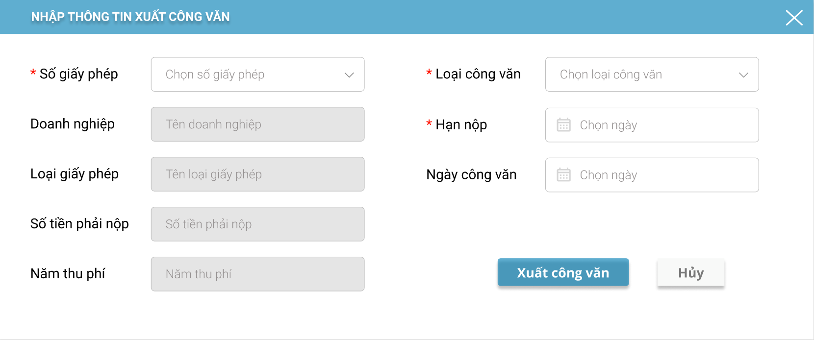

STT

Tên

Kiểu

dữ liệu

Bắt buộc

Mô tả

Database

Nhập thông tin xuất công văn thu phí CCDV năm đầu

Nhập thông tin xuất công văn thu phí CCDV năm đầu

Nhập thông tin xuất công văn thu phí CCDV năm đầu

Nhập thông tin xuất công văn thu phí CCDV năm đầu

Nhập thông tin xuất công văn thu phí CCDV năm đầu

1

Số giấy phép

Combobox search

x

- Gồm tất cả giấy phép

- Cho phép nhập số GP

- Autocomplete

2

Doanh nghiệp

Text

Hệ thống tự fill tên doanh nghiệp khi NSD nhập số giấy phép.

3

Loại giấy phép

Text

Hệ thống tự fill loại giấy phép khi NSD nhập số giấy phép, gồm:
- Giấy phép CCDV viễn thông

- Giấy phép TLM viễn thông công cộng

- Giấy phép TLM viễn thông dùng riêng

- Giấy phép thử nghiệm mạng và CCDV viễn thông

- Giấy phép lắp đặt cáp viễn thông trên biển

4

Số tiền phải nộp

Currency

Hệ thống tự fill số tiền DN phải nộp trong năm đầu khi NSD nhập số giấy phép và chọn Loại công văn là Công văn thu phí năm đầu

Hệ thống tự fill số tiền DN phải nộp khi chọn Loại công văn là Công văn thu lệ phí, Công văn thông báo thu phí thử nghiệm mạng và dịch vụ viễn thông, Công văn thông báo thu phí thiết lập mạng viễn thông dùng riêng, Công văn thông báo thu phí lắp đặt cáp viễn thông trên biển.

5

Năm thu phí

Date

- Hệ thống tự fill năm thu phí khi NSD nhập số giấy phép và chọn Loại công văn là Công văn thu phí năm đầu

- Ẩn khi NSD chọn loại công văn khác Công văn thu phí năm đầu.

6

Loại công văn

Combobox search

x

Cho phép NSD chọn loại công văn:

- Công văn thông báo thu phí năm đầu.

- Công văn thu lệ phí.

- Công văn thông báo thu phí thử nghiệm mạng và dịch vụ viễn thông.

- Công văn thông báo thu phí thiết lập mạng viễn thông dùng riêng

- Công văn thông báo thu phí lắp đặt cáp viễn thông trên biển.

Đối với số giấy phép CCDV, TLM công cộng có cv thông báo thu phí năm đầu, cv thu lệ phí

Trường hợp giấy phép CCDV và TLM viễn thông công cộng được cấp phép vào trong tháng 12 => khi chọn giấy phép chỉ có cv thu lệ phí

Đối với gp TLM dùng riêng có cv thu lệ phí, cv thu phí thiết lập mạng viễn thông dùng riêng

Đối với số gp thử nghiệm mạng và CCDV viễn thông có cv thu lệ phí và cv thu phí thử nghiệm mạng và dịch vụ viễn thông

Đối với số gp lắp đặt cáp viễn thông trên biển có cv thu lệ phí và cv thu phí lắp đặt cáp viễn thông trên biển.

7

Hạn nộp

Datepicker

x

- Cho phép NSD chọn hạn nộp phí hiển thị trên công văn.

- Cho phép NSD tự nhập hạn nộp phí.

- Định dạng dd/mm/yyyy

8

Ngày công văn

Datepicker

- Cho phép NSD chọn ngày công văn.

- Cho phép NSD tự nhập ngày công văn.

- Định dạng dd/mm/yyyy.

9

Xuất công văn

Button

- Tên file công văn thu phí CCDV/TLM năm đầu: Cv thu phí TLM/CCDV năm [năm] – [Tên Doanh nghiệp]

- Tên file công văn thu phí TLM dùng riêng: Cv thu phí TLM dùng riêng giấy phép [Số giấy phép]_[Tên DN]

- Tên file công văn thu phí Thử nghiệm mạng và dịch vụ viễn thông: Cv thu phí Thử nghiệm mạng và dịch vụ viễn thông giấy phép [Số giấy phép]_[Tên DN]

- Tên file công văn thu lệ phí cấp phép: Cv thu lệ phí giấy phép [Số giấy phép]_[Tên DN]

- Tên file công văn thu phí lắp đặt cáp viễn thông trên biển: Cv thu phí lắp đặt cáp viễn thông trên biển [Số giấy phép]_[Tên DN]

- Tên file công văn thu lệ phí cấp phép: Cv thu lệ phí giấy phép [Số giấy phép]_[Tên DN]

- Nhấn [Xuất công văn], hệ thống hiển thị pop-up xác nhận gửi tin nhắn.

10

Hủy

Button

Nhấn [Hủy], hệ thống ghi nhận hủy thao tác xuất công văn. Quay lại màn “Danh sách giấy phép”.

Giao diện pop-up “Xác nhận gửi tin nhắn”

STT

Tên

Kiểu

dữ liệu

Bắt buộc

Mô tả

Database

Xác nhận gửi tin nhắn

Pop-up

Sau khi NSD nhấn [Xuất công văn] từ giao diện thiết lập thông tin xuất công văn, hệ thống hiển thị pop-up xác nhận việc gửi tin nhắn tới DN: Bạn có muốn gửi tin nhắn thông báo đến doanh nghiệp không?

1

Có

Button

Nhấn [Có] => hệ thống tự động tải về file word bao gồm công văn gửi tới doanh nghiệp đồng thời gửi tin nhắn thông báo thu phí năm đầu đến DN đã chọn.

2

Không

Button

Nhấn [Không] => hệ thống chỉ tải về file công văn thông báo thu phí năm đầu gửi tới doanh nghiệp.

Xem danh sách quyết định phân bổ mã, số viễn thông P. CPTN cần xuất công văn

Luồng chức năng

Thông tin chung

Tên chức năng

Xem danh sách quyết định phân bổ mã, số viễn thông P. CPTN cần xuất công văn

Mô tả

Thực hiện update trên chức năng [Danh sách quyết định] của hệ thống QLVT cũ

Danh sách chứa all quyết định P. CPTN nhập vào hệ thống => bổ sung button Xuất công văn

Tác nhân

Cán bộ P. CPTN

Điều kiện trước

Đăng nhập vào hệ thống, có phân quyền chức năng

Điều kiện sau

Xem danh sách nộp lệ phí phân bổ mã, số viễn thông P. CPTN cần xuất công văn thành công

Ngoại lệ

N/A

Các yêu cầu đặc biệt

N/A

Luồng chức năng

--

--

--	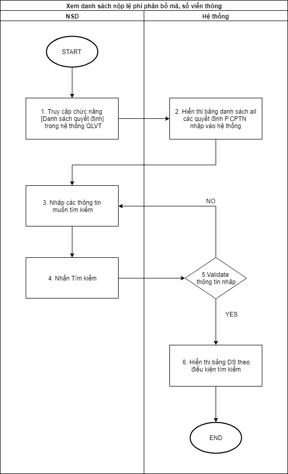

Mô tả luồng xử lý

Bước

Mô tả

Bước 1

NSD truy cập chức năng “Danh sách quyết định” trong module “Quản lý tài nguyên” tại hệ thống quản lý phân tích dữ liệu viễn thông.

Bước 2

Hệ thống hiển thị giao diện danh sách quyết định bao gồm thông tin tất cả quyết định đã nhập lên hệ thống.

Bước 3

Hệ thống hiển thị khung tìm kiếm. NSD nhập các thông tin tìm kiếm tại các trường dữ liệu tương ứng.

Bước 4

Nhấn [Tìm kiếm].

Bước 5

Hệ thống kiểm tra tính hợp lệ thông tin nhập:

- Nếu hợp lệ, chuyển bước 6

- Nếu không hợp lệ, hệ thống đưa ra thông báo tại các trường nhập không hợp lệ. Quay lại bước 3.

Bước 6

Hệ thống hiển thị danh sách thông tin quyết định theo điều kiện tìm kiếm.

Kết thúc luồng.

--

Giao diện chức năng

--	Giao diện update màn “Danh sách quyết định”

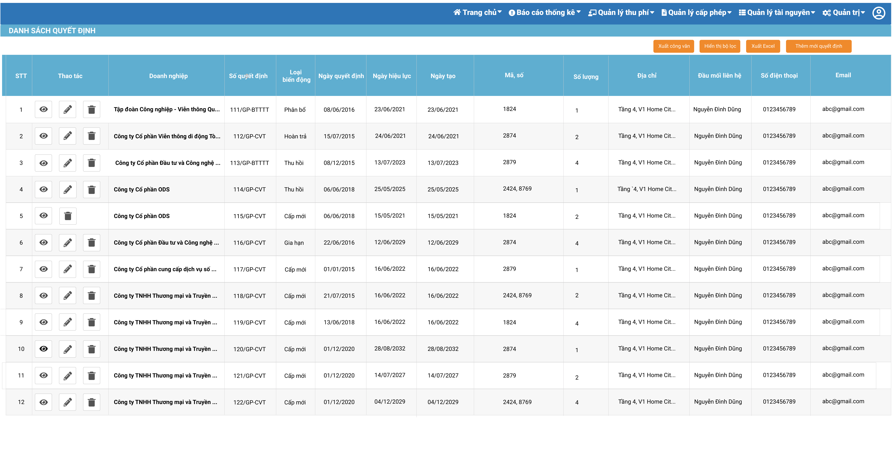

STT

Tên

Kiểu

dữ liệu

Bắt buộc

Mô tả

Database

1

Xuất công văn

button

Nhấn => hệ thống hiển thị pop-up nhập thông tin xuất công văn cho phép cán bộ P.CPTN xuất công văn thu Lệ phí phân bổ mã, số viễn thông.

2

Bảng thông tin quyết định

(Bổ sung các cột cần thêm trong bảng “Danh sách quyết định” theo thứ tự)

Bảng thông tin quyết định

(Bổ sung các cột cần thêm trong bảng “Danh sách quyết định” theo thứ tự)

Bảng thông tin quyết định

(Bổ sung các cột cần thêm trong bảng “Danh sách quyết định” theo thứ tự)

Bảng thông tin quyết định

(Bổ sung các cột cần thêm trong bảng “Danh sách quyết định” theo thứ tự)

Bảng thông tin quyết định

(Bổ sung các cột cần thêm trong bảng “Danh sách quyết định” theo thứ tự)

2.1

Doanh nghiệp

Text

Hiển thị tên DN có quyết định do CVT cấp tương ứng với các trường thông tin tìm kiếm.

2.2

Số quyết định

Text

Hiển thị số quyết định.

2.3

Loại biến động

Text

Hiển thị loại biến động.

2.4

Ngày quyết định

Date

Hiển thị ngày quyết định.

Ngày theo định dạng DD/MM/YYYY.

2.5

Ngày hiệu lực

Date

Hiển thị ngày hiệu lực.

2.6

Ngày tạo

Date

Hiển thị ngày tạo.

2.7

Mã, số

Text

Hiển thị mã, số.

2.8

Số lượng

Number

Hiển thị số lượng mã, số đã cấp tương ứng.

2.9

Địa chỉ

Text

Hiển thị địa chỉ liên hệ của doanh nghiệp.

2.10

Đầu mối liên hệ

Text

Hiển thị tên đầu mối liên hệ tới doanh nghiệp.

2.11

Số điện thoại

Number

Hiển thị số điện thoại liên hệ tới doanh nghiệp.

2.12

Email

Text

Hiển thị email liên hệ tới doanh nghiệp.

Xuất công văn thu lệ phí phân bổ mã, số viễn thông

Luồng chức năng

Thông tin chung

Tên chức năng

Xuất công văn thu lệ phí phân bổ mã, số viễn thông

Mô tả

Chức năng cho phép nhập thông tin xuất công văn:

Thông báo thu lệ phí phân bổ mã, số viễn thông.

Chức năng “Nhập thông tin xuất công văn thu lệ phí phân bổ mã, số viễn thông được update trong chức năng “Danh sách quyết định” – màn “Danh sách quyết định” của hệ thống QLVT.

Phần mô tả sẽ mô tả các thông tin sẽ được thêm vào hệ thống QLVT.

Tác nhân

Cán bộ P. CPTN

Điều kiện trước

Đăng nhập vào hệ thống, có phân quyền chức năng

Điều kiện sau

Xuất công văn thành công

Ngoại lệ

N/A

Các yêu cầu đặc biệt

N/A

Luồng chức năng

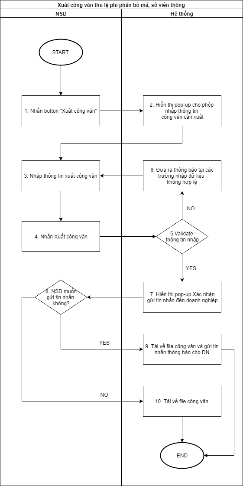

Mô tả luồng xử lý

Bước

Mô tả

Bước 1

NSD nhấn button [Xuất công văn] trên màn “Danh sách quyết định” của hệ thống QLVT.

Bước 2

Hệ thống hiển thị pop-up cho phép NSD nhập thông tin xuất công văn.

Bước 3

NSD tiến hành nhập thông tin tại các trường dữ liệu.

Bước 4

Nhấn [Xuất công văn]

Bước 5

Hệ thống kiểm tra tính hợp lệ thông tin nhập:

- Nếu hợp lệ, chuyển bước 7

- Nếu không hợp lệ, chuyển bước 6

Bước 6

 Hệ thống đưa ra thông báo tại các trường nhập không hợp lệ. Quay lại bước 3.

Ví dụ: Số quyết định không được để trống; Hạn nộp không được để trống!

Bước 7

Hệ thống hiển thị pop-up xác nhận gửi tin nhắn thông báo đến doanh nghiệp.

Bước 8

Ngưởi sử dụng xác nhận việc gửi tin nhắn:

- Nếu nhấn [Có], chuyển bước 9.

- Nếu nhấn [Không], chuyển bước 10.

Bước 9

Hệ thống xác nhận có gửi tin nhắn đến DN, đồng thời tải về file word công văn NSD thiết lập.

Tên file công văn: Cv thu lệ phí phân bổ mã, số viễn thông _ [Tên doanh nghiêp]

Ví dụ: Cv thu lệ phí phân bổ mã, số viễn thông – Tập đoàn viễn thông quân đội.

Bước 10

Hệ thống xác nhận không gửi tin nhắn, tiến hành tải về file word công văn NSD thiết lập.

- Tên file công văn: Cv thu lệ phí phân bổ mã, số viễn thông _[Tên doanh nghiêp]

Ví dụ Cv thu lệ phí phân bổ mã, số viễn thông – Tập đoàn viễn thông quân đội.

Giao diện chức năng

Giao diện pop-up “Nhập thông tin xuất công văn” (update màn “Danh sách quyết định”)

--	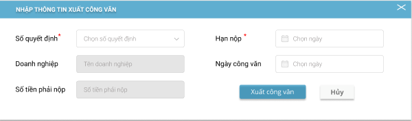

STT

Tên

Kiểu

dữ liệu

Bắt buộc

Mô tả

Database

Nhập thông tin xuất công văn thu lệ phí phân bổ mã, số viễn thông

Nhập thông tin xuất công văn thu lệ phí phân bổ mã, số viễn thông

Nhập thông tin xuất công văn thu lệ phí phân bổ mã, số viễn thông

Nhập thông tin xuất công văn thu lệ phí phân bổ mã, số viễn thông

Nhập thông tin xuất công văn thu lệ phí phân bổ mã, số viễn thông

1

Số quyết định

Combobox search

x

- Gồm tất cả số quyết định.

- Cho phép nhập số quyết định.

- Autocomplete

2

Doanh nghiệp

Text

Hệ thống tự fill tên doanh nghiệp khi NSD nhập số quyết định.

3

Số tiền phải nộp

Currency

Hệ thống tự fill số tiền lệ phí phân bổ mã, số viễn thông DN phải nộp khi NSD nhập số quyết định.

- Nếu là số thập phân làm tròn chỉ lấy phần nguyên, phần thập phân >=5 sẽ làm tròn phần số nguyên lên 1 đơn vị, ngược lại giữ nguyên phần số nguyên ko làm tròn nếu phần thập phân<5

4

Hạn nộp

Datepicker

x

- Cho phép NSD chọn hạn nộp phí hiển thị trên công văn.

- Cho phép NSD tự nhập hạn nộp phí.

- Định dạng dd/mm/yyyy

5

Ngày công văn

Datepicker

- Cho phép NSD chọn ngày công văn.

- Cho phép NSD tự nhập ngày công văn.

- Định dạng dd/mm/yyyy.

9

Xuất công văn

Button

- Tên file công văn thu lệ phí phân bổ mã, số viễn thông:

Cv thu lệ phí phân bổ mã, số viễn thông [Số quyết định]_[Tên DN]

- Nhấn [Xuất công văn], hệ thống hiển thị pop-up xác nhận gửi tin nhắn.

10

Hủy

Button

Nhấn [Hủy], hệ thống ghi nhận hủy thao tác xuất công văn. Quay lại màn “Danh sách quyết định”.

Giao diện pop-up “Xác nhận gửi tin nhắn”

--	

STT

Tên

Kiểu

dữ liệu

Bắt buộc

Mô tả

Database

1

Xác nhận gửi tin nhắn

Pop-up

Sau khi NSD nhấn [Xuất công văn] từ giao diện thiết lập thông tin xuất công văn, hệ thống hiển thị pop-up xác nhận việc gửi tin nhắn tới DN: Bạn có muốn gửi tin nhắn thông báo đến doanh nghiệp không?

1

Có

Button

Nhấn [Có] => hệ thống tự động tải về file word bao gồm công văn gửi tới doanh nghiệp đồng thời gửi tin nhắn thông báo thu lệ phí phân bổ mã, số viễn thông đến DN đã chọn.

2

Không

Button

Nhấn [Không] => hệ thống chỉ tải về file công văn thu lệ phí phân bổ mã, số viễn thông gửi tới doanh nghiệp.

Xuất công văn P. KHTC

Xem danh sách Doanh nghiệp P. KHTC cần xuất công văn phí quyền hoạt động viễn thông

Luồng chức năng

Thông tin chung

Tên chức năng

Xem danh sách Doanh nghiệp P. KHTC cần xuất công văn phí quyền hoạt động viễn thông (CCDV và TLM)

Mô tả

Chức năng cho phép cán bộ Phòng KHTC xem danh sách các DN cần xuất công văn thu phí quyền hoạt động viễn thông và các thông tin liên quan.

Tác nhân

Lãnh đạo, Cán bộ Phòng KHTC

Điều kiện trước

Đăng nhập vào hệ thống, có phân quyền chức năng

Điều kiện sau

Xem, tìm kiếm được danh sách các Doanh nghiệp theo các điều kiện có sẵn

Ngoại lệ

N/A

Các yêu cầu đặc biệt

N/A

Luồng chức năng

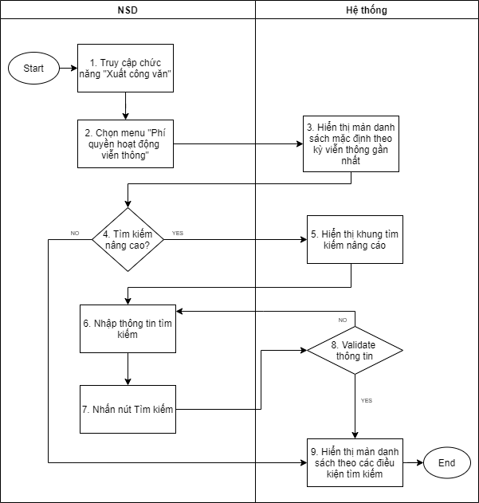

Mô tả luồng xử lý

Bước

Mô tả

Bước 1

NSD chọn menu chức năng “Xuất công văn”

Bước 2

NSD chọn submenu “Phí quyền hoạt động viễn thông”

Bước 3

Hiển thị màn danh sách các DN:

- Gồm tất cả DN có giấy phép CCDV và TLM do Cục VT cấp phép

 - Mặc định giao diện mới vào sẽ hiển thị:

+ Giấy phép CCDV sẽ theo kỳ viễn thông gần nhất trước đó

+ Giấy phép TLM phải nộp phí theo năm của CCDV đang hiển thị kỳ viễn thông gần nhất trước đó

- Trường Đơn vị cấp phép mặc định chọn “Cục VT”.

Bước 4

Nhấn icon tìm kiếm nâng cao

Bước 5

Hệ thống hiểu thị khung tìm kiếm nâng cao.

Kỳ viễn thông, đơn vị cấp phép được fill sẵn theo mặc định ban đầu tại #3.

Bước 6

Nhập thông tin tìm kiếm.

Khi ấn nút “Xóa điều kiện” => xóa các dữ liệu tiêu chí tìm kiếm đã nhập, giữ nguyên kết quả tìm kiếm (khi chưa nhấn [Tìm kiếm]). Hiển thị lại giao diện mặc định của khung tìm kiếm nâng cao (tham khảo #5)

Bước 7

Nhấn [Tìm kiếm] để bắt đầu tra cứu.

Bước 8

Hệ thống validate thông tin nhập, nếu có lỗi sẽ báo lỗi các trường nhập sai

Bước 9

Hiển thị màn danh sách theo thông tin tìm kiếm:

Đối với giấy phép CCDV được cấp phép năm đầu:

- Ngày cấp phép <= 01/12/năm:

+ Có trong danh sách DN phải nộp phí Kỳ Năm DN được cấp phép

+ Không có trong danh sách DN phải nộp phí Kỳ Quý năm DN được cấp phép

- 02/12/năm <= Ngày cấp phép <= 31/12/năm:

+ Không có trong danh sách DN phải nộp phí Kỳ Năm DN được cấp phép

+ Không có trong danh sách DN phải nộp phí Kỳ Quý năm DN được cấp phép

- Trường hợp được SĐBS, Gia hạn vào ngày 01/01/năm của GP cấp mới (cùng ngày 01/01/năm):

+ Danh sách Kỳ năm hiển thị giấy phép SĐBS, Gia hạn

+ Danh sách Kỳ Qúy ko hiển thị gp nào

Đối với giấy phép TLM viễn thông công cộng được cấp phép năm đầu:

- Không có trong danh sách DN phải nộp phí Kỳ Năm DN được cấp phép.

- Trường hợp được SĐBS, Gia hạn trong năm đầu cấp phép:

+ Nếu có thay đổi về phí: phí SĐBS > phí cấp mới => có trong ds xuất cv. Cột “Số giấy phép” hiển thị tất cả các loại GP, “Số phải nộp thực tế” là tổng tiền thực tế của tất cả các GP.

+ Nếu phí SĐBS <= phí cấp mới -> ko hiển thị trong danh sách.

+ Nếu cấp mới và SĐBS cấp cùng ngày và phí SĐBS > phí cấp mới: Cột “Số giấy phép” hiển thị tất cả các loại GP, “Số phải nộp thực tế” + “Số tiền 01.01” tính tiền theo GP SĐBS.

- Trường hợp Gia hạn trong năm đầu cấp phép -> mặc định hiển thị trong danh sách.

Giao diện chức năng

Giao diện tìm kiếm cơ bản

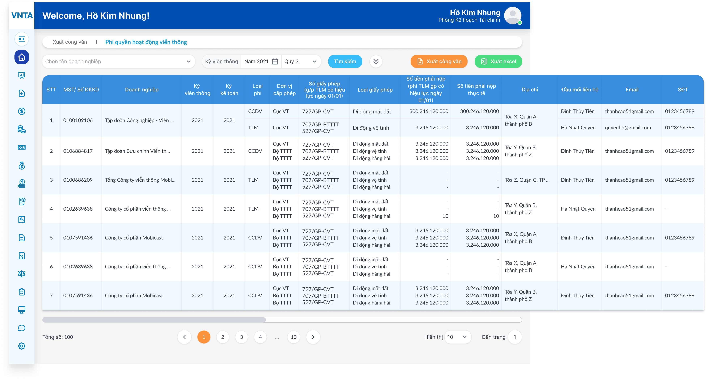

Giao diện tìm kiếm nâng cao

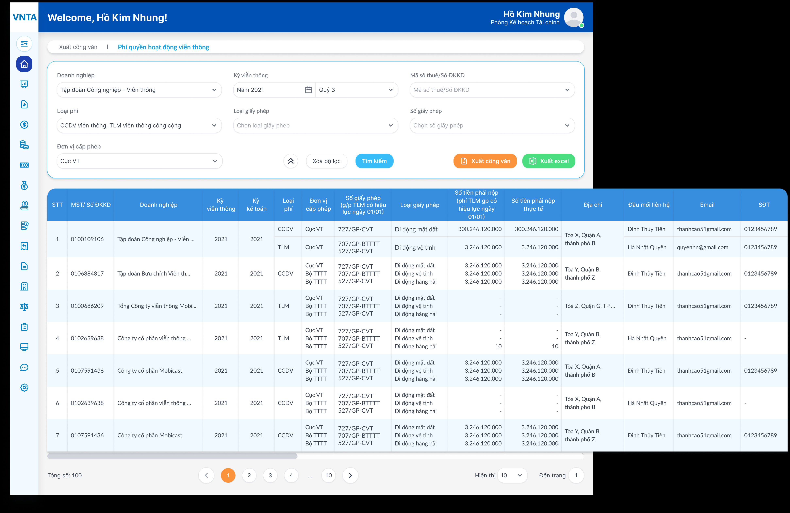

STT

Thông tin

Kiểu      dữ liệu

Bắt buộc

Mô tả

Database

1

Tra cứu rút gọn

Tra cứu rút gọn

Tra cứu rút gọn

Tra cứu rút gọn

Tra cứu rút gọn

1.1

Tên doanh nghiệp

combobox search

- Gồm all DN có gp CCDV và TLM đồng bộ từ hệ thống cũ (do P. CPTN nhập vào)

- Cho phép người dùng nhập tên DN

- Autocomplete gõ nhập tên doanh nghiệp hệ thống tự động gợi ý

- Sắp xếp các option theo thứ tự Mã định danh tăng dần (quy định ngầm trong hệ thống khi thêm mới DN)

1.2

Năm

datepicker

 x

- Autofill theo kỳ viễn thông quý gần nhất trước đó

- Cho phép người dùng chọn năm

1.3

Quý

combobox

- Autofill kỳ viễn thông gần nhất trước đó.

- Gồm:

+ Quý 1

+ Quý 2

+ Quý 3

+ Quý 4

- Nếu bỏ trống => mặc định là kỳ viễn thông tính theo năm

1.4

Icon Tìm kiếm nâng cao

Button

- Nhấn vào sẽ xổ xuống/thu lên khung Tìm kiếm nâng cao.

1.5

Tìm kiếm

button

Tìm kiếm theo các trường thông tin.

1.6

Xuất công văn

Button

Nhấn => hệ thống mở popup nhập thông tin xuất công văn

1.7

Xuất excel

button

Cho phép người dùng xuất file excel bảng danh sách đang hiển thị.

File gồm các cột giống trên giao diện (trừ cột xử lý), tiêu đề của sheet là Danh sách Doanh nghiệp cần xuất công văn, tên file: [Ngày xuất]_Danh sách DN cần xuất công văn

2

Tìm kiếm nâng cao

Tìm kiếm nâng cao

Tìm kiếm nâng cao

Tìm kiếm nâng cao

2.1

Doanh nghiệp

combobox search

- Gồm all DN có gp CCDV và TLM đồng bộ từ hệ thống cũ (do P. CPTN nhập vào)

- Cho phép người dùng nhập tên DN

- Autocomplete gõ nhập tên doanh nghiệp hệ thống tự động gợi ý

- Sắp xếp các option theo thứ tự Mã định danh tăng dần (quy định ngầm trong hệ thống khi thêm mới DN)

- Cho chọn 1 hoặc nhiều

2.2

 Mã số thuế/Số ĐKKD

combobox search

- Gồm all MST/Số ĐKKD của DN có gp CCDV và TLM

- Cho phép nhập Mã số thuế/ Số ĐKKD

- Autocomplete

- Cho chọn 1 hoặc nhiều

2.3

Số giấy phép

combobox search

- Gồm all gp CCDV và TLM đồng bộ từ hệ thống cũ (do P. CPTN nhập vào)

- Cho phép nhập số GP

- Autocomplete

- Cho chọn 1 hoặc nhiều

2.4

Loại giấy phép

combobox

Cho phép NSD tìm kiếm theo tên loại giấy phép:

- Cố định mặt đất

- Di động mặt đất

- Cố định vệ tinh

- Di động vệ tinh

- Di động hàng hải

- Di động hàng không

2.5

 Đơn vị cấp phép

combobox

Autofill “Cục Viễn thông”

Cho phép chọn đơn vị cấp phép:

- Bộ Thông tin truyền thông

- Cục Viễn thông

2.6

Kỳ viễn thông

Kỳ viễn thông

Kỳ viễn thông

Kỳ viễn thông

Kỳ viễn thông

2.6.1

Năm

datepicker

 x

- Autofill theo Kỳ có BCDT có dữ liệu gần nhất

- Cho phép người dùng chọn năm

2.6.2

Quý

combobox

- Autofill Kỳ có BCDT có dữ liệu gần nhất.

- Gồm:

+ Quý 1

+ Quý 2

+ Quý 3

+ Quý 4

- Nếu bỏ trống => mặc định là kỳ viễn thông tính theo năm

2.7

Loại phí

combobox

Cho phép NSD tìm kiếm theo loại phí:

Phí Cung cấp dịch vụ viễn thông

Phí Thiết lập mạng viễn thông công cộng

2.8

Xóa điều kiện

Button

Nhấn [Xóa điều kiện], hệ thống xóa toàn bộ dữ liệu tiêu chí tìm kiếm đã nhập, giữ nguyên kết quả tìm kiếm, quay về giao diện autofill ban đầu.

2.9

Tìm kiếm

Button

Nhấn [Tìm kiếm], hệ thống check hợp lệ của điều kiện tìm kiếm và danh sách kết quả.

2.10

Xuất công văn

Button

Nhấn => hệ thống mở popup nhập thông tin xuất công văn

2.11

Xuất excel

button

Cho phép người dùng xuất file excel bảng danh sách đang hiển thị.

3

Grid

Grid

Grid

Grid

Grid

3.1

STT

number

Hiển thị STT

3.2

MST/Số ĐKKD

number

Hiển thị mã số thuế và số đăng ký kinh doanh của DN

3.3

Doanh nghiệp

text

Hiển thị tên DN

3.4

Kỳ viễn thông

date

Định dạng hiển thị:

-   “ Qx/yyyy” đối với kỳ quý

-    “ yyyy” đối với kỳ năm

3.5

Kỳ kế toán

date

Định dạng hiển thị:

-       Qx/yyyy đối với kỳ quý

-       yyyy đối với kỳ năm

3.6

Loại phí

text

Hiển thị tên loại phí:

Phí quyền hoạt động viễn thông

Phí sử dụng mã, số viễn thông

3.7

Số giấy phép

text

Hiển thị số giấy phép tương ứng

3.8

Loại giấy phép

text

Hiển thị tên giấy phép trong các loại sau:

- Cố định mặt đất

- Di động mặt đất

- Cố định vệ tinh

- Di động vệ tinh

- Di động hàng hải

- Di động hàng không

3.9

Số tiền phải nộp (Phí TLM gp có hiệu lực ngày 01/01)

Currency

(Dựa theo Thông tư số 03/2018/TT-BTC):

Đối với phí CCDV:

Theo quý: = DT quý x 0,5%

Nếu =<0 hiển thị kết quả = 0

Theo năm = DT năm x 0,5% (tạm gọi là Phí theo BCDT) so sánh với Mức tối thiểu (tính theo số tháng tính phí thực tế)

--	+ Nếu Phí theo BCDT>= Mức tối thiểu => Số phải nộp Năm = Phí theo BCDT

--	+ Nếu Phí theo BCDT < Mức tối thiểu => Số phải nộp Năm = Mức tối thiểu

Số tháng tính phí thực tế được tính từ tháng sau của tháng được cấp giấy phép (bao gồm cả cấp mới hoặc sửa đổi, bổ sung giấy phép) đến hết tháng giấy phép hết hạn hoặc bị thu hồi (bao gồm cả thu hồi giấy phép khi sửa đổi, bổ sung)

Nếu có nhiều giấy phép CCDV cùng loại dịch vụ trong 1 năm sẽ cộng dồn mức tối thiểu của all các giấy phép (theo số tháng thực tế)

Đối với phí TLM (chỉ tính theo năm):

= Mức phí GP1 x Số tháng tính phí GP1 / 12

+ Mức phí GP2 x Số tháng tính phí GP2 / 12

+...+ Mức phí GPn x Số tháng tính phí GPn / 12

(Trong đó Mức phí sẽ được quản lý trong chức năng “Quản lý mức giá thu phí” có thể tham khảo mức phí áp dụng hiện tại Theo TT03 được trình bày tại mục III/4/4.5)

- Nếu là số thập phân làm tròn chỉ lấy phần nguyên, phần thập phân >=5 sẽ làm tròn phần số nguyên lên 1 đơn vị, ngược lại giữ nguyên phần số nguyên ko làm tròn nếu phần thập phân<5

- Giữ nguyên số tiền phí TLM viễn thông đã tính theo ngày 01/01 dù trong năm có thay đổi số tiền phải nộp

3.10

Số tiền phải nộp thực tế

Currency

Hiển thị số tiền thực tế DN phải nộp

3.11

Địa chỉ

varchar (200)

Hiển thị địa chỉ liên hệ hiện tại của DN theo từng loại phí

3.12

Đầu mối liên hệ

varchar (50)

Hiển thị họ tên đầu mối liên hệ hiện tại ứng với từng loại phí

3.13

Email

varchar (50)

Hiển thị email của đầu mối liên hệ hiện tại của DN theo từng loại phí

3.14

SĐT

Number (10)

- Hiển thị số điện thoại của đầu mối liên hệ hiện tại của DN theo từng loại phí

Xuất công văn phí quyền hoạt động viễn thông của P. KHTC

Luồng chức năng

Thông tin chung

Tên chức năng

Xuất công văn phí quyền hoạt động viễn thông của P. KHTC

Mô tả

Chức năng cho phép cán bộ Phòng KHTC xuất các công văn thông báo, công văn đôn đốc, công văn gửi Phòng TTPC, công văn đối chiếu công nợ về việc thu phí quyền hoạt động viễn thông (CCDV và TLM VT công cộng)

Tác nhân

Lãnh đạo, Cán bộ Phòng KHTC

Điều kiện trước

Đăng nhập vào hệ thống, có phân quyền chức năng

Điều kiện sau

Xuất thành công các công văn

Ngoại lệ

N/A

Các yêu cầu đặc biệt

N/A

Luồng chức năng

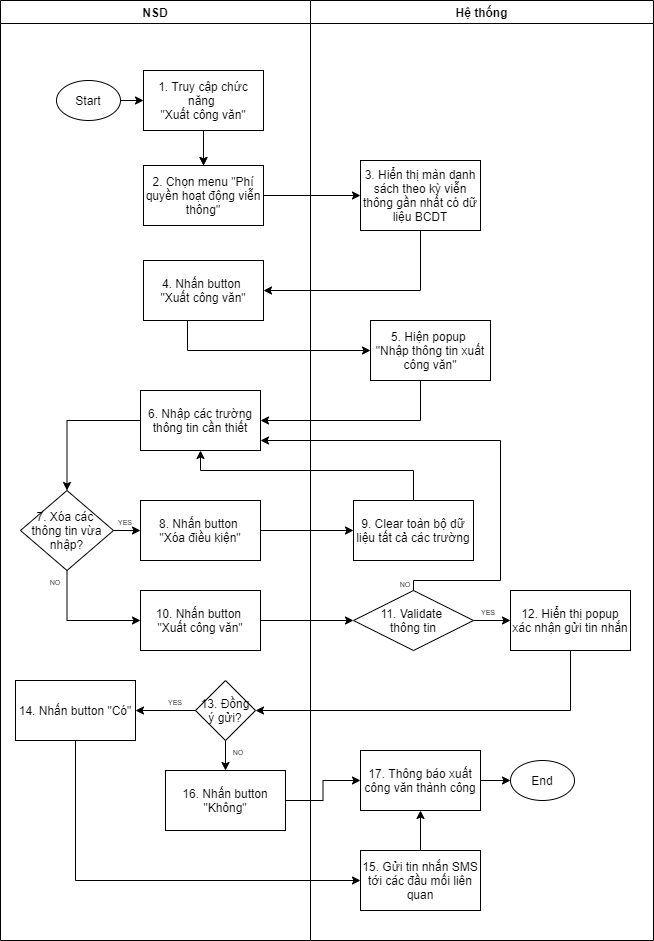

Bước

Mô tả

1

Truy cập chức năng "Xuất công văn"

2

Chọn menu "Phí quyền hoạt động viễn thông"

3

Hiển thị màn danh sách theo kỳ viễn thông gần nhất có dữ liệu

4

Nhấn button "Xuất công văn" để tiến hành xuất công văn => hiện popup xuất công văn.

5

Hiện popup "Nhập thông tin xuất công văn"

6

Nhập các trường thông tin cần thiết

7

Có xóa điều kiện tìm kiếm ko?

--	Nếu có chuyển bước 8

--	Nếu ko chuyển bước 10

8

Nhấn button "Xóa điều kiện"

9

Nhấn [Xóa điều kiện], hệ thống xóa toàn bộ dữ liệu tiêu chí tìm kiếm đã nhập, giữ nguyên kết quả tìm kiếm, quay về giao diện autofill ban đầu.

10

Nhấn button "Xuất công văn" để hoàn thành và kết thúc thao tác Xuất công văn.

1. Xuất công văn thông báo CCDV cho danh sách các DN theo quy tắc:

Đối với giấy phép CCDV được cấp phép năm đầu:

- Ngày cấp phép < 01/12/năm:

+ Có trong danh sách xuất cv thông báo phải nộp phí Kỳ Năm DN được cấp phép

+ Không có trong danh sách xuất cv thông báo phải nộp phí Kỳ Quý năm DN được cấp phép

- 30/11/năm < Ngày cấp phép < 31/12/năm:

+ Không có trong danh sách xuất cv thông báo phải nộp phí Kỳ Năm DN được cấp phép

+ Không có trong danh sách xuất cv thông báo phải nộp phí Kỳ Quý năm DN được cấp phép

Đối với giấy phép TLM viễn thông công cộng năm đầu

- Ngày cấp phép = 01/01/năm

+ Có trong danh sách xuất công văn thông báo phải nộp phí Kỳ Năm DN được cấp phép

+ Số tiền phải nộp: Tính phí bình thường

- 01/01/năm < Ngày cấp phép < =31/12/năm:

+ Không có trong danh sách xuất công văn thông báo phải nộp phí Kỳ Năm DN được cấp phép

2. Hệ thống xuất file cv và file excel đính kèm:

2.1. Tên file công văn

Công văn thông báo

Tên file công văn thông báo CCDV:

[STT]_Về việc thông báo nộp phí CCDV [Kỳ] của [Tên Doanh nghiệp]

(đánh STT đầu các công văn gửi các DN, thứ tự các DN sắp xếp tặng dần theo Mã định danh)

Ví dụ: 1. Về việc thông báo nộp phí CCDV Quý I năm 2021 của Tập đoàn viễn thông quân đội

Tên file excel danh sách DN đính kèm cv thông báo CCDV: [Ngày xuất công văn]_Danh sách DN phải nộp phí CCDV [Kỳ]

(thứ tự các DN sắp xếp tăng dần theo Mã định danh)

Tên file công văn thông báo TLM viễn thông công cộng:

[STT]_Về việc thông báo nộp phí TLM viễn thông công cộng năm [Năm] của [Tên Doanh nghiệp]

(đánh STT đầu các công văn gửi các DN, thứ tự các DN sắp xếp tặng dần theo Mã định danh)

Ví dụ: 1. Về việc thông báo nộp phí TLM viễn thông công cộng năm 2021 của Tập đoàn viễn thông quân đội

CV đôn đốc:

Tên file công văn:

[STT]_Về việc đôn đốc nộp phí quyền hoạt động viễn thông đến ngày [Ngày] của [Tên Doanh nghiệp]

(đánh STT đầu các công văn gửi các DN, thứ tự các DN sắp xếp tặng dần theo Mã định danh)

Ví dụ: 1. Về việc đôn đốc nộp phí quyền hoạt động viễn thông đến ngày 31.08.2021 của Tập đoàn viễn thông quân đội

Tên file excel xuất kèm (mỗi DN một file đính kèm):

[STT] Phụ lục_Về việc đôn đốc nộp phí quyền hoạt động viễn thông đến ngày [Ngày] của Tập đoàn viễn thông quân đội

Tên file excel danh sách DN đính kèm: [Ngày xuất công văn]_Danh sách DN chưa nộp phí quyền hoạt động đến ngày [Ngày]

(thứ tự các DN sắp xếp tặng dần theo Mã định danh)

Cv gửi Thanh tra:

Tên file công văn: [Ngày xuất công văn]_Cv gửi P.TT Doanh nghiệp chưa nộp phí quyền hoạt động đến ngày [Ngày]

Ví dụ: 06.05.2021_Cv gửi P.TT Doanh nghiệp chưa nộp phí quyền hoạt động đến ngày 31.08.2021

Tên file excel danh sách DN đính kèm: [Ngày xuất công văn]_Danh sách Doanh nghiệp chưa nộp phí quyền hoạt động đến ngày [Ngày]

Cv đối chiếu công nợ:

Tên file công văn:

[STT]_Về việc đối chiếu công nợ phí quyền hoạt động viễn thông từ [Năm] đến [Năm] của [Tên Doanh nghiệp]

(đánh STT đầu các công văn gửi các DN, thứ tự các DN sắp xếp tặng dần theo Mã định danh)

Ví dụ: 1. Về việc đối chiếu công nợ phí quyền hoạt động viễn thông từ 2017 đến 2020 của Tập đoàn viễn thông quân đội

Tên file excel xuất kèm (mỗi DN một file đính kèm):

[STT] Phụ lục_Về việc đối chiếu công nợ phí quyền hoạt động viễn thông từ [Năm] đến [Năm] của Tập đoàn viễn thông quân đội

Tên file excel danh sách DN đính kèm: [Ngày xuất công văn]_Danh sách DN đối chiếu công nợ phí quyền hoạt động từ [Năm] đến [Năm]

[Ngày xuất công văn]: Ngày thực hiện xuất công văn trệ hệ thống

[Ngày]: Trường [Tính đến ngày] khi nhập thông tin xuất công văn

11

Hệ thống validate thông tin nhập, nếu có lỗi báo lỗi các trường nhập sai

Ví dụ:

Loại công văn là trường bắt buộc!

Không có Doanh nghiệp phải nộp phí trong Kỳ [Kỳ]!

12

Hiển thị popup xác nhận gửi tin nhắn

13

Có đồng ý gửi tin nhắn đến DN xuất cv ko?

--	Nếu có chuyển sang bước 14

--	Nếu không chuyển sang bước 16

14

Nhấn button Có

15

Gửi tin nhắn SMS tới các đầu mối liên hệ tương ứng với từng loại phí của mỗi DN

16

Nhấn button Không

17

Thông báo xuất công văn thành công
Đồng thời ko gửi tin nhắn SMS tới các đầu mối liên hệ tương ứng với các loại phí của từng DN

Giao diện chức năng

Giao diện khi mở popup Xuất công văn

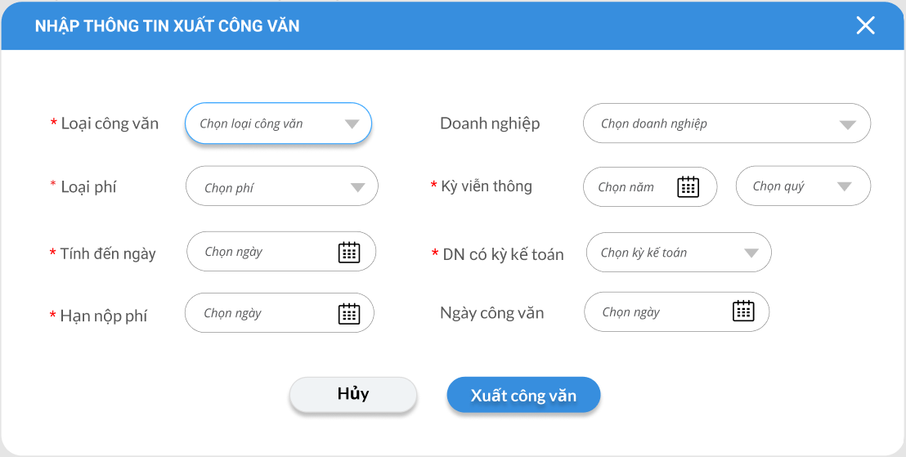

Giao diện xuất cv đối chiếu công nợ

Popup Xác nhận gửi tin nhắn

STT

Thông tin

Kiểu dữ liệu

Bắt buộc

Mô tả

Database

1

POPUP Nhập thông tin xuất công văn

POPUP Nhập thông tin xuất công văn

POPUP Nhập thông tin xuất công văn

POPUP Nhập thông tin xuất công văn

POPUP Nhập thông tin xuất công văn

1.1

Loại công văn

Combobox

x

Cho phép chọn 1 trong 4 sự lựa chọn:

- Công văn thông báo nộp phí

- Công văn đôn đốc nộp phí

- Công văn đối chiếu công nợ

- Công văn gửi P. TTPC

1.2

Doanh nghiệp

combobox search

- Gồm all DN có giấy phép CCDV, TLM

- Cho phép người dùng nhập tên DN (khi chọn loại cv thông báo, đôn đốc, đối chiếu) nếu không sẽ ẩn trường này

- Autocomplete gõ nhập tên doanh nghiệp hệ thống tự động gợi ý

- Sắp xếp các option theo thứ tự Mã định danh tăng dần (quy định ngầm trong hệ thống khi thêm mới DN)

1.3

Loại phí

Combobox

x

Hiển thị trường dữ liệu này khi NSD chọn “Công văn thông báo nộp phí”. Nếu không sẽ ẩn trường này.

NSD chọn 1 trong 2 lựa chọn: Phí Cung cấp dịch vụ viễn thông/ Phí Thiết lập mạng viễn thông công cộng

1.4

Kỳ viễn thông

Kỳ viễn thông

Kỳ viễn thông

Kỳ viễn thông

Kỳ viễn thông

1.4.1

Năm

datepicker

 x

- Autofill theo quý liền kề trước của quý hiện tại.

- Cho phép người dùng chọn năm

1.4.2

Quý

combobox

- Autofill quý liền kề trước của quý hiện tại.

- Gồm:

+ Quý 1

+ Quý 2

+ Quý 3

+ Quý 4

- Nếu bỏ trống => mặc định là kỳ viễn thông tính theo năm

1.5

Tính đến ngày

datepicker

x

Hiển thị trường dữ liệu này khi NSD chọn “Công văn đôn đốc nộp phí”, “Công văn đối chiếu công nợ” hoặc “Công văn gửi P. TTPC”. Nếu không sẽ ẩn trường này.

Cho phép chọn ngày mong muốn hiển thị trên công văn và phụ lục

1.6

DN có kỳ kế toán

combobox

x

Hiển thị trường dữ liệu này khi NSD: CHỌN “Công văn thông báo” Loại phí CCDV đồng thời KHÔNG CHỌN Quý

1.7

Từ năm – Đến năm

Datepicker

x

Hiển thị khi chọn Loại cv là Công văn đối chiếu công nợ

Đến năm >= Từ năm

1.8

Hạn nộp phí

datepicker

x

Hiển thị trường dữ liệu này khi NSD:

chọn “Công văn đôn đốc nộp phí” hoặc “Công văn thông báo nộp phí”

Cho phép chọn hạn nộp phí để fill lên công văn được xuất.

Hạn nộp phí khi xuất cv thông báo sẽ được fill dữ liệu vào cột “Hạn nộp phí” Chức năng Theo dõi thu phí CCDV

1.9

Ngày công văn

datepicker

Cho phép chọn ngày công văn để fill lên công văn được xuất.

1.10

Hủy

button

Nhấn [Hủy], hệ thống ko xuất cv đồng thời đóng popup quay lại danh sách DN P. KHTC cần xuất công văn

1.11

Xuất công văn

button

Nhấn button để xác nhận việc xuất công văn -> hiển thị POPUP xác nhận gửi tin nhắn.

2

POPUP Xác nhận gửi tin nhắn: đối với Cv thông báo/đôn đốc/đối chiếu công nợ

POPUP Xác nhận gửi tin nhắn: đối với Cv thông báo/đôn đốc/đối chiếu công nợ

POPUP Xác nhận gửi tin nhắn: đối với Cv thông báo/đôn đốc/đối chiếu công nợ

POPUP Xác nhận gửi tin nhắn: đối với Cv thông báo/đôn đốc/đối chiếu công nợ

POPUP Xác nhận gửi tin nhắn: đối với Cv thông báo/đôn đốc/đối chiếu công nợ

2.1

Bạn có muốn gửi tin nhắn thông báo đến doanh nghiệp không?

label

2.2

Có

button

Nhấn button => hệ thống tự động gửi tin nhắn theo đầu mối liên hệ ứng với từng loại phí của mỗi DN => Thông báo Xuất Công văn thành công và quay trở về màn Xem danh sách ban đầu.

2.3

Không

button

Từ chối gửi tin nhắn => thông báo Xuất Công văn thành công và quay trở về màn Xem danh sách ban đầu (ko gửi tin nhắn)

Xem danh sách Doanh nghiệp P. KHTC cần xuất công văn phí sử dụng mã, số viễn thông

Luồng chức năng

Thông tin chung

Tên chức năng

Xem danh sách DN cần xuất công văn thu phí sử dụng mã, số viễn thông

Mô tả

Chức năng cho phép cán bộ Phòng KHTC xem danh sách các DN cần xuất công văn liên quan đến phí sử dụng mã, số viễn thông và các thông tin liên quan.

Tác nhân

Lãnh đạo, Cán bộ Phòng KHTC

Điều kiện trước

Đăng nhập vào hệ thống, có phân quyền chức năng

Điều kiện sau

Xem, tìm kiếm được danh sách các Doanh nghiệp theo các điều kiện có sẵn

Ngoại lệ

N/A

Các yêu cầu đặc biệt

N/A

Luồng chức năng

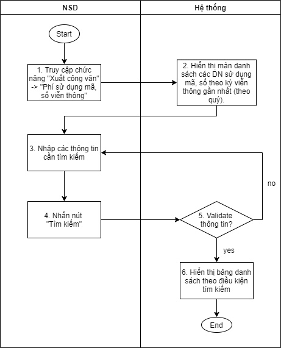

Mô tả luồng xử lý

Bước

Mô tả

Bước 1

NSD truy cập chức năng "Xuất công văn". Chọn menu "Phí sử dụng mã, số viễn thông".

Bước 2

Hiển thị màn danh sách các DN:

 - Mặc định giao diện mới vào sẽ hiển thị danh sách DN sử dụng mã, số VT trong kỳ viễn thông gần nhất trước đó.

Bước 3

Nhập thông tin tìm kiếm.

Bước 4

Nhấn [Tìm kiếm] để bắt đầu tra cứu.

Bước 5

Hệ thống validate thông tin nhập, nếu có lỗi sẽ báo lỗi các trường nhập sai, quay lại bước 3, ngược lại sẽ tiếp tục bước 6

Bước 6

Hiển thị bảng danh sách theo điều kiện tìm kiếm.

Giao diện chức năng

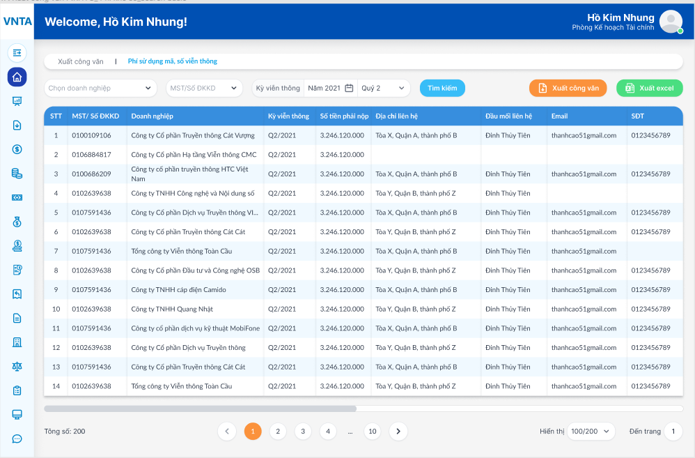

STT

Thông tin

Kiểu dữ liệu

Bắt buộc

Mô tả

Database

1

Chọn doanh nghiệp

Combobox search

- Gồm tất cả các DN có trong hệ thống

- Cho phép gõ nhập tên DN, cho phép chọn đồng thời nhiều DN.

- Autocomplete

- Sắp xếp theo Mã định danh giảm dần

2

MST/Số ĐKKD

Combobox search

- Gồm all MST/Số ĐKKD của tất cả DN có trong hệ thống.

- Cho phép nhập Mã số thuế/ Số ĐKKD.

- Autocomplete.

- Cho chọn 1 hoặc nhiều.

3

Kỳ viễn thông

Kỳ viễn thông

Kỳ viễn thông

Kỳ viễn thông

Kỳ viễn thông

3.1

Chọn năm

datepicker

x

Auto fill theo quý gần nhất trước đó.

3.2

Chọn quý

datepicker

x

Auto fill theo quý gần nhất trước đó.

4

Tìm kiếm

button

Nhấn -> tìm kiếm theo các tiêu chí đã nhập.

5

Xuất công văn

button

Nhấn -> Hiện popup Nhập thông tin xuất công văn.

6

Xuất excel

button

Nhấn -> Xuất excel bảng danh sách theo tiêu chí đang tìm kiếm.

File gồm các cột giống trên giao diện, tiêu đề của sheet là “Danh sách Doanh nghiệp cần xuất công văn thu phí sử dụng mã, số viễn thông [Qúy]”, tên file: [Ngày xuất]_Danh sách DN cần xuất công văn thu phí sử dụng mã, số viễn thông [Qúy]

7

Grid

Grid

Grid

Grid

Grid

7.1

STT

number

Số thứ tự liên tục từ 1 đến hết.

7.2

MST/Số ĐKKD

number

Hiển thị mã số thuế/số đăng kí kinh doanh.

7.3

Doanh nghiệp

Text

Hiển thị tên doanh nghiệp.

7.4

Kỳ viễn thông

date

Hiển thị kỳ viễn thông dưới dạng Qx/yyyy

7.5

Số tiền phải nộp

Currency

Hiển thị tổng số tiền phí kho số của tất cả các loại mã, số DN đang sử dụng trong kỳ đó.

- Nếu là số thập phân làm tròn chỉ lấy phần nguyên, phần thập phân >=5 sẽ làm tròn phần số nguyên lên 1 đơn vị, ngược lại giữ nguyên phần số nguyên ko làm tròn nếu phần thập phân<5

7.6

Địa chỉ liên hệ

Text

Hiển thị địa chỉ liên hệ đồng bộ từ phần mềm cũ.

7.7

Đầu mối liên hệ

Text

Hiển thị thông tin đầu mối liên hệ của phí sử dụng mã, số viễn thông.

7.8

Email

Text

Hiển thị địa chỉ email của đầu mối liên hệ phí sử dụng mã, số viễn thông.

7.9

SĐT

Number

Hiển thị số điện thoại của đầu mối liên hệ phí sử dụng mã, số viễn thông.

8

Phân trang

Phân trang

Phân trang

Phân trang

Phân trang

8.1

Tổng số bản ghi

Text

Hiển thị tổng số bản ghi theo điều kiện tìm kiếm

8.2

Phân trang

button

Gồm các button: Về trang trước đó, 1, 2, 3, 4, 5 (nếu ít trang hơn sẽ tự cắt bớt), về trang sau đó.

8.3

Số bản ghi trên 1 trang

combobox

Gồm:

10/20/50/100

Mặc định 10 bản ghi trên 1 trang.

8.4

Đến trang

Text

- Nhập số trang => hệ thống nhảy đến dữ liệu trang tương ứng.

Xuất công văn thu phí sử dụng mã, số viễn thông của P. KHTC

Luồng chức năng

Thông tin chung

Tên chức năng

Xuất công văn thu phí sử dụng mã, số viễn thông của Phòng KHTC.

Mô tả

Chức năng cho phép cán bộ Phòng KHTC xuất các công văn thông báo, công văn đôn đốc, công văn gửi Phòng TTPC, công văn đối chiếu công nợ về việc thu phí sử dụng mã, số viễn thông.

Tác nhân

Lãnh đạo, Cán bộ Phòng KHTC.

Điều kiện trước

Đăng nhập vào hệ thống, có phân quyền chức năng.

Điều kiện sau

Xuất thành công các công văn.

Ngoại lệ

N/A

Các yêu cầu đặc biệt

N/A

Luồng chức năng

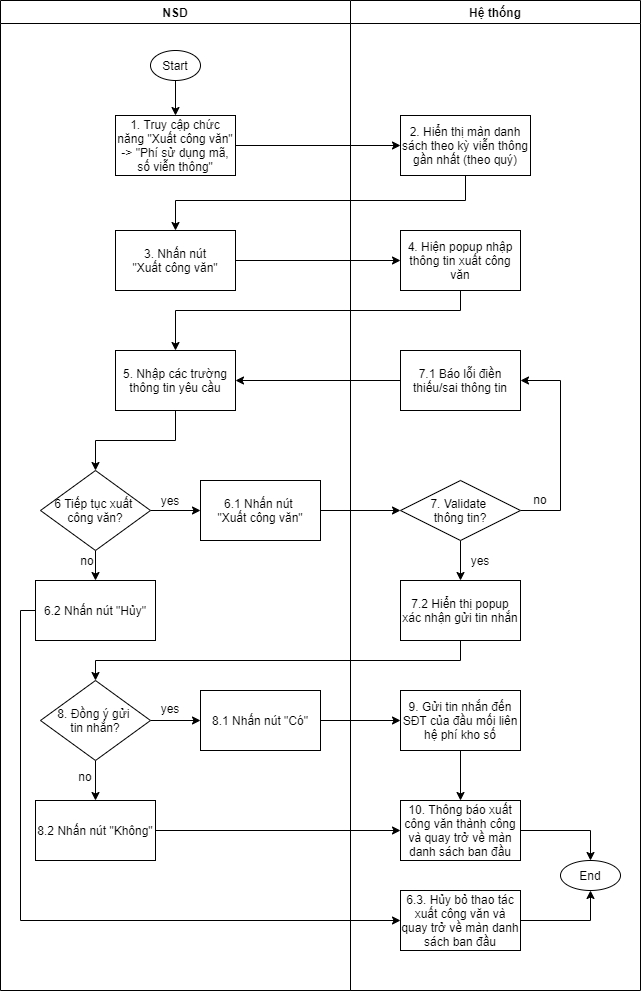

Bước

Mô tả

1

Truy cập chức năng "Xuất công văn" -> "Phí sử dụng mã, số viễn thông"

2

Hiển thị màn danh sách theo kỳ viễn thông gần nhất (theo quý)

3

Nhấn button "Xuất công văn" để tiến hành xuất công văn => hiện popup xuất công văn.

4

Hiện popup "Nhập thông tin xuất công văn"

5

Nhập các trường thông tin yêu cầu

6

Tiếp tục xuất công văn? Nếu đồng ý chuyển qua bước 6.1. Nếu không thì chuyển bước 6.2.

6.1

Nhấn nút "Xuất công văn"

Nhấn button "Xuất công văn" để hoàn thành và kết thúc thao tác Xuất công văn.

						1)	Xuất công văn Thông báo cho danh sách các DN theo quy tắc: Phân bổ mã, số quý nào thì thông báo thu phí quý đó, gồm tất cả các doanh nghiệp có sử dụng mã, số trong quý.

						2)	Xuất công văn đôn đốc chỉ tới các DN còn nợ tiền phí kỳ viễn thông đó.

						3)	Tên file công văn và file đính kèm:

Công văn thông báo

--	-     Tên file công văn: [STT]_Về việc thông báo nộp phí sử dụng mã, số viễn thông [Kỳ] của [Tên Doanh nghiệp]

(Các DN sắp xếp tăng dần theo Mã định danh, đánh STT liên tục từ 1 đến hết).

Tên file excel đính kèm: [Ngày xuất công văn]_Danh sách DN phải nộp phí sử dụng mã, số viễn thông [Kỳ]

(Các DN sắp xếp tăng dần theo Mã định danh)

CV đôn đốc:

Tên file công văn: [STT]_Về việc đôn đốc nộp phí sử dụng mã, số viễn thông tính đến ngày [Ngày] của [Tên Doanh nghiệp]

(Các DN sắp xếp tăng dần theo Mã định danh, đánh STT liên tục từ 1 đến hết)

Ví dụ: 1. Về việc đôn đốc nộp phí sử dụng mã, số viễn thông đến ngày 31.08.2021 của Tập đoàn viễn thông quân đội

Tên file excel phụ lục xuất kèm (mỗi DN một file đính kèm):

--	[STT] Phụ lục_Về việc đôn đốc nộp phí sử dụng mã, số viễn thông tính đến ngày [Ngày] của [Tên DN]

Tên file excel danh sách DN đính kèm: [Ngày xuất công văn]_Danh sách DN chưa nộp phí sử dụng mã, số viễn thông tính đến ngày [Ngày]

Xuất thành 02 folder và 1 file Danh sách DN đính kèm: 01 folder là Danh sách công văn, 1 folder là File đính kèm từng DN (STT Doanh nghiệp 2 file giống nhau)

(Các DN sắp xếp tăng dần theo Mã định danh, đánh STT liên tục từ 1 đến hết)

Cv gửi Thanh tra:

Tên file công văn: [Ngày xuất công văn]_Cv gửi P.TT Doanh nghiệp chưa nộp phí sử dụng mã, số viễn thông tính đến ngày [Ngày]

Ví dụ: 06.05.2021_Cv gửi P.TT Doanh nghiệp chưa nộp phí sử dụng mã, số viễn thông tính đến ngày 31.08.2021

Tên file excel đính kèm: [Ngày xuất công văn]_Danh sách Doanh nghiệp chưa nộp phí sử dụng mã, số viễn thông đến ngày [Ngày]

Cv đối chiếu công nợ:

Tên file công văn: [STT]_Về việc đối chiếu công nợ phí sử dụng mã, số viễn thông từ [Quý] đến [Quý] của [Tên Doanh nghiệp] tính đến ngày [Ngày]

(đánh STT đầu các công văn gửi các DN, thứ tự các DN sắp xếp tặng dần theo Mã định danh)

Ví dụ: 1. Về việc đối chiếu công nợ phí sử dụng mã, số viễn thông từ Q1/2017 đến Q4/2020 của Tập đoàn viễn thông quân đội tính đến ngày 26.09.2021

Tên file excel phụ lục xuất kèm (mỗi DN một file phụ lục):

[STT] Phụ lục_Về việc đối chiếu công nợ phí sử dụng mã, số viễn thông từ [Quý] đến [Quý] của [Tên Doanh nghiệp] tính đến ngày [Ngày]

Tên file excel danh sách DN đính kèm: [Ngày xuất công văn]_Danh sách DN đối chiếu công nợ phí sử dụng mã, số viễn thông từ [Quý] đến [Quý] tính đến ngày [Ngày]

Xuất thành 02 folder và 1 file Danh sách DN đính kèm: 01 folder là Danh sách công văn, 1 folder là File đính kèm từng DN (STT Doanh nghiệp 2 file giống nhau)

(Các DN sắp xếp tăng dần theo Mã định danh, đánh STT liên tục từ 1 đến hết)

[Ngày xuất công văn]: Ngày thực hiện xuất công văn trên hệ thống

[Ngày]: Trường “Tính đến ngày” khi nhập thông tin xuất công văn

6.2

Nhấn nút "Hủy"

6.3

Hủy bỏ thao tác xuất công văn và quay trở về màn danh sách ban đầu.

Kết thúc luồng.

7

Hệ thống validate thông tin. Nếu đủ thông tin thì chuyển qua bước 7.2. Nếu không thì chuyển bước 7.1.

7.1.

Hệ thống báo lỗi các trường nhập sai.

Ví dụ:

Loại công văn là trường bắt buộc!

Không có Doanh nghiệp phải nộp phí trong [Kỳ]!

7.2

Hiển thị popup xác nhận gửi tin nhắn

8

Bạn có muốn gửi tin nhắn thông báo đến các doanh nghiệp không?

- Nếu có chuyển sang bước 8.1.

- Nếu không chuyển sang bước 8.2.

8.1

Nhấn button Có.

8.2

Nhấn button Không.

9

Gửi tin nhắn đến SĐT của đầu mối liên hệ phí kho số

10

Thông báo xuất công văn thành công và quay trở về màn danh sách ban đầu.

Kết thúc luồng.

Giao diện chức năng

Giao diện khi mở popup Xuất công văn

--	Giao diện xuất cv thông báo

STT

Thông tin

Kiểu dữ liệu

Bắt buộc

Mô tả

Database

POPUP Xuất công văn thông báo nộp phí

POPUP Xuất công văn thông báo nộp phí

POPUP Xuất công văn thông báo nộp phí

POPUP Xuất công văn thông báo nộp phí

POPUP Xuất công văn thông báo nộp phí

POPUP Xuất công văn thông báo nộp phí

1

Loại công văn

Combobox

x

Cho phép chọn 1 trong 4 sự lựa chọn:

- Công văn thông báo nộp phí

- Công văn đôn đốc nộp phí

- Công văn đối chiếu công nợ

- Công văn gửi P. Thanh tra

2

Doanh nghiệp

combobox search

- Gồm all DN trong hệ thống. Nếu chọn DN không phải nộp phí hệ thống báo lỗi

- Được chọn nhiều doanh nghiệp đồng thời.

- Autocomplete gõ nhập tên doanh nghiệp hệ thống tự động gợi ý.

- Sắp xếp các option theo thứ tự Mã định danh tăng dần (quy định ngầm trong hệ thống khi thêm mới DN).

3

Kỳ viễn thông

Kỳ viễn thông

Kỳ viễn thông

Kỳ viễn thông

Kỳ viễn thông

3.1

Chọn năm

yearpicker

x

Cho phép chọn năm bất kỳ.

3.2

Chọn quý

combobox

x

Gồm 4 lựa chọn:

- Quý 1

- Quý 2

- Quý 3

- Quý 4

4

Hạn nộp phí

datepicker

x

Cho phép chọn ngày bất kỳ.

5

Ngày công văn

datepicker

Cho phép chọn ngày bất kỳ.

6

Xuất công văn

Button

Nhấn -> hiện popup xác nhận gửi tin nhắn.

Nếu thông tin nhập sai/thiếu

-> báo lỗi “Vui lòng nhập đầy đủ thông tin!”

7

Hủy

Button

Nhấn -> hủy bỏ thao tác xuất công văn. Đóng popup và quay trở lại màn danh sách đang tìm kiếm.

Giao diện xuất cv đôn đốc

STT

Thông tin

Kiểu dữ liệu

Bắt buộc

Mô tả

Database

POPUP Xuất công văn đôn đốc nộp phí

POPUP Xuất công văn đôn đốc nộp phí

POPUP Xuất công văn đôn đốc nộp phí

POPUP Xuất công văn đôn đốc nộp phí

POPUP Xuất công văn đôn đốc nộp phí

POPUP Xuất công văn đôn đốc nộp phí

1

Loại công văn

Combobox

x

Cho phép chọn 1 trong 4 sự lựa chọn:

- Công văn thông báo nộp phí

- Công văn đôn đốc nộp phí

- Công văn đối chiếu công nợ

- Công văn gửi P. Thanh tra

2

Doanh nghiệp

combobox search

- Gồm all DN trong hệ thống. Nếu chọn DN không còn nợ phí hệ thống báo lỗi.

- Được chọn nhiều doanh nghiệp đồng thời.

- Autocomplete gõ nhập tên doanh nghiệp hệ thống tự động gợi ý.

- Sắp xếp các option theo thứ tự Mã định danh tăng dần (quy định ngầm trong hệ thống khi thêm mới DN).

3

Tính đến ngày

datepicker

x

Cho phép chọn ngày bất kỳ, giới hạn đến ngày hiện tại.

4

Hạn nộp phí

datepicker

x

Cho phép chọn ngày bất kỳ.

5

Ngày công văn

datepicker

Cho phép chọn ngày bất kỳ.

6

Xuất công văn

Button

Nhấn -> hiện popup xác nhận gửi tin nhắn.

Nếu thông tin nhập sai/thiếu

-> báo lỗi “Vui lòng nhập đầy đủ thông tin!”

7

Hủy

Button

Nhấn -> hủy bỏ thao tác xuất công văn. Đóng popup và quay trở lại màn danh sách đang tìm kiếm.

Giao diện xuất cv đối chiếu công nợ

STT

Thông tin

Kiểu dữ liệu

Bắt buộc

Mô tả

Database

POPUP Xuất công văn đối chiếu công nợ

POPUP Xuất công văn đối chiếu công nợ

POPUP Xuất công văn đối chiếu công nợ

POPUP Xuất công văn đối chiếu công nợ

POPUP Xuất công văn đối chiếu công nợ

POPUP Xuất công văn đối chiếu công nợ

1

Loại công văn

Combobox

x

Cho phép chọn 1 trong 4 sự lựa chọn:

- Công văn thông báo nộp phí

- Công văn đôn đốc nộp phí

- Công văn đối chiếu công nợ

- Công văn gửi P. Thanh tra

2

Doanh nghiệp

combobox search

- Gồm all DN trong hệ thống. Nếu chọn DN không phải nộp phí hệ thống báo lỗi

- Được chọn nhiều doanh nghiệp đồng thời.

- Autocomplete gõ nhập tên doanh nghiệp hệ thống tự động gợi ý.

- Sắp xếp các option theo thứ tự Mã định danh tăng dần (quy định ngầm trong hệ thống khi thêm mới DN).

3

Giai đoạn

datepicker

x

Cho phép chọn Từ quý <= Đến Qúy

Chặn Từ quý chỉ được chọn từ Q4/2020

4

Tính đến ngày

datepicker

x

Cho phép chọn ngày bất kỳ, giới hạn đến ngày hiện tại.

5

Ngày công văn

datepicker

Cho phép chọn ngày bất kỳ.

6

Xuất công văn

Button

Nhấn -> hiện popup xác nhận gửi tin nhắn.

Nếu thông tin nhập sai/thiếu

-> báo lỗi “Vui lòng nhập đầy đủ thông tin!”

7

Hủy

Button

Nhấn -> hủy bỏ thao tác xuất công văn. Đóng popup và quay trở lại màn danh sách đang tìm kiếm.

Giao diện xuất cv gửi phòng thanh tra

STT

Thông tin

Kiểu dữ liệu

Bắt buộc

Mô tả

Database

POPUP Xuất công văn gửi phòng thanh tra

POPUP Xuất công văn gửi phòng thanh tra

POPUP Xuất công văn gửi phòng thanh tra

POPUP Xuất công văn gửi phòng thanh tra

POPUP Xuất công văn gửi phòng thanh tra

POPUP Xuất công văn gửi phòng thanh tra

1

Loại công văn

Combobox

x

Cho phép chọn 1 trong 4 sự lựa chọn:

- Công văn thông báo nộp phí

- Công văn đôn đốc nộp phí

- Công văn đối chiếu công nợ

- Công văn gửi P. Thanh tra

2

Tính đến ngày

datepicker

x

Cho phép chọn ngày bất kỳ, giới hạn đến ngày hiện tại.

3

Ngày công văn

datepicker

Cho phép chọn ngày bất kỳ.

4

Xuất công văn

Button

Nhấn -> hiện popup xác nhận gửi tin nhắn.

Nếu thông tin nhập sai/thiếu

-> báo lỗi “Vui lòng nhập đầy đủ thông tin!”

5

Hủy

Button

Nhấn -> hủy bỏ thao tác xuất công văn. Đóng popup và quay trở lại màn danh sách đang tìm kiếm.

Popup Xác nhận gửi tin nhắn

STT

Thông tin

Kiểu dữ liệu

Bắt buộc

Mô tả

Database

POPUP Xác nhận gửi tin nhắn: đối với Cv thông báo/đôn đốc/đối chiếu công nợ

POPUP Xác nhận gửi tin nhắn: đối với Cv thông báo/đôn đốc/đối chiếu công nợ

POPUP Xác nhận gửi tin nhắn: đối với Cv thông báo/đôn đốc/đối chiếu công nợ

POPUP Xác nhận gửi tin nhắn: đối với Cv thông báo/đôn đốc/đối chiếu công nợ

POPUP Xác nhận gửi tin nhắn: đối với Cv thông báo/đôn đốc/đối chiếu công nợ

POPUP Xác nhận gửi tin nhắn: đối với Cv thông báo/đôn đốc/đối chiếu công nợ

1

Có

button

Nhấn -> Xuất công văn đồng thời gửi tin nhắn tới các đầu mối phí kho số của từng DN.

Nếu chưa có bất kì số điện thoại liên hệ nào thì báo lỗi “Chưa cập nhật”.

Chỉ có công văn thông báo/đôn đốc/đối chiếu công nợ thì hiển thị popup này.

2

Không

button

Từ chối gửi tin nhắn => thông báo Xuất Công văn thành công và quay trở về màn Xem danh sách ban đầu (ko gửi tin nhắn)

Quản lý thu phí CCDV

Xem danh sách Theo dõi thu phí CCDV

Luồng chức năng

Thông tin chung

Tên chức năng

Xem danh sách Theo dõi thu phí CCDV

Mô tả

Chức năng cho phép xem thông tin danh sách theo dõi thu phí CCDV của các doanh nghiệp trong từng kỳ báo cáo.

Tác nhân

Lãnh đạo, Cán bộ Phòng KHTC

Điều kiện trước

Đăng nhập vào hệ thống, có phân quyền chức năng

Điều kiện sau

Xem, tìm kiếm được danh sách Theo dõi thu phí CCDV

Ngoại lệ

N/A

Các yêu cầu đặc biệt

N/A

Luồng chức năng

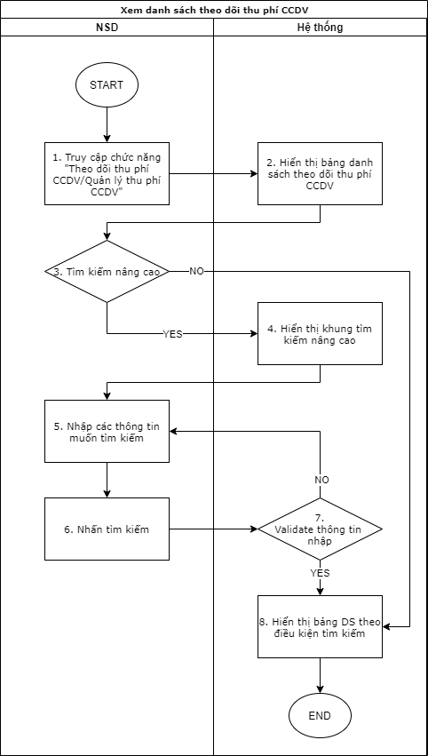

Bước

Mô tả

Bước 1

NSD truy cập chức năng “Theo dõi thu phí CCDV/ Quản lý thu phí CCDV”.

Bước 2

Hệ thống hiển thị giao diện danh sách giấy phép của DN phải nộp phí trong do CVT cấp với Kỳ gần nhất có dữ liệu BCDT, và hiển thị giấy phép của các DN có số dư nợ đầu kỳ ≠ 0.

Đối với DN được cấp phép năm đầu:

- Ngày cấp phép < =01/12/năm:

+ Có trong danh sách DN phải nộp phí năm DN được cấp phép

+ Không có trong danh sách DN phải nộp phí quý năm DN được cấp phép

- 02/12/năm < Ngày cấp phép < 31/12/năm:

+ Không có trong danh sách DN phải nộp phí năm DN được cấp phép

+ Không có trong danh sách DN phải nộp phí quý năm DN được cấp phép

Bước 3

NSD nhấn icon [Hiển thị bộ lọc] => tiến hành tìm kiếm các thông tin.

- Nếu có, chuyển bước 4

- Nếu không, chuyển bước 8

Bước 4

Hệ thống hiển thị khung tìm kiếm.

Bước 5

NSD nhập các thông tin tìm kiếm tại các trường dữ liệu tương ứng.

Bước 6

Nhấn [Tìm kiếm].

Bước 7

Hệ thống kiểm tra tính hợp lệ thông tin nhập:

- Nếu hợp lệ, chuyển bước 8

- Nếu không hợp lệ, hệ thống đưa ra thông báo tại các trường nhập không hợp lệ. Quay lại bước 5.

Bước 8

Hệ thống hiển thị danh sách thông tin giấy phép theo điều kiện tìm kiếm.

Kết thúc luồng.

Giao diện chức năng

Giao diện tìm kiếm cơ bản

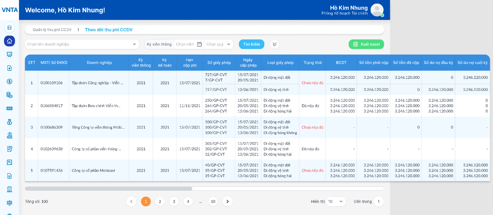

Giao diện tìm kiếm nâng cao

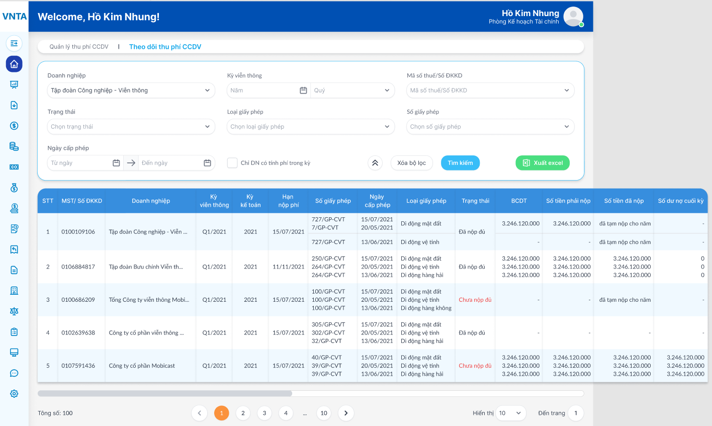

STT

Thông tin

Kiểu dữ liệu

Bắt buộc

Mô tả

Database

1

Tra cứu rút gọn

Tra cứu rút gọn

Tra cứu rút gọn

Tra cứu rút gọn

Tra cứu rút gọn

1.1

Tên doanh nghiệp

combobox search

- Chứa all DN có giấy phép CCDV do CVT cấp

- Mặc định ko chọn là Chọn tất cả

- Cho phép người dùng nhập tên DN

- Autocomplete gõ nhập tên doanh nghiệp hệ thống tự động gợi ý

- Sắp xếp các option theo thứ tự Mã định danh tăng dần (quy định ngầm trong hệ thống khi thêm mới DN)

1.2

Năm

datepicker

x

- Mặc định hiển thị năm của kỳ có BCDT gần nhất

- Cho phép người dùng chọn năm

1.3

Quý

combobox

- Mặc định quý có BCDT gần nhất (nếu ko có sẽ để trống)

- Ko chọn là chọn Năm ko chọn Qúy

- Gồm:

+ Quý 1

+ Quý 2

+ Quý 3

+ Quý 4

1.4

Icon Tìm kiếm nâng cao

Button

- Nhấn hệ thống xổ xuống các tiêu chí Tìm kiếm nâng cao

- Ngược lại khi hiển thị các tiêu chí nâng cao, nhấn icon sẽ thu gọn lại

1.5

Tìm kiếm

button

Tìm kiếm theo các trường thông tin Chọn tên DN, quý, năm. Hệ thống hiển thị bảng danh sách bên dưới.

1.6

Xuất excel

button

File gồm các cột giống trên giao diện (trừ cột xử lý), tiêu đề của sheet là Theo dõi thu phí CCDV, tên file: [Ngày xuất]_Theo dõi thu phí CCDV

2

Tìm kiếm nâng cao

Tìm kiếm nâng cao

Tìm kiếm nâng cao

Tìm kiếm nâng cao

Tìm kiếm nâng cao

2.1

Doanh nghiệp

combobox search

- Chứa all DN có giấy phép CCDV do CVT cấp

- Mặc định ko chọn là Chọn tất cả

- Cho phép nhập tên doanh nghiệp

- Autocomplete

- Sắp xếp các option theo thứ tự Mã định danh tăng dần (quy định ngầm trong hệ thống khi thêm mới)

2.2

 Mã số thuế/Số ĐKKD

combobox search

- Chứa all Mã số thuế/Số ĐKKD của DN có giấy phép CCDV

- Mặc định ko chọn là Chọn tất cả

- Cho phép nhập Mã số thuế/ Số ĐKKD

- Autocomplete

2.3

Trạng thái

Combobox

- Gồm: Đã nộp đủ/Chưa nộp đủ

- Mặc định ko chọn là chọn tất cả

2.4

Loại giấy phép

combobox

- Mặc định ko chọn là Chọn tất cả

- Cho phép NSD tìm kiếm theo tên loại giấy phép:

+ Cố định mặt đất

+ Di động mặt đất

+ Cố định vệ tinh

+ Di động vệ tinh

+ Di động hàng hải

+ Di động hàng không

2.5

Số giấy phép

combobox search

- Gồm tất cả giấy phép là Cung cấp dịch vụ viễn thông

- Mặc định ko chọn là Chọn tất cả

- Cho phép nhập số GP

- Autocomplete

2.6

Ngày cấp phép

datepicker

- Gồm từ - đến

- Đến phải >= Từ

2.7

Kỳ viễn thông

2.7.1

 Năm

datepicker

x

- Mặc định hiển thị năm của kỳ có BCDT gần nhất

- Cho phép người dùng chọn năm

2.7.2

Quý

combobox

- Mặc định quý có BCDT gần nhất (nếu ko có sẽ để trống)

- Ko chọn là chọn Năm ko chọn Qúy

- Gồm:

+ Quý 1

+ Quý 2

+ Quý 3

+ Quý 4

2.8

Chỉ DN có tính phí trong kỳ

Checkbox

Nếu tích chọn thì hiển thị chỉ các DN phải nộp phí trong kỳ đang chọn và theo các tiêu chí tìm kiếm khác. (Khi tích chọn, các DN ko phải nộp phí trong kỳ nhưng có số dư nợ đầu kỳ sẽ không hiển thị ra).

2.9

Xuất excel

button

Cho phép người dùng xuất file excel bảng danh sách đang hiển thị.

2.10

Xóa điều kiện

Button

Nhấn [Xóa điều kiện], hệ thống xóa toàn bộ dữ liệu tiêu chí tìm kiếm đã nhập, giữ nguyên kết quả tìm kiếm

2.11

Tìm kiếm

Button

Nhấn [Tìm kiếm], hệ thống check hợp lệ của điều kiện tìm kiếm và trả danh sách kết quả.

3

Grid danh sách

Grid danh sách

Grid danh sách

Grid danh sách

Grid danh sách

3.1

STT

Text

Hiển thị STT

3.2

MST/Số ĐKKD

Text

Hiển thị mã số thuế và số đăng ký kinh doanh của DN

3.3

Doanh nghiệp

Text

Hiển thị tên DN

3.4

Kỳ viễn thông

Text

Định dạng hiển thị:

--	“Qx/yyyy” đối với kỳ quý

--	“yyyy” đối với kỳ năm

3.5

Kỳ kế toán

Text

Định dạng hiển thị:

--	Qx/yyyy đối với kỳ quý

--	yyyy đối với kỳ năm

3.6

Hạn nộp phí

date

--	Ghi nhận từ Hạn nộp phí khi xuất công văn, nếu xuất lại cv Hạn nộp phí sẽ được update theo

3.7

Số giấy phép

Text

Số giấy phép cung cấp dịch vụ viễn thông do CVT đã cấp phép phải nộp phí trong kỳ tìm kiếm

3.8

Ngày cấp phép

date

Hiển thị ngày cấp phép của gp tương ứng

3.9

Loại giấy phép

Text

Hiển thị loại giấy phép tương ứng vs giấy phép (dịch vụ viễn thông cố định mặt đất, …)

3.10

Trạng thái

Text

Hiển thị “Chưa nộp đủ” hoặc “Đã nộp đủ”

- Đã nộp đủ: Font chữ màu đen

+ Qúy: đủ số phí (BCDT*0,5%)

+ Năm: Đủ phí thực tế phải nộp (so sánh giữa phí theo BCDT và mức tối thiểu)

- Chưa nộp: Font chữ màu đỏ, (khi chưa nộp đủ phí của Qúy/ Năm)

- Khi DN đã có BCDT kì Năm và đã nộp đủ mức phí thì các quý trong năm đó sẽ đồng loạt chuyển trạng thái “Đã nộp đủ”.

3.11

BCDT

Currency

- Doanh thu của DN trong kỳ tìm kiếm

- Nếu chưa có BCDT năm, hệ thống tính Doanh thu năm = tổng Doanh thu các quý trong năm cộng dồn (khi có BCDT năm sẽ update lại)

- Đơn vị VNĐ

- Nếu chưa có Doanh thu sẽ hiển thị dấu “-”

- Ghi nhận cả doanh thu âm

3.12

Số phải nộp

Currency

- Hiển thị số phải nộp của Qúy/ Năm

- Qúy:

Nếu chưa có BCDT sẽ hiển thị dấu “-”

- Năm:

+ Nếu đã có số liệu BCDT năm => max (phí theo Doanh thu và mức tối thiểu năm)

+ Nếu chưa có số liệu năm, đã có số liệu Qúy => max (tổng phí theo Doanh thu các quý và mức tối thiểu năm)

+ Nếu chưa có cả Qúy cả Năm => hiển thị “-”

+ Qúy:

Số phải nộp bằng = BCDT quý*0,5 %

Nếu Doanh thu Quý âm => Số phải nộp = 0

+ Năm

- Nếu Doanh thu của Năm âm => Số phải nộp = mức tối thiểu số tháng thực tế DN còn hạn cấp phép trong năm

- Nếu là số thập phân làm tròn chỉ lấy phần nguyên, phần thập phân >=5 sẽ làm tròn phần số nguyên lên 1 đơn vị, ngược lại giữ nguyên phần số nguyên ko làm tròn nếu phần thập phân<5

3.13

Số tiền đã nộp

Currency

Số tiền DN đã nộp (tính theo nộp cho Kỳ viễn thông, ko dựa theo Ngày biên lai)

- Nếu chưa nộp sẽ hiển thị dấu “-”

Đối với Kỳ Năm = Số đã nộp 4 quý + biên lai phân bổ cho Năm

3.14

Số dư nợ đầu kỳ

Currency

= Số tiền nợ của DN tính tại thời điểm đầu kỳ.

- Chỉ hiện thị cột này khi tìm kiếm Kỳ Năm, ngược lại khi tìm kiếm theo Qúy sẽ ẩn cột này

- Nếu DN đã nộp đủ tiền các kỳ trước thì hiển thị “0”.

- Nếu DN chưa có GP/QĐ kỳ trước thì hiển thị dấu “-”.

3.15

Số dư nợ cuối kỳ

Currency

= Số tiền phải nộp –  Số đã nộp + Số dư nợ đầu kỳ

- Nếu chưa có dữ liệu số phải nộp và số đã nộp => hiển thị dấu “-”

- Nếu là số thập phân làm tròn chỉ lấy phần nguyên, phần thập phân >=5 sẽ làm tròn phần số nguyên lên 1 đơn vị, ngược lại giữ nguyên phần số nguyên ko làm tròn nếu phần thập phân<5

4

Phân trang

4.1

Tổng số bản ghi

Text

Hiển thị tổng số bản ghi theo điều kiện tìm kiếm

4.2

Phân trang

button

Gồm các button: Về trang trước đó, 1, 2, 3, 4, 5 (nếu ít trang hơn sẽ tự cắt bớt), trang sau đó

4.3

Số bản ghi trên 1 trang

combobox

Gồm:

10/20/50/100

Mặc định 10 bản ghi trên 1 trang

4.4

Đến trang

Text

- Nhập số trang => hệ thống nhảy đến dữ liệu trang tương ứng

Xem báo cáo Theo dõi công nợ theo kỳ viễn thông

Luồng chức năng

Thông tin chung

Tên chức năng

Theo dõi công nợ theo kỳ viễn thông

Mô tả

Chức năng cho phép cán bộ P. KHTC theo dõi số liệu công nợ của tất cả doanh nghiệp có giấy phép CCDV phải nộp phí trong năm (bao gồm 4 quý và năm).

Tác nhân

Cán bộ P. KHTC

Điều kiện trước

Đăng nhập vào hệ thống, có phân quyền chức năng

Điều kiện sau

Xem báo cáo theo dõi công nợ theo kỳ viễn thông thành công

Ngoại lệ

N/A

Các yêu cầu đặc biệt

N/A

Luồng chức năng

Bước

Mô tả

Bước 1

NSD truy cập chức năng “Theo dõi công nợ - Kỳ VT” trong module “Quản lý thu phí CCDV”.

Bước 2

Hệ  thống mặc định hiển thị bảng theo dõi công nợ theo kỳ viễn thông của phí CCDV năm hiện tại.

Bước 3

NSD tiến hành nhập thông tin tìm kiếm khi muốn tìm kiếm số liệu công nợ theo từng DN hoặc kì phí khác.

Bước 4

Nhấn [Tìm kiếm]

Bước 5

Hệ thống kiểm tra thông tin nhập:

- Nếu không hợp lệ, chuyển bước 3

- Nếu hợp lệ, chuyển bước 6.

Bước 6

Hệ thống hiển thị danh sách công nợ bao gồm 4 quý và năm theo dữ liệu tìm kiếm.

Kết thúc luồng.

Giao diện chức năng

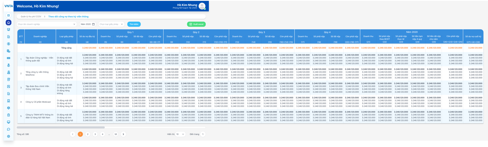

STT

Tên

Tên

Kiểu

dữ liệu

Bắt buộc

Mô tả

Database

1

Tra cứu công nợ

Tra cứu công nợ

Tra cứu công nợ

Tra cứu công nợ

Tra cứu công nợ

Tra cứu công nợ

1.1

Tên doanh nghiệp

Tên doanh nghiệp

Combobox search

- Gồm all gp CCDV do CụcVT cấp

- Cho phép nhập tên doanh nghiệp

- Autocomplete

- Sắp xếp các option theo thứ tự Mã định danh tăng dần (quy định ngầm trong hệ thống khi thêm mới)

1.2

Năm

Năm

Datepicker

x

Cho phép NSD chọn năm

1.3

Tìm kiếm

Tìm kiếm

Button

Nhấn => hệ thống kiểm tra tính chính xác của dữ liệu tìm kiếm và đưa ra kết quả tại bảng dưới.

2

Xuất excel

Xuất excel

Button

Nhấn => hệ thống tải về file excel bao gồm danh sách công nợ NSD đang tìm kiếm.

File gồm các cột giống trên giao diện (trừ cột xử lý), tiêu đề của sheet là Theo dõi công nợ theo Kỹ viễn thông năm …, tên file: [Ngày xuất]_ Theo dõi công nợ theo Kỳ viễn thông năm …

3

Bảng theo dõi công nợ năm …

Grid danh sách

Bảng theo dõi công nợ năm …

Grid danh sách

Bảng theo dõi công nợ năm …

Grid danh sách

Bảng theo dõi công nợ năm …

Grid danh sách

Bảng theo dõi công nợ năm …

Grid danh sách

Bảng theo dõi công nợ năm …

Grid danh sách

1

STT (1)

STT (1)

Số thứ tự

2

Doanh nghiệp (2)

Doanh nghiệp (2)

Text

Hiển thị tên doanh nghiệp

3

Loại giấy phép

(3)

Loại giấy phép

(3)

Text

Hiển thị loại giấy phép theo từng số giấy phép:

- Cố định mặt đất

- Di động mặt đất

- Cố định vệ tinh

- Di động vệ tinh

- Di động hàng hải

- Di động hàng không

4

Số dư nợ đầu kỳ (4)

Số dư nợ đầu kỳ (4)

Currency

Số tiền còn nợ theo Kỳ viễn thông tính đến hết năm trước năm tìm kiếm.

Nếu nộp thừa tiền thì để dấu âm, màu đỏ.

5

Quý 1

Doanh thu (5)

Currency

Hiển thị doanh thu Quý 1 theo từng doanh nghiệp

Định dạng: Dấu “.” ngăn cách hàng nghìn

Nếu chưa có dữ liệu hiển thị dấu “-”

Đơn vị: VNĐ

6

Quý 1

Số phải nộp (6)

Currency

Hiển thị số tiền doanh nghiệp phải nộp tính theo BCDT= 0.5% x BCDT.

Định dạng: Dấu “.” ngăn cách hàng nghìn

Nếu chưa có dữ liệu hiển thị dấu “-”

Đơn vị: VNĐ

- Nếu là số thập phân làm tròn chỉ lấy phần nguyên, phần thập phân >=5 sẽ làm tròn phần số nguyên lên 1 đơn vị, ngược lại giữ nguyên phần số nguyên ko làm tròn nếu phần thập phân<5

7

Quý 1

Số đã nộp (7)

Currency

Hiển thị số tiền doanh nghiệp đã nộp cập nhật theo số liệu biên lai nộp cho quý 1.

Nếu chưa có dữ liệu hiển thị số 0

Định dạng: Dấu “.” ngăn cách hàng nghìn

Đơn vị: VNĐ

8

Quý 1

Còn phải nộp (8)=(6)- (7)

Currency

Hiển thị số tiền doanh nghiệp còn phải nộp cho quý 1 = Số phải nộp – Số đã nộp.

( Trường hợp số đã nộp > Số phải nộp => số tiền còn phải nộp sẽ âm và in màu đỏ.)

Định dạng: Dấu “.” ngăn cách hàng nghìn

Đơn vị: VNĐ

- Nếu là số thập phân làm tròn chỉ lấy phần nguyên, phần thập phân >=5 sẽ làm tròn phần số nguyên lên 1 đơn vị, ngược lại giữ nguyên phần số nguyên ko làm tròn nếu phần thập phân<5

9

Quý 2,3,4

Tương tự như mô tả quý 1.

10

Năm …

Doanh thu (21)

Currency

Hiển thị doanh thu Năm đã quyết toán theo từng doanh nghiệp.

Nếu chưa có BCDT năm => bằng tổng BCDT 4 quý (khi có BCDT năm sẽ update lại số liệu theo BCDT năm)

Nếu chưa có dữ liệu của quý và năm hiển thị dấu “-”

Định dạng: Dấu “.” ngăn cách hàng nghìn

Đơn vị: VNĐ

11

Năm …

Số phải nộp theo BCDT

(22)

Currency

Hiển thị số tiền phải nộp theo BCDT.

Nếu chưa có dữ liệu hiển thị dấu “-”

Định dạng: Dấu “.” ngăn cách hàng nghìn

Đơn vị: VNĐ

- Nếu là số thập phân làm tròn chỉ lấy phần nguyên, phần thập phân >=5 sẽ làm tròn phần số nguyên lên 1 đơn vị, ngược lại giữ nguyên phần số nguyên ko làm tròn nếu phần thập phân<5

12

Năm …

Số phải nộp thực tế

(23)

Currency

Số tiền DN phải nộp thực tế theo BCDT năm và đã so sánh với số tiền tối thiểu năm (trường hợp chưa có BCDT năm sẽ so sánh vs phí của tổng BCDT các quý)

--	Nếu Phí theo BCDT >= Mức tối thiểu => lấy theo Phí theo BCDT và ngược lại

Định dạng: Dấu “.” ngăn cách hàng nghìn.

Đơn vị: VNĐ

- Nếu là số thập phân làm tròn chỉ lấy phần nguyên, phần thập phân >=5 sẽ làm tròn phần số nguyên lên 1 đơn vị, ngược lại giữ nguyên phần số nguyên ko làm tròn nếu phần thập phân<5

13

Năm …

Số tiền tạm nộp 4 quý (24)

Currency

Hiển thị tổng số tiền đã nộp của cho 4 Qúy trong năm (check theo Kỳ viễn thông (4 Qúy) được nộp phí, ko check theo Ngày biên lai).

Định dạng: Dấu “.” ngăn cách hàng nghìn.

Đơn vị: VNĐ

14

Năm …

Số tiền đã nộp cho năm (25)

Currency

Hiển thị tổng số tiền đã nộp cho năm theo từng loại giấy phép cập nhật từ số liệu biên lai.

(check theo Kỳ viễn thông (Kỳ Năm) được nộp phí ko check theo Ngày biên lai).

Định dạng: Dấu “.” ngăn cách hàng nghìn.

Đơn vị: VNĐ

15

Năm …

Còn phải nộp (26) = (23) –(24)-(25)

Currency

Hiển thị số tiền DN còn phải nộp theo năm.

(Trong trường hợp số tiền đã nộp 4 quý > số tiền thực tế tính theo BCDT năm => số còn phải nộp (4) sẽ âm và in màu đỏ.)

Định dạng: Dấu “.” ngăn cách hàng nghìn.

Đơn vị: VNĐ

- Nếu là số thập phân làm tròn chỉ lấy phần nguyên, phần thập phân >=5 sẽ làm tròn phần số nguyên lên 1 đơn vị, ngược lại giữ nguyên phần số nguyên ko làm tròn nếu phần thập phân<5

16

Số dư nợ cuối kỳ (27)=(4)+(26)

Số dư nợ cuối kỳ (27)=(4)+(26)

Currency

= Số phải nộp thực tế năm – (số tiền tạm nộp 4 quý + số tiền đã nộp cho năm) + Số dư nợ đầu kỳ (tính đến hết năm trước đó theo Kỳ viễn thông)

Xem báo cáo Theo dõi công nợ theo kỳ kế toán

Luồng chức năng

Thông tin chung

Tên chức năng

Theo dõi công nợ theo kỳ kế toán

Mô tả

Chức năng cho phép cán bộ P. KHTC theo dõi số dư nợ theo năm của tất cả doanh nghiệp có giấy phép CCDV do CVT cấp

Tác nhân

Cán bộ P. KHTC

Điều kiện trước

Đăng nhập vào hệ thống, có phân quyền chức năng

Điều kiện sau

Xem báo cáo theo dõi công nợ theo kỳ kế toán thành công

Ngoại lệ

N/A

Các yêu cầu đặc biệt

N/A

Luồng chức năng

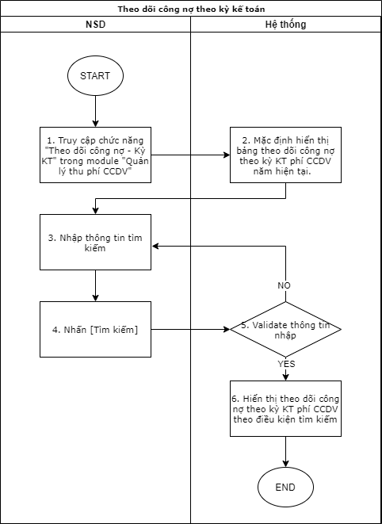

Mô tả luồng xử lý

Bước

Mô tả

Bước 1

NSD truy cập chức năng “Theo dõi công nợ - Kỳ KT” trong module “Quản lý thu phí CCDV”.

Bước 2

Hệ  thống mặc định hiển thị bảng theo dõi công nợ theo kỳ kế toán của phí CCDV năm hiện tại.

Bước 3

NSD tiến hành nhập thông tin tìm kiếm khi muốn tìm kiếm số liệu công nợ theo từng DN hoặc kì phí khác.

Bước 4

Nhấn [Tìm kiếm]

Bước 5

Hệ thống kiểm tra thông tin nhập:

- Nếu không hợp lệ, chuyển bước 3

- Nếu hợp lệ, chuyển bước 6

Bước 6

Hệ thống hiển thị danh sách công nợ bao gồm số dư nợ đầu năm và số phải nộp trong năm

Kết thúc luồng.

Giao diện chức năng

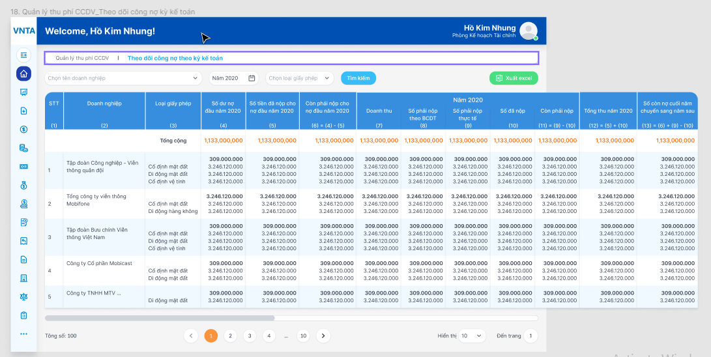

STT

Tên

Tên

Kiểu

dữ liệu

Bắt buộc

Mô tả

Database

Database

1

Tra cứu công nợ

Tra cứu công nợ

Tra cứu công nợ

Tra cứu công nợ

Tra cứu công nợ

Tra cứu công nợ

Tra cứu công nợ

1.1

Tên doanh nghiệp

Tên doanh nghiệp

Combobox search

- Gồm all DN có giấy phép CCDV do Cục VT cấp

- Cho phép nhập tên doanh nghiệp

- Autocomplete

- Sắp xếp các option theo thứ tự Mã định danh tăng dần (quy định ngầm trong hệ thống khi thêm mới)

- Cho phép chọn 1 hoặc nhiều DN

1.2

Năm

Năm

Datepicker

x

Cho phép NSD chọn năm

1.3

Tìm kiếm

Tìm kiếm

Button

Nhấn => hệ thống kiểm tra tính chính xác của dữ liệu tìm kiếm và đưa ra kết quả tại bảng dưới.

2

Xuất excel

Xuất excel

Button

Nhấn => hệ thống tải về file excel bao gồm danh sách công nợ NSD đang tìm kiếm.

File gồm các cột giống trên giao diện (trừ cột xử lý), tiêu đề của sheet là Theo dõi công nợ theo Kỳ kế toán năm …, tên file: [Ngày xuất]_Theo dõi công nợ theo Kỳ kế toán phí CCDV năm …

3

Bảng theo dõi công nợ theo kỳ kế toán năm …

Grid danh sách

Bảng theo dõi công nợ theo kỳ kế toán năm …

Grid danh sách

Bảng theo dõi công nợ theo kỳ kế toán năm …

Grid danh sách

Bảng theo dõi công nợ theo kỳ kế toán năm …

Grid danh sách

Bảng theo dõi công nợ theo kỳ kế toán năm …

Grid danh sách

Bảng theo dõi công nợ theo kỳ kế toán năm …

Grid danh sách

Bảng theo dõi công nợ theo kỳ kế toán năm …

Grid danh sách

1

STT (1)

STT (1)

Số thứ tự

2

Doanh nghiệp (2)

Doanh nghiệp (2)

Text

- Hiển thị tên doanh nghiệp

- Hiển thị all DN còn số dư nợ đầu năm (thừa hoặc thiếu) hoặc trong năm phát sinh phí CCDV theo năm tìm kiếm

3

Loại giấy phép (3)

Loại giấy phép (3)

Text

Hiển thị loại giấy phép theo từng số giấy phép:

- Cố định mặt đất

- Di động mặt đất

- Cố định vệ tinh

- Di động vệ tinh

- Di động hàng hải

- Di động hàng không

4

Số dư nợ đầu năm … (4)

Số dư nợ đầu năm … (4)

Currency

- Số tiền DN nộp thừa/còn nợ tính từ những năm về trước đến hết năm trước năm báo cáo của từng loại giấy phép (tức là tính đến ngày biên lai = 31/12/năm trước đó so với năm đang tìm kiếm DN => hệ thống đưa ra số tiền thừa/thiếu ở đầu năm tiếp theo)

- Nếu là tiền thừa hiển thị font chữ màu đỏ, thiếu hiển thị màu đen

- Nếu những năm trước đó không có giấy phép (nhưng năm đang tìm kiếm có giấy phép) sẽ hiển thị dấu “-”

- Nếu những năm trước đó có giấy phép nhưng không có nợ đầu năm hiển thị 0

- Nếu là số thập phân làm tròn chỉ lấy phần nguyên, phần thập phân >=5 sẽ làm tròn phần số nguyên lên 1 đơn vị, ngược lại giữ nguyên phần số nguyên ko làm tròn nếu phần thập phân<5

5

Số tiền đã nộp cho nợ đầu năm … (5)

Số tiền đã nộp cho nợ đầu năm … (5)

Currency

- Số tiền DN đã nộp cho nợ những năm về trước đến hết năm trước năm báo cáo (ngày biên lai từ 01/01/năm báo cáo - 31/12/năm báo cáo) theo từng loại dịch vụ

- Nếu Số nợ đầu năm hiển thị dấu “-” => Số đã nộp sẽ hiển thị dấu “-”

- Nếu Số dư nợ đầu năm>=0 mà chưa nộp tiền => Số đã nộp hiển thị “0”

6

Số còn phải nộp cho nợ đầu năm … (6) = (4)-(5)

Số còn phải nộp cho nợ đầu năm … (6) = (4)-(5)

Curency

= Số dư nợ đầu năm - Số tiền đã nộp cho nợ đầu năm

- Nếu Số nợ đầu năm hiển thị dấu “-” => Số còn phải nộp sẽ hiển thị dấu “-”

- Nếu là số thập phân làm tròn chỉ lấy phần nguyên, phần thập phân >=5 sẽ làm tròn phần số nguyên lên 1 đơn vị, ngược lại giữ nguyên phần số nguyên ko làm tròn nếu phần thập phân<5

7

Năm …

Năm …

Năm tìm kiếm

8

Doanh thu (7)

Currency

Hiển thị BCDT năm của DN

Nếu chưa có BCDT năm => cộng dồn BCDT các quý

(khi có BCDT năm sẽ update thành BCDT năm)

Nếu chưa có quý nào có BCDT => hiển thị dấu “-”

Nếu không có giấy phép trong quý/năm đang tìm kiếm phải trả phí (nhưng năm cũ có) => hiển thị dấu “-”

Định dạng: Dấu “.” ngăn cách hàng nghìn

Đơn vị: VNĐ

9

Số phải nộp theo BCDT (8)

Currency

Hiển thị số tiền doanh nghiệp phải nộp tính theo BCDT (= 0.5% x BCDT)

Định dạng: Dấu “.” ngăn cách hàng nghìn

Nếu không có giấy phép trong quý/năm đang tìm kiếm phải trả phí (nhưng năm cũ có) => hiển thị dấu “-”

Đơn vị: VNĐ

- Nếu là số thập phân làm tròn chỉ lấy phần nguyên, phần thập phân >=5 sẽ làm tròn phần số nguyên lên 1 đơn vị, ngược lại giữ nguyên phần số nguyên ko làm tròn nếu phần thập phân<5

10

Số phải nộp thực tế (9)

Currency

Số tiền DN phải nộp thực tế trong năm sau khi so sánh giữa mức phải nộp theo BCDT vs mức tối thiểu năm của gp (trường hợp chưa có BCDT năm sẽ so sánh vs phí của tổng BCDT các quý):

Nếu Phí theo BCDT> mức tối thiểu => lấy theo Phí của BCDT

Nếu Phí theo BCDT <mức tối thiểu => Lấy theo Phí của mức tối thiểu

Nếu không có giấy phép trong quý/năm đang tìm kiếm phải trả phí (nhưng năm cũ có) => hiển thị dấu “-”

Định dạng: Dấu “.” ngăn cách hàng nghìn

Đơn vị: VNĐ

- Nếu là số thập phân làm tròn chỉ lấy phần nguyên, phần thập phân >=5 sẽ làm tròn phần số nguyên lên 1 đơn vị, ngược lại giữ nguyên phần số nguyên ko làm tròn nếu phần thập phân<5

11

Số đã nộp cho năm (10)

Currency

Ghi nhận all biên lại nộp cho 4 quý và năm

Định dạng: Dấu “.” ngăn cách hàng nghìn

Đơn vị: VNĐ

12

Còn phải nộp (11)=(9)-(10)

Currency

Theo công thức = (9) – (10)

13

Tổng thu năm … (12) = (5) + (10)

Tổng thu năm … (12) = (5) + (10)

Curency

= (2) + (5)

Định dạng: Dấu “.” ngăn cách hàng nghìn

Đơn vị: VNĐ

14

Số còn nợ cuối năm chuyển năm sau (13)= (6) + (11)

Số còn nợ cuối năm chuyển năm sau (13)= (6) + (11)

Curency

(7)= (3) + (4) – (5)

Định dạng: Dấu “.” ngăn cách hàng nghìn

Đơn vị: VNĐ

- Nếu là số thập phân làm tròn chỉ lấy phần nguyên, phần thập phân >=5 sẽ làm tròn phần số nguyên lên 1 đơn vị, ngược lại giữ nguyên phần số nguyên ko làm tròn nếu phần thập phân<5

15

Dòng Tổng cộng

Dòng Tổng cộng

Curency

Cộng dồn theo cột all các DN theo tiêu chí tìm kiếm

16.1

Phân trang

Phân trang

16.2

Tổng số bản ghi

Tổng số bản ghi

Text

Hiển thị tổng số bản ghi theo điều kiện tìm kiếm

16.3

Phân trang

Phân trang

button

Gồm các button: Về trang trước đó, 1, 2, 3, 4, 5 (nếu ít trang hơn sẽ tự cắt bớt), trang sau đó

16.4

Số bản ghi trên 1 trang

Số bản ghi trên 1 trang

combobox

Gồm:

10/20/50/100

Mặc định 10 bản ghi trên 1 trang

16.5

Đến trang

Đến trang

Text

- Nhập số trang => hệ thống nhảy đến dữ liệu trang tương ứng

Xem báo cáo Theo dõi công nợ lũy kế

Luồng chức năng

Tên chức năng

Theo dõi công nợ lũy kế phí CCDV

Mô tả

Chức năng cho phép cán bộ Phòng KHTC xem, tra cứu dữ liệu về công nợ lũy kế phí CCDV của các DN trong từng giai đoạn; xuất excel theo bảng danh sách tìm kiếm.

Tác nhân

Lãnh đạo, Cán bộ Phòng KHTC

Điều kiện trước

Đăng nhập vào hệ thống, có phân quyền chức năng

Điều kiện sau

Xem, tra cứu và xuất excel thành công danh sách công nợ lũy kế phí CCDV theo từng giai đoạn

Ngoại lệ

N/A

Các yêu cầu đặc biệt

N/A

Luồng chức năng

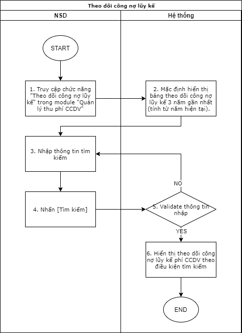

Mô tả luồng xử lý

Bước

Mô tả

Bước 1

NSD truy cập chức năng “Theo dõi công nợ lũy kế” trong module “Quản lý thu phí CCDV”.

Bước 2

Hệ  thống mặc định hiển thị bảng theo dõi công nợ lũy kế của phí CCDV 03 năm gần nhất tính từ năm hiện tại.

Bước 3

NSD tiến hành nhập thông tin tìm kiếm khi muốn tìm kiếm số liệu công nợ lũy kế theo từng DN hoặc giai đoạn khác.

Bước 4

Nhấn [Tìm kiếm]

Bước 5

Hệ thống kiểm tra thông tin nhập:

- Nếu không hợp lệ, chuyển bước 3

- Nếu hợp lệ, chuyển bước 6.

Bước 6

Hệ thống hiển thị số liệu công nợ các năm trong giai đoạn người dùng tìm kiếm (tối đa 3 năm)

Kết thúc luồng.

Giao diện chức năng

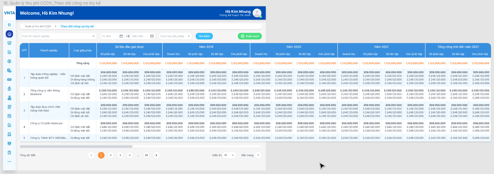

STT

Thông tin

Kiểu dữ liệu

Bắt buộc

Mô tả

Database

1

Tên doanh nghiệp

Combobox

- Gồm all DN có gp CCDV do Cục VT cấp

- Cho phép người dùng nhập tên DN

- Autocomplete gõ nhập tên doanh nghiệp hệ thống tự động gợi ý

- Sắp xếp các option theo thứ tự Mã định danh tăng dần (quy định ngầm trong hệ thống khi thêm mới DN)

2

Giai đoạn

Giai đoạn

Giai đoạn

Giai đoạn

Giai đoạn

2.1

Từ năm

datepicker

x

Autofill giai đoạn 3 năm gần nhất.

Cho phép chọn năm

2.2

Đến năm

datepicker

x

Autofill giai đoạn 3 năm gần nhất.

Cho phép chọn năm

Đền năm >= Từ năm

3

Loại giấy phép

combobox

Cho phép chọn 1 trong các loại giấy phép sau:

- Cố định mặt đất

- Di động mặt đất

- Cố định vệ tinh

- Di động vệ tinh

- Di động hàng hải

- Di động hàng không

4

Tìm kiếm

button

Nhấn để bắt đầu tìm kiếm theo thông tin tra cứu

5

Xuất excel

button

Cho phép NSD tải file excel danh sách đang hiển thị

File gồm các cột giống trên giao diện (trừ cột xử lý), tiêu đề của sheet là Theo dõi công nợ lũy kế từ năm… đến năm…, tên file: [Ngày xuất]_ Theo dõi công nợ lũy kế từ năm… đến năm …

6

Grid

Grid

Grid

Grid

Grid

6.1

STT

number

Hiển thị STT

6.2

Doanh nghiệp

Varchar

Hiển thị tên doanh nghiệp

6.3

Loại giấy phép

Varchar

Hiển thị tên loại giấy phép còn dư nợ của DN.

Hiển thị các loại GP còn nợ từ trước cho đến giai đoạn tìm kiếm.

6.4

Số liệu đầu giai đoạn

Số liệu đầu giai đoạn

Số liệu đầu giai đoạn

Số liệu đầu giai đoạn

Số liệu đầu giai đoạn

6.4.1

Số phải nộp

Currency

Tổng phí phải nộp tính từ thời điểm bắt đầu sử dụng dịch vụ đến thời điểm đầu giai đoạn đang chọn. (tính đến hết năm trước năm đầu giai đoạn đnag thống kê)

- Nếu là số thập phân làm tròn chỉ lấy phần nguyên, phần thập phân >=5 sẽ làm tròn phần số nguyên lên 1 đơn vị, ngược lại giữ nguyên phần số nguyên ko làm tròn nếu phần thập phân<5

- Nếu không có GP trong năm đó thì hiển thị dấu “-”

6.4.2

Số đã nộp

Currency

- Tổng phí đã nộp tính từ thời điểm bắt đầu sử dụng dịch vụ đến thời điểm đầu giai đoạn đang chọn. (tính đến hết năm trước năm đầu giai đoạn đang thống kê)

- Nếu có giấy phép và DN chưa nộp tiền thì hiển thị “0”. Nếu không có giấy phép thì mặc định hiển thị “-“.

6.4.3

Còn phải nộp

Currency

= Số phải nộp – Số đã nộp

- Nếu là số thập phân làm tròn chỉ lấy phần nguyên, phần thập phân >=5 sẽ làm tròn phần số nguyên lên 1 đơn vị, ngược lại giữ nguyên phần số nguyên ko làm tròn nếu phần thập phân<5

6.5

Năm…

Năm…

Năm…

Năm…

Năm…

6.5.1

Doanh thu

Currency

Doanh thu trên BCDT theo kỳ Năm.

Nếu chưa có BCDT năm thì cộng dồn các doanh thu theo BCDT quý.

Nếu chưa có Qúy nào có số liệu BCDT => hiển thị dấu “-”

6.5.2

Số phải nộp

Currency

Số phí phải nộp cho năm sử dụng dịch vụ (tham khảo mô tả chức năng “Xem danh sách Doanh nghiệp P. KHTC cần xuất công văn”.

Nếu chưa có Qúy nào có số liệu BCDT => Số phải nộp là mức tối thiểu năm

- Nếu là số thập phân làm tròn chỉ lấy phần nguyên, phần thập phân >=5 sẽ làm tròn phần số nguyên lên 1 đơn vị, ngược lại giữ nguyên phần số nguyên ko làm tròn nếu phần thập phân<5

- Nếu không có GP trong năm đó thì hiển thị dấu “-”

6.5.3

Số đã nộp

Currency

- Số phí đã nộp cho năm (cả 4 quý và năm) căn cứ trên việc nộp cho Kỳ viễn thông Qúy/Năm, ko dựa trên Ngày biên lai.

- Số liệu tổng hợp từ chức năng ‘Quản lý biên lai”

- Nếu chưa có số liệu => hiển thị số 0

- Nếu không có GP trong năm đó thì hiển thị dấu “-”

6.5.4

Còn phải nộp

Currency

= số phải nộp – số đã nộp

Nếu là số âm hiển thị font chữ màu đỏ

- Nếu là số thập phân làm tròn chỉ lấy phần nguyên, phần thập phân >=5 sẽ làm tròn phần số nguyên lên 1 đơn vị, ngược lại giữ nguyên phần số nguyên ko làm tròn nếu phần thập phân<5

- Nếu không có GP trong năm đó thì hiển thị dấu “-”

6.6

Tổng cộng tính đến năm ….

Tổng cộng tính đến năm ….

Tổng cộng tính đến năm ….

Tổng cộng tính đến năm ….

Tổng cộng tính đến năm ….

6.6.1

Số phải nộp

Currency

Số phí phải nộp tính từ thời điểm DN bắt đầu sử dụng dịch vụ đến thời điểm kết thúc giai đoạn đang chọn.

- Nếu là số thập phân làm tròn chỉ lấy phần nguyên, phần thập phân >=5 sẽ làm tròn phần số nguyên lên 1 đơn vị, ngược lại giữ nguyên phần số nguyên ko làm tròn nếu phần thập phân<5

6.6.2

Số đã nộp

Currency

Số phí đã nộp tính từ thời điểm DN bắt đầu sử dụng dịch vụ đến thời điểm kết thúc giai đoạn đang chọn.

6.6.3

Còn phải nộp

Currency

= Số phải nộp – Số đã nộp

Nếu là số âm hiển thị font chữ màu đỏ

- Nếu là số thập phân làm tròn chỉ lấy phần nguyên, phần thập phân >=5 sẽ làm tròn phần số nguyên lên 1 đơn vị, ngược lại giữ nguyên phần số nguyên ko làm tròn nếu phần thập phân<5

Mức phí quy định tại TT03/2018/TT-BTC

Phí CCDV

STT

Hoạt động cung cấp dịch vụ viễn thông

Mức tối thiểu

(triệu đồng)

1

Cung cấp dịch vụ viễn thông di động mặt đất sử dụng băng tần số vô tuyến điện

2.000

2

Cung cấp dịch vụ viễn thông cố định mặt đất sử dụng băng tần số vô tuyến điện

1.000

3

Cung cấp dịch vụ viễn thông cố định vệ tinh

Cung cấp dịch vụ viễn thông di động hàng hải

Cung cấp dịch vụ viễn thông di động hàng không

50

4

Cung cấp dịch vụ viễn thông di động vệ tinh

100

5

Cung cấp dịch vụ viễn thông cố định mặt đất không sử dụng băng tần số vô tuyến điện

Cung cấp dịch vụ viễn thông di động mặt đất không sử dụng băng tần số vô tuyến điện

250

Phí TLM viễn thông công cộng

STT

Hoạt động cung cấp dịch vụ viễn thông

Mức tối thiểu

(triệu đồng)

1

Thiết lập mạng viễn thông công cộng (nộp hàng năm)

1.1

Thiết lập mạng viễn thông công cộng cố định mặt đất không sử dụng băng tần số vô tuyến điện, số thuê bao viễn thông

1.1.1

Trong phạm vi một tỉnh, thành phố trực thuộc Trung ương

100

1.1.2

Trong phạm vi từ 02 đến 30 tỉnh, thành phố trực thuộc Trung ương

300

1.1.3

Trong phạm vi trên 30 tỉnh, thành phố trực thuộc Trung ương

600

1.2

Thiết lập mạng viễn thông công cộng cố định mặt đất có sử dụng băng tần số vô tuyến điện, số thuê bao viễn thông

1.2.1

Trong phạm vi từ 02 đến 30 tỉnh, thành phố trực thuộc Trung ương

800

1.2.2

Trong phạm vi trên 30 tỉnh, thành phố trực thuộc Trung ương

2.000

1.3

Thiết lập mạng viễn thông công cộng di động mặt đất có sử dụng kênh tần số vô tuyến điện

200

1.4

Thiết lập mạng viễn thông công cộng di động mặt đất không sử dụng băng tần số vô tuyến điện (MVNO)

2.000

1.5

Thiết lập mạng viễn thông công cộng di động mặt đất có sử dụng băng tần số vô tuyến điện

5.000

1.6

Thiết lập mạng viễn thông công cộng cố định vệ tinh

100

1.7

Thiết lập mạng viễn thông công cộng di động vệ tinh

100

Phí Thử nghiệm mạng và dịch vụ viễn thông

STT

Hoạt động cung cấp dịch vụ viễn thông

Mức tối thiểu

(triệu đồng)

1

Thử nghiệm mạng và dịch vụ viễn thông (nộp một lần cho toàn bộ thời hạn giấy phép, bao gồm cả thời gian gia hạn giấy phép)

2.1

Thử nghiệm mạng và dịch vụ viễn thông có sử dụng băng tần số vô tuyến điện

a

Phạm vi 01 tỉnh, thành phố trực thuộc Trung ương

200 triệu đồng

b

Phạm vi thử nghiệm từ 02 đến 30 tỉnh, thành phố trực thuộc Trung ương

300 triệu đồng

c

Phạm vi thử nghiệm trên 30 tỉnh, thành phố trực thuộc Trung ương

400 triệu đồng

2.2

Thử nghiệm mạng và dịch vụ viễn thông không sử dụng băng tần số vô tuyến điện

a

Phạm vi 01 tỉnh, thành phố trực thuộc Trung ương

300 triệu đồng

b

Phạm vi thử nghiệm từ 02 đến 30 tỉnh, thành phố trực thuộc Trung ương

400 triệu đồng

c

Phạm vi thử nghiệm trên 30 tỉnh, thành phố trực thuộc Trung ương

500 triệu đồng

Phí TLM viễn thông dùng riêng

STT

Hoạt động cung cấp dịch vụ viễn thông

Mức tối thiểu

(triệu đồng)

1

Thiết lập mạng viễn thông dùng riêng (nộp một lần cho toàn bộ thời hạn giấy phép, bao gồm cả thời gian gia hạn giấy phép)

100 triệu đồng

Chú ý

ID

Business Rule

BR01

Tích 1 Tài nguyên được tính phí => tính phí theo Tài nguyên dc tính phí

BR02

Tích 2 cái Tài nguyên (1 tài nguyên tính phí, 1 tài nguyên k dc tính phí) => tính theo tài nguyên được tính phí

BR03

Tích 2 cái Tài nguyên (cả 2 cùng được tính phí) => tính theo tài nguyên được tính phí cao hơn

BR04

Tích tất cả tài nguyên trừ tài nguyên được tính phí => tính theo phí Không sử dụng

BR05

Không tích cái nào => tính theo phí Không sử dụng

Quản lý biên lai

Danh sách biên lai

Xem danh sách biên lai

Luồng chức năng

Thông tin chung

Tên chức năng

Xem, tìm kiếm danh sách biên lai

Mô tả

Chức năng cho phép xem thông tin danh sách tất cả biên lai các loại phí, lệ phí đã nhập vào hệ thống

Tác nhân

Lãnh đạo, Cán bộ Phòng KHTC

Điều kiện trước

Đăng nhập vào hệ thống, có phân quyền chức năng

Điều kiện sau

Xem, tìm kiếm được danh sách biên lai

Ngoại lệ

N/A

Các yêu cầu đặc biệt

N/A

Luồng chức năng

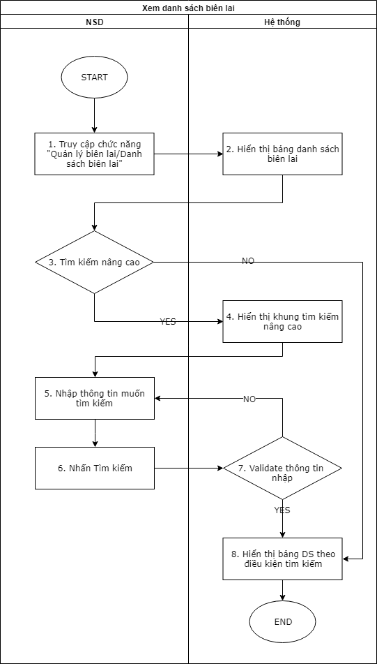

Bước

Mô tả

Bước 1

NSD truy cập chức năng “Quản lý biên lai/Danh sách biên lai”.

Bước 2

Hệ thống hiển thị giao diện danh sách biên lai của tất cả các loại phí, lệ phí mà DN đã nộp tiền.

Bước 3

NSD nhấn icon [Hiển thị bộ lọc] => tiến hành tìm kiếm các thông tin.

- Nếu có, chuyển bước 4

- Nếu không, chuyển bước 8

Bước 4

Hệ thống hiển thị khung tìm kiếm nâng cao.

Bước 5

NSD nhập các thông tin tìm kiếm tại các trường dữ liệu tương ứng.

Bước 6

Nhấn [Tìm kiếm].

Bước 7

Hệ thống kiểm tra tính hợp lệ thông tin tìm kiếm:

- Nếu hợp lệ, chuyển bước 8

- Nếu không hợp lệ, hệ thống đưa ra thông báo tại các trường nhập không hợp lệ. Quay lại bước 5.

Bước 8

Hệ thống hiển thị danh sách thông tin biên lai theo điều kiện tìm kiếm.

Kết thúc luồng.

- Nếu 1 biên lai phân bổ cho >01 loại phí biên lai sẽ được hiển thị thành số bản ghi tương ứng với số loại phí/lệ phí đã được phân bổ trong biên lai

VD: Biên lai 10tr được phân bổ cho 02 loại phí/lệ phí: Phí TLM viễn thông công cộng (6tr), Phí CCDV (4tr), tại danh sách biên lai sẽ hiển thị thành 02 bản ghi khác nhau về Loại phí/lệ phí, Số tiền và giống nhau các cột còn lại

- Khi nhấn xem chi tiết 1 trong 2 biên lai => ra full dữ liệu chi tiết của biên lai

- Sắp xếp danh sách theo Số biên lai giảm dần

- Biên lai đã hủy sẽ đổi thành màu đỏ

Giao diện chức năng

Tìm kiếm cơ bản

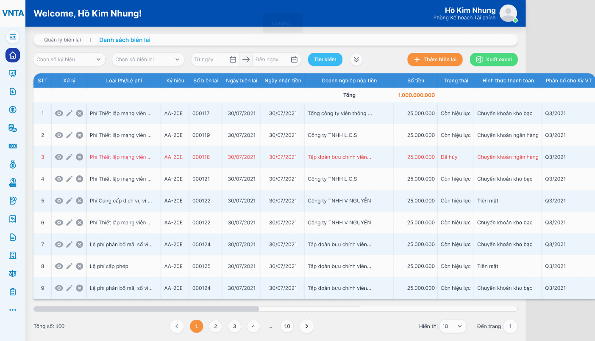

Tìm kiếm nâng cao

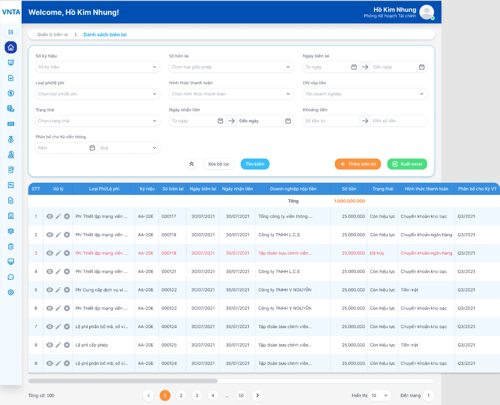

STT

Thông tin

Kiểu dữ liệu

Bắt buộc

Mô tả

Database

1

Tìm kiếm cơ bản

Tìm kiếm cơ bản

Tìm kiếm cơ bản

Tìm kiếm cơ bản

Tìm kiếm cơ bản

1.1

Số ký hiệu

Combobox

Search

- Chứa all mã số ký hiệu của biên lai thu phí, gồm:

+ VT-20E

+ AA-20E

- Mặc định ko chọn là Chọn tất cả.

1.2

Số biên lai

Combobox

- Chứa all số biên lai của từng loại phí/lệ phí đã nhập lên hệ thống.

- Cho phép người dùng chọn số biên lai.

- Cho phép người dùng nhập số biên lai.

- Autocomplete gõ nhập tên doanh nghiệp hệ thống tự động gợi ý

Cho phép chọn nhiều

1.3

Ngày biên lai

Datepicker

- Gồm từ ngày - đến ngày

- Đến phải >= Từ

- Cho phép người dùng chọn ngày biên lai.

1.4

Icon Tìm kiếm nâng cao

Button

- Nhấn icon hệ thống xổ xuống các tiêu chí Tìm kiếm nâng cao.

- Ngược lại khi hiển thị các tiêu chí nâng cao, nhấn icon sẽ thu gọn lại

1.5

Tìm kiếm

Button

Nhấn tìm kiếm. Hệ thống hiển thị bảng danh sách kết quả bên dưới.

1.6

Thêm biên lai mới

Button

Nhấn button hệ thống hiển thị giao diện cho phép nhập các trường thông tin để thêm mới biên lai.

1.7

Xuất excel

Button

Xuất file với các cột theo giao diện (trừ cột Xử lý), tiêu đề sheet là Danh sách biên lai (căn giữa), tên file: [Ngày xuất]_Danh sách biên lai

2

Tìm kiếm nâng cao

Tìm kiếm nâng cao

Tìm kiếm nâng cao

Tìm kiếm nâng cao

Tìm kiếm nâng cao

2.1

Số ký hiệu

Combobox

Search

- Chứa all mã số ký hiệu của biên lai thu phí, gồm:

+ VT-20E

+ AA-20E

- Mặc định ko chọn là Chọn tất cả.

2.2

Số biên lai

Combobox

- Chứa all số biên lai của từng loại phí/lệ phí đã nhập lên hệ thống.

- Cho phép người dùng chọn số biên lai.

- Cho phép người dùng nhập số biên lai.

- Autocomplete gõ nhập tên doanh nghiệp hệ thống tự động gợi ý

Cho phép chọn nhiều

2.3

Loại phí/lệ phí

Combobox search

- Mặc định không chọn là chọn tất cả

- Gồm:

- Phí CCDV viễn thông

- Phí TLM viễn thông công cộng

- Phí sử dụng mã, số viễn thông

- Phí TLM viễn thông dùng riêng

- Phí thử nghiệm mạng và dịch vụ viễn thông

- Phí sửa chữa cáp viễn thông trên biển

- Lệ phí cấp phép

- Lệ phí phân bổ mã, số viễn thông

- Được chọn 1 hoặc nhiều

2.4

DN nộp tiền

Combobox

- Chứa all DN có trong hệ thống.

- Mặc định ko chọn là Chọn tất cả.

- Cho phép người dùng nhập tên DN.

- Autocomplete gõ nhập tên doanh nghiệp hệ thống tự động gợi ý.

- Sắp xếp các option theo thứ tự tăng dần của Mã định danh

Cho phép chọn nhiều

2.5

Ngày biên lai

Datepicker

- Gồm từ ngày - đến ngày

- Đến phải >= Từ

- Cho phép người dùng nhập hoặc Chọn ngày phát sinh biên lai.

2.6

Khoảng tiền

Text

- Gồm Từ - Đến

- Đến phải >= Từ

- Cho phép người dùng nhập khoảng tiền mà DN đã nộp.

- Ngăn cách số tiền hàng nghìn bằng dấu “.”

2.7

Ngày nhận tiền

Datepicker

- Gồm từ ngày - đến ngày

- Đến phải >= Từ

- Cho phép người dùng nhập hoặc Chọn ngày nhận tiền của loại phí/lệ phí mà DN đã nộp.

2.8

Hình thức thanh toán

Combobox

-Chứa all các hình thức thanh toán, gồm:

+ Chuyển khoản kho bạc

+ Chuyển khoản ngân hàng

+ Tiền mặt

- Mặc định ko chọn là Chọn tất cả.

Cho phép chọn nhiều

- Autocomplete gõ nhập tên hình thức thanh toán hệ thống tự động gợi ý.

2.9

Trạng thái

Combobox

- Mặc định ko chọn là Chọn tất cả.

- Gồm: Còn hiệu lực/Đã hủy

2.10

Phân bổ cho kỳ VT

datepicker

Cho phép chọn kỳ viễn thông mà biên lai phân bổ cho.

2.11

Xóa điều kiện

Button

Nhấn [Xóa điều kiện], hệ thống xóa toàn bộ dữ liệu tiêu chí tìm kiếm đã nhập, giữ nguyên kết quả tìm kiếm.

2.12

Tìm kiếm

Button

Nhấn [Tìm kiếm], hệ thống check hợp lệ của điều kiện tìm kiếm và trả danh sách kết quả.

2.13

Thêm biên lai mới

Button

Nhấn button hệ thống hiển thị giao diện cho phép nhập các trường thông tin để thêm mới biên lai.

3

Grid danh sách

Grid danh sách

Grid danh sách

Grid danh sách

Grid danh sách

3.1

STT

Text

- Tự sinh tăng dần

3.2

Dòng Tổng

Text

- Tổng tiền cộng dồn của biên lai theo điều kiện tìm kiếm (không tính biên lai đã Hủy)

3.3

Xử lý

Bao gồm chức năng Xem chi tiết biên lai; Chỉnh sửa biên lai; Xóa biên lai.

3.3.1

Button

Nhấn để hệ thống chuyển sang màn Xem chi tiết biên lai

--	- Di chuột sẽ đổi thành màu xanh

3.3.2

Button

Nhấn để hệ thống chuyển sang màn Chỉnh sửa biên lai

- Di chuột sẽ đổi thành màu xanh

- Chỉ có đối với biên lai trạng thái Còn hiệu lực

3.3.3

Button

- Di chuột sẽ đổi thành màu đỏ

- Chỉ có đối với biên lai trạng thái Còn hiệu lực

- Nhấn hệ thống hiển thị popup nhập lý do Hủy biên lai

- Nhấn “Hủy” để hệ thống xác nhận Hủy biên lai.

Nhấn “Đóng”. Hệ thống quay về màn Xem danh sách biên lai.

3.4

Loại phí/Lệ phí

Text

Hiển thị loại phí/lệ phí

3.5

Ký hiệu

Text

Hiển thị số ký hiệu của biên lai.

Gồm 02 loại: AA – 20E;

VT – 20E.

3.6

Số biên lai

Text

Hiển thị số biên lai phát sinh khi DN nộp tiền các loại phí/lệ phí.

3.7

Ngày biên lai

Date

Hiển thị ngày phát sinh biên lai theo định dạng dd/mm/yyyy.

3.8

Ngày nhận tiền

Date

Hiển thị ngày CVT nhận tiền theo định dạng dd/mm/yyyy.

3.9

Doanh nghiệp nộp tiền

Text

Hiển thị tên doanh nghiệp nộp tiền.

3.10

Số tiền

Number

Hiển thị số tiền đã nộp cho các loại phí/lệ phí của từng DN.

Ngăn cách hàng nghìn bởi dấu “.”

3.11

Hình thức thanh toán

Text

Hiển thị hình thức thanh toán của biên lai

3.12

Phân bổ cho Kỳ VT

date

Hiển thị kỳ viễn thông mà biên lai phân bổ cho.

4

Phân trang

Phân trang

Phân trang

Phân trang

Phân trang

4.1

Tổng số bản ghi

Text

Hiển thị tổng số bản ghi theo điều kiện tìm kiếm

4.2

Phân trang

Button

Gồm các button: Về trang trước đó, 1, 2, 3, 4, 5 (nếu ít trang hơn sẽ tự cắt bớt), trang sau đó

4.3

Số bản ghi trên 1 trang

Combobox

Gồm:

10/trang

20/trang

50/trang

100/trang

Mặc định 10 bản ghi trên 1 trang

4.4

Đến trang

Text

- Nhập số trang => hệ thống nhảy đến dữ liệu trang tương ứng

Xem chi tiết biên lai

Luồng chức năng

Thông tin chung

Tên chức năng

Xem chi tiết thông tin biên lai.

Mô tả

Chức năng cho phép xem chi tiết thông tin biên lai và lịch sử cập nhật thông tin biên lai.

Tác nhân

Lãnh đạo, Cán bộ Phòng KHTC.

Điều kiện trước

Đăng nhập vào hệ thống, có phân quyền chức năng.

Điều kiện sau

Xem được chi tiết thông tin biên lai và lịch sử lưu vết cập nhật thông tin.

Ngoại lệ

N/A

Các yêu cầu đặc biệt

N/A

Luồng chức năng

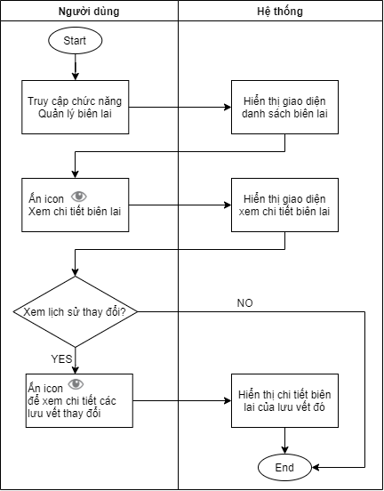

Mô tả luồng xử lý

Bước

Mô tả

Bước 1

NSD truy cập chức năng Quản lý biên lai.

Bước 2

Hiển thị giao diện danh sách biên lai.

Bước 3

Ấn icon  để xem chi tiết biên lai.

Bước 4

Hiển thị giao diện xem chi tiết biên lai của bản cập nhật hiện tại

Bước 5

Xem lịch sử thay đổi? Nếu có thì chuyển tới bước 5.1. Nếu không thì kết thúc luồng.

Bước 5.1

Ấn icon  để hệ thống hiển thị popup chi tiết thông tin biên lai trong từng lưu vết thay đổi.

Bước 5.2

Hiển thị chi tiết biên lai của lưu vết đó.

Kết thúc luồng.

Giao diện chức năng

Giao diện chi tiết biên lai trạng thái Còn hiệu lực

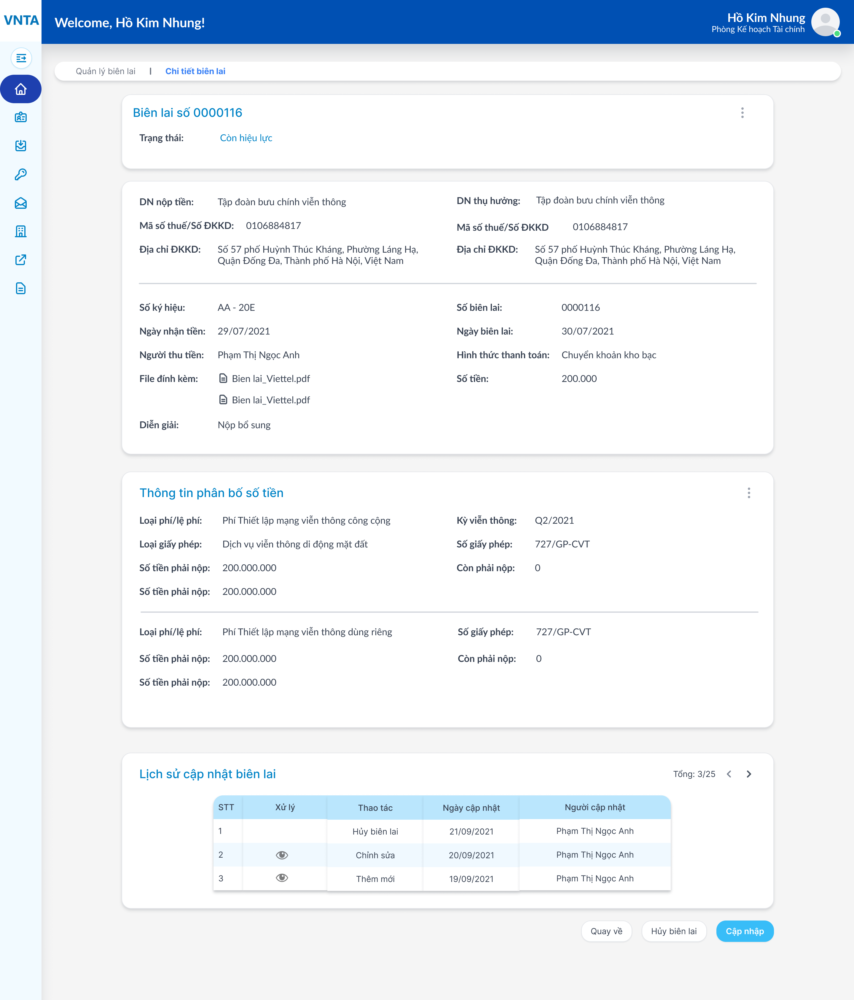

Giao diện chi tiết biên lai trạng thái Đã hủy

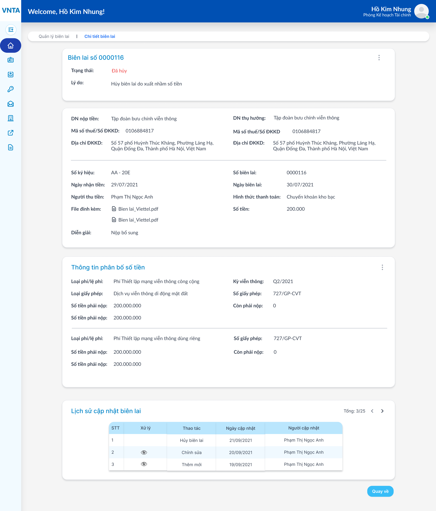

STT

Thông tin

Kiểu dữ liệu

Bắt buộc

Mô tả

Database

1

Biên lai số

Text

Hiển thị số biên lai đang xem chi tiết

2

Trạng thái

Text

Hiển thị trạng thái của biên lai:

- Còn hiệu lực

- Đã hủy

3

Lý do

Text

- Chỉ hiển thị đối với trạng thái là Đã hủy

4

DN nộp tiền

Text

Hiển thị tên DN nộp tiền, nếu dài sẽ cắt xuống dòng

4.1

Mã số thuế/Số ĐKKD

Number

Hiển thị MST/số ĐKKD của DN nộp tiền

4.2

Địa chỉ ĐKKD

Text

Hiển thị Địa chỉ ĐKKD của DN nộp tiền

5

DN thụ hưởng

Text

Hiển thị tên DN nộp tiền, nếu dài sẽ cắt xuống dòng

5.1

Mã số thuế/Số ĐKKD

Number

Hiển thị MST/số ĐKKD của DN thụ hưởng

5.2

Địa chỉ ĐKKD

Text

Hiển thị Địa chỉ ĐKKD của DN thụ hưởng

6

Số ký hiệu

Text

Số ký hiệu biên lai

7

Số biên lai

Number

Số biên lai.

8

Ngày nhận tiền

Date

Ngày nhận tiền, định dạng dd/mm/yyyy

9

Ngày biên lai

Date

Ngày biên lai, định dạng dd/mm/yyyy

10

Người thu tiền

Text

Tên người/đơn vị thu tiền.

11

Hình thức thanh toán

Text

Hiển thị hình thức thanh toán

12

File đính kèm

Text

Ấn vào để tải các file về máy.

13

Số tiền

Text

- Hiển thị số tiền đã nộp của biên lai (tổng số phân bổ của các loại phí/lệ phí)

- Ngăn cách hàng nghìn bởi dấu “.”

14

Diễn giải

Text

Hiển thị diễn giải

15

Thông tin phân bổ số tiền

Thông tin phân bổ số tiền

Thông tin phân bổ số tiền

Thông tin phân bổ số tiền

Thông tin phân bổ số tiền

15.1

Loại phí/lệ phí

Text

Tên loại phí/lệ phí.

15.2

Năm

Date

Hiển thị năm đối với phí thu theo Kỳ

Không hiển thị khi biên lai nộp cho Lệ phí/Phí TLM viễn thông dùng riêng/Phí thử nghiệm mạng

15.3

Quý

Date

Hiển thị quý đối với phí thu theo Kỳ

Không hiển thị khi biên lai nộp cho Lệ phí/Phí TLM viễn thông dùng riêng/Phí thử nghiệm mạng

15.4

Loại giấy phép

Text

Tên loại giấy phép.

15.5

Số giấy phép

Text

Hiển thị số giấy phép.

15.6

Số tiền phải nộp

Currency

Số tiền phải nộp.

Ngăn cách hàng nghìn bởi dấu “.”

15.7

Số tiền phân bổ

Currency

Số tiền phân bổ.

Ngăn cách hàng nghìn bởi dấu “.”

15.8

Còn phải nộp

Currency

= Số tiền phải nộp – Số tiền phân bổ.

16

Lịch sử cập nhật biên lai: Sắp xếp theo ngày cập nhật từ gần nhất đến xa nhất

Lịch sử cập nhật biên lai: Sắp xếp theo ngày cập nhật từ gần nhất đến xa nhất

Lịch sử cập nhật biên lai: Sắp xếp theo ngày cập nhật từ gần nhất đến xa nhất

Lịch sử cập nhật biên lai: Sắp xếp theo ngày cập nhật từ gần nhất đến xa nhất

Lịch sử cập nhật biên lai: Sắp xếp theo ngày cập nhật từ gần nhất đến xa nhất

16.1

STT

Text

--	- Tự sinh tăng dần

16.2

icon

--	- Hiển thị đối với những bản ghi lịch sử

--	- Nhấn hiển thị popup xem bản ghi lịch sử

16.3

Thao tác

Text

Gồm:

Thêm mới/Chỉnh sửa/Hủy biên lai

16.4

Ngày cập nhật

Text

Hiển thị ngày cập nhật của bản ghi

16.5

Người cập nhật

Text

Hiển thị họ tên tài khoản người cập nhật của bản ghi

16.6

Tổng

Text

- Tổng số bản ghi cập nhật

- Hiển thị 5 bản ghi/trang

- icon lùi trang trước/sau

17

Cập nhật

Button

Ấn vào để chỉnh sửa thông tin biên lai.

Hiển thị đối với biên lai trạng thái Còn hiệu lực

Không hiển thị đối với biên lai Đã hủy hoặc các bản lưu vết cũ

18

Hủy biên lai

Button

Ấn vào để Hủy biên lai.

Hiển thị đối với biên lai trạng thái Còn hiệu lực

Không hiển thị đối với biên lai Đã hủy hoặc các bản lưu vết cũ

Nhấn hiển thị popup Xác nhận Hủy biên lai

19

Quay về

Button

Ấn vào để quay trở về màn danh sách biên lai đang tìm kiếm.

Hủy biên lai

Luồng chức năng

Thông tin chung

Tên chức năng

Hủy biên lai.

Mô tả

Chức năng cho phép hủy biên lai.

Tác nhân

Lãnh đạo, Cán bộ Phòng KHTC.

Điều kiện trước

Đăng nhập vào hệ thống, có phân quyền chức năng.

Điều kiện sau

Hủy thành công biên lai.

Ngoại lệ

N/A

Các yêu cầu đặc biệt

N/A

Luồng chức năng

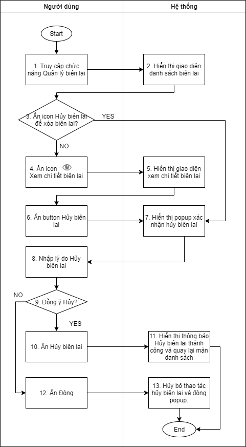

Bước

Mô tả

Bước 1

NSD truy cập chức năng Quản lý biên lai.

Bước 2

Hiển thị giao diện danh sách biên lai.

Bước 3

Ấn icon  để hủy biên lai?

Nếu có thì chuyển bước 7, nếu không thì chuyển bước 4.

Bước 4

Ấn icon  Xem chi tiết biên lai.

Bước 5

Hiển thị giao diện xem chi tiết biên lai.

Bước 6

Ấn button Hủy biên lai.

Bước 7

Hiển thị popup xác nhận Hủy biên lai.

Bước 8

Nhập lý do Hủy biên lai

Bước 9

Có đồng ý Hủy biên lai hay không, nếu có chuyển bước 10, ngược lại chuyển bước 12

Bước 10

Ấn Hủy biên lai

Bước 11

Hệ thống thông báo Hủy biên lai thành công, bản ghi biên lai Hủy đổi thành màu đỏ

Bước 12

Ấn Đóng

Bước 13

Hủy bỏ thao tác Hủy biên lai và đóng popup

Giao diện chức năng

STT

Thông tin

Kiểu dữ liệu

Bắt buộc

Mô tả

Database

1

Popup xác nhận hủy biên lai

Popup xác nhận hủy biên lai

Popup xác nhận hủy biên lai

Popup xác nhận hủy biên lai

Popup xác nhận hủy biên lai

1.1

Lý do

Textbox

x

--	- Nhập lý do hủy biên lai

--	- Maxlength: 500 ký tự

1.2

Hủy biên lai

Button

Ấn để đồng ý xóa biên lai

Hủy biên lai => Số tiền đã nộp, Còn phải nộp của DN được cập nhật lại (không tính biên lai Đã hủy)

Đối với 01 Tờ Khai, những bản đã Chốt sẽ không thay đổi số liệu khi Hủy biên lai sau đó, trường hợp Hủy trước khi thực hiện Chốt => Hệ thống sẽ cập nhật lại theo số liệu biên lai Còn hiệu lực

1.3

Đóng

Button

Ấn để hủy bỏ thao tác xóa biên lai và quay lại màn xem chi tiết/màn danh sách đang tìm kiếm trước đó.

Thêm mới biên lai

Luồng chức năng

Thông tin chung

Tên chức năng

Thêm mới biên lai

Mô tả

Chức năng cho phép thêm mới biên lai.

Tác nhân

Lãnh đạo, Cán bộ Phòng KHTC

Điều kiện trước

Đăng nhập vào hệ thống, có phân quyền chức năng.

Điều kiện sau

Lưu thành công biên lai lên hệ thống

Ngoại lệ

N/A

Các yêu cầu đặc biệt

N/A

Luồng chức năng

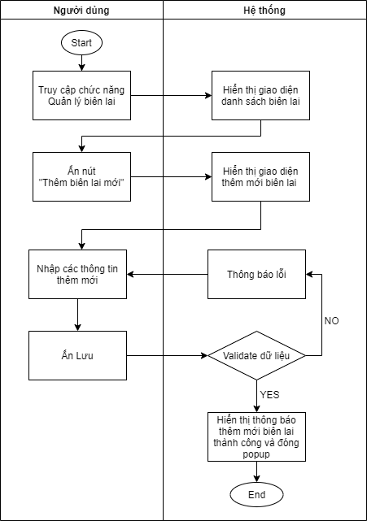

Mô tả luồng xử lý

Bước

Mô tả

Bước 1

NSD truy cập chức năng Quản lý biên lai

Bước 2

Hiển thị giao diện danh sách biên lai

Bước 3

Ấn nút "Thêm biên lai mới"

Bước 4

Hiển thị giao diện thêm mới biên lai.

Bước 5

Nhập các thông tin phân bổ số tiền. Lưu ý:

“Phí CCDV viễn thông”, “Phí TLM viễn thông công cộng”: Disable trường “Số giấy phép/Số quyết định”

“Phí kho số”: Disable trường “Loại giấy phép”, “Số giấy phép/Số quyết định”

“Phí TLM dùng riêng”, “Phí thử nghiệm mạng và CCDV viễn thông”, “Lệ phí cấp phép”, “Lệ phí phân bổ kho số”, “Phí sửa chữa cáp viễn thông trên biển”: Ẩn trường “Kỳ viễn thông”, disable “Loại giấy phép”

- NSD chọn kỳ viễn thông rồi chọn loại phí -> Trường “Loại phí/lệ phí” sẽ hiển thị các loại phí DN có sử dụng trong kỳ viễn thông đó và loại lệ phí/phí thử nghiệm/TLM dùng riêng/Phí sửa chữa cáp biển mà DN sử dụng.

- NSD không chọn kỳ viễn thông và chọn loại phí/lệ phí -> Loại phí/lệ phí sẽ chỉ hiển thị các Loại lệ phí/phí thử nghiệm/TLM dùng riêng/Phí sửa chữa cáp biển mà DN sử dụng.

Bước 6

Ấn Lưu.

Bước 7

Hệ thống tiến hành validate dữ liệu. Nếu thành công thì chuyển bước 9, nếu không thì chuyển bước 8.

Bước 8

Hệ thống thông báo lỗi:

- xxx là trường bắt buộc! – Nếu chưa nhập đủ các trường thông tin. (xxx: tên trường thông tin)

- Số biên lai đã tồn tại! – Nếu check kết hợp (Số biên lai + Số ký hiệu) đã tạo trước đó (xét cả biên lai đã hủy)

Bước 9

Hiển thị thông báo thêm mới biên lai thành công và đóng popup.

Giao diện chức năng

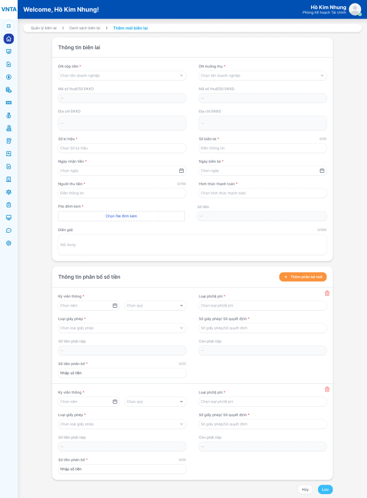

--	Giao diện mục phân bổ khi chọn loại phí là Phí sửa chữa/bảo dưỡng cáp viễn thông trên biển

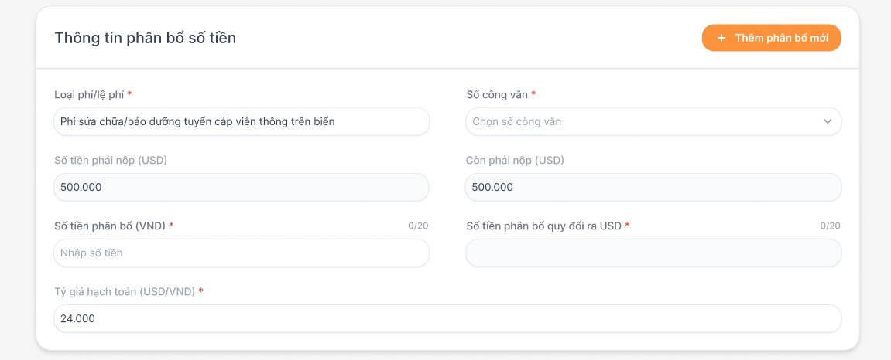

STT

Thông tin

Kiểu dữ liệu

Bắt buộc

Mô tả

Database

1

Thêm mới biên lai

Thêm mới biên lai

Thêm mới biên lai

Thêm mới biên lai

Thêm mới biên lai

1.1

DN nộp tiền

Combobox search

x

- Gồm tất cả các DN có trên hệ thống.

- Cho phép chọn 1 DN.

- Autocomplete gõ nhập tên doanh nghiệp hệ thống tự động gợi ý.

- Sắp xếp các option theo thứ tự Mã định danh tăng dần (quy định ngầm trong hệ thống khi thêm mới DN).

1.2

Mã số thuế/Số ĐKKD

Label

Autofill theo Doanh nghiệp nộp tiền.

1.3

Địa chỉ ĐKKD

Label

Autofill theo Doanh nghiệp nộp tiền.

1.4

DN thụ hưởng

Combobox search

x

- Gồm tất cả các DN có giấy phép hoặc có quyết định phân bổ mã, số trên hệ thống.

- Nếu DN nộp tiền có giấy phép hoặc có quyết định phân bổ mã, số viễn thông -> Auto fill theo tên DN nộp tiền vào DN thu hưởng. Nếu chưa có giấy phép hoặc quyết định phân bổ thì để trống. Cho phép chọn lại được DN.

- Autocomplete gõ nhập tên doanh nghiệp hệ thống tự động gợi ý.

- Sắp xếp các option theo thứ tự Mã định danh tăng dần (quy định ngầm trong hệ thống khi thêm mới DN).

Chỉ chọn 1

1.5

Mã số thuế/Số ĐKKD

Label

Autofill theo Doanh nghiệp thụ hưởng.

1.6

Địa chỉ ĐKKD

Label

Autofill theo Doanh nghiệp thụ hưởng.

1.7

Số ký hiệu

Combobox

X

Gồm 2 lựa chọn: “AA - 20E” và “VT - 20E”.

1.8

Số biên lai

Number

X

- Nhập số biên lai.

- Maxlenght: 20 ký tự

1.9

Ngày nhận tiền

Datepicker

X

Chọn ngày nhận tiền.

Định dạng dd/mm/yyyy

1.10

Ngày biên lai

Datepicker

X

Chọn ngày biên lai.

Autofill ngày hiện tại. Được chọn lại

Định dạng dd/mm/yyyy

1.11

Người thu tiền

Textbox

X

- Mặc định là Cục Viễn thông

- Cho phép nhập tên người/đơn vị thu tiền.

- Maxlenght: 100 ký tự

1.12

Hình thức thanh toán

Combobox

X

Gồm 3 lựa chọn, chọn 1 loại:

- “Chuyển khoản ngân hàng”.

- “Chuyển khoản kho bạc”.

- “Tiền mặt”.

1.13

Diễn giải

Textbox

- Maxlength: 500 kí tự.

1.12

File đính kèm

Button

X

Không giới hạn số lượng, định dạng file.

Dung lượng tối đa mỗi file 15MB

Nếu chọn file quá dung lượng sẽ báo lỗi: “Dung lượng file <=15MB!”

2

Thông tin phân bổ số tiền

Thông tin phân bổ số tiền

Thông tin phân bổ số tiền

Thông tin phân bổ số tiền

Thông tin phân bổ số tiền

2.1

Năm

Datepicker

x

Cho phép người dùng chọn năm

Mặc định là năm hiện tại

2.2

Quý

Combobox

Cho phép người dung chọn quý, gồm:

+ Quý 1

+ Quý 2

+ Quý 3

+ Quý 4

Chỉ chọn 1

2.3

Loại phí/lệ phí

x

Hiển thị loại phí/lệ phí DN có sử dụng, gồm:

- Phí CCDV viễn thông

- Phí TLM viễn thông công cộng

- Phí sử dụng mã, số viễn thông

- Phí TLM viễn thông dùng riêng

- Phí thử nghiệm mạng và dịch vụ viễn thông

- Phí sửa chữa cáp viễn thông trên biển

- Lệ phí cấp phép

- Lệ phí phân bổ mã, số viễn thông

- Chỉ chọn 1

Chú ý: Khi chọn quý năm đầu của giấy phép CCDV sẽ ko phải nộp phí CCDV => trường Loại phí/lệ phí ko có Phí CCDV viễn thông

2.4

Loại giấy phép

x

- Hiển thị trường này khi NSD chọn loại phí là “Phí CCDV viễn thông”, “Phí TLM viễn thông công cộng” còn các loại phí khác disable trường này.

Hiển thị các loại giấy DN phải nộp phí trong kỳ đó:

- Cố định mặt đất

- Di động mặt đất

- Cố định vệ tinh

- Di động vệ tinh

- Di động hàng hải

- Di động hàng không

Chỉ chọn 1

2.5

Số giấy phép

Text

x

- Hiển thị trường này khi NSD chọn các loại Lệ phí/Phí thử nghiệm/Phí TLM dùng riêng, Phí sửa chữa cáp viễn thông trên biển, còn lại disable trường này.

2.6

Số tiền phải nộp

Lable

Ngăn cách hàng nghìn bởi dấu “.”

2.7

Số tiền phân bổ

Textbox

x

Maxlength: 20 ký tự

Nhập số tiền phân bổ.

Ngăn cách hàng nghìn bởi dấu “.”

2.8

Còn phải nộp

Lable

Qúy = Số tiền phải nộp – Số tiền phân bổ

Năm:

Ban đầu khi chưa có Số tiền phân bổ: (1) = Số tiền phải nộp – Số tiền đã nộp 4 quý

Khi đã có Số tiền phân bổ: = (1) – Số tiền phân bổ

Tính toán luôn khi có dữ liệu Số tiền phân bổ

3

Thông tin phân bổ số tiền khi chọn loại phí: Phí sửa chữa/bảo dưỡng tuyến cáp viễn thông trên biển

Thông tin phân bổ số tiền khi chọn loại phí: Phí sửa chữa/bảo dưỡng tuyến cáp viễn thông trên biển

Thông tin phân bổ số tiền khi chọn loại phí: Phí sửa chữa/bảo dưỡng tuyến cáp viễn thông trên biển

Thông tin phân bổ số tiền khi chọn loại phí: Phí sửa chữa/bảo dưỡng tuyến cáp viễn thông trên biển

Thông tin phân bổ số tiền khi chọn loại phí: Phí sửa chữa/bảo dưỡng tuyến cáp viễn thông trên biển

3.1

Số công văn

Combobox search

x

- Hiển thị các số công văn cho phép sửa chửa/bảo dưỡng cáp đã có trên hệ thống (đồng bộ từ hệ thống cũ).

- Cho phép chọn 1 số công văn cho phép sửa chửa/bảo dưỡng cáp.

3.2

Số tiền phải nộp (USD)

Text

Hiển thị số tiền phải nộp mặc định tính theo USD. (VD: 50.000) (Tham khảo chức năng quản lý mức thu phí)

3.3

Số tiền phân bổ (VND)

Textbox

x

Nhập số tiền phân bổ (VNĐ)

3.4

Tỷ giá hạch toán (USD/VND)

Textbox

x

Nhập tỷ giá hạch toán.

Tự động phân cách hàng nghìn bằng dấu chấm.

3.5

Số tiền phân bổ quy đổi ra USD

Text

= Số tiền phân bổ bằng VND / Tỷ giá hạch toán

3.6

Còn phải nộp (USD)

Text

Hiển thị Số tiền còn phải nộp của công văn đã chọn tính tại thời điểm này.

Sau khi nhập tiền phân bổ thì tự động trừ thêm “Số tiền phân bổ quy đổi ra USD”.

4

Thêm mới phân bổ

Button

Nhấn -> hệ thống hiển thị giao diện thêm mới một phân bổ

5

Xóa phân bổ

Icon

Nhấn => hệ thống xóa phân bổ tương ứng

6

Lưu

Button

Nếu lỗi -> thông báo lỗi

Nếu thành công thì hiện thông báo “Thêm mới biên lai thành công” và đóng popup.

7

Hủy

Button

Hủy thao tác thêm mới biên lai. Quay trở về màn danh sách biên lai đang tìm kiếm.

Chỉnh sửa biên lai

Luồng chức năng

Thông tin chung

Tên chức năng

Chỉnh sửa thông tin biên lai.

Mô tả

Chức năng cho phép chỉnh sửa và lưu lại thông tin biên lai.

Tác nhân

Lãnh đạo, Cán bộ Phòng KHTC.

Điều kiện trước

Đăng nhập vào hệ thống, có phân quyền chức năng.

Điều kiện sau

Chỉnh sửa các thông tin và lưu lại chỉnh sửa thành công. Đồng thời lưu vết lại lịch sử cập nhật thông tin biên lai.

Ngoại lệ

N/A

Các yêu cầu đặc biệt

N/A

Luồng chức năng

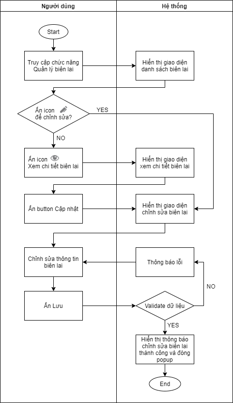

Mô tả luồng xử lý

Bước

Mô tả

Bước 1

NSD truy cập chức năng Quản lý biên lai.

Bước 2

Hiển thị giao diện danh sách biên lai.

Bước 3

Ấn icon  để chỉnh sửa?

Nếu có thì chuyển bước 4, nếu không thì chuyển bước 3.1.

Bước 3.1

Ấn icon  Xem chi tiết biên lai.

Bước 3.2

Hiển thị giao diện xem chi tiết biên lai.

Bước 3.3

Ấn button Cập nhật.

Bước 4

Hiển thị giao diện chỉnh sửa biên lai.

Bước 5

Chỉnh sửa thông tin phân bổ số tiền. Lưu ý:

“Phí CCDV viễn thông”, “Phí TLM viễn thông công cộng”: Disable trường “Số giấy phép/Số quyết định”

 “Phí kho số”: Disable trường “Loại giấy phép”, “Số giấy phép/Số quyết định”

“Phí TLM dùng riêng”, “Phí thử nghiệm mạng và CCDV viễn thông”, “Lệ phí cấp phép”, “Lệ phí phân bổ kho số”, “Phí sửa chữa cáp viễn thông trên biển”: Ẩn trường “Kỳ viễn thông”, disable “Loại giấy phép”

- NSD chọn kỳ viễn thông rồi chọn loại phí -> Trường “Loại phí/lệ phí” sẽ hiển thị các loại phí DN có sử dụng trong kỳ viễn thông đó và loại lệ phí/phí thử nghiệm/TLM dùng riêng/Phí sửa chữa cáp biển mà DN sử dụng.

- NSD không chọn kỳ viễn thông và chọn loại phí/lệ phí -> Loại phí/lệ phí sẽ chỉ hiển thị các Loại lệ phí/phí thử nghiệm/TLM dùng riêng/Phí sửa chữa cáp biển mà DN sử dụng.

Bước 6

Ấn Lưu.

Bước 7

Validate dữ liệu. Nếu thành công thì chuyển bước 9, nếu không chuyển bước 8.

Bước 8

Hệ thống thông báo lỗi:

- xxx là trường bắt buộc! – Nếu chưa nhập đủ các trường thông tin. (xxx: tên trường thông tin)

- Số biên lai đã tồn tại! – Nếu check kết hợp (Số biên lai + Số ký hiệu) đã tạo trước đó (xét cả biên lai đã hủy)

Bước 9

Hiển thị thông báo chỉnh sửa biên lai thành công và đóng popup. Đồng thời lưu vết lịch sử cập nhật tất cả các thông tin của biên lai.

Giao diện chức năng

Reference chức năng Thêm mới biên lai

Tờ khai thu nộp phí/lệ phí

Luồng chức năng

Thông tin chung

Tên chức năng

Xem, tìm kiếm, chốt thống kê tờ khai thu nộp phí, lệ phí.

Mô tả

Chức năng cho phép xem, tìm kiếm, chốt thống kê tờ khai thu nộp phí, lệ phí năm

Tác nhân

Lãnh đạo, Cán bộ Phòng KHTC

Điều kiện trước

Đăng nhập vào hệ thống, có phân quyền chức năng

Điều kiện sau

Xem, tìm kiếm, chốt thống kê tờ khai thu nộp phí, lệ phí năm

Ngoại lệ

N/A

Các yêu cầu đặc biệt

N/A

Luồng chức năng

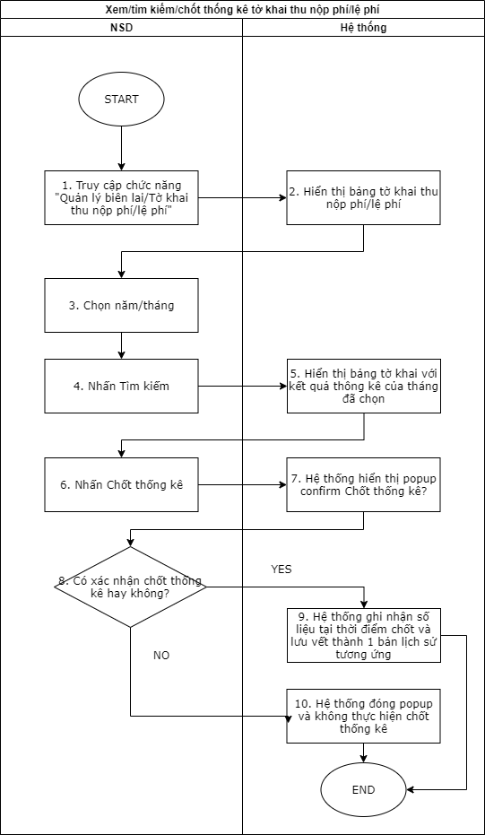

Mô tả luồng xử lý

Bước

Mô tả

Bước 1

NSD truy cập chức năng “Quản lý biên lai/Tờ khai thu nộp phí/lệ phí”.

Bước 2

Hệ thống hiển thị giao diện Tờ khai thu nộp phí/lệ phí với lần chốt thống kê gần nhất của tháng trước đó

Bước 3

NSD nhấn Chọn năm/tháng.

Bước 4

NSD nhấn [Tìm kiếm].

Bước 5

Hệ thống hiển thị bảng thống kê kết quả tờ khai thu nộp phí/lệ phí theo điều kiện tìm kiếm.

Bước 6

NSD nhấn [Chốt thống kê]

Bước 7

Hệ thống hiển thị popup Chốt thống kê

Bước 8

Người dùng có xác nhận chắc chắn chốt thống kê hay không? Nếu có chuyển bước 9, nếu không chuyển bước 10

Bước 9

Hệ thống ghi nhận số liệu tại thời điểm chốt và lưu vết thành 1 bản lịch sử tương ứng

Số liệu thống kê tại thời điểm thống kê sẽ không tính biên lai Đã hủy, chỉ tính những biên lai còn hiệu lực

Khi đã chốt nếu Hủy biên lai => số liệu đã chốt không thay đổi

Bước 10

Hệ thống đóng popup và không thực hiện chốt thống kê

Kết thúc luồng.

Giao diện chức năng

Giao diện mặc định khi vào chức năng

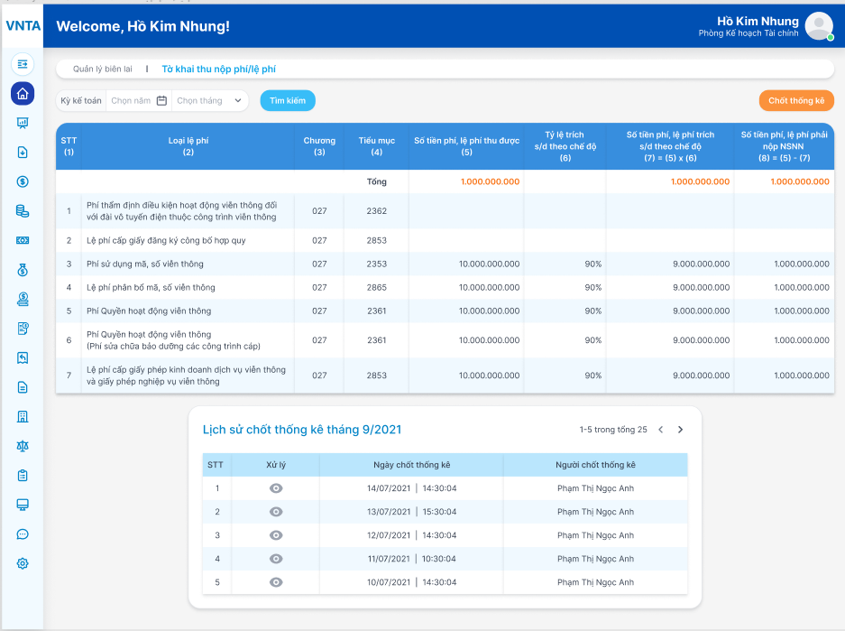

Popup xác nhận chốt thống kê

Giao diện khi xem chi tiết 1 bản ghi lịch sử

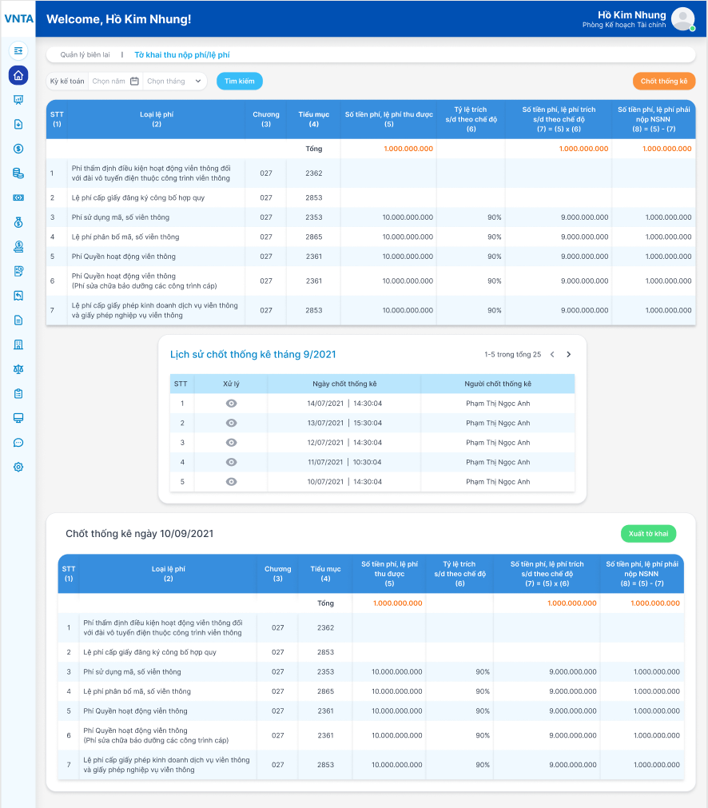

STT

Thông tin

Kiểu dữ liệu

Bắt buộc

Mô tả

Database

1

Tìm kiếm

Tìm kiếm

Tìm kiếm

Tìm kiếm

Tìm kiếm

1.1

Kỳ tính thuế

1.1.1

Năm

Datepicker

x

- Mặc định là năm của tháng trước đó.

- Cho phép người dùng chọn năm.

1.1.2

Tháng

Combobox

x

- Mặc định là tháng trước đó.

- Cho phép người dùng chọn tháng.

- Gồm 12 tháng, chỉ chọn 1 tháng

1.2

Tìm kiếm

Button

Tìm kiếm theo năm/tháng đã chọn. Hệ thống hiển thị bảng kết quả bên dưới.

1.3

Chốt thống kê

Button

Nhấn button, nếu chưa có cập nhật mức tỉ lệ trích thì báo lỗi “Vui lòng cập nhật tỉ lệ trích s/d theo chế độ”.

Hệ thống hiển thị popup xác nhận chốt thống kê, lưu vết lại số liệu thống kê tại thời điểm chốt.

Trường hợp 1: Người dùng nhấn “Chắc chắn” hệ thống chốt thống kê tại thời điểm chốt những biên lai trạng thái Còn hiệu lực đồng thời tạo 1 bản ghi lưu vết lịch sử hiển thị dưới bảng lịch sử.

Trường hợp 2: Người dùng nhấn “Hủy” hệ thống hủy bỏ việc chốt thống kê

2

Grid danh sách

Grid danh sách

Grid danh sách

Grid danh sách

Grid danh sách

2.1

STT (1)

Số thứ tự

2.2

Loại phí, lệ phí (2)

Text

Hiển thị các loại phí/lệ phí gồm:

- Phí thẩm định điều kiện hoạt động viễn thông đối với đài vô tuyến điện thuộc công trình viễn thông

- Lệ phí cấp giấy đăng ký công bố hợp quy

- Phí sử dụng mã, số viễn thông

--	- Lệ phí phân bổ kho số viễn thông

--	- Phí quyền hoạt động viễn thông:

--	Bao gồm: Phí CCDV, TLM công cộng, dùng riêng, Phí thử nghiệm mạng, phí lắp đặt cáp viễn thông.

--	- Phí quyền hoạt động viễn thông (Phí sửa chữa bảo dưỡng các công trình cáp)

--	- Lệ phí cấp giấy phép kinh doanh dịch vụ viễn thông và giấy phép nghiệp vụ viễn thông

2.3

Chương (3)

Number

Hiển thị chương tương ứng với loại phí/lệ phí mà DN cần nộp.

- Mặc định, không thay đổi

2.4

Tiểu mục (4)

Number

Hiển thị mã tiểu mục phân loại tương ứng với loại phí/lệ phí mà DN cần nộp.

- Mặc định, không thay đổi

2.5

Số tiền phí, lệ phí thu được (5)

Number

Hiển thị số tiền phí, lệ phí thu được theo năm (Tính từ 01/tháng thống kê-31/tháng thống kê theo Ngày biên lai) tương ứng với từng loại phí, lệ phí DN nộp phí (trừ Phí thẩm định điều kiện hoạt động viễn thông và Lệ phí cấp giấy đăng ký công bố hợp quy sẽ để trống).

2.6

Tỷ lệ trích s/d theo chế độ (6)

Number

Hiển thị tỷ lệ trích s/d theo chế độ tương ứng với từng loại phí đang được áp dụng (quy định tại chức năng cấu hình tờ khai thu phí).

Nếu chưa cập nhật thì để dấu ‘-‘

2.7

Số tiền phí, lệ phí trích sử dụng theo chế độ (7)

Number

= cột (5) * cột (6)

- Nếu là số thập phân làm tròn chỉ lấy phần nguyên, phần thập phân >=5 sẽ làm tròn phần số nguyên lên 1 đơn vị, ngược lại giữ nguyên phần số nguyên ko làm tròn nếu phần thập phân<5

- Ngăn cách hàng nghìn bởi dấu “.”

- Nếu chưa cập nhật tỉ lệ trích thì để dấu ‘-‘

2.8

Số tiền phí, lệ phí phải nộp NSNN (8)= (5) - (7)

Number

= cột (5) – cột (7)

- Nếu chưa cập nhật tỉ lệ trích thì để dấu ‘-‘

3

Lịch sử chốt thống kê tờ khai thu nộp phí, lệ phí

Lịch sử chốt thống kê tờ khai thu nộp phí, lệ phí

Lịch sử chốt thống kê tờ khai thu nộp phí, lệ phí

Lịch sử chốt thống kê tờ khai thu nộp phí, lệ phí

Lịch sử chốt thống kê tờ khai thu nộp phí, lệ phí

3.1

STT

Text

Số thứ tự

3.2

Xử lý

Button

Bao gồm chức năng Xem chi tiết bảng thống kê tại thời điểm chốt thống kê tờ khai thu nộp phí, lệ phí.

3.2.1

Button

Nhấn để hệ thống xổ xuống thông tin chi tiết thống kê tờ khai thu nộp phí, lệ phí theo bản ghi đã chọn

3.3

Ngày chốt thống kê

Date

Hiển thị ngày chốt thống kê theo định dạng dd/mm/yyyy.

3.4

Người chốt thống kê

Text

Hiển thị họ tên người dùng đã thao tác chốt thống kê.

3.5

Phân trang

Phân trang

Phân trang

Phân trang

Phân trang

3.9

Số bản ghi trên 1 trang/Tổng số bản ghi

Combobox

Gồm: phân trang 5 bản ghi/trang

Có icon lùi trước sau

4

Chi tiết bản ghi chốt thống kê

Text

- Hiển thị số liệu tại thời điểm chốt thống kê (theo đúng các cột của bảng Tờ khai thu nộp phí/lệ phí)

4.1

Xuất tờ khai

Button

Xuất Tờ khai thu nộp phí/lệ phí (Tên file: Tờ khai thu nộp phí/lệ phí tháng [tháng thống kê tờ khai]_Lần [lần chốt])

 và Tờ khai chi tiết thu phí/lệ phí theo bản ghi chốt đang chọn (Tên file: Tờ khai chi tiết thu phí/lệ phí tháng [tháng thống kê tờ khai]_Lần [lần chốt])

Tờ khai quyết toán phí/lệ phí

Luồng chức năng

Thông tin chung

Tên chức năng

Xem, tìm kiếm, chốt thống kê tờ khai quyết toán phí, lệ phí.

Mô tả

Chức năng cho phép xem, tìm kiếm, chốt thống kê tờ khai quyết toán phí, lệ phí năm

Tác nhân

Lãnh đạo, Cán bộ Phòng KHTC

Điều kiện trước

Đăng nhập vào hệ thống, có phân quyền chức năng

Điều kiện sau

Xem, tìm kiếm, chốt thống kê tờ khai quyết toán phí, lệ phí năm

Ngoại lệ

N/A

Các yêu cầu đặc biệt

N/A

Luồng chức năng

Mô tả luồng xử lý

Bước

Mô tả

Bước 1

NSD truy cập chức năng “Quản lý biên lai/Tờ khai quyết toán phí/lệ phí”.

Bước 2

Hệ thống hiển thị giao diện Tờ khai quyết toán phí/lệ phí với lần chốt thống kê gần nhất của năm trước đó

Bước 3

NSD nhấn Chọn năm.

Bước 4

NSD nhấn [Tìm kiếm].

Bước 5

Hệ thống hiển thị bảng thống kê kết quả tờ khai quyết toán phí/lệ phí theo điều kiện tìm kiếm.

Bước 6

NSD nhấn [Chốt thống kê]

Bước 7

Hệ thống hiển thị popup Chốt thống kê

Bước 8

Người dùng có xác nhận chắc chắn chốt thống kê hay không? Nếu có chuyển bước 9, nếu không chuyển bước 10

Bước 9

Hệ thống ghi nhận số liệu tại thời điểm chốt và lưu vết thành 1 bản lịch sử tương ứng

Số liệu thống kê tại thời điểm thống kê sẽ không tính biên lai Đã hủy, chỉ tính những biên lai còn hiệu lực

Khi đã chốt nếu Hủy biên lai => số liệu đã chốt không thay đổi

Bước 10

Hệ thống đóng popup và không thực hiện chốt thống kê

Kết thúc luồng.

Giao diện chức năng

Giao diện mặc định vào chức năng

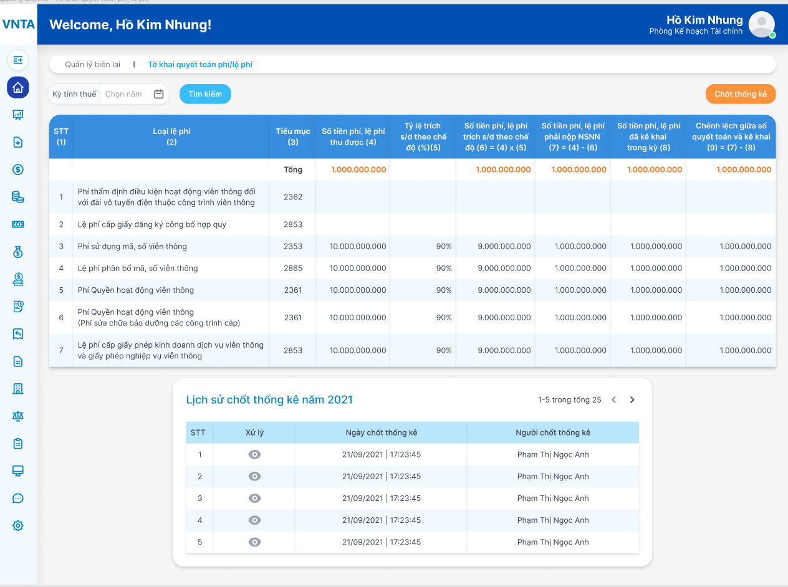

Popup Chốt thống kê

Giao diện xem chi tiết 1 bản ghi lịch sử đã chốt

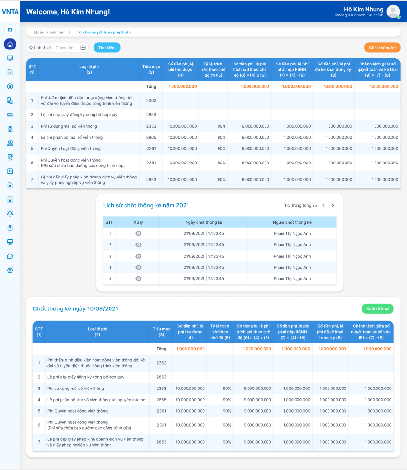

STT

Thông tin

Kiểu dữ liệu

Bắt buộc

Mô tả

Database

1

Tìm kiếm

Tìm kiếm

Tìm kiếm

Tìm kiếm

Tìm kiếm

1.1

Kỳ tính thuế

Datepicker

x

- Mặc định là năm trước đó.

- Cho phép người dùng chọn năm.

1.2

Tìm kiếm

Button

Tìm kiếm theo năm đã chọn. Hệ thống hiển thị bảng kết quả bên dưới.

1.3

Chốt thống kê

Button

Nhấn -> hệ thống kiểm tra 12 tháng trong năm đã cập nhật mức tỉ lệ chưa. Nếu chưa thì báo lỗi “Vui lòng cập nhật tỉ lệ trích s/d theo chế độ”.

Nếu đã cập nhật đủ thì hệ thống hiển thị popup xác nhận chốt thống kê, lưu vết lại số liệu thống kê tại thời điểm chốt.

Trường hợp 1: Người dùng nhấn “Chắc chắn” hệ thống chốt thống kê tại thời điểm chốt những biên lai trạng thái Còn hiệu lực đồng thời tạo 1 bản ghi lưu vết lịch sử hiển thị dưới bảng lịch sử.

Trường hợp 2: Người dùng nhấn “Hủy” hệ thống hủy bỏ việc chốt thống kê

2

Grid danh sách

Grid danh sách

Grid danh sách

Grid danh sách

Grid danh sách

2.1

STT (1)

Số thứ tự

2.2

Loại phí, lệ phí (2)

Text

Hiển thị các loại phí/lệ phí gồm:

- Phí thẩm định điều kiện hoạt động viễn thông

- Lệ phí cấp giấy đăng ký công bố hợp quy

- Phí sử dụng mã, số viễn thông

--	- Lệ phí phân bổ kho số viễn thông, tài nguyên Internet

--	- Phí quyền hoạt động viễn thông:

--	Bao gồm: Phí CCDV, TLM công cộng, dùng riêng, Phí thử nghiệm mạng, phí lắp đặt cáp viễn thông.

--	- Phí quyền hoạt động viễn thông (Phí sửa chữa bảo dưỡng các công trình cáp)

--	- Lệ phí cấp giấy phép kinh doanh dịch vụ viễn thông và giấy phép nghiệp vụ viễn thông

2.3

Tiểu mục (3)

Number

Hiển thị mã tiểu mục thu phân loại tương ứng với loại phí/lệ phí mà DN cần nộp.

- Mặc định, không thay đổi

2.4

Số tiền phí, lệ phí thu được (4)

Number

x

Hiển thị số tiền phí, lệ phí thu được theo năm (Tính từ 01/01-31/12) tương ứng với từng loại phí, lệ phí DN nộp phí theo Ngày biên lai (trừ Phí thẩm định điều kiện hoạt động viễn thông và Lệ phí cấp giấy đăng ký công bố hợp quy sẽ để trống)

2.5

Tỷ lệ trích s/d theo chế độ (%) (5)

Number

Hiển thị tỷ lệ trích s/d theo chế độ tương ứng với từng loại phí đang được áp dụng (quy định tại chức năng cấu hình tờ khai thu phí)

2.6

Số tiền phí, lệ phí trích sử dụng theo chế độ (6) = (4)*(5)

Number

= cột (4) * cột (5)

- Nếu là số thập phân làm tròn chỉ lấy phần nguyên, phần thập phân >=5 sẽ làm tròn phần số nguyên lên 1 đơn vị, ngược lại giữ nguyên phần số nguyên ko làm tròn nếu phần thập phân<5

- Ngăn cách hàng nghìn bởi dấu “.”

- Nếu trong năm có nhiều hơn 1 mức tỉ lệ thì bỏ trống cột này.

- Nếu chưa cập nhật tỉ lệ trích đầy đủ của 12 tháng trong năm thì để dấu ‘-‘

2.7

Số tiền phí, lệ phí phải nộp NSNN (7)= (4)-(6)

Number

= Số tiền phí, lệ phí thu được của DN theo năm (4) – Số tiền phí, lệ phí trích (6)

- Nếu chưa cập nhật tỉ lệ trích đầy đủ của 12 tháng trong năm thì để dấu ‘-‘

2.8

Số tiền phí, lệ phí đã kê khai trong kỳ (8)

Number

Cộng dồn số tiền đã nộp Ngân sách nhà nước của các tháng từ tháng 1 đến tháng 12 theo số liệu chốt gần nhất của các tháng (cột (8) của Tờ khai thu nộp phí/lệ phí)

- Nếu chưa cập nhật tỉ lệ trích đầy đủ của 12 tháng trong năm thì để dấu ‘-‘

2.8

Chênh lệch giữa số quyết toán và kê khai (9) = (7)-(8)

Number

x

= (7) – (8)

- Nếu chưa cập nhật tỉ lệ trích đầy đủ của 12 tháng trong năm thì để dấu ‘-‘

3

Lịch sử chốt thống kê tờ khai quyết toán phí, lệ phí

Lịch sử chốt thống kê tờ khai quyết toán phí, lệ phí

Lịch sử chốt thống kê tờ khai quyết toán phí, lệ phí

Lịch sử chốt thống kê tờ khai quyết toán phí, lệ phí

Lịch sử chốt thống kê tờ khai quyết toán phí, lệ phí

3.1

STT

Text

Số thứ tự

3.2

Xử lý

Button

Bao gồm chức năng Xem chi tiết bảng thống kê tại thời điểm chốt thống kê tờ khai quyết toán phí, lệ phí.

3.2.1

Button

Nhấn để hệ thống xổ xuống thông tin chi tiết thống kê tờ khai quyết toán phí, lệ phí theo bản ghi đã chọn

3.3

Ngày chốt thống kê

Date

Hiển thị ngày chốt thống kê theo định dạng dd/mm/yyyy.

3.4

Người chốt thống kê

Text

Hiển thị họ tên người dùng đã thao tác chốt thống kê.

3.5

Phân trang

3.6

Số bản ghi trên 1 trang/Tổng số bản ghi

Combobox

Gồm: phân trang 5 bản ghi/trang

Có icon lùi trước sau

4

Chi tiết bản ghi chốt thống kê

Text

- Hiển thị số liệu tại thời điểm chốt thống kê (theo đúng các cột của bảng Tờ khai quyết toán phí/lệ phí)

4.1

Xuất tờ khai

Button

Xuất Tờ khai quyết toán phí/lệ phí (Tên file: Tờ khai quyết toán phí/lệ phí tháng [năm thống kê tờ khai]_Lần [lần chốt]) và Tờ khai chi tiết thu phí/lệ phí theo bản ghi chốt đang chọn (Tên file: Tờ khai chi tiết thu phí/lệ phí năm [năm thống kê tờ khai]_Lần [lần chốt])

Quản lý thông tin Doanh nghiệp

Xem danh sách Doanh nghiệp

Luồng chức năng

Thông tin chung

Tên chức năng

Xem/Tìm kiếm danh sách doanh nghiệp

Mô tả

Chức năng cho phép xem và tìm kiếm danh sách doanh nghiệp

Tác nhân

Lãnh đạo, Cán bộ Phòng KHTC, Kinh tế, CPTN, Thanh tra

Điều kiện trước

Đăng nhập vào hệ thống, có phân quyền chức năng

Điều kiện sau

Xem và tìm kiếm được danh sách doanh nghiệp

Ngoại lệ

N/A

Các yêu cầu đặc biệt

N/A

Luồng chức năng

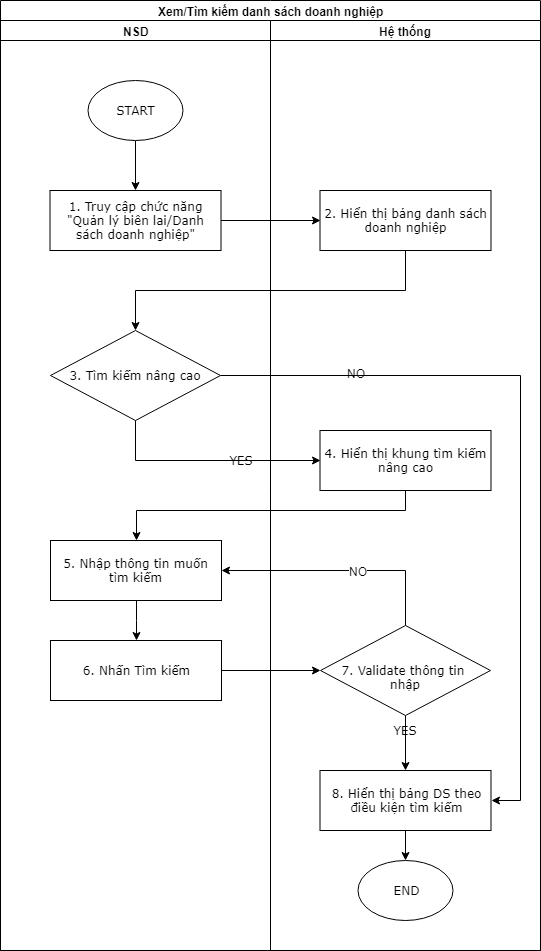

Bước

Mô tả

Bước 1

NSD truy cập chức năng “Quản lý thông tin Doanh nghiệp/Danh sách doanh nghiệp”.

Bước 2

Hệ thống hiển thị giao diện danh sách doanh nghiệp

Danh sách DN được đồng bộ từ hệ thống QLVT => Mã định danh tự sinh tăng dần được gán với mỗi DN

Sắp xếp danh sách theo Mã định danh tăng dần

Bước 3

NSD nhấn icon [Hiển thị bộ lọc] => tiến hành tìm kiếm các thông tin.

- Nếu có, chuyển bước 4

- Nếu không, chuyển bước 8

Bước 4

Hệ thống hiển thị khung tìm kiếm.

Bước 5

NSD nhập các thông tin tìm kiếm tại các trường dữ liệu tương ứng.

Bước 6

Nhấn [Tìm kiếm].

Bước 7

Hệ thống kiểm tra tính hợp lệ thông tin nhập:

- Nếu hợp lệ, chuyển bước 8

- Nếu không hợp lệ, hệ thống đưa ra thông báo tại các trường nhập không hợp lệ. Quay lại bước 5.

Bước 8

Hệ thống hiển thị danh sách thông tin doanh nghiệp theo điều kiện tìm kiếm.

Kết thúc luồng.

Giao diện chức năng

Tìm kiếm cơ bản

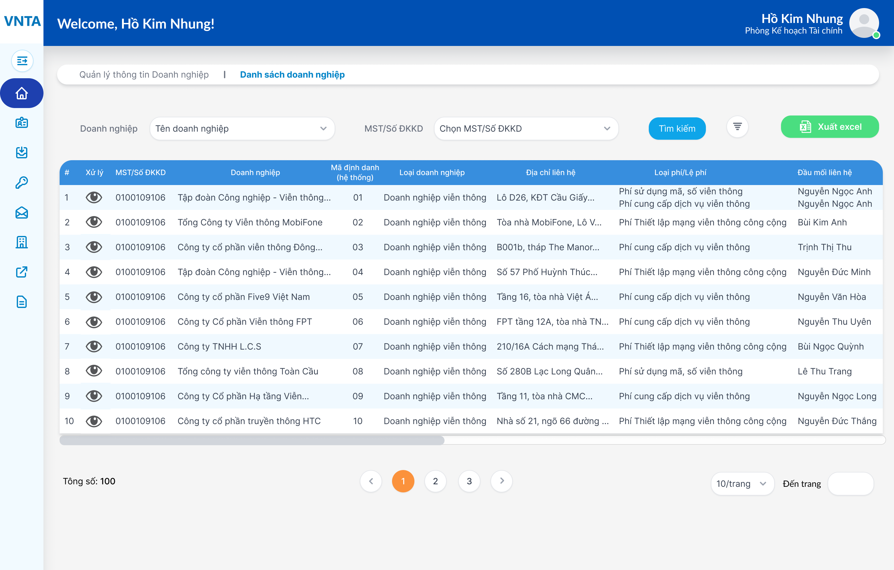

Tìm kiếm nâng cao

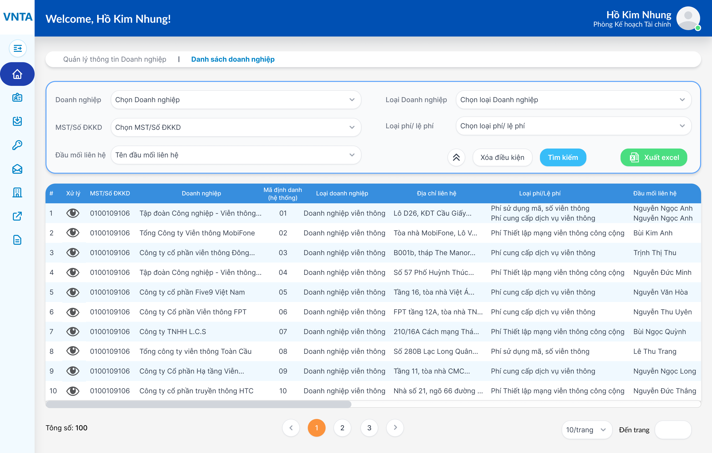

STT

Thông tin

Kiểu dữ liệu

Bắt buộc

Mô tả

Database

1

Tìm kiếm cơ bản

Tìm kiếm cơ bản

Tìm kiếm cơ bản

Tìm kiếm cơ bản

Tìm kiếm cơ bản

1.1

Doanh nghiệp

Combobox

Search

- Chứa all DN được đồng bộ từ hệ thống QLVT

- Mặc định ko chọn là Chọn tất cả.

- Cho phép người dùng nhập tên DN.

- Autocomplete gõ nhập tên doanh nghiệp hệ thống tự động gợi ý.

- Sắp xếp các option theo thứ tự Mã định danh tăng dần (quy định ngầm trong hệ thống khi thêm mới DN)

- Cho chọn nhiều

1.3

MST/Số ĐKKD

Combobox search

- Chứa MST/ số ĐKKD của all DN có giấy phép CCDV

- Cho phép nhập Mã số thuế/ Số ĐKKD

- Autocomplete

- Cho chọn nhiều

2

Tìm kiếm nâng cao

Tìm kiếm nâng cao

Tìm kiếm nâng cao

Tìm kiếm nâng cao

Tìm kiếm nâng cao

2.1

Doanh nghiệp

Combobox

Search

- Chứa all DN được đồng bộ từ hệ thống QLVT

- Mặc định ko chọn là Chọn tất cả.

- Cho phép người dùng nhập tên DN.

- Autocomplete gõ nhập tên doanh nghiệp hệ thống tự động gợi ý.

- Sắp xếp các option theo thứ tự Mã định danh tăng dần (quy định ngầm trong hệ thống khi thêm mới DN)

- Cho chọn nhiều

2.2

Loại doanh nghiệp

Combobox

- Cho phép người dùng nhập loại doanh nghiệp.

- Autocomplete gõ nhập loại doanh nghiệp hệ thống tự động gợi ý.

Gồm: Doanh nghiệp viễn thông/ Khác

- Cho chọn nhiều

2.3

MST/Số ĐKKD

Combobox search

- Chứa MST/ số ĐKKD của all DN có giấy phép CCDV

- Cho phép nhập Mã số thuế/ Số ĐKKD

- Autocomplete

- Cho chọn nhiều

2.4

Loại phí, lệ phí

Comboboxsearch

- Cho phép nhập các loại phí/lệ phí DN.

- Autocomplete gõ nhập loại phí/lệ phí của DN nộp hệ thống tự động gợi ý.

- Cho chọn nhiều

2.5

Đầu mối liên hệ

Combobox

x

- Gồm tất cả các đầu mối của cac DN

- Cho phép nhập thông tin họ tên đầu mối liên hệ.

- Autocomplete gõ nhập họ tên đầu mối liên hệ.

- Cho chọn nhiều

2.6

Xóa điều kiện

Button

x

2.7

Tìm kiếm

Button

x

Tìm kiếm theo các trường thông tin Tên Doanh nghiệp; MST. Hệ thống hiển thị bảng danh sách bên dưới.

2.8

Icon Tìm kiếm nâng cao

Button

x

- Nhấn button hệ thống xổ xuống các tiêu chí Tìm kiếm nâng cao.

- Ngược lại khi hiển thị các tiêu chí nâng cao, nhấn icon sẽ thu gọn lại

2.9

Xuất excel

Button

Nhấn xuất theo điều kiện tìm kiếm

File gồm các cột giống trên giao diện (trừ cột xử lý), tiêu đề của sheet là Danh sách Doanh nghiệp, tên file: [Ngày xuất]_Danh sách Doanh nghiệp

3

Grid danh sách

Grid danh sách

Grid danh sách

Grid danh sách

Grid danh sách

3.1

STT

Text

- Tự sinh tăng dần

3.2

Xử lý

Bao gồm chức năng Xem chi tiết thông tin doanh nghiệp.

3.2.1

Button

Nhấn button hệ thống chuyển đến màn Xem chi tiết thông tin doanh nghiệp.

3.3

MST/Số ĐKKD

Number

Hệ thống hiển thị thông tin Mã số thuế; Số đăng ký kinh doanh của từng doanh nghiệp nộp phí trên hệ thống.

3.4

Doanh nghiệp

Text

Hệ thống hiển thị thông tin tên Doanh nghiệp

3.5

Mã định danh (hệ thống)

Text

- Mã định danh DN tự sinh tăng dần trong hệ thống

- Tăng dần khi có thêm mới DN

3.6

Loại doanh nghiệp

Text

Hệ thống hiển thị thông tin loại doanh nghiệp

3.7

Địa chỉ liên hệ

Text

Hệ thống hiển thị thông tin địa chỉ liên hệ của doanh nghiệp.

3.8

Loại phí/lệ phí

Text

Hệ thống hiển thị thông tin các loại phí/lệ phí mà DN cần nộp.

3.9

Đầu mối liên hệ

Text

Hệ thống hiển thị thông tin họ tên của đầu mối liên hệ tương ứng với các Loại phí DN cần nộp

4

Phân trang

Phân trang

Phân trang

Phân trang

Phân trang

4.1

Tổng số bản ghi

Text

Hiển thị tổng số bản ghi theo điều kiện tìm kiếm

4.2

Phân trang

Button

Gồm các button: Về trang trước đó, 1, 2, 3, 4, 5 (nếu ít trang hơn sẽ tự cắt bớt), trang sau đó

4.3

Số bản ghi trên 1 trang

Combobox

Gồm:

10/trang

20/trang

50/trang

100/trang

Mặc định 10 bản ghi trên 1 trang

4.4

Đến trang

Text

- Nhập số trang => hệ thống nhảy đến dữ liệu trang tương ứng

Xem chi tiết/cập nhật thông tin chung Doanh nghiệp

Luồng chức năng

Thông tin chung

Tên chức năng

Xem chi tiết/cập nhật thông tin chung.

Mô tả

Chức năng cho phép xem chi tiết thông tin chung của doanh nghiệp và người dung có thể chủ động cập nhật thông tin kỳ kế toán và thông tim ủy quyền nộp phí của DN.

Tác nhân

Lãnh đạo, Cán bộ Phòng KHTC.

Điều kiện trước

Đăng nhập vào hệ thống, có phân quyền chức năng.

Điều kiện sau

Xem và cập nhật thông tin thành công.

Ngoại lệ

N/A

Các yêu cầu đặc biệt

N/A

Luồng chức năng

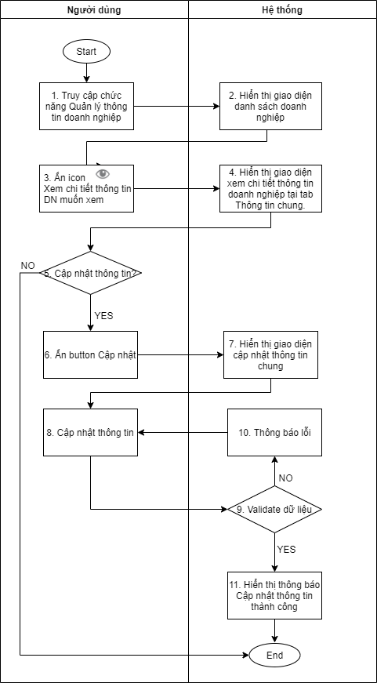

Bước

Mô tả

Bước 1

Truy cập chức năng Quản lý thông tin doanh nghiệp.

Bước 2

Hiển thị giao diện danh sách doanh nghiệp.

Bước 3

Ấn icon  Xem chi tiết thông tin DN muốn xem.

Bước 4

Hiển thị giao diện xem chi tiết thông tin doanh nghiệp. Mặc định mở tab Thông tin chung.

Bước 5

Cập nhật thông tin? Nếu có thì chuyển bước 6. Nếu không thì Kết thúc luồng.

Bước 6

Ấn button Cập nhật.

Bước 7

Hiển thị giao diện cập nhật thông tin chung.

Bước 8

Người sử dụng được phép cập nhật các thông tin về kỳ kế toán và thông tin ủy quyền

Bước 9

Hệ thống tiến hành validate dữ liệu. Nếu thành công thì chuyển tới bước 11, nếu không thì chuyển tới bước 10

Bước 10

Thông báo lỗi: “xxx là trường bắt buộc! – Nếu chưa nhập đủ các trường thông tin. (xxx: tên trường dữ liệu)

Bước 11

Hiển thị thông báo Cập nhật thông tin thành công và quay lại màn xem chi tiết thông tin chung.

Kết thúc luồng.

Giao diện chức năng

Giao diện xem chi tiết thông tin chung

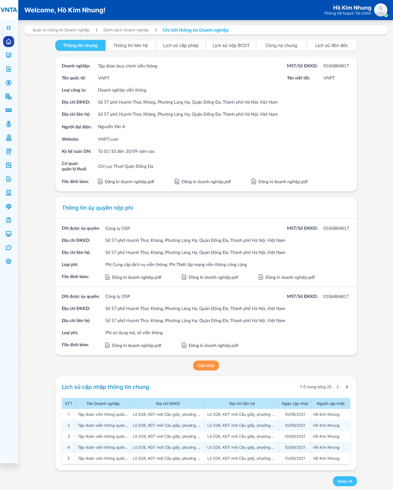

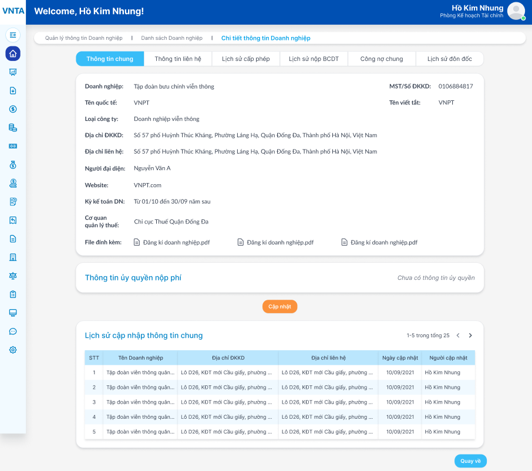

STT

Thông tin

Kiểu dữ liệu

Bắt buộc

Mô tả

Database

1

Doanh nghiệp

Text

Tên DN hiện tại, đồng bộ từ hệ thống QLVT

2

Mã số thuế/Số ĐKKD

Text

MST/Số ĐKKD hiện tại của DN, đồng bộ từ hệ thống QLVT

3

Tên quốc tế

Text

Tên quốc tế hiện tại của DN, đồng bộ từ hệ thống QLVT

4

Tên viết tắt

Text

Tên viết tắt hiện tại của DN, đồng bộ từ hệ thống QLVT

5

Loại công ty

Text

Loại công ty hiện tại của DN, đồng bộ từ hệ thống QLVT

6

Người đại diện

Text

Người đại diện hiện tại của DN, đồng bộ từ hệ thống QLVT

7

Địa chỉ ĐKKD

Text

Địa chỉ ĐKKD hiện tại của DN, đồng bộ từ hệ thống QLVT

8

Địa chỉ liên hệ

Text

Địa chỉ liên hệ hiện tại của DN, đồng bộ từ hệ thống QLVT

9

Website

Text

website hiện tại của DN, đồng bộ từ hệ thống QLVT

10

Kỳ kế toán của DN

Text

Hiển thị kỳ kế toán của DN, được cập nhật

11

Cơ quan quản lý thuế

Text

Hiển thị tên cơ quan quản lý thuế đồng bộ từ hệ thống QLVT.

12

File đính kèm

Hiển thị các file đính kèm đồng bộ từ hệ thống QLVT. Có thể tải xuống.

13

Thông tin ủy quyền nộp phí

Thông tin ủy quyền nộp phí

Thông tin ủy quyền nộp phí

Thông tin ủy quyền nộp phí

Thông tin ủy quyền nộp phí

13.1

Dn được ủy quyền

Text

Hiển thị tên DN được ủy quyền

13.2

MST/Số ĐKKD

Text

Hiển thị MST/Số ĐKKD của DN được ủy quyền

13.3

Địa chỉ ĐKKD

Text

Hiển thị Địa chỉ ĐKKD của DN được ủy quyền

13.4

Loại phí

Text

Hiển thị các Loại phí mà DN được ủy quyền

13.5

File đính kèm

Hiển thị các file đính kèm

Có thể tải xuống.

14

Cập nhật

Button

Nhấn sẽ link sang giao diện cập nhật thông tin chung

15

Lịch sử cập nhật thông tin chung

Lịch sử cập nhật thông tin chung

Lịch sử cập nhật thông tin chung

Lịch sử cập nhật thông tin chung

Lịch sử cập nhật thông tin chung

15.1

STT

Number

Tự sinh, tăng dần

15.2

Tên DN

Text

Lưu vết tên DN qua các lần cập nhật trên hệ thống QLVT

15.3

Địa chỉ ĐKKD

Text

Lưu vết Địa chỉ ĐKKD qua các lần cập nhật trên hệ thống QLVT

15.4

Địa chỉ liên hệ

Text

Lưu vết Địa chỉ liên hệ qua các lần cập nhật trên hệ thống QLVT

15.5

Ngày cập nhật

Text

Hiển thị Ngày cập nhật theo hệ thống QLTP.

15.6

Người cập nhật

Text

Hiển thị Người cập nhật theo hệ thống QLTP.

15.7

Số bản ghi trên 1 trang/Tổng số bản ghi

Combobox

Gồm: phân trang 5 bản ghi/trang

Có icon lùi trước sau

16

Quay về

Button

Nhấn quay về danh sách doanh nghiệp

Giao diện cập nhật thông tin chung của DN

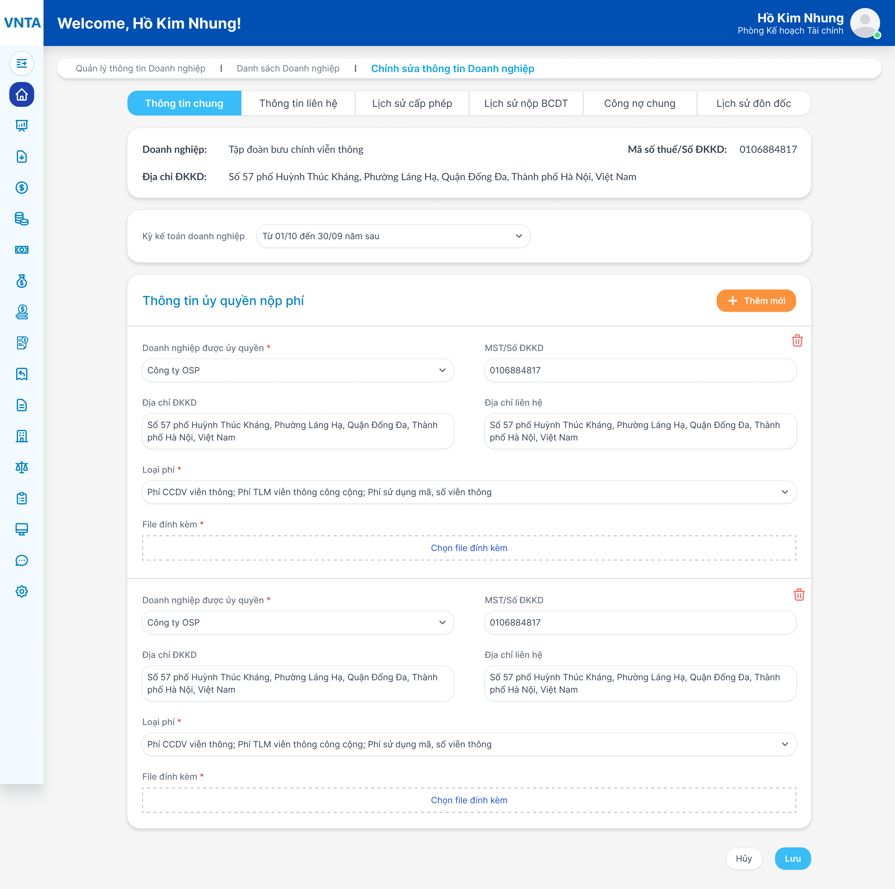

STT

Thông tin

Kiểu dữ liệu

Bắt buộc

Mô tả

Database

1

Doanh nghiệp

Text

Tên DN hiện tại, đồng bộ từ hệ thống QLVT

2

Mã số thuế/Số ĐKKD

Text

MST/Số ĐKKD hiện tại của DN, đồng bộ từ hệ thống QLVT

3

Địa chỉ ĐKKD

Text

Địa chỉ ĐKKD hiện tại của DN, đồng bộ từ hệ thống QLVT

4

Kỳ kế toán của DN

Combobox

- Gồm:

+ Từ 01/01 đến 31/12

+ Từ 01/04 đến 31/03 năm sau

+ Từ 01/07 đến 31/06 năm sau

+ Từ 01/10 đến 31/09 năm sau

- Chỉ cho chọn 1

5

Thông tin ủy quyền nộp phí

Thông tin ủy quyền nộp phí

Thông tin ủy quyền nộp phí

Thông tin ủy quyền nộp phí

Thông tin ủy quyền nộp phí

5.1

Dn được ủy quyền

Combobox

Gồm all các DN được đồng bộ từ hệ thống QLVT

Sắp xếp tăng dần theo Mã định danh

Autocomplete

5.2

MST/Số ĐKKD

Text

Hiển thị MST/Số ĐKKD của DN được ủy quyền

5.3

Địa chỉ ĐKKD

Text

Hiển thị Địa chỉ ĐKKD của DN được ủy quyền

5.4

Địa chỉ liên hệ

Text

Hiển thị Địa chỉ liên hệ của DN được ủy quyền

5.5

Loại phí

Combobox

- Gồm:

Phí sử dụng mã, số viễn thông

Phí CCDV viễn thông

Phí TLM viễn thông công cộng

- Được chọn nhiều

- Không hiển thị loại phí đã được ủy quyền.

5.6

File đính kèm

Cho phép chọn file đính kèm

Max: 15MB/file

5.7

Thêm mới

Button

Nhấn sẽ hiển thị thêm 1 hộp nhập thông tin Uỷ quyền

5.8

Xóa

Icon

Nhấn sẽ xóa thông tin ủy quyền tương ứng

6

Lưu

Button

Nhấn để Lưu đồng thời quay về màn thông tin chung của DN

7

Hủy

Button

Quay về màn thông tin chung của DN

Xem chi tiết/cập nhật thông tin liên hệ Doanh nghiệp

Luồng chức năng

Luồng chức năng

Tên chức năng

Xem chi tiết/cập nhật thông tin liên hệ.

Mô tả

Chức năng cho phép xem chi tiết thông tin liên hệ của doanh nghiệp và người dung có thể chủ động cập nhật thông tin liên hệ các loại phí của DN.

Tác nhân

Lãnh đạo, Cán bộ Phòng KHTC.

Điều kiện trước

Đăng nhập vào hệ thống, có phân quyền chức năng.

Điều kiện sau

Xem và cập nhật thông tin thành công.

Ngoại lệ

N/A

Các yêu cầu đặc biệt

N/A

Luồng chức năng

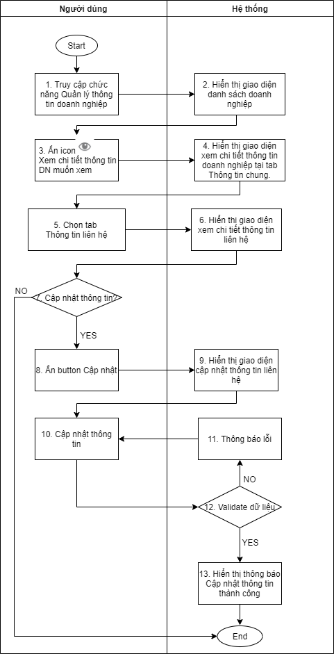

Bước

Mô tả

Bước 1

Truy cập chức năng Quản lý thông tin doanh nghiệp.

Bước 2

Hiển thị giao diện danh sách doanh nghiệp.

Bước 3

Ấn icon  Xem chi tiết thông tin DN muốn xem.

Bước 4

Hiển thị giao diện xem chi tiết thông tin doanh nghiệp. Mặc định mở tab Thông tin chung.

Bước 5

Chọn Tab “Thông tin liên hệ”.

Bước 6

Hiển thị giao diện chi tiết thông tin liên hệ của Doanh nghiệp

Bước 7

Cập nhật thông tin? Nếu có thì chuyển bước 8. Nếu không thì Kết thúc luồng.

Bước 8

Ấn button Cập nhật.

Bước 9

Hiển thị giao diện cập nhật thông tin liên hệ.

Bước 10

Người sử dụng được phép cập nhật các thông tin liên hệ về Phí, riêng đầu mối hành chính sẽ đồng bộ từ hệ thống QLTP (có lưu vết)

Bước 11

Hệ thống tiến hành validate dữ liệu. Nếu thành công thì chuyển tới bước 13, nếu không thì chuyển tới bước 12

Bước 12

Thông báo lỗi: “xxx là trường bắt buộc! – Nếu chưa nhập đủ các trường thông tin. (xxx: tên trường dữ liệu)

Bước 13

Hiển thị thông báo Cập nhật thông tin thành công và quay lại màn xem chi tiết thông tin liên hệ.

Kết thúc luồng.

Giao diện chức năng

Giao diện xem chi tiết

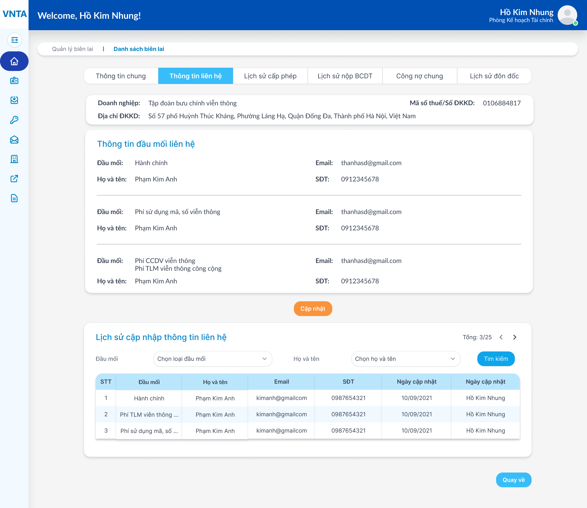

STT

Thông tin

Kiểu dữ liệu

Bắt buộc

Mô tả

Database

1

Doanh nghiệp

Text

Tên DN.

2

Mã số thuế/Số ĐKKD

Text

MST/Số ĐKKD của DN.

3

Địa chỉ ĐKKD

Text

Địa chỉ ĐKKD của DN.

4

Thông tin đầu mối liên hệ

Thông tin đầu mối liên hệ

Thông tin đầu mối liên hệ

Thông tin đầu mối liên hệ

Thông tin đầu mối liên hệ

4.1

Đầu mối Hành chính

4.1.1

Đầu mối

Text

Cập nhật theo hệ thống QLTP.

4.1.2

Email

Text

Cập nhật theo hệ thống QLTP.

4.1.3

Họ và tên

Text

Cập nhật theo hệ thống QLTP.

4.1.4

Số điện thoại

Text

Cập nhật theo hệ thống QLTP.

4.2

Đầu mối Phí

Có bao nhiêu đầu mối phí có bấy nhiêu hộp thoại hiển thị thông tin phí

Ban đầu khi DN và giấy phép, quyết định phân bổ mã, số được đồng bộ từ hệ thống QLTP, chưa có thông tin đầu mối phí => ghi nhận đầu mối các phí DN có theo đầu mối hành chính

4.2.1

Đầu mối

Text

Hiển thị loại phí.

4.2.2

Email

Text

Hiển thị email liên hệ của loại phí tương ứng.

4.2.3

Họ và tên

Text

Hiển thị Họ và tên liên hệ của loại phí tương ứng.

4.2.4

Số điện thoại

Text

Hiển thị Số điện thoại liên hệ của loại phí tương ứng.

5

Cập nhật

Button

Nhấn sẽ hiển thị giao diện Cập nhật thông tin đầu mối liên hệ phí

6

Lịch sử cập nhật thông tin liên hệ

Lịch sử cập nhật thông tin liên hệ

Lịch sử cập nhật thông tin liên hệ

Lịch sử cập nhật thông tin liên hệ

Lịch sử cập nhật thông tin liên hệ

6.1

Đầu mối

Combobox search

Gồm:

Hành chính

Báo cáo doanh thu

Phí CCDV viễn thông

Phí TLM viễn thông công cộng

Phí sử dụng mã, số viễn thông

6.2

Họ và tên

Text

Hiển thị tên đầu mối của BCDT, các loại Phí

6.3

Email

Text

Hiển thị email đầu mối của BCDT, các loại Phí

6.4

SĐT

Text

Hiển thị SĐT đầu mối của BCDT, các loại Phí

6.5

Ngày cập nhật

Text

Hiển thị Ngày cập nhật đầu mối của BCDT, các loại Phí

6.6

Người cập nhật

Text

Hiển thị Người cập nhật đầu mối của BCDT, các loại Phí

8

Số bản ghi trên 1 trang/Tổng số bản ghi

Combobox

Gồm: phân trang 5 bản ghi/trang

Có icon lùi trước sau

9

Quay về

Button

Nhấn -> quay trở về màn danh sách doanh nghiệp đang tìm kiếm trước đó.

Giao diện cập nhật thông tin liên hệ Doanh nghiệp

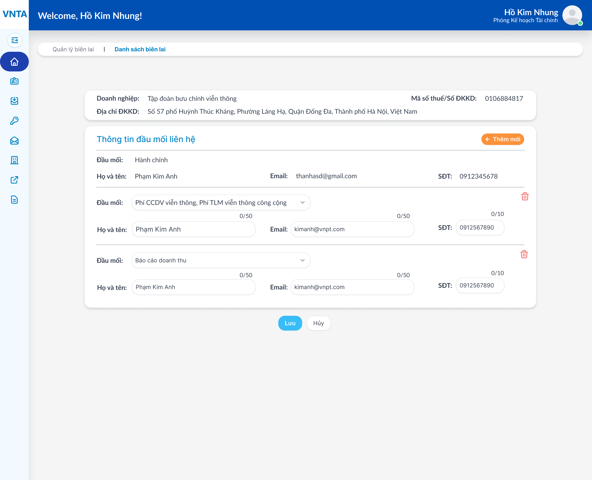

STT

Thông tin

Kiểu dữ liệu

Bắt buộc

Mô tả

Database

1

Doanh nghiệp

Text

Tên DN.

2

Mã số thuế/Số ĐKKD

Text

MST/Số ĐKKD của DN.

3

Địa chỉ ĐKKD

Text

Địa chỉ ĐKKD của DN.

4

Thông tin đầu mối liên hệ

Thông tin đầu mối liên hệ

Thông tin đầu mối liên hệ

Thông tin đầu mối liên hệ

Thông tin đầu mối liên hệ

4.1

Đầu mối Hành chính

4.1.1

Đầu mối

Text

Cập nhật theo hệ thống QLTP.

4.1.2

Email

Text

Cập nhật theo hệ thống QLTP.

4.1.3

Họ và tên

Text

Cập nhật theo hệ thống QLTP.

4.1.4

Số điện thoại

Text

Cập nhật theo hệ thống QLTP.

4.2

Đầu mối Phí

4.2.1

Đầu mối

Combobox

- Gồm:

Báo cáo doanh thu

Phí CCDV viễn thông

Phí TLM viễn thông công cộng

Phí sử dụng mã, số viễn thông

- Được chọn nhiều

4.2.2

Email

Textbox

x

- Cho phép nhập email liên hệ của loại phí tương ứng.

- Maxlenght: 50 ký tự

- Check email tổn tại

Nếu email không tồn tại, thông báo: Email không tồn tại. Vui lòng nhập email khác!

4.2.3

Họ và tên

Textbox

x

- Cho phép nhập họ và tên của loại phí tương ứng.

- Maxlenght: 50 ký tự

4.2.4

Số điện thoại

Textbox

X

- Cho phép nhập họ và tên của loại phí tương ứng.

- 10 ký tự

Nếu SĐT không đủ 10 số, thông báo: Số điện thoại không hợp lệ!

4.2.5

Thêm mới

Button

Nhấn để thêm mới thông tin đầu mối liên hệ

4.2.6

Xóa

Icon

Nhấn để xóa hộp thông tin liên hệ tương ứng

5

Lưu

Button

Nhấn hệ thống Lưu đồng thời quay về màn chi tiết thông tin liên hệ của DN

6

Hủy

Button

Nhấn hệ thống hủy bỏ Lưu đồng thời quay về màn chi tiết thông tin liên hệ của DN

Xem chi tiết thông tin lịch sử cấp phép của Doanh nghiệp

Luồng chức năng

Thông tin chung

Tên chức năng

Xem chi tiết thông tin lịch sử cấp phép của DN

Mô tả

Chức năng cho phép xem chi tiết thông tin lịch sử cấp phép của Doanh nghiệp.

Tác nhân

Lãnh đạo, Cán bộ Phòng KHTC.

Điều kiện trước

Đăng nhập vào hệ thống, có phân quyền chức năng.

Điều kiện sau

Xem thông tin thành công.

Ngoại lệ

N/A

Các yêu cầu đặc biệt

N/A

Luồng chức năng

Mô tả luồng xử lý

Bước

Mô tả

Bước 1

Truy cập chức năng Quản lý thông tin doanh nghiệp.

Bước 2

Hiển thị giao diện danh sách doanh nghiệp.

Bước 3

Ấn icon  Xem chi tiết thông tin DN muốn xem.

Bước 4

Hiển thị giao diện xem chi tiết thông tin doanh nghiệp. Mặc định mở tab Thông tin chung.

Bước 5

Chọn Tab “Lịch sử cấp phép”.

Bước 6

Hiển thị giao diện chi tiết thông tin lịch sử cấp phép của Doanh nghiệp.

Kết thúc luồng.

Giao diện chức năng

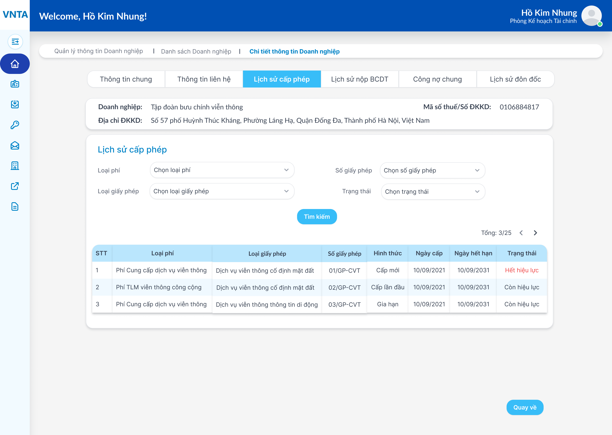

STT

Thông tin

Kiểu dữ liệu

Bắt buộc

Mô tả

Database

1

Doanh nghiệp

Text

Tên DN.

2

Mã số thuế/Số ĐKKD

Text

MST/Số ĐKKD của DN.

3

Địa chỉ ĐKKD

Text

Địa chỉ ĐKKD của DN.

4

Lịch sử cấp phép

Lịch sử cấp phép

Lịch sử cấp phép

Lịch sử cấp phép

Lịch sử cấp phép

4.1

Tìm kiếm

4.1.1

Loại phí

Combobox search

- Gồm:

+ Phí CCDV viễn thông

+ Phí TLM viễn thông công cộng

+ Phí TLM viễn thông dùng riêng

+ Phí Thử nghiệm mạng và dịch vụ viễn thông

+ Phí lắp đặt cáp viễn thông trên biển

- Không chọn mặc định chọn tất cả

- Autocomplete

4.1.2

Số giấy phép

Combobox search

Gồm tất cả giấy phép DN được cấp đồng bộ từ hệ thống QLVT

4.1.3

Loại giấy phép

Combobox search

- Mặc định ko chọn là Chọn tất cả

- Cho phép NSD tìm kiếm theo tên loại giấy phép:

+ Cố định mặt đất

+ Di động mặt đất

+ Cố định vệ tinh

+ Di động vệ tinh

+ Di động hàng hải

+ Di  động hàng không

4.1.4

Trạng thái

Combobox

- Mặc định ko chọn là Chọn tất cả

- Gồm:

Cấp lần đầu

Cấp mới

Cấp lại

Gia hạn

Sửa đổi, bổ sung

4.1.5

Tìm kiếm

Button

Nhấn hệ thống hiển thị kết quả tìm kiếm

4.2

Danh sách

4.2.1

STT

Text

Tự sinh, tăng dần

4.2.2

Loại phí

Text

Hiển thị loại phí theo giấy phép được câp. Cập nhật theo hệ thống QLTP.

4.2.3

Loại giấy phép

Text

Hiển thị loại giấy phép theo giấy phép được cấp. Cập nhật theo hệ thống QLTP.

4.2.4

Số giấy phép

Text

Hiển thị theo số giấy phép được cấp. Cập nhật theo hệ thống QLTP.

4.2.5

Hình thức

Text

Hiển thị theo số giấy phép được cấp. Cập nhật theo hệ thống QLTP.

4.2.6

Ngày cấp

Text

Hiển thị theo số giấy phép được cấp. Cập nhật theo hệ thống QLTP.

4.2.7

Ngày hết hạn

Text

Hiển thị theo số giấy phép được cấp. Cập nhật theo hệ thống QLTP.

4.2.8

Trạng thái

Text

Hiển thị theo số giấy phép được cấp. Cập nhật theo hệ thống QLTP.

4.2.9

Số bản ghi trên 1 trang/Tổng số bản ghi

Combobox

Gồm: phân trang 5 bản ghi/trang

Có icon lùi trước sau

5

Quay về

Button

Nhấn -> quay trở về màn danh sách doanh nghiệp đang tìm kiếm trước đó.

Xem chi tiết thông tin nộp BCDT

Luồng chức năng

Thông tin chung

Tên chức năng

Xem chi tiết thông tin lịch sử nộp BCDT của DN

Mô tả

Chức năng cho phép xem chi tiết thông tin lịch sử nộp BCDT của Doanh nghiệp.

Tác nhân

Lãnh đạo, Cán bộ Phòng KHTC.

Điều kiện trước

Đăng nhập vào hệ thống, có phân quyền chức năng.

Điều kiện sau

Xem thông tin thành công.

Ngoại lệ

N/A

Các yêu cầu đặc biệt

N/A

Luồng chức năng

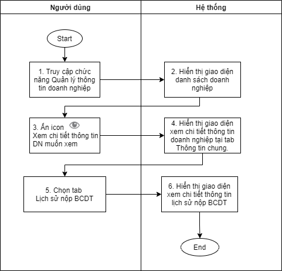

Mô tả luồng xử lý

Bước

Mô tả

Bước 1

Truy cập chức năng Quản lý thông tin doanh nghiệp.

Bước 2

Hiển thị giao diện danh sách doanh nghiệp.

Bước 3

Ấn icon  Xem chi tiết thông tin DN muốn xem.

Bước 4

Hiển thị giao diện xem chi tiết thông tin doanh nghiệp. Mặc định mở tab Thông tin chung.

Bước 5

Chọn Tab “Lịch sử nộp BCDT”.

Bước 6

Hiển thị giao diện chi tiết thông tin lịch sử nộp BCDT của Doanh nghiệp.

Kết thúc luồng.

Giao diện chức năng

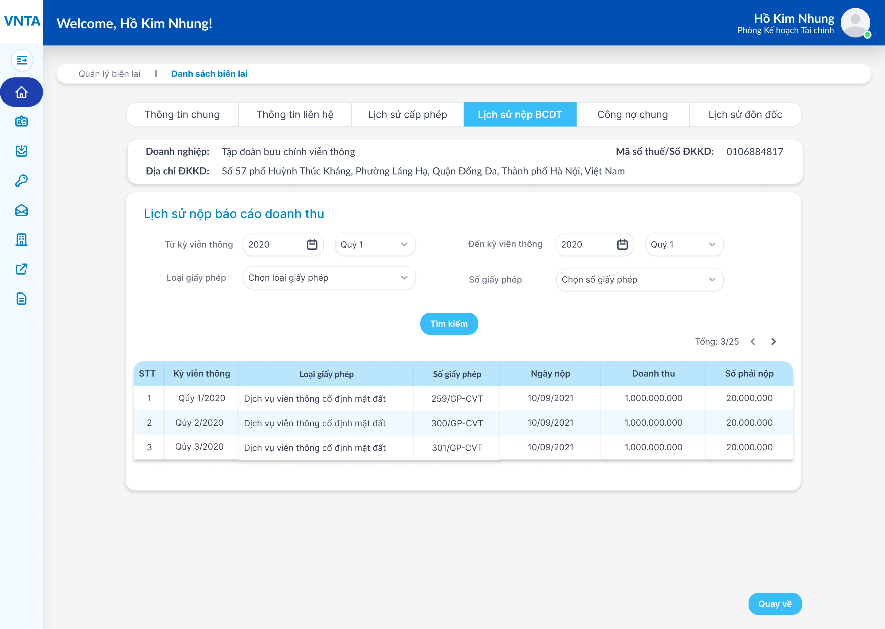

STT

Thông tin

Kiểu dữ liệu

Bắt buộc

Mô tả

Database

1

Doanh nghiệp

Text

Tên DN.

2

Mã số thuế/Số ĐKKD

Text

MST/Số ĐKKD của DN.

3

Địa chỉ ĐKKD

Text

Địa chỉ ĐKKD của DN.

4

Lịch sử nộp BCDT

Lịch sử nộp BCDT

Lịch sử nộp BCDT

Lịch sử nộp BCDT

Lịch sử nộp BCDT

4.1

Tìm kiếm

4.1.1

Từ kỳ viễn thông

Combobox search

- Gồm:

+ Qúy/ Năm

+ Mặc định là Qúy 1/ năm hiện tại

Chọn từ Năm X -> Năm Y: hiển thị BCDT Theo Năm từ năm X đến năm Y

Chọn từ Q1/X -> Q4/Y: hiển thị BCDT Theo Quý từ Q1/X đến Q4/Y (bỏ qua Năm)

Chọn từ Q1/X -> Năm Y: hiển thị BCDT Theo Quý từ Q1/X đến Q4/Y + BCDT Theo Năm từ năm X đến năm Y.

Chọn từ Năm X -> Q4/Y: hiển thị BCDT Theo Quý từ năm sau năm X đến Q4/Y + BCDT Theo Năm từ năm X đến trước năm Y

4.1.2

Đến kỳ viễn thông

Combobox search

- Gồm:

+ Qúy/ Năm

+ Mặc định là Qúy 4/ năm hiện tại

Chọn từ Năm X -> Năm Y: hiển thị BCDT Theo Năm từ năm X đến năm Y

Chọn từ Q1/X -> Q4/Y: hiển thị BCDT Theo Quý từ Q1/X đến Q4/Y (bỏ qua Năm)

Chọn từ Q1/X -> Năm Y: hiển thị BCDT Theo Quý từ Q1/X đến Q4/Y + BCDT Theo Năm từ năm X đến năm Y.

Chọn từ Năm X -> Q4/Y: hiển thị BCDT Theo Quý từ năm sau năm X đến Q4/Y + BCDT Theo Năm từ năm X đến trước năm Y

4.1.3

Loại giấy phép

Combobox search

- Mặc định ko chọn là Chọn tất cả

- Cho phép NSD tìm kiếm theo tên loại giấy phép:

+ Cố định mặt đất

+ Di động mặt đất

+ Cố định vệ tinh

+ Di động vệ tinh

+ Di động hàng hải

+ Di động hàng không

4.1.4

Số giấy phép

Combobox

- Mặc định ko chọn là Chọn tất cả

- Gồm tất cả các giấy phép DN đã được cấp

4.1.5

Tìm kiếm

Button

Nhấn hệ thống hiển thị kết quả tìm kiếm

4.2

Danh sách giấy phép

Danh sách giấy phép

Danh sách giấy phép

Danh sách giấy phép

Danh sách giấy phép

4.2.1

STT

Text

Tự sinh tăng dần

4.2.2

Kỳ viễn thông

Text

Hiển thị Kỳ viễn thông theo tiêu chí tìm kiếm

4.2.3

Loại giấy phép

Text

Hiển thị các loại giấy phép theo Kỳ viễn thông tìm kiếm. Trường hợp trong kỳ có nhiều loại giấy phép, các loại giấy phép sẽ lần lượt được xuống dòng

4.2.4

Số giấy phép

Text

Hiển thị số giấy phép phải nộp phí trong Kỳ theo Loại giấy phép. Trường hợp trong Loại giấy phép có >01 gp cần phải nộp phí sẽ được ngăn cách bởi dấu “;”

4.2.5

Ngày nộp

Date

Hiển thị ngày nộp báo cáo doanh thu

Sắp xếp tăng dần theo Ngày nộp BCDT

4.2.6

Doanh thu

Text

Hiển thị các Doanh thu theo Loại giấy phép. Trường hợp trong kỳ có nhiều Loại giấy phép, Doanh thu các loại giấy phép sẽ lần lượt được xuống dòng

4.2.7

Số phải nộp

Text

Hiển thị Số phải nộp

Qúy:

--	- Chưa có BCDT => hiển thị dấu “-”

--	- Có BCDT => Số phải nộp = BCDT*0.5%

--	Năm:

--	- Chưa có BCDT năm => max (mức tối thiểu năm so với tổng BCDT Qúy*0.5%)

--	- Có BCDT năm => max (mức tối thiểu năm so với BCDT Năm*0.5%)

5

Phân trang

Phân trang

Phân trang

Phân trang

Phân trang

5.1

Tổng số bản ghi

Text

Hiển thị tổng số bản ghi theo điều kiện tìm kiếm

5.2

Phân trang

Button

Gồm các button: Về trang trước đó, 1, 2, 3, 4, 5 (nếu ít trang hơn sẽ tự cắt bớt), trang sau đó

5.3

Số bản ghi trên 1 trang

Combobox

Gồm:

10/trang

20/trang

50/trang

100/trang

Mặc định 10 bản ghi trên 1 trang

5.4

Đến trang

Text

- Nhập số trang => hệ thống nhảy đến dữ liệu trang tương ứng

6

Quay về

Button

Nhấn -> quay trở về màn danh sách doanh nghiệp đang tìm kiếm trước đó.

Xem chi tiết Công nợ chung của Doanh nghiệp

Luồng chức năng

Thông tin chung

Tên chức năng

Xem chi tiết thông tin Công nợ chung của DN

Mô tả

Chức năng cho phép xem chi tiết thông tin Công nợ chung của Doanh nghiệp.

Tác nhân

Lãnh đạo, Cán bộ Phòng KHTC.

Điều kiện trước

Đăng nhập vào hệ thống, có phân quyền chức năng.

Điều kiện sau

Xem thông tin thành công.

Ngoại lệ

N/A

Các yêu cầu đặc biệt

N/A

Luồng chức năng

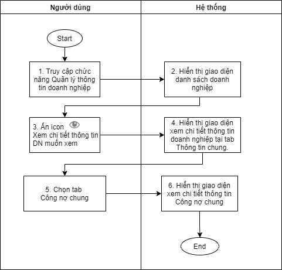

Mô tả luồng xử lý

Bước

Mô tả

Bước 1

Truy cập chức năng Quản lý thông tin doanh nghiệp.

Bước 2

Hiển thị giao diện danh sách doanh nghiệp.

Bước 3

Ấn icon  Xem chi tiết thông tin DN muốn xem.

Bước 4

Hiển thị giao diện xem chi tiết thông tin doanh nghiệp. Mặc định mở tab Thông tin chung.

Bước 5

Chọn Tab “Công nợ chung”.

Bước 6

Hiển thị giao diện chi tiết thông tin Công nợ chung của Doanh nghiệp.

Kết thúc luồng.

Giao diện chức năng

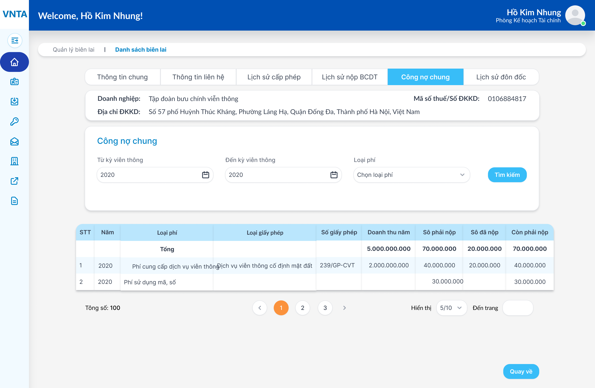

STT

Thông tin

Kiểu dữ liệu

Bắt buộc

Mô tả

Database

1

Doanh nghiệp

Text

Tên DN.

2

Mã số thuế/Số ĐKKD

Text

MST/Số ĐKKD của DN.

3

Địa chỉ ĐKKD

Text

Địa chỉ ĐKKD của DN.

4

Công nợ chung

Công nợ chung

Công nợ chung

Công nợ chung

Công nợ chung

4.1

Tìm kiếm

4.1.1

Kỳ viễn thông

Datepicker

x

- Từ năm – Đến năm

- Mặc định là năm hiện tại

4.1.2

Loại phí

Combobox search

- Gồm:

Phí CCDV viễn thông

Phí TLM viễn thông công cộng

Phí sử dụng mã, số viễn thông

- Mặc định không chọn là chọn tất cả

4.1.5

Tìm kiếm

Button

Nhấn hệ thống hiển thị kết quả tìm kiếm

4.2

Danh sách

4.2.1

STT

Text

Tự sinh, tăng dần

4.2.2

Dòng Tổng

Number

Cộng tổng cột Doanh thu năm, Số phải nộp, Số đã nộp, Còn phải nộp theo điều kiện tìm kiếm

4.2.2

Năm

Date

Hiển thị Năm tìm kiếm

4.2.3

Loại phí

Text

Hiển thị loại phí được tìm kiếm

4.2.3

Loại giấy phép

Text

Hiển thị loại giấy phép phải nộp phí trong Kỳ, trường hợp có nhiều loại giấy phép sẽ lần lượt xuống dòng

4.2.4

Số giấy phép

Text

Hiển thị số giấy phép DN phải nộp phí trong Kỳ tương ứng với loại giấy phép, nếu có >01 gp của 1 loại giấy phép sẽ ngăn cách nhau bởi dấu “;”

4.2.5

Doanh thu

Text

Hiển thị Doanh thu năm của Phí CCDV

- Nếu chưa có BCDT năm => cộng dồn BCDT Qúy

- Nếu chưa có BCDT Qúy => hiển thị dấu “-”

4.2.6

Số phải nộp

Text

Hiển thị số phải nộp của năm

Đối với Phí kho số sẽ cộng dồn Số phải nộp của 4 quý

4.2.7

Số đã nộp

Text

Hiển thị số đã nộp cho kỳ viễn thông

4.2.8

Còn phải nộp

Text

Số phải nộp – Số đã nộp

5

Phân trang

Phân trang

Phân trang

Phân trang

Phân trang

5.1

Tổng số bản ghi

Text

Hiển thị tổng số bản ghi theo điều kiện tìm kiếm

5.2

Phân trang

button

Gồm các button: Về trang trước đó, 1, 2, 3, 4, 5 (nếu ít trang hơn sẽ tự cắt bớt), trang sau đó

5.3

Số bản ghi trên 1 trang

combobox

Gồm:

10/trang

20/trang

50/trang

100/trang

Mặc định 10 bản ghi trên 1 trang

5.4

Đến trang

Text

- Nhập số trang => hệ thống nhảy đến dữ liệu trang tương ứng

6

Quay về

button

Nhấn -> quay trở về màn danh sách doanh nghiệp đang tìm kiếm trước đó.

Xem chi tiết/Cập nhật thông tin lịch sử đôn đốc của Doanh nghiệp

Luồng chức năng

Thông tin chung

Tên chức năng

Xem chi tiết/cập nhật thông tin lịch sử đôn đốc của DN

Mô tả

Chức năng cho phép xem chi tiết/cập nhật thông tin lịch sử đôn đốc của Doanh nghiệp.

Tác nhân

Lãnh đạo, Cán bộ Phòng KHTC.

Điều kiện trước

Đăng nhập vào hệ thống, có phân quyền chức năng.

Điều kiện sau

Xem/cập nhật thông tin thành công.

Ngoại lệ

N/A

Các yêu cầu đặc biệt

N/A

Luồng chức năng

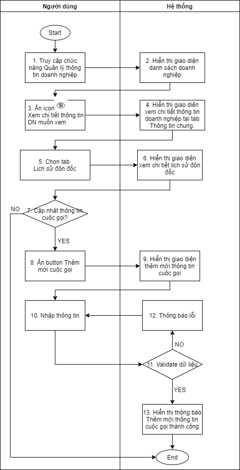

Mô tả luồng xử lý

Bước

Mô tả

Bước 1

Truy cập chức năng Quản lý thông tin doanh nghiệp.

Bước 2

Hiển thị giao diện danh sách doanh nghiệp.

Bước 3

Ấn icon  Xem chi tiết thông tin DN muốn xem.

Bước 4

Hiển thị giao diện xem chi tiết thông tin doanh nghiệp. Mặc định mở tab Thông tin chung.

Bước 5

Chọn Tab “Lịch sử đôn đốc”.

Bước 6

Hiển thị giao diện chi tiết lịch sử đôn đốc của Doanh nghiệp

Bước 7

Thêm mới thông tin cuộc gọi? Nếu có thì chuyển bước 8. Nếu không thì Kết thúc luồng.

Bước 8

Ấn button Thêm mới cuộc gọi.

Bước 9

Hiển thị giao diện Thêm mới thông tin cuộc gọi.

Bước 10

Người sử dụng nhập thông tin cuộc gọi.

Bước 11

Hệ thống tiến hành validate dữ liệu. Nếu thành công thì chuyển tới bước 13, nếu không thì chuyển tới bước 12

Bước 12

Thông báo lỗi: “xxx là trường bắt buộc! – Nếu chưa nhập đủ các trường thông tin. (xxx: tên trường dữ liệu)

Bước 13

Hiển thị thông báo Cập nhật thông tin thành công và quay lại màn xem chi tiết Lịch sử đôn đốc.

Kết thúc luồng.

Giao diện chức năng

Giao diện vào chức năng

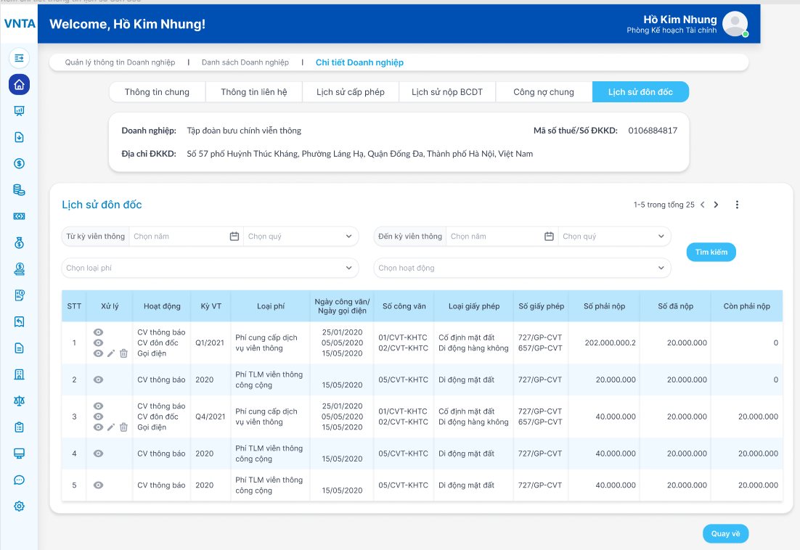

STT

Thông tin

Kiểu dữ liệu

Bắt buộc

Mô tả

Database

1

Doanh nghiệp

Text

Tên DN.

2

Mã số thuế/Số ĐKKD

Text

MST/Số ĐKKD của DN.

3

Địa chỉ ĐKKD

Text

Địa chỉ ĐKKD của DN.

4

Lịch sử đôn đốc

Lịch sử đôn đốc

Lịch sử đôn đốc

Lịch sử đôn đốc

Lịch sử đôn đốc

4.1

Tìm kiếm

4.1.1

Kỳ viễn thông

a

Năm

Datepicker

x

- Từ năm – Đến năm

- Mặc định là năm hiện tại

b

Qúy

Combobox

- Gồm 04 quý

- Mặc định là quý hiện tại

Phí kho số, Phí TLM: tìm kiếm theo năm

4.1.2

Loại phí

Combobox search

- Gồm:

Phí CCDV viễn thông

Phí TLM viễn thông công cộng

Phí sử dụng mã, số viễn thông

- Mặc định không chọn là chọn tất cả

- Được chọn 1 hoặc nhiều

4.1.5

Hoạt động

Combobox search

- Gồm:

+ Công văn thông báo

+ Công văn đôn đốc

+ Gọi điện

4.1.6

Tìm kiếm

Button

Nhấn hệ thống hiển thị kết quả tìm kiếm

4.1.7

Xuất excel

Button

Nhấn xuất excel theo tiêu chí tìm kiếm

- Tên file: [Ngày xuất_Lịch sử đôn đốc_[Tên DN]

4.1.8

Thêm cuộc gọi

Button

Nhấn hệ thống mở popup Thêm cuộc gọi

4.2

Danh sách

Danh sách

Danh sách

Danh sách

Danh sách

4.2.1

STT

Text

Tự sinh, tăng dần

4.2.2

Xử lý

Icon

- Icon Xem chi tiết.

Đối với công văn thông báo/đôn đốc, link tới màn Xem chi tiết thông tin công văn.

Đối với Cuộc gọi thì hiển thị popup Xem chi tiết thông tin cuộc gọi.

- Icon Chỉnh sửa (chỉ có đối với bản ghi gọi điện).

- Icon Xóa (chỉ có đối với bản ghi gọi điện).

4.2.3

Kỳ viễn thông

Date

Hiển thị Năm, Qúy/Năm tìm kiếm

4.2.4

Loại phí

Text

Hiển thị loại phí được tìm kiếm

4.2.5

Hoạt động

Text

- Gồm:

Cv thông báo

Cv đôn đốc

Gọi điện

- Kỳ của loại phí có hoạt động nào sẽ hiển thị hoạt đông đó

- Cv đôn đốc tại thời điểm tính đến ngày => những Kỳ trước đó đến Kỳ đôn đốc (Kỳ chứa ngày “Tính đến ngày”) còn nợ sẽ hiển thị công văn đôn đốc)

- Trường hợp có nhiều cv đôn đốc sẽ sắp xếp hiển thị giảm dần theo Ngày công văn

- Trường hợp có nhiều gọi điện sẽ sắp xếp giảm dần theo Ngày gọi điện

4.2.6

Ngày công văn/ Ngày gọi điện

Date

Hiển thị Ngày công văn/ Ngày gọi điện tương ứng với Công văn, Cuộc gọi

4.2.7

Số công văn

Text

Hiển thị số công văn thông báo, cv đôn đốc

4.2.8

Loại giấy phép

Text

Hiển thị tất cả loại giấy phép phải nộp phí trong Kỳ, trường hợp có nhiều loại giấy phép sẽ lần lượt xuống dòng

4.2.9

Số giấy phép

Text

Hiển thị tất cả số giấy phép DN phải nộp phí trong Kỳ tương ứng với từng loại giấy phép, nếu có >01 gp của 1 loại giấy phép sẽ ngăn cách nhau bởi dấu “;”

4.2.10

Số phải nộp

Number

Hiển thị số phải nộp.

Đối với phí TLM, phí kho số, nếu chưa cập nhật mức thu trong module “Cấu hình mức thu phí” thì hiển thị dấu “-”.

Đối với Phí CCDV:

Qúy:

--	- Chưa có BCDT => hiển thị dấu “-”

--	- Có BCDT => Số phải nộp = BCDT*0.5%

--	Năm:

--	- Chưa có BCDT năm => max (mức tối thiểu năm so với tổng BCDT Qúy*0.5%)

- Có BCDT năm => max (mức tối thiểu năm so với BCDT Năm*0.5%)

Đối với Phí kho số sẽ cộng dồn Số phải nộp của 4 quý

4.2.11

Số đã nộp

Number

Hiển thị số đã nộp cho kỳ viễn thông (riêng đối với Phí CCDV hiển thị theo từng loại giấy phép).

Chưa nộp thì hiển thị “0”.

4.2.12

Còn phải nộp

Number

Số phải nộp – Số đã nộp

5

Phân trang

Phân trang

Phân trang

Phân trang

Phân trang

5.1

Tổng số bản ghi

Text

Hiển thị tổng số bản ghi theo điều kiện tìm kiếm

5.2

Phân trang

Button

Gồm các button: Về trang trước đó, 1, 2, 3, 4, 5 (nếu ít trang hơn sẽ tự cắt bớt), trang sau đó

5.3

Số bản ghi trên 1 trang

Combobox

Gồm:

10/trang

20/trang

50/trang

100/trang

Mặc định 10 bản ghi trên 1 trang

5.4

Đến trang

Text

- Nhập số trang => hệ thống nhảy đến dữ liệu trang tương ứng

6

Quay về

Button

Nhấn -> quay trở về màn danh sách doanh nghiệp đang tìm kiếm trước đó.

Popup Xem chi tiết cuộc gọi

STT

Thông tin

Kiểu dữ liệu

Bắt buộc

Mô tả

Database

1

Popup chi tiết thông tin cuộc gọi

Popup chi tiết thông tin cuộc gọi

Popup chi tiết thông tin cuộc gọi

Popup chi tiết thông tin cuộc gọi

Popup chi tiết thông tin cuộc gọi

1.1

Ngày gọi

Date

--	- Hiển thị Ngày gọi

1.2

Loại phí

Text

- Hiển thị Loại phí đã gọi điện đôn đốc, nếu có >01 loại phí sẽ hiển thị lần lượt xuống dòng

1.3

Người gọi

Text

Hiển thị Họ tên người gọi

1.4

Đến đầu mối

Text

Hiển thị Họ tên đầu mối

1.5

Nội dung cuộc gọi

Text

Hiển thị nội dung cuộc gọi

Popup Thêm mới/chỉnh sửa cuộc gọi

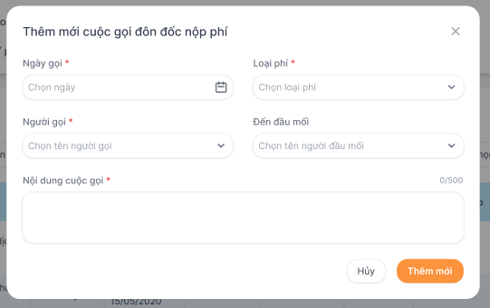

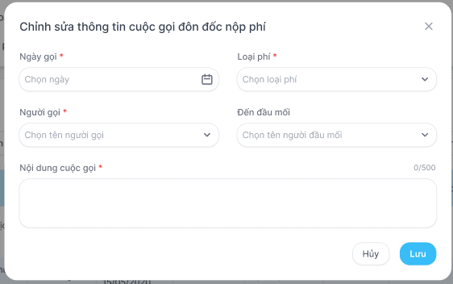

STT

Thông tin

Kiểu dữ liệu

Bắt buộc

Mô tả

Database

1

Popup thêm mới/chỉnh sửa thông tin cuộc gọi

- Khi thêm mới cuộc gọi thành công, hệ thống check Loại phí và Ngày gọi: Ngày gọi thuộc Kỳ nào sẽ auto tính từ kỳ đó trở về trước tất cả các Kỳ DN nợ phí (theo Loại phí đã chọn) sẽ có hoạt động Gọi điện tương ứng

- Khi chỉnh sửa nội dung cuộc gọi đồng thời sẽ update tất cả các cuộc gọi liên quan

Popup thêm mới/chỉnh sửa thông tin cuộc gọi

- Khi thêm mới cuộc gọi thành công, hệ thống check Loại phí và Ngày gọi: Ngày gọi thuộc Kỳ nào sẽ auto tính từ kỳ đó trở về trước tất cả các Kỳ DN nợ phí (theo Loại phí đã chọn) sẽ có hoạt động Gọi điện tương ứng

- Khi chỉnh sửa nội dung cuộc gọi đồng thời sẽ update tất cả các cuộc gọi liên quan

Popup thêm mới/chỉnh sửa thông tin cuộc gọi

- Khi thêm mới cuộc gọi thành công, hệ thống check Loại phí và Ngày gọi: Ngày gọi thuộc Kỳ nào sẽ auto tính từ kỳ đó trở về trước tất cả các Kỳ DN nợ phí (theo Loại phí đã chọn) sẽ có hoạt động Gọi điện tương ứng

- Khi chỉnh sửa nội dung cuộc gọi đồng thời sẽ update tất cả các cuộc gọi liên quan

Popup thêm mới/chỉnh sửa thông tin cuộc gọi

- Khi thêm mới cuộc gọi thành công, hệ thống check Loại phí và Ngày gọi: Ngày gọi thuộc Kỳ nào sẽ auto tính từ kỳ đó trở về trước tất cả các Kỳ DN nợ phí (theo Loại phí đã chọn) sẽ có hoạt động Gọi điện tương ứng

- Khi chỉnh sửa nội dung cuộc gọi đồng thời sẽ update tất cả các cuộc gọi liên quan

Popup thêm mới/chỉnh sửa thông tin cuộc gọi

- Khi thêm mới cuộc gọi thành công, hệ thống check Loại phí và Ngày gọi: Ngày gọi thuộc Kỳ nào sẽ auto tính từ kỳ đó trở về trước tất cả các Kỳ DN nợ phí (theo Loại phí đã chọn) sẽ có hoạt động Gọi điện tương ứng

- Khi chỉnh sửa nội dung cuộc gọi đồng thời sẽ update tất cả các cuộc gọi liên quan

1.1

Ngày gọi

Datepicker

x

--	- Mặc định Ngày hiện tại

--	- Cho chọn/nhập ngày

1.2

Loại phí

Combobox

x

Gồm:

Phí sử dụng mã, số viễn thông

Phí CCDV viễn thông

Phí TLM viễn thông công cộng

Được chọn 1 hoặc nhiều

1.3

Người gọi

Combobox search

x

Gồm họ tên tất cả các tài khoản được phân quyền chức năng Quản lý thông tin DN

Autocomplete

1.4

Đến đầu mối

Combobox

Hiển thị tất cả tên các đầu mối của DN (gồm đầu mối hành chính và đầu mối phí, tính cả lưu vết)

1.5

Nội dung cuộc gọi

Textbox

x

Nhập nội dung cuộc gọi

Maxlenght: 500 ký tự

Quản lý thu phí Thiết lập mạng viễn thông công cộng

Xem danh sách Theo dõi thu phí TLM viễn thông công cộng

Luồng chức năng

Thông tin chung

Tên chức năng

Xem danh sách Theo dõi thu phí Thiết lập mạng (TLM) viễn thông công cộng.

Mô tả

Chức năng cho phép xem thông tin danh sách theo dõi thu phí TLM viễn thông công cộng của các doanh nghiệp trong từng kỳ báo cáo.

Tác nhân

Lãnh đạo, Cán bộ Phòng KHTC

Điều kiện trước

Đăng nhập vào hệ thống, có phân quyền chức năng

Điều kiện sau

Xem, tìm kiếm được danh sách Theo dõi thu phí TLM viễn thông công cộng

Ngoại lệ

N/A

Các yêu cầu đặc biệt

N/A

Luồng chức năng

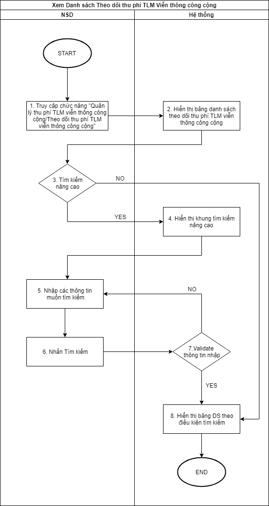

Bước

Mô tả

Bước 1

NSD truy cập chức năng “Quản lý thu phí TLM viễn thông công cộng/ Theo dõi thu phí TLM viễn thông công cộng”.

Bước 2

Hệ thống hiển thị giao diện danh sách giấy phép của DN phải nộp phí TLM viễn thông công cộng do CVT cấp với năm hiện tại, và hiển thị giấy phép của các DN có số dư nợ đầu kỳ ≠ 0.

Đối với DN được cấp phép năm đầu:

- Ngày cấp phép < 02/12/năm:

+ Có trong danh sách DN phải nộp phí năm DN được cấp phép

- 02/12/năm < Ngày cấp phép < 31/12/năm:

+ Không có trong danh sách DN phải nộp phí năm DN được cấp phép

Bước 3

NSD nhấn icon [Hiển thị bộ lọc] => tiến hành tìm kiếm các thông tin.

- Nếu có, chuyển bước 4

- Nếu không, chuyển bước 8

Bước 4

Hệ thống hiển thị khung tìm kiếm.

Bước 5

NSD nhập các thông tin tìm kiếm tại các trường dữ liệu tương ứng.

Bước 6

Nhấn [Tìm kiếm].

Bước 7

Hệ thống kiểm tra tính hợp lệ thông tin nhập:

- Nếu hợp lệ, chuyển bước 8

- Nếu không hợp lệ, hệ thống đưa ra thông báo tại các trường nhập không hợp lệ. Quay lại bước 5.

Bước 8

Hệ thống hiển thị danh sách thông tin giấy phép theo điều kiện tìm kiếm.

Kết thúc luồng.

Giao diện chức năng

Giao diện tìm kiếm cơ bản

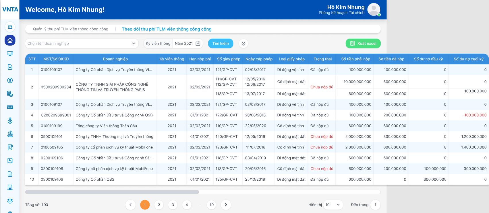

Giao diện tìm kiếm nâng cao

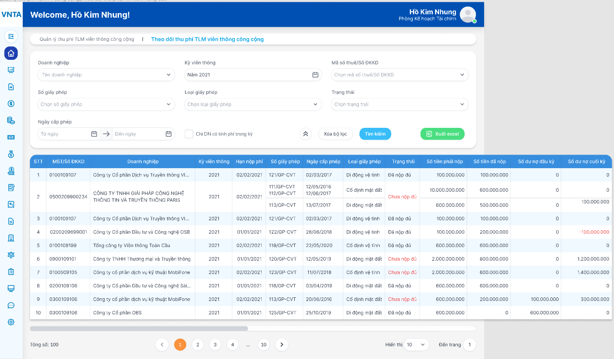

STT

Thông tin

Kiểu dữ liệu

Bắt buộc

Mô tả

Database

1

Tra cứu rút gọn

Tra cứu rút gọn

Tra cứu rút gọn

Tra cứu rút gọn

Tra cứu rút gọn

1.1

Tên doanh nghiệp

combobox search

- Chứa all DN có giấy phép TLM viễn thông công cộng do CVT cấp.

- Mặc định ko chọn là Chọn tất cả

- Cho phép người dùng nhập tên DN

- Autocomplete gõ nhập tên doanh nghiệp hệ thống tự động gợi ý

- Sắp xếp các option theo thứ tự Mã định danh tăng dần (quy định ngầm trong hệ thống khi thêm mới DN)

-  Cho phép chọn 1 hoặc nhiều DN.

1.2

Kỳ viễn thông

datepicker

x

- Mặc định hiển thị năm hiện tại.

- Cho phép người dùng chọn năm.

1.3

Tìm kiếm

button

Tìm kiếm theo các trường thông tin Chọn tên DN, năm. Hệ thống hiển thị bảng danh sách bên dưới.

1.4

Icon Tìm kiếm nâng cao

Button

- Nhấn hệ thống xổ xuống các tiêu chí Tìm kiếm nâng cao

- Ngược lại khi hiển thị các tiêu chí nâng cao, nhấn icon sẽ thu gọn lại

1.5

Xuất excel

Button

File gồm các cột giống trên giao diện (trừ cột xử lý), tiêu đề của sheet là Theo dõi thu phí TLM viễn thông công cộng, tên file: [Ngày xuất]_ Theo dõi thu phí TLM viễn thông công cộng.

2

Tìm kiếm nâng cao

Tìm kiếm nâng cao

Tìm kiếm nâng cao

Tìm kiếm nâng cao

Tìm kiếm nâng cao

2.1

Doanh nghiệp

combobox search

- Chứa all DN có giấy phép TLM viễn thông công cộng do CVT cấp.

- Mặc định ko chọn là Chọn tất cả

- Cho phép người dùng nhập tên DN

- Autocomplete gõ nhập tên doanh nghiệp hệ thống tự động gợi ý

- Sắp xếp các option theo thứ tự Mã định danh tăng dần (quy định ngầm trong hệ thống khi thêm mới DN)

-  Cho phép chọn 1 hoặc nhiều DN.

2.2

Số giấy phép

combobox search

- Gồm tất cả giấy phép TLM viễn thông công cộng do Cục VT cấp phép

- Mặc định ko chọn là Chọn tất cả

- Cho phép nhập số GP

- Autocomplete

-  Cho phép chọn 1 hoặc nhiều số GP.

2.3

Ngày cấp phép

datepicker

- Cho phép người dùng chọn hoặc nhập ngày cấp phép.

2.4

 Mã số thuế/Số ĐKKD

combobox search

- Chứa all Mã số thuế/Số ĐKKD của DN có giấy phép TLM viễn thông công cộng.

- Mặc định ko chọn là Chọn tất cả

- Cho phép nhập Mã số thuế/ Số ĐKKD

- Autocomplete

-  Cho phép chọn 1 hoặc nhiều

Mã số thuế/ Số ĐKKD

2.5

Loại giấy phép

combobox

- Mặc định không chọn là Chọn tất cả

- Cho phép NSD chọn 1 hoặc nhiều loại giấy phép sau:

+ Cố định mặt đất

+ Di động mặt đất

+ Cố định vệ tinh

+ Di động vệ tinh

+ Di động hàng hải

+ Di động hàng không

2.6

Trạng thái

Combobox

- Gồm: Đã nộp đủ/Chưa nộp đủ

- Mặc định ko chọn là chọn tất cả

2.7

Kỳ viễn thông

datepicker

x

- Cho phép người dùng chọn hoặc nhập năm của kỳ viễn thông.

-  Mặc định là năm hiện tại

2.8

Chỉ DN có tính phí trong kỳ

Checkbox

Nếu tích chọn thì hiển thị chỉ các DN phải nộp phí trong kỳ đang chọn và theo các tiêu chí tìm kiếm khác. (Khi tích chọn, các DN ko phải nộp phí trong kỳ nhưng có số dư nợ đầu kỳ sẽ không hiển thị ra).

2.9

Xóa điều kiện

Button

Nhấn [Xóa điều kiện], hệ thống xóa toàn bộ dữ liệu tiêu chí tìm kiếm đã nhập, giữ nguyên kết quả tìm kiếm

2.10

Tìm kiếm

Button

Nhấn [Tìm kiếm], hệ thống check hợp lệ của điều kiện tìm kiếm và trả danh sách kết quả.

2.11

Xuất excel

button

File gồm các cột giống trên giao diện (trừ cột xử lý), tiêu đề của sheet là Theo dõi thu phí TLM viễn thông công cộng, tên file: [Ngày xuất]_ Theo dõi thu phí TLM viễn thông công cộng.

3

Grid danh sách

Grid danh sách

Grid danh sách

Grid danh sách

Grid danh sách

3.1

STT

Number

Hiển thị STT.

- Tự sinh, tăng dần

3.2

MST/Số ĐKKD

Text

Hiển thị mã số thuế/số đăng ký kinh doanh của DN.

3.3

Doanh nghiệp

Text

Hiển thị tên DN.

3.4

Kỳ viễn thông

Text

Định dạng hiển thị:

--	“yyyy” đối với kỳ năm

3.5

Hạn nộp phí

date

Ghi nhận từ Hạn nộp phí khi xuất công văn, nếu xuất lại cv Hạn nộp phí sẽ được update theo.

3.7

Số giấy phép

Text

Số giấy phép TLM viễn thông công cộng do CVT đã cấp phép phải nộp phí trong năm tìm kiếm.

3.8

Ngày cấp phép

date

Hiển thị ngày cấp phép của gp tương ứng

3.9

Loại giấy phép

Text

Hiển thị loại giấy phép tương ứng vs giấy phép (Cố định mặt đất, ...), một loại gp có thể có nhiều gp.

3.10

Trạng thái

Text

Hiển thị “Chưa nộp đủ” hoặc “Đã nộp đủ”

- Đã nộp đủ: Font chữ màu đen

+ Năm: Tính theo số biên lai nhập vào.

- Chưa nộp: Font chữ màu đỏ, (khi chưa nộp đủ phí của Năm)

3.11

Số tiền phải nộp

Currency

- Hiển thị số phải nộp thực tế của tất cả các gp TLM viễn thông mà DN phải nộp phí trong năm.

- Nếu là số thập phân làm tròn chỉ lấy phần nguyên, phần thập phân >=5 sẽ làm tròn phần số nguyên lên 1 đơn vị, ngược lại giữ nguyên phần số nguyên ko làm tròn nếu phần thập phân<5

3.12

Số tiền đã nộp

Currency

Số tiền DN đã nộp (tính kỳ viễn thông, ko dựa theo Ngày biên lai)

- Nếu chưa nộp sẽ hiển thị số 0

3.13

Số dư nợ đầu kỳ

Currency

= Số tiền nợ của DN tính tại thời điểm đầu kỳ.

- Nếu DN đã nộp đủ tiền các kỳ trước thì hiển thị “0”.

- Nếu DN chưa có GP/QĐ kỳ trước thì hiển thị dấu “-”.

3.14

Số dư nợ cuối kỳ

Currency

= Số tiền phải nộp – Số đã nộp + Số dư nợ đầu kỳ.

- Nếu là số thập phân làm tròn chỉ lấy phần nguyên, phần thập phân >=5 sẽ làm tròn phần số nguyên lên 1 đơn vị, ngược lại giữ nguyên phần số nguyên ko làm tròn nếu phần thập phân<5.

4

Phân trang

4.1

Tổng số bản ghi

Text

Hiển thị tổng số bản ghi theo điều kiện tìm kiếm

4.2

Phân trang

button

Gồm các button: Về trang trước đó, 1, 2, 3 (nếu ít trang hơn sẽ tự cắt bớt), trang sau đó

4.3

Số bản ghi trên 1 trang

combobox

Gồm:

10/20/50/100

Mặc định 10 bản ghi trên 1 trang

4.4

Đến trang

Text

- Nhập số trang => hệ thống nhảy đến dữ liệu trang tương ứng

Xem báo cáo Theo dõi công nợ theo Kỳ kế toán

Luồng chức năng

Thông tin chung

Tên chức năng

Theo dõi công nợ theo kỳ kế toán

Mô tả

Chức năng cho phép cán bộ P. KHTC theo dõi số dư nợ theo năm của tất cả doanh nghiệp có giấy phép TLM viễn thông công cộng do CVT cấp

Tác nhân

Cán bộ P. KHTC

Điều kiện trước

Đăng nhập vào hệ thống, có phân quyền chức năng

Điều kiện sau

Xem báo cáo theo dõi công nợ theo kỳ kế toán thành công

Ngoại lệ

N/A

Các yêu cầu đặc biệt

N/A

Luồng chức năng

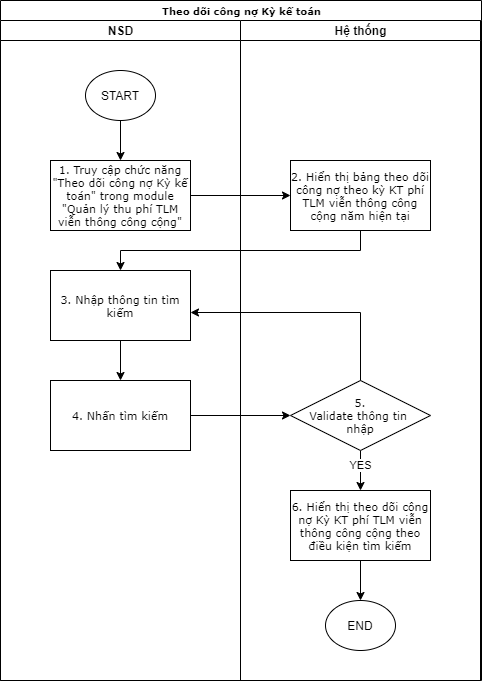

Mô tả luồng xử lý

Bước

Mô tả

Bước 1

NSD truy cập chức năng “Theo dõi công nợ - Kỳ KT” trong module “Quản lý thu phí TLM viễn thông công cộng”.

Bước 2

Hệ  thống mặc định hiển thị bảng theo dõi công nợ theo kỳ kế toán của phí TLM viễn thông công cộng năm hiện tại.

Bước 3

NSD tiến hành nhập thông tin tìm kiếm khi muốn tìm kiếm số liệu công nợ theo từng DN hoặc kì phí khác.

Bước 4

Nhấn [Tìm kiếm]

Bước 5

Hệ thống kiểm tra thông tin nhập:

- Nếu không hợp lệ, chuyển bước 3

- Nếu hợp lệ, chuyển bước 6

Bước 6

Hệ thống hiển thị danh sách công nợ bao gồm số dư nợ đầu năm và số phải nộp trong năm

Kết thúc luồng.

Giao diện chức năng

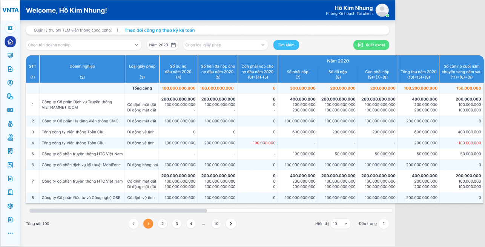

STT

Tên

Tên

Kiểu

dữ liệu

Bắt buộc

Mô tả

Database

Database

1

Tra cứu công nợ

Tra cứu công nợ

Tra cứu công nợ

Tra cứu công nợ

Tra cứu công nợ

Tra cứu công nợ

Tra cứu công nợ

1.1

Tên doanh nghiệp

Tên doanh nghiệp

Combobox search

- Gồm all DN có giấy phép TLM do Cục VT cấp

- Cho phép nhập tên doanh nghiệp

- Autocomplete

- Sắp xếp các option theo thứ tự Mã định danh tăng dần (quy định ngầm trong hệ thống khi thêm mới)

- Cho phép chọn 1 hoặc nhiều DN

1.2

Năm

Năm

Datepicker

x

Cho phép NSD chọn năm

1.3

Tìm kiếm

Tìm kiếm

Button

Nhấn => hệ thống kiểm tra tính chính xác của dữ liệu tìm kiếm và đưa ra kết quả tại bảng dưới.

2

Xuất excel

Xuất excel

Button

Nhấn => hệ thống tải về file excel bao gồm danh sách công nợ NSD đang tìm kiếm.

File gồm các cột giống trên giao diện (trừ cột xử lý), tiêu đề của sheet là Theo dõi công nợ theo Kỳ kế toán năm …, tên file: [Ngày xuất]_Theo dõi công nợ theo Kỳ kế toán phí TLM viễn thông công cộng năm …

3

Bảng theo dõi công nợ theo kỳ kế toán năm …

Grid danh sách

Bảng theo dõi công nợ theo kỳ kế toán năm …

Grid danh sách

Bảng theo dõi công nợ theo kỳ kế toán năm …

Grid danh sách

Bảng theo dõi công nợ theo kỳ kế toán năm …

Grid danh sách

Bảng theo dõi công nợ theo kỳ kế toán năm …

Grid danh sách

Bảng theo dõi công nợ theo kỳ kế toán năm …

Grid danh sách

Bảng theo dõi công nợ theo kỳ kế toán năm …

Grid danh sách

1

STT (1)

STT (1)

Số thứ tự

2

Doanh nghiệp (2)

Doanh nghiệp (2)

Text

- Hiển thị tên doanh nghiệp

- Hiển thị all DN còn số dư nợ đầu năm (thừa hoặc thiếu) hoặc trong năm phát sinh phí TLM viễn thông công cộng theo năm tìm kiếm

3

Loại giấy phép (3)

Loại giấy phép (3)

Text

Hiển thị loại giấy phép theo từng số giấy phép:

- Cố định mặt đất

- Di động mặt đất

- Cố định vệ tinh

- Di động vệ tinh

- Di động hàng hải

- Di động hàng không

4

Số dư nợ đầu năm … (4)

Số dư nợ đầu năm … (4)

Currency

- Số tiền DN nộp thừa/còn nợ tính từ những năm về trước đến hết năm trước năm báo cáo của từng loại giấy phép (tức là tính đến ngày biên lai = 31/12/năm trước đó so với năm đang tìm kiếm DN => hệ thống đưa ra số tiền thừa/thiếu ở đầu năm tiếp theo)

- Nếu là tiền thừa hiển thị font chữ màu đỏ, thiếu hiển thị màu đen

- Nếu những năm trước đó không có giấy phép (nhưng năm đang tìm kiếm có giấy phép) sẽ hiển thị dấu “-”

- Nếu những năm trước đó có giấy phép nhưng không có nợ đầu năm hiển thị 0

- Nếu là số thập phân làm tròn chỉ lấy phần nguyên, phần thập phân >=5 sẽ làm tròn phần số nguyên lên 1 đơn vị, ngược lại giữ nguyên phần số nguyên ko làm tròn nếu phần thập phân<5

5

Số tiền đã nộp cho nợ đầu năm … (5)

Số tiền đã nộp cho nợ đầu năm … (5)

Currency

- Số tiền DN đã nộp cho nợ những năm về trước đến hết năm trước năm báo cáo (ngày biên lai từ 01/01/năm báo cáo - 31/12/năm báo cáo) theo từng loại giấy phép

- Nếu Số nợ đầu năm hiển thị dấu “-” => Số đã nộp sẽ hiển thị dấu “-”

- Nếu Số dư nợ đầu năm>=0 mà chưa nộp tiền => Số đã nộp hiển thị “0”

6

Số còn phải nộp cho nợ đầu năm … (6) = (4)-(5)

Số còn phải nộp cho nợ đầu năm … (6) = (4)-(5)

Curency

= Số dư nợ đầu năm - Số tiền đã nộp cho nợ đầu năm

- Nếu Số nợ đầu năm hiển thị dấu “-” => Số còn phải nộp sẽ hiển thị dấu “-”

- Nếu là số thập phân làm tròn chỉ lấy phần nguyên, phần thập phân >=5 sẽ làm tròn phần số nguyên lên 1 đơn vị, ngược lại giữ nguyên phần số nguyên ko làm tròn nếu phần thập phân<5

7

Năm …

Năm …

Năm tìm kiếm

8

Số phải nộp (7)

Currency

Số tiền DN phải nộp trong năm theo từng Loại giấy phép

Nếu không có giấy phép trong năm đang tìm kiếm phải trả phí (nhưng năm cũ có) => hiển thị dấu “-”

Định dạng: Dấu “.” ngăn cách hàng nghìn

Đơn vị: VNĐ

- Nếu là số thập phân làm tròn chỉ lấy phần nguyên, phần thập phân >=5 sẽ làm tròn phần số nguyên lên 1 đơn vị, ngược lại giữ nguyên phần số nguyên ko làm tròn nếu phần thập phân<5

9

Số đã nộp cho năm (8)

Currency

Ghi nhận all biên lại nộp cho năm (ngày biên lai từ 01/01/năm báo cáo - 31/12/năm báo cáo)

Định dạng: Dấu “.” ngăn cách hàng nghìn

Đơn vị: VNĐ

Còn phải nộp (9)=(7)-(8)

10

Tổng thu năm … (10) = (5) + (8)

Tổng thu năm … (10) = (5) + (8)

Curency

Định dạng: Dấu “.” ngăn cách hàng nghìn

Đơn vị: VNĐ

13

Số còn nợ cuối năm chuyển năm sau (11)= (6) + (9)

Số còn nợ cuối năm chuyển năm sau (11)= (6) + (9)

Curency

(7)= (3) + (4) – (5)

Định dạng: Dấu “.” ngăn cách hàng nghìn

Đơn vị: VNĐ

- Nếu là số thập phân làm tròn chỉ lấy phần nguyên, phần thập phân >=5 sẽ làm tròn phần số nguyên lên 1 đơn vị, ngược lại giữ nguyên phần số nguyên ko làm tròn nếu phần thập phân<5

14

Dòng Tổng cộng

Dòng Tổng cộng

Curency

Cộng dồn theo cột all các DN theo tiêu chí tìm kiếm

15

Phân trang

Phân trang

15.1

Tổng số bản ghi

Tổng số bản ghi

Text

Hiển thị tổng số bản ghi theo điều kiện tìm kiếm

15.2

Phân trang

Phân trang

button

Gồm các button: Về trang trước đó, 1, 2, 3, 4, 5 (nếu ít trang hơn sẽ tự cắt bớt), trang sau đó

15.3

Số bản ghi trên 1 trang

Số bản ghi trên 1 trang

combobox

Gồm:

10/20/50/100

Mặc định 10 bản ghi trên 1 trang

15.4

Đến trang

Đến trang

Text

- Nhập số trang => hệ thống nhảy đến dữ liệu trang tương ứng

Xem báo cáo Theo dõi công nợ lũy kế

Luồng chức năng

Thông tin chung

Tên chức năng

Theo dõi công nợ lũy kế phí TLM viễn thông công cộng

Mô tả

Chức năng cho phép cán bộ Phòng KHTC xem, tra cứu dữ liệu về công nợ lũy kế phí TLM viễn thông công cộng của các DN trong từng giai đoạn; xuất excel theo bảng danh sách tìm kiếm.

Tác nhân

Lãnh đạo, Cán bộ Phòng KHTC

Điều kiện trước

Đăng nhập vào hệ thống, có phân quyền chức năng

Điều kiện sau

Xem, tra cứu và xuất excel thành công danh sách công nợ lũy kế phí TLM viễn thông công cộng theo từng giai đoạn

Ngoại lệ

N/A

Các yêu cầu đặc biệt

N/A

Luồng chức năng

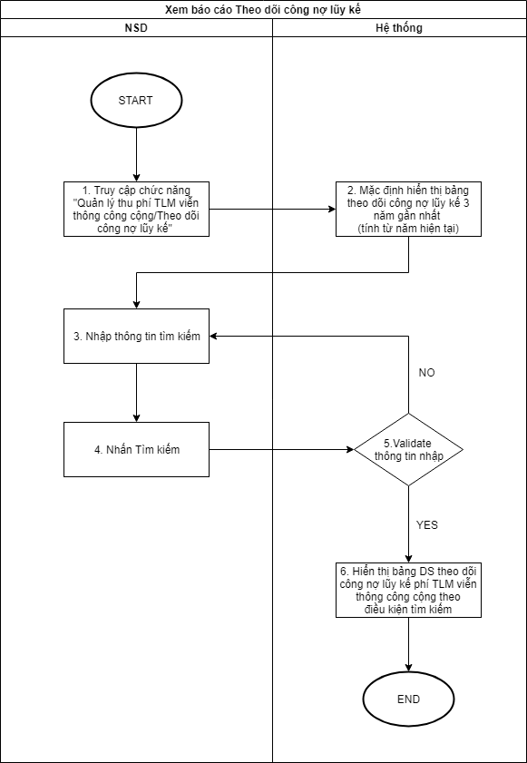

Mô tả luồng xử lý

Bước

Mô tả

Bước 1

NSD truy cập chức năng “Theo dõi công nợ lũy kế” trong module “Quản lý thu phí TLM viễn thông công cộng”.

Bước 2

Hệ thống mặc định hiển thị bảng theo dõi công nợ lũy kế của phí TLM viễn thông công cộng 03 năm gần nhất về trước kể từ năm hiện tại.

Bước 3

NSD tiến hành nhập thông tin tìm kiếm khi muốn tìm kiếm số liệu công nợ lũy kế theo từng DN hoặc giai đoạn khác.

Bước 4

Nhấn [Tìm kiếm]

Bước 5

Hệ thống kiểm tra thông tin nhập:

- Nếu không hợp lệ, chuyển bước 3

- Nếu hợp lệ, chuyển bước 6.

Bước 6

Hệ thống hiển thị số liệu công nợ các năm trong giai đoạn người dùng tìm kiếm (tối đa 3 năm)

Kết thúc luồng.

Giao diện chức năng

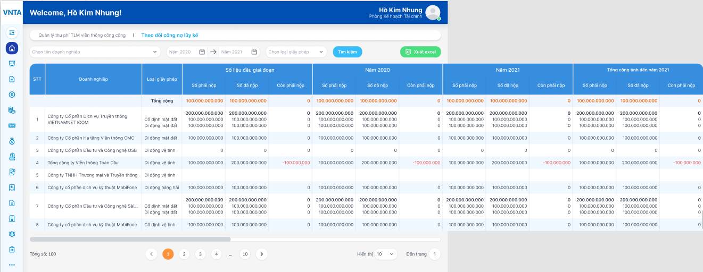

STT

Thông tin

Kiểu dữ liệu

Bắt buộc

Mô tả

Database

1

Tên doanh nghiệp

Combobox

- Gồm all DN có gp TLM viễn thông công cộng do Cục VT cấp.

- Cho phép người dùng nhập tên DN

- Autocomplete gõ nhập tên doanh nghiệp hệ thống tự động gợi ý

- Sắp xếp các option theo thứ tự Mã định danh tăng dần (quy định ngầm trong hệ thống khi thêm mới DN)

- Cho phép chọn 1 hoặc nhiều DN.

2

Giai đoạn

Giai đoạn

Giai đoạn

Giai đoạn

Giai đoạn

2.1

Từ năm

datepicker

x

Autofill giai đoạn 3 năm gần nhất.

Cho phép nhập hoặc chọn năm.

2.2

Đến năm

datepicker

x

Autofill giai đoạn 3 năm gần nhất.

Cho phép nhập hoặc chọn năm

Đến năm >= Từ năm

3

Loại giấy phép

combobox

- Mặc định không chọn là chọn tất cả.

- Cho phép NSD chọn 1 hoặc nhiều các loại giấy phép:

+ Cố định mặt đất

+ Di động mặt đất

+ Cố định vệ tinh

+ Di động vệ tinh

+ Di động hàng hải

+ Di động hàng không

4

Tìm kiếm

button

Nhấn để bắt đầu tìm kiếm theo thông tin tra cứu.

5

Xuất excel

button

Cho phép NSD tải file excel danh sách đang hiển thị

File gồm các cột giống trên giao diện (trừ cột xử lý), tiêu đề của sheet là Theo dõi công nợ lũy kế tính đến năm…, tên file: [Ngày xuất]_ Theo dõi công nợ lũy kế tính đến năm …

6

Grid

Grid

Grid

Grid

Grid

6.1

Tổng cộng

number

Hiển thị tổng của DN có nhiều loại giấy phép.

6.2

STT

number

Hiển thị STT; Tự sinh, tăng dần

6.3

Doanh nghiệp

Varchar

Hiển thị tên doanh nghiệp

6.4

Loại giấy phép

Varchar

Hiển thị các loại GP còn nợ từ trước cho đến giai đoạn tìm kiếm.

6.5

Số liệu đầu giai đoạn

Số liệu đầu giai đoạn

Số liệu đầu giai đoạn

Số liệu đầu giai đoạn

Số liệu đầu giai đoạn

6.5.1

Số phải nộp

Currency

Tổng phí phải nộp tính từ thời điểm bắt đầu sử dụng giấy phép đến thời điểm đầu giai đoạn đang chọn. (tính đến hết năm trước năm đầu giai đoạn đang thống kê)

- Nếu là số thập phân làm tròn chỉ lấy phần nguyên, phần thập phân >=5 sẽ làm tròn phần số nguyên lên 1 đơn vị, ngược lại giữ nguyên phần số nguyên ko làm tròn nếu phần thập phân<5

- Nếu không có GP trong năm đó thì hiển thị dấu “-”.

6.5.2

Số đã nộp

Currency

Tổng phí đã nộp tính từ thời điểm bắt đầu sử dụng dịch vụ đến thời điểm đầu giai đoạn đang chọn. (tính đến hết năm trước năm đầu giai đoạn đang thống kê)

6.5.3

Còn phải nộp

Currency

= Số phải nộp – Số đã nộp

- Nếu là số thập phân làm tròn chỉ lấy phần nguyên, phần thập phân >=5 sẽ làm tròn phần số nguyên lên 1 đơn vị, ngược lại giữ nguyên phần số nguyên ko làm tròn nếu phần thập phân<5

6.6

Năm … (ví dụ năm 2020 )

Năm … (ví dụ năm 2020 )

Năm … (ví dụ năm 2020 )

Năm … (ví dụ năm 2020 )

Năm … (ví dụ năm 2020 )

6.6.1

Số phải nộp

Currency

Số phí phải nộp cho năm theo từng Loại giấy phép.

- Số phải nộp là mức thu theo năm.

- Nếu là số thập phân làm tròn chỉ lấy phần nguyên, phần thập phân >=5 sẽ làm tròn phần số nguyên lên 1 đơn vị, ngược lại giữ nguyên phần số nguyên ko làm tròn nếu phần thập phân<5

- Nếu không có GP trong năm đó thì hiển thị dấu “-”

6.6.2

Số đã nộp

Currency

Số phí đã nộp cho năm căn cứ trên việc nộp cho Kỳ viễn thông Năm, ko dựa trên Ngày biên lai.

Số liệu tổng hợp từ chức năng ‘Quản lý biên lai”.

Nếu chưa có số liệu => hiển thị số 0.

6.6.3

Còn phải nộp

Currency

= số phải nộp – số đã nộp

Nếu là số âm hiển thị font chữ màu đỏ

- Nếu là số thập phân làm tròn chỉ lấy phần nguyên, phần thập phân >=5 sẽ làm tròn phần số nguyên lên 1 đơn vị, ngược lại giữ nguyên phần số nguyên ko làm tròn nếu phần thập phân<5

6.7

Tổng cộng tính đến năm …. (Ví dụ tính đến năm 2021)

Tổng cộng tính đến năm …. (Ví dụ tính đến năm 2021)

Tổng cộng tính đến năm …. (Ví dụ tính đến năm 2021)

Tổng cộng tính đến năm …. (Ví dụ tính đến năm 2021)

Tổng cộng tính đến năm …. (Ví dụ tính đến năm 2021)

6.7.1

Số phải nộp

Currency

Số phí phải nộp tính từ thời điểm DN bắt đầu sử dụng dịch vụ đến thời điểm kết thúc giai đoạn đang chọn.

- Nếu là số thập phân làm tròn chỉ lấy phần nguyên, phần thập phân >=5 sẽ làm tròn phần số nguyên lên 1 đơn vị, ngược lại giữ nguyên phần số nguyên ko làm tròn nếu phần thập phân<5

6.7.2

Số đã nộp

Currency

Số phí đã nộp tính từ thời điểm DN bắt đầu sử dụng dịch vụ đến thời điểm kết thúc giai đoạn đang chọn.

6.7.3

Còn phải nộp

Currency

= Số phải nộp – Số đã nộp

Nếu là số âm hiển thị font chữ màu đỏ

- Nếu là số thập phân làm tròn chỉ lấy phần nguyên, phần thập phân >=5 sẽ làm tròn phần số nguyên lên 1 đơn vị, ngược lại giữ nguyên phần số nguyên ko làm tròn nếu phần thập phân<5

Quản lý thu phí một lần

Xem danh sách Theo dõi thu phí một lần

Luồng chức năng

Thông tin chung

Tên chức năng

Xem danh sách Theo dõi thu phí một lần

Mô tả

Chức năng cho phép xem thông tin danh sách theo dõi thu phí một lần của các Doanh nghiệp

Tác nhân

Lãnh đạo, Cán bộ Phòng KHTC

Điều kiện trước

Đăng nhập vào hệ thống, có phân quyền chức năng

Điều kiện sau

Xem, tìm kiếm được danh sách Theo dõi thu phí một lần.

Ngoại lệ

N/A

Các yêu cầu đặc biệt

N/A

Luồng chức năng

Bước

Mô tả

Bước 1

NSD truy cập chức năng “Quản lý thu phí một lần”/ “Theo dõi thu phí một lần”

Bước 2

Hệ thống hiển thị giao diện danh sách giấy phép của DN phải nộp phí một lần (Gồm: Phí thử nghiệm mạng và dịch vụ viễn thông và Phí TLM viễn thông dùng riêng do CVT cấp phải nộp phí)

--	Phí Thử nghiệm mạng và dịch vụ viễn thông

+ Đối với giấy phép Cấp lần đầu/ Cấp mới: Hệ thống đưa ra số tiền phải nộp

+ Đối với giấy phép Gia hạn/Bổ sung: Hệ thống check nếu có sự khác biệt về Tài nguyên, Phạm vi sẽ tính tiền và đưa ra số tiền phải nộp. Ngược lại nếu giống giấy phép cũ sẽ không phải nộp tiền => không có trong danh sách

+ Đối với giấy phép Cấp lại: Không phải nộp tiền => không có trong danh sách

- Phí Thiết lập mạng viễn thông dùng riêng

+ Đối với giấy phép Cấp lần đầu/ Cấp mới: Hệ thống đưa ra số tiền phải nộp

+ Đối với Cấp lại, Gia hạn, Sửa đổi, bổ sung: Không phải nộp tiền => không có trong danh sách

Bước 3

NSD nhấn icon [Hiển thị bộ lọc] => tiến hành tìm kiếm các thông tin.

- Nếu có, chuyển bước 4

- Nếu không, chuyển bước 8

Bước 4

Hệ thống hiển thị khung tìm kiếm.

Bước 5

NSD nhập các thông tin tìm kiếm tại các trường dữ liệu tương ứng.

Bước 6

Nhấn [Tìm kiếm].

Bước 7

Hệ thống kiểm tra tính hợp lệ thông tin nhập:

- Nếu hợp lệ, chuyển bước 8

- Nếu không hợp lệ, hệ thống đưa ra thông báo tại các trường nhập không hợp lệ. Quay lại bước 5.

Bước 8

Hệ thống hiển thị danh sách thông tin giấy phép theo điều kiện tìm kiếm.

Kết thúc luồng.

Giao diện chức năng

Giao diện tìm kiếm cơ bản

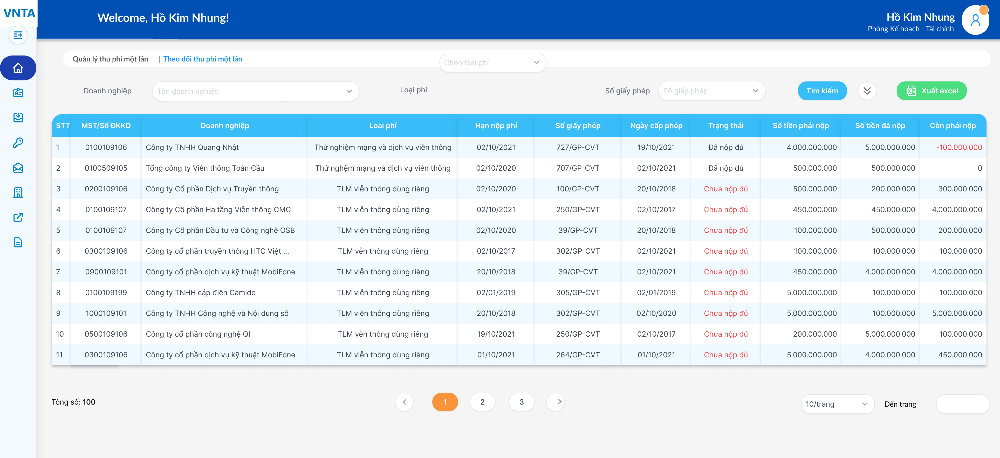

Giao diện tìm kiếm nâng cao

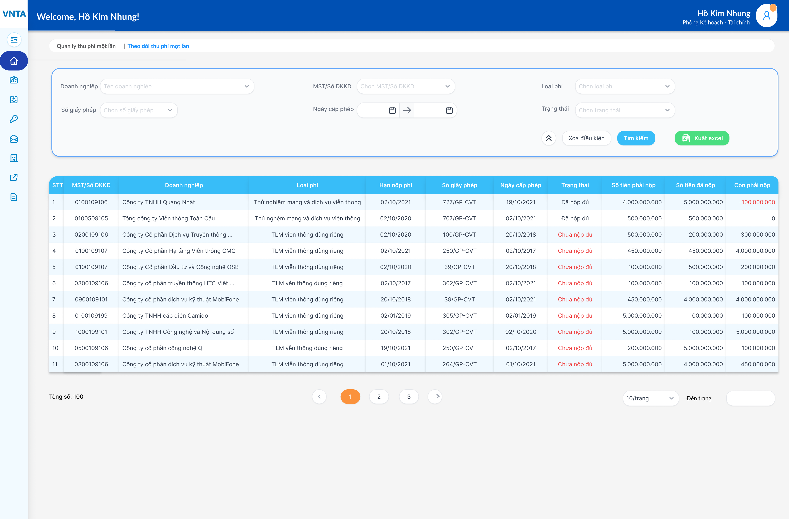

STT

Thông tin

Kiểu dữ liệu

Bắt buộc

Mô tả

Database

1

Tra cứu rút gọn

Tra cứu rút gọn

Tra cứu rút gọn

Tra cứu rút gọn

Tra cứu rút gọn

1.1

Tên doanh nghiệp

combobox search

- Chứa all DN có giấy phép: Phí thử nghiệm mạng và dịch vụ viễn thông hoặc Phí TLM viễn thông dùng riêng do CVT cấp phải nộp phí

- Mặc định ko chọn là Chọn tất cả

- Cho phép người dùng nhập tên DN

- Autocomplete gõ nhập tên doanh nghiệp hệ thống tự động gợi ý

- Sắp xếp các option theo thứ tự Mã định danh tăng dần (quy định ngầm trong hệ thống khi thêm mới DN)

- Cho phép chọn 1 hoặc nhiều DN.

1.2

Loại phí

combobox search

Cho phép NSD nhập hoặc chọn các loại phí gồm:

+ Phí thử nghiệm mạng và dịch vụ viễn thông

+ Phí TLM viễn thông dùng riêng

-Autocomplete gõ nhập loại phí và hệ thống tự động gợi ý.

1.3

Số giấy phép

combobox search

- Gồm tất cả giấy phép Thử nghiệm mạng và dịch vụ viễn thông; TLM viễn thông dùng riêng của DN phải nộp phí được Cục VT cấp.

- Mặc định ko chọn là Chọn tất cả.

- Cho phép nhập số GP.

- Autocomplete.

- Cho phép chọn 1 hoặc nhiều số giấy phép.

1.4

Tìm kiếm

button

Tìm kiếm theo các trường thông tin Chọn tên DN, loại phí, số giấy phép. Hệ thống hiển thị bảng danh sách bên dưới.

1.5

Icon Tìm kiếm nâng cao

Button

- Nhấn hệ thống xổ xuống các tiêu chí Tìm kiếm nâng cao.

- Ngược lại khi hiển thị các tiêu chí nâng cao, nhấn icon sẽ thu gọn lại.

1.6

Xuất excel

button

File gồm các cột giống trên giao diện (trừ cột xử lý), tiêu đề của sheet là Theo dõi thu phí một lần, tên file: [Ngày xuất]_Theo dõi thu phí một lần.

2

Tìm kiếm nâng cao

Tìm kiếm nâng cao

Tìm kiếm nâng cao

Tìm kiếm nâng cao

Tìm kiếm nâng cao

2.1

Doanh nghiệp

combobox search

- Chứa all DN có giấy phép: Phí thử nghiệm mạng và dịch vụ viễn thông; Phí TLM viễn thông dùng riêng phải nộp phí do CVT cấp.

- Mặc định ko chọn là Chọn tất cả

- Cho phép người dùng nhập tên DN

- Autocomplete gõ nhập tên doanh nghiệp hệ thống tự động gợi ý

- Sắp xếp các option theo thứ tự Mã định danh tăng dần (quy định ngầm trong hệ thống khi thêm mới DN)

-Cho phép chọn 1 hoặc nhiều DN.

2.2

Số giấy phép

combobox search

- Gồm tất cả giấy phép Thử nghiệm mạng và dịch vụ viễn thông; TLM viễn thông dùng riêng của DN phải nộp phí được Cục VT cấp.

- Mặc định ko chọn là Chọn tất cả.

- Cho phép nhập số GP.

- Autocomplete.

- Cho phép chọn 1 hoặc nhiều DN.

2.3

 Mã số thuế/Số ĐKKD

combobox search

- Chứa all Mã số thuế/Số ĐKKD của DN có giấy phép Thử nghiệm mạng và dịch vụ viễn thông; TLM viễn thông dùng riêng phải nộp phí.

- Mặc định ko chọn là Chọn tất cả

- Cho phép nhập Mã số thuế/ Số ĐKKD

--	- Autocomplete

--	- Cho phép chọn 1 hoặc nhiều Mã số thuế/ Số ĐKKD

2.4

Ngày cấp phép

datepicker

- Gồm từ - đến

- Đến phải >= Từ

2.5

Loại phí

combobox

- Mặc định không chọn là Chọn tất cả

- Cho phép NSD chọn 1 hoặc nhiều loại phí:

+ Phí Thử nghiệm mạng và dịch vụ viễn thông;

+ Phí TLM viễn thông dùng riêng.

2.6

Trạng thái

Combobox

- Gồm: Đã nộp đủ/Chưa nộp đủ

--	- Mặc định ko chọn là chọn tất cả

2.7

Xóa điều kiện

Button

Nhấn [Xóa điều kiện], hệ thống xóa toàn bộ dữ liệu tiêu chí tìm kiếm đã nhập, giữ nguyên kết quả tìm kiếm

2.8

Tìm kiếm

Button

Nhấn [Tìm kiếm], hệ thống check hợp lệ của điều kiện tìm kiếm và trả danh sách kết quả.

2.9

Xuất excel

button

File gồm các cột giống trên giao diện (trừ cột xử lý), tiêu đề của sheet là Theo dõi thu phí một lần, tên file: [Ngày xuất]_Theo dõi thu phí một lần.

3

Grid danh sách

Grid danh sách

Grid danh sách

Grid danh sách

Grid danh sách

3.1

STT

Text

Hiển thị STT.

Tự sinh, tăng dần.

3.2

MST/Số ĐKKD

Text

Hiển thị mã số thuế /số đăng ký kinh doanh của DN.

3.3

Doanh nghiệp

Text

Hiển thị tên DN.

3.4

Loại phí

Text

Hiển thị loại phí tương ứng của DN:

+ Phí Thử nghiệm mạng và dịch vụ viễn thông;

+ Phí TLM viễn thông dùng riêng.

3.5

Hạn nộp phí

date

Ghi nhận từ Hạn nộp phí khi xuất công văn, nếu xuất lại cv Hạn nộp phí sẽ được update theo

3.6

Số giấy phép

Text

Hiển thị tất cả số giấy phép do CVT đã cấp phép phải nộp phí tương ứng với các trường tìm kiếm

3.7

Ngày cấp phép

date

Hiển thị ngày cấp phép của giấy phép tương ứng

3.8

Trạng thái

Text

Hiển thị “Chưa nộp đủ” hoặc “Đã nộp đủ”

- Đã nộp đủ: Font chữ màu đen

- Chưa nộp: Font chữ màu đỏ, (khi chưa nộp đủ phí)

3.9

Số phải nộp

- Phí Thử nghiệm mạng và dịch vụ viễn thông

+ Quy tắc tính phí theo TT03

+ Đối với gp Gia hạn/Bổ sung: Hệ thống check nếu có sự khác biệt về Tài nguyên, Phạm vi sẽ tính tiền và đưa ra số tiền phải nộp. Ngược lại nếu giống giấy phép cũ sẽ không phải nộp tiền => không có trong danh sách

- Phí Thiết lập mạng viễn thông dùng riêng

+ Quy tắc tính phí theo TT03

+ Đối với Cấp lại, Gia hạn, Sửa đổi, bổ sung: Không mất phí => không có trong danh sách

3.10

Số tiền đã nộp

Currency

- Số tiền DN đã nộp (tính theo biên lai nhập vào hệ thống)

- Nếu chưa nộp hiển thị “0”

3.11

Còn phải nộp

Curency

- Số phải nộp – Số đã nộp

- Nếu chưa nộp hiển thị “0”

- Nếu là số thập phân làm tròn chỉ lấy phần nguyên, phần thập phân >=5 sẽ làm tròn phần số nguyên lên 1 đơn vị, ngược lại giữ nguyên phần số nguyên ko làm tròn nếu phần thập phân<5

4

Phân trang

4.1

Tổng số bản ghi

Text

Hiển thị tổng số bản ghi theo điều kiện tìm kiếm

4.2

Phân trang

button

Gồm các button: Về trang trước đó, 1, 2, 3 (nếu ít trang hơn sẽ tự cắt bớt), trang sau đó

4.3

Số bản ghi trên 1 trang

combobox

Gồm:

10/20/50/100

Mặc định 10 bản ghi trên 1 trang

4.4

Đến trang

Text

- Nhập số trang => hệ thống nhảy đến dữ liệu trang tương ứng

Quản lý thu lệ phí

Xem danh sách Theo dõi thu lệ phí cấp phép

Luồng chức năng

Thông tin chung

Tên chức năng

Xem danh sách Theo dõi thu lệ phí cấp phép

Mô tả

Chức năng cho phép xem thông tin danh sách theo dõi thu lệ phí cấp phép của các doanh nghiệp do Cục cấp phép.

Tác nhân

Lãnh đạo, Cán bộ Phòng KHTC

Điều kiện trước

Đăng nhập vào hệ thống, có phân quyền chức năng

Điều kiện sau

Xem, tìm kiếm được danh sách Theo dõi thu lệ phí cấp phép.

Ngoại lệ

N/A

Các yêu cầu đặc biệt

N/A

Luồng chức năng

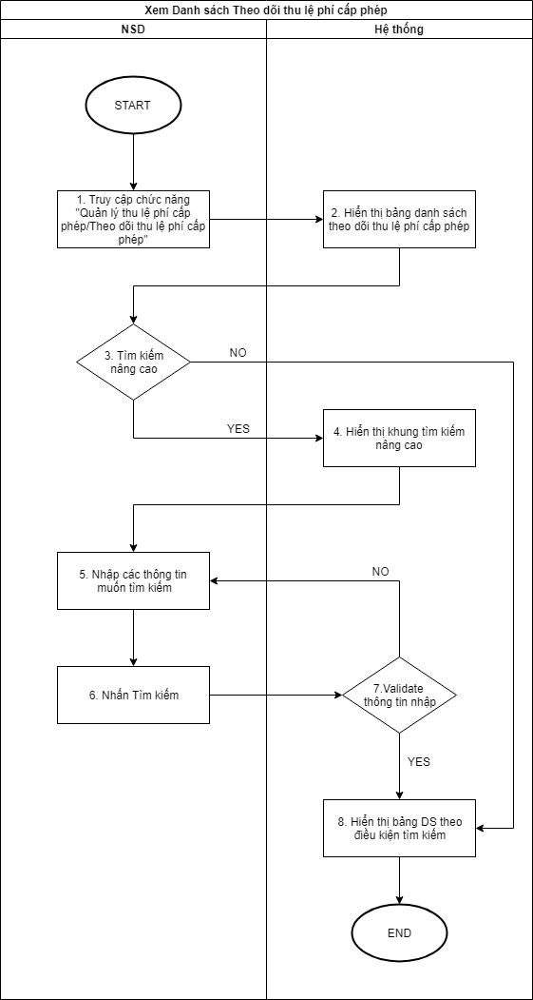

Bước

Mô tả

Bước 1

NSD truy cập chức năng “Quản lý thu lệ phí cấp phép/ Theo dõi thu lệ phí cấp phép”.

Bước 2

Hệ thống hiển thị giao diện danh sách giấy phép phải thu lệ phí (do Cục cấp giấy phép) của tất cả các doanh nghiệp được Cục VT cấp phép.

Bước 3

NSD nhấn icon [Hiển thị bộ lọc] => tiến hành tìm kiếm các thông tin.

- Nếu có, chuyển bước 4

- Nếu không, chuyển bước 8

Bước 4

Hệ thống hiển thị khung tìm kiếm.

Bước 5

NSD nhập các thông tin tìm kiếm tại các trường dữ liệu tương ứng.

Bước 6

Nhấn [Tìm kiếm].

Bước 7

Hệ thống kiểm tra tính hợp lệ thông tin nhập:

- Nếu hợp lệ, chuyển bước 8

- Nếu không hợp lệ, hệ thống đưa ra thông báo tại các trường nhập không hợp lệ. Quay lại bước 5.

Bước 8

Hệ thống hiển thị danh sách thông tin giấy phép theo điều kiện tìm kiếm.

Kết thúc luồng.

Giao diện chức năng

Giao diện tìm kiếm cơ bản

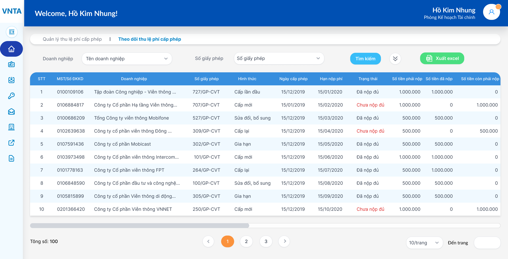

Giao diện tìm kiếm nâng cao

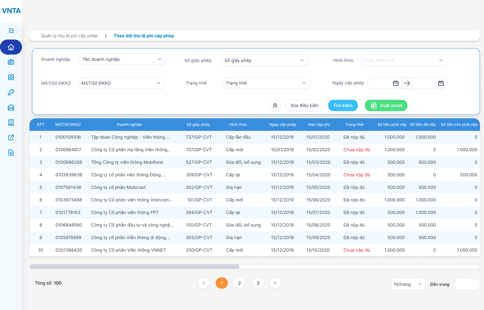

STT

Thông tin

Kiểu dữ liệu

Bắt buộc

Mô tả

Database

1

Tra cứu rút gọn

Tra cứu rút gọn

Tra cứu rút gọn

Tra cứu rút gọn

Tra cứu rút gọn

1.1

Tên doanh nghiệp

combobox search

- Chứa all DN có giấy phép do CVT cấp.

- Mặc định ko chọn là Chọn tất cả.

- Cho phép người dùng nhập tên DN.

- Autocomplete gõ nhập tên doanh nghiệp hệ thống tự động gợi ý.

- Sắp xếp các option theo thứ tự Mã định danh tăng dần (quy định ngầm trong hệ thống khi thêm mới DN).

- Cho phép chọn 1 hoặc nhiều DN.

1.2

Số giấy phép

combobox search

- Gồm tất cả giấy phép của DN được CVT cấp phép.

- Mặc định ko chọn là Chọn tất cả.

- Cho phép người dùng nhập số giấy phép.

- Autocomplete gõ nhập số giấy phép hệ thống tự động gợi ý.

1.3

Icon Tìm kiếm nâng cao

Button

- Nhấn hệ thống xổ xuống các tiêu chí Tìm kiếm nâng cao.

- Ngược lại khi hiển thị các tiêu chí nâng cao, nhấn icon sẽ thu gọn lại.

1.4

Tìm kiếm

button

Tìm kiếm theo các trường thông tin Chọn tên DN, số giấy phép. Hệ thống hiển thị bảng danh sách bên dưới.

1.5

Xuất excel

button

File gồm các cột giống trên giao diện (trừ cột xử lý), tiêu đề của sheet là Theo dõi thu lệ phí cấp phép, tên file: [Ngày xuất]_ Theo dõi thu lệ phí cấp phép.

2

Tìm kiếm nâng cao

Tìm kiếm nâng cao

Tìm kiếm nâng cao

Tìm kiếm nâng cao

Tìm kiếm nâng cao

2.1

Doanh nghiệp

combobox search

- Chứa all DN có giấy phép do CVT cấp.

- Mặc định ko chọn là Chọn tất cả.

- Cho phép nhập tên doanh nghiệp.

- Autocomplete.

- Sắp xếp các option theo thứ tự Mã định danh tăng dần (quy định ngầm trong hệ thống khi thêm mới).

- Cho phép chọn 1 hoặc nhiều

2.2

 Mã số thuế/Số ĐKKD

combobox search

- Chứa all Mã số thuế/Số ĐKKD của DN có giấy phép do CVT cấp.

- Mặc định ko chọn là Chọn tất cả.

- Cho phép nhập Mã số thuế/ Số ĐKKD.

- Autocomplete.

- Cho phép chọn 1 hoặc nhiều mã số thuế/ Số ĐKKD.

2.3

Số giấy phép

Combobox

- Gồm tất cả giấy phép của DN được CVT cấp phép.

- Mặc định ko chọn là Chọn tất cả.

- Cho phép người dùng nhập số giấy phép.

- Autocomplete gõ nhập số giấy phép hệ thống tự động gợi ý.

2.4

Trạng thái

Combobox

- Gồm: Đã nộp đủ/Chưa nộp đủ.

- Mặc định ko chọn là chọn tất cả.

2.5

Hình thức

combobox

- Gồm:

Cấp lần đầu, Cấp mới, SĐBS, Gia hạn, Cấp lại

2.6

Ngày cấp phép

Datepicker

--	Từ ngày – Đến ngày

--	Từ ngày <= Đến ngày

2.7

Xóa điều kiện

Button

Nhấn [Xóa điều kiện], hệ thống xóa toàn bộ dữ liệu tiêu chí tìm kiếm đã nhập, giữ nguyên kết quả tìm kiếm.

2.8

Tìm kiếm

Button

Nhấn [Tìm kiếm], hệ thống check hợp lệ của điều kiện tìm kiếm và trả danh sách kết quả.

2.9

Xuất excel

button

File gồm các cột giống trên giao diện (trừ cột xử lý), tiêu đề của sheet là Theo dõi thu lệ phí cấp phép, tên file: [Ngày xuất]_ Theo dõi thu lệ phí cấp phép.

3

Grid danh sách

Grid danh sách

Grid danh sách

Grid danh sách

Grid danh sách

3.1

STT

Text

Hiển thị STT.

3.2

MST/Số ĐKKD

Text

Hiển thị mã số thuế/ số đăng ký kinh doanh của DN.

3.3

Doanh nghiệp

Text

Hiển thị tên DN có giấy phép do CVT cấp tương ứng với các trường thông tin tìm kiếm.

3.4

Số giấy phép

Text

Hiển thị tất cả số giấy phép do CVT đã cấp phép phải nộp phí tương ứng với các trường tìm kiếm.

Sắp xếp trạng thái Chưa nộp đủ -> Đã nộp đủ. Trong mỗi trạng thái sẽ sắp xếp theo thời gian ngày cấ phép giảm dần

3.5

Hình thức

Text

Hiển thị hình thức cấp phép  tương ứng với GP gồm:

+ Cấp lần đầu

+ Cấp mới

+ Sửa đổi, bổ sung

+ Cấp lại

+ Gia hạn

3.6

Ngày cấp phép

date

Hiển thị ngày cấp phép của giấy phép tương ứng.

3.7

Hạn nộp phí

date

Ghi nhận từ Hạn nộp phí khi xuất công văn, nếu xuất lại cv Hạn nộp phí sẽ được update theo.

3.8

Trạng thái

Text

Hiển thị “Chưa nộp đủ” hoặc “Đã nộp đủ”

- Đã nộp đủ: Font chữ màu đen

- Chưa nộp: Font chữ màu đỏ, (khi chưa nộp đủ lệ phí cấp phép)

3.9

Số tiền phải nộp

Currency

- Hiển thị số phải nộp tương ứng với mỗi hình thức cấp phép (TT03) cụ thể như sau:

+ Cấp lần đầu, cấp mới: 1.000.000 đồng/giấy phép;

+ Cấp gia hạn, sửa đổi, bổ

sung, cấp lại: 500.000 đồng/giấy phép.

3.10

Số tiền đã nộp

Currency

- Số tiền DN đã nộp (tính theo biên lai nhập vào hệ thống).

- Nếu chưa nộp hiển thị “0”.

3.11

Còn phải nộp

Currency

- Bằng số phải nộp trừ số đã nộp.

4

Phân trang

4.1

Tổng số bản ghi

Text

Hiển thị tổng số bản ghi theo điều kiện tìm kiếm

4.2

Phân trang

button

Gồm các button: Về trang trước đó, 1, 2, 3 (nếu ít trang hơn sẽ tự cắt bớt), trang sau đó

4.3

Số bản ghi trên 1 trang

combobox

Gồm:

10/20/50/100

Mặc định 10 bản ghi trên 1 trang

4.4

Đến trang

Text

- Nhập số trang => hệ thống nhảy đến dữ liệu trang tương ứng

Xem danh sách theo dõi thu lệ phí phân bổ mã, số viễn thông

Luồng chức năng

Thông tin chung

Tên chức năng

Xem danh sách Theo dõi thu lệ phí phân bổ mã, số viễn thông

Mô tả

Chức năng cho phép xem thông tin danh sách theo dõi thu lệ phí phân bổ mã, số viễn thông của các doanh nghiệp.

Tác nhân

Lãnh đạo, Cán bộ Phòng KHTC

Điều kiện trước

Đăng nhập vào hệ thống, có phân quyền chức năng

Điều kiện sau

Xem, tìm kiếm được danh sách Theo dõi thu lệ phí phân bổ mã, số viễn thông.

Ngoại lệ

N/A

Các yêu cầu đặc biệt

N/A

Luồng chức năng

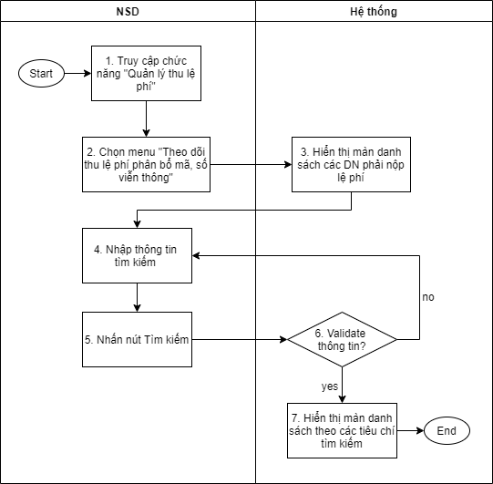

Bước

Mô tả

Bước 1

NSD truy cập chức năng “Quản lý thu lệ phí”

Bước 2

Chọn menu "Theo dõi thu lệ phí phân bổ mã, số viễn thông"

Bước 3

Hệ thống hiển thị giao diện danh sách các quyết định phải thu lệ phí của tất cả các doanh nghiệp.

Bước 4

NSD nhập các thông tin tìm kiếm tại các trường dữ liệu tương ứng.

Bước 5

Nhấn [Tìm kiếm].

Bước 6

Hệ thống kiểm tra tính hợp lệ thông tin nhập. nếu lỗi thì đưa ra thông báo tại các trường nhập không hợp lệ.

Bước 7

Hệ thống hiển thị danh sách theo dõi thu lệ phí phân bổ mã, số viễn thông của các doanh nghiệp.

Kết thúc luồng.

Giao diện chức năng

Giao diện tìm kiếm cơ bản

--	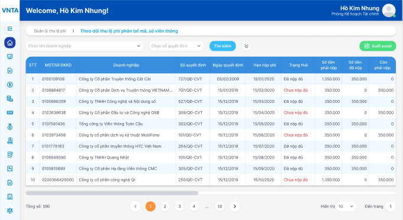

Giao diện tìm kiếm nâng cao

--

--	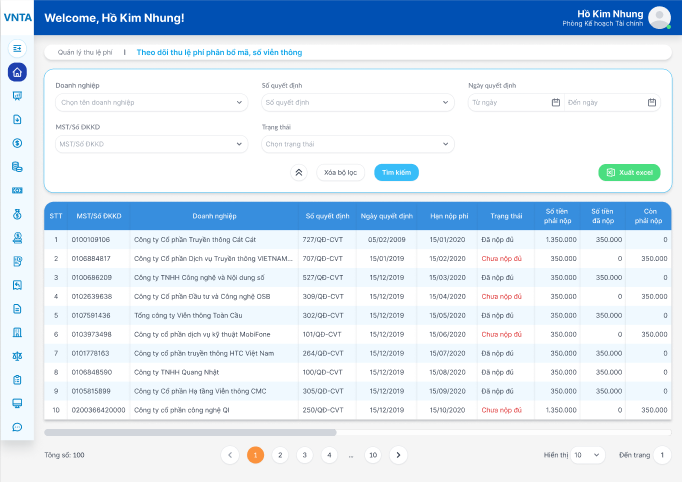

STT

Thông tin

Kiểu dữ liệu

Bắt buộc

Mô tả

Database

1

Tra cứu rút gọn

Tra cứu rút gọn

Tra cứu rút gọn

Tra cứu rút gọn

Tra cứu rút gọn

1.1

Tên doanh nghiệp

combobox search

- Chứa all DN có trong hệ thống. Sắp xếp các option theo thứ tự Mã định danh tăng dần.

- Cho phép chọn 1 hoặc nhiều DN. Mặc định ko chọn là chọn tất cả.

- Autocomplete gõ nhập tên doanh nghiệp hệ thống tự động gợi ý.

1.2

Số quyết định

combobox search

- Gồm tất cả quyết định của DN được phân bổ mã, số. Sắp xếp các option ưu tiên theo thời gian phân bổ mới nhất.

- Cho phép chọn nhiều số quyết định. Mặc định ko chọn là chọn tất cả.

- Autocomplete gõ nhập số quyết định hệ thống tự động gợi ý.

1.3

Icon Tìm kiếm nâng cao

Button

- Nhấn hệ thống xổ xuống các tiêu chí Tìm kiếm nâng cao.

- Ngược lại khi hiển thị các tiêu chí nâng cao, nhấn icon sẽ thu gọn lại.

1.4

Tìm kiếm

button

Tìm kiếm theo các trường thông tin Chọn tên DN, số quyết định. Hệ thống hiển thị bảng danh sách bên dưới.

1.5

Xuất excel

button

File gồm các cột giống trên giao diện, tiêu đề của sheet là “Theo dõi thu lệ phí phân bổ mã, số viễn thông”, tên file: [Ngày xuất]_ Theo dõi thu lệ phí phân bổ mã, số viễn thông.

--	Giao diện tìm kiếm nâng cao

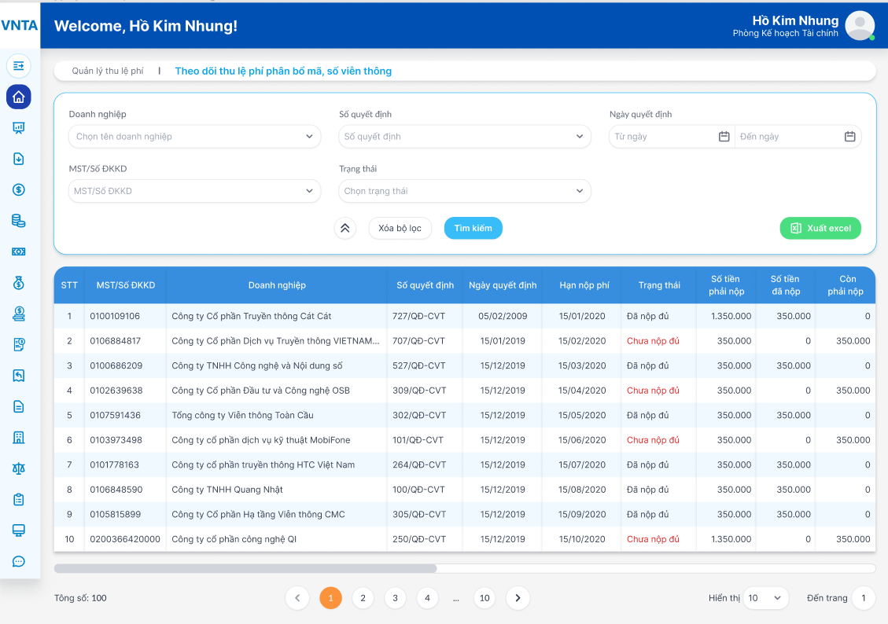

STT

Thông tin

Kiểu dữ liệu

Bắt buộc

Mô tả

Database

1

Tên doanh nghiệp

combobox search

- Chứa all DN có trong hệ thống. Sắp xếp các option theo thứ tự Mã định danh tăng dần.

- Cho phép chọn 1 hoặc nhiều DN. Mặc định ko chọn là chọn tất cả.

- Autocomplete gõ nhập tên doanh nghiệp hệ thống tự động gợi ý.

2

MST/Số ĐKKD

combobox search

- Chứa all Mã số thuế/Số ĐKKD của DN có trong hệ thống.

- Cho phép nhập Mã số thuế/ Số ĐKKD. Autocomplete khi nhập hệ thống tự động đưa ra gợi ý.

- Cho phép chọn 1 hoặc nhiều mã số thuế/ Số ĐKKD. Mặc định ko chọn là Chọn tất cả.

3

Số quyết định

combobox search

- Gồm tất cả quyết định của DN được phân bổ mã, số. Sắp xếp các option ưu tiên theo thời gian phân bổ mới nhất.

- Cho phép chọn nhiều số quyết định. Mặc định ko chọn là chọn tất cả.

- Autocomplete gõ nhập số quyết định hệ thống tự động gợi ý.

4

Ngày quyết định

datepicker

- “Từ ngày” <= “Đến ngày”

5

Trạng thái

Combobox

- Gồm: Đã nộp đủ/Chưa nộp đủ.

- Mặc định ko chọn là chọn tất cả.

6

Xóa bộ lọc

Button

Nhấn [Xóa điều kiện], hệ thống xóa toàn bộ dữ liệu tiêu chí tìm kiếm đã nhập, giữ nguyên kết quả tìm kiếm.

7

Tìm kiếm

Button

Nhấn [Tìm kiếm], hệ thống check hợp lệ của điều kiện tìm kiếm và trả danh sách kết quả.

8

Xuất excel

button

File gồm các cột giống trên giao diện, tiêu đề của sheet là Theo dõi thu lệ phí phân bổ mã, số viễn thông, tên file: [Ngày xuất]_ Theo dõi thu lệ phí phân bổ mã, số viễn thông.

9

Icon Tìm kiếm nâng cao

Button

- Nhấn -> khung tìm kiếm nâng cao co lại, trở về khung tìm kiếm rút gọn.

10

Grid

Grid

Grid

Grid

Grid

10.1

STT

Text

Hiển thị STT.

10.2

MST/Số ĐKKD

Text

Hiển thị mã số thuế/ số đăng ký kinh doanh của DN.

10.3

Doanh nghiệp

Text

Hiển thị tên DN phải nộp lệ phí phân bổ mã, số tương ứng với các trường thông tin tìm kiếm.

10.4

Số quyết định

Text

Hiển thị số quyết định của DN.

Sắp xếp trạng thái Chưa nộp đủ -> Đã nộp đủ. Trong mỗi trạng thái sẽ sắp xếp theo thời gian ngày quyết định phân bổ giảm dần

10.5

Ngày quyết định

date

Hiển thị ngày quyết định phân bổ mã, số tương ứng.

10.6

Hạn nộp phí

date

Ghi nhận từ Hạn nộp phí khi xuất công văn, nếu xuất lại cv Hạn nộp phí sẽ được update theo.

10.7

Trạng thái

Text

Hiển thị “Chưa nộp đủ” hoặc “Đã nộp đủ”.

- Đã nộp đủ: Font chữ màu đen.

- Chưa nộp: Font chữ màu đỏ, (khi chưa nộp đủ lệ phí phân bổ mã, số viễn thông).

10.8

Số tiền phải nộp

Currency

- Hiển thị theo chức năng quản lý mức thu lệ phí.

10.9

Số tiền đã nộp

Currency

- Số tiền DN đã nộp (tính theo biên lai nhập vào hệ thống).

- Nếu chưa nộp hiển thị “0”.

10.10

Còn phải nộp

Currency

- Bằng số phải nộp trừ số đã nộp.

11

Phân trang

Phân trang

Phân trang

Phân trang

Phân trang

11.1

Tổng số bản ghi

Text

Hiển thị tổng số bản ghi theo điều kiện tìm kiếm.

11.2

Phân trang

button

Gồm các button: Về trang trước đó, 1, 2, 3 (nếu ít trang hơn sẽ tự cắt bớt), trang sau đó

11.3

Số bản ghi trên 1 trang

combobox

Gồm:

10/20/50/100

Mặc định 10 bản ghi trên 1 trang.

11.4

Đến trang

Text

- Nhập số trang => hệ thống nhảy đến dữ liệu trang tương ứng

Quản lý thu phí sử dụng mã, số viễn thông

Xem danh sách Biến động phí sử dụng mã, số viễn thông

Luồng chức năng

Thông tin chung

Tên chức năng

Xem danh sách Biến động phí sử dụng mã, số viễn thông

Mô tả

Chức năng cho phép xem thông tin danh sách biến động phí sử dụng mã, số viễn thông của các doanh nghiệp do Cục cấp phép.

Tác nhân

Lãnh đạo, Cán bộ Phòng KHTC

Điều kiện trước

Đăng nhập vào hệ thống, có phân quyền chức năng

Điều kiện sau

Xem, tìm kiếm được danh sách Biến động phí sử dụng mã, số viễn thông.

Ngoại lệ

N/A

Các yêu cầu đặc biệt

N/A

Luồng chức năng

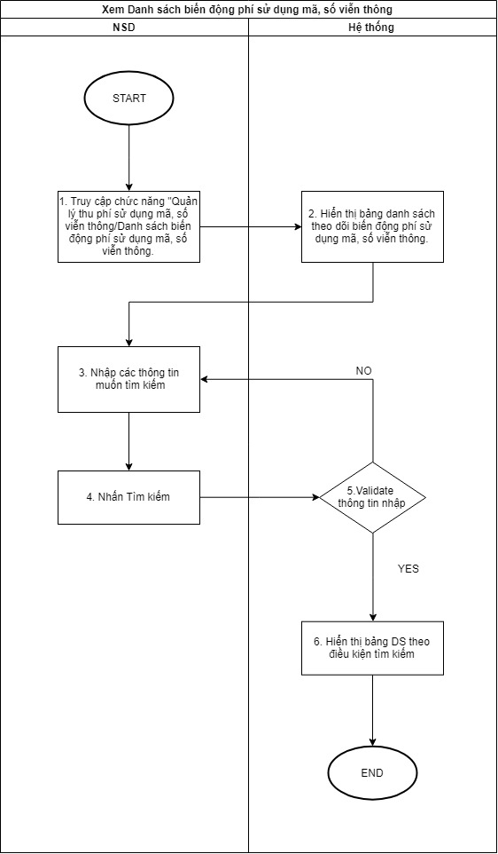

Mô tả luồng xử lý

Bước

Mô tả

Bước 1

NSD truy cập chức năng “Quản lý thu phí sử dụng mã, số viễn thông/ Danh sách biến động phí sử dụng mã, số viễn thông”.

Bước 2

Hệ thống hiển thị giao diện danh sách biến động phí mã, số viễn thông của tất cả các doanh nghiệp.

Mặc định hiển thị 2 quý gần nhất quý hiện tại.

Bước 3

NSD nhập các trường thông tin tiến hành tìm kiếm các thông tin.

Bước 4

Nhấn [Tìm kiếm].

Bước 5

Hệ thống kiểm tra tính hợp lệ thông tin nhập:

- Nếu hợp lệ, chuyển bước 6.

- Nếu không hợp lệ, hệ thống đưa ra thông báo tại các trường nhập không hợp lệ. Quay lại bước 3.

Bước 6

Hệ thống hiển thị danh sách biến động phí sử dụng mã, số theo điều kiện tìm kiếm.

Kết thúc luồng.

Giao diện chức năng

Giao diện tìm kiếm cơ bản

 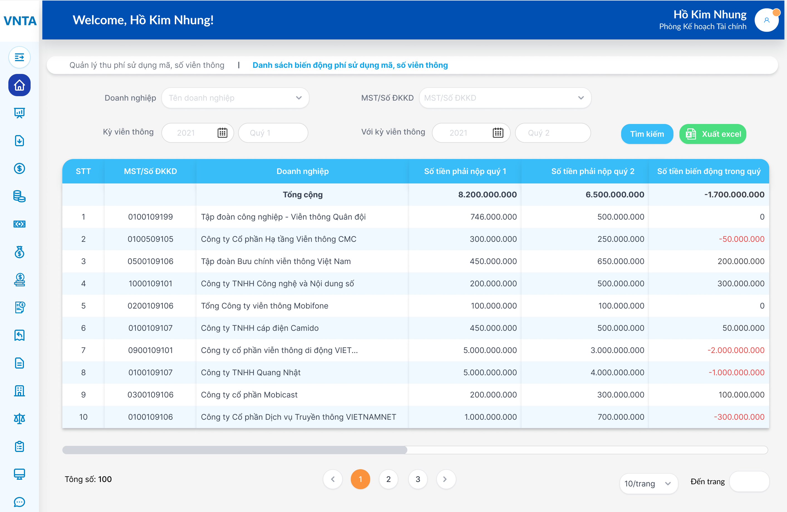

STT

Thông tin

Kiểu dữ liệu

Bắt buộc

Mô tả

Database

1

Tra cứu cơ bản

Tra cứu cơ bản

Tra cứu cơ bản

Tra cứu cơ bản

Tra cứu cơ bản

1.1

Tên doanh nghiệp

combobox search

- Chứa all DN có trong hệ thống.

- Mặc định ko chọn là Chọn tất cả.

- Cho phép người dùng nhập tên DN.

- Autocomplete gõ nhập tên doanh nghiệp hệ thống tự động gợi ý.

- Sắp xếp các option theo thứ tự Mã định danh tăng dần (quy định ngầm trong hệ thống khi thêm mới DN).

- Cho phép chọn 1 hoặc nhiều DN.

1.2

 Mã số thuế/Số ĐKKD

combobox search

- Chứa all Mã số thuế/Số ĐKKD của DN có trong hệ thống.

- Mặc định ko chọn là Chọn tất cả.

- Cho phép nhập Mã số thuế/ Số ĐKKD.

- Autocomplete.

- Cho phép chọn 1 hoặc nhiều mã số thuế/ Số ĐKKD.

1.3

Kỳ viễn thông (1)

datepicker

x

- Cho phép người dùng chọn hoặc nhập kỳ viễn thông.

- Kỳ viễn thông (1) <  kỳ viễn thông (2)

- Đồng nhất giao diện phần tìm kiếm không hiển thị dấu * nhưng có những trường vẫn check bắt buộc

1.4

Kỳ viễn thông (2)

datepicker

x

- Cho phép người dùng chọn hoặc nhập với kỳ viễn thông.

- kỳ viễn thông (2) > Kỳ viễn thông (1)

- Đồng nhất giao diện phần tìm kiếm không hiển thị dấu * nhưng có những trường vẫn check bắt buộc

1.5

Tìm kiếm

button

Tìm kiếm theo các trường thông tin Chọn tên DN; MST/Số ĐKKD; Kỳ viễn thông; Với kỳ viễn thông.

Hệ thống hiển thị kết quả bên dưới bảng

Trường hợp chọn 02 quý không có DN sử dụng mã, số viễn thông, hệ thống hiển thị không có dữ liệu.

1.6

Xuất excel

button

File gồm các cột giống trên giao diện (trừ cột xử lý), tiêu đề của sheet là Theo dõi danh sách biến động phí sử dụng mã, số viễn thông [Qúy] và [Qúy ], tên file: [Ngày xuất]_Theo dõi danh sách biến động phí sử dụng mã, số viễn thông [Qúy] và [Qúy].

2

Grid danh sách

Grid danh sách

Grid danh sách

Grid danh sách

Grid danh sách

2.1

STT

Text

Hiển thị tự sinh, tăng dần.

2.2

MST/Số ĐKKD

Text

Hiển thị mã số thuế/ số đăng ký kinh doanh của DN.

2.3

Tổng cộng

Number

Hiển thị số cộng dồn số tiền all DN phải nộp theo Qúy tương ứng)

2.4

Doanh nghiệp

Text

Hiển thị danh sách DN phải nộp phí sử dụng mã, số viễn thông của 02 Quý đang tìm kiếm.

2.5

Số tiền phải nộp

Quý (n)

(2)

Number

Hiển thị số tiền phải nộp Quý (n) tính theo quý, cộng dồn tính phí tất cả các loại mã mà DN sử dụng phải nộp trong Qúy (n).

Nếu Quý (n) có phí, Quý (n-1) không có phí (có thể do chưa được phân bổ hoặc đã bị thu hồi, hoàn trả …)

=>Số tiền Quý (n-1) = 0

3.6

Số tiền phải nộp

Quý (n-1)

(1)

Number

Hiển thị số tiền phải nộp Quý (n-1) tính theo quý, cộng dồn tính phí tất cả các loại mã mà DN sử dụng phải nộp trong Qúy (n-1).

Nếu Quý (n-1) có phí, Quý (n) không có phí (có thể do bị thu hồi, hoàn trả ...)

=>Số tiền Qúy (n) = 0

3.7

Số tiền biến động trong quý

Number

Hiển thị số tiền phí biến động giữa 2 kỳ viễn thông tương ứng theo từng DN.

Số tiền biến động trong quý

 = Số tiền phải nộp Quý(n) – Số tiền phải nộp Quý (n-1).

4

Phân trang

4.1

Tổng số bản ghi

Text

Hiển thị tổng số bản ghi theo điều kiện tìm kiếm

4.2

Phân trang

button

Gồm các button: Về trang trước đó, 1, 2, 3 (nếu ít trang hơn sẽ tự cắt bớt), trang sau đó

4.3

Số bản ghi trên 1 trang

combobox

Gồm:

10/20/50/100

Mặc định 10 bản ghi trên 1 trang

4.4

Đến trang

Text

- Nhập số trang => hệ thống nhảy đến dữ liệu trang tương ứng

Xem chi tiết thông tin thu phí sử dụng mã, số viễn thông của từng doanh nghiệp

Luồng chức năng

Thông tin chung

Tên chức năng

Xem chi tiết danh sách mã, số viễn thông DN sử dụng trong kỳ.

Mô tả

Chức năng cho phép xem danh sách loại mã số và có thể tìm kiếm loại mã số.

Tác nhân

Lãnh đạo, Cán bộ Phòng KHTC

Điều kiện trước

Đăng nhập vào hệ thống, có phân quyền chức năng

Điều kiện sau

Xem, tìm kiếm được danh sách loại mã, số

Ngoại lệ

N/A

Các yêu cầu đặc biệt

N/A

Luồng chức năng

--	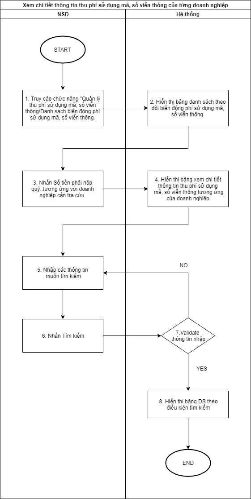

Mô tả luồng xử lý

Bước

Mô tả

Bước 1

NSD truy cập chức năng “Quản lý thu phí sử dụng mã, số viễn thông/ Danh sách biến động phí sử dụng mã, số viễn thông”.

Bước 2

Hệ thống hiển thị giao diện danh sách biến động phí mã, số viễn thông của tất cả các doanh nghiệp phải nộp phí của 1 trong 2 quý tìm kiếm.

Bước 3

NSD nhấn số tiền phải nộp quý… tương ứng với doanh nghiệp cần tra cứu

Bước 4

Hệ thống hiển thị bảng xem chi tiết thông tin thu phí sử dụng mã, số viễn thông tương ứng của doanh nghiệp.

Bước 5

NSD nhập các trường thông tin tiến hành tìm kiếm các thông tin.

Bước 6

Nhấn [Tìm kiếm].

Bước 7

Hệ thống kiểm tra tính hợp lệ thông tin nhập:

- Nếu hợp lệ, chuyển bước 8

- Nếu không hợp lệ, hệ thống đưa ra thông báo tại các trường nhập không hợp lệ. Quay lại bước 5.

Bước 8

Hệ thống hiển thị thông tin chi tiết thu phí sử dụng mã, số của doanh nghiệp theo điều kiện tìm kiếm.

Kết thúc luồng.

Giao diện chức năng

Giao diện tìm kiếm cơ bản

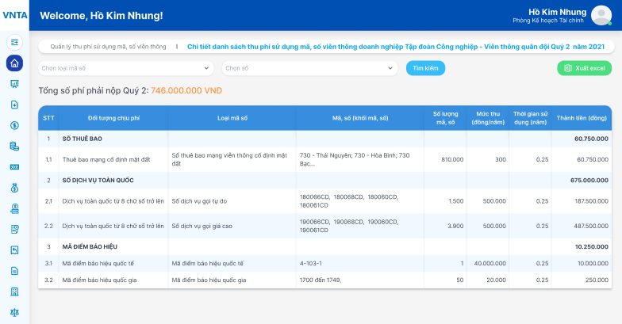

STT

Thông tin

Kiểu dữ liệu

Bắt buộc

Mô tả

Database

1

Tra cứu cơ bản

Tra cứu cơ bản

Tra cứu cơ bản

Tra cứu cơ bản

Tra cứu cơ bản

1.1

Loại mã, số

Combobox

Mặc định là Tất cả

- Gồm tất cả Loại mã, số có trong hệ thống: Sắp xếp danh sách Mã trước Số sau.

- Autocomplete gõ nhập hệ thống tự động gợi ý.

- Cho phép chọn nhiều Loại mã, số.

1.2

Mã, số

Textbox

- Cho phép nhập tìm kiếm mã, số.

1.3

Tìm kiếm

button

Tìm kiếm theo các trường thông tin Mã, số.

Hệ thống hiển thị bảng danh sách bên dưới.

1.4

Xuất excel

button

File gồm các cột giống trên giao diện (trừ cột xử lý), tiêu đề của sheet là Danh sách chi tiết mã, số Doanh nghiệp phải nộp phí [Quý] tên file: [Ngày xuất]_Danh sách chi tiết mã, số Doanh nghiệp phải nộp phí [Quý]

2

Grid danh sách

Grid danh sách

Grid danh sách

Grid danh sách

Grid danh sách

2.1

STT

Text

Hiển thị tự sinh, tăng dần.

2.2

Đối tượng chịu phí

Text

- Hiển thị tên Đối tượng chịu phí.

2.3

Loại mã, số

Text

- Hiển thị loại mã, số

2.4

Mã, số (khối mã, số)

Text

- Hiển thị khối mã, số

2.5

Số lượng mã, số

Number

- Hiển thị số lượng mã, số tương ứng với từng Loại mã, số.

2.6

Mức thu (đồng/năm)

Currency

- Hiển thị mức thu (đồng /năm)

- Hiển thị đúng theo mức thu với thời gian áp dụng tương ứng.

+ VD: Qúy 1 áp dụng 500tr/năm => hiển thị mức thu Qúy 1 là 500tr/năm

+ Qúy 2 áp dựng 400tr/năm => hiển thị mức thu Qúy 2 là 400tr giữ nguyên Qúy 1 là 500tr.

2.7

Thời gian sử dụng (năm)

Currency

- Hiển thị 1 quý = 0.25 (năm)

2.8

Thành tiền (đồng)

Currency

- Hiển thị số tiền DN phải nộp trong 1 quý.

- Số tiền phải nộp trong 1 quý được tính như sau:

Thành tiền = Số lượng mã, số × Mức thu × Thời gian sử dụng (0.25 ~ 1 Quý)

--

Xem danh sách Theo dõi thu phí sử dụng mã, số viễn thông

Luồng chức năng

Thông tin chung

Tên chức năng

Xem danh sách Theo dõi thu phí sử dụng mã, số viễn thông

Mô tả

Chức năng cho phép xem thông tin danh sách theo dõi thu phí sử dụng mã, số viễn thông của tất cả các doanh nghiệp theo Qúy.

Có thể tìm kiếm theo doanh nghiệp.

Tác nhân

Lãnh đạo, Cán bộ Phòng KHTC

Điều kiện trước

Đăng nhập vào hệ thống, có phân quyền chức năng

Điều kiện sau

Xem, tìm kiếm được danh sách Theo dõi thu phí sử dụng mã, số viễn thông của tất cả doanh nghiệp.

Ngoại lệ

N/A

Các yêu cầu đặc biệt

N/A

Luồng chức năng

--

--

--

--

--

--

--

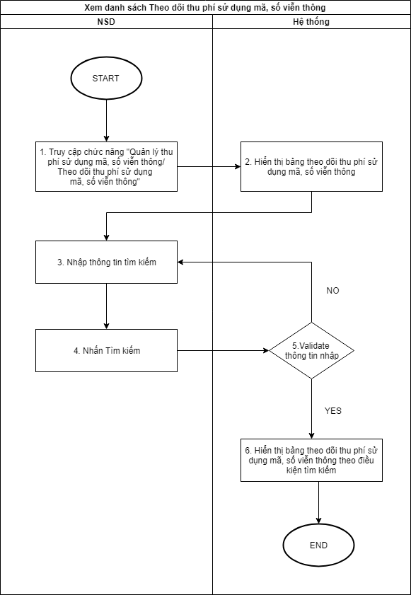

Mô tả luồng xử lý

Bước

Mô tả

Bước 1

NSD truy cập chức năng “Quản lý thu phí sử dụng mã, số viễn thông/ Theo dõi thu phí sử dụng mã, số viễn thông”.

Bước 2

Hệ thống hiển thị giao diện danh sách theo dõi thu phí sử dụng mã, số viễn thông của tất cả các doanh nghiệp theo Qúy.

Bước 3

NSD nhập các trường thông tin tiến hành tìm kiếm các thông tin.

Bước 4

Nhấn [Tìm kiếm].

Bước 5

Hệ thống kiểm tra tính hợp lệ thông tin nhập:

- Nếu hợp lệ, chuyển bước 6

- Nếu không hợp lệ, hệ thống đưa ra thông báo tại các trường nhập không hợp lệ. Quay lại bước 3.

Bước 6

Hệ thống hiển thị danh sách Theo dõi thu phí sử dụng mã, số theo điều kiện tìm kiếm.

Kết thúc luồng.

--

Giao diện chức năng

Giao diện tìm kiếm cơ bản

--

--

--

--	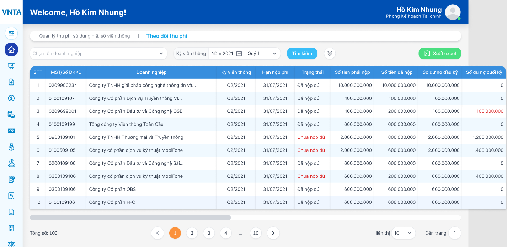

Giao diện tìm kiếm nâng cao

--	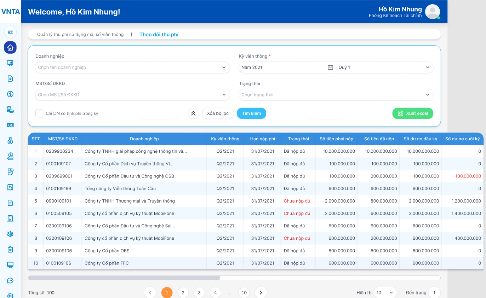

STT

Thông tin

Kiểu dữ liệu

Bắt buộc

Mô tả

Database

1

Tra cứu rút gọn

Tra cứu rút gọn

Tra cứu rút gọn

Tra cứu rút gọn

Tra cứu rút gọn

1.1

Tên doanh nghiệp

combobox search

- Chứa all DN có trong hệ thống.

- Mặc định ko chọn là Chọn tất cả.

- Cho phép người dùng nhập tên DN

- Autocomplete gõ nhập tên doanh nghiệp hệ thống tự động gợi ý.

- Sắp xếp các option theo thứ tự Mã định danh tăng dần (quy định ngầm trong hệ thống khi thêm mới DN).

-  Cho phép chọn 1 hoặc nhiều DN.

1.2

Kỳ viễn thông

Năm

datepicker

x

- Mặc định hiển thị năm của Quý gần nhất trước đó so với Quý hiện tại.

- Cho phép người dùng chọn năm cần xem thông tin phí.

Quý

combobox

 x

- Mặc định hiển thị Quý gần nhất trước đó so với Quý hiện tại.

- Cho phép chọn quý theo năm tương ứng để xem phí sử dụng mã, số viễn thông của DN.

- Gồm:

+ Quý 1

+ Quý 2

+ Quý 3

+ Quý 4

1.3

Tìm kiếm

button

Tìm kiếm theo các trường thông tin Chọn tên DN; Năm, quý. Hệ thống hiển thị bảng danh sách bên dưới.

1.4

Icon Tìm kiếm nâng cao

Button

- Nhấn hệ thống xổ xuống các tiêu chí Tìm kiếm nâng cao

- Ngược lại khi hiển thị các tiêu chí nâng cao, nhấn icon sẽ thu gọn lại.

1.5

Xuất excel

Button

File gồm các cột giống trên giao diện (trừ cột xử lý), tiêu đề của sheet là Theo dõi thu phí sử dụng mã, số viễn thông [Quý], tên file: [Ngày xuất]_Theo dõi thu phí sử dụng mã, số viễn thông [Quý]

2

Tìm kiếm nâng cao

Tìm kiếm nâng cao

Tìm kiếm nâng cao

Tìm kiếm nâng cao

Tìm kiếm nâng cao

2.1

Doanh nghiệp

combobox search

- Chứa all DN có trong hệ thống.

- Mặc định ko chọn là Chọn tất cả.

- Cho phép người dùng nhập tên DN

- Autocomplete gõ nhập tên doanh nghiệp hệ thống tự động gợi ý.

- Sắp xếp các option theo thứ tự Mã định danh tăng dần (quy định ngầm trong hệ thống khi thêm mới DN).

-  Cho phép chọn 1 hoặc nhiều DN.

2.2

 Mã số thuế/Số ĐKKD

combobox search

- Chứa all Mã số thuế/Số ĐKKD của all DN có trong hệ thống.

- Mặc định ko chọn là Chọn tất cả

- Cho phép nhập Mã số thuế/ Số ĐKKD

- Autocomplete

-  Cho phép chọn 1 hoặc nhiều

Mã số thuế/ Số ĐKKD

2.3

Kỳ viễn thông

Năm

datepicker

x

- Mặc định hiển thị năm của Quý gần nhất trước đó so với Quý hiện tại.

- Cho phép người dùng chọn năm cần xem thông tin phí.

Quý

combobox

 x

- Mặc định hiển thị Quý gần nhất trước đó so với Quý hiện tại.

- Cho phép chọn quý theo năm tương ứng để xem phí sử dụng mã, số viễn thông của DN.

- Gồm:

+ Quý 1

+ Quý 2

+ Quý 3

+ Quý 4

2.4

Trạng thái

Combobox

- Gồm: Đã nộp đủ/Chưa nộp đủ.

- Mặc định ko chọn là chọn tất cả.

2.5

Chỉ DN có tính phí trong kỳ

Checkbox

Nếu tích chọn thì hiển thị chỉ các DN có sử dụng mã, số trong kỳ đang chọn và theo các tiêu chí tìm kiếm khác. (Khi tích chọn, các DN ko có sử dụng mã, số trong kỳ nhưng có số dư nợ đầu kỳ sẽ không hiển thị ra).

2.6

Xóa điều kiện

Button

Nhấn [Xóa điều kiện], hệ thống xóa toàn bộ dữ liệu tiêu chí tìm kiếm đã nhập, giữ nguyên kết quả tìm kiếm

2.7

Tìm kiếm

Button

Nhấn [Tìm kiếm], hệ thống check hợp lệ của điều kiện tìm kiếm và trả danh sách kết quả.

2.8

Xuất excel

button

File gồm các cột giống trên giao diện (trừ cột xử lý), tiêu đề của sheet là Theo dõi thu phí sử dụng mã, số viễn thông [Quý], tên file: [Ngày xuất]_Theo dõi thu phí sử dụng mã, số viễn thông [Quý]

3

Grid danh sách

Grid danh sách

Grid danh sách

Grid danh sách

Grid danh sách

3.1

STT

Number

Hiển thị STT.

- Tự sinh, tăng dần

3.2

MST/Số ĐKKD

Text

Hiển thị mã số thuế/số đăng ký kinh doanh của DN.

3.3

Doanh nghiệp

Text

Hiển thị tên DN.

3.4

Kỳ viễn thông

Text

Định dạng hiển thị:

--	“Qx/yyyy” đối với kỳ quý.

3.5

Hạn nộp phí

date

Ghi nhận từ Hạn nộp phí khi xuất công văn, nếu xuất lại cv Hạn nộp phí sẽ được update theo.

3.6

Trạng thái

Text

Hiển thị “Chưa nộp đủ” hoặc “Đã nộp đủ”

- Đã nộp đủ: Font chữ màu đen. Khi Số đã nộp >= Số phải nộp.

+ Tính theo số biên lai nhập vào phân bổ cho Qúy tương ứng.

- Chưa nộp đủ: Font chữ màu đỏ, (khi chưa nộp đủ phí của Quý tương ứng.)

3.7

Số tiền phải nộp

Currency

- Hiển thị số phải nộp trong Quý mà DN phải nộp.

- Số tiền phải nộp = Số lượng mã, số × Mức thu × Thời gian sử dụng (0.25 = 1 quý).

- Nếu là số thập phân làm tròn chỉ lấy phần nguyên, phần thập phân >=5 sẽ làm tròn phần số nguyên lên 1 đơn vị, ngược lại giữ nguyên phần số nguyên ko làm tròn nếu phần thập phân<5

3.12

Số tiền đã nộp

Currency

Số tiền DN đã nộp (tính theo phân bổ cho Kỳ viễn thông)

- Nếu chưa nộp sẽ hiển thị số 0

3.13

Số dư nợ đầu kỳ

Currency

= Số tiền nợ của DN tính tại thời điểm đầu kỳ.

- Nếu DN đã nộp đủ tiền các kỳ trước thì hiển thị “0”.

- Nếu DN chưa có GP/QĐ kỳ trước thì hiển thị dấu “-”.

- Nếu là số thập phân làm tròn chỉ lấy phần nguyên, phần thập phân >=5 sẽ làm tròn phần số nguyên lên 1 đơn vị, ngược lại giữ nguyên phần số nguyên ko làm tròn nếu phần thập phân<5

3.14

Số dư nợ cuối kỳ

Currency

- Bằng số phải nộp trừ số đã nộp + Số dư nợ đầu kỳ

- Nếu là số thập phân làm tròn chỉ lấy phần nguyên, phần thập phân >=5 sẽ làm tròn phần số nguyên lên 1 đơn vị, ngược lại giữ nguyên phần số nguyên ko làm tròn nếu phần thập phân<5

4

Phân trang

4.1

Tổng số bản ghi

Text

Hiển thị tổng số bản ghi theo điều kiện tìm kiếm

4.2

Phân trang

button

Gồm các button: Về trang trước đó, 1, 2, 3 (nếu ít trang hơn sẽ tự cắt bớt), trang sau đó

4.3

Số bản ghi trên 1 trang

combobox

Gồm:

10/20/50/100

Mặc định 10 bản ghi trên 1 trang

4.4

Đến trang

Text

- Nhập số trang => hệ thống nhảy đến dữ liệu trang tương ứng

Xem báo cáo Theo dõi công nợ theo kỳ viễn thông

Luồng chức năng

Thông tin chung

Tên chức năng

Xem báo cáo Theo dõi công nợ theo kỳ viễn thông

Mô tả

Chức năng cho phép xem báo cáo công nợ tính theo kỳ viễn thông của các DN sử dụng mã, số viễn thông

Tác nhân

Lãnh đạo, Cán bộ Phòng KHTC

Điều kiện trước

Đăng nhập vào hệ thống, có phân quyền chức năng

Điều kiện sau

Xem, tìm kiếm được các báo cáo công nợ từng kỳ viễn thông.

Ngoại lệ

N/A

Các yêu cầu đặc biệt

N/A

Luồng chức năng

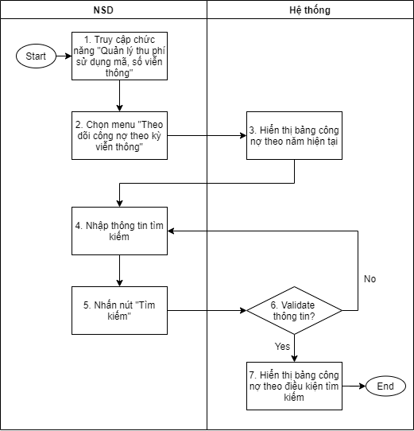

Bước

Mô tả

Bước 1

NSD truy cập chức năng "Quản lý thu phí sử dụng mã, số viễn thông".

Bước 2

Chọn menu "Theo dõi công nợ theo kỳ viễn thông".

Bước 3

Hiển thị bảng công nợ theo năm hiện tại.

Bước 4

NSD nhập các thông tin tìm kiếm tại các trường dữ liệu tương ứng.

Bước 5

Nhấn [Tìm kiếm].

Bước 6

Hệ thống kiểm tra tính hợp lệ thông tin nhập, nếu có lỗi hệ thống đưa ra thông báo tại các trường nhập không hợp lệ, quay lại bước 4, ngược lại tiếp tục bước 7

Bước 7

Hệ thống hiển thị bảng công nợ theo điều kiện tìm kiếm.

Kết thúc luồng.

Giao diện chức năng

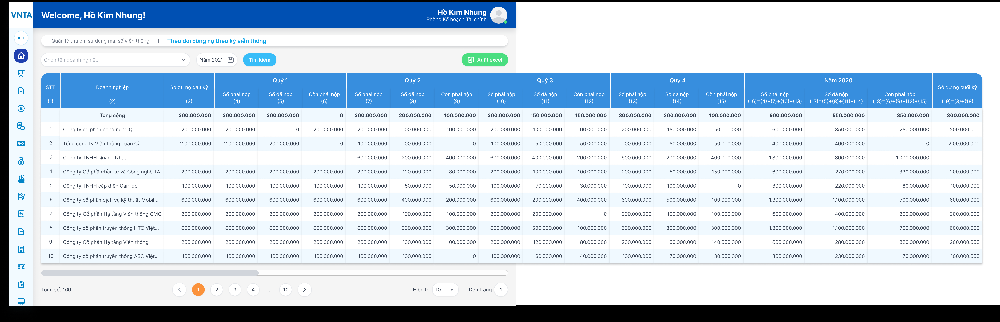

STT

Thông tin

Thông tin

Kiểu dữ liệu

Bắt buộc

Mô tả

Database

1

Chọn tên doanh nghiệp

Chọn tên doanh nghiệp

combobox search

- Gồm tất cả các DN đã có quyết định phân bổ mã, số viễn thông.

- Cho phép người dùng nhập tên DN, chọn 1 hoặc nhiều DN.

- Autocomplete gõ nhập tên doanh nghiệp hệ thống tự động gợi ý.

- Sắp xếp các option theo thứ tự Mã định danh tăng dần (quy định ngầm trong hệ thống khi thêm mới DN).

2

Chọn năm

Chọn năm

datepicker

x

- Cho phép chọn năm.

- Mặc định hiển thị năm hiện tại

3

Tìm kiếm

Tìm kiếm

Button

Nhấn => hệ thống kiểm tra tính chính xác của dữ liệu tìm kiếm và đưa ra kết quả tại bảng dưới.

4

Xuất excel

Xuất excel

Button

Nhấn => hệ thống tải về file excel bao gồm danh sách công nợ NSD đang tìm kiếm.

File gồm các cột giống trên giao diện, tiêu đề của sheet là Theo dõi công nợ theo Kỳ viễn thông [năm], tên file: [Ngày xuất]_ Công nợ phí sử dụng mã, số theo kỳ viễn thông [năm]

5

Grid danh sách

Grid danh sách

Grid danh sách

Grid danh sách

Grid danh sách

Grid danh sách

Grid danh sách

5.1

STT

STT

Text

Số thứ tự

5.2

Doanh nghiệp

Doanh nghiệp

Text

Hiển thị tên doanh nghiệp

5.3

Số dư nợ đầu kỳ

Số dư nợ đầu kỳ

Currency

Số tiền thừa/ thiếu tính đến hết năm trước năm tìm kiếm

5.4

Quý …

Số phải nộp

Currency

Hiển thị số tiền doanh nghiệp phải nộp trong từng quý.

Định dạng: Dấu “.” ngăn cách hàng nghìn

Đơn vị: VNĐ

- Nếu là số thập phân làm tròn chỉ lấy phần nguyên, phần thập phân >=5 sẽ làm tròn phần số nguyên lên 1 đơn vị, ngược lại giữ nguyên phần số nguyên ko làm tròn nếu phần thập phân<5

5.5

Quý …

Số đã nộp

Currency

Hiển thị số tiền doanh nghiệp đã nộp cập nhật theo số liệu biên lai nộp cho quý.

Nếu chưa có dữ liệu hiển thị số 0

Định dạng: Dấu “.” ngăn cách hàng nghìn

Đơn vị: VNĐ

5.6

Quý …

Còn phải nộp

Currency

Hiển thị số tiền doanh nghiệp còn phải nộp cho quý = Số phải nộp – Số đã nộp.

Định dạng: Dấu “.” ngăn cách hàng nghìn

Đơn vị: VNĐ

- Nếu là số thập phân làm tròn chỉ lấy phần nguyên, phần thập phân >=5 sẽ làm tròn phần số nguyên lên 1 đơn vị, ngược lại giữ nguyên phần số nguyên ko làm tròn nếu phần thập phân<5

5.7

Năm

Số phải nộp

Currency

= Tổng Số phải nộp của 4 quý cộng lại.

Định dạng: Dấu “.” ngăn cách hàng nghìn

Đơn vị: VNĐ

- Nếu là số thập phân làm tròn chỉ lấy phần nguyên, phần thập phân >=5 sẽ làm tròn phần số nguyên lên 1 đơn vị, ngược lại giữ nguyên phần số nguyên ko làm tròn nếu phần thập phân<5

5.8

Năm

Số đã nộp

Currency

= Tổng Số đã nộp của 4 quý cộng lại.

Hiển thị số tiền doanh nghiệp đã nộp cập nhật theo số liệu biên lai.

Nếu chưa có dữ liệu hiển thị số 0.

Định dạng: Dấu “.” ngăn cách hàng nghìn.

Đơn vị: VNĐ.

5.9

Năm

Còn phải nộp

Currency

= Số phải nộp – Số đã nộp.

Định dạng: Dấu “.” ngăn cách hàng nghìn

Đơn vị: VNĐ

- Nếu là số thập phân làm tròn chỉ lấy phần nguyên, phần thập phân >=5 sẽ làm tròn phần số nguyên lên 1 đơn vị, ngược lại giữ nguyên phần số nguyên ko làm tròn nếu phần thập phân<5

6

Số dư nợ cuối kỳ

Số dư nợ cuối kỳ

Currency

= Số tiền phải nộp 4 Qúy - (Số dư nợ đầu kỳ + số tiền đã nộp 4 quý)

7

Phân trang

Phân trang

Phân trang

Phân trang

Phân trang

Phân trang

7.1

Tổng số bản ghi

Tổng số bản ghi

Text

Hiển thị tổng số bản ghi theo điều kiện tìm kiếm.

7.2

Phân trang

Phân trang

button

Gồm các button: Về trang trước đó, 1, 2, 3 (nếu ít trang hơn sẽ tự cắt bớt), trang sau đó

7.3

Số bản ghi trên 1 trang

Số bản ghi trên 1 trang

combobox

Gồm:

10/20/50/100

Mặc định 10 bản ghi trên 1 trang.

7.4

Đến trang

Đến trang

Text

- Nhập số trang => hệ thống nhảy đến dữ liệu trang tương ứng

--	10.5 Xem báo cáo theo dõi công nợ kế toán

Luồng chức năng

Thông tin chung

Tên chức năng

Xem báo cáo theo dõi công nợ kế toán

Mô tả

Chức năng cho phép cán bộ P. KHTC theo dõi số dư nợ theo năm của tất cả doanh nghiệp sử dụng mã, số viễn thông.

Tác nhân

Lãnh đạo, Cán bộ Phòng KHTC

Điều kiện trước

Đăng nhập vào hệ thống, có phân quyền chức năng

Điều kiện sau

Xem báo cáo theo dõi công nợ theo kỳ kế toán thành công

Ngoại lệ

N/A

Các yêu cầu đặc biệt

N/A

Luồng chức năng

--

--

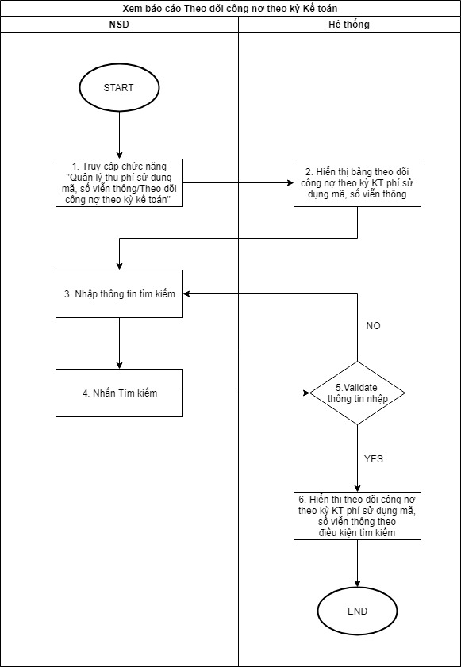

Mô tả luồng xử lý

Bước

Mô tả

Bước 1

NSD truy cập chức năng “Theo dõi công nợ - Kỳ KT” trong module “Quản lý thu phí sử dụng mã, số viễn thông”.

Bước 2

Hệ  thống mặc định hiển thị bảng theo dõi công nợ theo kỳ kế toán của phí sử dụng mã, số viễn thông năm hiện tại.

Bước 3

NSD tiến hành nhập thông tin tìm kiếm khi muốn tìm kiếm số liệu công nợ theo từng DN hoặc kì phí khác.

Bước 4

Nhấn [Tìm kiếm]

Bước 5

Hệ thống kiểm tra thông tin nhập:

- Nếu không hợp lệ, chuyển bước 3

- Nếu hợp lệ, chuyển bước 6

Bước 6

Hệ thống hiển thị danh sách công nợ bao gồm số dư nợ đầu năm và số phải nộp trong năm

Kết thúc luồng.

Giao diện chức năng

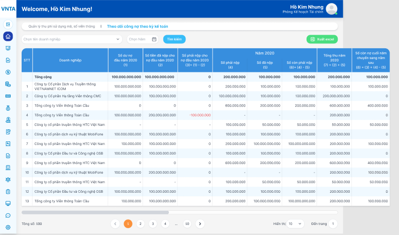

STT

Tên

Tên

Kiểu

dữ liệu

Bắt buộc

Mô tả

Database

Database

1

Tra cứu công nợ

Tra cứu công nợ

Tra cứu công nợ

Tra cứu công nợ

Tra cứu công nợ

Tra cứu công nợ

Tra cứu công nợ

1.1

Tên doanh nghiệp

Tên doanh nghiệp

Combobox search

- Gồm all DN có sử dụng mã, số viễn thông.

- Cho phép nhập tên doanh nghiệp.

- Autocomplete.

- Sắp xếp các option theo thứ tự Mã định danh tăng dần (quy định ngầm trong hệ thống khi thêm mới).

- Cho phép chọn 1 hoặc nhiều DN.

1.2

Năm

Năm

Datepicker

x

Cho phép NSD chọn năm báo cáo.

1.3

Tìm kiếm

Tìm kiếm

Button

Nhấn => hệ thống kiểm tra tính chính xác của dữ liệu tìm kiếm và đưa ra kết quả tại bảng dưới.

2

Xuất excel

Xuất excel

Button

Nhấn => hệ thống tải về file excel bao gồm danh sách công nợ NSD đang tìm kiếm.

File gồm các cột giống trên giao diện (trừ cột xử lý), tiêu đề của sheet là Theo dõi công nợ theo Kỳ kế toán phí sử dụng mã, số viễn thông [năm], tên file: [Ngày xuất]_Theo dõi công nợ theo Kỳ kế toán phí sử dụng mã, số viễn thông [năm] …

3

Bảng theo dõi công nợ theo kỳ kế toán năm …

Grid danh sách

Bảng theo dõi công nợ theo kỳ kế toán năm …

Grid danh sách

Bảng theo dõi công nợ theo kỳ kế toán năm …

Grid danh sách

Bảng theo dõi công nợ theo kỳ kế toán năm …

Grid danh sách

Bảng theo dõi công nợ theo kỳ kế toán năm …

Grid danh sách

Bảng theo dõi công nợ theo kỳ kế toán năm …

Grid danh sách

Bảng theo dõi công nợ theo kỳ kế toán năm …

Grid danh sách

1

STT (1)

STT (1)

Số thứ tự

2

Doanh nghiệp (2)

Doanh nghiệp (2)

Text

- Hiển thị tên doanh nghiệp

- Hiển thị all DN còn số dư nợ đầu năm (thừa hoặc thiếu) hoặc trong năm phát sinh phí sử dụng mã, số viễn thông theo năm tìm kiếm.

3

Số dư nợ đầu năm … (3)

Số dư nợ đầu năm … (3)

Currency

- Số tiền DN còn nợ tính từ những năm về trước đến hết năm trước năm báo cáo

- Nếu những năm trước đó không có phí phải nộp (nhưng năm đang tìm kiếm có phí phải nộp)

=> Hệ thống hiển thị phí phải nộp Số dư nợ đầu năm dấu “-”

- Nếu những năm trước đó có số dư nợ, năm đang tìm kiếm không phải nộp phí sử dụng mã, số viễn thông

=>Hệ thống hiển thị phí phải nộp năm đang tìm kiếm là dấu “-”

- Nếu là số thập phân làm tròn chỉ lấy phần nguyên, phần thập phân >=5 sẽ làm tròn phần số nguyên lên 1 đơn vị, ngược lại giữ nguyên phần số nguyên ko làm tròn nếu phần thập phân<5

4

Số tiền đã nộp cho nợ đầu năm … (4)

Số tiền đã nộp cho nợ đầu năm … (4)

Currency

- Số tiền DN đã nộp cho nợ những năm về trước đến hết năm trước năm báo cáo (ngày biên lai từ 01/01/năm báo cáo - 31/12/năm báo cáo).

- Nếu Số nợ đầu năm hiển thị dấu “-” => Số đã nộp sẽ hiển thị dấu “-”

- Nếu Số dư nợ đầu năm>=0 mà chưa nộp tiền => Số đã nộp hiển thị “0”

5

Số còn phải nộp cho nợ đầu năm … (5) = (3)-(4)

Số còn phải nộp cho nợ đầu năm … (5) = (3)-(4)

Curency

= Số dư nợ đầu năm - Số tiền đã nộp cho nợ đầu năm

- Nếu Số nợ đầu năm hiển thị dấu “-” => Số còn phải nộp sẽ hiển thị dấu “-”

- Nếu là số thập phân làm tròn chỉ lấy phần nguyên, phần thập phân >=5 sẽ làm tròn phần số nguyên lên 1 đơn vị, ngược lại giữ nguyên phần số nguyên ko làm tròn nếu phần thập phân<5

6

Năm …

Năm …

Năm tìm kiếm

7

Số phải nộp (6)

Currency

Số tiền DN phải nộp được tính từ Quý 4 năm trước tới hết Quý 3 của năm sau.

Nếu DN không phải nộp phí trong năm đang tìm kiếm => hiển thị dấu “-”

Định dạng: Dấu “.” ngăn cách hàng nghìn

Đơn vị: VNĐ

- Nếu là số thập phân làm tròn chỉ lấy phần nguyên, phần thập phân >=5 sẽ làm tròn phần số nguyên lên 1 đơn vị, ngược lại giữ nguyên phần số nguyên ko làm tròn nếu phần thập phân<5

8

Số đã nộp (7)

Currency

Ghi nhận all biên lại có ngày biên lai từ 01/01/năm báo cáo – 31/12/năm báo cáo nộp cho Quý 4 (năm báo cáo -1) trở đi.

Định dạng: Dấu “.” ngăn cách hàng nghìn

Đơn vị: VNĐ

9

Số còn phải nộp

(8)=(6)-(7)

Số còn phải nộp

(8)=(6)-(7)

Currency

= Số phải nộp – Số đã nộp

- Nếu là số thập phân làm tròn chỉ lấy phần nguyên, phần thập phân >=5 sẽ làm tròn phần số nguyên lên 1 đơn vị, ngược lại giữ nguyên phần số nguyên ko làm tròn nếu phần thập phân<5

10

Tổng thu năm … (9) = (4) + (7)

Tổng thu năm … (9) = (4) + (7)

Currency

= (2) + (5)

Định dạng: Dấu “.” ngăn cách hàng nghìn

Đơn vị: VNĐ

13

Số còn nợ cuối năm chuyển năm sau (10)= (5) + (8)

Số còn nợ cuối năm chuyển năm sau (10)= (5) + (8)

Curency

(8)= (3) + (4) – (5)

Định dạng: Dấu “.” ngăn cách hàng nghìn

Đơn vị: VNĐ

- Nếu là số thập phân làm tròn chỉ lấy phần nguyên, phần thập phân >=5 sẽ làm tròn phần số nguyên lên 1 đơn vị, ngược lại giữ nguyên phần số nguyên ko làm tròn nếu phần thập phân<5

14

Dòng Tổng cộng

Dòng Tổng cộng

Curency

Cộng dồn theo cột all các DN theo tiêu chí tìm kiếm

15

Phân trang

Phân trang

15.1

Tổng số bản ghi

Tổng số bản ghi

Text

Hiển thị tổng số bản ghi theo điều kiện tìm kiếm

15.2

Phân trang

Phân trang

button

Gồm các button: Về trang trước đó, 1, 2, 3, 4, 5 (nếu ít trang hơn sẽ tự cắt bớt), trang sau đó

15.3

Số bản ghi trên 1 trang

Số bản ghi trên 1 trang

combobox

Gồm:

10/20/50/100

Mặc định 10 bản ghi trên 1 trang

15.4

Đến trang

Đến trang

Text

- Nhập số trang => hệ thống nhảy đến dữ liệu trang tương ứng

	6)	 Xem báo cáo Theo dõi công nợ lũy kế

Luồng chức năng

Thông tin chung

Tên chức năng

Xem báo cáo Theo dõi công nợ lũy kế.

Mô tả

Chức năng cho phép xem báo cáo công nợ theo giai đoạn của các DN sử dụng mã, số viễn thông.

Tác nhân

Lãnh đạo, Cán bộ Phòng KHTC.

Điều kiện trước

Đăng nhập vào hệ thống, có phân quyền chức năng.

Điều kiện sau

Xem, tìm kiếm được danh sách công nợ theo từng giai đoạn.

Ngoại lệ

N/A

Các yêu cầu đặc biệt

N/A

Luồng chức năng

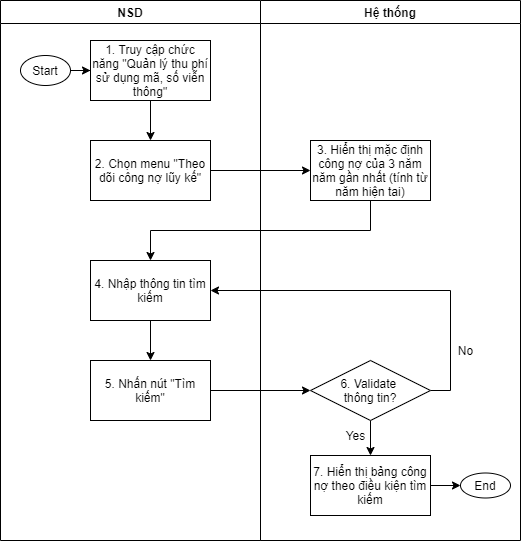

Bước

Mô tả

Bước 1

NSD truy cập chức năng "Quản lý thu phí sử dụng mã, số viễn thông".

Bước 2

Chọn menu "Theo dõi công nợ lũy kế".

Bước 3

Hiển thị bảng công nợ 3 năm gần nhất (tính từ năm hiện tại).

Bước 4

NSD nhập các thông tin tìm kiếm tại các trường dữ liệu tương ứng.

Bước 5

Nhấn [Tìm kiếm].

Bước 6

Hệ thống kiểm tra tính hợp lệ thông tin nhập, nếu có lỗi thì thông báo tại các trường nhập không hợp lệ, quay lại bước 4, ngược lại tiếp tục bước 7

Bước 7

Hệ thống hiển thị bảng công nợ theo điều kiện tìm kiếm.

Kết thúc luồng.

Giao diện chức năng

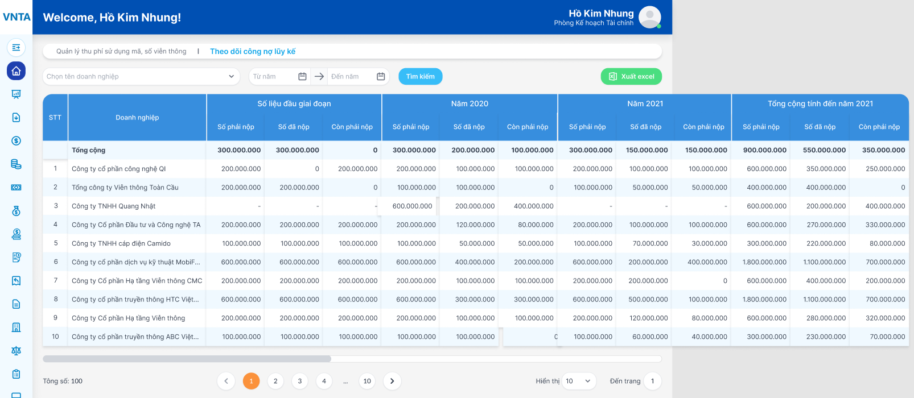

STT

Thông tin

Kiểu dữ liệu

Bắt buộc

Mô tả

Database

1

Chọn tên doanh nghiệp

Combobox search

- Gồm tất cả các DN có trong hệ thống.

- Cho phép người dùng nhập tên DN, chọn 1 hoặc nhiều DN.

- Autocomplete gõ nhập tên doanh nghiệp hệ thống tự động gợi ý.

- Sắp xếp các option theo thứ tự Mã định danh tăng dần (quy định ngầm trong hệ thống khi thêm mới DN).

2

Từ năm

datepicker

x

- Autofill giai đoạn 3 năm gần nhất.

- Cho phép chọn năm.

- “Từ năm” <= “Đến năm”.

3

Đến năm

datepicker

x

- Autofill giai đoạn 3 năm gần nhất.

- Cho phép chọn năm.

- “Đến năm” >= “Từ năm”

4

Tìm kiếm

button

Nhấn để bắt đầu tìm kiếm theo thông tin tra cứu.

5

Xuất excel

button

- Cho phép NSD tải file excel danh sách đang hiển thị.

- File gồm các cột giống trên giao diện, tiêu đề của sheet là “Theo dõi công nợ lũy kế phí sử dụng mã, số từ [năm] đến [năm], tên file: [Ngày xuất]_ Theo dõi công nợ lũy kế phí sử dụng mã, số viễn thông từ [năm] đến [năm]

6

Grid

Grid

Grid

Grid

Grid

6.1

STT

number

Hiển thị STT

6.2

Doanh nghiệp

Varchar

Hiển thị tên doanh nghiệp

6.3

Số liệu đầu giai đoạn

Số liệu đầu giai đoạn

Số liệu đầu giai đoạn

Số liệu đầu giai đoạn

Số liệu đầu giai đoạn

6.3.1

Số phải nộp

Currency

Tổng phí phải nộp tính từ thời điểm bắt đầu sử dụng mã, số viễn thông đến thời điểm đầu giai đoạn đang chọn (tính đến hết năm trước năm đầu giai đoạn đang thống kê).

- Nếu là số thập phân làm tròn chỉ lấy phần nguyên, phần thập phân >=5 sẽ làm tròn phần số nguyên lên 1 đơn vị, ngược lại giữ nguyên phần số nguyên ko làm tròn nếu phần thập phân<5.

- Nếu không có GP trong năm đó thì hiển thị dấu “-”

6.3.2

Số đã nộp

Currency

Tổng phí đã nộp tính từ thời điểm bắt đầu sử dụng dịch vụ đến thời điểm đầu giai đoạn đang chọn. (tính đến hết năm trước năm đầu giai đoạn đnag thống kê).

6.3.3

Còn phải nộp

Currency

= Số phải nộp – Số đã nộp

- Nếu là số thập phân làm tròn chỉ lấy phần nguyên, phần thập phân >=5 sẽ làm tròn phần số nguyên lên 1 đơn vị, ngược lại giữ nguyên phần số nguyên ko làm tròn nếu phần thập phân<5.

6.4

Năm…

Năm…

Năm…

Năm…

Năm…

6.4.2

Số phải nộp

Currency

Số phí phải nộp cho năm (tổng 4 quý) sử dụng mã, số viễn thông (tham khảo mô tả chức năng “Xem danh sách Doanh nghiệp P. KHTC cần xuất công văn”.

- Nếu là số thập phân làm tròn chỉ lấy phần nguyên, phần thập phân >=5 sẽ làm tròn phần số nguyên lên 1 đơn vị, ngược lại giữ nguyên phần số nguyên ko làm tròn nếu phần thập phân<5.

- Nếu không có GP trong năm đó thì hiển thị dấu “-”

6.4.3

Số đã nộp

Currency

Số phí đã nộp cho năm (tổng 4 quý) căn cứ trên việc nộp cho Kỳ viễn thông Qúy, không dựa trên Ngày biên lai.

Số liệu tổng hợp từ chức năng “Quản lý biên lai”.

Nếu chưa có số liệu => hiển thị số 0.

6.4.4

Còn phải nộp

Currency

= số phải nộp – số đã nộp

- Nếu là số thập phân làm tròn chỉ lấy phần nguyên, phần thập phân >=5 sẽ làm tròn phần số nguyên lên 1 đơn vị, ngược lại giữ nguyên phần số nguyên ko làm tròn nếu phần thập phân<5.

6.5

Tổng cộng tính đến năm ….

Tổng cộng tính đến năm ….

Tổng cộng tính đến năm ….

Tổng cộng tính đến năm ….

Tổng cộng tính đến năm ….

6.5.1

Số phải nộp

Currency

Số phí phải nộp tính từ thời điểm DN bắt đầu sử dụng mã, số viễn thông đến thời điểm kết thúc giai đoạn đang chọn.

- Nếu là số thập phân làm tròn chỉ lấy phần nguyên, phần thập phân >=5 sẽ làm tròn phần số nguyên lên 1 đơn vị, ngược lại giữ nguyên phần số nguyên ko làm tròn nếu phần thập phân<5.

6.5.2

Số đã nộp

Currency

Số phí đã nộp tính từ thời điểm DN bắt đầu sử dụng dịch vụ đến thời điểm kết thúc giai đoạn đang chọn.

6.5.3

Còn phải nộp

Currency

= Số phải nộp – Số đã nộp

- Nếu là số thập phân làm tròn chỉ lấy phần nguyên, phần thập phân >=5 sẽ làm tròn phần số nguyên lên 1 đơn vị, ngược lại giữ nguyên phần số nguyên ko làm tròn nếu phần thập phân<5.

6

Phân trang

Phân trang

Phân trang

Phân trang

Phân trang

6.1

Tổng số bản ghi

Text

Hiển thị tổng số bản ghi theo điều kiện tìm kiếm

6.2

Phân trang

button

Gồm các button: Về trang trước đó, 1, 2, 3, 4, 5 (nếu ít trang hơn sẽ tự cắt bớt), về trang sau đó.

6.3

Số bản ghi trên 1 trang

combobox

Gồm:

10/20/50/100

Mặc định 10 bản ghi trên 1 trang.

6.4

Đến trang

Text

- Nhập số trang => hệ thống nhảy đến dữ liệu trang tương ứng.

Quản lý biểu mẫu điện tử

Xem danh sách biểu mẫu điện tử

Luồng chức năng

Thông tin chung

Tên chức năng

Xem danh sách Biểu mẫu điện tử

Mô tả

Chức năng cho phép xem thông tin danh sách các loại biểu mẫu điện tử có trong hệ thống, tương ứng với các loại công văn thu phí, thu lệ phí, công văn thu BCDT

Tác nhân

Lãnh đạo, Cán bộ Phòng KHTC, Phòng CPTN, Phòng Kinh tế

Điều kiện trước

Đăng nhập vào hệ thống, có phân quyền chức năng

Điều kiện sau

Xem, tìm kiếm được danh sách Biểu mẫu điện tử

Ngoại lệ

N/A

Các yêu cầu đặc biệt

N/A

Luồng chức năng

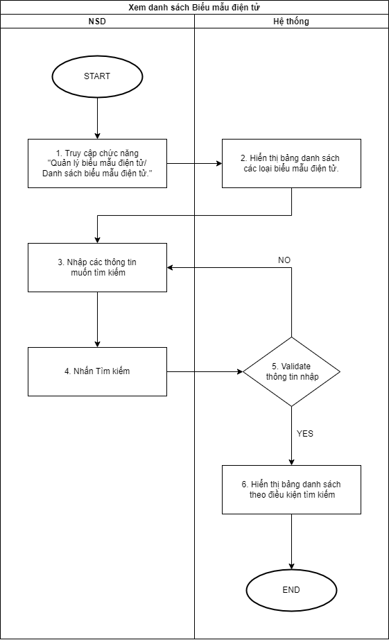

	Mô tả luồng xử lý

Bước

Mô tả

Bước 1

NSD truy cập chức năng “Quản lý biểu mẫu điện tử/Danh sách biểu mẫu điện tử”.

Bước 2

Hệ thống hiển thị giao diện danh sách tất cả các loại biểu mẫu điện tử có trong hệ thống, tương ứng với các loại công văn thu phí, lệ phí, công văn thu BCDT.

Luôn sắp xếp tất cả các biểu mẫu mặc định (không thể xóa) lên đầu tiên; Sau đó sắp xếp thứ tự theo ngày cập nhật.

Bước 3

NSD nhập các trường thông tin muốn tìm kiếm.

Bước 4

Nhấn [Tìm kiếm].

Bước 5

Hệ thống kiểm tra tính hợp lệ thông tin nhập:

- Nếu hợp lệ, chuyển bước 6

- Nếu không hợp lệ, hệ thống đưa ra thông báo tại các trường nhập không hợp lệ. Quay lại bước 3.

Bước 6

Hệ thống hiển thị danh sách biểu mẫu điện tử theo điều kiện tìm kiếm.

Kết thúc luồng.

Giao diện chức năng

Giao diện tìm kiếm cơ bản

--	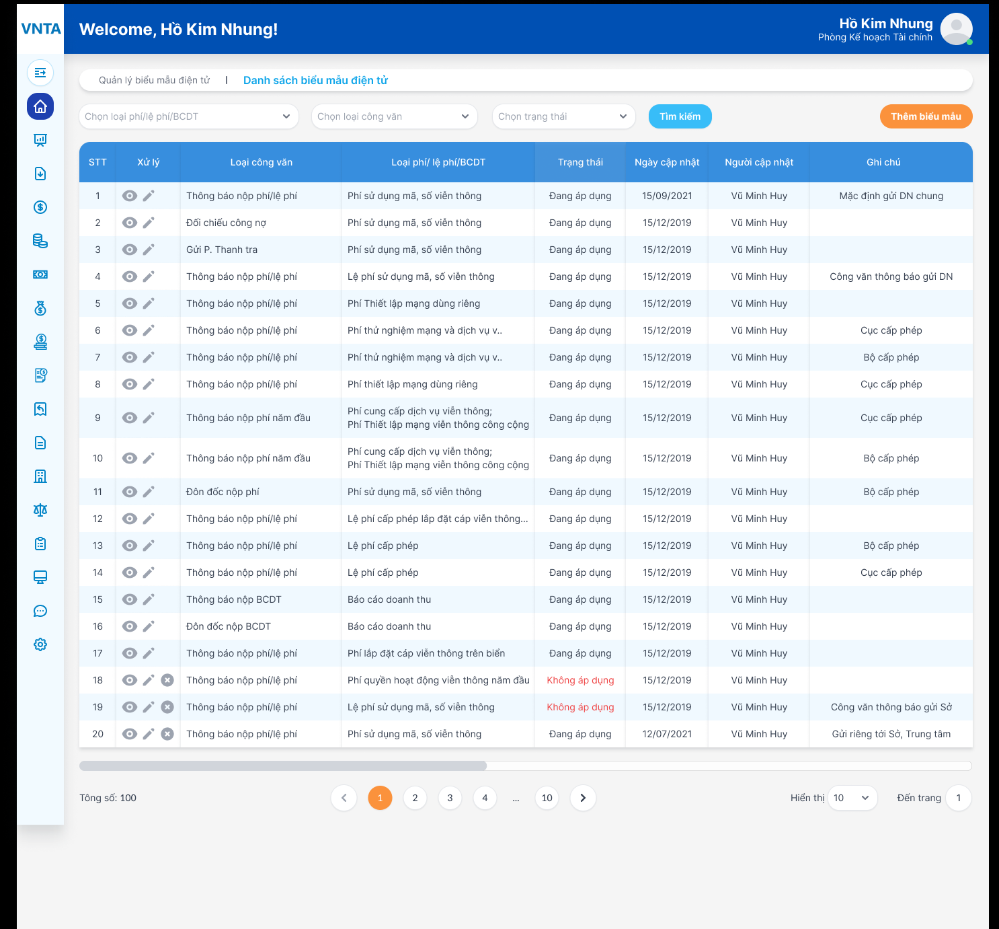

STT

Thông tin

Kiểu

 dữ liệu

Bắt buộc

Mô tả

Database

1

Tra cứu cơ bản

Tra cứu cơ bản

Tra cứu cơ bản

Tra cứu cơ bản

Tra cứu cơ bản

1.1

 Chọn loại phí/lệ phí/BCDT

combobox search

- Chứa all các loại phí/lệ phí/BCDT có trong hệ thống, gồm:

+ Phí cung cấp dịch vụ viễn thông

+ Phí thiết lập mạng viễn thông công cộng

+ Phí sử dụng mã, số viễn thông

+ Phí thử nghiệm mạng và dịch vụ viễn thông

+ Phí thiết lập mạng viễn thông dùng riêng

+ Lệ phí cấp phép

+ Lệ phí phân bổ mã, số viễn thông

+ Lệ phí lắp đặt cáp viễn thông trên biển

+ Báo cáo doanh thu

+ Phí lắp đặt cáp viễn thông trên biển

+ Phí sửa chữa, bảo dưỡng cáp viễn thông trên biển

- Mặc định ko chọn là Chọn tất cả.

- Cho phép nhập loại phí/lệ phí/BCDT.

- Autocomplete.

- Cho phép chọn 1 hoặc nhiều loại phí/lệ phí/BCDT.

1.2

Chọn loại công văn

combobox search

- Load theo Loại phí/lệ phí/BCDT được chọn.

- Khi chưa chọn Loại phí/lệ phí/BCDT, nhấn combobox sẽ ko có loại công văn tương ứng

- Cho phép người dùng nhập tên loại công văn.

- Autocomplete gõ nhập tên loại công văn hệ thống tự động gợi ý.

- Cho phép chọn 1 hoặc nhiều loại công văn.

- Khi chọn Loại phí là Cung cấp dịch vụ viễn thông, trường Loại công văn sẽ gồm:

+ Thông báo nộp phí/lệ phí

+ Thông báo nộp phí năm đầu

+ Đôn đốc nộp phí

+ Đối chiếu công nợ

+ Gửi P. Thanh tra

- Khi chọn Loại phí là TLM viễn thông công cộng, trường Loại công văn sẽ gồm:

+ Thông báo nộp phí/lệ phí

+ Thông báo nộp phí năm đầu

+ Đôn đốc nộp phí

+ Đối chiếu công nợ

+ Gửi P. Thanh tra

- Khi chọn Loại phí là Phí sử dụng mã, số viễn thông, trường Loại công văn sẽ gồm:

+ Thông báo nộp phí/lệ phí

+ Đôn đốc nộp phí

+ Đối chiếu công nợ

+ Gửi P. Thanh tra

Khi chọn Loại phí là Phí thử nghiệm mạng và dịch vụ viễn thông, sẽ gồm các Loại công văn:

+ Thông báo nộp phí/lệ phí

- Khi chọn Loại phí là Phí thiết lập mạng viễn thông dùng riêng, sẽ gồm các Loại công văn:

+ Thông báo nộp phí/lệ phí

- Khi chọn Loại phí là Phí lắp đặt cáp viễn thông trên biển, sẽ gồm các Loại công văn:

+ Thông báo nộp phí/lệ phí

- Khi chọn Loại phí là Lệ phí cấp phép, sẽ gồm các Loại công văn:

+ Thông báo nộp phí/lệ phí

- Khi chọn Loại phí là Lệ phí phân bổ mã, số viễn thông, sẽ gồm các Loại công văn:

+ Thông báo nộp phí/lệ phí

- Khi chọn Loại phí là Lệ phí lắp đặt cáp viễn thông trên biển, sẽ bao gồm các Loại công văn:

+ Thông báo nộp phí/lệ phí

- Khi chọn Loại phí là Báo cáo doanh thu, sẽ gồm các Loại công văn:

+ Thông báo thời hạn nộp BCDT

+ Thông báo vi phạm thời hạn BCDT

+ Gửi 3 phòng ban liên quan BCDT

- Khi chọn Loại phí là Phí sửa chữa, bảo dưỡng cáp viễn thông trên biển, sẽ gồm các Loại công văn:

+ Thông báo nộp phí/lệ phí

1.3

Chọn trạng thái

combobox

- Cho phép người dùng chọn trạng thái của biểu mẫu. Gồm: Đang áp dụng/Không áp dụng.

1.4

Tìm kiếm

button

Tìm kiếm theo các trường thông tin Chọn loại phí/Lệ phí/BCDT; Chọn loại công văn; Chọn trạng thái. Hệ thống hiển thị kết quả bên dưới bảng.

Trường hợp không có thông tin biểu mẫu được tìm kiếm, hiển thị: Không có dữ liệu.

1.5

Thêm biểu mẫu

button

Nhấn button “Thêm biểu mẫu” hiển thị giao diện Thêm mới biểu mẫu cho phép người dùng nhập thông tin thêm mới biểu mẫu.

2

Grid danh sách

Grid danh sách

Grid danh sách

Grid danh sách

Grid danh sách

2.1

STT

Text

Hiển thị tự sinh, tăng dần.

2.2

Xử lý

Hiển thị bao gồm các chức năng Xem chi tiết thông tin biểu mẫu điện tử; Chỉnh sửa biểu mẫu điện tử và Xóa biểu mẫu

Button

Nhấn button hệ thống chuyển đến màn Xem chi tiết thông tin biểu mẫu điện tử.

Button

Nhấn button hệ thống chuyển đến màn Chỉnh sửa thông tin biểu mẫu điện tử.

Buton

Nhấn button Xóa hệ thống hiển thị màn pop-up xác nhận xóa biểu mẫu.

-Trường hợp mỗi loại công văn của 1 loại phí sẽ có 1 công văn mặc định luôn áp dụng không cho phép xóa công văn này => Sẽ không hiển thị button Xóa trên giao diện.

- Có thể xóa các biểu mẫu tùy chỉnh mới thêm vào hệ thống (cả trạng thái Áp dụng/ Không áp dụng) => Khi xóa biểu mẫu, các Đơn vị trong đang áp dụng biểu mẫu sẽ quay lại áp dụng biểu mẫu mặc định ban đầu của Loại phí/lệ phí/BCDT.

2.3

Loại công văn

Text

Hiển thị loại công văn tương ứng.

2.4

Loại phí/lệ phí/BCDT

Text

Hiển thị loại phí/lệ phí/BCDT tương ứng.

2.5

Trạng thái

Text

Hiển thị loại trạng thái của biểu mẫu.

2.6

Ngày cập nhật

date

Hiển thị thông tin ngày cập nhật của biểu mẫu theo định dạng DD/MM/YYYY.

Trường hợp khởi tạo Ngày cập nhật = Ngày tạo.

2.7

Người cập nhật

Text

Hiển thị thông tin họ tên của người cập nhật biểu mẫu.

Trường hợp khởi tạo Người cập nhật = Người tạo

2.8

Ghi chú

Text

Hiển thị ký tự theo thiết kế của từng kích thước màn hình, còn lại hiển thị … và di vào có tooltip.

3

Phân trang

3.1

Tổng số bản ghi

Text

Hiển thị tổng số bản ghi theo điều kiện tìm kiếm

3.2

Phân trang

button

Gồm các button: Về trang trước đó, 1, 2, 3 (nếu ít trang hơn sẽ tự cắt bớt) trang sau đó

3.3

Số bản ghi trên 1 trang

combobox

Gồm:

10/20/50/100

Mặc định 10 bản ghi trên 1 trang

3.4

Đến trang

Text

- Nhập số trang => hệ thống nhảy đến dữ liệu trang tương ứng

--

Giao diện pop-up “Xác nhận xóa biểu mẫu”

--

--	

--

STT

Tên

Kiểu

dữ liệu

Bắt buộc

Mô tả

Database

1

Xác nhận xóa

Pop-up

Sau khi NSD nhấn [Xóa] từ giao diện Xóa, hệ thống hiển thị pop-up xác nhận xóa biểu mẫu: Biểu mẫu được chọn sẽ bị xóa vĩnh viễn!Bạn có chắc chắn muốn xóa?

2

Quay về

Button

Nhấn [Quay về] => hệ thống hiển thị màn danh sách đang tìm kiếm.

3

Xóa biểu mẫu

Button

Nhấn [Xóa biểu mẫu] => hệ thống thực hiện xóa biểu mẫu.

 Xem chi tiết biểu mẫu

--	a. Luồng chức năng

Thông tin chung

Tên chức năng

Xem chi tiết biểu mẫu điện tử.

Mô tả

Chức năng cho phép xem chi tiết từng biểu mẫu điện tử.

Tác nhân

Lãnh đạo, Cán bộ Phòng KHTC, Phòng CPTN, Phòng Kinh tế

Điều kiện trước

Đăng nhập vào hệ thống, có phân quyền chức năng.

Điều kiện sau

Xem chi tiết các thông tin cụ thể liên quan đến từng biểu mẫu và nội dung của biểu mẫu.

Ngoại lệ

N/A

Các yêu cầu đặc biệt

N/A

Luồng quy trình

--	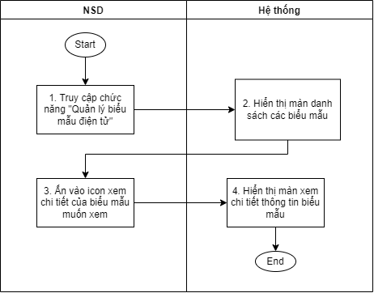

Mô tả luồng xử lý

Bước

Mô tả

Bước 1

NSD truy cập chức năng Quản lý biểu mẫu điện tử

Bước 2

Hệ thống hiển thị danh sách các biểu mẫu

Bước 3

Ấn vào icon xem chi tiết của biểu mẫu muốn xem

Bước 4

Hiển thị màn xem chi tiết thông tin biểu mẫu

				a)	Giao diện chức năng

--	Giao diện xem chi tiết đối với Loại phí/Loại công văn chia mẫu theo Đơn vị cấp phép là Bộ cấp phép hoặc Cục cấp phép

--	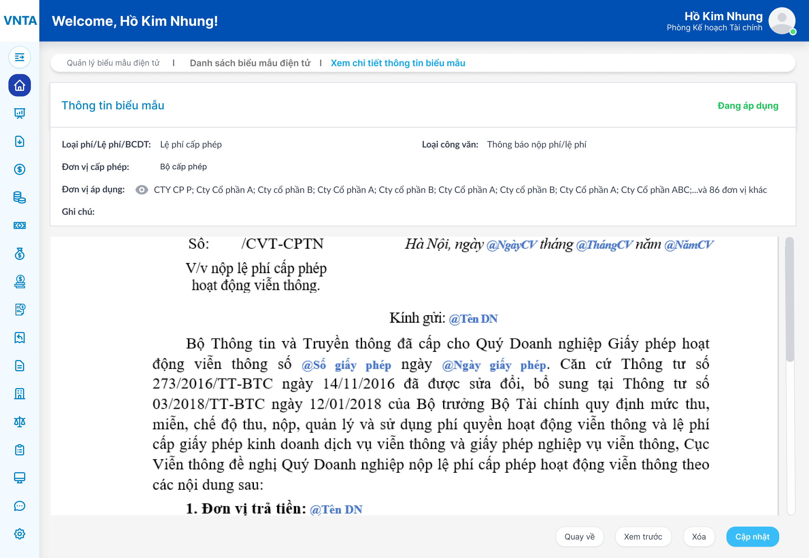

--	Giao diện xem chi tiết đối với Loại phí/Loại công văn không cần chia mẫu theo Đơn vị cấp phép là Bộ cấp phép hoặc Cục cấp phép

--	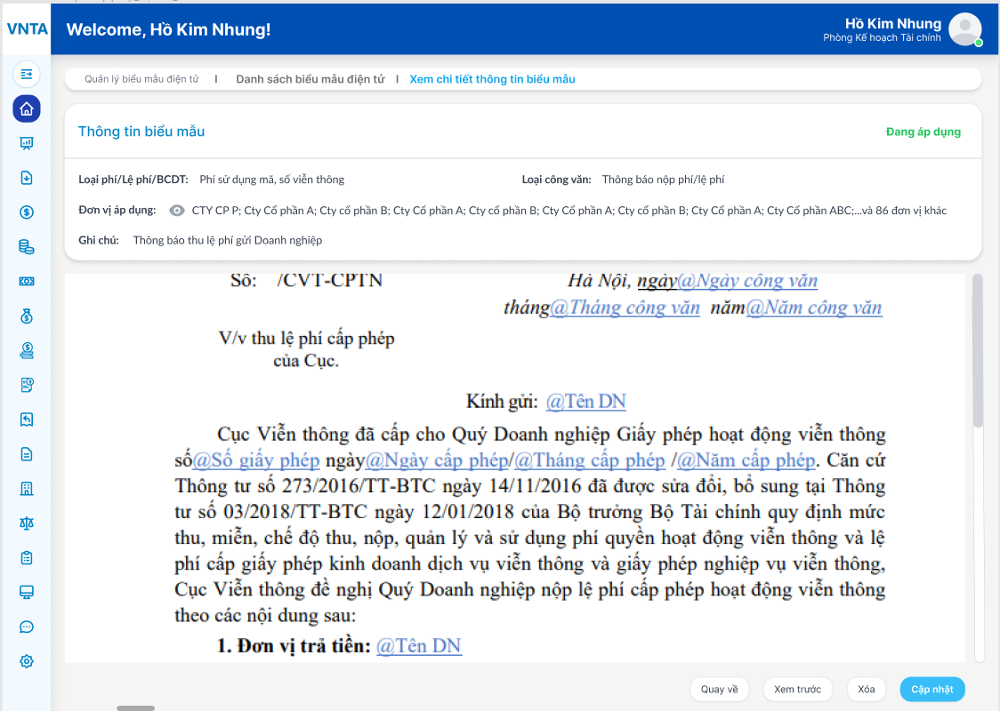

STT

Thông tin

Kiểu dữ liệu

Bắt buộc

Mô tả

Database

1

Thông tin biểu mẫu

Thông tin biểu mẫu

Thông tin biểu mẫu

Thông tin biểu mẫu

Thông tin biểu mẫu

1.1

Loại phí/Lệ phí/BCDT

Text

Hiển thị loại phí/lệ phí/BCDT tương ứng của biểu mẫu.

1.2

Loại công văn

Text

Hiển thị loại công văn tương ứng

1.3

Đơn vị cấp phép

Text

Phân biệt loại biểu mẫu thuộc Bộ cấp phép hay Cục cấp phép

1.4

Đơn vị áp dụng

Text

Hiển thị tên các đơn vị áp dụng biểu mẫu khi NSD xuất công văn.

1.4.1

Xem chi tiết danh sách đơn vị áp dụng biểu mẫu

button

Nhấn để hiển thị pop-up danh sách chi tiết đơn vị áp dụng biểu mẫu.

1.5

Ghi chú

Text

Ghi chú chi tiết về biểu mẫu (nếu có).

1.6

Đang áp dụng/Không áp dụng

Text

Trạng thái áp dụng biểu mẫu.

Hệ thống kiểm tra nếu Đơn vị áp dụng có từ 1 đơn vị trở lên thì là trạng thái “Đang áp dụng”, nếu không có đơn vị nào là “Không áp dụng”.

2

Nội dung biểu mẫu

Hiển thị preview nội dung format của biểu mẫu.

3

Cập nhật

button

Nhấn để thực hiện chỉnh sửa thông tin biểu mẫu và nội dung biểu mẫu.

(Riêng đối với các biểu mẫu mặc định không cho phép Xóa, không cho phép thay đổi “Loại công văn”, “Loại phí/lệ phí/BCDT”, Checkbox “Bộ cấp phép/Cục cấp phép”).

4

Xóa

button

Nhấn để thực hiện xóa biểu mẫu, hiển thị ra popup xác nhận xóa.

(Riêng đối với các biểu mẫu mặc định không cho phép Xóa => Không có button Xóa).

5

Xem trước

button

Nhấn để mở ra 1 tab mới cho phép xem preview full nội dung biểu mẫu đã soạn thảo.

6

Quay về

button

Nhấn để trở về màn xem danh sách biểu mẫu đang tìm kiếm.

--	Giao diện tab mới preview full nội dung soạn thảo.

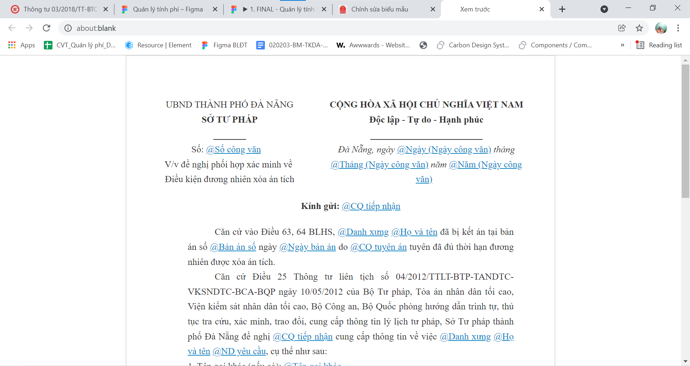

Popup Danh sách chi tiết đơn vị áp dụng biểu mẫu

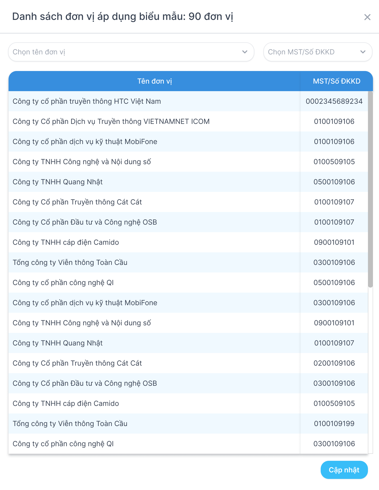

STT

Thông tin

Kiểu dữ liệu

Bắt buộc

Mô tả

Database

1

Thông tin tìm kiếm

Thông tin tìm kiếm

Thông tin tìm kiếm

Thông tin tìm kiếm

Thông tin tìm kiếm

1.1

Chọn Tên đơn vị

Combobox search

Gồm tất cả các DN có trong hệ thống.

Sắp xếp trong combobox tăng dần theo Mã định danh

Có thể chọn nhiều

1.2

Mã số thuế

Combobox search

Gồm tất cả các MST của tất cả DN có trong hệ thống.

Sắp xếp trong combobox tăng dần theo Mã định danh

Có thể chọn nhiều

2

Danh sách Đơn vị áp dụng

Danh sách Đơn vị áp dụng

Danh sách Đơn vị áp dụng

Danh sách Đơn vị áp dụng

Danh sách Đơn vị áp dụng

2.1

Tên Đơn vị

Text

Hiển thị tên đơn vị áp dụng biểu mẫu

Sắp xếp theo Mã định danh tăng dần

2.2

MST/ Số ĐKKD

Text

Hiển thị tên đơn vị áp dụng biểu mẫu tương ứng với DN

3

Cập nhật

Button

Nhấn sẽ hiển thị popup cập nhật Đơn vị áp dụng biểu mẫu đang xem chi tiết

Thêm mới biểu mẫu điện tử

--	a. Luồng chức năng

Thông tin chung

Tên chức năng

Thêm mới biểu mẫu điện tử

Mô tả

Chức năng cho phép thêm mới thông tin các loại biểu mẫu điện tử, tương ứng với các loại công văn thu phí, thu lệ phí, thông báo và đôn đốc DN nộp BCDT.

Tác nhân

Lãnh đạo, Cán bộ Phòng KHTC, Phòng CPTN, Phòng Kinh tế

Điều kiện trước

Đăng nhập vào hệ thống, có phân quyền chức năng

Điều kiện sau

Thêm mới biểu mẫu thành công

Ngoại lệ

N/A

Các yêu cầu đặc biệt

N/A

Luồng chức năng

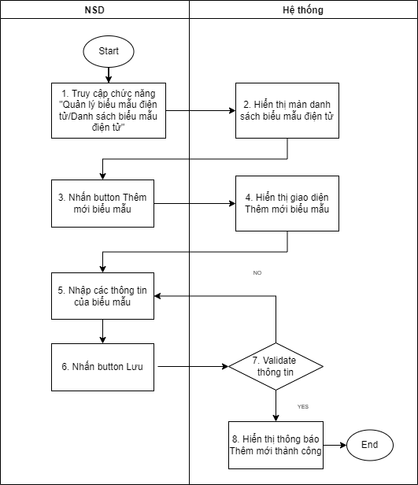

	Mô tả luồng xử lý

Bước

Mô tả

Bước 1

NSD truy cập chức năng “Quản lý biểu mẫu điện tử/Danh sách biểu mẫu điện tử”.

Bước 2

Hệ thống hiển thị giao diện danh sách tất cả các loại biểu mẫu điện tử có trong hệ thống, tương ứng với các loại công văn thu phí, lệ phí, thông báo, đôn đốc DN nộp BCDT sắp xếp các biểu mẫu mặc định (không thể xóa) đưa lên đầu.

Bước 3

NSD nhấn [Thêm mới biểu mẫu].

Bước 4

Hệ thống hiển thị giao diện thêm mới biểu mẫu cho phép NSD nhập thông tin biểu mẫu.

Bước 5

NSD nhập các trường thông tin thêm mới biểu mẫu

Bước 6

Nhấn [Lưu].

Bước 7

Hệ thống kiểm tra tính hợp lệ thông tin nhập:

- Nếu hợp lệ, chuyển bước 8

- Nếu không hợp lệ, hệ thống đưa ra thông báo tại các trường nhập không hợp lệ. Quay lại bước 5.

Bước 8

Hệ thống thông báo Thêm mới biểu mẫu thành công.

Kết thúc luồng.

Giao diện chức năng

Giao diện Thêm mới biểu mẫu ban đầu

--	

Giao diện Thêm mới biểu mẫu (có thêm trường đơn vị cấp phép)

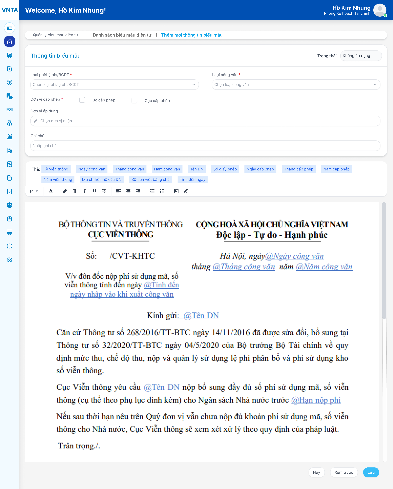

STT

Thông tin

Kiểu

 dữ liệu

Bắt buộc

Mô tả

Database

1

Thêm mới thông tin biểu mẫu

Thêm mới thông tin biểu mẫu

Thêm mới thông tin biểu mẫu

Thêm mới thông tin biểu mẫu

Thêm mới thông tin biểu mẫu

1.1

 Chọn loại phí/lệ phí/BCDT

combobox search

x

- Cho phép nhập loại phí/lệ phí/BCDT.

- Autocomplete.

- Chứa all các loại phí/lệ phí/BCDT có trong hệ thống, gồm:

+ Phí cung cấp dịch vụ viễn thông

+ Phí thiết lập mạng viễn thông công cộng

+ Phí sử dụng mã, số viễn thông

+ Phí thử nghiệm mạng và dịch vụ viễn thông

+ Phí thiết lập mạng viễn thông dùng riêng

+ Lệ phí cấp phép

+ Lệ phí phân bổ mã, số viễn thông

+ Lệ phí lắp đặt cáp viễn thông trên biển

+ Báo cáo doanh thu

+ Phí lắp đặt cáp viễn thông trên biển

+ Phí sửa chữa, bảo dưỡng cáp viễn thông trên biển

- Autocomplete.

-  Bắt buộc chọn Loại công văn + Loại phí/lệ phí/BCDT thì mới chọn được đơn vị áp dụng biểu mẫu. Nếu không thì đưa ra noti “Vui lòng chọn Loại công văn & Loại phí/lệ phí/BCDT”.

1.2

Chọn loại công văn

combobox search

x

- Load theo Loại phí/lệ phí/BCDT được chọn.

- Khi chưa chọn Loại phí/lệ phí/BCDT, nhấn combobox sẽ ko có loại công văn tương ứng

- Cho phép người dùng nhập tên loại công văn.

- Autocomplete gõ nhập tên loại công văn hệ thống tự động gợi ý.

- Khi chọn Loại phí là Cung cấp dịch vụ viễn thông, trường Loại công văn sẽ gồm:

+ Công văn thông báo nộp phí

+ Công văn thông báo nộp phí năm đầu

- Khi chọn Loại phí là TLM viễn thông công cộng, trường Loại công văn sẽ gồm:

+ Công văn thông báo nộp phí

+ Công văn thông báo nộp phí năm đầu

- Khi chọn kết hợp 2 loại phí Cung cấp dịch vụ viễn thông và Thiết lập mạng viễn thông, sẽ gồm các Loại công văn:

+ Đôn đốc nộp phí

+ Đối chiếu công nợ

- Khi chọn Loại phí là Phí sử dụng mã, số viễn thông, trường Loại công văn sẽ gồm:

+ Thông báo nộp phí

+ Đôn đốc nộp phí

+ Đối chiếu công nợ

+ Gửi P. Thanh tra

Khi chọn Loại phí là Phí thử nghiệm mạng và dịch vụ viễn thông, sẽ gồm các Loại công văn:

+ Thông báo nộp phí

- Khi chọn Loại phí là Phí thiết lập mạng viễn thông dùng riêng, sẽ gồm các Loại công văn:

+ Thông báo nộp phí

- Khi chọn Loại phí là Lệ phí cấp phép, sẽ gồm các Loại công văn:

+ Công văn thu lệ phí

- Khi chọn Loại phí là Lệ phí phân bổ mã, số viễn thông, sẽ gồm các Loại công văn:

+ Công văn thu lệ phí

- Khi chọn Loại phí là Lệ phí lắp đặt cáp viễn thông trên biển, sẽ bao gồm các Loại công văn:

+ Công văn thu lệ phí

- Khi chọn Loại phí là Báo cáo doanh thu, sẽ gồm các Loại công văn:

+ Thông báo thời hạn nộp BCDT

+ Thông báo vi phạm thời hạn BCDT

- Khi chọn Loại phí là Phí lắp đặt cáp viễn thông trên biển, sẽ gồm các Loại công văn:

+ Thông báo nộp phí

 - Khi chọn Loại phí là Phí sửa chữa, bảo dưỡng cáp viễn thông trên biển, sẽ gồm các Loại công văn:

+ Thông báo nộp phí

1.3

Trạng thái

Text

Khi Lưu hệ thống kiểm tra, nếu Đơn vị áp dụng có từ 1 đơn vị trở lên thì hiển thị trạng thái là “Đang áp dụng”, ngược lại nếu không có đơn vị nào là “Không áp dụng”.

1.4

Đơn vị cấp phép

Text

x

- Sẽ hiển thị đối với các Loại phí/Loại công văn:

+ Lệ phí cấp phép/ Thông báo thu phí/lệ phí

+ Phí CCDV/Thông báo nộp phí năm đầu

+ Phí TLM viễn thông công cộng/Thông báo nộp phí năm đầu

+ Phí Thử nghiệm mạng và dịch vụ viễn thông/ Thông báo nộp phi/lệ phí

+ Phí Thiết lập mạng viễn thông dùng riêng/ Thông báo nộp phi/lệ phí

- Chỉ được phép chọn 1 trong 2 sự lựa chọn.

- Đối với những Loại phí/Loại công văn khác sẽ ẩn trường này

1.5

Đơn vị áp dụng

button

Nhấn chuột vào ô chọn Tên Đơn vị áp dụng => hệ thống hiển thị giao diện pop-up cho phép người dùng chọn tên đơn vị áp dụng biểu mẫu.

Có thể không chọn hoặc chọn 1 hoặc nhiều đơn vị áp dụng biểu mẫu.

1.6

Ghi chú

Textbox

Cho phép người dùng nhập thông tin ghi chú của biểu mẫu.

Độ dài text giới hạn hiển thị tối đa 500 ký tự.

1.7

Tag – Nội dung biểu mẫu

Hiển thị danh sách tag – nội dung biểu mẫu cho phép người dùng chọn các thẻ tag cùng với loại phí/lệ phí/BCDT và loại công văn tương ứng biểu mẫu được thêm mới. (phân tích bên dưới)

1.8

CK editor

x

Cho phép người dùng nhập thông tin thêm mới biểu mẫu theo form và tag được gắn thẻ.

1.9

Hủy

Button

Nhấn button [Hủy] => Hệ thống hiển thị pop-up xác nhận hủy. Kết thúc thao tác Thêm mới biểu mẫu.

2.0

Xem trước

Button

Nhấn vào mở ra tab để xem preview full nội dung soạn thảo.

1.10

Lưu

Button

Nhấn button [Lưu] => Hệ thống kiểm tra tính hợp lệ thông tin người dùng nhập:

- Nếu hợp lệ, hệ thống hệ thống thông báo thêm mới biểu mẫu thành công và load lại danh sách biểu mẫu

- Nếu không hợp lệ, hệ thống đưa ra thông báo tại các trường nhập không hợp lệ. Người dùng quay lại bước nhập thông tin biểu mẫu.

Nội dung biểu mẫu – Bắt buộc phải chọn đủ all thẻ. Nếu chọn thiếu thẻ thì hiện thông báo “Vui lòng chọn đủ tất cả các thẻ.” Những thẻ chưa được gán thì chuyển màu đỏ cảnh báo.

--	

--	Danh sách các thẻ

STT

Loại phí/Lệ phí/BCDT

Loại công văn

Tên thẻ gắn tag tương ứng

1

Phí quyền hoạt động viễn thông năm đầu

Thông báo nộp phí (Cục cấp phép)

@Năm đầu cấp phép; @Ngày cv; @Tháng cv; @Năm cv; @Tên DN; @Số giấy phép; @Ngày cấp phép; @Loại phí; @Tên DN; @Địa chỉ liên hệ của DN; @Số tiền phải nộp; @Số tiền viết bằng chữ; @Hạn nộp phí.

2

Phí CCDV viễn thông

Thông báo nộp phí

@Kỳ viễn thông ; @ngày cv ;@tháng cv ; @năm cv ; @tên DN; @Địa chỉ liên hệ của DN; @Kỳ viễn thông (Ngày đầu kỳ - Ngày cuối kỳ) ;@Hạn nộp phí.

3

Phí CCDV viễn thông, Phí TLM viễn thông công cộng

Đôn đốc nộp phí

@Tính đến ngày; @Ngày cv; @Tháng cv; @Năm cv; @Tên DN; @Hạn nộp phí; @Chi cục thuế

4

Phí CCDV viễn thông, Phí TLM viễn thông công cộng

Đối chiếu công nợ

@Giai đoạn; @Ngày cv; @Tháng cv; @Năm cv; @Tên DN; @Tính đến ngày;

5

Phí CCDV viễn thông, Phí TLM viễn thông công cộng

Gửi phòng thanh tra

@Tính đến ngày; @Ngày cv; @Tháng cv; @Năm cv

6

Phí TLM viễn thông công cộng

Thông báo nộp phí

@Kỳ viễn thông; @ngày cv ;@tháng cv ; @năm cv ; @Tên DN; @Ngày đầu kỳ; @Ngày cuối kỳ; @Hạn nộp phí

7

Phí sử dụng mã, số viễn thông

Thông báo nộp phí (Mặc định gửi DN)

@Kỳ viễn thông; @Ngày cv; @Tháng cv; @Năm cv; @Tên DN; @Địa chỉ liên hệ của DN; @Tổng số tiền phí all các loại mã, số viễn thông phải nộp trong kỳ; @Hạn nộp phí

8

Phí sử dụng mã, số viễn thông

Thông báo nộp phí (Gửi riêng tới Sở, trung tâm)

@Kỳ viễn thông; @Ngày cv; @Tháng cv; @Năm cv; @Tên DN; @Địa chỉ liên hệ của DN; @Tổng số tiền phí all các loại mã, số viễn thông phải nộp trong kỳ; @Hạn nộp phí

9

Phí sử dụng mã, số viễn thông

Đôn đốc nộp phí

@Tính đến ngày; @Ngày cv; @Tháng cv; @Năm cv; @Tên DN; @Hạn nộp phí; @Chi cục thuế

10

Phí sử dụng mã, số viễn thông

Đối chiếu công nợ

@Tính đến ngày nhập vào khi xuất công văn; @Ngày cv; @Tháng cv; @Năm cv; @Tên DN; @Tổng số tiền nợ tính đến ngày; @Số tiền viết bằng chữ;

11

Phí sử dụng mã, số viễn thông

Gửi phòng thanh tra

@Tính đến ngày nhập vào khi xuất công văn; @Ngày cv; @Tháng cv; @Năm cv;

12

Lệ phí sử dụng mã, số viễn thông

Thông báo nộp phí (Mặc định gửi DN)

@Ngày cv; @Tháng cv; @Năm cv; @Tên DN; @Địa chỉ liên hệ của DN; @Số tiền phải nộp; @Số tiền viết bằng chữ; @Hạn nộp phí.

13

Phí thử nghiệm mạng và dịch vụ viễn thông

Thông báo nộp phí (Cục cấp phép)

@Ngày cv; @Tháng cv; @Năm cv; @Tên DN; @Địa chỉ liên hệ;@Tài nguyên; @Số lượng tỉnh thành @Số tiền phải nộp; @Số tiền viết bằng chữ; @Hạn nộp phí.

14

Phí thử nghiệm mạng và dịch vụ viễn thông

Thông báo nộp phí (Bộ cấp phép)

@Ngày cv; @Tháng cv; @Năm cv; @Tên DN;@Địa chỉ liên hệ của DN; @Tài nguyên; @Số lượng tỉnh thành; @Số tiền phải nộp; @Số tiền viết bằng chữ; @Hạn nộp phí.

15

Phí TLM viễn thông dùng riêng

Thông báo nộp phí (Cục cấp phép)

@Ngày cv; @Tháng cv; @Năm cv; @Tên DN; @Địa chỉ liên hệ của DN; @Số tiền phải nộp; @Số tiền viết bằng chữ; @Hạn nộp phí.

16

Phí TLM viễn thông dùng riêng

Thông báo nộp phí (Bộ cấp phép)

@Ngày cv; @Tháng cv; @Năm cv; @Tên DN;@Địa chỉ liên hệ của DN; @Số tiền phải nộp; @Số tiền viết bằng chữ; @Hạn nộp phí.

17

Phí quyền hoạt động viễn thông năm đầu

Thông báo nộp phí (Bộ cấp phép)

@Năm đầu cấp phép; @Ngày cv; @Tháng cv; @Năm cv; @Tên DN; @Số giấy phép; @Ngày cấp phép; @Loại phí; @Tên DN; @Địa chỉ liên hệ của DN; @Số tiền phải nộp; @Số tiền viết bằng chữ; @Hạn nộp phí.

18

Lệ phí cấp phép

Thông báo nộp phí (Cục cấp phép)

@Năm đầu cấp phép;@Ngày cv; @Tháng cv; @Năm cv; @Tên DN; @Số giấy phép; @Ngày cấp phép;@Tháng cấp phép; @Năm cấp phép; @Tên DN; @Địa chỉ liên hệ của DN; @Loại lệ phí; @Số tiền phải nộp; @Số tiền viết bằng chữ; @Hạn nộp phí.

19

Lệ phí cấp phép

Thông báo nộp phí (Bộ cấp phép)

@Năm đầu cấp phép;@Ngày cv; @Tháng cv; @Năm cv; @Tên DN; @Số giấy phép; @Ngày cấp phép;@Tháng cấp phép; @Năm cấp phép; @Tên DN; @Địa chỉ liên hệ của DN; @Loại lệ phí; @Số tiền phải nộp; @Số tiền viết bằng chữ; @Hạn nộp phí.

20

Báo cáo doanh thu

Thông báo nộp BCDT

@Kỳ viễn thông; ;@Ngày cv; @Tháng cv; @Năm cv; @Tên DN;@Ngày bắt đầu kỳ báo cáo; @Ngày kết thúc kỳ báo cáo; @Hạn nộp BCDT

21

Báo cáo doanh thu

Đôn đốc nộp BCDT

(Gửi 3 phòng ban)

@Kỳ viễn thông; ;@Ngày cv; @Tháng cv; @Năm cv;

22

Phí lắp đặt cáp viễn thông trên biển

Thông báo nộp phí

@Ngày cv; @Tháng cv; @Năm cv; @Tên DN; @Số giấy phép; @Ngày cấp phép;@Tháng cấp phép; @Năm cấp phép; @Tên DN; @Địa chỉ liên hệ của DN; @Tổng số tiền phí phải nộp; @Số tiền viết bằng chữ; @Hạn nộp phí

23

Phí sửa chữa cáp viễn thông biển

Thông báo nộp phí

Ngày cv; @Tháng cv; @Năm cv; @Tên DN; @Địa chỉ liên hệ của DN;@Tổng số tiền phí phải nộp; @Số tiền viết bằng chữ; @Hạn nộp phí

24

Lệ phí cấp phép sửa chữa cáp viễn thông trên biển

Thông báo nộp phí

@Ngày cv; @Tháng cv; @Năm cv; @Tên DN; @Số giấy phép; @Ngày cấp phép;@Tháng cấp phép; @Năm cấp phép;@Địa chỉ liên hệ của DN;@Tổng số tiền lệ phí phải nộp; @Số tiền viết bằng chữ; @Hạn nộp phí

--

--	Giao diện pop-up “Chọn đơn vị áp dụng biểu mẫu”

--	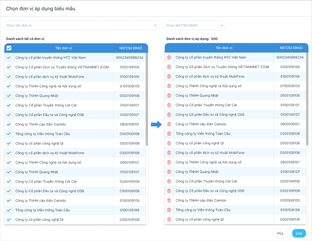

STT

Tên

Kiểu

dữ liệu

Bắt buộc

Mô tả

Database

1

Tra cứu cơ bản

Tra cứu cơ bản

Tra cứu cơ bản

Tra cứu cơ bản

Tra cứu cơ bản

1.1

Chọn tên đơn vị

Combobox search

Chứa all các tên đơn vị có trong hệ thống.

- Cho phép nhập tên đơn vị.

- Autocomplete.

- Cho phép chọn 1 hoặc nhiều tên đơn vị.

- Sắp xếp theo mã định danh giảm dần.

1.2

Chọn MST/Số ĐKKD

Combobox search

- Chứa MST/ số ĐKKD của all DN có trong hệ thống.

- Cho phép nhập Mã số thuế/ Số ĐKKD.

- Autocomplete

- Cho phép chọn nhiều MST/Số ĐKKD.

- Sắp xếp theo mã định danh giảm dần.

2

Danh sách tất cả đơn vị

Danh sách tất cả đơn vị

Danh sách tất cả đơn vị

Danh sách tất cả đơn vị

Danh sách tất cả đơn vị

2.1

Đánh dấu (icon)

Checkbox

Hiển thị checkbox cho phép người dùng đánh dấu 1 hoặc nhiều tên đơn vị để áp dụng biểu mẫu.

2.2

Tên đơn vị

Text

Hiển thị danh sách tất cả tên đơn vị có trong hệ thống.

2.3

MST/Số ĐKKD

Text

Hiển thị danh sách tất cả  MST/Số ĐKKD tương ứng với tên đơn vị có trong hệ thống.

3

Danh sách đơn vị áp dụng

Danh sách đơn vị áp dụng

Danh sách đơn vị áp dụng

Danh sách đơn vị áp dụng

Danh sách đơn vị áp dụng

3.1

Xóa (icon)

Button

Nhấn button [Xóa] thì tên đơn vị được xóa khỏi danh sách đơn vị áp dụng. Đồng thời, bỏ đánh dấu tên đơn vị đó khỏi danh sách tất cả đơn vị.

3.2

Tên đơn vị

Text

Hiển thị tên đơn vị áp dụng biểu mẫu.

3.3

MST/Số ĐKKD

Text

Hiển thị MST/Số ĐKKD tương ứng với tên đơn vị được áp dụng biểu mẫu.

4

Hủy

Button

Nhấn button [Hủy] => Hệ thống hiển thị pop-up xác nhận hủy thao tác chọn tên đơn vị áp dụng biểu mẫu, quay lại giao diện thêm mới biểu mẫu.

5

Lưu

Button

Nhấn button [Lưu] => Hệ thống kiểm tra tính hợp lệ thông tin người dùng nhập:

- Nếu hợp lệ thì hệ thống tự động lưu danh sách được chọn và đóng popup chọn đơn vị áp dụng, quay trở lại màn đang thêm mới/cập nhật.

- Nếu không hợp lệ, hệ thống đưa ra popup xác nhận lưu.

--	Giao diện pop-up “Xác nhận lưu”

--	

STT

Tên

Kiểu

dữ liệu

Bắt buộc

Mô tả

Database

1

Xác nhận lưu

Pop-up

Sau khi NSD nhấn [Lưu] từ giao diện pop-up Chọn đơn vị áp dụng biểu mẫu, nếu sau khi check phát hiện có đơn vị đã bị trùng với biểu mẫu tương tự (cùng loại công văn, loại phí/lệ phí/bcdt) thì hệ thống hiển thị pop-up xác nhận lưu: Danh sách được chọn có chứa đơn vị đã áp dụng biểu mẫu khác tương tự (Cùng loại phí/Lệ phí/BCDT;Loại công văn). Nhấn lưu nếu đồng ý chuyển các đơn vị từ biểu mẫu trước đó sang biểu mẫu hiện tại.

2

Quay về

Button

Nhấn [Quay về] => hệ thống hiển thị màn Thêm mới/Cập nhật.

3

Lưu

Button

Nhấn [Lưu] => hệ thống thực hiện chuyển đơn vị được chọn từ biểu mẫu trước sang biểu mẫu hiện tại. Đồng thời đóng popup và quay trở lại màn đang thêm mới/cập nhật.

Chỉnh sửa biểu mẫu điện tử

							a)	Luồng chức năng

Thông tin chung

Tên chức năng

Chỉnh sửa thông tin, nội dung biểu mẫu điện tử.

Mô tả

Chức năng cho phép chỉnh sửa lại thông tin và điều chỉnh lại nội dung từng biểu mẫu điện tử.

Tác nhân

Lãnh đạo, Cán bộ Phòng Kinh tế.

Điều kiện trước

Đăng nhập vào hệ thống, có phân quyền chức năng.

Điều kiện sau

Chỉnh sửa thành công các thông tin, nội dung cho phép của biểu mẫu

Ngoại lệ

N/A

Các yêu cầu đặc biệt

N/A

Luồng chức năng

--	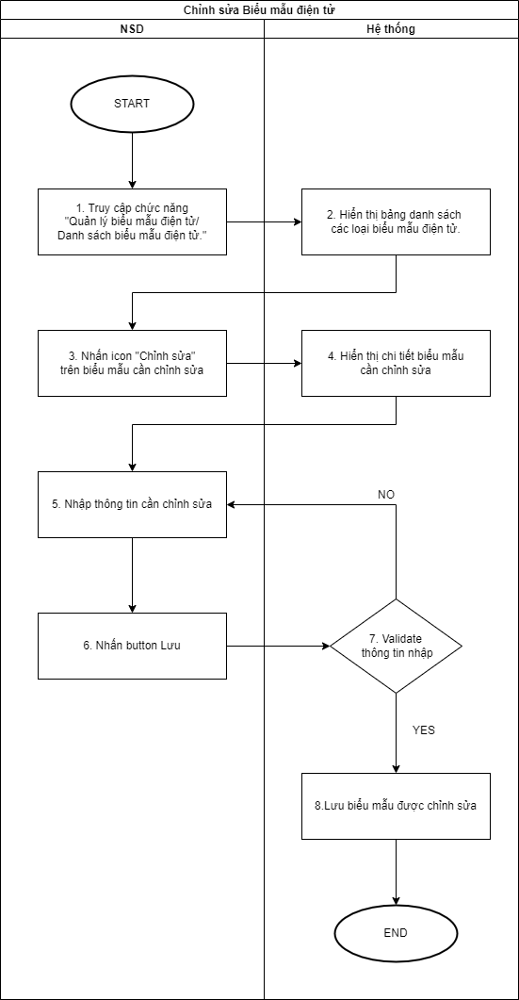

Mô tả luồng xử lý

Bước

Mô tả

Bước 1

NSD truy cập chức năng “Quản lý biểu mẫu điện tử/Danh sách biểu mẫu điện tử”.

Bước 2

Hệ thống hiển thị giao diện danh sách tất cả các loại biểu mẫu điện tử có trong hệ thống, tương ứng với các loại công văn thu phí, lệ phí, thông báo, đôn đốc DN nộp BCDT sắp xếp các biểu mẫu mặc định (không thể xóa) đưa lên đầu.

Bước 3

NSD nhấn icon Chỉnh sửa trên biểu mẫu cần chỉnh sửa.

Bước 4

Hệ thống hiển thị chi tiết biểu mẫu cần chỉnh sửa.

Bước 5

NSD nhập thông tin cần chỉnh sửa.

Bước 6

NSD nhấn button Lưu.

Bước 7

Hệ thống kiểm tra tính hợp lệ thông tin nhập:

- Nếu hợp lệ, chuyển bước 8

- Nếu không hợp lệ, hệ thống đưa ra thông báo tại các trường nhập không hợp lệ. Quay lại bước 5.

Bước 8

Hệ thống thực hiện lưu thông tin biểu mẫu được chỉnh sửa. Hiển thị thông báo Lưu thành công.

Kết thúc luồng.

							b)	Giao diện chức năng

Giao diện Chỉnh sửa biểu mẫu mặc định

--	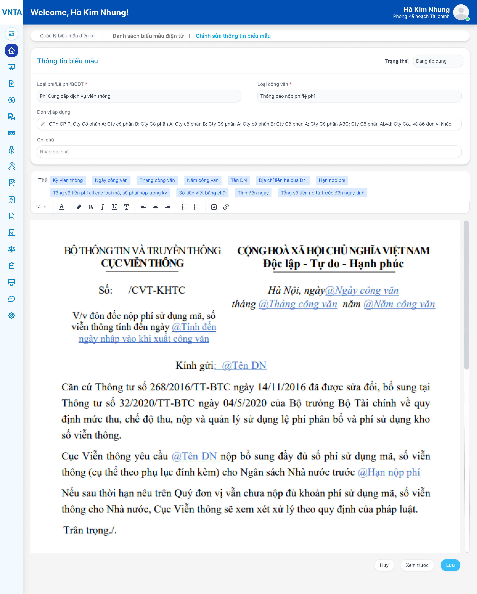

Giao diện Chỉnh sửa biểu mẫu mới thêm

--	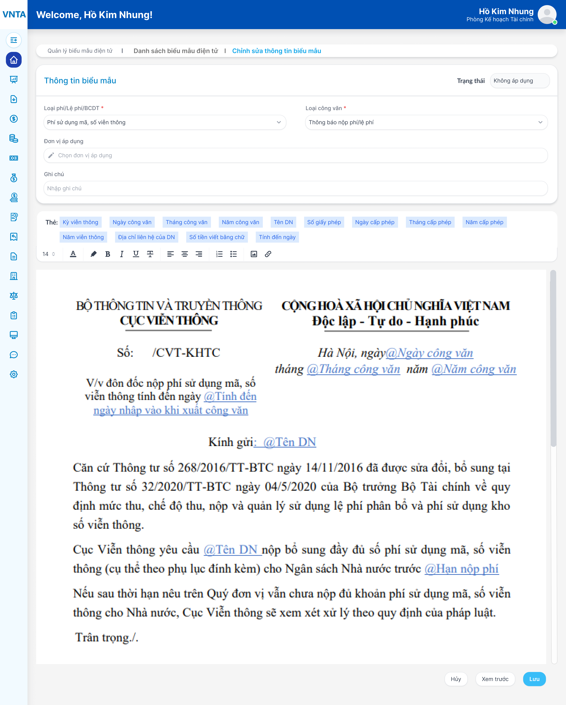

STT

Thông tin

Kiểu dữ liệu

Bắt buộc

Mô tả

Database

1

Thông tin biểu mẫu

Thông tin biểu mẫu

Thông tin biểu mẫu

Thông tin biểu mẫu

Thông tin biểu mẫu

1.1

 Chọn loại phí/lệ phí/BCDT

combobox search

x

(Riêng những biểu mẫu mặc định ko cho phép sửa trường này)

- Cho phép nhập loại phí/lệ phí/BCDT.

- Autocomplete.

- Chứa all các loại phí/lệ phí/BCDT có trong hệ thống, gồm:

+ Phí cung cấp dịch vụ viễn thông

+ Phí thiết lập mạng viễn thông công cộng

+ Phí sử dụng mã, số viễn thông

+ Phí thử nghiệm mạng và dịch vụ viễn thông

+ Phí thiết lập mạng viễn thông dùng riêng

+ Lệ phí cấp phép

+ Lệ phí phân bổ mã, số viễn thông

+ Báo cáo doanh thu

+ Phí lắp đặt cáp viễn thông trên biển

+ Phí sửa chữa, bảo dưỡng cáp viễn thông trên biển

- Autocomplete.

-  Bắt buộc chọn Loại công văn + Loại phí/lệ phí/BCDT thì mới chọn được đơn vị áp dụng biểu mẫu. Nếu không thì đưa ra noti “Vui lòng chọn Loại công văn & Loại phí/lệ phí/BCDT”.

1.2

Chọn loại công văn

combobox search

x

(Riêng những biểu mẫu mặc định ko cho phép sửa trường này)

- Load theo Loại phí/lệ phí/BCDT được chọn.

- Khi chưa chọn Loại phí/lệ phí/BCDT, nhấn combobox sẽ ko có loại công văn tương ứng

- Cho phép người dùng nhập tên loại công văn.

- Autocomplete gõ nhập tên loại công văn hệ thống tự động gợi ý.

- Khi chọn Loại phí là Cung cấp dịch vụ viễn thông, trường Loại công văn sẽ gồm:

+ Thông báo nộp phí/lệ phí

+ Thông báo nộp phí năm đầu

- Khi chọn Loại phí là TLM viễn thông công cộng, trường Loại công văn sẽ gồm:

+ Thông báo nộp phí/lệ phí

+ Thông báo nộp phí năm đầu

- Khi chọn kết hợp 2 loại phí Cung cấp dịch vụ viễn thông và Thiết lập mạng viễn thông, sẽ gồm các Loại công văn:

+ Đôn đốc nộp phí

+ Đối chiếu công nợ

+ Gửi P. Thanh tra

- Khi chọn Loại phí là Phí sử dụng mã, số viễn thông, trường Loại công văn sẽ gồm:

+ Thông báo nộp phí/lệ phí

+ Đôn đốc nộp phí

+ Đối chiếu công nợ

+ Gửi P. Thanh tra

Khi chọn Loại phí là Phí thử nghiệm mạng và dịch vụ viễn thông, sẽ gồm các Loại công văn:

+ Thông báo nộp phí/lệ phí

- Khi chọn Loại phí là Phí thiết lập mạng viễn thông dùng riêng, sẽ gồm các Loại công văn:

+ Thông báo nộp phí/lệ phí

- Khi chọn Loại phí là Lệ phí cấp phép, sẽ gồm các Loại công văn:

+ Thông báo nộp phí/lệ phí

- Khi chọn Loại phí là Lệ phí phân bổ mã, số viễn thông, sẽ gồm các Loại công văn:

+ Thông báo nộp phí/lệ phí

- Khi chọn Loại phí là Lệ phí lắp đặt cáp viễn thông trên biển, sẽ bao gồm các Loại công văn:

+ Thông báo nộp phí/lệ phí

- Khi chọn Loại phí là Báo cáo doanh thu, sẽ gồm các Loại công văn:

+ Thông báo thời hạn nộp BCDT

+ Thông báo vi phạm thời hạn BCDT

+ Gửi 3 phòng ban liên quan BCDT

- Khi chọn Loại phí là Phí lắp đặt cáp viễn thông trên biển, sẽ gồm các Loại công văn:

+ Thông báo nộp phí/lệ phí

 - Khi chọn Loại phí là Phí sửa chữa, bảo dưỡng cáp viễn thông trên biển, sẽ gồm các Loại công văn:

+ Thông báo nộp phí/lệ phí

1.3

Đơn vị cấp phép

Checkbox

x

(Riêng những biểu mẫu mặc định ko cho phép sửa trường này).

Chỉ những loại công văn có phân chia theo Bộ/Cục cấp thì mới hiển thị trường này. Nếu không ẩn đi.

Chỉ được phép chọn 1 trong 2 sự lựa chọn.

1.4

Chỉnh sửa đơn vị áp dụng biểu mẫu

button

Nhấn button Chỉnh sửa hiển thị giao diện pop-up cho phép người dùng chọn tên đơn vị áp dụng biểu mẫu.

Trường hợp Loại công văn là Gửi P. Thanh tra => ẩn trường Đơn vị áp dụng.

Trường hợp Loại công văn là Gửi 03 phòng ban liên quan BCDT => ẩn trường Đơn vị áp dụng

Có thể không chọn hoặc chọn 1 hoặc nhiều đơn vị nhận.

1.5

Ghi chú

Textbox

Cho phép chỉnh sửa ghi chú chi tiết về biểu mẫu (nếu có)

- Maxlenght: 500 ký tự

1.6

Tag – Nội dung biểu mẫu

Tham khảo phần thêm mới

1.7

CK editor

x

Cho phép người dùng nhập thông tin thêm mới biểu mẫu theo form và tag được gắn thẻ.

1.8

Hủy

Button

Nhấn button [Hủy] => Hệ thống hiển thị pop-up xác nhận hủy. Kết thúc thao tác Thêm mới biểu mẫu.

1.9

Xem trước

Button

Nhấn vào mở ra tab để xem preview full nội dung soạn thảo.

1.10

Lưu

Button

Nhấn button [Lưu] => Hệ thống kiểm tra tính hợp lệ thông tin người dùng nhập:

- Nếu hợp lệ, hệ thống thông báo thêm mới biểu mẫu thành công và load lại danh sách biểu mẫu

- Nếu không hợp lệ, hệ thống đưa ra thông báo tại các trường nhập không hợp lệ. Người dùng quay lại bước nhập thông tin biểu mẫu.

--

--	Giao diện “Xác nhận hủy”

STT

Thông tin

Kiểu dữ liệu

Bắt buộc

Mô tả

Database

1

Xác nhận

Button

Nhấn để hủy thao tác chỉnh sửa biểu mẫu -> Quay về màn xem chi tiết biểu mẫu đang xem.

2

Quay về

Button

Đóng popup và quay trở lại màn đang chỉnh sửa để tiếp tục thao tác.

Xem Trang chủ

							a)	Luồng chức năng

Thông tin chung

Tên chức năng

Xem danh sách Trang Chủ

Mô tả

Chức năng cho phép xem các thông số báo cáo nhanh về tình hình nộp BCDT, các loại phí của các DN có trong hệ thống

Tác nhân

Lãnh đạo, Cán bộ Phòng KHTC, Phòng CPTN, Phòng Kinh tế

Điều kiện trước

Đăng nhập vào hệ thống, có phân quyền chức năng

Điều kiện sau

Xem, tìm kiếm được thông số báo cáo nhanh về tình hình nộp các loại phí của các DN

Ngoại lệ

N/A

Các yêu cầu đặc biệt

N/A

--

	Luồng chức năng

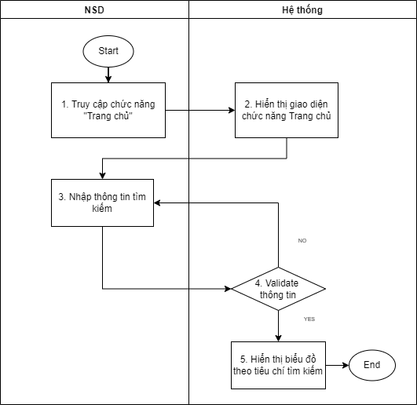

Mô tả luồng xử lý

Bước

Mô tả

Bước 1

NSD truy cập chức năng “Trang chủ”

Bước 2

Hệ thống hiển thị giao diện bảng danh sách thông số báo cáo nhanh trên Trang chủ.

Bước 3

NSD nhập các trường thông tin năm/quý muốn tìm kiếm.

Bước 4

Hệ thống kiểm tra tính hợp lệ thông tin nhập:

- Nếu hợp lệ, chuyển bước 5

- Nếu không hợp lệ, hệ thống đưa ra thông báo tại các trường nhập không hợp lệ. Quay lại bước 3.

Bước 5

Hệ thống hiển thị giao diện bảng danh sách thông số báo cáo nhanh theo năm/quý tìm kiếm.

Kết thúc luồng.

							b)	Giao diện chức năng

Giao diện xem tổng quan Trang chủ

	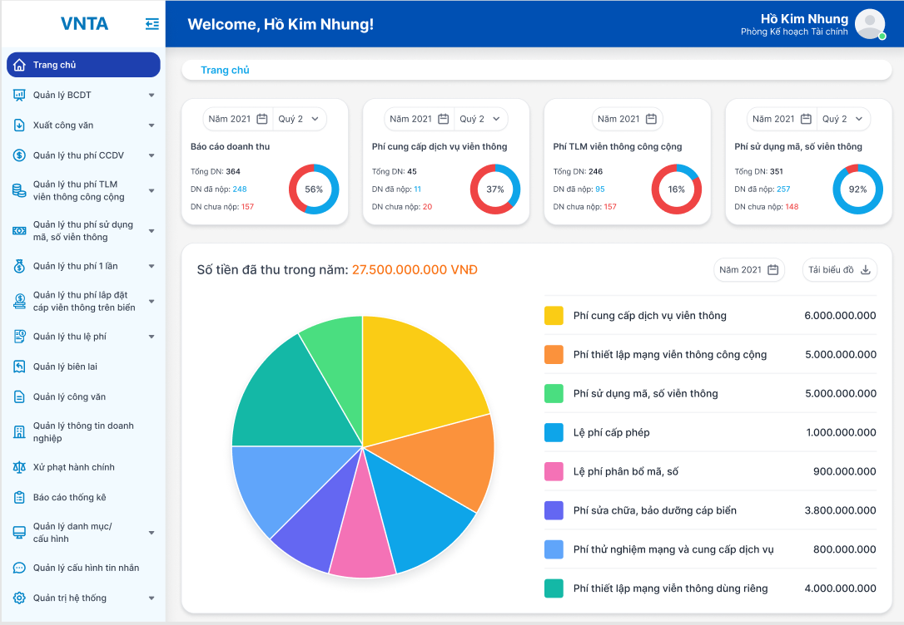

STT

Thông tin

Kiểu

 dữ liệu

Bắt buộc

Mô tả

Database

1

Các biểu đồ về tình hình nộp BCDT/phí trong Kỳ

Các biểu đồ về tình hình nộp BCDT/phí trong Kỳ

Các biểu đồ về tình hình nộp BCDT/phí trong Kỳ

Các biểu đồ về tình hình nộp BCDT/phí trong Kỳ

Các biểu đồ về tình hình nộp BCDT/phí trong Kỳ

1.1

Năm

Datepicker

x

Cho phép người dùng nhập hoặc chọn năm cần xem thông số hiển thị báo cáo nhanh về tình hình nộp BCDT và các loại phí:

+ Báo cáo doanh thu: Mặc định ban đầu là Kỳ có dữ liệu BCDT gần nhất

+ Phí CCDV viễn thông: Mặc định ban đầu là Kỳ có dữ liệu BCDT gần nhất

+ Phí TLM viễn thông công cộng: Mặc định ban đầu là Năm hiện tại

+ Phí sử dụng mã, số viễn thông: Mặc định ban đầu là Kỳ gần nhất trước đó so với hiện tại

1.2

Quý

Combobox

Cho phép người dùng nhập hoặc tự chọn quý.

Đối với phí sử dụng mã, số viễn thông không cho phép bỏ chọn Quý.

+ Báo cáo doanh thu: Mặc định ban đầu là Kỳ có dữ liệu BCDT gần nhất

+ Phí CCDV viễn thông: Mặc định ban đầu là Kỳ có dữ liệu BCDT gần nhất

+ Phí TLM viễn thông công cộng: Mặc định ban đầu là Năm hiện tại

+ Phí sử dụng mã, số viễn thông: Mặc định ban đầu là Kỳ gần nhất trước đó so với hiện tại

1.3

Tổng số DN

Text

Hiển thị thông số chi tiết cho biết Tổng số DN phải nộp BCDT hoặc loại phí tương ứng trong kỳ.

=>Nhấn vào số chi tiết link đến màn theo dõi thu BCDT/Theo dõi thu phí tại kỳ viễn thông tương ứng và được tích chọn ô Chỉ tính DN trong kỳ đối với phí CCDV, TLM, Kho số.

1.4

DN đã nộp

Text

Hiển thị thông số chi tiết cho biết Tổng số DN đã nộp BCDT hoặc loại phí trong kỳ tương ứng.

=>Nhấn vào số chi tiết link đến màn theo dõi thu BCDT/Theo dõi thu phí trong kỳ tương ứng, trạng thái đã nộp đủ, được tích chọn ô Chỉ tính DN trong kỳ đối với phí CCDV, TLM, Kho số.

1.5

DN chưa nộp

Text

Hiển thị thông số chi tiết cho biết Tổng số DN chưa nộp BCDT hoặc loại phí trong kỳ tương ứng.

=>Nhấn vào số chi tiết link đến màn theo dõi thu BCDT/Theo dõi thu phí trong kỳ tương ứng, trạng thái chưa nộp đủ, được tích chọn ô Chỉ tính DN trong kỳ đối với phí CCDV, TLM, Kho số.

1.6

Biểu đồ

Hiển thị tỷ lệ % số DN đã nộp phí/Tổng số DN phải nộp phí trong kỳ.

Khi người dùng di chuột vào từng vùng trong biểu đồ hiển thị tooltip cụ thể số lượng DN đã nộp/chưa nộp: ví dụ “DN đã nộp: 30 (50%)”

1

Biểu đồ về tình hình thu phí trong năm của tất cả các loại phí

Biểu đồ về tình hình thu phí trong năm của tất cả các loại phí

Biểu đồ về tình hình thu phí trong năm của tất cả các loại phí

Biểu đồ về tình hình thu phí trong năm của tất cả các loại phí

Biểu đồ về tình hình thu phí trong năm của tất cả các loại phí

1.7

Năm

Datepicker

x

Cho phép người dùng chọn năm => hiển thị biểu đồ báo cáo nhanh về tình hình nộp tất cả các loại phí.

Mặc định ban đầu là Năm hiện tại

1.8

Số tiền đã thu trong năm

Currency

Hiển thị tổng số tiền đã thu của all các loại phí/lệ phí trong năm tính theo ngày biên lai.

Định dạng: 1.000 đồng.

1.9

Loại phí/lệ phí

Text

Gồm:

+ Phí cung cấp dịch vụ viễn thông

+ Phí thiết lập mạng viễn thông công cộng

+ Phí sử dụng mã, số viễn thông

+ Lệ phí cấp phép

+ Lệ phí phân bổ mã, số viễn thông

+ Phí sửa chữa, bảo dưỡng cáp biển

+ Phí thử nghiệm mạng và cung cấp dịch vụ

+ Phí thiết lập mạng viễn thông dùng riêng

Hover vào vùng bất kỳ trên biểu đồ, hiển thị tool tip dạng “[Tên loại phí]: [Số tiền đã thu]”. Ví dụ: “Phí thiết lập mạng dùng riêng: 6.000.000.000 VNĐ”.

Giao diện “Tải biểu đồ”

STT

Thông tin

Kiểu

 dữ liệu

Bắt buộc

Mô tả

Database

1

Tải biểu đồ

Tải biểu đồ

Tải biểu đồ

Tải biểu đồ

Tải biểu đồ

1.10

Tải biểu đồ

button

Nhấn [Tải biểu đồ] hiển thị thanh menu list cho phép người dùng tải biểu đồ dưới dạng là 1 trong các option:

+ PNG

+ PDF

Quản lý công văn

Xem danh sách công văn

Luồng chức năng

Thông tin chung

Tên chức năng

Xem danh sách Công văn

Mô tả

Chức năng cho phép xem thông tin danh sách các loại công văn có trong hệ thống

Tác nhân

Lãnh đạo, Cán bộ Phòng KHTC, Phòng CPTN, Phòng Kinh tế

Điều kiện trước

Đăng nhập vào hệ thống, có phân quyền chức năng

Điều kiện sau

Xem, tìm kiếm được danh sách công văn

Ngoại lệ

N/A

Các yêu cầu đặc biệt

N/A

Luồng chức năng

	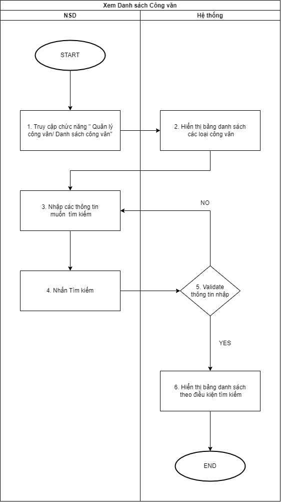

Mô tả luồng xử lý

Bước

Mô tả

Bước 1

NSD truy cập chức năng “Quản lý công văn/Danh sách công văn”.

Bước 2

Hệ thống hiển thị giao diện danh sách tất cả các loại công văn đi và công văn đến/trích yếu có trong hệ thống, tương ứng với các loại phí, lệ phí, BCDT… sắp xếp theo thứ tự các công văn có ngày cập nhật gần nhất.

Bước 3

NSD nhập các trường thông tin tiến hành tìm kiếm các thông tin.

Bước 4

Nhấn [Tìm kiếm].

Bước 5

Hệ thống kiểm tra tính hợp lệ thông tin nhập:

- Nếu hợp lệ, chuyển bước 6

- Nếu không hợp lệ, hệ thống đưa ra thông báo tại các trường nhập không hợp lệ. Quay lại bước 3.

Bước 6

Hệ thống hiển thị danh sách công văn theo điều kiện tìm kiếm.

Kết thúc luồng.

Giao diện chức năng

Giao diện tìm kiếm cơ bản (công văn đi)

Giao diện tab công văn đi mặc định khi chưa tích vào checkbox của bản ghi nào

--	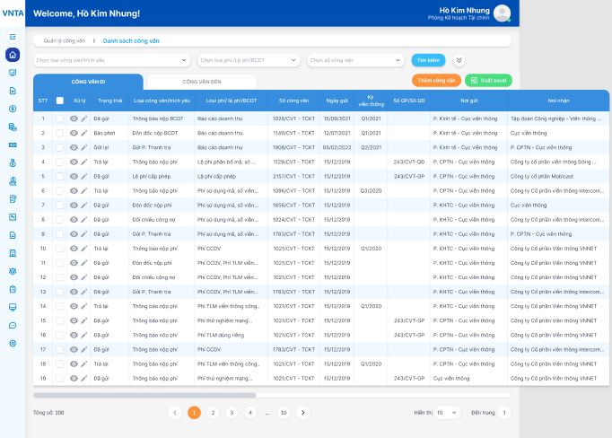

Giao diện tab công văn đi khi tích vào checkbox của bất kỳ bản ghi nào

--

--	

Giao diện tìm kiếm cơ bản (công văn đến)

Giao diện tab công văn đến mặc định khi chưa tích vào checkbox của bản ghi nào

--	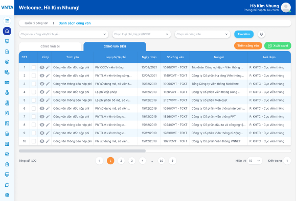

Giao diện tab công văn đến khi tích vào checkbox của bất kỳ bản ghi nào

--	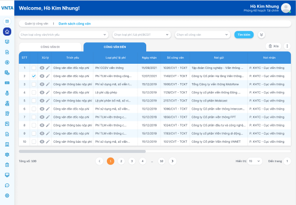

Giao diện tìm kiếm nâng cao

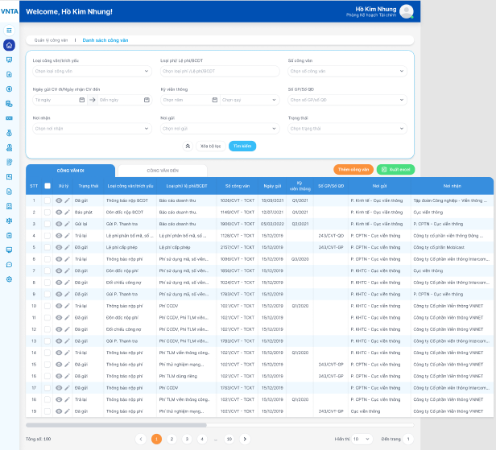

Giao diện hiển thị khi nhấn button Thêm công văn

Giao diện hiển thị các trạng thái của ô Checkbox Tổng.

Giao diện icon 3 chấm (hiển thị khi có từ 1 checkbox trở lên đang được chọn)

STT

Thông tin

Kiểu

 dữ liệu

Bắt buộc

Mô tả

Database

1

Tìm kiếm cơ bản

Tìm kiếm cơ bản

Tìm kiếm cơ bản

Tìm kiếm cơ bản

Tìm kiếm cơ bản

1.1

combobox search

- Chứa all các loại công văn/trích yếu có trong hệ thống.

- Cho phép chọn 1 hoặc nhiều loại công văn/trích yếu. Mặc định ko chọn là Chọn tất cả.

- Autocomplete gõ nhập tên loại công văn hệ thống tự động gợi ý.

- Danh sách được sắp xếp:

Mặc định các loại công văn được sắp xếp theo thứ tự:

+ Thông báo nộp BCDT

+ Đôn đốc nộp BCDT

+ Thông báo nộp lệ phí

+ Thông báo nộp phí năm đầu

+ Thông báo nộp phí

+ Đôn đốc nộp phí

+ Đối chiếu công nợ

+ Gửi P. Thanh tra

+ Gửi 3 phòng ban liên quan thu BCDT

Các công văn trích yếu sắp xếp sau đó và theo ngày tạo giảm dần.

1.2

 Chọn loại phí/lệ phí/BCDT

combobox search

- Chứa all các loại phí/lệ phí/BCDT có trong hệ thống:

+ Phí CCDV viễn thông

+ Phí TLM viễn thông công cộng

+ Phí sử dụng mã, số viễn thông

+ Phí thử nghiệm mạng và dịch vụ viễn thông

+ Phí TLM viễn thông dùng riêng

+ Phí lắp đặt cáp viễn thông trên biển

+ Phí sửa chữa, bảo dưỡng cáp viễn

+ Lệ phí cấp phép

+ Lệ phí phân bổ mã, số viễn thông

+ Báo cáo doanh thu

- Cho phép chọn 1 hoặc nhiều loại phí/lệ phí/BCDT. Mặc định ko chọn là Chọn tất cả.

- Cho phép nhập loại phí/lệ phí/BCDT. Autocomplete.

1.3

Chọn số công văn

combobox search

- Chứa all các số công văn có trong hệ thống.

- Cho phép chọn nhiều Số công văn. Mặc định ko chọn là Chọn tất cả.

- Cho phép nhập số công văn. Autocomplete.

1.4

Icon Tìm kiếm nâng cao

Button

- Nhấn hệ thống xổ xuống các tiêu chí Tìm kiếm nâng cao

- Ngược lại khi hiển thị các tiêu chí nâng cao, nhấn icon sẽ thu gọn lại

1.5

Tìm kiếm

button

Tìm kiếm theo các trường thông tin Chọn loại công văn; Chọn loại phí/lệ phí/BCDT; Chọn số công văn. Hệ thống hiển thị kết quả bên dưới bảng ở cả 2 tab Công văn đi/đến.

Trường hợp không có thông tin công văn được tìm kiếm, hiển thị không có dữ liệu.

1.5

Thêm công văn

button

Nhấn button “Thêm công văn” hiển thị menu list cho phép người dùng chọn 01 trong 03 option:

+ Import công văn đi

+ Thêm công văn đi

+ Thêm công văn đến

Trường hợp các công văn được đánh dấu trạng thái, không hiển thị button Thêm công văn.

1.6

Xuất excel

button

File gồm các cột giống trên giao diện (trừ cột xử lý), tiêu đề của sheet là Danh sách công văn, tên file: [Ngày xuất]_ Danh sách công văn.

1.7

Đánh dấu trạng thái

Button

Chỉ hiển thị button này khi có công văn đang được tích chọn (tham khảo giao diện bên trên).

Nhấn button Đánh dấu trạng thái, hệ thống hiển thị giao diện popup cho phép người dùng nhập thông tin trạng thái cho các công văn đang tích chọn.

1.8

Xóa

Button

Chỉ hiển thị button này khi có công văn đang được tích chọn (tham khảo giao diện bên trên).

Nhấn button Xóa, hệ thống hiển thị giao diện pop-up “Xác nhận xóa” các công văn đang được tích chọn.

1.9

Icon 3 chấm

Icon

Chỉ hiển thị button này khi có công văn đang được tích chọn (tham khảo giao diện bên trên).

Nhấn vào thì hiển thị các options:

+ Thêm công văn

+ Xuất excel

2

Tìm kiếm nâng cao

Tìm kiếm nâng cao

Tìm kiếm nâng cao

Tìm kiếm nâng cao

Tìm kiếm nâng cao

2.1

Loại công văn/trích yếu

combobox search

- Chứa all các loại công văn/trích yếu có trong hệ thống.

- Cho phép chọn 1 hoặc nhiều loại công văn/trích yếu. Mặc định ko chọn là Chọn tất cả.

- Autocomplete gõ nhập tên loại công văn hệ thống tự động gợi ý.

- Danh sách được sắp xếp:

Mặc định các loại công văn được sắp xếp theo thứ tự:

+ Thông báo nộp BCDT

+ Đôn đốc nộp BCDT

+ Thông báo nộp lệ phí

+ Thông báo nộp phí năm đầu

+ Thông báo nộp phí

+ Đôn đốc nộp phí

+ Đối chiếu công nợ

+ Gửi P. Thanh tra

+ Gửi 3 phòng ban liên quan thu BCDT

Các công văn trích yếu sắp xếp sau đó và theo ngày tạo giảm dần.

2.2

 Chọn loại phí/lệ phí/BCDT

combobox search

- Chứa all các loại phí/lệ phí/BCDT có trong hệ thống:

+ Phí CCDV viễn thông

+ Phí TLM viễn thông công cộng

+ Phí sử dụng mã, số viễn thông

+ Phí thử nghiệm mạng và dịch vụ viễn thông

+ Phí TLM viễn thông dùng riêng

+ Phí lắp đặt cáp viễn thông trên biển

+ Phí sửa chữa, bảo dưỡng cáp viễn

+ Lệ phí cấp phép

+ Lệ phí phân bổ mã, số viễn thông

+ Báo cáo doanh thu

- Cho phép chọn 1 hoặc nhiều loại phí/lệ phí/BCDT. Mặc định ko chọn là Chọn tất cả.

- Cho phép nhập loại phí/lệ phí/BCDT. Autocomplete.

2.3

Chọn số công văn

Combobox search

- Chứa all các số công văn có trong hệ thống.

- Cho phép chọn 1/nhiều Số công văn. Mặc định ko chọn là Chọn tất cả.

- Cho phép nhập số công văn. Autocomplete.

2.4

Ngày gửi CV đi/Ngày nhận CV đến

Datepicker

- Cho phép chọn theo ngày gửi/nhận công văn đi/đến

- “Đến ngày” >= “Từ ngày”

2.5

Kỳ viễn thông

Kỳ viễn thông

Kỳ viễn thông

Kỳ viễn thông

Kỳ viễn thông

Năm

Datepicker

- Cho phép người dùng chọn năm

Quý

Combobox

- Cho phép chọn quý, gồm:

+ Quý 1

+ Quý 2

+ Quý 3

+ Quý 4

2.6

Số GP/QĐ

Combobox search

- Chứa all số giấy phép/quyết định của DN có trong hệ thống.

- Cho phép chọn 1/nhiều số giấy phép/quyết định.

- Autocomplete.

2.7

Nơi gửi

Combobox search

- Chứa all tên các DN và các phòng ban trong Cục Viễn thông, gồm:

+ P. Kinh tế – Cục Viễn thông

+ P. CPTN – Cục Viễn thông

+ P. KHTC – Cục Viễn thông

+ Tên các DN trong hệ thống

- Cho phép chọn 1/nhiều, autocomplete.

2.8

Nơi nhận

Combobox search

- Chứa all tên các DN và các phòng ban trong Cục Viễn thông, gồm:

+ Tên các DN trong hệ thống

+ P. Kinh tế – Cục viễn thông

+ P. CPTN – Cục viễn thông

+ P. KHTC – Cục viễn thông

- Cho phép chọn 1/nhiều, autocomplete.

2.9

Trạng thái

Combobox

- Chứa all các trạng thái của công văn. Gồm:

+ Đã gửi

+ Trả lại

+ Gửi lại

+ Đã nhận

- Cho phép chọn 1/nhiều trạng thái.

2.10

Xóa bộ lọc

Button

Nhấn [Xóa bộ lọc], hệ thống xóa toàn bộ dữ liệu tiêu chí tìm kiếm đã nhập, giữ nguyên kết quả tìm kiếm

2.11

Tìm kiếm

Button

Nhấn [Tìm kiếm], hệ thống check hợp lệ của điều kiện tìm kiếm và trả danh sách kết quả ở cả 2 tab Công văn đi/đến.

Trường hợp không có thông tin công văn được tìm kiếm, hiển thị không có dữ liệu.

2.12

Thêm công văn

Button

Nhấn button “Thêm công văn” hiển thị 3 options:

- Import công văn đi

- Thêm công văn đi

- Thêm công văn đến

 Nhấn vào từng option hiển thị giao diện tương ứng cho phép người dùng nhập thông tin thêm mới công văn.

2.13

Xuất excel

button

File gồm các cột giống trên giao diện (trừ cột xử lý), tiêu đề của sheet là Danh sách công văn, tên file: [Ngày xuất]_ Danh sách công văn.

2.14

Đánh dấu trạng thái

Button

Chỉ hiển thị button này khi có công văn đang được tích chọn (tham khảo giao diện bên trên).

Nhấn button Đánh dấu trạng thái, hệ thống hiển thị giao diện popup cho phép người dùng nhập thông tin trạng thái cho các công văn đang tích chọn.

2.15

Xóa

Button

Chỉ hiển thị button này khi có công văn đang được tích chọn (tham khảo giao diện bên trên).

Nhấn button Xóa, hệ thống hiển thị giao diện pop-up “Xác nhận xóa” các công văn đang được tích chọn.

2.16

Icon 3 chấm

Icon

Chỉ hiển thị button này khi có công văn đang được tích chọn (tham khảo giao diện bên trên).

Nhấn vào thì hiển thị các options:

+ Thêm công văn

+ Xuất excel

3

Grid danh sách/Công văn đi: Danh sách các công văn gửi từ các phòng thuộc Cục Viễn thông

Grid danh sách/Công văn đi: Danh sách các công văn gửi từ các phòng thuộc Cục Viễn thông

Grid danh sách/Công văn đi: Danh sách các công văn gửi từ các phòng thuộc Cục Viễn thông

Grid danh sách/Công văn đi: Danh sách các công văn gửi từ các phòng thuộc Cục Viễn thông

Grid danh sách/Công văn đi: Danh sách các công văn gửi từ các phòng thuộc Cục Viễn thông

3.1

STT

Text

Hiển thị tự sinh, tăng dần.

3.2

Trạng thái

Text

Hiển thị trạng thái của công văn.

3.3

Checkbox

Cho phép người dùng tích chọn vào 1/nhiều/tất cả các công văn.

3.4

Xử lý

Xử lý

Xử lý

Xử lý

Xử lý

Button

Nhấn button hệ thống chuyển đến màn Xem chi tiết thông tin công văn.

Button

Nhấn button hệ thống chuyển đến màn Chỉnh sửa thông tin công văn.

3.5

Loại công văn/trích yếu

Text

Hiển thị danh sách thông tin các loại công văn/trích yếu.

3.6

Loại phí/lệ phí/BCDT

Text

Hiển thị các loại phí/lệ phí/BCDT.

3.7

Số công văn

Text

Hiển thị số công văn.

3.8

Ngày gửi

Date

Hiển thị ngày gửi công văn đi.

3.9

Kỳ viễn thông

Text

Định dạng quý: VD: Q1/2020.

Định dạng năm: VD: 2020.

3.10

Số GP/QĐ

Text

Hiển thị số GP/Số QĐ đối với các loại phí:

+ Phí thử nghiệm mạng và dịch vụ viễn thông.

+ Phí TLM viễn thông dùng riêng.

+ Phí lắp đặt cáp viễn thông trên biển

+ Lệ phí cấp phép

+ Lệ phí phân bổ mã, số viễn thông

+ Phí sửa chữa, bảo dưỡng cáp viễn thông trên biển.

3.11

Nơi gửi

Text

Hiển thị thông tin nơi gửi.

3.12

Nơi nhận

Text

Hiển thị thông tin nơi nhận.

4

Grid danh sách/Công văn đến: Danh sách các công văn gửi từ các đơn vị khác ngoài Cục Viễn thông

Grid danh sách/Công văn đến: Danh sách các công văn gửi từ các đơn vị khác ngoài Cục Viễn thông

Grid danh sách/Công văn đến: Danh sách các công văn gửi từ các đơn vị khác ngoài Cục Viễn thông

Grid danh sách/Công văn đến: Danh sách các công văn gửi từ các đơn vị khác ngoài Cục Viễn thông

Grid danh sách/Công văn đến: Danh sách các công văn gửi từ các đơn vị khác ngoài Cục Viễn thông

4.1

STT

Text

Hiển thị tự sinh, tăng dần.

4.2

Checkbox

Cho phép người dùng tích chọn vào 1/nhiều/tất cả các công văn.

4.3

Xử lý

Xử lý

Xử lý

Xử lý

Xử lý

Button

Nhấn button hệ thống chuyển đến màn Xem chi tiết thông tin công văn.

Button

Nhấn button hệ thống chuyển đến màn Chỉnh sửa thông tin công văn.

4.4

Trích yếu

Text

Hiển thị danh sách thông tin các loại công văn/trích yếu.

4.5

Loại phí/lệ phí/BCDT

Text

Hiển thị các loại phí/lệ phí/BCDT.

4.6

Số công văn

Text

Hiển thị số công văn.

4.7

Ngày nhận

Date

Hiển thị ngày nhận công văn đến.

4.8

Nơi gửi

Text

Hiển thị thông tin nơi gửi.

4.9

Nơi nhận

Text

Hiển thị thông tin nơi nhận.

5

Phân trang

Phân trang

Phân trang

Phân trang

Phân trang

5.1

Phân trang

button

Gồm các button: Về trang trước đó, 1, 2, 3 (nếu ít trang hơn sẽ tự cắt bớt), trang sau đó

5.2

Số bản ghi trên 1 trang

combobox

Gồm:

10/20/50/100

Mặc định 10 bản ghi trên 1 trang

5.3

Đến trang

Text

- Nhập số trang => hệ thống nhảy đến dữ liệu trang tương ứng

Giao diện “Xác nhận Xóa”

STT

Tên

Kiểu

dữ liệu

Bắt buộc

Mô tả

Database

1

Xác nhận xóa

Pop-up

Sau khi NSD nhấn [Xóa] từ giao diện Xóa, hệ thống hiển thị pop-up xác nhận xóa công văn: Công văn được chọn sẽ bị xóa vĩnh viễn!Bạn có chắc chắn muốn xóa?

2

Quay về

Button

Nhấn [Quay về] => hệ thống hiển thị màn danh sách công văn đang tìm kiếm.

3

Xóa công văn

Button

Nhấn [Xóa công văn] => hệ thống thực hiện xóa công văn.

--	Giao diện Đánh dấu trạng thái

STT

Thông tin

Kiểu dữ liệu

Bắt buộc

Mô tả

Database

1

Trạng thái

combobox

Cho phép chọn 1 trạng thái, gồm:

- Đã nhận

- Trả lại

- Gửi lại

2

Ngày trạng thái

datepicker

Cho phép chọn ngày trạng thái.

3

Ghi chú

Textbox

Cho phép nhập ghi chú.

Maxlength 500 kí tự.

4

Lưu

button

Nhấn để lưu thông tin trạng thái.

5

Hủy

button

Hủy bỏ thao tác đánh dấu và đóng popup.

Thêm mới công văn đến/đi – Import công văn

--	a. Luồng chức năng

Thông tin chung

Tên chức năng

Thêm mới/Import công văn

Mô tả

Chức năng cho phép thêm mới thông tin các loại công văn đến, công văn đi; Import công văn đi.

Tác nhân

Lãnh đạo, Cán bộ Phòng KHTC, Phòng CPTN, Phòng Kinh tế

Điều kiện trước

Đăng nhập vào hệ thống, có phân quyền chức năng

Điều kiện sau

Thêm mới công văn đi, công văn đến/Import công văn đi thành công

Ngoại lệ

N/A

Các yêu cầu đặc biệt

N/A

Luồng chức năng

--	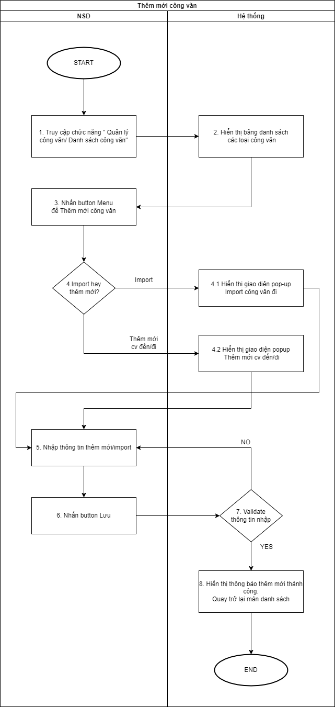

	Mô tả luồng xử lý

Bước

Mô tả

Bước 1

NSD truy cập chức năng “Quản lý công văn/Danh sách công văn”.

Bước 2

Hệ thống hiển thị giao diện danh sách tất cả các loại công văn đi và công văn đến/trích yếu có trong hệ thống, tương ứng với các loại phí, lệ phí, BCDT… sắp xếp theo thứ tự các công văn có ngày cập nhật gần nhất.

Bước 3

NSD nhấn [Thêm công văn].

Bước 4

Hệ thống hiển thị giao diện thêm mới công văn cho phép NSD chọn 1 trong option: Import công văn đi/Thêm công văn đi/Thêm công văn đến.

Bước 4.1

Nếu chọn Import công văn đi, hệ thống hiển thị pop-up Import công văn đi

Bước 4.2

Nếu chọn Thêm công văn đi/công văn đến, hệ thống hiển thị màn thêm mới công văn đi/đến.

Bước 5

NSD nhập các trường thông tin Import công văn đi/Thêm mới công văn đến/công văn đi.

Bước 6

Nhấn [Lưu].

Bước 7

Hệ thống kiểm tra tính hợp lệ thông tin nhập:

- Nếu hợp lệ, chuyển bước 8

- Nếu không hợp lệ, hệ thống đưa ra thông báo tại các trường nhập không hợp lệ. Quay lại bước 5.

Bước 8

Hệ thống hiển thị thông báo thêm mới thành công. Load lại giao diện danh sách công văn.

Kết thúc luồng.

--	b. Giao diện chức năng

Import công văn

Import giao diện mặc định ban đầu

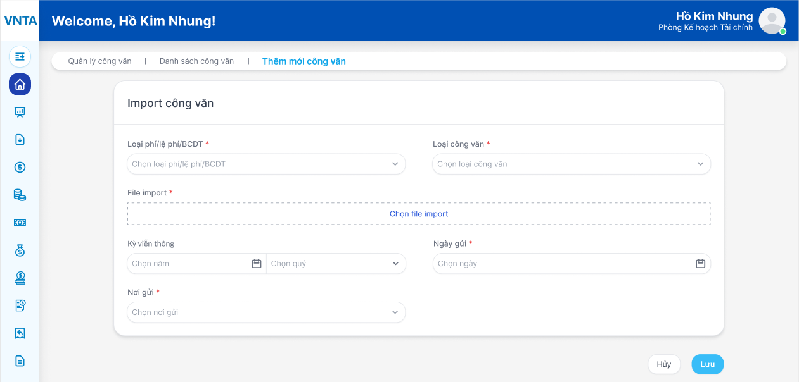

Import – khi chọn loại phí là CCDV hoặc (và) TLM công cộng

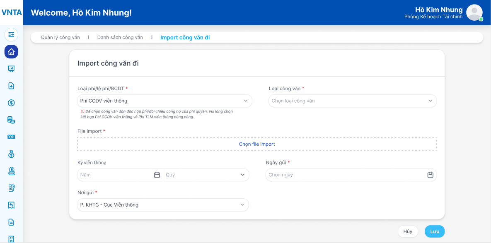

--	Import – CV thông báo nộp phí/BCDT

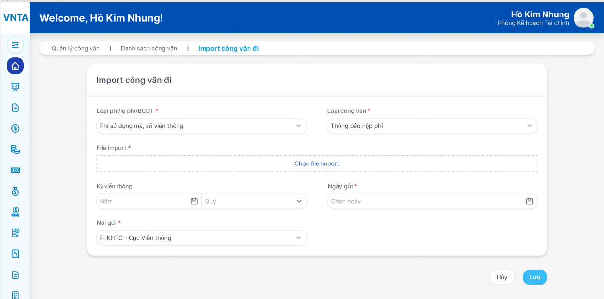

Import - CV đôn đốc nộp phí

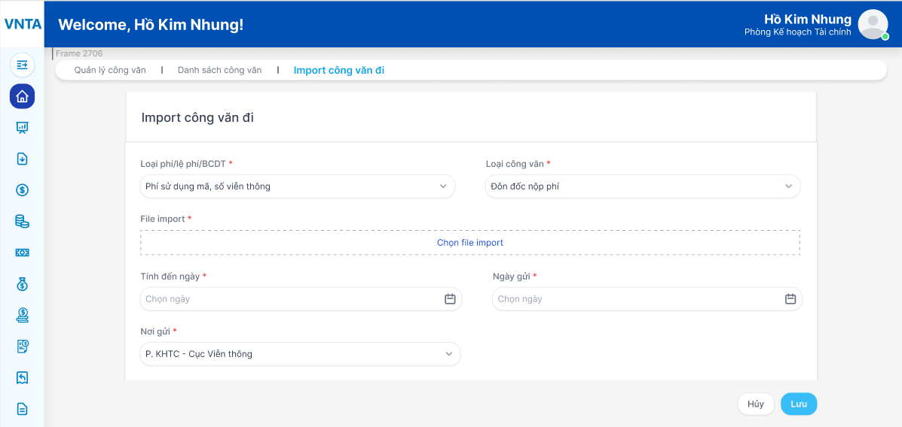

Import - CV đôn đốc nộp BCDT

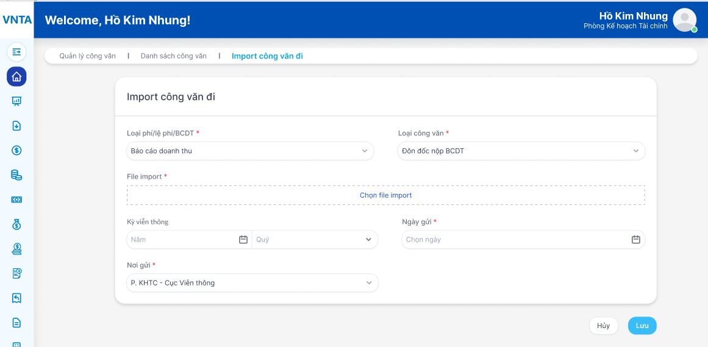

--	Import - CV đối chiếu công nợ phí kho số:

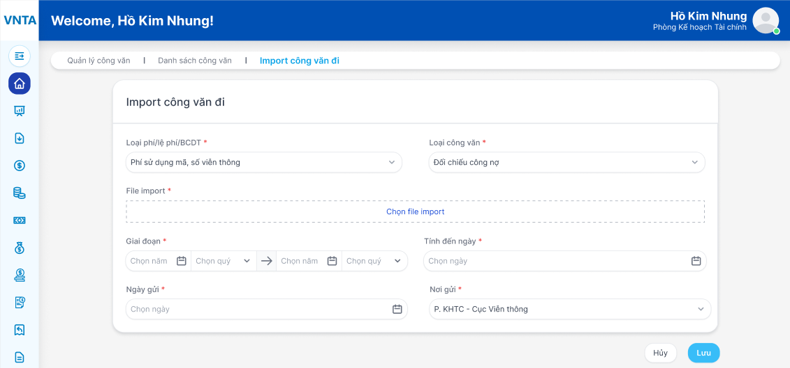

--	Import - CV đối chiếu công nợ phí kho số phí quyền

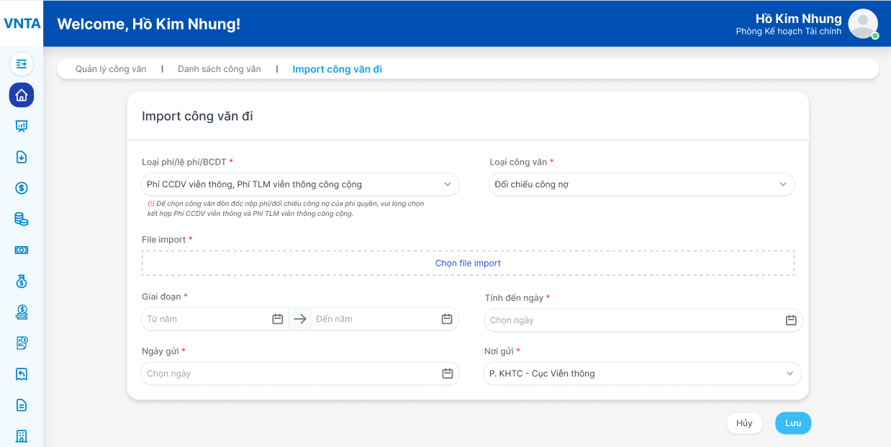

STT

Thông tin

Kiểu

 dữ liệu

Bắt buộc

Mô tả

Database

1

Import công văn đi

Import công văn đi

Import công văn đi

Import công văn đi

Import công văn đi

1.1

 Chọn loại phí/lệ phí/BCDT

combobox search

x

- Chứa các loại phí/BCDT được import, gồm:

+ Phí CCDV viễn thông

+ Phí TLM viễn thông công cộng

+ Phí sử dụng mã, số viễn thông

+ Báo cáo doanh thu

- Cho phép chọn kết hợp 2 loại phí CCDV và phí TLM viễn thông (để ra loại công văn đối chiếu công nợ, đôn đốc nộp phí).

- Autocomplete.

1.2

Chọn loại công văn

combobox

x

- Cho phép chọn 1 loại công văn tương ứng với Loại phí/lệ phí/BCDT đã chọn:

--	Phí CCDV viễn thông hoặc Phí TLM viễn thông công cộng:

+ Thông báo nộp phí

--	Chọn đồng thời Phí CCDV viễn thông và Phí TLM viễn thông công cộng:

+ Đôn đốc nộp phí

+ Đối chiếu công nợ

--	Phí sử dụng mã, số viễn thông:

+ Thông báo nộp phí

+ Đôn đốc nộp phí

+ Đối chiếu công nợ

--	Báo cáo doanh thu:

+ Thông báo nộp BCDT

+ Đôn đốc nộp BCDT

1.3

Chọn file Import

Button

x

Nhấn button cho phép người dùng chọn file muốn import.

Định dạng file excel, không giới hạn dung lượng. Nếu lỗi định dạng đưa thông báo “Lỗi định dạng file”.

1.4

Kỳ viễn thông: hiển thị khi chọn loại công văn: Thông báo nộp phí; Thông báo nộp BCDT; Đôn đốc nộp BCDT

Kỳ viễn thông: hiển thị khi chọn loại công văn: Thông báo nộp phí; Thông báo nộp BCDT; Đôn đốc nộp BCDT

Kỳ viễn thông: hiển thị khi chọn loại công văn: Thông báo nộp phí; Thông báo nộp BCDT; Đôn đốc nộp BCDT

Kỳ viễn thông: hiển thị khi chọn loại công văn: Thông báo nộp phí; Thông báo nộp BCDT; Đôn đốc nộp BCDT

Kỳ viễn thông: hiển thị khi chọn loại công văn: Thông báo nộp phí; Thông báo nộp BCDT; Đôn đốc nộp BCDT

Chọn năm

Datepicker

x

Cho phép người dùng chọn năm.

Chọn quý

Combobox

- Cho phép người dùng chọn hoặc nhập quý.

- Gồm:

+ Quý 1

+ Quý 2

+ Quý 3

+ Quý 4

1.5

Tính đến ngày

datepicker

x

- Hiển thị khi chọn loại công văn đôn đốc nộp phí; đối chiếu công nợ.

Cho phép chọn ngày

1.6

Giai đoạn

datepicker

x

- Hiển thị khi chọn loại công văn đối chiếu công nợ.

- Cho phép chọn giai đoạn.

“Đến năm” >= “Từ năm”

1.7

Chọn ngày gửi

Datepicker

x

Cho phép người dùng chọn ngày gửi.

1.8

Chọn nơi gửi

Combobox

x

Chứa các phòng ban của CVT, bao gồm:

+ P. KHTC - Cục Viễn thông

+ P. Kinh tế - Cục Viễn thông.

Mặc định khi chọn Loại phí/lệ phí/BCDT là: CCDV, TLM viễn thông, Phí kho số sẽ hiển thị Nơi gửi là P. KHCT – Cục Viễn thông (được chọn lại)

Mặc định khi chọn Loại phí/lệ phí/BCDT là: Báo cáo doanh thu sẽ hiển thị Nơi gửi là P. Kinh tế – Cục Viễn thông (được chọn lại)

1.9

Hủy

Button

Nhấn button [Hủy] => Hệ thống hiển thị pop-up xác nhận hủy. Kết thúc thao tác Import công văn. Quay trở về màn giao diện danh sách đang tìm kiếm trước đó.

1.10

Lưu

Button

Nhấn button [Lưu] => Hệ thống kiểm tra tính hợp lệ thông tin người dùng nhập:

- Nếu hợp lệ, hệ thống hệ thống thông báo import công văn thành công và load lại danh sách công văn.

- Nếu không hợp lệ, hệ thống đưa ra thông báo tại các trường nhập không hợp lệ. Người dùng quay lại bước nhập thông tin import công văn.

--

Thêm mới CV đi ban đầu

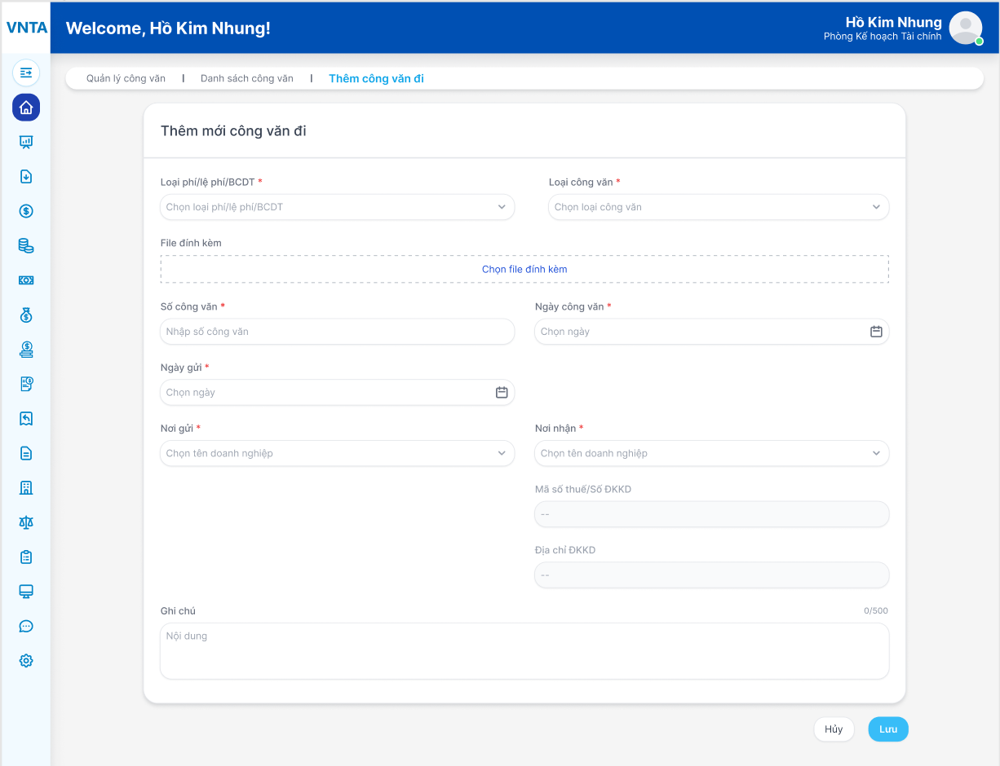

Thêm mới CV đi - gửi 3 phòng ban liên quan thu BCDT

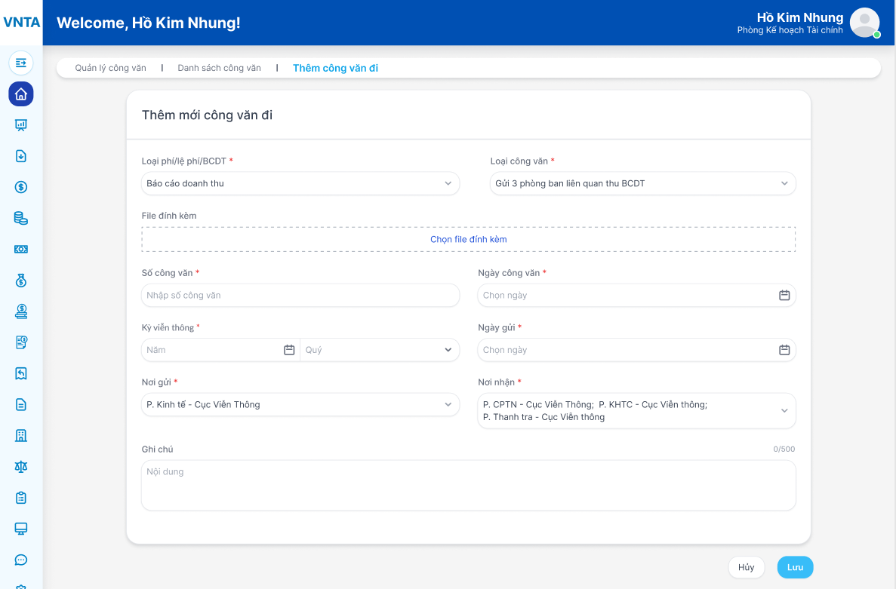

Thêm mới CV đi - gửi P. Thanh tra

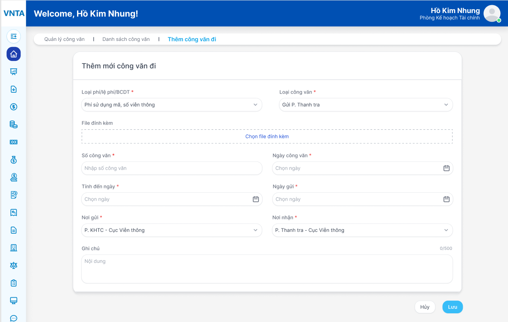

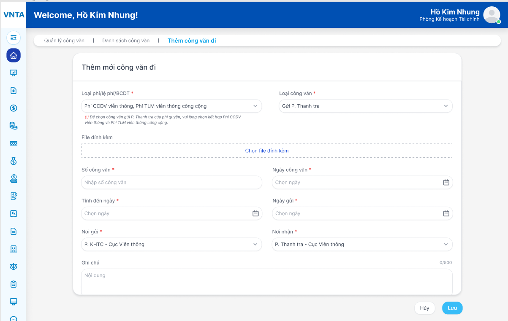

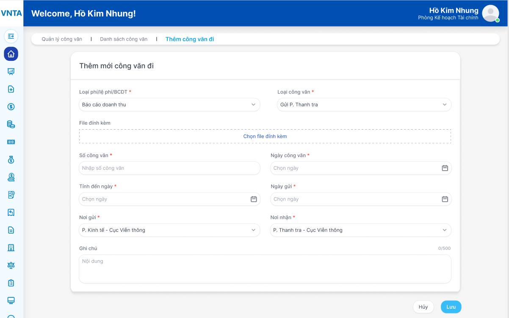

Thêm mới CV đi - Lệ phí

Thêm mới CV đi - khi Loại phí là CCDV hoặc/và TLM công cộng

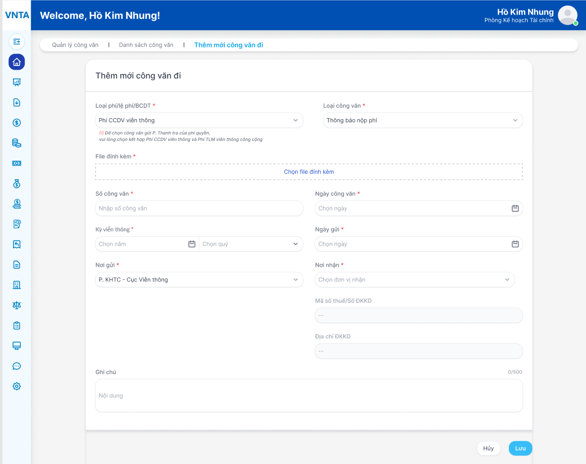

Thêm mới CV đi – Thông báo nộp phí năm đầu

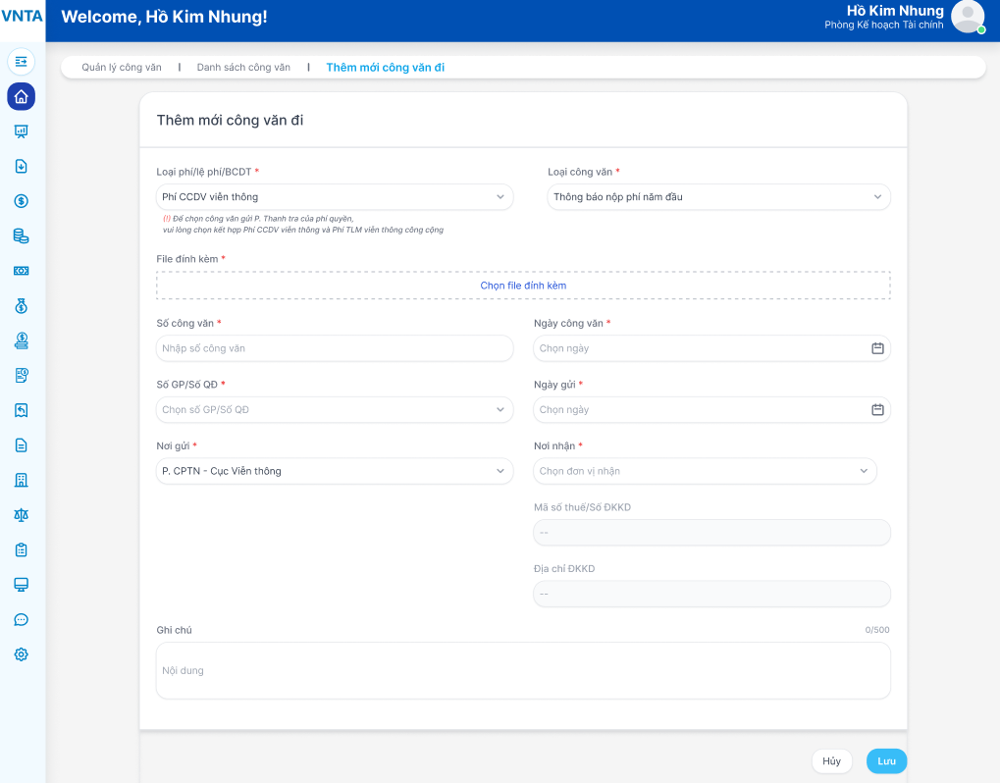

Thêm mới CV đi - phản hồi

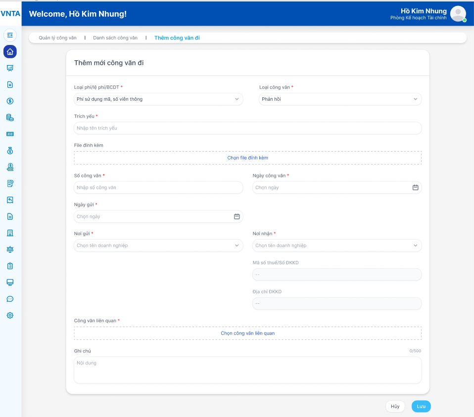

STT

Thông tin

Kiểu

 dữ liệu

Bắt buộc

Mô tả

Database

1

Thêm mới công văn đi

Thêm mới công văn đi

Thêm mới công văn đi

Thêm mới công văn đi

Thêm mới công văn đi

1.1

Loại phí/Lệ phí/BCDT

Combobox search

x

Cho phép chọn 1/ nhiều loại phí/lệ phí/BCDT của công văn, bao gồm:

+ Phí CCDV viễn thông

+ Phí TLM viễn thông công cộng

+ Phí sử dụng mã, số viễn thông

+ Phí thử nghiệm mạng và dịch vụ viễn thông

+ Phí TLM viễn thông dùng riêng

+ Phí lắp đặt cáp viễn thông trên biển

+ Phí sửa chữa, bảo dưỡng cáp viễn

+ Lệ phí cấp phép

+ Lệ phí phân bổ mã, số viễn thông

+ Báo cáo doanh thu

1.2

Loại công văn/trích yếu

Combobox search

x

- Cho phép chọn 1 loại công văn tương ứng với Loại phí/lệ phí/BCDT đã chọn:

--	Phí CCDV viễn thông hoặc Phí TLM viễn thông công cộng:

+ Thông báo nộp phí năm đầu

--	Chọn đồng thời Phí CCDV viễn thông và Phí TLM viễn thông công cộng:

+ Gửi P. Thanh tra

--	Phí sử dụng mã, số viễn thông:

+ Gửi P. Thanh tra

--	Báo cáo doanh thu:

+ Gửi P. Thanh tra

+ Gửi 3 phòng ban liên quan thu BCDT

--	Lệ phí phân bổ, lệ phí cấp phép:

+ Thông báo nộp lệ phí

--	Phí lắp đặt cáp viễn thông trên biển; Phí sửa chữa, bảo dưỡng cáp viễn thông trên biển; Phí TLM viễn thông dùng riêng; Phí thử nghiệm mạng và dịch vụ viễn thông:

+ Thông báo nộp phí

--	Chọn bất kỳ Loại phí/lệ phí/BCDT:

+ Phản hồi

1.3

Số công văn

Textbox

x

Cho phép nhập số CV.

1.4

Ngày công văn

datepicker

x

Cho phép chọn ngày CV.

Trích yếu

Textbox

x

- Hiển thị khi chọn Loại công văn “Phản hồi”

- Mặc định cụm từ “Phản hồi:” ở đầu box

1.5

Số GP/QĐ

Combobox search

x

- Hiển thị khi chọn loại công văn:

+ Lệ phí cấp phép/ Thông báo nộp lệ phí

+ Lệ phí phân bổ mã, số viễn thông/ Thông báo nộp lệ phí

+ Phí thử nghiệm mạng và dịch vụ viễn thông/Thông báo nộp phí

+ Phí TLM viễn thông dùng riêng/Thông báo nộp phí

+ Phí lắp đặt cáp viễn thông trên biển/Thông báo nộp phí

+ Phí sửa chữa, bảo dưỡng cáp viễn/Thông báo nộp phí

- Chứa all số giấy phép/quyết định của DN có trong hệ thống.

- Cho phép người dùng chọn 1 số giấy phép/ quyết định.

- Autocomplete.

1.6

Kỳ viễn thông: hiển thị khi chọn loại công văn: Thông báo nộp phí năm đầu

Kỳ viễn thông: hiển thị khi chọn loại công văn: Thông báo nộp phí năm đầu

Kỳ viễn thông: hiển thị khi chọn loại công văn: Thông báo nộp phí năm đầu

Kỳ viễn thông: hiển thị khi chọn loại công văn: Thông báo nộp phí năm đầu

Kỳ viễn thông: hiển thị khi chọn loại công văn: Thông báo nộp phí năm đầu

Chọn năm

Datepicker

x

Cho phép người dùng chọn năm.

1.7

Tính đến ngày

datepicker

x

- Hiển thị khi chọn loại công văn gửi P. Ttra.

Cho phép chọn ngày.

1.8

File đính kèm

Cho phép chọn 1/nhiều file đính kèm.

Giới hạn dung lượng 15MB/1 file.

1.9

Ghi chú

Text box

Cho phép nhập ghi chú của công văn.

Maxlength: 500 kí tự.

1.10

Nơi gửi

Combobox

x

- Cho phép chọn 1 nơi gửi, bao gồm:

+ P. CPTN - Cục Viễn thông

+ P. KHTC - Cục Viễn thông

+ P. Kinh tế - Cục Viễn thông

- Autofill đơn vị gửi theo loại công văn, Loại phí/lệ phí/BCDT:

+ Thông báo nộp lệ phí; Thông báo nộp phí năm đầu; Thông báo nộp phí (phí TLM dùng riêng, phí thử nghiệm, phí lắp đặt/sửa chữa cáp biển): P. CPTN – Cục Viễn Thông.

+ Gửi P. Thanh tra; Gửi 3 phòng ban liên quan thu BCDT: P. Kinh tế – Cục Viễn Thông.

+ Gửi P. Thanh tra (của các loại phí): P. KHTC – Cục Viễn Thông.

1.11

Nơi nhận

Combobox search

x

- Cho phép chọn 1 đơn vị làm nơi nhận.

- Nếu nơi nhận là phòng ban của Cục thì ẩn trường MST, Địa chỉ ĐKKD.

- Nếu chọn DN thì hiển thị trường MST, Địa chỉ ĐKKD tương ứng với DN đó.

- Autofill Nơi nhận theo loại công văn, Loại phí/lệ phí/BCDT:

+ Gửi P. Thanh tra: P. Thanh tra – Cục Viễn thông

+ Gửi 3 phòng ban liên quan thu BCDT: P. CPTN - Cục Viễn Thông; P. KHTC - Cục Viễn thông; P. Thanh tra - Cục Viễn thông

1.12

MST/Số ĐKKD

Text

Autofill theo tên nơi nhận.

1.13

Địa chỉ ĐKKD

Text

Autofill theo tên nơi nhận.

1.14

Hủy

Button

Nhấn button [Hủy] => Hệ thống hiển thị pop-up xác nhận hủy. Kết thúc thao tác Import công văn. Quay trở về màn giao diện danh sách đang tìm kiếm trước đó.

1.15

Lưu

Button

Nhấn button [Lưu] => Hệ thống kiểm tra tính hợp lệ thông tin người dùng nhập:

- Nếu hợp lệ, hệ thống hệ thống thông báo import công văn thành công và load lại danh sách công văn.

- Nếu không hợp lệ, hệ thống đưa ra thông báo tại các trường nhập không hợp lệ. Người dùng quay lại bước nhập thông tin import công văn.

Thêm mới CV đến

STT

Thông tin

Kiểu

 dữ liệu

Bắt buộc

Mô tả

Database

1.1

Trích yếu

Textbox

x

Cho phép người dùng nhập tên trích yếu.

- Maxlength: 200 ký tự

1.2

Chọn file đính kèm

Button

1.3

Loại phí/Lệ phí

Combobox

search

x

Cho phép nhập/chọn loại phí/lệ phí/BCDT của công văn, autocomplete khi nhập. Bao gồm:

+ Phí CCDV viễn thông

+ Phí TLM viễn thông công cộng

+ Phí sử dụng mã, số viễn thông

+ Phí thử nghiệm mạng và dịch vụ viễn thông

+ Phí TLM viễn thông dùng riêng

+ Phí lắp đặt cáp viễn thông trên biển

+ Phí sửa chữa, bảo dưỡng cáp viễn thông trên biển

+ Lệ phí cấp phép

+ Lệ phí phân bổ mã, số viễn thông

+ Báo cáo doanh thu

- Cho phép chọn 1/nhiều loại phí/lệ phí/BCDT.

1.4

Ngày nhận

Datepicker

x

Cho phép người dùng chọn ngày nhận công văn đến.

1.5

Số công văn

Textbox

x

Cho phép nhập số công văn

1.6

Ngày công văn

Datepicker

x

Cho phép người dùng chọ ngày công văn.

1.7

Chọn nơi gửi

Combobox search

x

- Chứa all các tên DN có trong hệ thống.

- Cho phép chọn 1 DN.

- Autocomplete.

1.8

Mã số thuế/Số ĐKKD

Text

Hệ thống tự fill theo thông tin tên DN.

1.9

Địa chỉ ĐKKD

Text

Hệ thống tự fill theo thông tin tên DN.

1.10

Chọn nơi nhận

Combobox

x

- Cho phép người dùng chọn 1/nhiều nơi nhận là các phòng trong Cục, gồm:

+ P. CPTN - Cục Viễn thông

+ P. KHTC - Cục Viễn thông

+ P. Kinh tế - Cục Viễn thông

+ P. Thanh tra – Cục Viễn thông

1.11

Công văn liên quan

button

Nhấn -> hiển thị popup chọn công văn liên quan.

1.12

Ghi chú

Textbox

Cho phép nhập ghi chú của công văn.

Maxlength: 500 kí tự.

1.7

Hủy

Button

Nhấn button [Hủy] => Hệ thống hiển thị pop-up xác nhận hủy. Kết thúc thao tác Import công văn. Quay trở về màn giao diện danh sách đang tìm kiếm trước đó.

1.8

Lưu

Button

Nhấn button [Lưu] => Hệ thống kiểm tra tính hợp lệ thông tin người dùng nhập:

- Nếu hợp lệ, hệ thống hệ thống thông báo import công văn thành công và load lại danh sách công văn.

- Nếu không hợp lệ, hệ thống đưa ra thông báo tại các trường nhập không hợp lệ. Người dùng quay lại bước nhập thông tin import công văn.

--	Giao diện chọn công văn liên quan

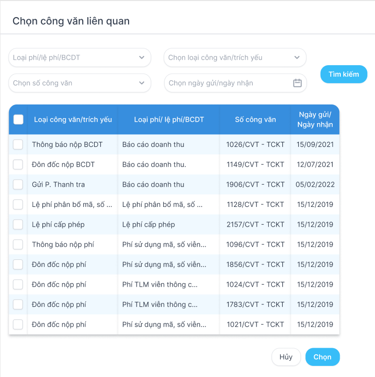

STT

Thông tin

Kiểu dữ liệu

Bắt buộc

Mô tả

Database

1

Tra cứu

Tra cứu

Tra cứu

Tra cứu

Tra cứu

1.1

Loại phí/lệ phí/BCDT

Combobox search

- Chứa all các loại phí/lệ phí/BCDT có trong hệ thống:

+ Phí CCDV viễn thông

+ Phí TLM viễn thông công cộng

+ Phí sử dụng mã, số viễn thông

+ Phí thử nghiệm mạng và dịch vụ viễn thông

+ Phí TLM viễn thông dùng riêng

+ Phí lắp đặt cáp viễn thông trên biển

+ Phí sửa chữa, bảo dưỡng cáp viễn

+ Lệ phí cấp phép

+ Lệ phí phân bổ mã, số viễn thông

+ Báo cáo doanh thu

- Cho phép chọn 1 hoặc nhiều loại phí/lệ phí/BCDT. Mặc định ko chọn là Chọn tất cả.

- Cho phép nhập loại phí/lệ phí/BCDT. Autocomplete.

1.2

Chọn loại công văn/trích yếu

Combobox search

- Chứa all các loại công văn/trích yếu có trong hệ thống.

- Cho phép chọn 1 hoặc nhiều loại công văn/trích yếu. Mặc định ko chọn là Chọn tất cả.

- Autocomplete gõ nhập tên loại công văn hệ thống tự động gợi ý.

- Danh sách được sắp xếp:

Mặc định các loại công văn được sắp xếp theo thứ tự:

+ Thông báo nộp BCDT

+ Đôn đốc nộp BCDT

+ Thông báo nộp phí

+ Thông báo nộp phi năm đầu

+ Đôn đốc nộp phí

+ Đối chiếu công nợ

+ Gửi P. Thanh tra

+ Lệ phí phân bổ mã, số viễn thông

+ Lệ phí cấp phép

Các công văn trích yếu sắp xếp sau đó và theo ngày tạo giảm dần.

1.3

Chọn số công văn

Combobox search

- Chứa all các số công văn có trong hệ thống.

- Cho phép chọn nhiều Số công văn. Mặc định ko chọn là Chọn tất cả.

- Cho phép nhập số công văn. Autocomplete.

1.4

Chọn ngày gửi/ngày nhận

datepicker

- Cho phép chọn theo ngày gửi/nhận công văn đi/đến

1.5

Tìm kiếm

button

Nhấn để tìm kiếm theo thông tin tra cứu

2

GRID

GRID

GRID

GRID

GRID

2.1

Loại phí/lệ phí/BCDT

Text

Hiển thị tên loại phí/lệ phí/BCDT của các công văn đến/đi đã có trên hệ thống.

2.2

Loại công văn/trích yếu

Text

Hiển thị tên loại công văn/trích yếu của các công văn đến/đi đã có trên hệ thống.

2.3

Số công văn

Text

Hiển thị số công văn của các công văn đến/đi đã có trên hệ thống.

2.4

Ngày gửi/ngày nhận

Text

Hiển thị ngày gửi/ngày nhận của các công văn đến/đi đã có trên hệ thống.

3

Chọn

button

Nhấn để lưu các công văn liên quan đã chọn. Nếu chưa đánh dấu checkbox nào thì hiển thị noti thông báo: “Vui lòng tích chọn vào công văn liên quan.”

4

Hủy

button

Hủy bỏ thao tác chọn công văn liên quan, đóng popup.

--		Giao diện “Xác nhận Hủy”

	

STT

Tên

Kiểu

dữ liệu

Bắt buộc

Mô tả

Database

1

Xác nhận hủy

Pop-up

Sau khi NSD nhấn [Hủy] từ giao diện Hủy, hệ thống hiển thị pop-up xác nhận Hủy import công văn:

“Thông tin sẽ không được lưu lại.

Bạn có chắc chắn muốn hủy không?”

2

Quay về

Button

Nhấn [Quay về] => hệ thống hiển thị màn đang import/thêm mới trước đó.

3

Hủy

Button

Nhấn [Hủy] => hệ thống thực hiện thao tác hủy thông tin import công văn. Quay trở về màn danh sách trước đó đang tim kiếm.

Xem chi tiết thông tin công văn

				a)	Luồng chức năng

Thông tin chung

Tên chức năng

Xem chi tiết thông tin công văn

Mô tả

Chức năng cho phép xem chi tiết thông tin công văn đến/đi

Tác nhân

Lãnh đạo, Cán bộ các phòng được phân quyền

Điều kiện trước

Đăng nhập vào hệ thống, có phân quyền chức năng.

Điều kiện sau

Xem chi tiết thông tin, nội dung của công văn

Ngoại lệ

N/A

Các yêu cầu đặc biệt

N/A

Luồng chức năng

--	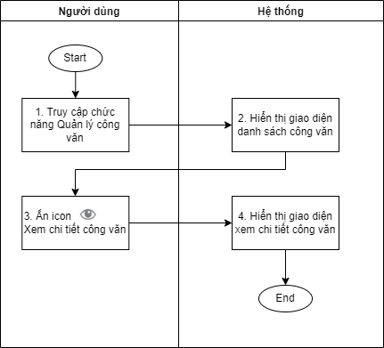

Mô tả luồng xử lý

Bước

Mô tả

Bước 1

Người sử dụng truy cập chức năng Quản lý công văn

Bước 2

Hệ thống hiển thị giao diện danh sách công văn

Bước 3

Người sử dụng ấn icon Xem chi tiết để xem chi tiết công văn

Bước 4

Hệ thống hiển thị giao diện xem chi tiết công văn

							c)	Giao diện chức năng

--	Giao diện xem chi tiết thông tin công văn đi chung

--	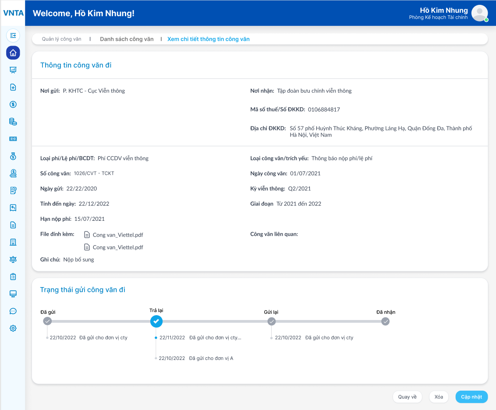

Giao diện xem chi tiết thông tin công văn đi (công văn phản hồi)

--	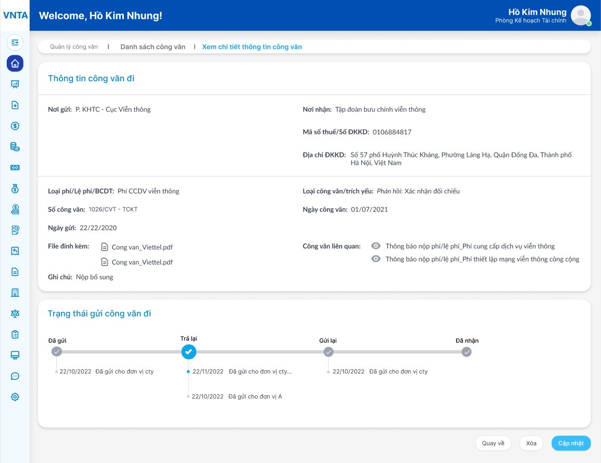

STT

Thông tin

Kiểu dữ liệu

Bắt buộc

Mô tả

Database

1

Thông tin công văn đi chung

Thông tin công văn đi chung

Thông tin công văn đi chung

Thông tin công văn đi chung

Thông tin công văn đi chung

1.1

Nơi gửi

Text

Hiển thị nơi gửi.

1.2

Nơi nhận

Text

Hiển thị nơi nhận.

Nếu nơi nhận là các phòng ban của Cục thì ẩn trường MST, Địa chỉ ĐKKD.

1.3

MST/Số ĐKKD

Text

Hiển thị MST/Số ĐKKD của nơi nhận.

1.4

Địa chỉ ĐKKD

Text

Hiển thị địa chỉ ĐKKD của nơi nhận.

1.5

Loại phí/Lệ phí/BCDT

Text

Hiển thị loại phí/lệ phí/BCDT của công văn.

1.6

Loại công văn/trích yếu

Text

Hiển thị loại công văn/trích yếu của công văn.

1.7

Số công văn

Text

Hiển thị số công văn.

1.8

Ngày công văn

Text

Hiển thị ngày công văn.

1.9

Ngày gửi

Text

Hiển thị ngày gửi.

1.10

File đính kèm

Text

Hiển thị tên file công văn. Trỏ chuột vào từng tên file sẽ hiện dòng gạch chân dưới tên file đó -> nhấn vào để tải file đó xuống.

1.11

Công văn liên quan

Text

Hiển thị các công văn liên quan (nếu có) công văn hiện tại. Nhấn vào icon Xem chi tiết -> dẫn sang màn Xem chi tiết của công văn liên quan.

1.12

Ghi chú

Text

Hiển thị ghi chú của công văn.

1.13

Trạng thái gửi công văn

Text

Hiển thị các trạng thái đã được người dùng đánh dấu: “Đã gửi/Trả lại/Gửi lại/Đã nhận”.

Riêng trạng thái “Đã gửi” mặc định luôn hiển thị khi người dùng import/thêm mới công văn đi.

Các trạng thái gửi công văn đi bao gồm:

- Đã gửi

- Đã gửi – Đã nhận

- Đã gửi – Trả lại

- Đã gửi – Trả lại – Gửi lại

- Đã gửi – Trả lại – Gửi lại – Đã nhận

1.15

Ngày trạng thái

Date

Hiển thị ngày trạng thái đã đánh dấu. Riêng trạng thái “Đã gửi” hiển thị “Ngày gửi” khi người dùng import/thêm mới công văn đi.

1.16

Ghi chú trạng thái

Text

Hiển thị ghi chú cụ thể của từng trạng thái.

1.17

Quay về

button

Nhấn để quay về màn đang xem trước đó.

1.18

Xóa

button

Nhấn để xóa thông tin công văn, hiển thị popup xác nhận xóa.

1.19

Cập nhật

button

Nhấn để chỉnh sửa thông tin chi tiết, trạng thái công văn.

2

Thông tin công văn đi phản hồi

Thông tin công văn đi phản hồi

Thông tin công văn đi phản hồi

Thông tin công văn đi phản hồi

Thông tin công văn đi phản hồi

2.1

Nơi gửi

Text

Hiển thị nơi gửi.

2.2

Nơi nhận

Text

Hiển thị nơi nhận.

Nếu nơi nhận là các phòng ban của Cục thì ẩn trường MST, Địa chỉ ĐKKD.

2.3

MST/Số ĐKKD

Text

Hiển thị MST/Số ĐKKD của nơi nhận.

2.4

Địa chỉ ĐKKD

Text

Hiển thị địa chỉ ĐKKD của nơi nhận.

2.5

Loại phí/Lệ phí/BCDT

Text

Hiển thị loại phí/lệ phí/BCDT của công văn.

2.6

Loại công văn/trích yếu

Text

Hiển thị tên trích yếu của công văn dưới dạng: “Phản hồi: [Trích yếu]”.

2.7

Số công văn

Text

Hiển thị số công văn.

2.8

Ngày công văn

Text

Hiển thị ngày công văn.

2.9

Ngày gửi

Text

Hiển thị ngày gửi.

2.10

File đính kèm

Text

Hiển thị tên file công văn. Trỏ chuột vào từng tên file sẽ hiện dòng gạch chân dưới tên file đó -> nhấn vào để tải file đó xuống.

2.11

Công văn liên quan

Text

Hiển thị các công văn cha/con liên quan đến công văn hiện tại. Nhấn vào icon Xem chi tiết -> dẫn sang màn Xem chi tiết của công văn đó.

2.12

Ghi chú

Text

Hiển thị ghi chú của công văn.

2.13

Trạng thái gửi công văn

Text

Hiển thị các trạng thái đã được người dùng đánh dấu: “Đã gửi/Trả lại/Gửi lại/Đã nhận”.

Riêng trạng thái “Đã gửi” mặc định luôn hiển thị khi người dùng import/thêm mới công văn đi.

Các trạng thái gửi công văn đi bao gồm:

- Đã gửi

- Đã gửi – Đã nhận

- Đã gửi – Trả lại

- Đã gửi – Trả lại – Gửi lại

- Đã gửi – Trả lại – Gửi lại – Đã nhận

2.15

Ngày trạng thái

Date

Hiển thị ngày trạng thái đã đánh dấu. Riêng trạng thái “Đã gửi” hiển thị “Ngày gửi” khi người dùng import/thêm mới công văn đi.

2.16

Ghi chú trạng thái

Text

Hiển thị ghi chú cụ thể của từng trạng thái.

2.17

Quay về

button

Nhấn để quay về màn đang xem trước đó.

2.18

Xóa

button

Nhấn để xóa thông tin công văn, hiển thị popup xác nhận xóa.

2.19

Cập nhật

button

Nhấn -> hiển thị màn chỉnh sửa thông tin chi tiết, trạng thái công văn.

--	Giao diện popup xác nhận xóa

STT

Thông tin

Kiểu dữ liệu

Bắt buộc

Mô tả

Database

1

Xác nhận xóa

Pop-up

Sau khi NSD nhấn [Xóa] từ giao diện Xóa, hệ thống hiển thị pop-up xác nhận xóa công văn:

Công văn sẽ bị xóa vĩnh viễn.

Bạn có chắc chắn muốn xóa?

2

Xóa công văn

Button

Nhấn để xóa thông tin công văn.

3

Quay về

Button

Nhấn để hủy bỏ thao tác xóa. Đóng popup.

--

Giao diện xem chi tiết thông tin công văn đến

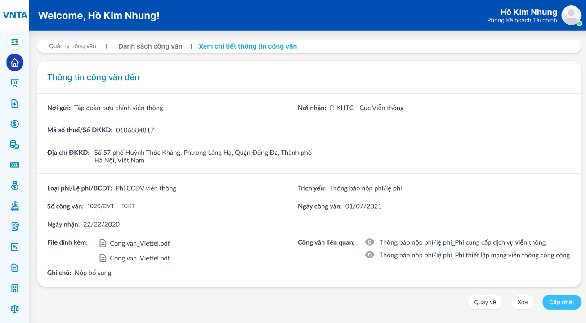

STT

Thông tin

Kiểu dữ liệu

Bắt buộc

Mô tả

Database

1

Thông tin công văn đến

Thông tin công văn đến

Thông tin công văn đến

Thông tin công văn đến

Thông tin công văn đến

1.1

Nơi gửi

Text

Hiển thị nơi gửi.

1.2

MST/Số ĐKKD

Text

Hiển thị MST/Số ĐKKD của nơi gửi.

1.3

Địa chỉ ĐKKD

Text

Hiển thị địa chỉ ĐKKD của nơi gửi.

1.4

Nơi nhận

Text

Hiển thị nơi nhận.

1.5

Loại phí/Lệ phí/BCDT

Text

Hiển thị loại phí/lệ phí/BCDT của công văn.

1.6

Loại công văn/trích yếu

Text

Hiển thị loại công văn/trích yếu của công văn.

1.7

Số công văn

Text

Hiển thị số công văn.

1.8

Ngày công văn

Text

Hiển thị ngày công văn.

1.9

Ngày nhận

Text

Hiển thị ngày nhận.

1.10

File đính kèm

Text

Hiển thị tên file công văn. Trỏ chuột vào từng tên file sẽ hiện dòng gạch chân dưới tên file đó -> nhấn vào để tải file đó xuống.

1.11

Công văn liên quan

Text

Hiển thị các công văn liên quan (nếu có) công văn hiện tại. Nhấn vào icon Xem chi tiết -> dẫn sang màn Xem chi tiết của công văn liên quan.

1.12

Ghi chú

Text

Hiển thị ghi chú của công văn.

1.13

Trạng thái gửi công văn

Text

Hiển thị các trạng thái đã được người dùng đánh dấu: “Đã gửi/Trả lại/Gửi lại/Đã nhận”.

Riêng trạng thái “Đã gửi” mặc định luôn hiển thị khi người dùng import/thêm mới công văn đi.

Các trạng thái gửi công văn đi bao gồm:

- Đã gửi

- Đã gửi – Đã nhận

- Đã gửi – Trả lại

- Đã gửi – Trả lại – Gửi lại

- Đã gửi – Trả lại – Gửi lại – Đã nhận

1.15

Ngày trạng thái

Date

Hiển thị ngày trạng thái đã đánh dấu. Riêng trạng thái “Đã gửi” hiển thị “Ngày gửi” khi người dùng import/thêm mới công văn đi.

1.16

Ghi chú trạng thái

Text

Hiển thị ghi chú cụ thể của từng trạng thái.

1.17

Quay về

button

Nhấn để quay về màn đang xem trước đó.

1.18

Xóa

button

Nhấn để xóa thông tin công văn, hiển thị popup xác nhận xóa.

1.19

Cập nhật

button

Nhấn -> hiển thị màn chỉnh sửa thông tin chi tiết, trạng thái công văn.

Chỉnh sửa thông tin công văn

				b)	Luồng chức năng

Thông tin chung

Tên chức năng

Chỉnh sửa thông tin công văn

Mô tả

Chức năng cho phép chỉnh sửa thông tin công văn đến/đi

Tác nhân

Lãnh đạo, Cán bộ các phòng được phân quyền

Điều kiện trước

Đăng nhập vào hệ thống, có phân quyền chức năng.

Điều kiện sau

Chỉnh sửa thông tin, nội dung của công văn thành công.

Ngoại lệ

N/A

Các yêu cầu đặc biệt

N/A

Luồng chức năng

--	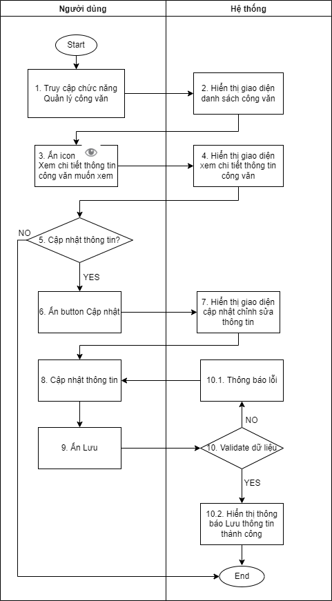

Mô tả luồng xử lý

Bước

Mô tả

Bước 1

Người sử dụng truy cập chức năng Quản lý công văn

Bước 2

Hệ thống hiển thị giao diện danh sách công văn

Bước 3

Người sử dụng ấn icon Xem chi tiết

Bước 4

Hệ thống hiển thị giao diện xem chi tiết thông tin công văn

Bước 5

Cập nhật thông tin? Nếu đồng ý thì chuyển bước 6. Nếu không thì kết thúc luồng.

Bước 6

Người sử dụng ấn button Cập nhật.

Bước 7

Hệ thống hiển thị giao diện cập nhật chỉnh sửa thông tin

Bước 8

Người sử dụng tiến hành cập nhật chỉnh sửa thông tin công văn.

Bước 9

Người sử dụng ấn nút Lưu để lưu lại thông tin chỉnh sửa

Bước 10

Hệ thống validate dữ liệu. Nếu thành công chuyển bước 10.2. Nếu không chuyển bước 10.1.

Bước 10.1

Hệ thống thông báo lỗi tại các trường nhập sai/sót thông tin. Chuyển bước 8.

Bước 10.2

Hiển thị thông báo Lưu thành công. Kết thúc luồng

							d)	Giao diện chức năng

--	Giao diện chỉnh sửa thông tin công văn đi (Tham khảo tương tự màn thêm mới và thêm phần Trạng thái gửi công văn đi)

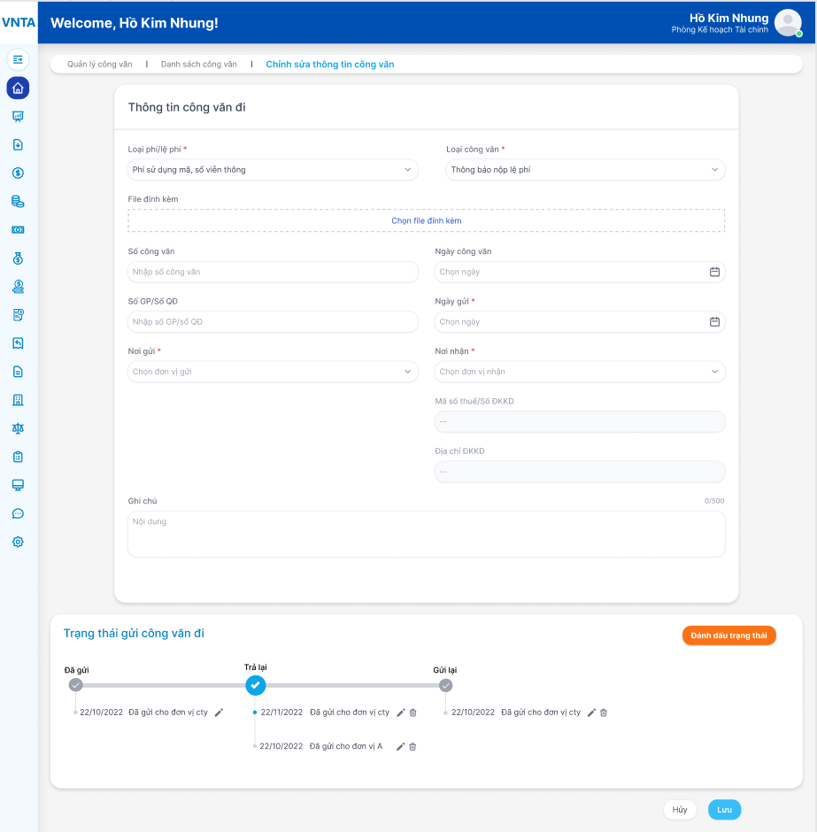

STT

Thông tin

Kiểu dữ liệu

Bắt buộc

Mô tả

Database

1

Thông tin công văn đi chung

Thông tin công văn đi chung

Thông tin công văn đi chung

Thông tin công văn đi chung

Thông tin công văn đi chung

1.1

Loại phí/Lệ phí/BCDT

Combobox search

x

Cho phép chọn 1/ nhiều loại phí/lệ phí/BCDT của công văn, bao gồm:

+ Phí CCDV viễn thông

+ Phí TLM viễn thông công cộng

+ Phí sử dụng mã, số viễn thông

+ Phí thử nghiệm mạng và dịch vụ viễn thông

+ Phí TLM viễn thông dùng riêng

+ Phí lắp đặt cáp viễn thông trên biển

+ Phí sửa chữa, bảo dưỡng cáp viễn

+ Lệ phí cấp phép

+ Lệ phí phân bổ mã, số viễn thông

+ Báo cáo doanh thu

1.2

Loại công văn/trích yếu

Combobox search

x

Cho phép chọn loại công văn tương ứng với Loại phí/lệ phí/BCDT đã chọn, bao gồm:

- Thông báo nộp lệ phí

- Thông báo nộp phí

- Thông báo nộp phí năm đầu

- Gửi P. Thanh tra

- Gửi 3 phòng ban liên quan thu BCDT

- Phản hồi

(Tham khảo tương tự chức năng thêm công văn đi)

1.3

Số công văn

Textbox

x

Cho phép chỉnh sửa số CV

1.4

Ngày công văn

datepicker

x

Cho phép chỉnh sửa ngày CV

1.5

Ngày gửi

datepicker

x

Cho phép chỉnh sửa ngày gửi

1.6

File đính kèm

Cho phép chọn nhiều file đính kèm.

Dung lượng tối đa 15MB/1 file.

1.7

Ghi chú

Text box

Cho phép chỉnh sửa ghi chú của công văn.

Maxlength: 500 kí tự.

1.8

Đánh dấu trạng thái

button

Nhấn để hiển thị popup đánh dấu trạng thái mới cho công văn.

1.9

Icon chỉnh sửa Ghi chú trạng thái

Button

Nhấn vào hiển thị popup chỉnh sửa Trạng thái. Cho phép sửa Ngày trạng thái và Ghi chú.

1.10

Icon Xóa

button

- Nhấn để xóa thông tin đánh dấu. Hiển thị popup xác nhận Xóa.

- Không cho phép xóa trạng thái “Đã gửi”

1.11

Lưu

button

Nhấn để lưu thông tin chỉnh sửa. Quay trở về màn xem chi tiết công văn đã chỉnh sửa.

1.12

Hủy

button

Nhấn -> hiển thị popup Xác nhận hủy. Nếu đồng ý Hủy thì không lưu lại thông tin vừa chỉnh sửa, đóng popup và quay trở về màn Xem chi tiết thông tin công văn đó.

1.13

Nơi gửi

Combobox search

x

Cho phép chọn 1 nơi gửi, bao gồm:

- P. CPTN - Cục Viễn thông

- P. KHTC - Cục Viễn thông

- P. Kinh tế - Cục Viễn thông

(Tham khảo chức năng thêm mới công văn đi)

1.14

Nơi nhận

Combobox search

x

- Cho phép chọn 1 nơi nhận

- Nếu nơi nhận là phòng ban của Cục thì ẩn trường MST, Địa chỉ ĐKKD.

(Tham khảo chức năng thêm mới công văn đi)

1.15

MST/Số ĐKKD

Text

Autofill theo tên nơi nhận.

1.16

Địa chỉ ĐKKD

Text

Autofill theo tên nơi nhận.

2

Thông tin công văn đi phản hồi

Thông tin công văn đi phản hồi

Thông tin công văn đi phản hồi

Thông tin công văn đi phản hồi

Thông tin công văn đi phản hồi

2.1

Loại phí/Lệ phí/BCDT

Combobox search

x

Cho phép chọn loại phí/lệ phí/BCDT của công văn, bao gồm:

+ Phí CCDV viễn thông

+ Phí TLM viễn thông công cộng

+ Phí sử dụng mã, số viễn thông

+ Phí thử nghiệm mạng và dịch vụ viễn thông

+ Phí TLM viễn thông dùng riêng

+ Phí lắp đặt cáp viễn thông trên biển

+ Phí sửa chữa, bảo dưỡng cáp viễn thông trên biển

+ Lệ phí cấp phép

+ Lệ phí phân bổ mã, số viễn thông

+ Báo cáo doanh thu

2.2

Loại công văn/trích yếu

Combobox search

x

Cho phép chọn loại công văn tương ứng với loại phí/lệ phí/bcdt đã chọn, bao gồm:

- Thông báo nộp lệ phí

- Thông báo nộp phí năm đầu

- Thông báo nộp phí

- Đôn đốc nộp phí

- Đối chiếu công nợ

- Thông báo nộp BCDT

- Đôn đốc nộp BCDT

- Gửi P. Thanh tra

- Gửi 3 phòng ban liên quan thu BCDT

- Phản hồi

(Tham khảo tương tự chức năng thêm công văn đi)

2.3

Số công văn

Textbox

x

Cho phép chỉnh sửa số CV

2.4

Ngày công văn

datepicker

x

Cho phép chỉnh sửa ngày CV

2.5

Ngày gửi

datepicker

x

Cho phép chỉnh sửa ngày gửi

2.6

File đính kèm

Cho phép chọn lại 1/nhiều file đính kèm. Tối đa 15MB/file.

2.7

Công văn liên quan

Cho phép chọn lại các công văn liên quan

2.8

Ghi chú

Text box

Cho phép chỉnh sửa ghi chú của công văn.

Maxlength: 500 kí tự.

2.9

Đánh dấu trạng thái

button

Nhấn để hiển thị popup đánh dấu trạng thái mới cho công văn.

2.10

Icon chỉnh sửa Ghi chú trạng thái

Button

Nhấn vào hiển thị popup chỉnh sửa Trạng thái. Cho phép sửa Ngày trạng thái và Ghi chú.

2.11

Icon Xóa

button

Nhấn để xóa thông tin đánh dấu. Hiển thị popup xác nhận Xóa.

2.12

Lưu

button

Nhấn để lưu thông tin chỉnh sửa. Quay trở về màn xem chi tiết công văn đã chỉnh sửa.

2.13

Hủy

button

Nhấn -> hiển thị popup Xác nhận hủy. Nếu đồng ý Hủy thì không lưu lại thông tin vừa chỉnh sửa, đóng popup và quay trở về màn Xem chi tiết thông tin công văn đó.

2.14

Nơi gửi

Combobox search

x

Cho phép chọn 1 nơi gửi, bao gồm:

- P. CPTN - Cục Viễn thông

- P. KHTC - Cục Viễn thông

- P. Kinh tế - Cục Viễn thông

(Tham khảo chức năng thêm mới công văn đi)

2.15

Nơi nhận

Combobox search

x

- Cho phép chọn 1 nơi nhận

- Nếu nơi nhận là phòng ban của Cục thì ẩn trường MST, Địa chỉ ĐKKD.

(Tham khảo chức năng thêm mới công văn đi)

2.16

MST/Số ĐKKD

Text

Autofill theo tên nơi nhận.

2.17

Địa chỉ ĐKKD

Text

Autofill theo tên nơi nhận.

--	Giao diện chọn công văn liên quan

STT

Thông tin

Kiểu dữ liệu

Bắt buộc

Mô tả

Database

1

Tra cứu

Tra cứu

Tra cứu

Tra cứu

Tra cứu

1.1

Loại phí/lệ phí/BCDT

Combobox search

- Chứa all các loại phí/lệ phí/BCDT có trong hệ thống:

+ Phí CCDV viễn thông

+ Phí TLM viễn thông công cộng

+ Phí sử dụng mã, số viễn thông

+ Phí thử nghiệm mạng và dịch vụ viễn thông

+ Phí TLM viễn thông dùng riêng

+ Phí lắp đặt cáp viễn thông trên biển

+ Phí sửa chữa, bảo dưỡng cáp viễn

+ Lệ phí cấp phép

+ Lệ phí phân bổ mã, số viễn thông

+ Báo cáo doanh thu

- Cho phép chọn 1 hoặc nhiều loại phí/lệ phí/BCDT. Mặc định ko chọn là Chọn tất cả.

- Cho phép nhập loại phí/lệ phí/BCDT. Autocomplete.

1.2

Chọn loại công văn/trích yếu

Combobox search

- Chứa all các loại công văn/trích yếu có trong hệ thống.

- Cho phép chọn 1 hoặc nhiều loại công văn/trích yếu. Mặc định ko chọn là Chọn tất cả.

- Autocomplete gõ nhập tên loại công văn hệ thống tự động gợi ý.

- Danh sách được sắp xếp:

Mặc định các loại công văn được sắp xếp theo thứ tự:

+ Thông báo nộp BCDT

+ Đôn đốc nộp BCDT

+ Thông báo nộp phí

+ Thông báo nộp phi năm đầu

+ Thông báo nộp lệ phí

+ Đôn đốc nộp phí

+ Đối chiếu công nợ

+ Gửi P. Thanh tra

+ Gửi 3 phòng ban liên quan thu BCDT

Các công văn trích yếu sắp xếp sau đó và theo ngày tạo giảm dần.

1.3

Chọn số công văn

Combobox search

- Chứa all các số công văn có trong hệ thống.

- Cho phép chọn nhiều Số công văn. Mặc định ko chọn là Chọn tất cả.

- Cho phép nhập số công văn. Autocomplete.

1.4

Chọn ngày gửi/ngày nhận

datepicker

- Cho phép chọn theo ngày gửi/nhận công văn đi/đến

1.5

Tìm kiếm

button

Nhấn để tìm kiếm theo thông tin tra cứu

2

GRID

GRID

GRID

GRID

GRID

2.1

Loại phí/lệ phí/BCDT

Text

Hiển thị tên loại phí/lệ phí/BCDT của các công văn đến/đi đã có trên hệ thống.

2.2

Loại công văn/trích yếu

Text

Hiển thị tên loại công văn/trích yếu của các công văn đến/đi đã có trên hệ thống.

2.3

Số công văn

Text

Hiển thị số công văn của các công văn đến/đi đã có trên hệ thống.

2.4

Ngày gửi/ngày nhận

Text

Hiển thị ngày gửi/ngày nhận của các công văn đến/đi đã có trên hệ thống.

3

Chọn

button

Nhấn để lưu các công văn liên quan đã chọn. Nếu chưa đánh dấu checkbox nào thì hiển thị noti thông báo: “Vui lòng tích chọn vào công văn liên quan.”

4

Hủy

button

Hủy bỏ thao tác chọn công văn liên quan, đóng popup.

--

--	Giao diện popup xác nhận xóa trạng thái

--	Giao diện popup chỉnh sửa thông tin trạng thái

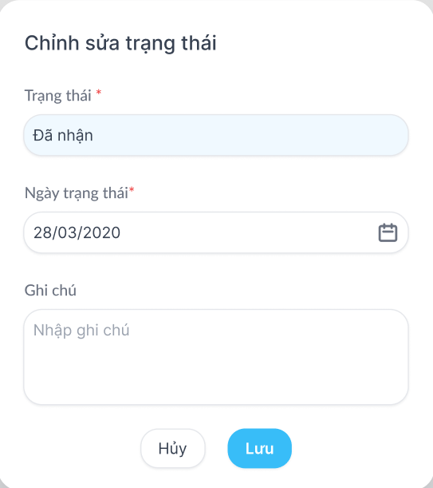

STT

Thông tin

Kiểu dữ liệu

Bắt buộc

Mô tả

Database

1

Trạng thái

Text

Hiển thị tên trạng thái.

2

Ngày trạng thái

datepicker

Cho phép thay đổi ngày trạng thái.

3

Ghi chú

Textbox

Cho phép chỉnh sửa ghi chú.

Maxlength 500 kì tự.

4

Lưu

button

Nhấn để lưu chỉnh sửa thông tin trạng thái.

5

Hủy

button

Hủy bỏ thao tác chỉnh sửa và đóng popup.

Giao diện chỉnh sửa thông tin công văn đến

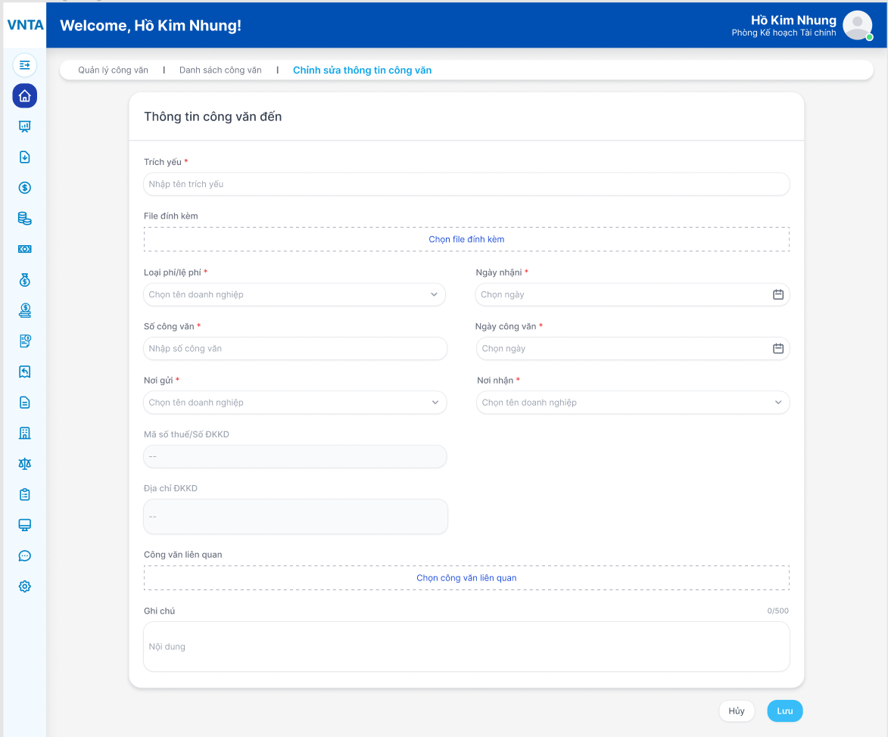

STT

Thông tin

Kiểu dữ liệu

Bắt buộc

Mô tả

Database

1

Thông tin công văn đến

Thông tin công văn đến

Thông tin công văn đến

Thông tin công văn đến

Thông tin công văn đến

1.1

Loại phí/Lệ phí/BCDT

Combobox search

x

Cho phép chọn loại phí/lệ phí/BCDT của công văn, bao gồm:

+ Phí CCDV viễn thông

+ Phí TLM viễn thông công cộng

+ Phí sử dụng mã, số viễn thông

+ Phí thử nghiệm mạng và dịch vụ viễn thông

+ Phí TLM viễn thông dùng riêng

+ Phí lắp đặt cáp viễn thông trên biển

+ Lệ phí cấp phép

+ Lệ phí phân bổ mã, số viễn thông

+ Báo cáo doanh thu

+ Phí sửa chữa, bảo dưỡng cáp viễn thông trên biển

1.2

Trích yếu

Combobox search

x

Cho phép chỉnh sửa tên trích yếu.

1.3

Số công văn

Textbox

x

Cho phép chỉnh sửa số CV.

1.4

Ngày công văn

datepicker

x

Cho phép chỉnh sửa ngày CV.

1.5

Ngày nhận

datepicker

x

Cho phép chỉnh sửa ngày nhận.

1.6

File đính kèm

Cho phép chọn nhiều file đính kèm.

Dung lượng tối đa 15MB/1 file.

1.7

Công văn liên quan

Cho phép chọn lại các công văn liên quan.

1.8

Ghi chú

Text box

Cho phép chỉnh sửa ghi chú của công văn.

Maxlength: 500 kí tự.

1.9

Nơi gửi

Combobox search

x

Cho phép chỉnh sửa chọn 1 DN khác.

1.10

MST/Số ĐKKD

Text

Autofill theo tên nơi gửi.

1.11

Địa chỉ ĐKKD

Text

Autofill theo tên nơi gửi.

1.12

Nơi nhận

Combobox search

x

Cho phép chọn 1/nhiều phòng ban trong Cục Viễn thông, bao gồm:

- P. CPTN - Cục Viễn thông

- P. KHTC - Cục Viễn thông

- P. Kinh tế - Cục Viễn thông

(Tham khảo chức năng thêm mới công văn đi)

1.13

Lưu

button

Nhấn để lưu thông tin chỉnh sửa. Quay trở về màn xem chi tiết công văn đã chỉnh sửa.

1.14

Hủy

button

Nhấn -> hiển thị popup Xác nhận hủy. Nếu đồng ý Hủy thì không lưu lại thông tin vừa chỉnh sửa, đóng popup và quay trở về màn Xem chi tiết thông tin công văn đó.

--		Giao diện “Xác nhận Hủy”

	

STT

Tên

Kiểu

dữ liệu

Bắt buộc

Mô tả

Database

1

Xác nhận hủy

Pop-up

Sau khi NSD nhấn [Hủy] từ giao diện Hủy, hệ thống hiển thị pop-up xác nhận Hủy import công văn:

“Các thay đổi sẽ không được lưu lại.

Bạn có chắc chắn muốn hủy không?

2

Quay về

Button

Nhấn [Quay về] => hệ thống hiển thị màn đang import/thêm mới trước đó.

3

Hủy

Button

Nhấn [Hủy] => hệ thống thực hiện thao tác hủy thông tin import công văn. Quay trở về màn danh sách trước đó đang tìm kiếm.

Quản lý giấy phép cho phép lắp đặt cáp viễn thông trên biển

Tham khảo giao diện danh sách giấy phép tương tự mục 2.1.

Thêm mới giấy phép cho phép lắp đặt cáp viễn thông trên biển

Luồng chức năng

Thông tin chung

Tên chức năng

Thêm mới giấy phép cho phép lắp đặt cáp viễn thông trên biển.

Mô tả

Chức năng cho phép tạo mới giấy phép cho phép lắp đặt cáp viễn thông trên biển.

Tác nhân

Lãnh đạo, Cán bộ Phòng KHTC, Phòng CPTN, Phòng Kinh tế.

Điều kiện trước

Đăng nhập vào hệ thống, có phân quyền chức năng

Điều kiện sau

Thêm mới giấy phép thành công.

Ngoại lệ

N/A

Các yêu cầu đặc biệt

N/A

--	Luồng chức năng

--	Giữ nguyên như phase 1.

--	b. Giao diện chức năng

--	Giao diện thêm mới giấy phép khi chọn loại giấy phép là “Giấy phép lắp đặt cáp VT trên biển”:

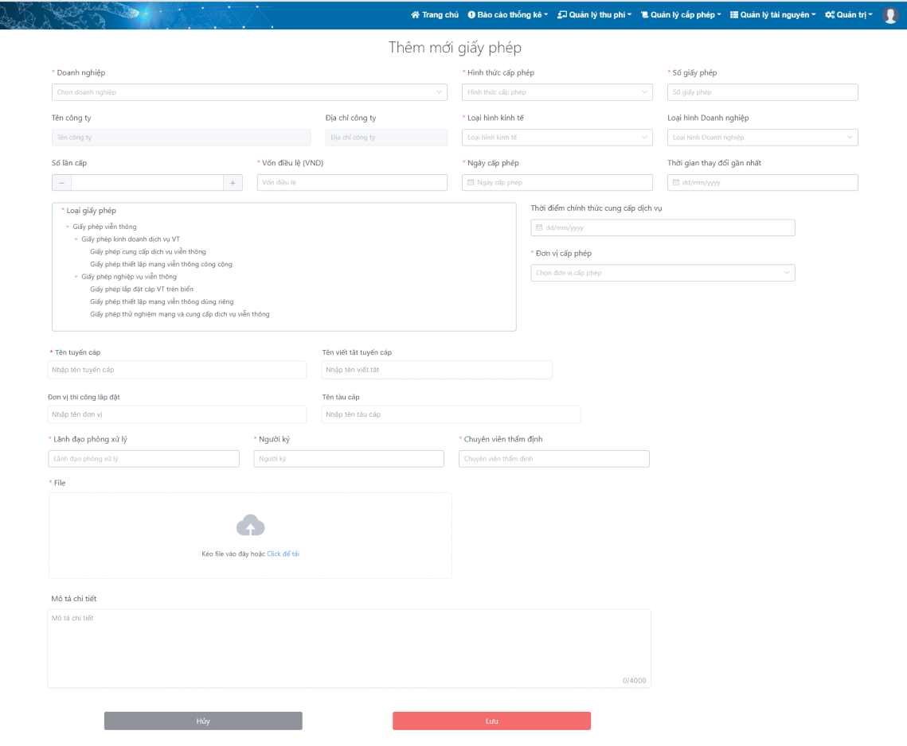

STT

Tên

Kiểu

dữ liệu

Bắt buộc

Mô tả

Database

1

- Các trường thông tin từ “Doanh nghiệp” đến “Loại giấy phép”, “Đơn vị cấp phép” -> Giữ nguyên phase 1.

- Các trường thông tin từ “Lãnh đạo phòng xử lý” đến hết -> giữ nguyên phase 1.

- Các trường thông tin từ “Doanh nghiệp” đến “Loại giấy phép”, “Đơn vị cấp phép” -> Giữ nguyên phase 1.

- Các trường thông tin từ “Lãnh đạo phòng xử lý” đến hết -> giữ nguyên phase 1.

- Các trường thông tin từ “Doanh nghiệp” đến “Loại giấy phép”, “Đơn vị cấp phép” -> Giữ nguyên phase 1.

- Các trường thông tin từ “Lãnh đạo phòng xử lý” đến hết -> giữ nguyên phase 1.

- Các trường thông tin từ “Doanh nghiệp” đến “Loại giấy phép”, “Đơn vị cấp phép” -> Giữ nguyên phase 1.

- Các trường thông tin từ “Lãnh đạo phòng xử lý” đến hết -> giữ nguyên phase 1.

- Các trường thông tin từ “Doanh nghiệp” đến “Loại giấy phép”, “Đơn vị cấp phép” -> Giữ nguyên phase 1.

- Các trường thông tin từ “Lãnh đạo phòng xử lý” đến hết -> giữ nguyên phase 1.

2

Tên tuyến cáp

Textbox

x

Cho phép nhập tên tuyến cáp

Maxlenght: 200 ký tự

3

Tên viết tắt tuyến cáp

Textbox

Cho phép nhập tên viết tắt tuyến cáp.

Maxlenght: 200 ký tự

4

Đơn vị thi công lắp đặt

Textbox

Cho phép nhập tên đơn vị thi công lắp đặt tuyến cáp.

Maxlenght: 200 ký tự

5

Tên tàu cáp

Textbox

Cho phép nhập tên tàu cáp.

Maxlenght: 200 ký tự

6

Đơn vị thi công

Textbox

Cho phép nhập tên đơn vị thi công sửa chữa/bảo dưỡng tuyến cáp.

Maxlenght: 200 ký tự

Xuất công văn thu phí/lệ phí lắp đặt cáp viễn thông trên biển.

Luồng chức năng

Thông tin chung

Tên chức năng

Nhập thông tin xuất công văn thu phí/lệ phí lắp đặt cáp viễn thông trên biển.

Mô tả

Chức năng “Nhập thông tin xuất công văn thu phí/lệ phí lắp đặt cáp viễn thông trên biển” được update trong chức năng “Cấp giấy phép” – màn “Danh sách giấy phép” của hệ thống QLVT.

Chức năng cho phép nhập thông tin xuất công văn:

- Cv thu phí lắp đặt cáp viễn thông trên biển

- Cv thu lệ phí cấp phép

Phần mô tả sẽ mô tả các thông tin sẽ được thêm vào hệ thống QLVT. Tham khảo mục 2.2.

Tác nhân

Cán bộ P. CPTN

Điều kiện trước

Đăng nhập vào hệ thống, có phân quyền chức năng

Điều kiện sau

Xuất công văn thành công

Ngoại lệ

N/A

Các yêu cầu đặc biệt

N/A

Luồng chức năng

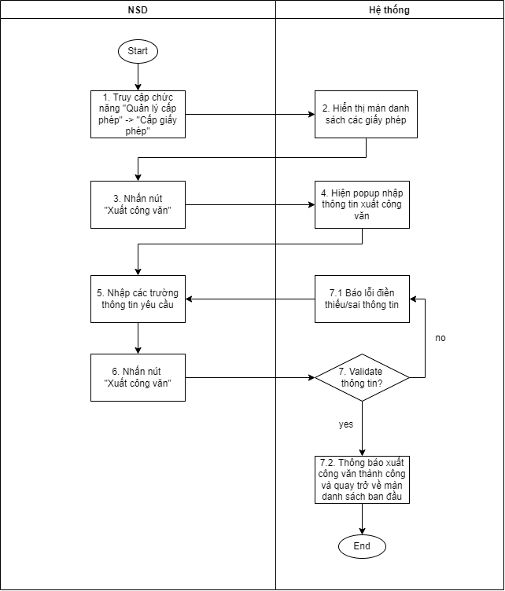

Mô tả luồng xử lý

Bước

Mô tả

Bước 1

Truy cập chức năng "Quản lý cấp phép" -> "Cấp giấy phép"

Bước 2

Hiển thị màn danh sách các giấy phép

Bước 3

Nhấn [Xuất công văn]

Bước 4

Hiện popup nhập thông tin xuất công văn

Bước 5

NSD tiến hành nhập thông tin tại các trường dữ liệu.

Bước 6

Nhấn [Xuất công văn]

Bước 7

Hệ thống kiểm tra tính hợp lệ thông tin nhập:

- Nếu hợp lệ, chuyển bước 7.2

- Nếu không hợp lệ, chuyển bước 7.1

Bước 7.1

Hệ thống đưa ra thông báo tại các trường nhập không hợp lệ. Quay lại bước 5

Ví dụ: Số giấy phép không được để trống!, Loại công văn không được để trống!, Hạn nộp không được để trống!

Bước 7.2

Thông báo xuất công văn thành công và quay trở lại màn danh sách ban đầu.

Hệ thống tải về file word công văn NSD thiết lập.

- Tên file công văn: Cv thu phí lắp đặt cáp viễn thông trên biển – [Tên doanh nghiêp].

Ví dụ: Cv thu phí lắp đặt cáp viễn thông trên biển – Tập đoàn viễn thông quân đội.

- Tên file công văn thu lệ phí cấp phép: Cv thu lệ phí giấy phép [Số giấy phép]_[Tên DN]

Giao diện chức năng

Giao diện pop-up “Nhập thông tin xuất công văn” (đã update mô tả chi tiết trong mục 2.2.b (thêm loại phí lắp đặt cáp viễn thông trên biển)).

Quản lý công văn cho phép sửa chữa, bảo dưỡng cáp viễn thông trên biển

Danh sách công văn cho phép sửa chữa cáp viễn thông trên biển

Luồng chức năng

Thông tin chung

Tên chức năng

Xem danh sách công văn cho phép sửa chữa cáp viễn thông trên biển

Mô tả

Chức năng cho phép xem thông tin danh sách các công văn cho phép bảo dưỡng, sửa chữa tuyến cáp đã lắp đặt

Tác nhân

Lãnh đạo, Cán bộ Phòng KHTC, Phòng CPTN, Phòng Kinh tế

Điều kiện trước

Đăng nhập vào hệ thống, có phân quyền chức năng

Điều kiện sau

Xem, tìm kiếm được danh sách công văn

Ngoại lệ

N/A

Các yêu cầu đặc biệt

N/A

Luồng chức năng

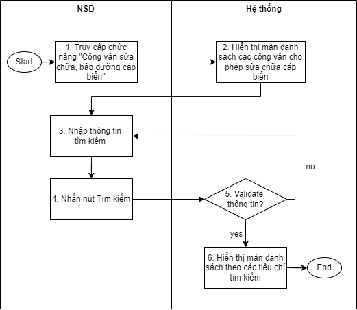

	Mô tả luồng xử lý

Bước

Mô tả

Bước 1

Truy cập chức năng "Công văn sửa chữa, bảo dưỡng cáp biển"

Bước 2

Hiển thị màn danh sách các công văn cho phép sửa chữa cáp biển

Bước 3

Nhập thông tin tìm kiếm

Bước 4

Nhấn nút Tìm kiếm

Bước 5

Validate thông tin:

- Nếu hợp lệ chuyển bước 6.

- Nếu không hợp lệ, hệ thống đưa ra thông báo tại các trường nhập không hợp lệ. Quay lại bước 3.

Bước 6

Hiển thị màn danh sách theo các tiêu chí tìm kiếm

--	b. Giao diện chức năng

--	Giao diện ẩn khung tìm kiếm

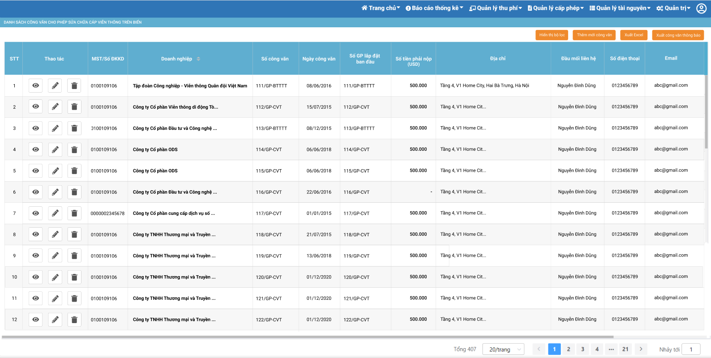

--	Giao diện hiển thị khung tìm kiếm

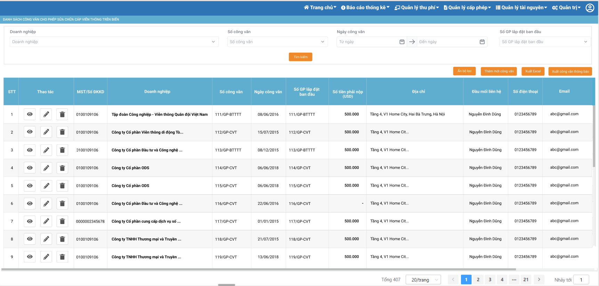

STT

Tên

Kiểu

dữ liệu

Bắt buộc

Mô tả

Database

1

Khung tìm kiếm

Khung tìm kiếm

Khung tìm kiếm

Khung tìm kiếm

Khung tìm kiếm

1.1

Doanh nghiệp

Combobox search

- Cho phép chọn 1/nhiều DN đã có công văn cho phép sửa chữa cáp trên hệ thống.

1.2

Số công văn

Combobox search

- Cho phép chọn 1/nhiều số công văn cho phép sửa chữa cáp đã có trên hệ thống.

1.3

Ngày công văn

datepicker

- Cho phép chọn ngày công văn.

- “Đến ngày” >= “Từ ngày”.

1.4

Số GP lắp đặt ban đầu

Combobox search

- Hiển thị tất cả các GP lắp đặt cáp viễn thông trên biển

- Cho phép nhập/chọn 1 số GP lắp đặt cáp.

- Autocomplete.

1.5

Hiện bộ lọc/Ẩn bộ lọc

button

Nhấn để hiện/ẩn khung tìm kiếm.

1.6

Thêm mới công văn

button

Nhấn -> hiển thị popup thêm mới công văn cho phép sửa chữa, bảo dưỡng cáp.

1.7

Xuất excel

button

Nhấn để xuất excel bảng bên dưới đang tìm kiếm.

1.8

Xuất công văn thông báo

button

Nhấn -> hiển thị popup Xuất công văn thông báo thu phí sửa chữa, bảo dưỡng cáp.

2

Grid

Grid

Grid

Grid

Grid

2.1

STT

Text

Hiển thị STT

2.2

Thao tác

Text

- Gồm các thao tác: Xem/Sửa/Xóa.

- Nhấn vào icon “Xem” -> hiển thị màn xem chi tiết thông tin công văn.

- Nhấn vào icon “Sửa” -> hiển thị màn chỉnh sửa thông tin công văn.

- Nhấn vào icon “Xóa” -> hiển thị popup xác nhận xóa công văn.

2.3

Doanh nghiệp

Text

Hiển thị tên DN

2.4

Số công văn

Text

Hiển thị số công văn.

2.5

Ngày công văn

Date

Hiển thị ngày công văn.

Định dạng: dd/mm/yyyy

2.6

Số GP lắp đặt ban đầu

Text

Hiển thị số GP lắp đặt cáp biển ban đầu.

2.7

Số tiền phải nộp (USD)

Currency

Hiển thị số tiền phí sửa chữa/bảo dưỡng cáp biển tính theo USD

Định dạng ngăn cách hàng nghìn là dấu “.”.

2.8

Địa chỉ

Text

Hiển thị địa chỉ của DN.

2.9

Đầu mối liên hệ

Text

Hiển thị tên đầu mối liên hệ của DN.

2.10

Số điện thoại

number

Hiển thị SĐT của đầu mối liên hệ.

2.11

Email

Text

Hiển thị email của đầu mối liên hệ.

3

Phân trang

Phân trang

Phân trang

Phân trang

Phân trang

3.1

Tổng số bản ghi

Text

Hiển thị tổng số bản ghi theo điều kiện tìm kiếm

3.2

Phân trang

button

Gồm các button: Về trang trước đó, 1, 2, 3 (nếu ít trang hơn sẽ tự cắt bớt), trang sau đó

3.3

Số bản ghi trên 1 trang

combobox

Gồm:

10/20/50/100

Mặc định 10 bản ghi trên 1 trang

3.4

Nhảy tới

Textbox

- Nhập số trang => hệ thống nhảy đến dữ liệu trang tương ứng

--	Giao diện popup xác nhận xóa công văn

STT

Tên

Kiểu

dữ liệu

Bắt buộc

Bắt buộc

Mô tả

Database

Bạn có muốn xóa công văn có số công văn là:

Bạn có muốn xóa công văn có số công văn là:

Bạn có muốn xóa công văn có số công văn là:

Bạn có muốn xóa công văn có số công văn là:

Bạn có muốn xóa công văn có số công văn là:

Bạn có muốn xóa công văn có số công văn là:

1

Có

Button

Nhấn để đồng ý xóa công văn.

- Khi nhấn Có, hệ thống check không cho phép xóa công văn nếu đã có phát sinh biên lai cho công văn cho phép sửa chữa cáp tương ứng

Nhấn để đồng ý xóa công văn.

- Khi nhấn Có, hệ thống check không cho phép xóa công văn nếu đã có phát sinh biên lai cho công văn cho phép sửa chữa cáp tương ứng

2

Không

Button

Nhấn để hủy thao tác xóa công văn. Đóng popup.

Nhấn để hủy thao tác xóa công văn. Đóng popup.

3

x

Icon button

Nhấn để đóng popup.

Nhấn để đóng popup.

Thêm mới công văn cho phép sửa chữa cáp viễn thông trên biển

Luồng chức năng

Thông tin chung

Tên chức năng

Thêm mới công văn cho phép sửa chữa cáp viễn thông trên biển

Mô tả

Chức năng cho phép tạo mới công văn cho phép bảo dưỡng, sửa chữa tuyến cáp đã lắp đặt.

Tác nhân

Lãnh đạo, Cán bộ Phòng KHTC, Phòng CPTN, Phòng Kinh tế

Điều kiện trước

Đăng nhập vào hệ thống, có phân quyền chức năng

Điều kiện sau

Thêm mới công văn thành công.

Ngoại lệ

N/A

Các yêu cầu đặc biệt

N/A

Luồng chức năng

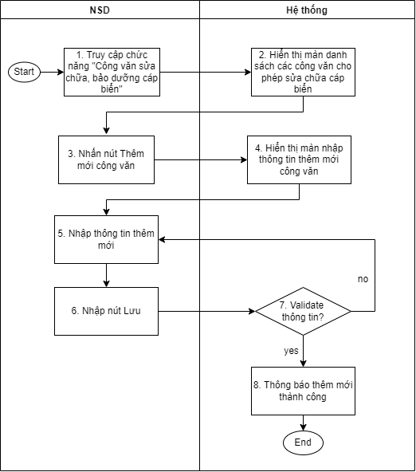

	Mô tả luồng xử lý

Bước

Mô tả

Bước 1

Truy cập chức năng "Công văn sửa chữa, bảo dưỡng cáp biển"

Bước 2

Hiển thị màn danh sách các công văn cho phép sửa chữa cáp biển

Bước 3

Nhấn nút Thêm mới công văn

Bước 4

Hiển thị màn nhập thông tin thêm mới công văn

Bước 5

Nhập thông tin thêm mới

Bước 6

Nhấn nút Lưu

Bước 7

Validate thông tin? Nếu lỗi thì thông báo lỗi tại các trường sai và quay trở lại bước 5. Nếu không chuyển qua bước 8.

Bước 8

Thông báo Thêm mới công văn thành công.

--	b. Giao diện chức năng

--	Giao diện thêm mới công văn

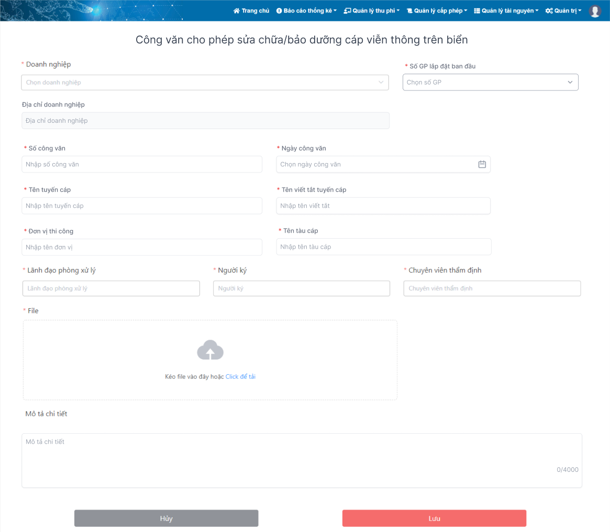

STT

Tên

Kiểu

dữ liệu

Bắt buộc

Mô tả

Database

1

Doanh nghiệp

Combobox search

x

Hiển thị các DN có giấy phép lắp đặt cáp biển.

2

Địa chỉ doanh nghiệp

Text

Autofill theo tên doanh nghiệp.

3

Số GP lắp đặt ban đầu

Combobox search

x

- Hiển thị tất cả các GP lắp đặt cáp viễn thông trên biển theo tên DN đang chọn.

- Cho phép chọn 1 số GP lắp đặt cáp.

4

Số công văn

Text

x

- Cho phép nhập số công văn.

- Check trùng số công văn cho phép sửa chữa/bảo dưỡng cáp. Đưa ra thông báo: “Số công văn đã tồn tại. Vui lòng nhập số công văn mới.”

5

Ngày công văn

datepicker

x

- Cho phép chọn ngày công văn.

6

Tên tuyến cáp

Textbox

x

Cho phép nhập tên tuyến cáp.

Maxlength 200 kí tự.

7

Tên viết tắt tuyến cáp

Textbox

x

Cho phép nhập tên viết tắt tuyến cáp.

Maxlength 200 kí tự.

8

Đơn vị thi công

Textbox

x

Cho phép nhập tên đơn vị thi công sửa chữa/bảo dưỡng tuyến cáp.

Maxlength 200 kí tự.

9

Tên tàu cáp

Textbox

x

Cho phép nhập tên tàu cáp.

Maxlength 200 kí tự.

10

Lãnh đạo phòng xử lý

Textbox

x

Giữ nguyên như phase 1.

11

Người ký

Textbox

x

Giữ nguyên như phase 1.

12

Chuyên viên thẩm định

Textbox

x

Giữ nguyên như phase 1.

13

File

Textbox

x

Giữ nguyên như phase 1.

14

Mô tả chi tiết

Textbox

Giữ nguyên như phase 1.

15

Lưu

Button

Giữ nguyên như phase 1.

16

Hủy

Button

Giữ nguyên như phase 1.

Xem chi tiết công văn cho phép sửa chữa cáp viễn thông trên biển

Luồng chức năng

Thông tin chung

Tên chức năng

Xem chi tiết công văn cho phép sửa chữa cáp viễn thông trên biển

Mô tả

Chức năng cho phép xem chi tiết thông tin công văn cho phép bảo dưỡng, sửa chữa tuyến cáp đã lắp đặt.

Tác nhân

Lãnh đạo, Cán bộ Phòng KHTC, Phòng CPTN, Phòng Kinh tế

Điều kiện trước

Đăng nhập vào hệ thống, có phân quyền chức năng

Điều kiện sau

Xem được thông tin công văn.

Ngoại lệ

N/A

Các yêu cầu đặc biệt

N/A

Luồng chức năng

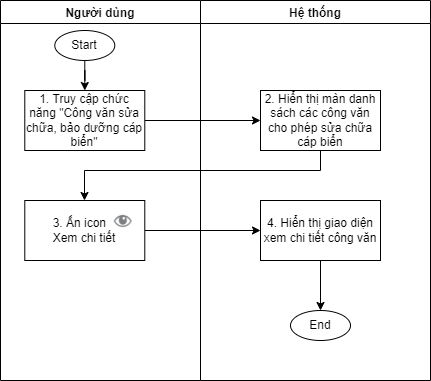

	Mô tả luồng xử lý

Bước

Mô tả

Bước 1

Truy cập chức năng "Công văn sửa chữa, bảo dưỡng cáp biển"

Bước 2

Hiển thị màn danh sách các công văn cho phép sửa chữa cáp biển

Bước 3

Ấn icon Xem chi tiết

Bước 4

Hiển thị giao diện xem chi tiết công văn

--	b. Giao diện chức năng

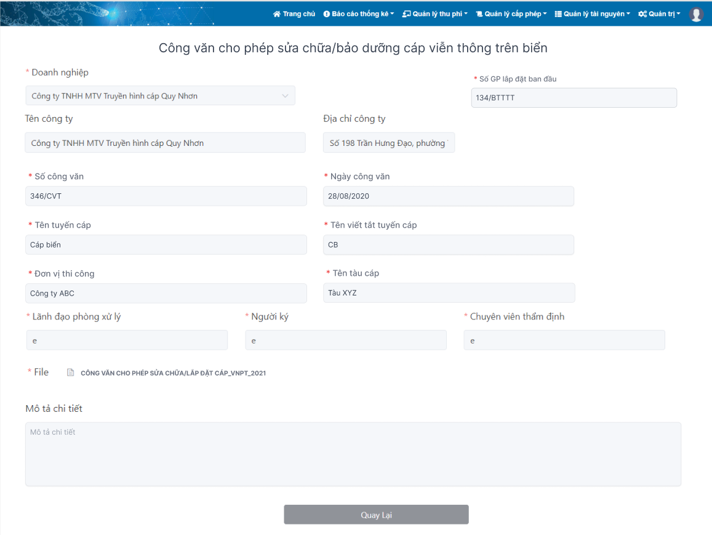

STT

Tên

Kiểu

dữ liệu

Bắt buộc

Mô tả

Database

1

Doanh nghiệp

Text

Hiển thị tên DN.

2

Tên công ty

Text

Hiển thị tên công ty.

3

Địa chỉ công ty

Text

Hiển thị địa chỉ công ty.

4

Số GP lắp đặt ban đầu

Text

- Hiển thị số GP lắp đặt cáp viễn thông trên biển.

5

Số công văn

Text

Hiển thị số công văn.

6

Ngày công văn

Date

Hiển thị ngày công văn.

7

Tên tuyến cáp

Text

Hiển thị tên tuyến cáp

8

Tên viết tắt tuyến cáp

Text

Hiển thị tên viết tắt tuyến cáp.

9

Đơn vị thi công

Text

Hiển thị tên đơn vị thi công sửa chữa/bảo dưỡng tuyến cáp.

10

Tên tàu cáp

Text

Hiển thị tên tàu cáp.

11

Lãnh đạo phòng xử lý

Text

Hiển thị lãnh đạo phòng.

12

Người ký

Text

Hiển thị tên người ký.

13

Chuyên viên thẩm định

Text

Hiển thị tên chuyên viên thẩm định.

14

File

Hiển thị file đính kèm.

15

Mô tả chi tiết

Text

Hiển thị mô tả chi tiết.

16

Quay lại

button

Nhấn để quay trở lại màn danh sách đang tìm kiếm.

Chỉnh sửa thông tin công văn cho phép sửa chữa cáp viễn thông trên biển

Luồng chức năng

Thông tin chung

Tên chức năng

Chỉnh sửa thông tin công văn cho phép sửa chữa cáp viễn thông trên biển

Mô tả

Chức năng cho phép chỉnh sửa thông tin công văn cho phép bảo dưỡng, sửa chữa tuyến cáp đã lắp đặt.

Tác nhân

Lãnh đạo, Cán bộ Phòng KHTC, Phòng CPTN, Phòng Kinh tế

Điều kiện trước

Đăng nhập vào hệ thống, có phân quyền chức năng

Điều kiện sau

Chỉnh sửa và lưu thành công các thông tin công văn được thay đổi điều chỉnh.

Ngoại lệ

N/A

Các yêu cầu đặc biệt

N/A

Luồng chức năng

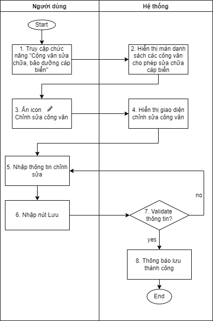

	Mô tả luồng xử lý

Bước

Mô tả

Bước 1

Truy cập chức năng "Công văn sửa chữa, bảo dưỡng cáp biển"

Bước 2

Hiển thị màn danh sách các công văn cho phép sửa chữa cáp biển

Bước 3

Ấn icon Chỉnh sửa công văn

Bước 4

Hiển thị giao diện chỉnh sửa công văn

Bước 5

Nhập thông tin chỉnh sửa

Bước 6

Nhập nút Lưu

Bước 7

Validate thông tin? Nếu lỗi thì thông báo lỗi tại các trường sai và quay trở lại bước 5. Nếu không chuyển qua bước 8.

Bước 8

Hiển thị thông báo Lưu thành công. Kết thúc luồng.

--	b. Giao diện chức năng

Tham khảo tương tự màn thêm mới, chỉ khác một số trường thông tin sau:

STT

Tên

Kiểu

dữ liệu

Bắt buộc

Mô tả

Database

1

Doanh nghiệp

Text

Hiển thị tên DN.

2

Địa chỉ doanh nghiệp

Text

Autofill theo tên doanh nghiệp.

Xuất công văn thông báo thu phí sửa chữa, bảo dưỡng cáp biển

--	a. Luồng chức năng

Thông tin chung

Tên chức năng

Xuất công văn thông báo thu phí sửa chữa, bảo dưỡng cáp biển.

Mô tả

Chức năng cho phép xuất công văn thông báo thu phí sửa chữa, bảo dưỡng cáp biển tới các DN có công văn cho phép sửa chữa, bảo dưỡng cáp biển.

Tác nhân

Lãnh đạo, Cán bộ Phòng KHTC, Phòng CPTN, Phòng Kinh tế.

Điều kiện trước

Đăng nhập vào hệ thống, có phân quyền chức năng.

Điều kiện sau

Xuất công văn thành công.

Ngoại lệ

N/A

Các yêu cầu đặc biệt

N/A

Luồng chức năng

--	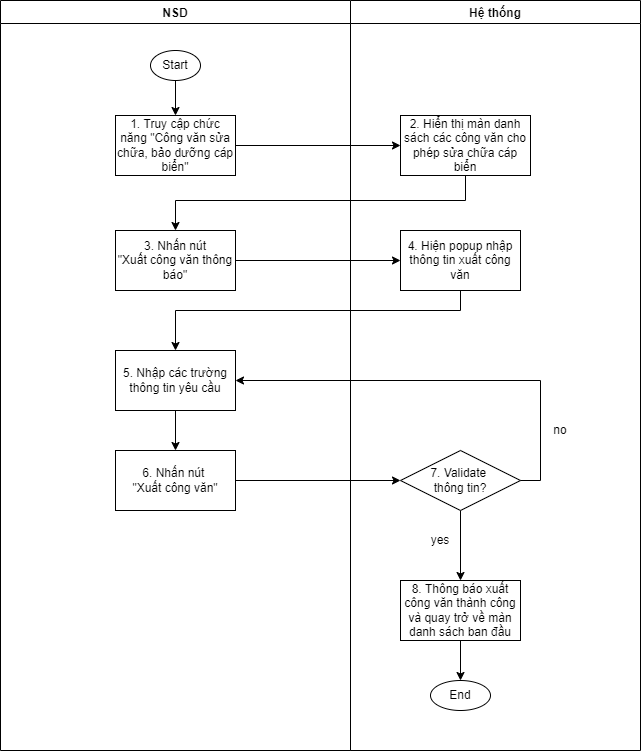

	Mô tả luồng xử lý

Bước

Mô tả

Bước 1

Truy cập chức năng "Công văn sửa chữa, bảo dưỡng cáp biển"

Bước 2

Hiển thị màn danh sách các công văn cho phép sửa chữa cáp biển

Bước 3

Nhấn nút "Xuất công văn thông báo"

Bước 4

Hiện popup nhập thông tin xuất công văn

Bước 5

NSD tiến hành nhập thông tin tại các trường dữ liệu.

Bước 6

Nhấn [Xuất công văn]

Bước 7

Hệ thống kiểm tra tính hợp lệ thông tin nhập:

- Nếu hợp lệ, chuyển bước 8

- Nếu không hợp lệ, hệ thống đưa ra thông báo tại các trường nhập không hợp lệ. Quay lại bước 5.

Ví dụ: Số công văn cho phép sửa chữa không được để trống!, Số giấy phép lắp đặt ban đầu không được để trống!, Hạn nộp không được để trống!

Bước 8

Thông báo xuất công văn thành công và quay trở về màn danh sách.

Hệ thống tải về file word công văn NSD thiết lập.

- Tên file công văn: Cv thu phí sửa chữa, bảo dưỡng cáp viễn thông trên biển – [Tên doanh nghiêp].

Ví dụ: Cv thu phí sửa chữa, bảo dưỡng cáp viễn thông trên biển – Tập đoàn viễn thông quân đội.

--	b. Giao diện chức năng

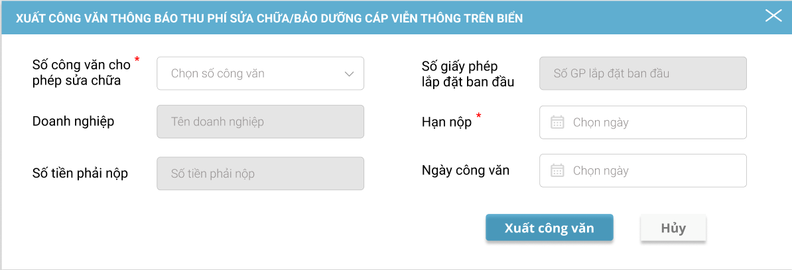

STT

Tên

Kiểu

dữ liệu

Bắt buộc

Mô tả

Database

1

Số công văn cho phép sửa chữa

Combobox search

x

- Gồm tất cả các công văn cho phép sửa chữa, bảo dưỡng cáp biển.

- Cho phép nhập và chọn 1 số công văn.

- Autocomplete.

2

Số GP lắp đặt ban đầu

Text

- Autofill theo Số công văn cho phép sữa chữa.

3

Doanh nghiệp

Text

- Autofill theo Số công văn cho phép sữa chữa.

4

Hạn nộp

datepicker

x

Cho phép chọn ngày.

5

Số tiền phải nộp

Currency

Hiển thị số tiền phí sữa chữa, bảo dưỡng. Tham khảo chức năng ‘Quản lý mức thu phí”.

6

Ngày công văn

Date

Cho phép chọn ngày của công văn thông báo thu phí.

7

Xuất công văn

Button

Nhấn để xuất công văn -> hệ thống thông báo “Xuất công văn thành công”.

8

Hủy

Button

Nhấn -> Hủy bỏ thao tác xuất công văn. Đóng popup nhập tin xuất công văn và quay lại màn danh sách đang tìm kiếm.

Theo dõi thu phí sửa chữa, bảo dưỡng cáp viễn thông trên biển

Theo dõi thu phí sửa chữa, bảo dưỡng cáp viễn thông trên biển

Luồng chức năng

Thông tin chung

Tên chức năng

Theo dõi thu phí sửa chữa, bảo dưỡng cáp viễn thông trên biển

Mô tả

Chức năng cho phép xem thông tin danh sách các DN cần nộp phí bảo dưỡng, sửa chữa tuyến cáp.

Tác nhân

Lãnh đạo, Cán bộ Phòng KHTC, Phòng CPTN, Phòng Kinh tế

Điều kiện trước

Đăng nhập vào hệ thống, có phân quyền chức năng

Điều kiện sau

Xem, tìm kiếm được DN cần nộp phí sửa chữa cáp biển.

Ngoại lệ

N/A

Các yêu cầu đặc biệt

N/A

Luồng chức năng

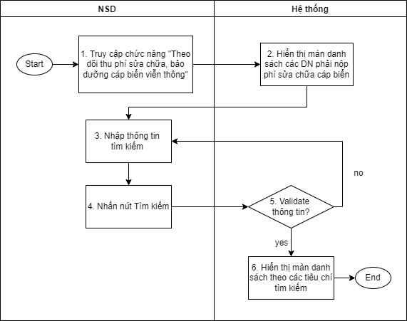

	Mô tả luồng xử lý

Bước

Mô tả

Bước 1

Truy cập chức năng "Theo dõi thu phí sửa chữa, bảo dưỡng cáp biển viễn thông".

Bước 2

Hiển thị màn danh sách các DN phải nộp phí sửa chữa cáp biển.

Bước 3

Nhập thông tin tìm kiếm.

Bước 4

Nhấn nút Tìm kiếm

Bước 5

Validate thông tin:

- Nếu hợp lệ chuyển bước 6.

- Nếu không hợp lệ, hệ thống đưa ra thông báo tại các trường nhập không hợp lệ. Quay lại bước 3.

Bước 6

Hiển thị màn danh sách theo các tiêu chí tìm kiếm

--	b. Giao diện chức năng

--	Giao diện tìm kiếm rút gọn

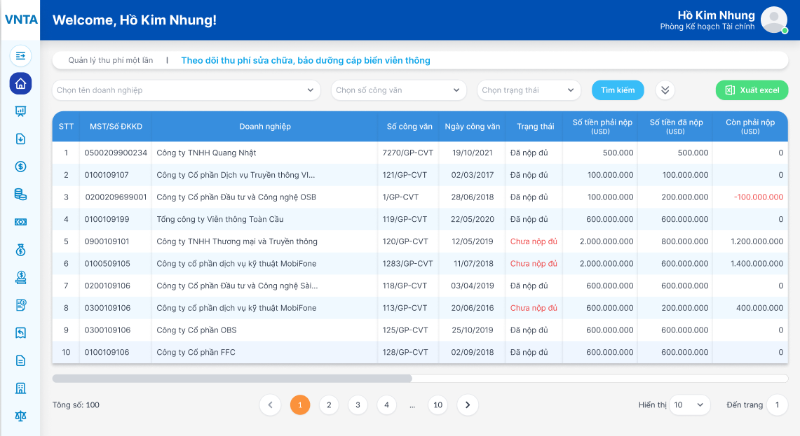

--	Giao diện tìm kiếm nâng cao

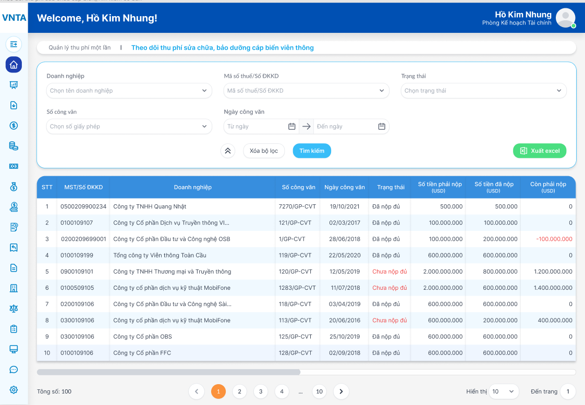

STT

Tên

Kiểu

dữ liệu

Bắt buộc

Mô tả

Database

1

Tìm kiếm rút gọn

Tìm kiếm rút gọn

Tìm kiếm rút gọn

Tìm kiếm rút gọn

Tìm kiếm rút gọn

1.1

Chọn tên doanh nghiệp

Combobox search

- Gồm all DN có công văn cho phép sửa chữa, bảo dưỡng cáp biển đồng bộ từ hệ thống cũ (do P. CPTN nhập vào).

- Cho phép người dùng nhập tên DN.

- Autocomplete gõ nhập tên doanh nghiệp hệ thống tự động gợi ý.

- Sắp xếp các option theo thứ tự Mã định danh tăng dần (quy định ngầm trong hệ thống khi thêm mới DN).

- Cho chọn 1 hoặc nhiều.

- Mặc định không chọn là chọn tất cả.

1.2

Chọn số công văn

Combobox search

- Gồm all công văn cho phép sửa chữa cáp biển đồng bộ từ hệ thống cũ (do P. CPTN nhập vào).

- Cho phép nhập số GP.

- Autocomplete.

- Cho chọn 1 hoặc nhiều.

- Mặc định không chọn là chọn tất cả

1.3

Chọn trạng thái

Combobox

- Gồm 2 lựa chọn: Đã nộp đủ và Chưa nộp đủ.

- Cho chọn nhiều.

- Mặc định không chọn là chọn tất cả.

2

Tìm kiếm nâng cao

Tìm kiếm nâng cao

Tìm kiếm nâng cao

Tìm kiếm nâng cao

Tìm kiếm nâng cao

2.1

Doanh nghiệp

Combobox search

- Gồm all DN có công văn cho phép sửa chữa, bảo dưỡng cáp biển đồng bộ từ hệ thống cũ (do P. CPTN nhập vào).

- Cho phép người dùng nhập tên DN.

- Autocomplete gõ nhập tên doanh nghiệp hệ thống tự động gợi ý.

- Sắp xếp các option theo thứ tự Mã định danh tăng dần (quy định ngầm trong hệ thống khi thêm mới DN).

- Cho chọn 1 hoặc nhiều.

- Mặc định không chọn là chọn tất cả.

2.2

MST/Số ĐKKD

Combobox search

- Gồm all MST/Số ĐKKD của DN được phép sửa chữa cáp biển.

- Cho phép nhập Mã số thuế/ Số ĐKKD.

- Autocomplete.

- Cho chọn 1 hoặc nhiều.

2.3

Trạng thái

Combobox

Cho phép chọn trạng thái “Đã nộp đủ” , “Chưa nộp đủ”.

Không chọn là mặc định chọn tất cả.

2.4

Số công văn

Combobox search

- Gồm all công văn cho phép sửa chữa cáp biển đồng bộ từ hệ thống cũ (do P. CPTN nhập vào).

- Cho phép nhập số GP.

- Autocomplete.

- Cho chọn 1 hoặc nhiều.

2.5

Ngày công văn

datepicker

- Cho phép chọn ngày công văn.

- “Đến ngày” >= “Từ ngày”.

3

Tìm kiếm

button

Nhấn để tìm kiếm theo các trường thông tin.

4

Xuất excel

button

Nhấn để xuất excel bảng bên dưới đang tìm kiếm.

5

GRID

GRID

GRID

GRID

GRID

5.1

STT

Text

Hiển thị số thứ tự.

5.2

MST/Số ĐKKD

Text

Hiển thị MST/Số ĐKKD.

5.3

Doanh nghiệp

Text

Hiển thị tên DN.

5.4

Số công văn

Text

Hiển thị số công văn.

5.5

Ngày công văn

Date

Hiển thị ngày công văn.

5.6

Trạng thái

Text

Hiển thị trạng thái.

5.7

Số tiền phải nộp (USD)

Currency

Hiển thị số tiền phải nộp. Phân chia hàng nghìn bằng dấu “.”.

Tham khảo chức năng “Quản lý mức thu phí”.

5.8

Số tiền đã nộp (USD)

Currency

Hiển thị số tiền đã nộp. (Tính theo biên lai).

5.9

Còn phải nộp (USD)

Currency

Hiển thị số còn phải nộp (= Số tiền phải nộp – Số tiền đã nộp).

6

Phân trang

Phân trang

Phân trang

Phân trang

Phân trang

6.1

Tổng số bản ghi

Text

Hiển thị tổng số bản ghi theo điều kiện tìm kiếm

6.2

Phân trang

button

Gồm các button: Về trang trước đó, 1, 2, 3, 4, 5 (nếu ít trang hơn sẽ tự cắt bớt), về trang sau đó.

6.3

Số bản ghi trên 1 trang

combobox

Gồm:

10/20/50/100

Mặc định 10 bản ghi trên 1 trang.

6.4

Đến trang

Text

- Nhập số trang => hệ thống nhảy đến dữ liệu trang tương ứng.

Quản lý địa chỉ Chi cục thuế

Xem danh sách Chi cục Thuế

Luồng chức năng

Thông tin chung

Tên chức năng

Xem danh sách Chi cục Thuế

Mô tả

Chức năng cho phép xem danh sách Chi cục thuế có trên hệ thống

Tác nhân

Lãnh đạo, Cán bộ Phòng KHTC

Điều kiện trước

Đăng nhập vào hệ thống, có phân quyền chức năng

Điều kiện sau

Xem, tìm kiếm được danh sách địa chỉ Chi cục thuế

Ngoại lệ

N/A

Các yêu cầu đặc biệt

N/A

Luồng xử lý

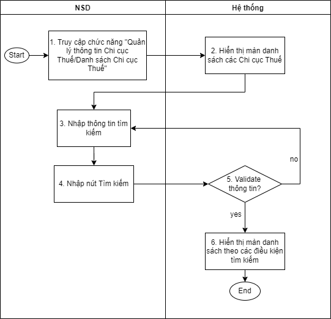

Mô tả luồng xử lý

Bước

Mô tả

Bước 1

Truy cập chức năng "Quản lý thông tin Chi cục Thuế/Danh sách Chi cục Thuế"

Bước 2

Hiển thị màn danh sách các Chi cục thuế

Bước 3

Nhập thông tin tìm kiếm

Bước 4

Nhấn nút Tìm kiếm

Bước 5

Validate thông tin:

- Nếu hợp lệ chuyển bước 6.

- Nếu không hợp lệ, hệ thống đưa ra thông báo tại các trường nhập không hợp lệ. Quay lại bước 3.

Bước 6

Hiển thị màn danh sách theo các tiêu chí tìm kiếm

Giao diện chức năng

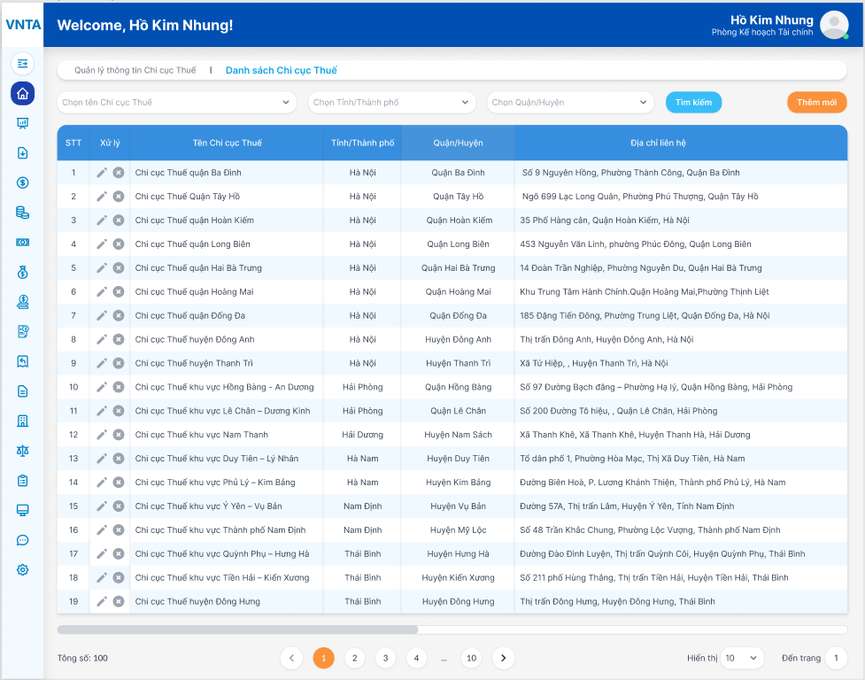

STT

Tên

Kiểu

dữ liệu

Bắt buộc

Mô tả

Database

1

Khung tìm kiếm

Khung tìm kiếm

Khung tìm kiếm

Khung tìm kiếm

Khung tìm kiếm

1.1

Chọn Tên Chi cục thuế

Combobox search

- Gồm tất cả các Chi cục thuế có trong hệ thống

- Autocomplete

- Có thể chọn 1 hoặc nhiều, ko chọn là chọn all

1.2

Chọn Tỉnh thành phố

Combobox search

--	- Gồm 63 tỉnh thành

--	- Autocomplete

--	- Có thể chọn 1 hoặc nhiều, không chọn là chọn all

1.3

Chọn quận/huyện

Combobox search

--	- Load theo Tỉnh thành

--	- Autocomplete

- Có thể chọn 1 hoặc nhiều, ko chọn là chọn all

1.4

Tìm kiếm

Button

--	Nhấn hệ thống tiến hành tìm kiếm, nếu không có dữ liệu hiển thị “Không có dữ liệu”

1.5

Thêm mới

Button

--	Nhấn => hiển thị popup Thêm mới Chi cục Thuế

2

Grid

Grid

Grid

Grid

Grid

2.1

STT

--	Tự sinh hiển thị tăng dần

2.2

Xử lý

- Gồm các thao tác: Sửa/Xóa.

- Nhấn vào icon “Sửa” -> hiển thị màn chỉnh sửa thông tin Chi cục thuế.

- Nhấn vào icon “Xóa” -> Xóa thông tin Chi cục Thuế

2.3

Tên Chi cục thuế

Text

--	Hiển thị tên Chi cục thuế

2.4

Tỉnh/thành

Text

--	Hiển thị tên Tỉnh thành của Chi cục thuế

`

2.5

Quận/huyện

Text

--	Hiển thị tên Quận/huyện của Chi cục thuế

2.6

Địa chỉ liên hệ

Text

--	Hiển thị địa chỉ liên hệ của Chi cục thuế

--	Giao diện xác nhận Xóa thông tin chi cục thuế

STT

Tên

Kiểu

dữ liệu

Bắt buộc

Mô tả

Database

1

Bạn có chắc chắn muốn xóa Chi cục Thuế này?

Text

2

Xóa

Button

--	Nhấn để xóa thông tin chi cục thuế. Hiện thông báo “Xóa thông tin thành công.”

--	Đóng popup quay trở về màn danh sách.

3

Quay về

Button

Nhấn để hủy bỏ thao tác xóa. Đóng popup và quay lại màn đang chỉnh sửa thông tin.

Thêm mới Chi cục Thuế

Luồng chức năng

Thông tin chung

Tên chức năng

Thêm mới Chi cục Thuế

Mô tả

Chức năng cho phép người dùng thêm mới thông tin Chi cục Thuế.

Tác nhân

Lãnh đạo, Cán bộ Phòng KHTC

Điều kiện trước

Đăng nhập vào hệ thống, có phân quyền chức năng

Điều kiện sau

Thêm mới thông tin Chi cục thuế thành công

Ngoại lệ

N/A

Các yêu cầu đặc biệt

N/A

Luồng xử lý

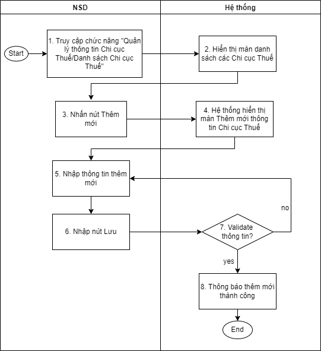

Mô tả luồng xử lý

Bước

Mô tả

Bước 1

Truy cập chức năng "Quản lý thông tin Chi cục Thuế/Danh sách Chi cục Thuế"

Bước 2

Hiển thị màn danh sách các địa chỉ Chi cục Thuế

Bước 3

Nhấn nút Thêm mới

Bước 4

Hệ thống hiển thị màn Thêm mới thông tin Chi cục Thuế

Bước 5

Nhập thông tin tìm kiếm

Bước 6

Nhấn nút Lưu.

Bước 7

Validate thông tin? Nếu lỗi thì thông báo lỗi tại các trường sai và quay trở lại bước 5. Nếu không chuyển qua bước 8.

Bước 8

Thông báo thêm mới thành công

Giao diện chức năng

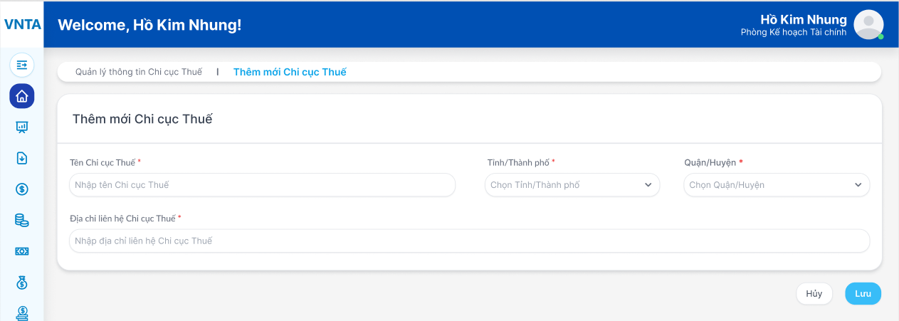

STT

Tên

Kiểu

dữ liệu

Bắt buộc

Mô tả

Database

1

Tên Chi cục Thuế

Textbox

x

Cho phép nhập tên Chi cục thuế.

Tối đa 100 kí tự

2

Tỉnh/Thành phố

Combobox search

x

--	- Hiển thị các tỉnh thành đã tạo trên hệ thống phase 1.

--	- Autocomplete

--	- Cho phép chọn 1 tỉnh/thành

3

Quận/Huyện

Combobox search

x

--	- Load theo Tỉnh/ thành phố

--	- Autocomplete

- Cho phép chọn 1 quận/huyện

4

Địa chỉ liên hệ Chi cục Thuế

Textbox

x

--	Cho phép nhập địa chỉ liên hệ của Chi cục

--	Tối đa 200 kí tự

5

Lưu

Button

--	Nhấn để thực hiện lưu thông tin thêm mới.

--	Check trùng thông tin Tỉnh/Thành phố và Quận/Huyện. Nếu trùng báo: “Thông tin Chi cục Thuế tại khu vực này đã tồn tại. Vui lòng chọn lại Tỉnh/Thành phố và Quận/Huyện.”

--	Nếu không trùng báo “Thêm mới thông tin thành công”.

6

Hủy

Button

--	Nhấn => Hiển thị popup xác nhận Hủy

--	Giao diện popup Xác nhận Hủy

Tham khảo các mô tả tương tự trước.

Chỉnh sửa thông tin Chi cục Thuế

Luồng chức năng

Thông tin chung

Tên chức năng

Chỉnh sửa thông tin Chi cục Thuế

Mô tả

Chức năng cho phép người dùng chỉnh sửa tên và địa chỉ liên hệ của Chi cục Thuế.

Tác nhân

Lãnh đạo, Cán bộ Phòng KHTC

Điều kiện trước

Đăng nhập vào hệ thống, có phân quyền chức năng

Điều kiện sau

Chỉnh sửa thông tin Chi cục thuế thành công

Ngoại lệ

N/A

Các yêu cầu đặc biệt

N/A

Luồng xử lý

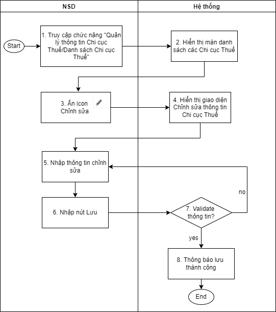

Mô tả luồng xử lý

Bước

Mô tả

Bước 1

Truy cập chức năng "Quản lý thông tin Chi cục Thuế/Danh sách Chi cục Thuế"

Bước 2

Hiển thị màn danh sách các địa chỉ Chi cục Thuế

Bước 3

Nhấn icon “Chỉnh sửa” tương ứng từng Chi cục Thuế

Bước 4

Hệ thống hiển thị màn Chỉnh sửa thông tin Chi cục Thuế

Bước 5

Nhập thông tin chỉnh sửa

Bước 6

Nhấn nút Lưu.

Bước 7

Validate thông tin? Nếu lỗi thì thông báo lỗi tại các trường sai và quay trở lại bước 5. Nếu không chuyển qua bước 8.

Bước 8

Thông báo Lưu thông tin thành công.

Giao diện chức năng

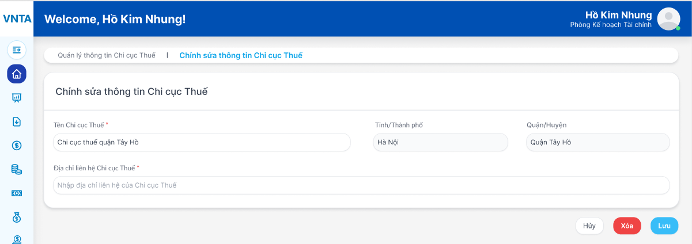

STT

Tên

Kiểu

dữ liệu

Bắt buộc

Mô tả

Database

1

Tên Chi cục Thuế

Textbox

x

Cho phép chỉnh sửa tên Chi cục thuế.

Tối đa 100 kí tự

2

Tỉnh/Thành phố

Text

--	- Hiển thị tên tỉnh thành

3

Quận/Huyện

Text

- Hiển thị tên quận huyện

4

Địa chỉ liên hệ Chi cục Thuế

Textbox

x

--	Cho phép chỉnh sửa địa chỉ liên hệ của Chi cục

--	Tối đa 200 kí tự

5

Lưu

Button

--	Nhấn để thực hiện lưu thông tin thêm mới. Hiển thị popup Xác nhận Lưu. Nếu đồng ý thì thông báo “Lưu thông tin thành công” và đóng popup.

6

Xóa

Button

--	Nhấn nút Xóa => hiển thị popup xác nhận Xóa. Nếu NSD chọn xóa thì hệ thống xử lý xóa thông tin Chi cục thuế đó.

7

Hủy

Button

--	Nhấn nút Hủy => Hiển thị popup xác nhận Hủy.

--	Giao diện Xác nhận Lưu thông tin chỉnh sửa

STT

Tên

Kiểu

dữ liệu

Bắt buộc

Mô tả

Database

1

Các thay đổi sẽ được lưu lại

Bạn có chắc chắn muốn lưu không?

Text

2

Lưu

Button

--	Nhấn để lưu thông tin đã chỉnh sửa. Hiện thông báo “Lưu thông tin thành công.”

--	Đóng popup quay trở về màn danh sách.

3

Quay về

Button

Nhấn để hủy bỏ thao tác lưu. Đóng popup và quay lại màn đang chỉnh sửa thông tin.

--	Giao diện xác nhận Xóa thông tin chi cục thuế

STT

Tên

Kiểu

dữ liệu

Bắt buộc

Mô tả

Database

1

Bạn có chắc chắn muốn xóa Chi cục Thuế này?

Text

2

Xóa

Button

--	Nhấn để xóa thông tin chi cục thuế. Hiện thông báo “Xóa thông tin thành công.”

--	Đóng popup quay trở về màn danh sách.

3

Quay về

Button

Nhấn để hủy bỏ thao tác xóa. Đóng popup và quay lại màn đang chỉnh sửa thông tin.

Quản lý tin nhắn SMS

Xem danh sách mẫu tin nhắn

							a)	Luồng chức năng

Thông tin chung

Tên chức năng

Xem danh sách mẫu tin nhắn SMS

Mô tả

Chức năng cho phép xem thông tin danh sách mẫu tin nhắn tương ứng với từng loại phí/lệ phí/BCDT và ứng theo từng loại công văn.

Tác nhân

Lãnh đạo, Cán bộ Phòng KHTC, Phòng CPTN, Phòng Kinh tế

Điều kiện trước

Đăng nhập vào hệ thống, có phân quyền chức năng

Điều kiện sau

Xem, tra cứu được danh sách các mẫu tin nhắn tương ứng theo loại phí/lệ phí hoặc loại công văn.

Ngoại lệ

N/A

Các yêu cầu đặc biệt

N/A

Luồng chức năng

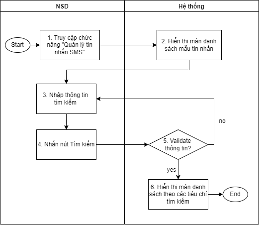

--	Mô tả luồng xử lý

Bước

Mô tả

Bước 1

NSD truy cập chức năng "Quản lý tin nhắn SMS"

Bước 2

Hệ thống hiển thị giao diện danh sách tất cả nội dung mẫu tin nhắn tương ứng với từng loại phí/lệ phí/BCDT và loại công văn.

Sắp xếp thứ tự các tin nhắn theo thời gian cập nhật.

Các mẫu tin nhắn gồm:

- Phí sử dụng mã, số viễn thông: Thông báo nộp phí/Đôn đốc nộp phí/Đối chiếu công nợ;

- Chọn đồng thời Phí CCDV viễn thông, Phí TLM viễn thông công cộng: Thông báo nộp phí năm đầu/Đôn đốc nộp phí/Đối chiếu công nợ;

- Phí CCDV viễn thông: Thông báo nộp phí;

- Phí TLM viễn thông công cộng: Thông báo nộp phí;

- Phí TLM viễn thông dùng riêng: Thông báo nộp phí;;

- Phí thử nghiệm mạng và dịch vụ viễn thông: Thông báo nộp phí;

- Phí lắp đặt cáp viễn thông trên biển: Thông báo nộp phí;

- Phí sửa chữa, bảo dưỡng cáp viễn thông trên biển: Thông báo nộp phí;

- Lệ phí cấp phép: Thông báo nộp lệ phí;

- Lệ phí phân bổ mã, số viễn thông: Thông báo nộp lệ phí;

- Lệ phí lắp đặt cáp viễn thông trên biển: Thông báo nộp lệ phí.

- Báo cáo doanh thu: Thông báo nộp BCDT/Đôn đốc nộp BCDT

Bước 3

NSD nhập các trường thông tin muốn tìm kiếm.

Bước 4

Nhấn [Tìm kiếm].

Bước 5

Hệ thống validate thông tin. Nếu không có kết quả thì đưa thông báo “Mẫu tin nhắn không tồn tại.”.

Nếu có kết quả thì chuyển bước 6.

Bước 6

Hệ thống hiển thị danh sách nội dung gửi tin nhắn theo điều kiện tìm kiếm.

Các mẫu tin nhắn thông báo thu lệ phí/phí thu 1 lần/phí cáp biển/phí thu năm đầu sẽ được đồng bộ từ đây sang hệ thống cũ, phục vụ cho việc gửi tin nhắn ở hệ thống cũ.

Kết thúc luồng.

							b)	Giao diện chức năng

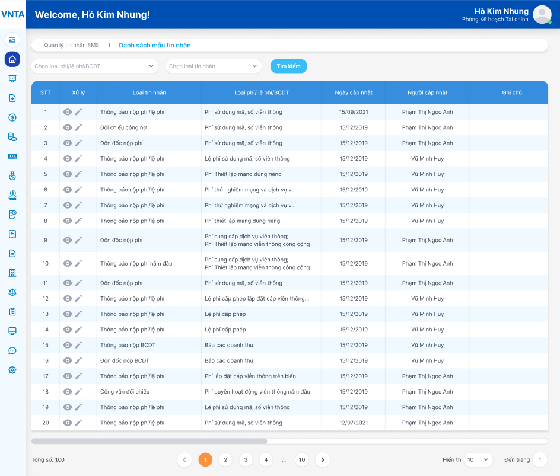

STT

Thông tin

Kiểu dữ liệu

Bắt buộc

Mô tả

Database

1

Tìm kiếm cơ bản

Tìm kiếm cơ bản

Tìm kiếm cơ bản

Tìm kiếm cơ bản

Tìm kiếm cơ bản

1.1

Chọn loại phí/lệ phí/BCDT

Combobox search

- Chứa all các loại phí/lệ phí/BCDT có trong hệ thống, gồm:

+ Phí cung cấp dịch vụ viễn thông

+ Phí thiết lập mạng viễn thông công cộng

+ Phí sử dụng mã, số viễn thông

+ Phí thử nghiệm mạng và dịch vụ viễn thông

+ Phí thiết lập mạng viễn thông dùng riêng

+ Lệ phí cấp phép

+ Lệ phí phân bổ mã, số viễn thông

+ Lệ phí lắp đặt cáp viễn thông trên biển

+ Báo cáo doanh thu

+ Phí lắp đặt cáp viễn thông trên biển

+ Phí sửa chữa, bảo dưỡng cáp viễn thông trên biển

- Mặc định ko chọn là Chọn tất cả.

- Cho phép nhập chọn loại phí/lệ phí/BCDT.

- Autocomplete.

- Cho phép chọn 1 hoặc nhiều loại phí/lệ phí/BCDT.

1.2

Chọn loại tin nhắn

Combobox search

- Autocomplete gõ nhập tên loại tin nhắn hệ thống tự động gợi ý.

- Cho phép chọn 1 trong các loại tin nhắn.

Hiển thị các lựa chọn loại tin nhắn tương ứng với Loại phí/lệ phí/BCDT:

--	Báo cáo doanh thu

+ Thông báo nộp BCDT

+ Đôn đốc nộp BCDT

--	Lệ phí cấp phép/Lệ phí phân bổ mã, số viễn thông/Lệ phí lắp đặt cáp viễn thông trên biển

+ Thông báo nộp lệ phí

--	Phí CCDV viễn thông/Phí TLM viễn thông công cộng

+ Thông báo nộp phí năm đầu

+ Thông báo nộp phí

--	Chọn đồng thời Phí CCDV viễn thông và Phí TLM viễn thông công cộng

+ Đôn đốc nộp phí

+ Đối chiếu công nợ

--	Phí sử dụng mã, số viễn thông

+ Thông báo nộp phí

+ Đôn đốc nộp phí

+ Đối chiếu công nợ

--	Phí lắp đặt cáp viễn thông trên biển/Phí sửa chữa, bảo dưỡng cáp viễn thông trên biển/Phí thử nghiệm mạng và  dịch vụ viễn thông/Phí TLM dùng riêng.

+ Thông báo nộp phí

1.3

Tìm kiếm

Button

Tìm kiếm theo các trường thông tin Loại phí/lệ phí; Loại tin nhắn. Hệ thống hiển thị bảng danh sách bên dưới.

2

Grid danh sách

Grid danh sách

Grid danh sách

Grid danh sách

Grid danh sách

2.1

STT

Text

- Tự sinh tăng dần

2.2

Xử lý

Bao gồm chức năng Xem chi tiết nội dung gửi tin nhắn đến DN; Chỉnh sửa cập nhật nội dung gửi tin nhắn đến DN.

2.2.1

Button

Nhấn button hệ thống chuyển đến màn Xem chi tiết nội dung gửi tin nhắn đến DN.

2.2.2

Button

Nhấn button hệ thống chuyển đến màn Chỉnh sửa cập nhật nội dung gửi tin nhắn đến DN.

2.3

Loại tin nhắn

Text

Hiển thị loại tin nhắn tương ứng được tìm kiếm.

2.4

Loại phí/Lệ phí

Text

Hiển thị loại phí/lệ phí tương ứng được tìm kiếm.

2.5

Ngày cập nhật

date

Hiển thị thông tin ngày cập nhật gần nhất.

Định dạng DD/MM/YYYY.

2.6

Người cập nhật

Text

Hiển thị thông tin họ tên của người cập nhật gần nhất.

2.7

Ghi chú

Text

Hiển thị nội dung thông tin ghi chú của loại tin nhắn.

3

Phân trang

Phân trang

Phân trang

Phân trang

Phân trang

4.1

Tổng số bản ghi

Text

Hiển thị tổng số bản ghi theo điều kiện tìm kiếm

4.2

Phân trang

Button

Gồm các button: Về trang trước đó, 1, 2, 3, 4, 5 (nếu ít trang hơn sẽ tự cắt bớt), trang sau đó

4.3

Số bản ghi trên 1 trang

Combobox

Gồm:

10/trang

20/trang

50/trang

100/trang

Mặc định 10 bản ghi trên 1 trang

4.4

Đến trang

Text

- Nhập số trang => hệ thống nhảy đến dữ liệu trang tương ứng

  Xem chi tiết mẫu tin nhắn

							c)	Luồng chức năng

Thông tin chung

Tên chức năng

Xem chi tiết nội dung gửi tin nhắn.

Mô tả

Chức năng cho phép xem chi tiết nội dung gửi tin nhắn.

Tác nhân

Lãnh đạo, Cán bộ Phòng KHTC, Phòng CPTN, Phòng Kinh tế

Điều kiện trước

Đăng nhập vào hệ thống, có phân quyền chức năng.

Điều kiện sau

Xem chi tiết các thông tin cụ thể liên quan đến từng loại tin nhắn và nội dung gửi tin nhắn đến DN.

Ngoại lệ

N/A

Các yêu cầu đặc biệt

N/A

Luồng quy trình

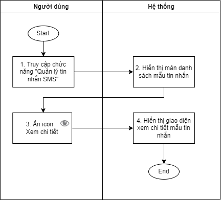

Mô tả luồng xử lý

--

Bước

Mô tả

Bước 1

NSD truy cập chức năng "Quản lý tin nhắn SMS”

Bước 2

Hệ thống hiển thị bảng danh sách các loại tin nhắn tương ứng với các loại phí/lệ phí/BCDT và loại công văn.

Bước 3

NSD nhấn vào icon xem chi tiết của loại tin nhắn muốn xem.

Bước 4

Hệ thống hiển thị màn xem chi tiết nội dung gửi tin nhắn.

Kết thúc luồng.

							d)	Giao diện chức năng

--	Giao diện xem chi tiết tương ứng với các Loại công văn và Loại phí/Lệ phí/BCDT

--	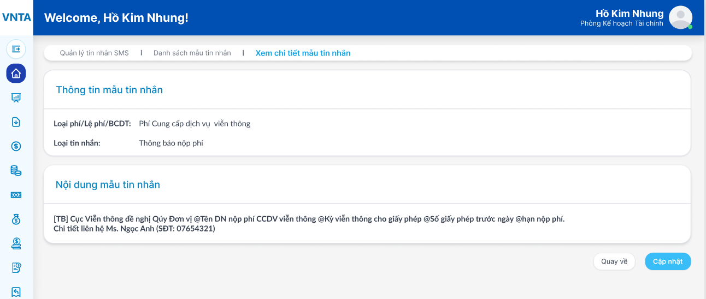

STT

Thông tin

Kiểu dữ liệu

Bắt buộc

Mô tả

Database

1

Thông tin mẫu tin nhắn

Thông tin mẫu tin nhắn

Thông tin mẫu tin nhắn

Thông tin mẫu tin nhắn

Thông tin mẫu tin nhắn

1.1

Loại phí/Lệ phí/BCDT

Text

Hiển thị loại phí/lệ phí/BCDT tương ứng với loại tin nhắn.

1.2

Loại tin nhắn

Text

Hiển thị loại tin nhắn tương ứng với các loại công văn.

2

Nội dung mẫu tin nhắn

Text

Hiển thị preview nội dung format của tin nhắn.

3

Cập nhật

button

Nhấn button Cập nhật -> hiển thị màn chỉnh sửa nội dung gửi tin nhắn.

4

Quay về

button

Nhấn để trở về màn xem danh sách mẫu tin nhắn đang tìm kiếm.

  Cập nhật mẫu tin nhắn SMS

Luồng chức năng

--	Thông tin chung

Tên chức năng

Cập nhật nội dung thông tin gửi tin nhắn

Mô tả

Chức năng cho phép cập nhật chỉnh sửa nội dung gửi tin nhắn đến DN.

Tác nhân

Lãnh đạo, Cán bộ Phòng KHTC, Phòng CPTN, Phòng Kinh tế

Điều kiện trước

Đăng nhập vào hệ thống, có phân quyền chức năng.

Điều kiện sau

Chỉnh sửa thành công các thông tin, nội dung cho phép của tin nhắn.

Ngoại lệ

N/A

Các yêu cầu đặc biệt

N/A

Luồng chức năng

--

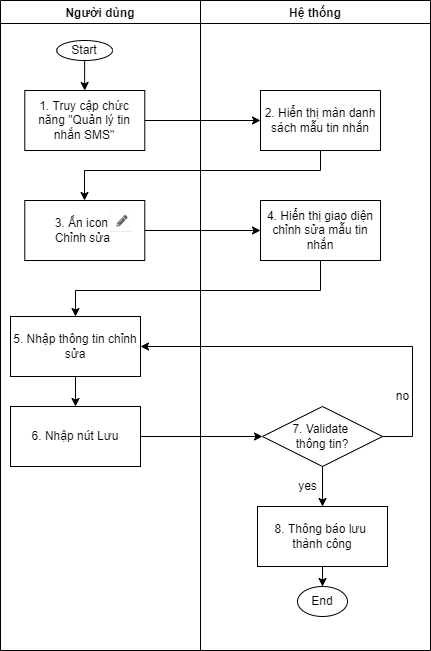

Mô tả luồng xử lý

Bước

Mô tả

Bước 1

NSD truy cập chức năng “Quản lý gửi tin nhắn SMS đến doanh nghiệp/ Danh sách mẫu tin nhắn SMS gửi doanh nghiệp”.

Bước 2

Hệ thống hiển thị giao diện danh sách tất cả nội dung mẫu tin nhắn tương ứng với từng loại phí/lệ phí/BCDT và loại công văn.

Luôn sắp xếp tất cả các tin nhắn mặc định (không thể xóa) lên đầu tiên; Sau đó sắp xếp thứ tự theo ngày cập nhật.

Bước 3

NSD nhấn icon Chỉnh sửa của tin nhắn cần chỉnh sửa.

Bước 4

Hệ thống hiển thị chi tiết nội dung tin nhắn cần chỉnh sửa.

Bước 5

NSD nhập thông tin cần chỉnh sửa.

Bước 6

NSD nhấn button Lưu.

Bước 7

Hệ thống kiểm tra tính hợp lệ thông tin nhập:

- Nếu hợp lệ, chuyển bước 8

- Nếu không hợp lệ, hệ thống đưa ra thông báo tại các trường nhập không hợp lệ. Quay lại bước 5.

Bước 8

Hệ thống thực hiện lưu thông tin tin nhắn được chỉnh sửa. Hiển thị thông báo Lưu thành công.

Các cập nhật chỉnh sửa mẫu tin nhắn thông báo thu lệ phí/phí thu 1 lần/phí cáp biển/phí thu năm đầu sẽ được đồng bộ từ đây sang hệ thống cũ, phục vụ cho việc gửi tin nhắn ở hệ thống cũ.

Kết thúc luồng.

Giao diện chức năng

--	Giao diện chỉnh sửa tin nhắn

--	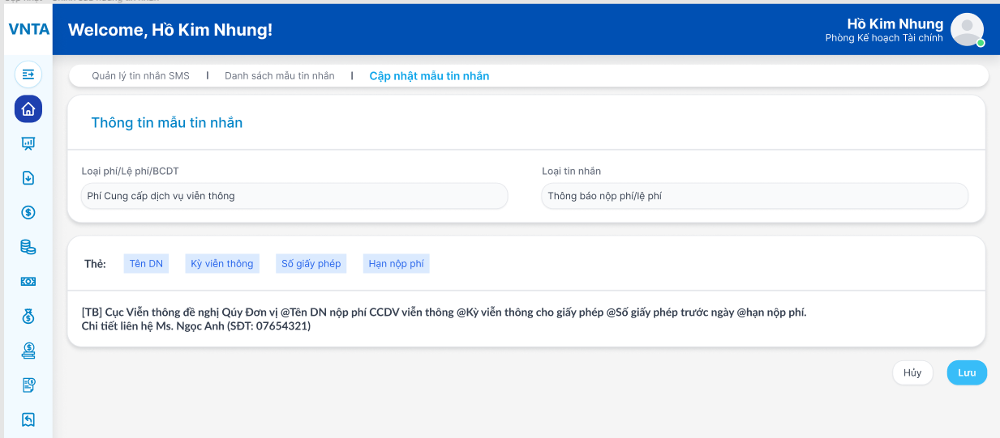

--	Giao diện cảnh báo gán thiếu thẻ tag

--	

STT

Thông tin

Kiểu dữ liệu

Bắt buộc

Mô tả

Database

1

Thông tin mẫu tin nhắn

Thông tin mẫu tin nhắn

Thông tin mẫu tin nhắn

Thông tin mẫu tin nhắn

Thông tin mẫu tin nhắn

1.1

 Loại phí/lệ phí/BCDT

Text

Hiển thị loại phí/lệ phí/BCDT

1.2

Loại tin nhắn

Text

Hiển thị loại tin nhắn

1.3

Thẻ – Nội dung tin nhắn

Mỗi loại mẫu tin nhắn sẽ cố định một số thẻ tương ứng.

1.4

CK editor

x

Cho phép người dùng nhập chỉnh sửa nội dung tin nhắn theo form và tag được gắn thẻ.

Max-leght: 200 ký tự

1.5

Hủy

Button

Nhấn button [Hủy] => Hệ thống hiển thị pop-up xác nhận hủy. Đồng ý Hủy -> quay trở về màn danh sách.

1.6

Lưu

Button

Nhấn button [Lưu] => Hệ thống kiểm tra tính hợp lệ thông tin người dùng nhập: Nếu hợp lệ, hệ thống thông báo “Cập nhật mẫu tin nhắn thành công” và load lại danh sách mẫu tin nhắn.

- Nếu không hợp lệ, hệ thống đưa ra thông báo tại các trường nhập không hợp lệ. Người dùng quay lại bước nhập nội dung gửi tin nhắn.

--	Giao diện pop-up Xác nhận Hủy

--	

STT

Tên

Kiểu

dữ liệu

Bắt buộc

Mô tả

Database

1

Xác nhận Hủy

Pop-up

Sau khi NSD nhấn [Hủy] từ giao diện Thêm mới mẫu tin nhắn hiển thị pop-up xác nhận hủy: Các thay đổi sẽ không được lưu lại/Bạn có chắc chắn muốn hủy không?

2

Quay về

Button

Nhấn [Quay về] => đóng popup.

3

Hủy

Button

Nhấn [Hủy] => hệ thống thực hiện hủy thao tác cập nhật mẫu tin nhắn. Đồng thời đóng popup và quay trở lại màn danh sách mẫu tin nhắn.

--	Danh sách Thẻ

STT

Loại phí/Lệ phí/BCDT

Loại tin nhắn

Tên thẻ gắn tag tương ứng

1

Phí CCDV viễn thông hoặc Phí TLM viễn thông công cộng

Thông báo nộp phí năm đầu

@Tên DN; @Năm thu phí; @Số giấy phép; @Ngày cấp phép; @Hạn nộp phí.

2

Phí CCDV viễn thông hoặc Phí TLM viễn thông công cộng

Thông báo nộp phí

@Tên DN; @Kỳ viễn thông; @Hạn nộp phí.

3

Phí CCDV viễn thông và Phí TLM viễn thông công cộng

Đôn đốc nộp phí

@Tên DN; @Tính đến ngày; @Hạn nộp phí;

4

Phí CCDV viễn thông và Phí TLM viễn thông công cộng

Đối chiếu công nợ

@Tên DN; @Giai đoạn; @Tính đến ngày;

5

Phí sử dụng mã, số viễn thông

Thông báo nộp phí

@Tên DN; @Kỳ viễn thông; @Hạn nộp phí

6

Phí sử dụng mã, số viễn thông

Đôn đốc nộp phí

@Tên DN; @Tính đến ngày; @Hạn nộp phí;

7

Phí sử dụng mã, số viễn thông

Đối chiếu công nợ

@Tên DN; @Tính đến ngày; @Giai đoạn

8

Phí thử nghiệm mạng và dịch vụ viễn thông

Thông báo nộp phí

@Tên DN; @Số giấy phép; @Ngày cấp phép; @Hạn nộp phí.

9

Phí TLM viễn thông dùng riêng

Thông báo nộp phí

@Tên DN; @Số giấy phép; @Ngày cấp phép; @Hạn nộp phí.

10

Phí lắp đặt cáp viễn thông trên biển

Thông báo nộp phí

@Tên DN; @Số giấy phép; @Ngày cấp phép; @Hạn nộp phí

11

Phí sửa chữa, bảo dưỡng cáp viễn thông biển

Thông báo nộp phí

@Tên DN; @Số CV cho phép sửa chửa, bảo dưỡng; @Ngày CV cho phép sửa chữa, bảo dưỡng; @Hạn nộp phí

12

Lệ phí cấp phép

Thông báo nộp lệ phí

@Tên DN; @Số giấy phép; @Ngày cấp phép; @Hạn nộp phí.

13

Lệ phí lắp đặt cáp viễn thông trên biển

Thông báo nộp lệ phí

@Tên DN; @Số giấy phép; @Ngày cấp phép; @Hạn nộp phí.

14

Lệ phí sử dụng mã, số viễn thông

Thông báo nộp lệ phí

@Tên DN; @Số quyết định; @Ngày quyết định; @Hạn nộp phí.

15

Báo cáo doanh thu

Thông báo nộp BCDT

@Tên DN; @Kỳ viễn thông; @Hạn nộp BCDT

16

Báo cáo doanh thu

Đôn đốc nộp BCDT

@Tên DN; @Kỳ viễn thông; @Hạn nộp BCDT

Xem lịch sử gửi tin nhắn SMS đến Doanh nghiệp

Luồng chức năng

Thông tin chung

Tên chức năng

Xem lịch sử gửi tin nhắn SMS đến Doanh nghiệp

Mô tả

Chức năng cho phép xem lại danh sách lịch sử gửi tin nhắn từ các phòng ban của Cục Viễn thông tới các DN để thông báo nộp phí/lệ phí/BCDT.

Tác nhân

Lãnh đạo, Cán bộ Phòng KHTC, Phòng CPTN, Phòng Kinh tế

Điều kiện trước

Đăng nhập vào hệ thống, có phân quyền chức năng

Điều kiện sau

Xem, tìm kiếm được danh sách lịch sử gửi các loại tin nhắn

Ngoại lệ

N/A

Các yêu cầu đặc biệt

N/A

Luồng chức năng

--	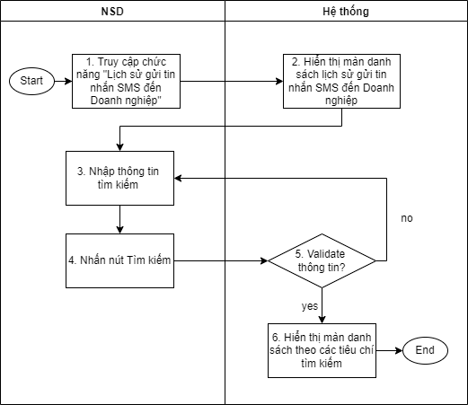

	Mô tả luồng xử lý

Bước

Mô tả

Bước 1

Truy cập chức năng "Lịch sử gửi tin nhắn SMS đến Doanh nghiệp"

Bước 2

Hiển thị màn danh sách lịch sử gửi tin nhắn SMS đến Doanh nghiệp

Bước 3

Nhập thông tin tìm kiếm

Bước 4

Nhấn nút Tìm kiếm

Bước 5

Validate thông tin:

- Nếu hợp lệ chuyển bước 6.

- Nếu không hợp lệ, hệ thống đưa ra thông báo tại các trường nhập không hợp lệ. Quay lại bước 3.

Bước 6

Hiển thị màn danh sách theo các tiêu chí tìm kiếm

Giao diện chức năng

--	Giao diện tìm kiếm cơ bản

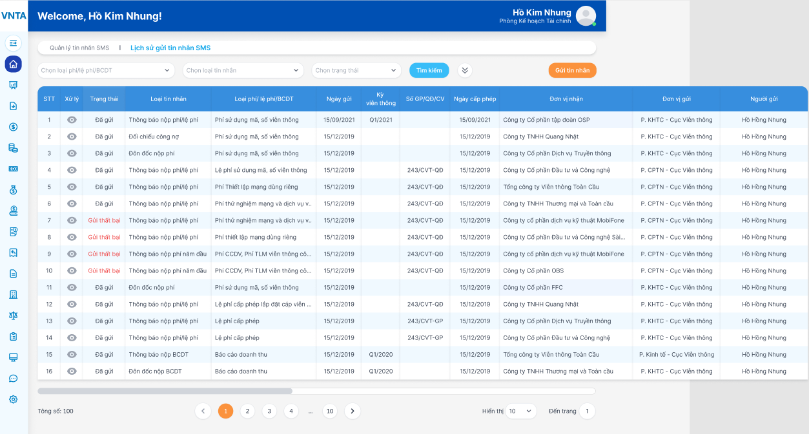

--	Giao diện tìm kiếm nâng cao

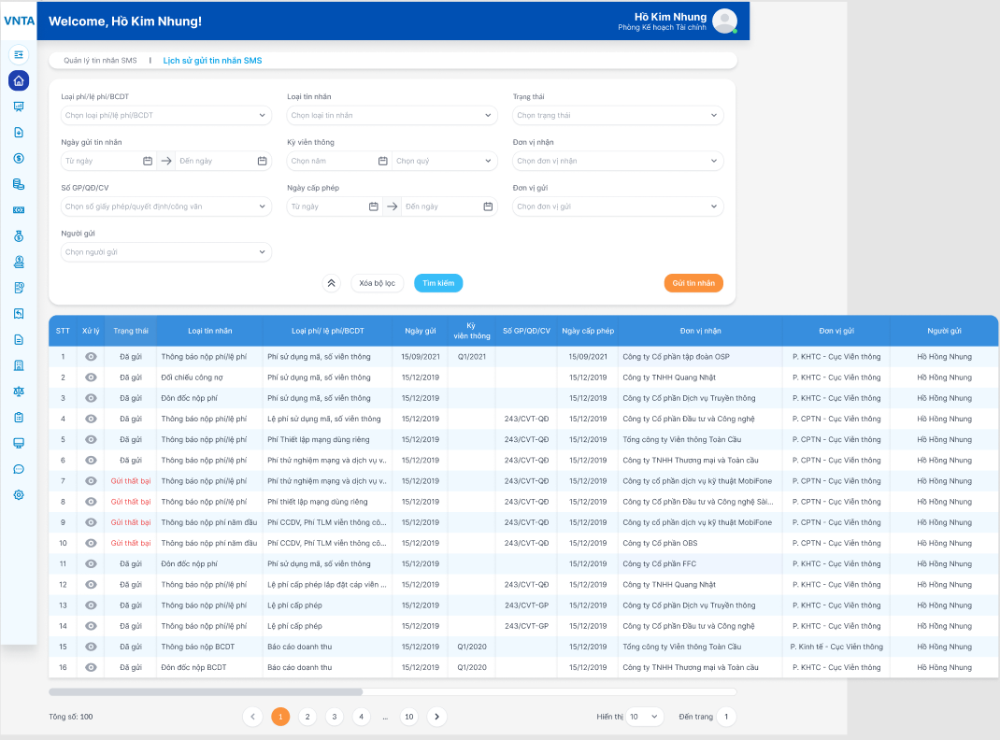

STT

Tên

Kiểu

dữ liệu

Bắt buộc

Mô tả

Database

1

Khung tìm kiếm

Khung tìm kiếm

Khung tìm kiếm

Khung tìm kiếm

Khung tìm kiếm

1.1

 Chọn loại tin nhắn

combobox search

- Chứa all các loại tin nhắn có trong hệ thống.

- Cho phép chọn 1/nhiều loại tin nhắn. Mặc định ko chọn là Chọn tất cả.

- Autocomplete gõ nhập tên loại tin nhắn hệ thống tự động gợi ý.

- Danh sách được sắp xếp:

Mặc định các loại tin nhắn được sắp xếp theo thứ tự:

+ Thông báo nộp BCDT

+ Đôn đốc nộp BCDT

+ Thông báo nộp lệ phí

+ Thông báo nộp phí năm đầu

+ Thông báo nộp phí

+ Đôn đốc nộp phí

+ Đối chiếu công nợ

1.2

 Chọn loại phí/lệ phí/BCDT

combobox search

- Chứa all các loại phí/lệ phí/BCDT có trong hệ thống:

+ Phí CCDV viễn thông

+ Phí TLM viễn thông công cộng

+ Phí sử dụng mã, số viễn thông

+ Phí thử nghiệm mạng và dịch vụ viễn thông

+ Phí TLM viễn thông dùng riêng

+ Phí lắp đặt cáp viễn thông trên biển

+ Phí sửa chữa, bảo dưỡng cáp viễn

+ Lệ phí cấp phép

+ Lệ phí phân bổ mã, số viễn thông

+ Lệ phí lắp đặt cáp viễn thông trên biển

+ Báo cáo doanh thu

- Cho phép nhập, chọn 1 hoặc nhiều loại phí/lệ phí/BCDT. Hệ thống autocomplete.

- Mặc định ko chọn là Chọn tất cả.

1.3

Chọn trạng thái

combobox

Cho phép chọn nhiều trạng thái:

- Đã gửi

- Gửi thất bại

Không chọn mặc định chọn tất cả.

1.4

Tìm kiếm

Button

Nhấn để tìm kiếm theo các tiêu chí tìm kiếm

1.5

Gửi tin nhắn

Button

Nhấn để gửi tin nhắn đột xuất.

2

Khung tìm kiếm nâng cao

Khung tìm kiếm nâng cao

Khung tìm kiếm nâng cao

Khung tìm kiếm nâng cao

Khung tìm kiếm nâng cao

2.1

 Loại tin nhắn

combobox search

- Chứa all các loại tin nhắn có trong hệ thống.

- Cho phép chọn 1/nhiều loại tin nhắn. Mặc định ko chọn là Chọn tất cả.

- Autocomplete gõ nhập tên loại tin nhắn hệ thống tự động gợi ý.

- Danh sách được sắp xếp:

Mặc định các loại tin nhắn được sắp xếp theo thứ tự:

+ Thông báo nộp BCDT

+ Đôn đốc nộp BCDT

+ Thông báo nộp lệ phí

+ Thông báo nộp phí năm đầu

+ Thông báo nộp phí

+ Đôn đốc nộp phí

+ Đối chiếu công nợ

2.2

 Chọn loại phí/lệ phí/BCDT

combobox search

- Chứa all các loại phí/lệ phí/BCDT có trong hệ thống:

+ Phí CCDV viễn thông

+ Phí TLM viễn thông công cộng

+ Phí sử dụng mã, số viễn thông

+ Phí thử nghiệm mạng và dịch vụ viễn thông

+ Phí TLM viễn thông dùng riêng

+ Phí lắp đặt cáp viễn thông trên biển

+ Phí sửa chữa, bảo dưỡng cáp viễn

+ Lệ phí cấp phép

+ Lệ phí phân bổ mã, số viễn thông

+ Lệ phí lắp đặt cáp viễn thông trên biển

+ Báo cáo doanh thu

- Cho phép nhập, chọn 1 hoặc nhiều loại phí/lệ phí/BCDT. Hệ thống autocpmplete.

- Mặc định ko chọn là Chọn tất cả.

2.3

Trạng thái

combobox

Cho phép chọn nhiều trạng thái:

- Đã gửi

- Gửi thất bại

Không chọn mặc định chọn tất cả.

2.4

Ngày gửi tin nhắn

datepicker

- Cho phép chọn ngày gửi tin nhắn

- “Từ ngày <= Đến ngày”

2.5

Kỳ viễn thông

datepicker

Cho phép chọn kỳ viễn thông theo quý hoặc năm.

Mặc định ko chọn là Chọn tất cả.

2.6

Số GP/QĐ/CV

Combobox search

- Cho phép nhập/chọn 1 hoặc nhiều số giấy phép/quyết định/công văn đã đồng bộ từ hệ thống phase 1.

- Hệ thống autocomplete.

- Mặc định ko chọn là Chọn tất cả.

2.7

Đơn vị gửi

combobox

Cho phép chọn 1/nhiều đơn vị gửi là các phòng ban của Cục gồm:

- P. CPTN – Cục Viễn thông

- P. Kinh tế – Cục Viễn thông

- P. KHTC – Cục Viễn thông

Mặc định ko chọn là Chọn tất cả.

2.8

Đơn vị nhận

Combobox search

Cho phép chọn 1/nhiều doanh nghiệp có trên hệ thống.

Mặc định ko chọn là Chọn tất cả.

2.9

Người gửi

Combobox search

Cho phép chọn 1/nhiều người gửi.

Mặc định ko chọn là Chọn tất cả.

2.10

Xóa bộ lọc

button

Nhấn để xóa tất cả các tiêu chí tìm kiếm.

2.11

Icon ẩn khung tìm kiếm nâng cao

button

Nhấn để ẩn khung tìm kiếm nâng cao, quay trở về khung tìm kiếm cơ bản.

3

Grid

Grid

Grid

Grid

Grid

3.1

STT

Text

Hiển thị số thứ tự

3.2

Xử lý

Button

Nhấn vào icon Xem chi tiết => hiển thị popup thông tin chi tiết của tin nhắn đã gửi

3.3

Trạng thái

Text

Hiển thị trạng thái của tin nhắn. (Đã gửi hoặc Gửi thất bại)

3.4

Loại tin nhắn

Text

Hiển thị loại tin nhắn.

3.5

Loại phí/lệ phí/BCDT

Text

Hiển thị loại phí/lệ phí/BCDT

3.6

Ngày gửi

Date

Hiển thị ngày gửi tin nhắn.

Ngày theo định dạng DD/MM/YYYY.

3.7

Kỳ viễn thông

Text

Hiển thị thông tin kỳ viễn thông đối với các loại tin nhắn:

+ Phí CCDV viễn thông/Thông báo nộp phí

+ Phí TLM viễn thông công cộng/Thông báo nộp phí

+ Phí sử dụng mã, số viễn thông/Thông báo nộp phí

+ Thông báo nộp BCDT

+ Đôn đốc nộp BCDT

3.8

Số GP/QĐ/CV

Text

Hiển thị thông tin số GP/QĐ/CV đối với các loại tin nhắn:

+ Thông báo nộp lệ phí (đối với Lệ phí cấp phép/Lệ phí phân bổ mã, số viễn thông/Lệ phí lắp đặt cáp viễn thông trên biển)

+ Thông báo nộp phí năm đầu (đối với Phí CCDV viễn thông/Phí TLM viễn thông công cộng)

+ Thông báo nộp phí (đối với Phí thử nghiệm mạng và dịch vụ viễn thông/Phí thiết lập mạng viễn thông dùng riêng/Phí lắp đặt cáp viễn thông trên biển/Phí sửa chữa, bảo dưỡng cáp viễn thông trên biển)

3.9

Đơn vị gửi

Text

Hiển thị tên đơn vị gửi.

3.10

Người gửi

Text

Hiển thị tên người gửi.

3.11

Đơn vị nhận

Text

Hiển thị tên đơn vị nhận.

4

Phân trang

Phân trang

Phân trang

Phân trang

Phân trang

4.1

Phân trang

button

Gồm các button: Về trang trước đó, 1, 2, 3 (nếu ít trang hơn sẽ tự cắt bớt), trang sau đó

4.2

Số bản ghi trên 1 trang

combobox

Gồm:

10/20/50/100

Mặc định 10 bản ghi trên 1 trang

4.3

Đến trang

Text

- Nhập số trang => hệ thống nhảy đến dữ liệu trang tương ứng

--	Giao diện popup chi tiết tin nhắn SMS đã gửi

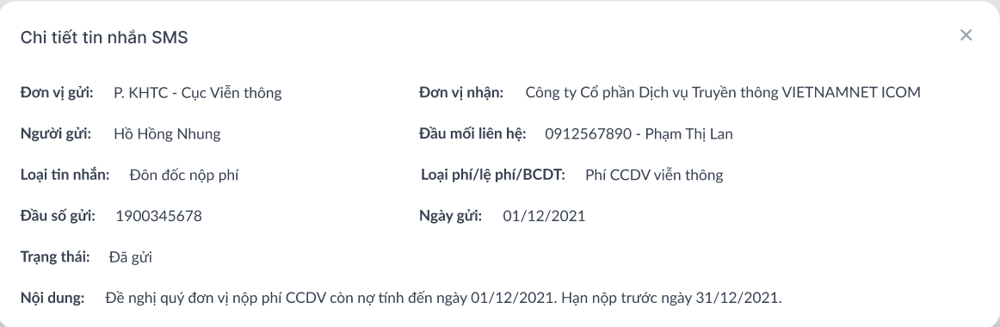

STT

Tên

Kiểu

dữ liệu

Bắt buộc

Mô tả

Database

1

Đơn vị gửi

Text

Hiển thị tên đơn vị gửi.

2

Đơn vị nhận

Text

Hiển thị tên đơn vị nhận.

3

Đầu số gửi

Number

Hiển thị đầu số gửi đi từ các phòng ban của Cục Viễn thông

4

Đầu mối liên hệ

Text

Hiển thị dạng “SĐT – Tên đầu mối liên hệ của DN”

5

Người gửi

Text

Hiển thị tên người gửi

6

Loại tin nhắn

Text

Hiển thị loại tin nhắn.

7

Loại phí/lệ phí/BCDT

Text

Hiển thị loại phí/lệ phí/BCDT

8

Ngày gửi

Date

Hiển thị ngày gửi tin nhắn

Định dạng dd/mm/yyyy

9

Trạng thái

Text

Hiển thị trạng thái của tin nhắn. (Đã gửi hoặc Gửi thất bại)

10

Nội dung

Text

Hiển thị nội dung đầy đủ của tin nhắn SMS đã gửi.

Gửi tin nhắn SMS đột xuất đến Doanh nghiệp

Luồng chức năng

Thông tin chung

Tên chức năng

Gửi tin nhắn SMS đột xuất đến Doanh nghiệp

Mô tả

Chức năng cho phép gửi tin nhắn đột xuất tới các DN để thông báo nộp phí/lệ phí/BCDT.

Tác nhân

Lãnh đạo, Cán bộ Phòng KHTC, Phòng CPTN, Phòng Kinh tế

Điều kiện trước

Đăng nhập vào hệ thống, có phân quyền chức năng

Điều kiện sau

Gửi tin nhắn thành công

Ngoại lệ

N/A

Các yêu cầu đặc biệt

N/A

Luồng chức năng

--	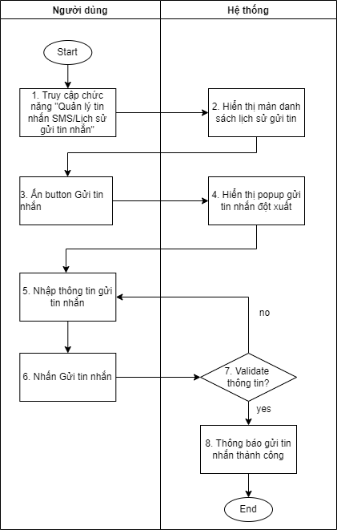

	Mô tả luồng xử lý

Bước

Mô tả

Bước 1

Truy cập chức năng "Quản lý tin nhắn SMS/Lịch sử gửi tin nhắn SMS đến Doanh nghiệp"

Bước 2

Hiển thị màn danh sách lịch sử gửi tin nhắn SMS đến Doanh nghiệp

Bước 3

Ấn button Gửi tin nhắn

Bước 4

Hiển thị popup gửi tin nhắn đột xuất

Bước 5

Nhập thông tin gửi tin nhắn

Bước 6

Nhấn nút Gửi tin nhắn

Bước 7

Validate thông tin:

- Nếu hợp lệ chuyển bước 8.

- Nếu không hợp lệ, hệ thống đưa ra thông báo tại các trường nhập không hợp lệ. Quay lại bước 5.

Bước 8

Thông báo gửi tin nhắn thành công.

Hiển thị thông báo “Đã gửi tin nhắn thành công.”

Giao diện chức năng

--	Giao diện popup nhập thông tin gửi tin nhắn

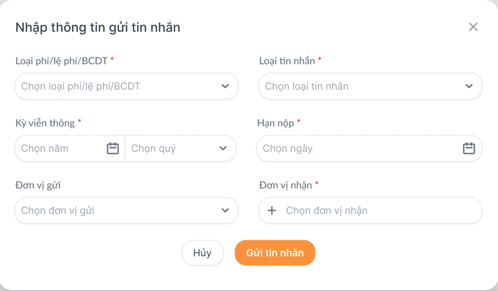

--		Giao diện popup nhập thông tin gửi tin nhắn thông báo nộp lệ phí/phí 1 lần/phí cáp biển

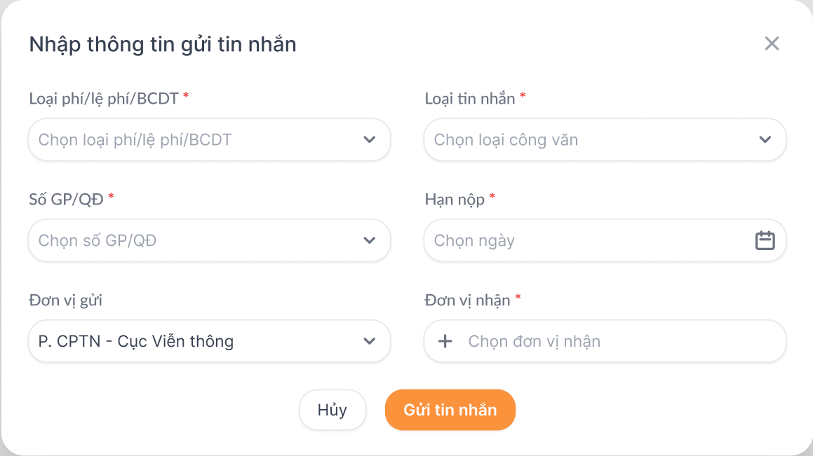

--	Giao diện popup nhập thông tin gửi tin nhắn đôn đốc nộp phí

--	Giao diện popup nhập thông tin gửi tin nhắn đôn đốc nộp BCDT

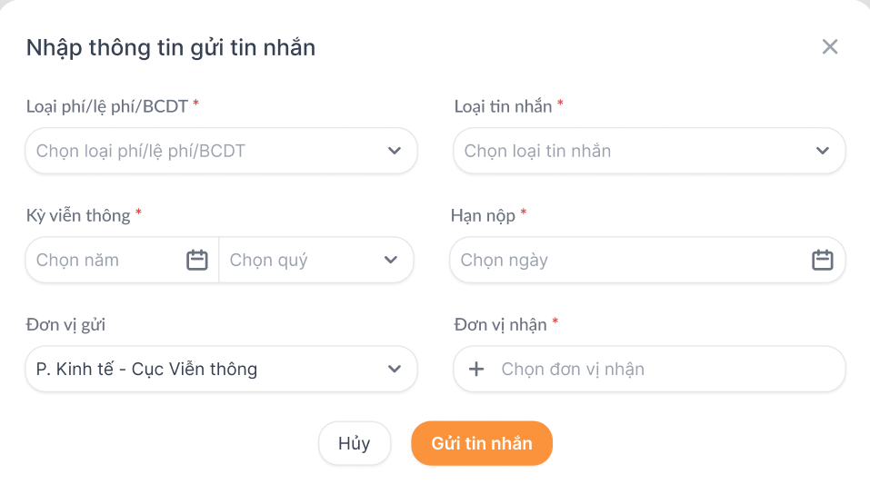

--	Giao diện gửi tin nhắn đối chiếu công nợ phí kho số

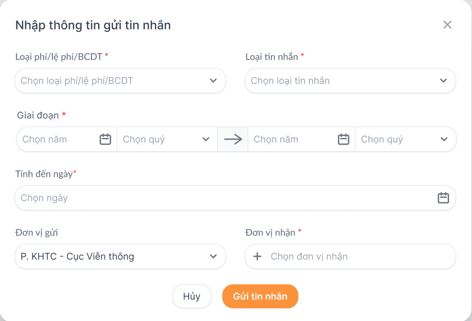

--	Giao diện gửi tin nhắn đối chiếu công nợ phí quyền

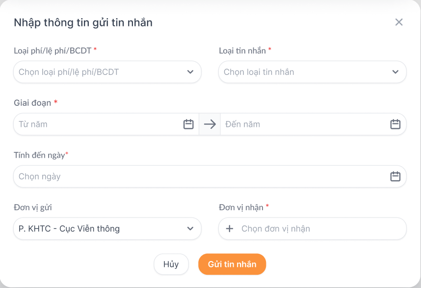

--	Giao diện popup chọn đơn vị nhận

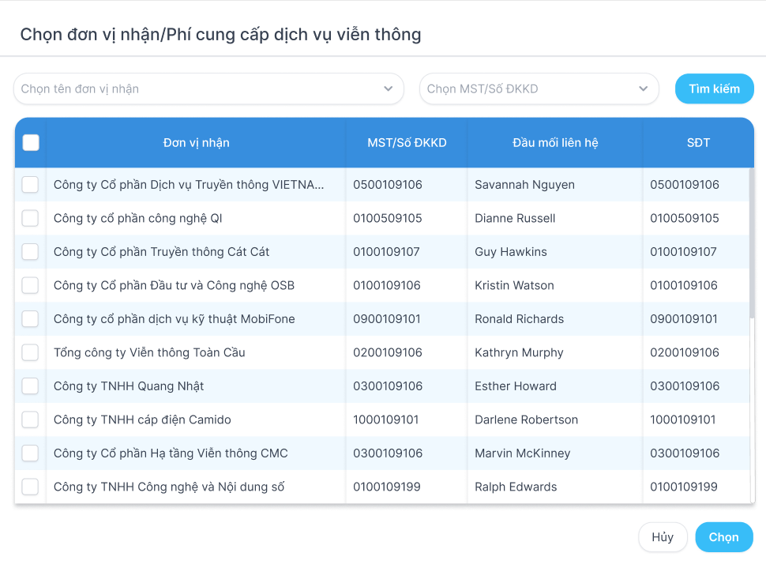

--	Giao diện popup khi đã chọn đơn vị nhận

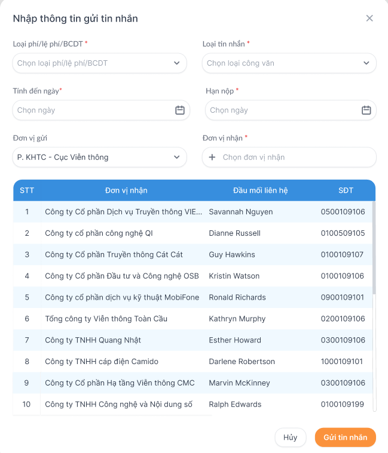

STT

Tên

Kiểu

dữ liệu

Bắt buộc

Mô tả

Database

1

Popup nhập thông tin gửi tin nhắn thông báo

Popup nhập thông tin gửi tin nhắn thông báo

Popup nhập thông tin gửi tin nhắn thông báo

Popup nhập thông tin gửi tin nhắn thông báo

Popup nhập thông tin gửi tin nhắn thông báo

1.1

Loại phí/lệ phí/BCDT

combobox search

x

- Cho phép chọn 1/nhiều trong các loại phí/lệ phí/BCDT có trong hệ thống:

+ Phí CCDV viễn thông

+ Phí TLM viễn thông công cộng

+ Phí sử dụng mã, số viễn thông

+ Phí thử nghiệm mạng và dịch vụ viễn thông

+ Phí TLM viễn thông dùng riêng

+ Phí lắp đặt cáp viễn thông trên biển

+ Phí sửa chữa, bảo dưỡng cáp viễn

+ Lệ phí cấp phép

+ Lệ phí phân bổ mã, số viễn thông

+ Lệ phí lắp đặt cáp viễn thông trên biển

+ Báo cáo doanh thu

1.2

Loại tin nhắn

combobox search

x

- Autocomplete gõ nhập tên loại tin nhắn hệ thống tự động gợi ý.

- Cho phép chọn 1 trong các loại tin nhắn.

Hiển thị các lựa chọn loại tin nhắn tương ứng với Loại phí/lệ phí/BCDT:

--	Báo cáo doanh thu

+ Thông báo nộp BCDT

+ Đôn đốc nộp BCDT

--	Lệ phí cấp phép/Lệ phí phân bổ mã, số viễn thông/Lệ phí lắp đặt cáp viễn thông trên biển

+ Thông báo nộp lệ phí

--	Phí CCDV viễn thông/Phí TLM viễn thông công cộng

+ Thông báo nộp phí năm đầu

+ Thông báo nộp phí

--	Chọn đồng thời Phí CCDV viễn thông và Phí TLM viễn thông công cộng

+ Đôn đốc nộp phí

+ Đối chiếu công nợ

--	Phí sử dụng mã, số viễn thông

+ Thông báo nộp phí

+ Đôn đốc nộp phí

+ Đối chiếu công nợ

--	Phí lắp đặt cáp viễn thông trên biển/Phí sửa chữa, bảo dưỡng cáp viễn thông trên biển/Phí thử nghiệm mạng và  dịch vụ viễn thông/Phí TLM dùng riêng.

+ Thông báo nộp phí

1.3

Kỳ viễn thông

combobox

x

Hiển thị trường này khi chọn:

+ Phí CCDV viễn thông/Thông báo nộp phí

+ Phí TLM viễn thông công cộng/ Thông báo nộp phí

+ Phí sử dụng mã, số viễn thông/Thông báo nộp phí

+ Báo cáo doanh thu/Thông báo nộp BCDT

+ Báo cáo doanh thu/Đôn đốc nộp BCDT

1.4

Hạn nộp

datepicker

x

- Hiển thị khi chọn các tin nhắn thông báo nộp phí/thông báo nộp lệ phí/thông báo nộp phí năm đầu/đôn đốc nộp phí/đôn đốc nộp BCDT

Cho phép chọn ngày hạn nộp.

1.5

Số GP/QĐ/CV

Combobox search

x

- Hiển thị trường này khi chọn:

+ Thông báo nộp lệ phí/ Thông báo nộp phí năm  đầu

+ Thông báo nộp phí các loại: Phí lắp đặt cáp viễn thông trên biển/Phí sửa chữa, bảo dưỡng cáp viễn thông trên biển/Phí thử nghiệm mạng và  dịch vụ viễn thông/Phí TLM dùng riêng.

- Cho phép nhập/chọn 1 số giấy phép/quyết định/công văn.

- Hệ thống autocomplete.

- Sắp xếp ưu tiên các giấy phép có Ngày cấp phép gần nhất.

1.6

Tính đến ngày

datepicker

x

Cho phép chọn ngày.

Hiển thị trường này khi chọn:

+ Chọn đồng thời Phí CCDV viễn thông và Phí TLM viễn thông công cộng/Đôn đốc nộp phí

+ Phí sử dụng mã, số viễn thông/Đôn đốc nộp phí

1.7

Ngày cấp phép

Datepicker

Autofill theo Số GP/QĐ/CV

1.8

Giai đoạn

Datepicker

x

Đối với phí quyền giai đoạn tính theo năm

Đối với phí kho số giai đoạn tính theo quý

1.9

Đơn vị gửi

datepicker

x

--	Hiển thị “P. CPTN – Cục Viễn thông” khi chọn:

  + Phí thử nghiệm, TLM dùng riêng, phí lắp đặt, phí sửa chữa cáp biển/Thông báo nộp phí.

  + Lệ phí phân bổ, lệ phí cấp phép/Thông báo nộp lệ phí.

  + Phí CCDV viễn thông/Phí TLM viễn thông công cộng Thông báo nộp phí năm đầu.

--	Hiển thị “P. Kinh tế – Cục Viễn thông” khi chọn:

+ Báo cáo doanh thu/Thông báo hoặc đôn đốc nộp BCDT

--	Hiển thị “P. KHTC – Cục Viễn thông” khi chọn:

+ Phí CCDV viễn thông/Phí TLM viễn thông công cộng/Thông báo nộp phí

+ Phí CCDV viễn thông/Phí TLM viễn thông công cộng/Đôn đốc nộp phí

+ Phí CCDV viễn thông/Phí TLM viễn thông công cộng/Đối chiếu công nợ

+ Phí kho số/Thông báo, đôn đốc, đối chiếu công nợ.

1.10

Đơn vị nhận

button

x

Nhấn vào icon “+” => hiển thị popup chọn các đơn vị nhận tin nhắn.

1.11

Hủy

button

Nhấn button Hủy => Hiển thị pop-up xác nhận hủy.

1.12

Gửi tin nhắn

button

Nhấn để thực hiện gửi tin nhắn theo mẫu tới các đầu mối liên hệ các DN đã chọn.

Cấu hình tỷ lệ tờ khai phí, lệ phí

Xem Danh sách cập nhật tỷ lệ tờ khai

a)	Luồng chức năng

Thông tin chung

Tên chức năng

Xem danh sách cập nhật tỷ lệ tờ khai

Mô tả

Chức năng cho phép xem danh sách cập nhật tỷ lệ tờ khai thuế áp dụng theo Thông tư quy định trong từng khoảng thời gian

Tác nhân

Lãnh đạo, Cán bộ Phòng KHTC, Phòng CPTN, Phòng Kinh tế

Điều kiện trước

Đăng nhập vào hệ thống, có phân quyền chức năng

Điều kiện sau

Xem, tìm kiếm tra cứu được các cập nhật tỷ lệ tờ khai thuế theo từng thời gian

Ngoại lệ

N/A

Các yêu cầu đặc biệt

N/A

Luồng quy trình

--	

--	Mô tả luồng xử lý

Bước

Mô tả

Bước 1

NSD truy cập chức năng “Quản lý tỷ lệ tờ khai thuế/Danh sách cập nhật tỷ lệ tờ khai thuế”.

Bước 2

Hệ thống hiển thị giao diện danh sách các cập nhật tỷ lệ tờ khai thuế áp dụng theo các lần Thông tư.

Sắp xếp thứ tự theo ngày kết thúc (ngày kết thúc gần nhất thì hiện lên đầu)

Thời gian áp dụng mỗi lần không trùng nhau.

Bước 3

NSD nhập các trường thông tin muốn tìm kiếm.

Bước 4

Nhấn [Tìm kiếm].

Bước 5

Hệ thống kiểm tra tính hợp lệ thông tin nhập:

- Nếu hợp lệ, chuyển bước 6.

- Nếu không hợp lệ, hệ thống đưa ra thông báo tại các trường nhập không hợp lệ. Quay lại bước 3.

Bước 6

Hệ thống hiển thị danh sách nội dung cập nhật tỷ lệ tờ khai theo điều kiện tìm kiếm.

Kết thúc luồng.

b)	Giao diện chức năng

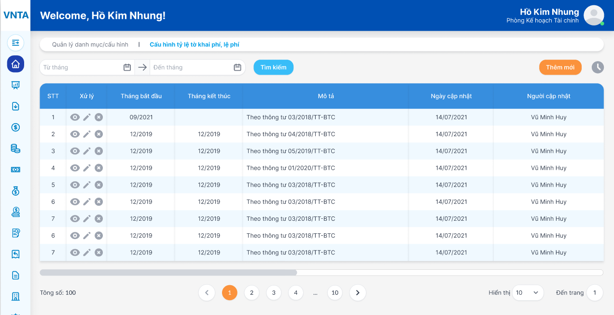

STT

Thông tin

Kiểu dữ liệu

Bắt buộc

Mô tả

Database

1

Tìm kiếm cơ bản

Tìm kiếm cơ bản

Tìm kiếm cơ bản

Tìm kiếm cơ bản

Tìm kiếm cơ bản

1.1

Tháng bắt đầu: Từ tháng – Đến tháng

Datepicker

x

- Từ tháng <= Đến tháng

- Cho phép người dùng tìm kiếm được các mức tỉ lệ có Tháng bắt đầu trong khoảng thời gian đang chọn.

- “Từ tháng” <= “Đến tháng”

- Nếu bỏ trống và tìm kiếm thì hiển thị danh sách tất cả các mức tỉ lệ.

- Nếu bỏ trống “Đến tháng” và tìm kiếm thì hiển thị danh sách tất cả các mức tỷ lệ có “Tháng bắt đầu” tính từ tháng trong “Từ tháng” đang chọn.

1.2

Tìm kiếm

Button

x

Cho phép người dùng tìm kiếm các tỉ lệ áp dụng trong khoảng thời gian đang tra cứu.

2

Grid danh sách

Grid danh sách

Grid danh sách

Grid danh sách

Grid danh sách

2.1

STT

Text

- Tự sinh tăng dần

2.2

Xử lý

Bao gồm chức năng Xem chi tiết nội dung cập nhật tỷ lệ tờ khai thuế; Chỉnh sửa cập nhật nội dung tỷ lệ tờ khai thuế.

2.2.1

Button

Nhấn button hệ thống chuyển đến màn Xem chi tiết nội dung nội dung cập nhật tỷ lệ tờ khai thuế;

2.2.2

Button

Nhấn button hệ thống chuyển đến màn Chỉnh sửa cập nhật nội dung tỷ lệ tờ khai thuế.

2.2.3

Button

Nhấn button hệ thống hiển thị popup xác nhận xóa.

2.3

Tháng bắt đầu

Date

Hiển thị thông tin tháng bắt đầu áp dụng tỷ lệ tờ khai thuế theo định dạng MM/YYYY.

2.4

Tháng kết thúc

Date

Hiển thị thông tin tháng kết thúc áp dụng tỷ lệ tờ khai thuế theo định dạng MM/YYYY.

2.5

Mô tả

Text

Hiển thị nội dung mô tả

Max-leght: 150 ký tự

2.6

Ngày cập nhật

Date

Hiển thị ngày cập nhật gần nhất, định dạng theo DD/MM/YYYY.

2.7

Người cập nhật

Text

Hiển thị thông tin họ tên của người cập nhật gần nhất.

3

Phân trang

Phân trang

Phân trang

Phân trang

Phân trang

3.1

Tổng số bản ghi

Text

Hiển thị tổng số bản ghi theo điều kiện tìm kiếm

3.2

Phân trang

Button

Gồm các button: Về trang trước đó, 1, 2, 3, 4, 5 (nếu ít trang hơn sẽ tự cắt bớt), trang sau đó

3.3

Số bản ghi trên 1 trang

Combobox

Gồm:

10/trang

20/trang

50/trang

100/trang

Mặc định 10 bản ghi trên 1 trang

3.4

Đến trang

Text

- Nhập số trang => hệ thống nhảy đến dữ liệu trang tương ứng

4

Thêm mới

button

Nhấn button để thêm mới tỷ lệ tờ khai

5

button

Nhấn để hiển thị màn “Lịch sử thay đổi tỷ lệ tờ khai phí, lệ phí”

--	Giao diện popup xác nhận Xóa

Tham khảo tương tự các mô tả popup xác nhận xóa khác.

	Xem chi tiết cập nhật tỷ lệ tờ khai

Luồng chức năng

--	Thông tin chung

Tên chức năng

Xem chi tiết nội dung cập nhật tỷ lệ tờ khai

Mô tả

Chức năng cho phép xem chi tiết nội dung cập nhật tỷ lệ tờ khai thuế.

Tác nhân

Lãnh đạo, Cán bộ Phòng KHTC, Phòng CPTN, Phòng Kinh tế

Điều kiện trước

Đăng nhập vào hệ thống, có phân quyền chức năng.

Điều kiện sau

Xem chi tiết các thông tin tỷ lệ tờ khai thuế cụ thể liên quan đến các loại phí/lệ phí/BCDT.

Ngoại lệ

N/A

Các yêu cầu đặc biệt

N/A

--	Luồng chức năng

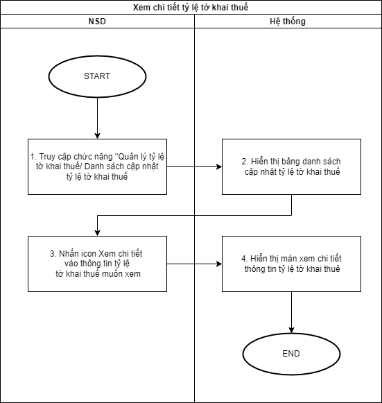

--	Mô tả luồng xử lý

Bước

Mô tả

Bước 1

NSD truy cập chức năng “Quản lý tỷ lệ tờ khai thuế/Danh sách cập nhật tỷ lệ tờ khai thuế”.

Bước 2

Hệ thống hiển thị giao diện danh sách tất cả nội dung cập nhật tỷ lệ tờ khai thuế áp dụng theo Thông tư quy định.

Luôn sắp xếp tất cả các nội dung cập nhật tỷ lệ tờ khai thuế (không thể xóa) lên đầu tiên; Sau đó sắp xếp thứ tự theo ngày cập nhật.

Bước 3

NSD nhấn vào icon xem chi tiết của thông tin tỷ lệ tờ khai thuế muốn xem.

Bước 4

Hệ thống hiển thị màn xem chi tiết nội dung thông tin tỷ lệ tờ khai thuế.

Kết thúc luồng.

Giao diện chức năng

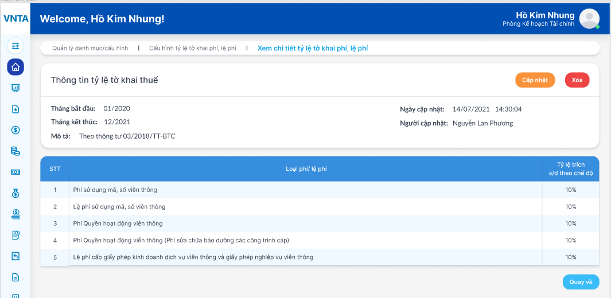

STT

Thông tin

Kiểu dữ liệu

Bắt buộc

Mô tả

Database

1

Tháng bắt đầu

Date

Hiển thị thông tin tháng bắt đầu áp dụng tỷ lệ tờ khai thuế theo định dạng MM/YYYY.

2

Tháng kết thúc

Date

Hiển thị thông tin tháng kết thúc áp dụng tỷ lệ tờ khai thuế theo định dạng MM/YYYY.

3

Mô tả

Text

Hiển thị nội dung mô tả.

4

Ngày cập nhật

Datetime

Hiển thị ngày, giờ cập nhật gần nhất của bản ghi này theo Ngày hiển thị theo định dạng DD/ MM/YYYY; Giờ hiển thị theo định dạng HH/MM/SS.

5

Người cập nhật

Text

Hiển thị tên người cập nhật gần nhất của bản ghi này.

6

Cập nhật

Button

Nhấn button Cập nhật-> hiển thị màn cập nhật tỷ lệ tờ khai thuế.

7

Xóa

Button

Nhấn button Xóa -> hiển thị popup xác nhận xóa.

8

Button

Nhấn button -> hiển thị popup Xem lịch sử cập nhật tỷ lệ tờ khai thuế.

9

Quay về

Button

Nhấn button Quay về -> quay về màn danh sách.

10

Grid danh sách

Grid danh sách

Grid danh sách

Grid danh sách

Grid danh sách

10.1

STT

Text

Tự sinh tăng dần.

10.2

Loại phí/lệ phí

Text

Hiển thị tên loại phí, lệ phí mặc định.

10.3

Tỷ lệ trích s/d theo chế độ

Text

Hiển thị tỉ lệ trích s/d theo chế độ.

Xem lịch sử cập nhật tỷ lệ tờ khai

Luồng chức năng

--	Thông tin chung

Tên chức năng

Xem lịch sử cập nhật tỷ lệ tờ khai thuế

Mô tả

Chức năng cho phép xem lịch sử cập nhật tỷ lệ tờ khai thuế

Tác nhân

Lãnh đạo, Cán bộ Phòng KHTC, Phòng CPTN, Phòng Kinh tế

Điều kiện trước

Đăng nhập vào hệ thống, có phân quyền chức năng.

Điều kiện sau

Xem lịch sử cập nhật tỷ lệ tờ khai thuế.

Ngoại lệ

N/A

Các yêu cầu đặc biệt

N/A

--	Luồng chức năng

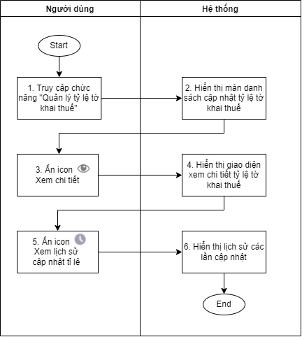

--	Mô tả luồng xử lý

Bước

Mô tả

Bước 1

NSD truy cập chức năng "Quản lý tỷ lệ tờ khai thuế"

Bước 2

Hệ thống hiển thị màn danh sách cập nhật tỷ lệ tờ khai thuế

Bước 3

NSD ấn icon Xem chi tiết

Bước 4

Hệ thống hiển thị giao diện xem chi tiết tỷ lệ tờ khai thuế

Bước 5

NSD ấn icon Xem lịch sử cập nhật tỉ lệ của bản ghi đang xem

Bước 6

Hệ thống hiển thị lịch sử các lần cập nhật của bản ghi đang xem

Giao diện chức năng

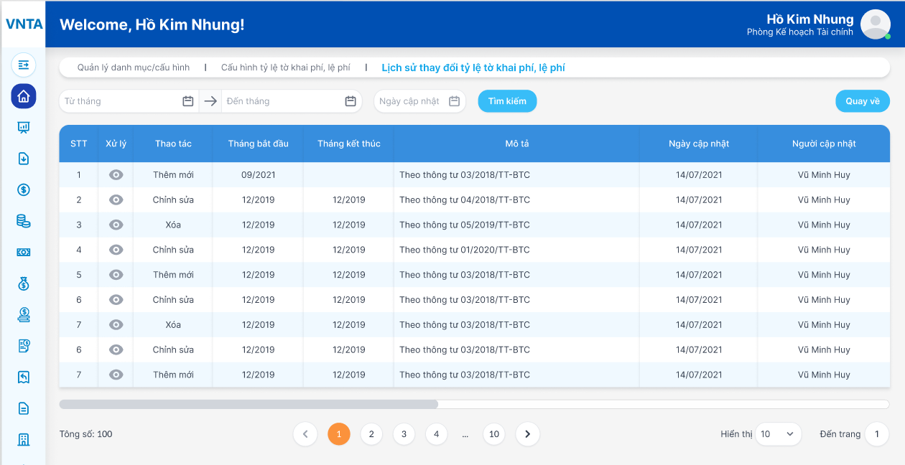

STT

Thông tin

Kiểu dữ liệu

Kiểu dữ liệu

Bắt buộc

Bắt buộc

Mô tả

Mô tả

Database

Database

1

Tra cứu

Tra cứu

Tra cứu

Tra cứu

Tra cứu

Tra cứu

Tra cứu

Tra cứu

Tra cứu

1.1

Từ tháng

Datepicker

Datepicker

- Cho phép chọn tháng.

- Từ tháng <= Đến tháng.

- Định dạng MM/YYYY.

- Tìm kiếm sẽ cho cho ra các lần cập nhật có Tháng bắt đầu -> Tháng kết thúc nằm trong khoảng Từ tháng -> Đến tháng

- Cho phép chọn tháng.

- Từ tháng <= Đến tháng.

- Định dạng MM/YYYY.

- Tìm kiếm sẽ cho cho ra các lần cập nhật có Tháng bắt đầu -> Tháng kết thúc nằm trong khoảng Từ tháng -> Đến tháng

1.2

Đến tháng

Datepicker

Datepicker

- Cho phép chọn tháng.

- Từ tháng <= Đến tháng.

- Định dạng MM/YYYY.

- Nếu bỏ trống trường “Đến tháng”.

- Cho phép chọn tháng.

- Từ tháng <= Đến tháng.

- Định dạng MM/YYYY.

- Nếu bỏ trống trường “Đến tháng”.

1.3

Ngày cập nhật

Datepicker

Datepicker

Cho phép chọn theo ngày cập nhật.

Cho phép chọn theo ngày cập nhật.

1.4

Tìm kiếm

button

button

Nhấn để tìm kiếm theo tiêu chí đã chọn.

Nhấn để tìm kiếm theo tiêu chí đã chọn.

2

Quay về

button

button

Nhấn để quay trở về màn Cấu hình tỷ lệ tờ khai phí, lệ phí

Nhấn để quay trở về màn Cấu hình tỷ lệ tờ khai phí, lệ phí

3

Grid danh sách

Grid danh sách

Grid danh sách

Grid danh sách

Grid danh sách

Grid danh sách

Grid danh sách

Grid danh sách

Grid danh sách

3.1

STT

Text

Text

Tự sinh tăng dần.

Tự sinh tăng dần.

3.2

Xử lý

button

button

Nhấn icon Xem chi tiết -> hiển thị popup chi tiết lịch sử cập nhật tỷ lệ tờ khai thuế.

Nhấn icon Xem chi tiết -> hiển thị popup chi tiết lịch sử cập nhật tỷ lệ tờ khai thuế.

3.3

Thao tác

Text

Text

Hiển thị các thao tác Thêm mới, Chỉnh sửa, Xóa tương ứng của mỗi lần cập nhật.

Hiển thị các thao tác Thêm mới, Chỉnh sửa, Xóa tương ứng của mỗi lần cập nhật.

3.4

Tháng bắt đầu

Date

Date

Hiển thị ngày bắt đầu áp dụng mức tỉ lệ.

Hiển thị ngày bắt đầu áp dụng mức tỉ lệ.

3.5

Tháng kết thúc

Date

Date

Hiển thị ngày kết thúc áp dụng mức tỉ lệ.

Hiển thị ngày kết thúc áp dụng mức tỉ lệ.

3.6

Mô tả

Text

Text

Hiển thị nội dung mô tả.

Hiển thị nội dung mô tả.

3.7

Ngày cập nhật

date

date

Hiển thị ngày, giờ cập nhật

Định dạng:

DD/MM/YYYY  HH:MM:SS

Hiển thị ngày, giờ cập nhật

Định dạng:

DD/MM/YYYY  HH:MM:SS

3.8

Người cập nhật

Text

Text

Hiển thị tên người cập nhật

Hiển thị tên người cập nhật

4

Quay về

Button

Button

Nhấn để quay về màn Xem chi tiết trước đó.

Nhấn để quay về màn Xem chi tiết trước đó.

5

Phân trang

Phân trang

Phân trang

Phân trang

Phân trang

Phân trang

Phân trang

Phân trang

Phân trang

Phân trang

5.1

Tổng số bản ghi

Tổng số bản ghi

Text

Text

Hiển thị tổng số bản ghi theo điều kiện tìm kiếm

Hiển thị tổng số bản ghi theo điều kiện tìm kiếm

5.2

Phân trang

Phân trang

Button

Button

Gồm các button: Về trang trước đó, 1, 2, 3, 4, 5 (nếu ít trang hơn sẽ tự cắt bớt), trang sau đó

Gồm các button: Về trang trước đó, 1, 2, 3, 4, 5 (nếu ít trang hơn sẽ tự cắt bớt), trang sau đó

5.3

Số bản ghi trên 1 trang

Số bản ghi trên 1 trang

Combobox

Combobox

Gồm:

10/trang

20/trang

50/trang

100/trang

Mặc định 10 bản ghi trên 1 trang

Gồm:

10/trang

20/trang

50/trang

100/trang

Mặc định 10 bản ghi trên 1 trang

5.4

Đến trang

Đến trang

Text

Text

- Nhập số trang => hệ thống nhảy đến dữ liệu trang tương ứng

- Nhập số trang => hệ thống nhảy đến dữ liệu trang tương ứng

--	Giao diện xem chi tiết lịch sử cập nhật

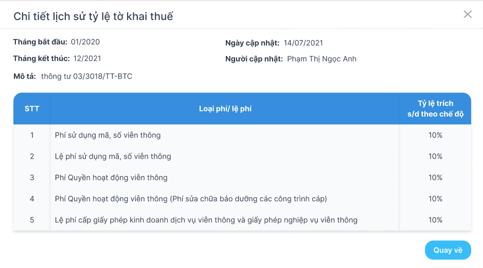

STT

Thông tin

Kiểu dữ liệu

Bắt buộc

Mô tả

Database

1

Tháng bắt đầu

Date

Hiển thị tháng bắt đầu.

2

Tháng kết thúc

Date

Hiển thị tháng kết thúc

3

Ngày cập nhật

Date

Hiển thị ngày, giờ cập nhật

Định dạng:

DD/MM/YYYY

4

Người cập nhật

Text

Hiển thị người cập nhật.

4

Mô tả

Text

Hiển thị mô tả.

5

Grid

Grid

Grid

Grid

Grid

5.1

STT

Text

Tự sinh tăng dần.

5.2

Loại phí/lệ phí

Text

Hiển thị các loại phí, lệ phí

5.3

Tỷ lệ trích s/d theo chế độ

Text

Hiển thị tỷ lệ trích tương ứng.

6

Quay về

button

Nhấn để quay về màn xem chi tiết trước đó.

Thêm mới tỷ lệ tờ khai

Luồng chức năng

--	Thông tin chung

Tên chức năng

Thêm mới tỷ lệ tờ khai thuế

Mô tả

Chức năng cho phép thêm mới thông tin tỷ lệ tờ khai thuế

Tác nhân

Lãnh đạo, Cán bộ Phòng KHTC, Phòng CPTN, Phòng Kinh tế

Điều kiện trước

Đăng nhập vào hệ thống, có phân quyền chức năng.

Điều kiện sau

Thêm mới thành công các thông tin của tỷ lệ tờ khai thuế

Ngoại lệ

N/A

Các yêu cầu đặc biệt

N/A

--	Luồng chức năng

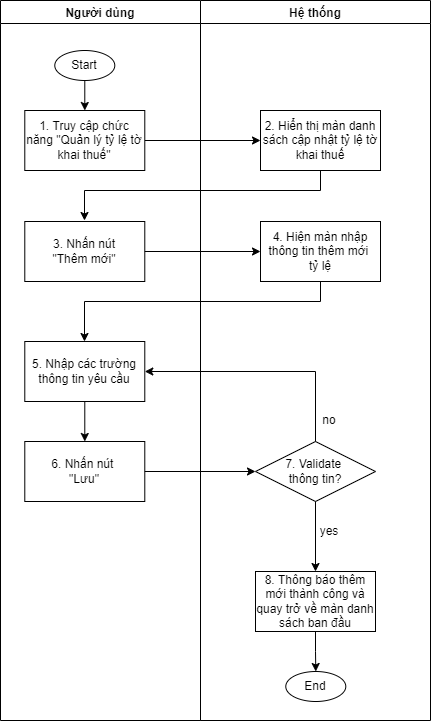

--	Mô tả luồng xử lý

Bước

Mô tả

Bước 1

NSD truy cập chức năng "Quản lý tỷ lệ tờ khai thuế"

Bước 2

Hệ thống hiển thị màn danh sách cập nhật tỷ lệ tờ khai thuế

Bước 3

NSD nhấn nút "Thêm mới"

Bước 4

Hệ thống hiện màn nhập thông tin thêm mới tỷ lệ

Bước 5

NSD nhập các trường thông tin yêu cầu

Bước 6

Nhấn nút "Lưu"

Bước 7

Hệ thống kiểm tra tính hợp lệ thông tin nhập:

- Nếu hợp lệ, chuyển bước 8

- Nếu không hợp lệ, hệ thống đưa ra thông báo tại các trường nhập không hợp lệ. Quay lại bước 5.

Bước 8

Hệ thống thông báo thêm mới thành công và quay trở về màn danh sách ban đầu

Giao diện chức năng

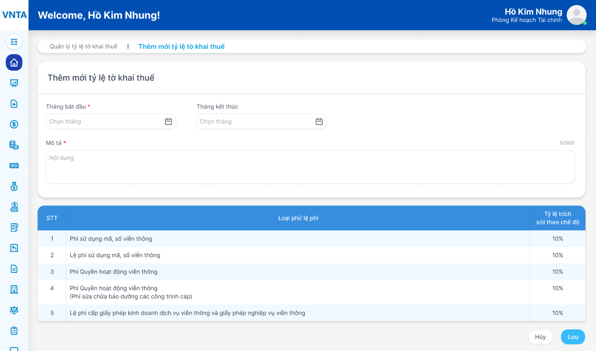

STT

Thông tin

Kiểu dữ liệu

Bắt buộc

Mô tả

Database

1

Thêm mới tỷ lệ tờ khai thuế

Thêm mới tỷ lệ tờ khai thuế

Thêm mới tỷ lệ tờ khai thuế

Thêm mới tỷ lệ tờ khai thuế

Thêm mới tỷ lệ tờ khai thuế

1.1

Tháng bắt đầu

Datepicker

x

Cho phép người dùng chọn tháng bắt đầu áp dụng tỷ lệ tờ khai thuế.

Tháng bắt đầu >= Tháng kết thúc

Khoảng thời gian không được trùng với khoảng thời gian của các bản ghi khác (của các lần cập nhật theo thông tư khác).

1.2

Tháng kết thúc

Datepicker

x

Cho phép người dùng chọn hoặc nhập tháng kết thúc áp dụng tỷ lệ tờ khai thuế.

Tháng kết thúc >= Tháng bắt đầu

Khoảng thời gian không được trùng với khoảng thời gian của các bản ghi khác (của các lần cập nhật theo thông tư khác).

Trường hợp đây là lần cập nhật theo thông tư mới nhất (Tháng bắt đầu mới nhất) thì ko bắt buộc chọn Tháng kết thúc.

1.3

Mô tả

Textbox

Cho phép nhập nội dung ghi chú thông tin tỷ lệ tờ khai thuế.

Max-leght 200 ký tự.

2

Grid danh sách

Grid danh sách

Grid danh sách

Grid danh sách

Grid danh sách

2.1

STT

Number

Tự sinh tăng dần.

2.2

Loại phí/Lệ phí/BCDT

Text

Hiển thị tên loại phí, lệ phí mặc định.

2.3

Tỷ lệ trích s/d theo chế độ

Textbox

Cho phép người dùng chỉnh sửa tỷ lệ trích s/d theo chế độ tương ứng theo thông tư quy định.

Giới hạn 0% -> 100%.

Mặc định hiển thị sẵn kí tự “%” khi nhập số.

2.4

Hủy

Button

Nhấn button [Hủy] => Hệ thống hiển thị pop-up xác nhận hủy. Kết thúc thao tác Chỉnh sửa tỷ lệ tờ khai thuế.

2.5

Lưu

Button

Nhấn button [Lưu] => Hệ thống kiểm tra tính hợp lệ thông tin người dùng nhập: Nếu hợp lệ, hệ thống thông báo “Lưu thông tin thành công” và load lại danh sách cập nhật tỷ lệ tờ khai thuế.

- Nếu không hợp lệ, hệ thống đưa ra thông báo tại các trường nhập không hợp lệ.

- Nếu lần áp dụng theo thông tư gần nhất chưa có tháng kết thúc thì tự động cập nhật tháng kết thúc = tháng bắt đầu của kì đang thêm mới – 1.

Chỉnh sửa tỷ lệ tờ khai

Luồng chức năng

--	Thông tin chung

Tên chức năng

Chỉnh sửa tỷ lệ tờ khai

Mô tả

Chức năng cho phép chỉnh sửa lại thông tin và điều chỉnh lại nội dung tỷ lệ tờ khai thuế

Tác nhân

Lãnh đạo, Cán bộ Phòng KHTC, Phòng CPTN, Phòng Kinh tế

Điều kiện trước

Đăng nhập vào hệ thống, có phân quyền chức năng.

Điều kiện sau

Chỉnh sửa thành công các thông tin, nội dung cho phép của tỷ lệ tờ khai thuế

Ngoại lệ

N/A

Các yêu cầu đặc biệt

N/A

--	Luồng chức năng

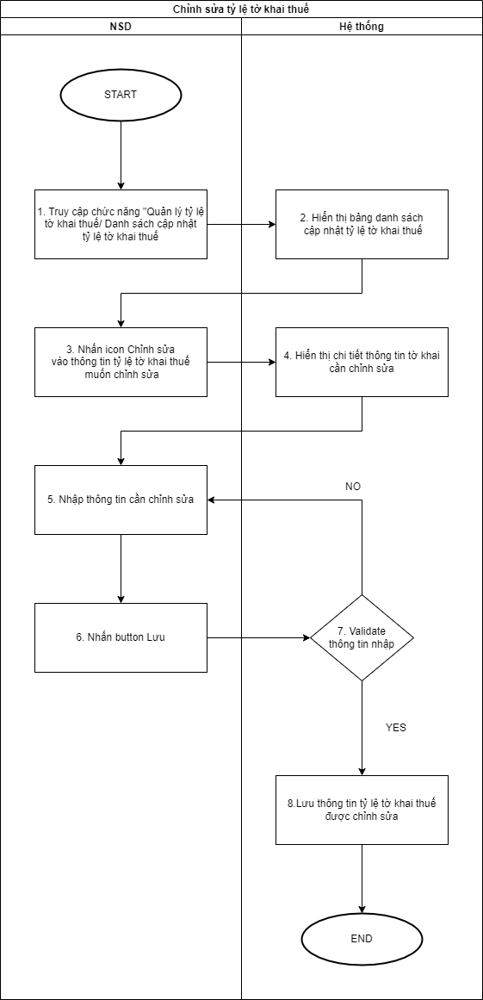

--	Mô tả luồng xử lý

Bước

Mô tả

Bước 1

NSD truy cập chức năng “Quản lý tỷ lệ tờ khai thuế/ Danh sách cập nhật tỷ lệ tờ khai thuế”.

Bước 2

Hệ thống hiển thị giao diện danh sách tất cả nội dung cập nhật tỷ lệ tờ khai thuế theo Thông tư quy định

Bước 3

NSD nhấn icon Chỉnh sửa của thông tin tỷ lệ tờ khai thuế cần chỉnh sửa.

Bước 4

Hệ thống hiển thị chi tiết nội dung thông tin tỷ lệ tờ khai thuế cần chỉnh sửa.

Bước 5

NSD nhập thông tin cần chỉnh sửa.

Bước 6

NSD nhấn button Lưu.

Bước 7

Hệ thống kiểm tra tính hợp lệ thông tin nhập:

- Nếu hợp lệ, chuyển bước 8

- Nếu không hợp lệ, hệ thống đưa ra thông báo tại các trường nhập không hợp lệ. Quay lại bước 5.

Bước 8

Hệ thống thực hiện lưu thông tin tỷ lệ tờ khai thuế được chỉnh sửa. Hiển thị thông báo Lưu thành công.

Kết thúc luồng.

Giao diện chức năng

--	Giao diện chức năng chỉnh sửa bản ghi theo thông tư mới nhất ( Tháng bắt đầu lớn nhất) (Ko bắt buộc điền Tháng kết thúc)

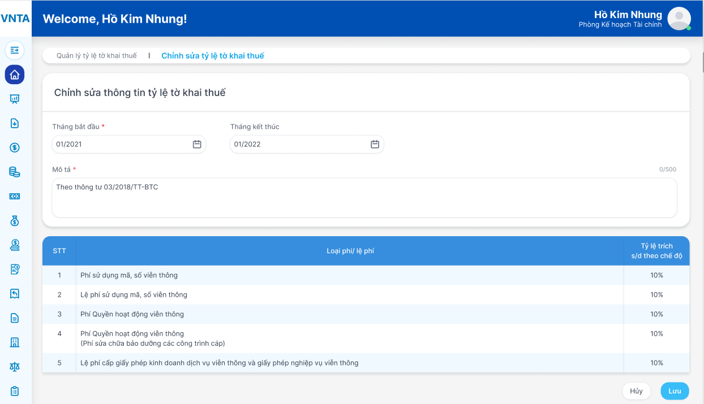

--	Giao diện chức năng chỉnh sửa các bản ghi bắt buộc điền Tháng kết thúc

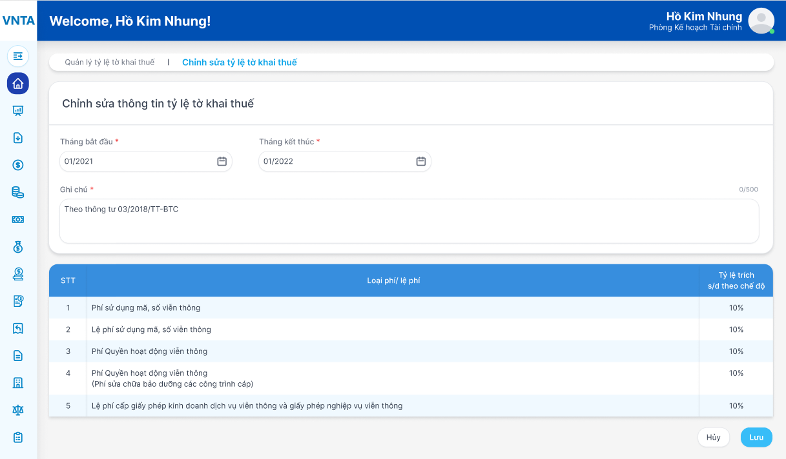

STT

Thông tin

Kiểu dữ liệu

Bắt buộc

Mô tả

Database

1

Chỉnh sửa thông tin tỷ lệ tờ khai thuế

Chỉnh sửa thông tin tỷ lệ tờ khai thuế

Chỉnh sửa thông tin tỷ lệ tờ khai thuế

Chỉnh sửa thông tin tỷ lệ tờ khai thuế

Chỉnh sửa thông tin tỷ lệ tờ khai thuế

1.1

Tháng bắt đầu

Datepicker

x

Cho phép người dùng chọn tháng bắt đầu áp dụng tỷ lệ tờ khai thuế.

Nguyên tắc là không trùng thời gian với các bản ghi khác.

1.2

Tháng kết thúc

Datepicker

x

Cho phép người dùng chọn hoặc nhập tháng kết thúc áp dụng tỷ lệ tờ khai thuế.

Tháng kết thúc >= Tháng bắt đầu.

Nguyên tắc là không trùng thời gian với các bản ghi khác.

Trường hợp đây là lần cập nhật theo thông tư mới nhất (Tháng bắt đầu mới nhất) thì ko bắt buộc chọn Tháng kết thúc.

1.3

Mô tả

Textbox

Cho phép nhập nội dung mô tả thông tin tỷ lệ tờ khai thuế.

Max-leght 200 ký tự.

2

Grid danh sách

Grid danh sách

Grid danh sách

Grid danh sách

Grid danh sách

2.1

STT

Number

Tự sinh tăng dần.

2.2

Loại phí/Lệ phí/BCDT

Text

Hiển thị loại phí/lệ phí tương ứng được chỉnh sửa

2.3

Tỷ lệ trích s/d theo chế độ

Textbox

Cho phép người dùng chỉnh sửa tỷ lệ trích s/d theo chế độ tương ứng theo thông tư quy định.

Giới hạn 0% -> 100%.

Mặc định hiển thị sẵn kí tự “%” khi nhập số.

2.4

Hủy

Button

Nhấn button [Hủy] => Hệ thống hiển thị pop-up xác nhận hủy. Kết thúc thao tác Chỉnh sửa tỷ lệ tờ khai thuế.

2.5

Lưu

Button

Nhấn button [Lưu] => Hệ thống kiểm tra tính hợp lệ thông tin người dùng nhập: Nếu hợp lệ, hệ thống thông báo “Lưu thông tin thành công” và load lại danh sách cập nhật tỷ lệ tờ khai thuế.

- Nếu không hợp lệ, hệ thống đưa ra thông báo tại các trường nhập không hợp lệ.

Cấu hình mức thu phí, lệ phí

Xem danh sách các mức thu phí, lệ phí

Luồng chức năng

--	Thông tin chung

Tên chức năng

Xem danh sách các mức thu phí, lệ phí

Mô tả

Chức năng cho phép xem thông tin danh sách các mức thu phí/lệ phí tương ứng với từng giai đoạn.

Tác nhân

Lãnh đạo, Cán bộ Phòng KHTC, Phòng CPTN, Phòng Kinh tế

Điều kiện trước

Đăng nhập vào hệ thống, có phân quyền chức năng

Điều kiện sau

Xem, tìm kiếm được danh sách mức thu phí/lệ phí

Ngoại lệ

N/A

Các yêu cầu đặc biệt

N/A

--	Luồng chức năng

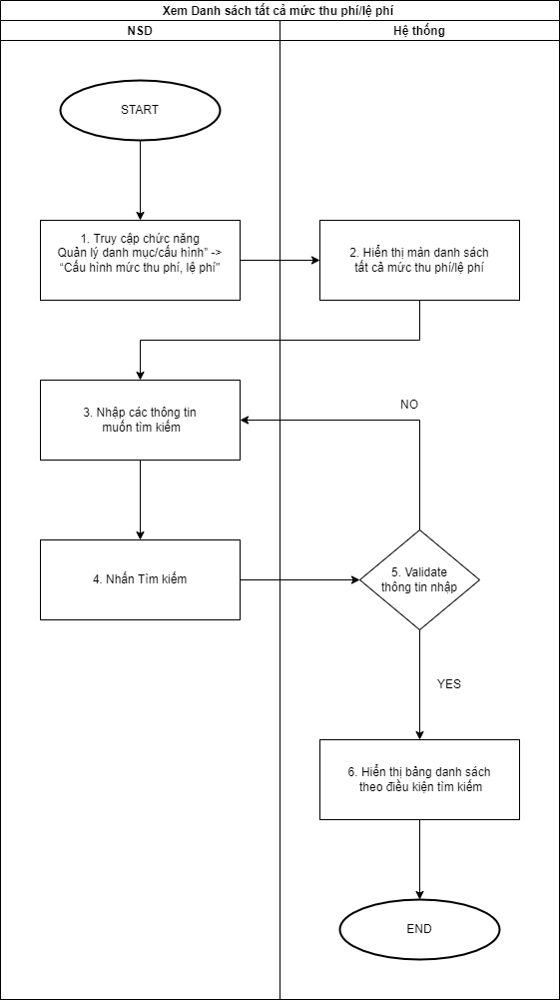

--	Mô tả luồng xử lý

Bước

Mô tả

Bước 1

NSD truy cập chức năng " Quản lý danh mục/cấu hình” ->  “Cấu hình mức thu phí, lệ phí"

Bước 2

Hệ thống hiển thị giao diện danh sách các mức thu phí/lệ phí tương ứng với từng giai đoạn.

Sắp xếp thứ tự các bản ghi theo Ngày kết thúc:

+ Các bản ghi để trống Ngày kết thúc: Được đặt lên đầu danh sách, ưu tiên Ngày cập nhật gần nhất.

+ Các bản ghi có Ngày kết thúc: ưu tiên Ngày kết thúc là ngày tương lai xa nhất, sau đó ưu tiên Ngày cập nhật gần nhất.

Mức thu phí/lệ phí tương ứng với từng loại phí/lệ phí gồm:

- Lệ phí cấp phép hoạt động viễn thông

- Lệ phí phân bổ mã, số viễn thông

- Phí sử dụng mã, số viễn thông

- Phí cung cấp dịch vụ viễn thông

- Phí thiết lập mạng viễn thông công cộng

- Phí thu một lần (nộp một lần cho toàn bộ thời hạn giấy phép)

Bước 3

NSD nhập các trường thông tin muốn tìm kiếm.

Bước 4

Nhấn [Tìm kiếm].

Bước 5

Hệ thống validate thông tin. Nếu không có kết quả thì hệ thống đưa thông báo “Mức thu phí/lệ phí không tồn tại.”.

Nếu có kết quả thì chuyển bước 6.

Bước 6

Hệ thống hiển thị danh sách các mức thu phí, lệ phí theo điều kiện tìm kiếm.

Kết thúc luồng.

Giao diện chức năng

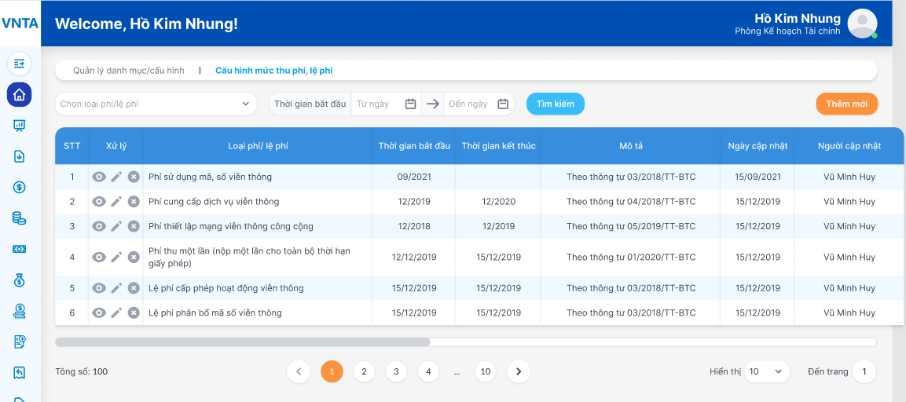

STT

Thông tin

Kiểu dữ liệu

Bắt buộc

Mô tả

Database

1

Tìm kiếm cơ bản

Tìm kiếm cơ bản

Tìm kiếm cơ bản

Tìm kiếm cơ bản

Tìm kiếm cơ bản

1.1

Chọn loại phí/lệ phí

Combobox search

x

Chứa các loại phí/lệ phí, gồm:

- Lệ phí cấp phép hoạt động viễn thông

- Lệ phí phân bổ mã, số viễn thông

- Phí sử dụng mã, số viễn thông

- Phí cung cấp dịch vụ viễn thông

- Phí thiết lập mạng viễn thông công cộng

- Phí thu một lần (nộp một lần cho toàn bộ thời hạn giấy phép)

- Mặc định ko chọn là Chọn tất cả.

- Cho phép nhập chọn loại phí/lệ phí.

- Autocomplete.

- Cho phép chọn 1 hoặc nhiều loại phí/lệ phí.

1.2

Thời gian bắt đầu

Datepicker

x

- Từ ngày <= Đến ngày

- Cho phép người dùng chọn theo Ngày bắt đầu.

Ví dụ: Khi tìm kiếm chọn ngày BĐ là ngày 5/9/2021:
+) Hiển thị các bản ghi của lệ phí/phí thu 1 lần có thời gian BĐ kể từ ngày 5/9/2021
+) Hiển thị các bản ghi của phí kho số, CCDV, TLM công cộng có thời gian BĐ từ tháng 09/2021.

1.3

Tìm kiếm

Button

Tìm kiếm theo các trường thông tin.

Hệ thống hiển thị giao diện danh sách các mức thu phí/lệ phí tương ứng với từng giai đoạn (các giai đoạn không trùng nhau).

Sắp xếp thứ tự các bản ghi theo Ngày kết thúc:

+ Các bản ghi để trống Ngày kết thúc: Được đặt lên đầu danh sách, ưu tiên Ngày cập nhật gần nhất.

+ Các bản ghi có Ngày kết thúc: ưu tiên Ngày kết thúc là ngày tương lai xa nhất, sau đó ưu tiên Ngày cập nhật gần nhất.

Mức thu phí/lệ phí tương ứng với từng loại phí/lệ phí gồm:

- Lệ phí cấp phép hoạt động viễn thông

- Lệ phí phân bổ mã, số viễn thông

- Phí sử dụng mã, số viễn thông

- Phí cung cấp dịch vụ viễn thông

- Phí thiết lập mạng viễn thông công cộng

- Phí thu một lần (nộp một lần cho toàn bộ thời hạn giấy phép)

2

Grid danh sách

Grid danh sách

Grid danh sách

Grid danh sách

Grid danh sách

2.1

STT

Text

Tự sinh tăng dần.

2.2

Xử lý

Bao gồm các chức năng:

- Xem chi tiết mức thu phí/lệ phí tương ứng với từng loại phí/lệ phí;

- Chỉnh sửa cập nhật mức thu phí/lệ phí phí tương ứng loại phí/lệ phí.

- Xóa thông tin mức thu phí/lệ phí tương ứng loại phí/lệ phí.

2.2.1

Button

Nhấn button => Hệ thống chuyển đến màn Xem chi tiết mức thu phí/lệ phí tương ứng với từng loại phí/lệ phí

2.2.2

Button

Nhấn button => Hệ thống chuyển đến màn Chỉnh sửa cập nhật mức thu phí/lệ phí phí tương ứng với từng loại phí/lệ phí.

2.2.3

Button

Nhấn button => Hệ thống hiển thị màn pop-up xác nhận Xóa mức thu phí/lệ phí.

2.3

Loại phí/lệ phí

Text

Hiển thị loại phí/lệ phí tương ứng được tìm kiếm.

2.4

Thời gian bắt đầu

Date

Hiển thị thông tin ngày bắt đầu áp dụng mức thu phí/lệ phí của loại phí/lệ phí.

Đối với Lệ phí cấp phép, Lệ phí phân bổ, Phí thu 1 lần thì định dạng DD/MM/YYYY.

Đối với phí CCDV, TLM công cộng, Phí kho số thì định dạng MM/YYYY.

2.5

Thời gian kết thúc

Date

Hiển thị thông tin ngày kết thúc việc áp dụng mức thu phí/lệ phí của loại phí/lệ phí.

Đối với Lệ phí cấp phép, Lệ phí phân bổ, Phí thu 1 lần thì định dạng DD/MM/YYYY.

Đối với phí CCDV, TLM công cộng, Phí kho số thì định dạng MM/YYYY.

2.6

Mô tả

Text

Hiển thị nội dung thông tin mô tả của mức thu phí/lệ phí.

2.7

Ngày cập nhật

date

Hiển thị thông tin ngày cập nhật gần nhất.

Định dạng DD/MM/YYYY.

2.8

Người cập nhật

Text

Hiển thị thông tin họ tên của người cập nhật gần nhất.

3

Phân trang

Phân trang

Phân trang

Phân trang

Phân trang

4.1

Tổng số bản ghi

Text

Hiển thị tổng số bản ghi theo điều kiện tìm kiếm

4.2

Phân trang

Button

Gồm các button: Về trang trước đó, 1, 2, 3, 4, 5 (nếu ít trang hơn sẽ tự cắt bớt), trang sau đó

4.3

Số bản ghi trên 1 trang

Combobox

Gồm:

10/trang

20/trang

50/trang

100/trang

Mặc định 10 bản ghi trên 1 trang

4.4

Đến trang

Text

- Nhập số trang => hệ thống nhảy đến dữ liệu trang tương ứng

--	Giao diện Xác nhận Xóa thông tin mức thu phí/lệ phí

STT

Tên

Kiểu

dữ liệu

Bắt buộc

Mô tả

Database

1

Xóa

Button

--	Nhấn để xóa thông tin mức thu phí. Hiện thông báo “Xóa thông tin thành công.”

--	Đóng popup quay trở về màn danh sách.

2

Quay về

Button

Nhấn để hủy bỏ thao tác xóa. Đóng pop-up.

Thêm mới mức thu phí/lệ phí

Luồng chức năng

--	Thông tin chung

Tên chức năng

Thêm mới mức thu phí, lệ phí

Mô tả

Chức năng cho phép thêm mới thông tin mức thu phí, lệ phí tương ứng với các loại phí/lệ phí có trong hệ thống.

Tác nhân

Lãnh đạo, Cán bộ Phòng KHTC, Phòng CPTN, Phòng Kinh tế

Điều kiện trước

Đăng nhập vào hệ thống, có phân quyền chức năng

Điều kiện sau

Thêm mới thành công mức thu phí/lệ phí

Ngoại lệ

N/A

Các yêu cầu đặc biệt

N/A

--		Luồng chức năng

	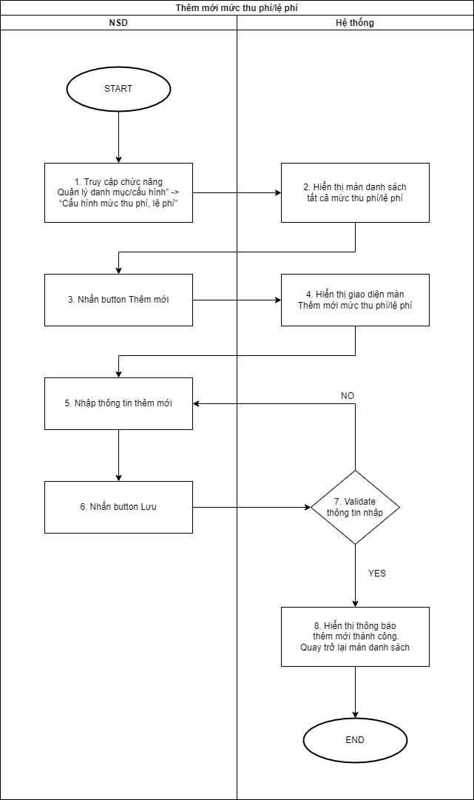

--		 Mô tả luồng xử lý

Bước

Mô tả

Bước 1

1. Truy cập chức năng

 Quản lý danh mục/cấu hình” ->  “Cấu hình mức thu phí, lệ phí"

Bước 2

Hệ thống hiển thị giao diện danh sách các mức thu phí/lệ phí

Bước 3

NSD nhấn nút "Thêm mới"

Bước 4

Hệ thống hiển thị màn giao diện nhập thông tin thêm mới mức thu phí/lệ phí.

Bước 5

NSD nhập các trường thông tin yêu cầu

Bước 6

Nhấn nút "Lưu".

Bước 7

Hệ thống kiểm tra tính hợp lệ thông tin nhập:

- Nếu hợp lệ, chuyển bước 8

- Nếu không hợp lệ, hệ thống đưa ra thông báo tại các trường nhập không hợp lệ. Quay lại bước 5.

Bước 8

Hệ thống thông báo thêm mới thành công và quay trở về màn danh sách ban đầu.

Kết thúc luồng.

Lưu ý:

+ Đối với các loại phí CCDV, TLM viễn thông công cộng, phí sử dụng mã số viễn thông, mức thu áp dụng theo tháng (kể từ tháng bắt đầu đến hết tháng kết thúc).

+ Đối với lệ phí phân bổ mã số, lệ phí cấp phép, phí thu một lần thì mức thu áp dụng tính theo ngày cụ thể. Ví dụ ngày bắt đầu là 28/03/2020 và ngày kết thúc là 31/12/2020 thì thời gian áp dụng được tính kể từ ngày 28/03/2020 đến hết ngày 31/12/2020.

Giao diện chức năng

--	Giao diện Thêm mới ban đầu

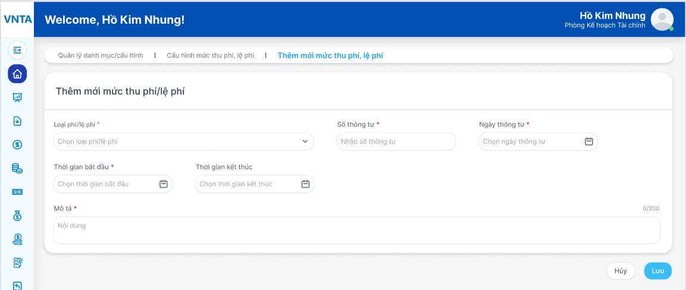

STT

Thông tin

Kiểu dữ liệu

Bắt buộc

Mô tả

Database

1

Giao diện Thêm mới ban đầu

Giao diện Thêm mới ban đầu

Giao diện Thêm mới ban đầu

Giao diện Thêm mới ban đầu

Giao diện Thêm mới ban đầu

1.1

Chọn loại phí/lệ phí

Combobox search

x

Chứa các loại phí, lệ phí bao gồm:

- Lệ phí cấp phép hoạt động viễn thông

- Lệ phí phân bổ mã, số viễn thông

- Phí sử dụng mã, số viễn thông

- Phí cung cấp dịch vụ viễn thông

- Phí thiết lập mạng viễn thông công cộng

- Phí thu một lần (nộp một lần cho toàn bộ thời hạn giấy phép)

Chọn loại phí/lệ phí nào thì hiển thị bảng mức thu tương ứng bên dưới.

1.2

Thời gian bắt đầu

Datepicker

x

Cho phép người dùng chọn hoặc nhập ngày bắt đầu áp dụng mức thu phí/lệ phí.

Thời gian bắt đầu <= Thời gian kết thúc.

Khoảng thời gian không được trùng với các bản ghi khác có cùng loại phí.

1.3

Thời gian kết thúc

Datepicker

x

Cho phép người dùng chọn hoặc nhập ngày kết thúc áp dụng mức thu phí/lệ phí.

Thời gian kết thúc >= Thời gian bắt đầu.

Khoảng thời gian không được trùng với khoảng thời gian của các bản ghi có cùng loại phí.

Trường hợp đây là lần cập nhật theo thông tư mới nhất (Thời gian bắt đầu mới nhất) thì ko bắt buộc chọn Thời gian kết thúc.

1.4

Số thông tư

Text

x

Cho phép nhập số thông tư ban hành.

1.5

Ngày thông tư

Datepicker

x

Định dạng DD/MM/YYYY.

1.6

Mô tả

Textbox

x

Cho phép người dùng nhập nội dung thông tin mô tả.

Max-leght: 200 ký tự.

1.7

Lưu

Button

--	Nhấn để thực hiện lưu thông tin thêm mới.

--	Validate thông tin:

--	+ Nếu thời gian áp dụng trùng với bản ghi khác báo: “Mức thu phí/lệ phí trong thời gian này đã tồn tại. Vui lòng chọn lại thời gian.”

--	+ Nếu chưa nhập đủ thông tin bắt buộc báo lỗi “Vui lòng thêm đầy đủ các trường thông tin”

+ Nếu thành công báo “Thêm mới thông tin thành công”.

1.8

Hủy

Button

Nhấn button Hủy => Hệ thống hiển thị pop-up Xác nhận Hủy.

--	Giao diện Xác nhận Hủy

Tham khảo các mô tả tương tự trước.

--	Giao diện Thêm mới mức thu phí Thiết lập mạng viễn thông công cộng

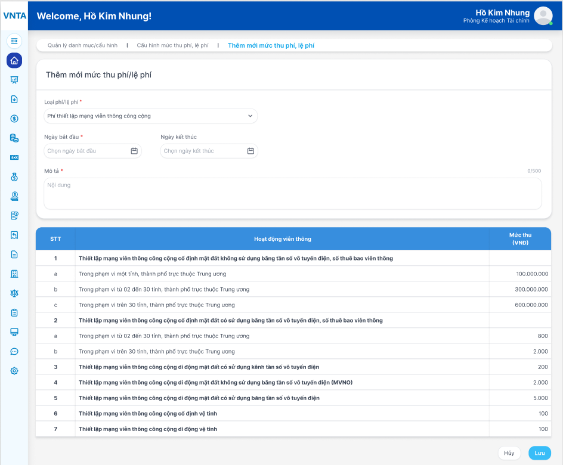

STT

Thông tin

Kiểu dữ liệu

Bắt buộc

Mô tả

Database

Bảng mức thu Phí Thiết lập mạng viễn thông công cộng

Bảng mức thu Phí Thiết lập mạng viễn thông công cộng

Bảng mức thu Phí Thiết lập mạng viễn thông công cộng

Bảng mức thu Phí Thiết lập mạng viễn thông công cộng

Bảng mức thu Phí Thiết lập mạng viễn thông công cộng

Bảng mức thu Phí Thiết lập mạng viễn thông công cộng

1

STT

Text

Hiển thị số thứ tự

2

Hoạt động viễn thông

Text

Danh sách mặc định, bao gồm:

1. Thiết lập mạng viễn thông công cộng cố định mặt đất không sử dụng băng tần số vô tuyến điện, số thuê bao viễn thông

a. Trong phạm vi một tỉnh, thành phố trực thuộc Trung ương

b. Trong phạm vi từ 02 đến 30 tỉnh, thành phố trực thuộc Trung ương

c. Trong phạm vi trên 30 tỉnh, thành phố trực thuộc Trung ương

2. Thiết lập mạng viễn thông công cộng cố định mặt đất có sử dụng băng tần số vô tuyến điện, số thuê bao viễn thông

a. Trong phạm vi từ 02 đến 30 tỉnh, thành phố trực thuộc Trung ương

b. Trong phạm vi trên 30 tỉnh, thành phố trực thuộc Trung ương

3. Thiết lập mạng viễn thông công cộng di động mặt đất có sử dụng kênh tần số vô tuyến điện

4. Thiết lập mạng viễn thông công cộng di động mặt đất không sử dụng băng tần số vô tuyến điện (MVNO)

5. Thiết lập mạng viễn thông công cộng di động mặt đất có sử dụng băng tần số vô tuyến điện

6. Thiết lập mạng viễn thông công cộng cố định vệ tinh

7. Thiết lập mạng viễn thông công cộng di động vệ tinh

3

Mức thu (VNĐ)

Number

x

- Nhập thông tin mức thu tương ứng.

- Chữ số đầu >= 1.

- Khi nhập tự động phân cách hàng nghìn bằng dấu “.”.

--	- Bắt buộc nhập đủ tất cả mức thu.

--	Giao diện Thêm mới mức thu phí cung cấp dịch vụ viễn thông

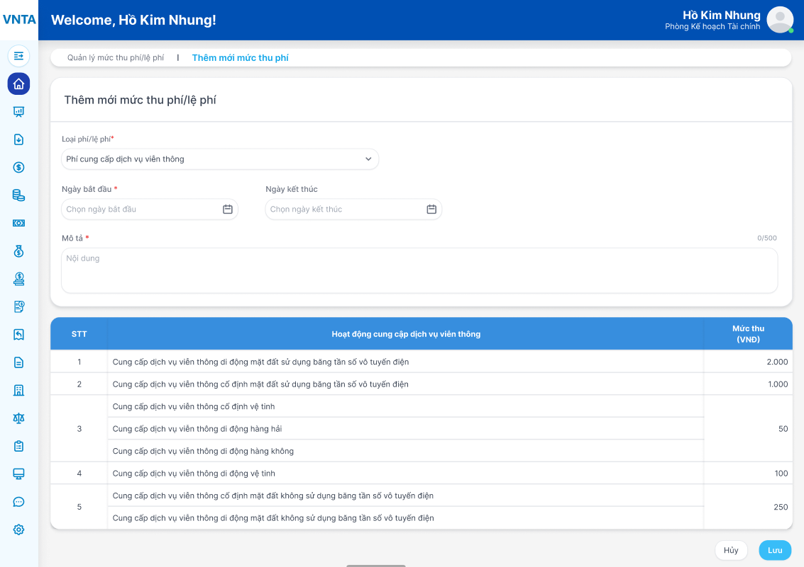

STT

Thông tin

Kiểu dữ liệu

Bắt buộc

Mô tả

Database

Bảng mức thu Phí cung cấp dịch vụ viễn thông

Bảng mức thu Phí cung cấp dịch vụ viễn thông

Bảng mức thu Phí cung cấp dịch vụ viễn thông

Bảng mức thu Phí cung cấp dịch vụ viễn thông

Bảng mức thu Phí cung cấp dịch vụ viễn thông

Bảng mức thu Phí cung cấp dịch vụ viễn thông

1

STT

Text

Hiển thị số thứ tự

2

Hoạt động cung cấp dịch vụ viễn thông

Text

Hiển thị danh sách mặc định, bao gồm:

+ Cung cấp dịch vụ viễn thông di động mặt đất sử dụng băng tần số vô tuyến điện

+ Cung cấp dịch vụ viễn thông cố định mặt đất sử dụng băng tần số vô tuyến điện

+ Cung cấp dịch vụ viễn thông cố định vệ tinh

+ Cung cấp dịch vụ viễn thông di động hàng không

+ Cung cấp dịch vụ viễn thông di động hàng hải

+ Cung cấp dịch vụ viễn thông di động vệ tinh

+ Cung cấp dịch vụ viễn thông cố định mặt đất không sử dụng băng tần số vô tuyến điện

+ Cung cấp dịch vụ viễn thông di động mặt đất không sử dụng băng tần số vô tuyến điện

3

Mức thu (VNĐ)

number

x

- Nhập thông tin mức thu tương ứng.

- Chữ số đầu >= 1.

- Khi nhập tự động phân cách hàng nghìn bằng dấu “.”.

- Bắt buộc nhập đủ tất cả mức thu.

--	Giao diện Thêm mới mức thu lệ phí cấp phép hoạt động viễn thông

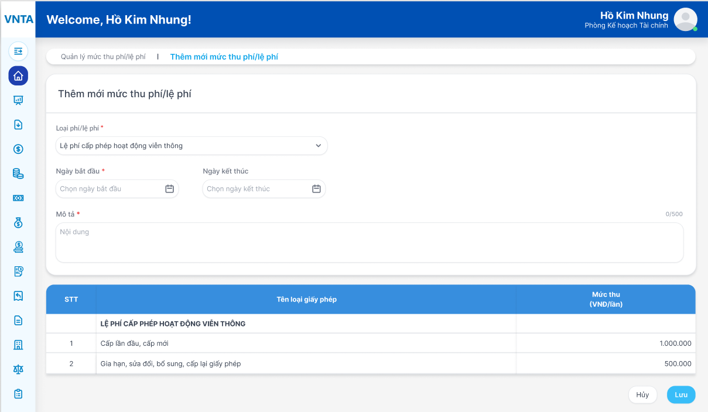

STT

Thông tin

Kiểu dữ liệu

Bắt buộc

Mô tả

Database

1

Bảng mức thu Lệ phí cấp phép hoạt động viễn thông

Bảng mức thu Lệ phí cấp phép hoạt động viễn thông

Bảng mức thu Lệ phí cấp phép hoạt động viễn thông

Bảng mức thu Lệ phí cấp phép hoạt động viễn thông

Bảng mức thu Lệ phí cấp phép hoạt động viễn thông

1

STT

Text

Hiển thị STT

2

Tên loại giấy phép

Text

Hiển thị mặc định danh sách gồm:

1. Cấp lần đầu, cấp mới:

2. Gia hạn, sửa đổi, bổ sung, cấp lại giấy phép tại điểm 1 nêu trên.

3

Mức thu (VNĐ/lần)

number

x

- Nhập thông tin mức thu tương ứng.

- Chữ số đầu >= 1.

- Khi nhập tự động phân cách hàng nghìn bằng dấu “.”.

- Bắt buộc nhập đủ tất cả mức thu.

--	Giao diện Thêm mới mức thu phí một lần

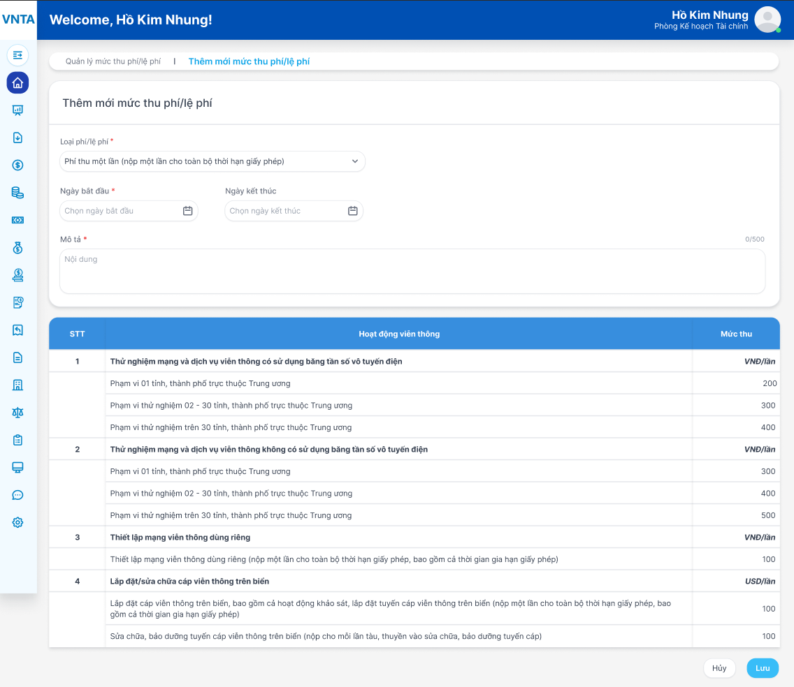

STT

Thông tin

Kiểu dữ liệu

Bắt buộc

Mô tả

Database

Bảng mức thu Phí một lần (nộp một lần cho toàn bộ thời hạn giấy phép)

Bảng mức thu Phí một lần (nộp một lần cho toàn bộ thời hạn giấy phép)

Bảng mức thu Phí một lần (nộp một lần cho toàn bộ thời hạn giấy phép)

Bảng mức thu Phí một lần (nộp một lần cho toàn bộ thời hạn giấy phép)

Bảng mức thu Phí một lần (nộp một lần cho toàn bộ thời hạn giấy phép)

Bảng mức thu Phí một lần (nộp một lần cho toàn bộ thời hạn giấy phép)

1

STT

Text

Hiển thị STT

2

 Hoạt động viễn thông

Text

Hiển thị danh sách mặc định gồm:

1. Thử nghiệm mạng và dịch vụ viễn thông có sử dụng băng tần số vô tuyến điện:

+ Phạm vi 01 tỉnh, thành phố trực thuộc Trung ương

+ Phạm vi thử nghiệm 02 - 30 tỉnh, thành phố trực thuộc Trung ương

+ Phạm vi thử nghiệm trên 30 tỉnh, thành phố trực thuộc Trung ương

2. Thử nghiệm mạng và dịch vụ viễn thông không có sử dụng băng tần số vô tuyến điện

+ Phạm vi 01 tỉnh, thành phố trực thuộc Trung ương

+ Phạm vi thử nghiệm 02 - 30 tỉnh, thành phố trực thuộc Trung ương

+ Phạm vi thử nghiệm trên 30 tỉnh, thành phố trực thuộc Trung ương

3. Thiết lập mạng viễn thông dùng riêng

+Thiết lập mạng viễn thông dùng riêng (nộp một lần cho toàn bộ thời hạn giấy phép, bao gồm cả thời gian gia hạn giấy phép)

4. Lắp đặt/sửa chữa cáp viễn thông trên biển

+ Lắp đặt cáp viễn thông trên biển, bao gồm cả hoạt động khảo sát, lắp đặt tuyến cáp viễn thông trên biển (nộp một lần cho toàn bộ thời hạn giấy phép, bao gồm cả thời gian gia hạn giấy phép)

+ Sửa chữa, bảo dưỡng tuyến cáp viễn thông trên biển (nộp cho mỗi lần tàu, thuyền vào sửa chữa, bảo dưỡng tuyến cáp)

2.3

Mức thu

number

x

- Nhập thông tin mức thu tương ứng.

- Bắt buộc nhập đủ tất cả mức thu.

- Đối với phí thu bằng = VNĐ:

+ Chữ số đầu >= 1.

+ Khi nhập tự động phân cách hàng nghìn bằng dấu “.”.

- Riêng Phí cáp biển thì đơn vị tính là USD/lần, khi nhập tự động phân cách hàng nghìn bằng dấu “.”, phân cách phần thập phân bằng dấu “,”.

--	Giao diện Thêm mới mức thu Lệ phí phân bổ mã, số viễn thông

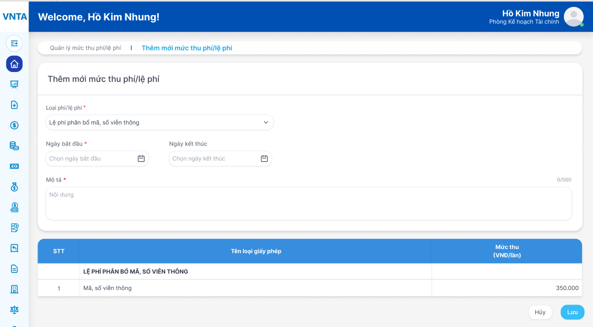

STT

Thông tin

Kiểu dữ liệu

Bắt buộc

Mô tả

Database

Bảng mức thu lệ phí phân bổ mã, số viễn thông

Bảng mức thu lệ phí phân bổ mã, số viễn thông

Bảng mức thu lệ phí phân bổ mã, số viễn thông

Bảng mức thu lệ phí phân bổ mã, số viễn thông

Bảng mức thu lệ phí phân bổ mã, số viễn thông

Bảng mức thu lệ phí phân bổ mã, số viễn thông

1

STT

Text

Hiển thị STT

2

Hoạt động viễn thông

Text

Hiển thị danh sách đối tượng chịu phí bao gồm:

- Lệ phí phân bổ mã, số viễn thông

1. Mã, số viễn thông

3

Mức thu (VNĐ/lần)

number

x

- Nhập thông tin mức thu tương ứng.

- Chữ số đầu >= 1.

- Khi nhập tự động phân cách hàng nghìn bằng dấu “.”.

- Bắt buộc nhập đủ tất cả mức thu.

--	Giao diện Thêm mới mức thu lệ phí phân bổ/phí sử dụng mã, số viễn thông

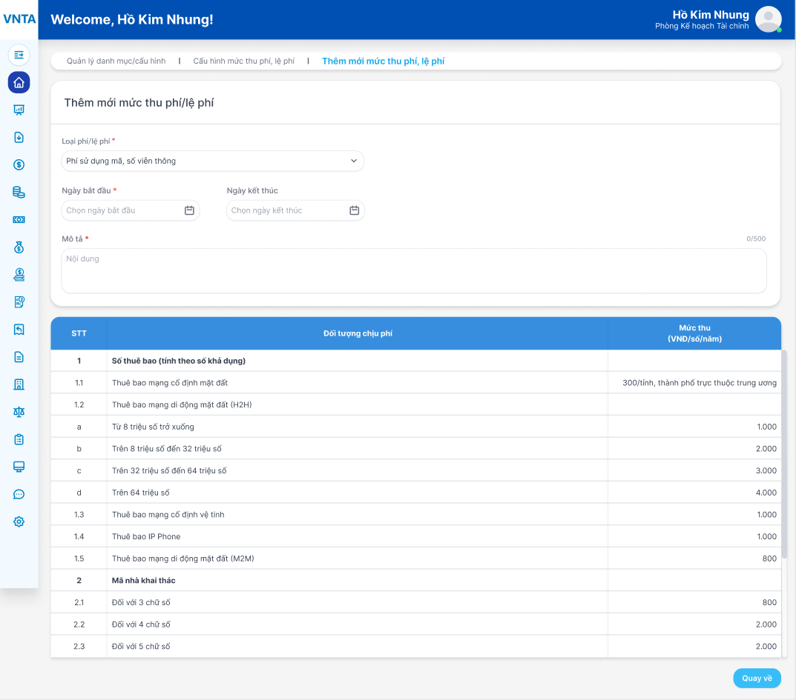

STT

Thông tin

Kiểu dữ liệu

Bắt buộc

Mô tả

Database

1

Bảng mức thu phí sử dụng mã, số viễn thông

Bảng mức thu phí sử dụng mã, số viễn thông

Bảng mức thu phí sử dụng mã, số viễn thông

Bảng mức thu phí sử dụng mã, số viễn thông

Bảng mức thu phí sử dụng mã, số viễn thông

1

STT

Text

Hiển thị STT

2

Đối tượng chịu phí

Text

Hiển thị mặc định danh sách gồm:

1. Số thuê bao (tính theo số khả dụng)

1.1. Thuê bao mạng cố định mặt đất

1.2. Thuê bao mạng di động mặt đất

a. Từ 8 triệu số trở xuống

b. Trên 8 triệu số đến 32 triệu số

c. Trên 32 triệu số đến 64 triệu số

d. Trên 64 triệu số

1.3. Thuê bao mạng cố định vệ tinh

1.4 Thuê bao IP Phone

1.5 Thuê bao mạng di động mặt đất (M2M)

2. Mã nhà khai thác

2.1 Đối với 3 chữ số

2.2 Đối với 4 chữ số

2.3 Đối với 5 chữ số

3. Mã mạng di động

3.1 Đối với 2 chữ số

3.2 Đối với 3 chữ số

4. Mã dịch vụ

4.1 Đối với 3 chữ số

4.2 Đối với 4 chữ số

4.3 Đối với 5 chữ số

5. Số dịch vụ nội vùng

5.1 Dịch vụ nội vùng 4 chữ số

5.2 Dịch vụ nội vùng 5 chữ số

5.3 Dịch vụ nội vùng từ 6 chữ số trở lên

6. Số dịch vụ toàn quốc

6.1. Dịch vụ toàn quốc 4 chữ số

6.2 Dịch vụ toàn quốc 5 chữ số

6.3 Dịch vụ toàn quốc 6 chữ số

6.4 Dịch vụ toàn quốc 7 chữ số

6.5 Dịch vụ toàn quốc từ 8 chữ số trở lên

7. Số dịch vụ tin nhắn ngắn (SMS)

7.1 Dịch vụ nhắn tin ngắn 3 chữ số

7.2 Dịch vụ nhắn tin ngắn 4 chữ số

7.3 Dịch vụ nhắn tin ngắn 5 chữ số

7.4 Dịch vụ nhắn tin ngắn 6 chữ số

8. Mã nhận dạng mạng số liệu (DNIC)

9. Mã điểm báo hiệu

9.1 Mã điểm báo hiệu quốc tế

9.2 Mã điểm báo hiệu quốc gia

10. Mã nhận dạng mạng di động (MNC)

3

Mức thu (VNĐ/số/năm)

number

x

- Nhập thông tin mức thu tương ứng.

- Chữ số đầu >= 1.

- Khi nhập tự động phân cách hàng nghìn bằng dấu “.”.

- Bắt buộc nhập đủ tất cả mức thu.

 Xem chi tiết mức thu phí/lệ phí

Luồng chức năng

--	Thông tin chung

Tên chức năng

Xem chi tiết mức thu phí/lệ phí (của các loại phí/lệ phí)

Mô tả

Chức năng cho phép xem chi tiết mức thu phí/lệ phí của từng loại phí/lệ phí.

Tác nhân

Lãnh đạo, Cán bộ Phòng KHTC, Phòng CPTN, Phòng Kinh tế

Điều kiện trước

Đăng nhập vào hệ thống, có phân quyền chức năng

Điều kiện sau

Xem chi tiết mức thu phí/lệ phí của từng loại phí/lệ phí

Ngoại lệ

N/A

Các yêu cầu đặc biệt

N/A

--	Luồng chức năng

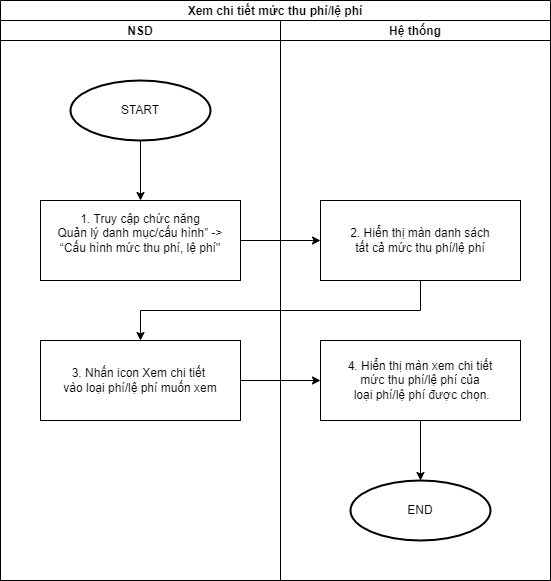

--	Mô tả luồng xử lý

Bước

Mô tả

Bước 1

NSD truy cập chức năng “Quản lý mức thu phí/lệ phí”.

Bước 2

Hệ thống hiển thị giao diện danh sách tất cả mức thu phí/lệ phí tương ứng với từng loại phí/lệ phí.

Sắp xếp thứ tự các mức thu phí/lệ phí tương ứng với từng loại phí/lệ phí theo thời gian cập nhật.

Mức thu phí/lệ phí tương ứng với từng loại phí/lệ phí gồm:

- Lệ phí cấp phép hoạt động viễn thông

- Lệ phí phân bổ mã, số viễn thông

- Phí sử dụng mã, số viễn thông

- Phí cung cấp dịch vụ viễn thông

- Phí thiết lập mạng viễn thông công cộng

- Phí thu một lần (nộp một lần cho toàn bộ thời hạn giấy phép)

Bước 3

NSD nhấn vào icon xem chi tiết mức thu phí/lệ phí của loại phí/lệ phí muốn xem.

Bước 4

Hệ thống hiển thị màn xem chi tiết nội dung thông tin mức thu phí/lệ phí của loại phí/lệ phí.

Kết thúc luồng.

Giao diện chức năng

--		Giao diện Xem chi tiết mức thu phí/ lệ phí

	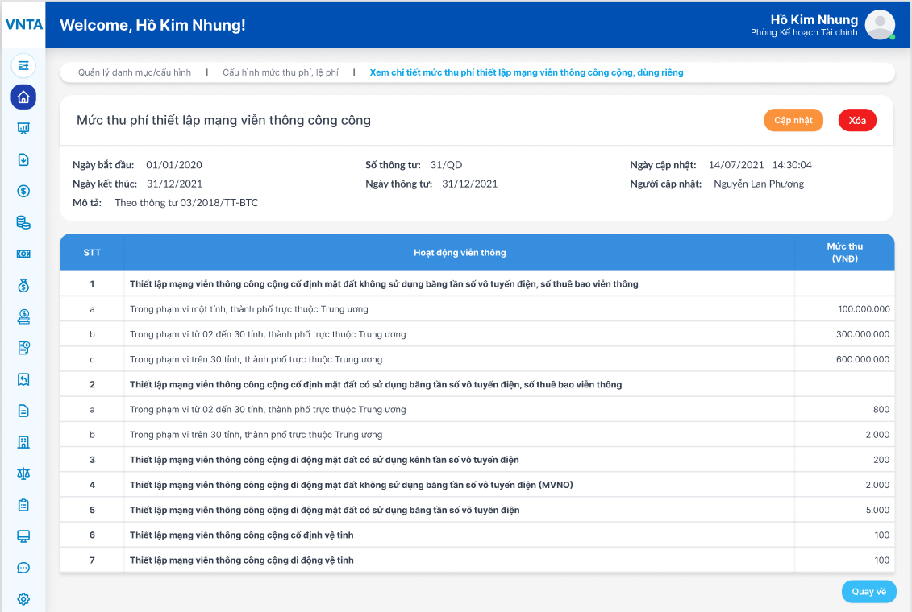

STT

Thông tin

Kiểu dữ liệu

Bắt buộc

Mô tả

Database

1

Mức thu….

Text

Hiển thị tên phí đang xem chi tiết, định dạng:

“Mức thu + Tên phí”

1.1

Thời gian bắt đầu

Date

Hiển thị thông tin ngày bắt đầu áp dụng mức thu phí.

Đối với Lệ phí cấp phép, Lệ phí phân bổ, Phí thu 1 lần thì định dạng DD/MM/YYYY.

Đối với phí CCDV, TLM công cộng, Phí kho số thì định dạng MM/YYYY.

1.2

Thời gian kết thúc

Date

Hiển thị thông tin ngày kết thúc áp dụng mức thu.

Đối với Lệ phí cấp phép, Lệ phí phân bổ, Phí thu 1 lần thì định dạng DD/MM/YYYY.

Đối với phí CCDV, TLM công cộng, Phí kho số thì định dạng MM/YYYY.

1.3

Số thông tư

Text

Hiển thị số thông tư ban hành.

1.4

Ngày thông tư

Date

Định dạng DD/MM/YYYY.

1.5

Mô tả

Text

Hiển thị nội dung thông tin mô tả.

1.6

Ngày cập nhật

Date

Hiển thị thông tin ngày cập nhật mức thu phí áp dụng gần nhất theo định dạng DD/MM/YYYY.

1.7

Người cập nhật

Text

Hiển thị họ tên người cập nhật mức thu phí Thiết lập mạng viễn thông công cộng, dùng riêng gần nhất.

1.8

Cập nhật

Button

Nhấn button=>Hệ thống hiển thị giao diện Chỉnh sửa mức thu phí Thiết lập mạng viễn thông công cộng, dùng riêng.

1.9

Xóa

Button

Nhấn button => Hệ thống hiển thị giao diện pop-up Xác nhận xóa mức thu phí//lệ phí.

Tham khảo lại mô tả chức năng “Xem danh sách các mức thu phí, lệ phí”.

2

Grid danh sách

Tham khảo tương tự Giao diện Grid trong các màn Thêm mới mức thu tương ứng với từng loại phí/lệ phí

Grid danh sách

Tham khảo tương tự Giao diện Grid trong các màn Thêm mới mức thu tương ứng với từng loại phí/lệ phí

Grid danh sách

Tham khảo tương tự Giao diện Grid trong các màn Thêm mới mức thu tương ứng với từng loại phí/lệ phí

Grid danh sách

Tham khảo tương tự Giao diện Grid trong các màn Thêm mới mức thu tương ứng với từng loại phí/lệ phí

Grid danh sách

Tham khảo tương tự Giao diện Grid trong các màn Thêm mới mức thu tương ứng với từng loại phí/lệ phí

--	Giao diện popup xác nhận Xóa

Cập nhật mức thu phí/lệ phí

Luồng chức năng

--	Thông tin chung

Tên chức năng

Cập nhật mức thu phí/lệ phí (của các loại phí/lệ phí)

Mô tả

Chức năng cho phép thay đổi chỉnh sửa thông tin mức thu của từng phí/lệ phí.

Tác nhân

Lãnh đạo, Cán bộ Phòng KHTC, Phòng CPTN, Phòng Kinh tế

Điều kiện trước

Đăng nhập vào hệ thống, có phân quyền chức năng

Điều kiện sau

Chỉnh sửa thành công mức thu phí/lệ phí.

Ngoại lệ

N/A

Các yêu cầu đặc biệt

N/A

--	Luồng chức năng

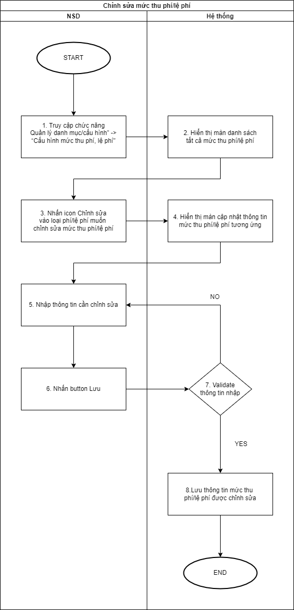

--	Mô tả luồng xử lý

Bước

Mô tả

Bước 1

NSD truy cập chức năng “Quản lý danh mục/cấu hình” -> “Cấu hình mức thu phí/lệ phí”.

Bước 2

Hệ thống hiển thị giao diện danh sách tất cả mức thu phí/lệ phí tương ứng với từng loại phí/lệ phí.

Bước 3

NSD nhấn vào icon xem chi tiết mức thu phí/lệ phí của loại phí/lệ phí muốn xem.

Bước 4

Hiển thị màn cập nhật mức thu phí/lệ phí tương ứng

Bước 5

Nhập thông tin cần chỉnh sửa

Bước 6

Nhấn button Lưu

Bước 7

Validate thông tin nhập

Bước 8

Lưu thông tin mức thu phí/lệ phí được chỉnh sửa

Kết thúc luồng.

Giao diện chức năng

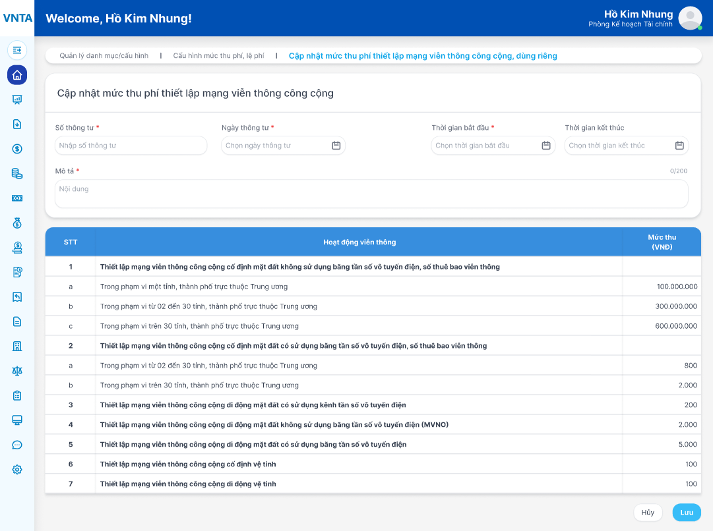

STT

Thông tin

Kiểu dữ liệu

Bắt buộc

Mô tả

Database

1

Cập nhật mức thu…

Text

Hiển thị tên phí đang xem chi tiết, định dạng:

“Cập nhật mức thu + Tên phí”

1.1

Thời gian bắt đầu

Date

Tương tự như mô tả chức năng Thêm mới.

1.2

Thời gian kết thúc

Date

Tương tự như mô tả chức năng Thêm mới.

1.3

Số thông tư

Tương tự như mô tả chức năng Thêm mới.

1.6

Ngày thông tư

Tương tự như mô tả chức năng Thêm mới.

1.7

Mô tả

Text

Tương tự như mô tả chức năng Thêm mới.

1.8

Lưu

Button

Ban đầu, khi NSD chưa có thao tác thay đổi thông tin nào thì disable nút Lưu.

Khi NSD có thao tác chỉnh sửa thì hệ thống kiểm tra tính hợp lệ thông tin người dùng nhập: Nếu hợp lệ, hệ thống thông báo “Lưu thông tin thành công” và load lại màn trước đó đang xem.

- Nếu không hợp lệ, hệ thống đưa ra thông báo tại các trường nhập không hợp lệ.

1.9

Hủy

Button

Ban đầu, khi NSD chưa có thao tác thay đổi thông tin nào, nếu ấn nút Hủy thì quay lại màn trước đó người dùng đang xem.

Khi NSD có thao tác chỉnh sửa thì nhấn button Hủy => Hệ thống hiển thị giao diện pop-up Xác nhận hủy.

2

Grid danh sách

Tham khảo tương tự Giao diện Grid trong các màn Thêm mới mức thu tương ứng với từng loại phí/lệ phí

Grid danh sách

Tham khảo tương tự Giao diện Grid trong các màn Thêm mới mức thu tương ứng với từng loại phí/lệ phí

Grid danh sách

Tham khảo tương tự Giao diện Grid trong các màn Thêm mới mức thu tương ứng với từng loại phí/lệ phí

Grid danh sách

Tham khảo tương tự Giao diện Grid trong các màn Thêm mới mức thu tương ứng với từng loại phí/lệ phí

Grid danh sách

Tham khảo tương tự Giao diện Grid trong các màn Thêm mới mức thu tương ứng với từng loại phí/lệ phí

Quản trị hệ thống

Xem danh sách tài khoản người dùng

Luồng chức năng

--	Thông tin chung

Tên chức năng

Xem danh sách tài khoản người dùng

Mô tả

Chức năng cho phép xem tất cả danh sách tài khoản người dùng trên hệ thống.

Tác nhân

Lãnh đạo, Cán bộ Phòng KHTC, Phòng CPTN, Phòng Kinh tế.

Điều kiện trước

Đăng nhập vào hệ thống, có phân quyền chức năng.

Điều kiện sau

Xem, tìm kiếm được danh sách.

Ngoại lệ

N/A

Các yêu cầu đặc biệt

N/A

Luồng chức năng

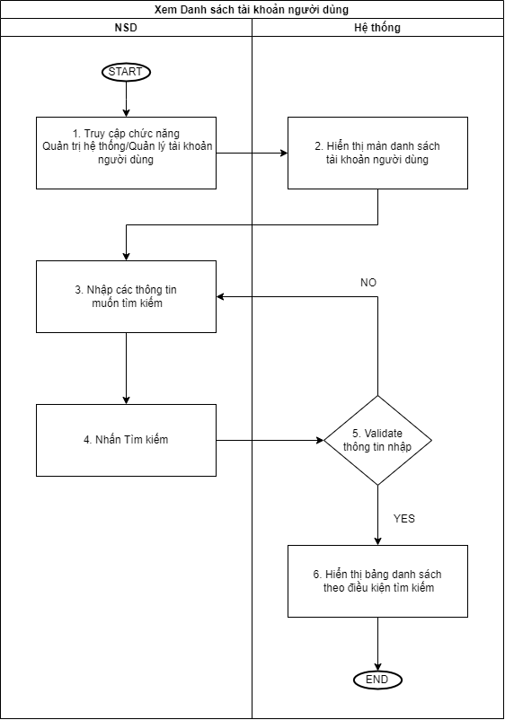

Mô tả luồng xử lý

Bước

Mô tả

Bước 1

NSD truy cập chức năng “Quản trị hệ thống”/”Quản lý tài khoản người dùng”

Bước 2

Hiển thị màn danh sách tài khoản người dùng.

Sắp xếp thứ tự các bản ghi theo thời gian cập nhật, cập nhật gần đây nhất đẩy lên đầu danh sách.

Bước 3

NSD nhập các trường thông tin muốn tìm kiếm.

Bước 4

Nhấn [Tìm kiếm].

Bước 5

Hệ thống validate thông tin. Nếu không có kết quả thì hệ thống đưa thông báo “Thông tin tài khoản không tồn tại.”.

Nếu có kết quả thì chuyển bước 6.

Bước 6

Hệ thống hiển thị danh sách theo điều kiện tìm kiếm.

Kết thúc luồng.

Giao diện chức năng

Giao diện tìm kiếm cơ bản

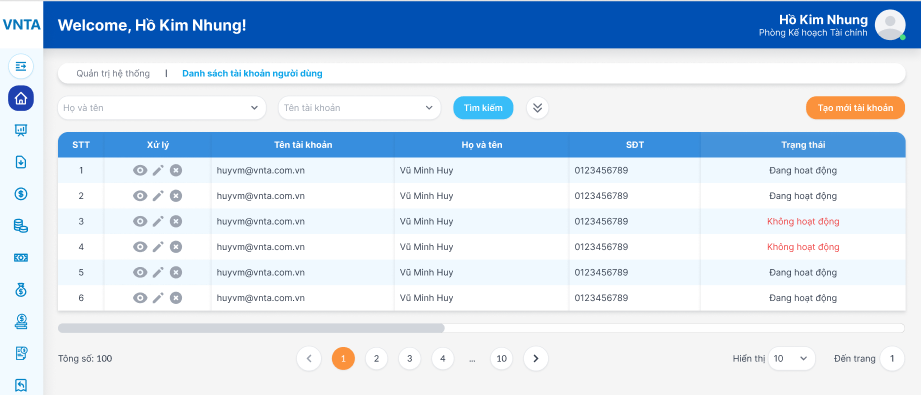

--	Khung giao diện tìm kiếm nâng cao

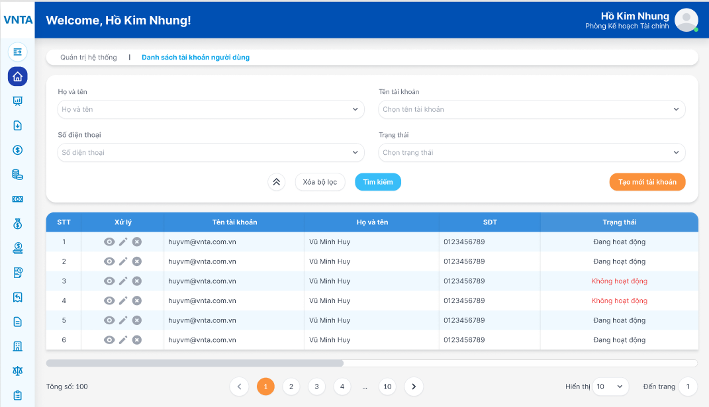

STT

Thông tin

Kiểu dữ liệu

Bắt buộc

Mô tả

Database

1

Tìm kiếm cơ bản

Tìm kiếm cơ bản

Tìm kiếm cơ bản

Tìm kiếm cơ bản

Tìm kiếm cơ bản

1.1

Họ và tên

Combobox search

- Autocomplete.

- Mặc định ko chọn là Chọn tất cả.

- Cho phép chọn 1 hoặc nhiều họ và tên.

1.2

Tên tài khoản

Combobox search

- Autocomplete.

- Mặc định ko chọn là Chọn tất cả.

- Cho phép chọn 1 hoặc nhiều tên tài khoản.

2

Tìm kiếm nâng cao

Tìm kiếm nâng cao

Tìm kiếm nâng cao

Tìm kiếm nâng cao

Tìm kiếm nâng cao

2.1

STT

Text

STT tăng dần

2.2

Họ và tên

Combobox search

- Autocomplete.

- Mặc định ko chọn là Chọn tất cả.

- Cho phép chọn 1 hoặc nhiều họ và tên.

2.3

Tên tài khoản

Combobox search

- Autocomplete.

- Mặc định ko chọn là Chọn tất cả.

- Cho phép chọn 1 hoặc nhiều tên tài khoản.

2.4

Số điện thoại

Combobox search

- Autocomplete.

- Mặc định ko chọn là Chọn tất cả.

- Cho phép chọn 1 hoặc nhiều

2.5

Trạng thái

Combobox

Gồm 2 trạng thái: Đang hoạt động và Không hoạt động

3

Tìm kiếm

Button

Nhấn để tìm kiếm theo các trường thông tin.

Hiển thị danh sách sắp xếp theo thời gian cập nhật từ gần nhất đến xa nhất.

4

Tạo mới tài khoản

Button

Nhấn vào để tạo mới tài khoản, sẽ gồm 2 lựa chọn:

+ Tài khoản mới

+ Tài khoản đồng bộ

5

Grid

Grid

Grid

Grid

Grid

5.1

STT

Text

Hiển thị STT

5.2

Xử lý

button

Gồm các icon Xem chi tiết, Chỉnh sửa, Xóa.

Đối với các tài khoản đã có thao tác thay đổi dữ liệu hệ thống, thao tác đã được hệ thống lưu vết thì không cho phép xóa tài khoản (xóa icon “Xóa”)

5.3

Họ và tên

Text

Hiển thị họ và tên

5.4

Tên tài khoản

Text

Hiển thị tên tài khoản (dạng email đầy đủ)

5.5

SĐT

Number

Hiển thị SĐT. Nếu ko có thì để trống.

5.6

Trạng thái

Text

Hiển thị trạng thái

--

Tạo mới tài khoản người dùng

Luồng chức năng

--	Thông tin chung

Tên chức năng

Tạo mới tài khoản người dùng

Mô tả

Chức năng cho phép tạo mới tài khoản người dùng

Tác nhân

Admin

Điều kiện trước

Đăng nhập vào hệ thống, có phân quyền chức năng

Điều kiện sau

Tạo mới thành công tài khoản người dùng

Ngoại lệ

N/A

Các yêu cầu đặc biệt

N/A

--	Luồng chức năng

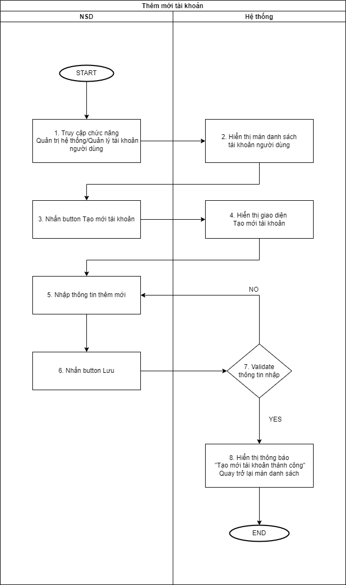

--	Mô tả luồng xử lý

Bước

Mô tả

Bước 1

NSD truy cập chức năng “Quản trị hệ thống”/”Quản lý tài khoản người dùng”

Bước 2

Hiển thị màn danh sách tài khoản người dùng.

Bước 3

Nhấn button Tạo mới tài khoản

Bước 4

Hiển thị giao diện Tạo mới tài khoản

Bước 5

Nhập thông tin thêm mới

Bước 6

Nhấn button Lưu

Bước 7

Validate thông tin nhập. Check tên tài khoản không được trùng trên hệ thống.

Nếu lỗi thì hệ thống thông báo tại các trường lỗi, quay trở lại bước 5.

Nếu thông tin đã đúng và đầy đủ thì chuyển qua bước 8.

Bước 8

Hiển thị thông báo "Tạo mới tài khoản thành công".

Quay trở lại màn danh sách.

Kết thúc luồng.

Giao diện chức năng

Giao diện tạo tài khoản mới

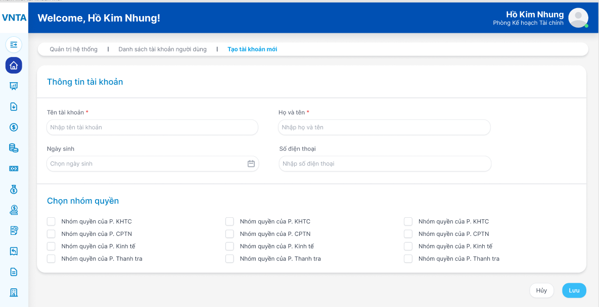

STT

Thông tin

Kiểu dữ liệu

Bắt buộc

Mô tả

Database

1

Họ và tên

Combobox search

x

- Autocomplete.

- Mặc định ko chọn là Chọn tất cả.

- Cho phép chọn 1 hoặc nhiều họ và tên.

2

Tên tài khoản

Combobox search

x

- Autocomplete.

- Mặc định ko chọn là Chọn tất cả.

- Cho phép chọn 1 hoặc nhiều tên tài khoản.

3

Ngày sinh

datepicker

Chọn ngày sinh theo định dạng DD/MM/YYYY

4

Số điện thoại

Textbox

Nhập số điện thoại di động

5

Chọn nhóm quyền

Checkbox

x

Cho phép chọn 1/nhiều các nhóm quyền.

Nhóm quyền đồng bộ từ Danh sách nhóm quyền người dùng đã tự thêm.

6

Lưu

button

Nhấn để lưu thông tin tài khoản.

7

Hủy

button

Nhấn để hủy bỏ thao tác tạo mới tài khoản. Hiện popup xác nhận Hủy.

Giao diện xác nhận Hủy

--	

--	Tham khảo giao diện Xác nhận Hủy – Mục 17.2 Thêm mới Chi cục Thuế

Xem thông tin tài khoản người dùng

Luồng chức năng

--	Thông tin chung

Tên chức năng

Xem thông tin chi tiết của tài khoản người dùng

Mô tả

Chức năng cho phép xem thông tin tài khoản

Tác nhân

Admin

Điều kiện trước

Đăng nhập vào hệ thống, có phân quyền chức năng

Điều kiện sau

Xem thông tin chi tiết của tài khoản người dùng

Ngoại lệ

N/A

Các yêu cầu đặc biệt

N/A

--	Luồng chức năng

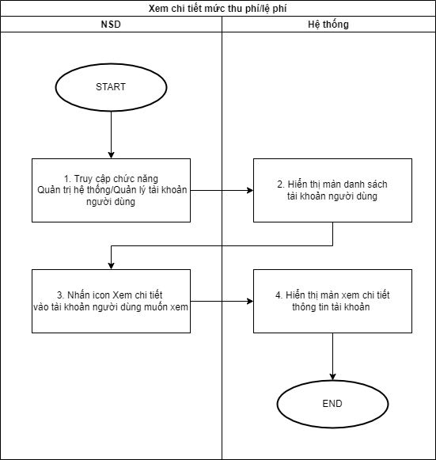

--	Mô tả luồng xử lý

Bước

Mô tả

Bước 1

NSD truy cập chức năng “Quản trị hệ thống”/”Quản lý tài khoản người dùng”

Bước 2

Hiển thị màn danh sách tài khoản người dùng.

Bước 3

Nhấn icon Xem chi tiết vào tài khoản người dùng muốn xem

Bước 4

Hiển thị màn xem chi tiết thông tin tài khoản. Kết thúc luồng.

Giao diện chức năng

Giao diện xem chi tiết thông tin tài khoản (đang hoạt động) (đã có thao tác xuất/chốt/thêm/sửa/xóa dữ liệu => không có nút Xóa

--	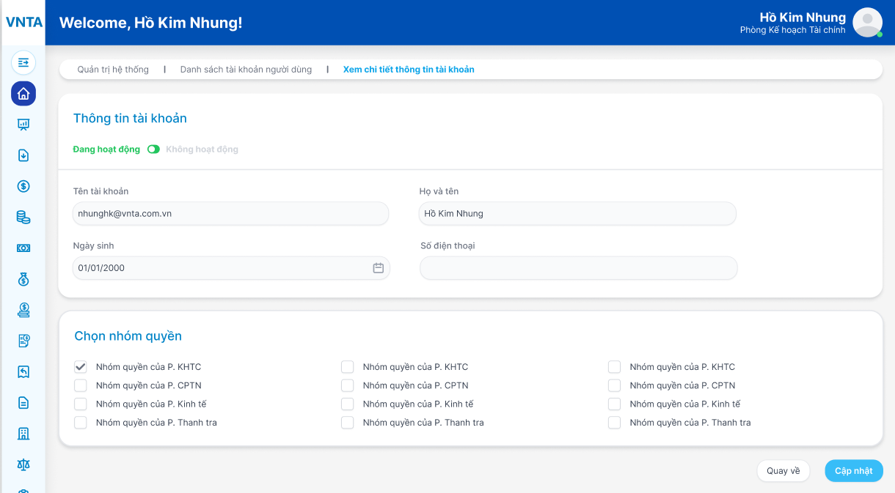

Giao diện xem chi tiết thông tin tài khoản không hoạt động

--	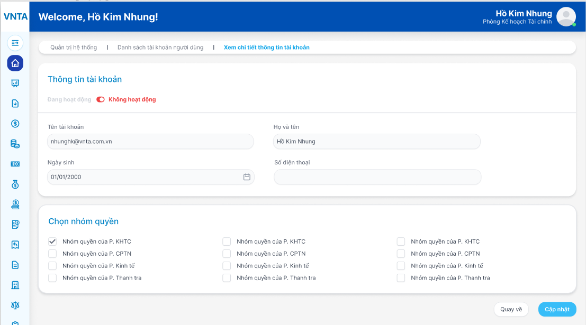

Giao diện xem chi tiết thông tin tài khoản (đang hoạt động) (không có thao tác xuất/chốt/thêm/sửa/xóa dữ liệu => Có nút Xóa

--	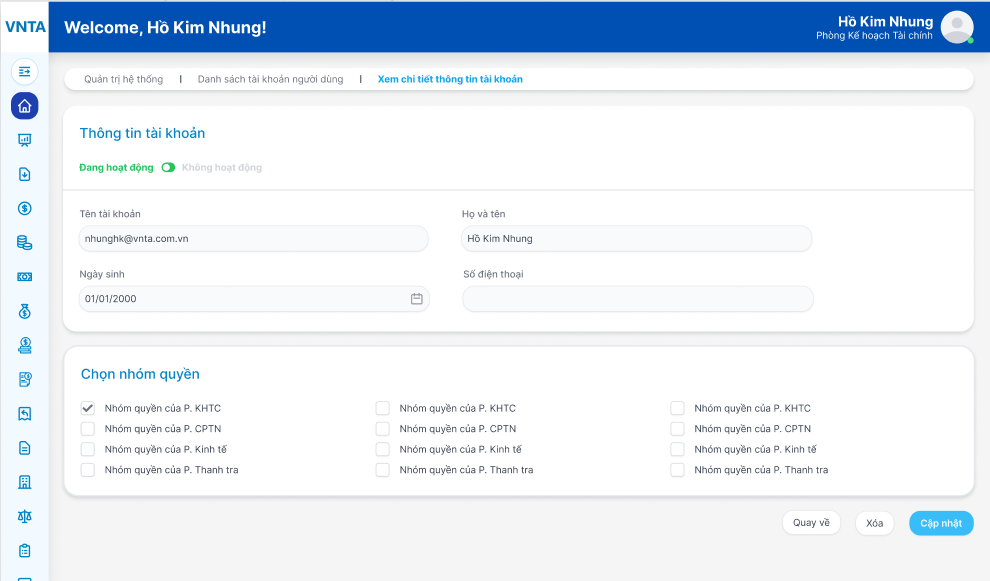

--	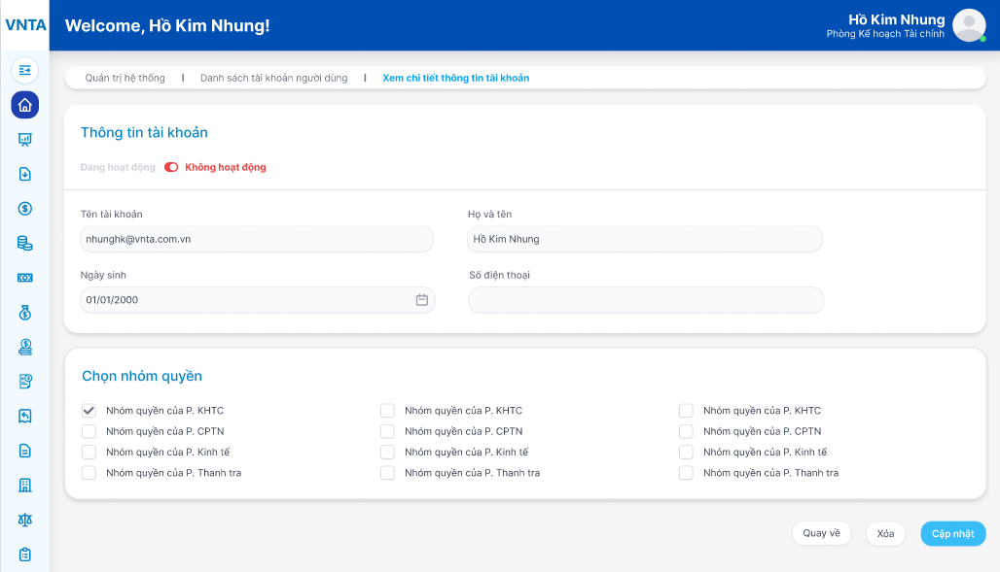

STT

Thông tin

Kiểu dữ liệu

Bắt buộc

Mô tả

Database

1

Họ và tên

Text

Hiển thị họ và tên.

2

Tên tài khoản

Text

Hiển thị tên tài khoản.

3

Ngày sinh

date

Hiển thị ngày sinh theo định dạng DD/MM/YYYY.

4

Số điện thoại

number

Hiển thị số điện thoại di động

5

Chọn nhóm quyền

Hiển thị các nhóm quyền. Không cho phép chỉnh sửa tích chọn lại nhóm quyền.

6

Trạng thái

button

Nhấn vào button để chuyển từ trạng thái Đang hoạt động (hiển thị màu xanh lá cây)sang Không hoạt động (hiển thị màu đỏ) và ngược lại.

8

Cập nhật

button

Nhấn để hiển thị màn chỉnh sửa thông tin tài khoản.

9

Xóa

button

Nhấn button Xóa hiển thị popup xác nhận Xóa.

Đối với các tài khoản đã có thao tác thay đổi dữ liệu hệ thống, thao tác đã được hệ thống lưu vết thì không cho phép xóa tài khoản (xóa button “Xóa”).

10

Quay về

button

Nhấn để quay về màn danh sách đang tìm kiếm.

Popup xác nhận Xóa

--	

STT

Thông tin

Kiểu dữ liệu

Bắt buộc

Mô tả

Database

1

Xóa

Button

Nhấn để tiến hành Xóa tài khoản.

2

Quay về

Button

Nhấn để quay về màn danh sách đang tìm kiếm.

--

Chỉnh sửa tài khoản người dùng

Luồng chức năng

--	Thông tin chung

Tên chức năng

Chỉnh sửa tài khoản người dùng

Mô tả

Chức năng cho phép chỉnh sửa thông tin tài khoản người dùng

Tác nhân

Admin

Điều kiện trước

Đăng nhập vào hệ thống, có phân quyền chức năng

Điều kiện sau

Chỉnh sửa và lưu thành công thông tin tài khoản người dùng

Ngoại lệ

N/A

Các yêu cầu đặc biệt

N/A

--	Luồng chức năng

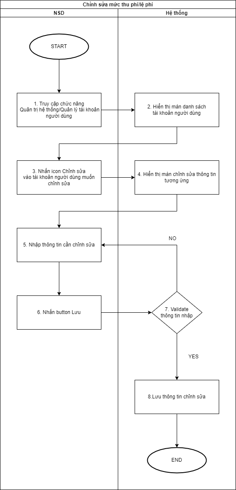

--	Mô tả luồng xử lý

Bước

Mô tả

Bước 1

NSD truy cập chức năng “Quản trị hệ thống”/”Quản lý tài khoản người dùng”

Bước 2

Hiển thị màn danh sách tài khoản người dùng.

Bước 3

Nhấn icon Chỉnh sửa vào tài khoản người dùng muốn chỉnh sửa

Bước 4

Hiển thị giao diện chỉnh sửa thông tin tương ứng

Bước 5

Nhập thông tin cần chỉnh sửa

Bước 6

Nhấn button Lưu

Bước 7

Validate thông tin nhập. Check các trường yêu cầu. Check tên tài khoản không được trùng trên hệ thống.

Nếu lỗi thì hệ thống thông báo tại các trường lỗi, quay trở lại bước 5.

Nếu thông tin đã đúng và đầy đủ thì chuyển qua bước 8.

Bước 8

Hiển thị thông báo "Lưu thông tin thành công".

Quay trở lại màn danh sách đang tìm kiếm.

Kết thúc luồng.

Giao diện chức năng

Giao diện chỉnh sửa thông tin tài khoản

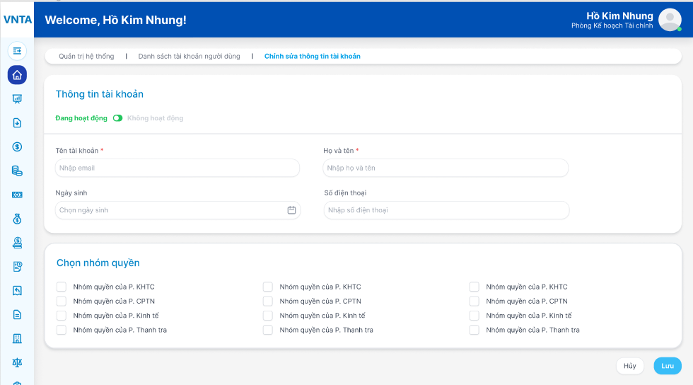

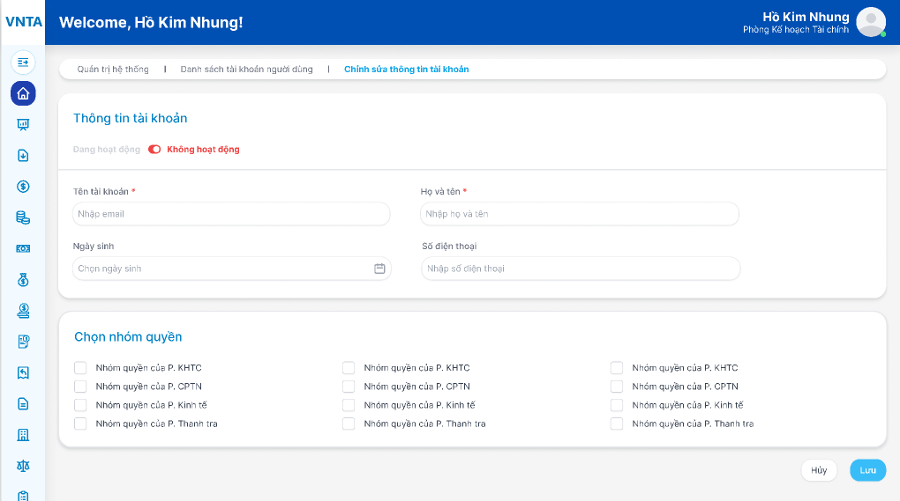

STT

Thông tin

Kiểu dữ liệu

Bắt buộc

Mô tả

Database

1

Trạng thái

button

Nhấn để đổi trạng thái giữa Đang hoạt động (hiển thị màu xanh lá cây) và Không hoạt động (hiển thị màu đỏ).

2

Các thông tin khác tham khảo tương tự chức năng tại mục 21.2 Tạo mới tài khoản người dùng.

Các thông tin khác tham khảo tương tự chức năng tại mục 21.2 Tạo mới tài khoản người dùng.

Các thông tin khác tham khảo tương tự chức năng tại mục 21.2 Tạo mới tài khoản người dùng.

Các thông tin khác tham khảo tương tự chức năng tại mục 21.2 Tạo mới tài khoản người dùng.

Các thông tin khác tham khảo tương tự chức năng tại mục 21.2 Tạo mới tài khoản người dùng.

Xem danh sách nhóm quyền

Luồng chức năng

Thông tin chung

Tên chức năng

Xem danh sách nhóm quyền

Mô tả

Chức năng cho phép xem tất cả các nhóm quyền có trên hệ thống.

Tác nhân

Admin

Điều kiện trước

Đăng nhập vào hệ thống, có phân quyền chức năng.

Điều kiện sau

Xem, tìm kiếm được danh sách nhóm quyền.

Ngoại lệ

N/A

Các yêu cầu đặc biệt

N/A

Luồng chức năng

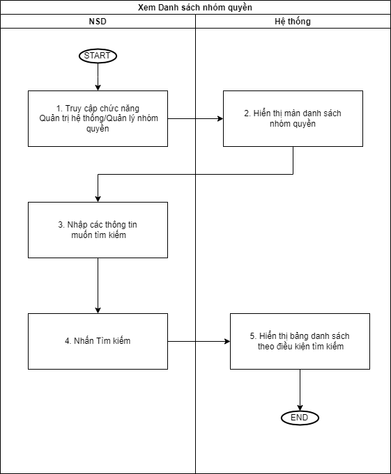

Mô tả luồng xử lý

Bước

Mô tả

Bước 1

NSD truy cập chức năng “Quản trị hệ thống”/ “Quản lý nhóm quyền”

Bước 2

Hiển thị màn danh sách nhóm quyền

Sắp xếp thứ tự các bản ghi theo thời gian cập nhật từ gần nhất đến xa nhất.

Bước 3

NSD nhập các trường thông tin muốn tìm kiếm.

Bước 4

Nhấn [Tìm kiếm].

Bước 5

Hệ thống hiển thị danh sách theo điều kiện tìm kiếm.

Kết thúc luồng.

Giao diện chức năng

--	Giao diện danh sách

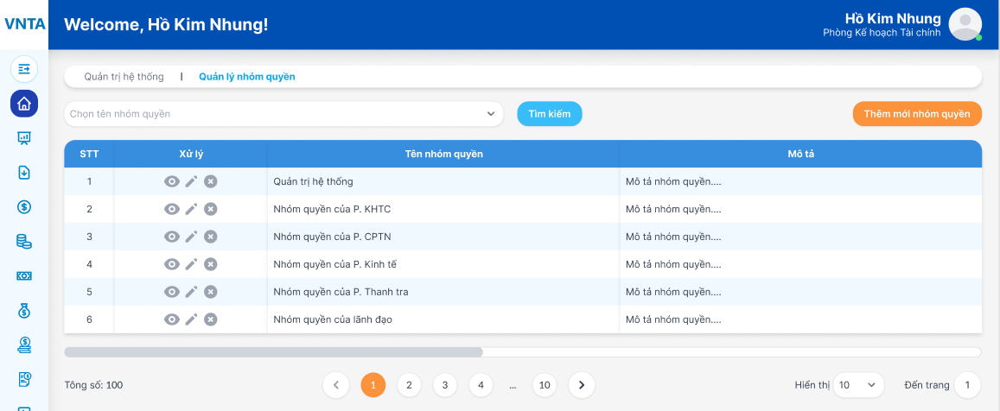

STT

Thông tin

Kiểu dữ liệu

Bắt buộc

Mô tả

Database

1

Tra cứu

Tra cứu

Tra cứu

Tra cứu

Tra cứu

1.1

Chọn tên nhóm quyền

Combobox search

- Autocomplete.

- Mặc định ko chọn là Chọn tất cả.

- Cho phép chọn 1 hoặc nhiều nhóm quyền.

1.2

Tìm kiếm

button

Nhấn để tìm kiếm theo điều kiện.

1.3

Thêm mới nhóm quyền

button

Nhấn hiển thị màn Thêm mới nhóm quyền.

2

Grid

Grid

Grid

Grid

Grid

2.1

STT

Text

STT tăng dần

2.2

Xử lý

button

Gồm các icon Xem chi tiết, Chỉnh sửa, Xóa.

2.3

Tên nhóm quyền

Text

Hiển thị tên nhóm quyền

2.4

Mô tả

Text

Hiển thị mô tả

Giao diện popup xác nhận xóa

--	

--	Tham khảo mô tả tương tự các chức năng khác.

Thêm mới nhóm quyền

Luồng chức năng

--	Thông tin chung

Tên chức năng

Thêm mới nhóm quyền

Mô tả

Chức năng cho phép Thêm mới nhóm quyền bằng cách nhóm các chức năng và người dùng tương ứng.

Tác nhân

Admin

Điều kiện trước

Đăng nhập vào hệ thống, có phân quyền chức năng

Điều kiện sau

Thêm mới nhóm quyền thành công

Ngoại lệ

N/A

Các yêu cầu đặc biệt

N/A

--	Luồng chức năng

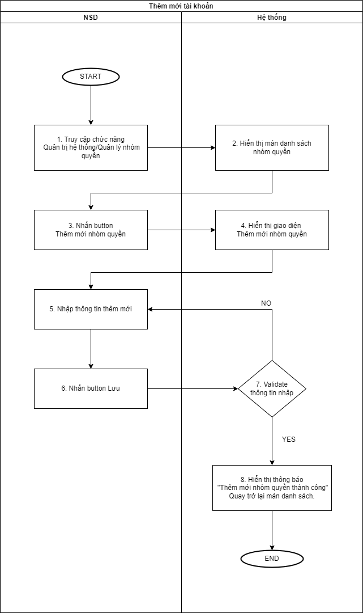

--	Mô tả luồng xử lý

Bước

Mô tả

Bước 1

NSD truy cập chức năng “Quản trị hệ thống/Quản lý nhóm quyền”

Bước 2

Hiển thị màn danh sách nhóm quyền.

Bước 3

Nhấn button Thêm mới nhóm quyền.

Bước 4

Hiển thị giao diện thêm mới nhóm quyền

Bước 5

Nhập thông tin thêm mới.

Danh sách các quyền gồm:

- Theo dõi nộp BCDT

+ Xem

+ Xuất công văn

+ Xuất excel

- Quản lý dữ liệu BCDT

+ Cập nhật

- Xuất công văn P. KHTC

   Phí quyền hoạt động viễn thông

        + Xem

        + Xuất công văn

        + Xuất excel

   Phí sử dụng mã, số viễn thông

        + Xem

        + Xuất công văn

        + Xuất excel

- Quản lý thu phí CCDV

   Theo dõi thu phí

        + Xem

        + Xuất excel

   Theo dõi công nợ Kỳ viễn thông

        + Xem

        + Xuất excel

   Theo dõi công nợ Kỳ kế toán

        + Xem

        + Xuất excel

   Theo dõi công nợ lũy kế

        + Xem

        + Xuất excel

- Quản lý thu phí TLM viễn thông công cộng

   Theo dõi thu phí

        + Xem

        + Xuất excel

   Theo dõi công nợ Kỳ kế toán

        + Xem

        + Xuất excel

   Theo dõi công nợ lũy kế

        + Xem

        + Xuất excel

- Quản lý thu phí sử dụng mã, số viễn thông

   Theo dõi biến động phí

        + Xem

        + Xuất excel

   Theo dõi công nợ Kỳ viễn thông

        + Xem

        + Xuất excel

   Theo dõi công nợ Kỳ kế toán

        + Xem

        + Xuất excel

   Theo dõi công nợ lũy kế

        + Xem

        + Xuất excel

- Quản lý thu phí một lần

   Phí TLM viễn thông dùng riêng, Phí Thử nghiệm mạng và dịch vụ viễn thông

        + Xem

        + Xuất excel

   Phí sửa chữa, bảo duỡng cáp viễn thông trên biển

        + Xem

        + Xuất excel

- Quản lý thu lệ phí

        + Xem

        + Xuất excel

- Quản lý biên lai

   Danh sách biên lai

        + Xem

        + Cập nhật

        + Xuất excel

   Tờ khai thu phí/lệ phí

        + Xem

        + Chốt thống kê

        + Xuất excel

   Tờ khai quyết toán phí/ lệ phí

        + Xem

        + Chốt thống kê

        + Xuất excel

- Quản lý công văn

+ Xem

+ Cập nhật

+ Xuất excel

- Quản lý thông tin đầu mối Doanh nghiệp

+ Xem

+ Cập nhật

- Ghi nhận thông tin xử phạt hành chính

+ Xem

+ Cập nhật

- Quản lý danh mục/cấu hình

   Danh sách Chi cục thuế

       + Xem

       + Cập nhật

   Cấu hình tờ khai thu phí/lệ phí

       + Xem

       + Cập nhật

   Cấu hình tờ khai quyết toán phí/lệ phí

       + Xem

       + Cập nhật

   Quản lý danh mục địa danh

       + Xem

       + Cập nhật

- Quản lý tin nhắn SMS

   Danh sách mẫu tin nhắn gửi Doanh nghiệp

       + Xem

       + Cập nhật

   Lịch sử gửi tin nhắn

       + Xem

       + Gửi tin nhắn đột xuất

- Quản trị hệ thống

   Quản lý tài khoản

        + Xem

        + Cập nhật

        + Xuất excel

   Quản lý nhóm quyền

        + Xem

        + Cập nhật

        + Xuất excel

   Lịch sử thao tác hệ thống

        + Xem

        + Xuất excel

Chức năng “Cập nhật” cho phép Thêm mới/Sửa/Xóa thông tin.

Nếu người dùng không được phân quyền chức năng nào thì button liên quan sẽ bị disable, nếu là cả một module thì không hiển thị cả module đó.

Bước 6

Nhấn button Lưu

Bước 7

Check nhập đủ thông tin yêu cầu. Nếu thiếu thì hệ thống thông báo lỗi tại các trường lỗi, quay trở lại bước 5.

Nếu thông tin đã đúng và đầy đủ thì chuyển qua bước 8.

Bước 8

Hiển thị thông báo "Tạo mới nhóm quyền thành công".

Quay trở lại màn danh sách.

Kết thúc luồng.

Giao diện chức năng

Giao diện “Thêm mới nhóm quyền” – Tổng quát

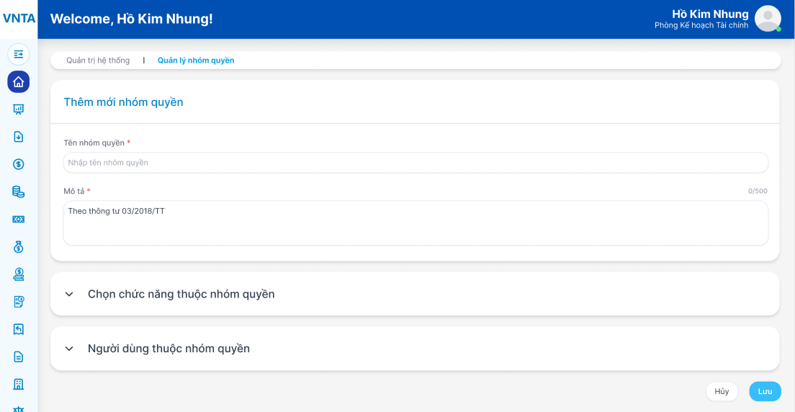

Giao diện “Thêm mới nhóm quyền” – Chi tiết

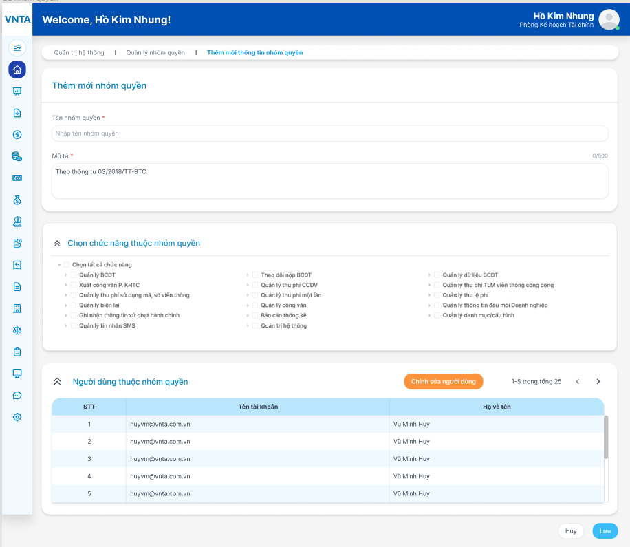

STT

Thông tin

Kiểu dữ liệu

Bắt buộc

Mô tả

Database

1

Tên nhóm quyền

Textbox

x

Nhập tên nhóm quyền.

Maxlength: 80 ký tự.

2

Mô tả

Textbox

x

Nhập mô tả.

Maxlength: 500 ký tự.

3

Chức năng thuộc nhóm quyền

Chức năng thuộc nhóm quyền

Chức năng thuộc nhóm quyền

Chức năng thuộc nhóm quyền

Chức năng thuộc nhóm quyền

3.1

Chọn tất cả chức năng

Checkbox

Nhấn để chọn tất cả chức năng

3.1.1

Trang chủ

Checkbox

Luôn tích chọn sẵn chức năng “Trang chủ”. Có thể bỏ tích.

3.2

Icon ‘-‘

button

Nhấn để thu gọn

3.3

Icon ‘+‘

button

Nhấn để mở rộng

4

Người dùng thuộc nhóm quyền

Người dùng thuộc nhóm quyền

Người dùng thuộc nhóm quyền

Người dùng thuộc nhóm quyền

Người dùng thuộc nhóm quyền

4.1

Chỉnh sửa người dùng

button

x

Nhấn vào hiện popup chọn người dùng.

4.2

STT

number

Số thứ tự tăng dần

4.3

Tên tài khoản

Text

Hiển thị danh sách tên tài khoản.

4.4

Họ và tên

Text

Hiển thị danh sách họ và tên các tài khoản theo alphabet.

5

Lưu

button

Nhấn để thêm nhóm quyền vừa tạo. Hệ thống check ít nhất đã có 1 chức năng được tích chọn thì sẽ thông báo “Thêm mới nhóm quyền thành công”. Nếu chưa có chức năng nào được chọn, hệ thống đưa ra thông báo “Chưa có chức năng thuộc nhóm quyền. Vui lòng chọn ít nhất 1 chức năng!”

6

Hủy

button

Nhấn để hủy bỏ thao tác tạo mới nhóm quyền. Hiện popup xác nhận Hủy. (tham khảo tương tự popup xác nhận Hủy ở các phần trước).

Xem chi tiết nhóm quyền

Luồng chức năng

--	Thông tin chung

Tên chức năng

Xem chi tiết nhóm quyền

Mô tả

Chức năng cho phép xem chi tiết nhóm quyền.

Tác nhân

Admin

Điều kiện trước

Đăng nhập vào hệ thống, có phân quyền chức năng

Điều kiện sau

Xem chi tiết nhóm quyền thành công

Ngoại lệ

N/A

Các yêu cầu đặc biệt

N/A

--	Luồng chức năng

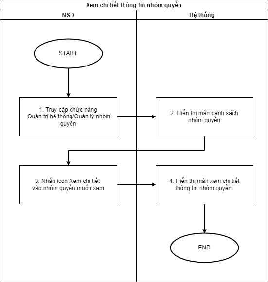

--	Mô tả luồng xử lý

Bước

Mô tả

Bước 1

NSD truy cập chức năng “Quản trị hệ thống/Quản lý nhóm quyền”

Bước 2

Hiển thị màn danh sách nhóm quyền.

Bước 3

Nhấn icon xem chi tiết vào nhóm quyền muốn xem.

Bước 4

Hiển thị màn xem chi tiết thông tin nhóm quyền.

Giao diện chức năng

Giao diện xem chi tiết thông tin nhóm quyền

--	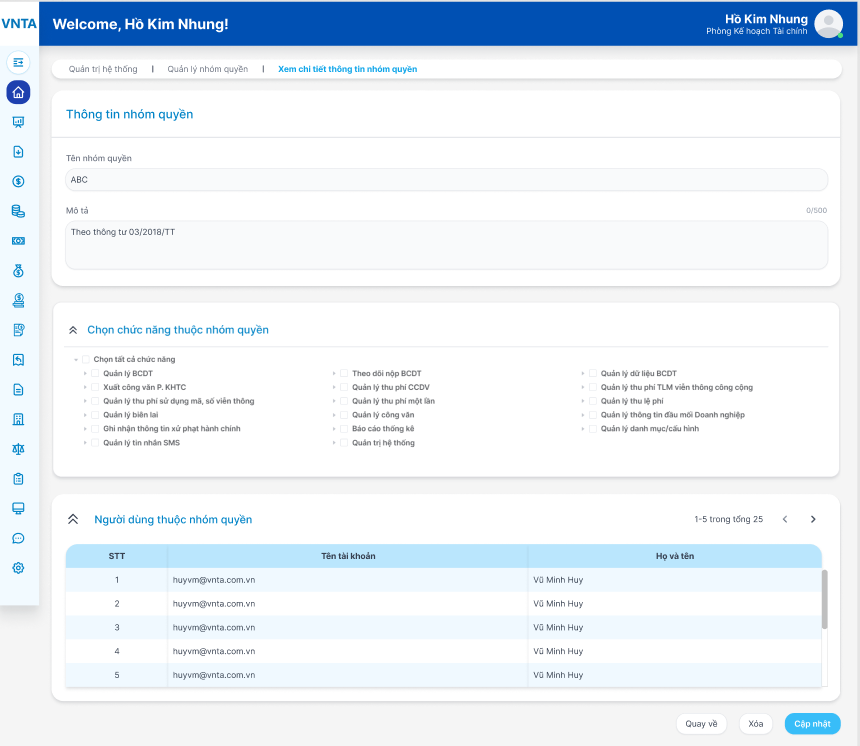

STT

Thông tin

Kiểu dữ liệu

Bắt buộc

Mô tả

Database

1

Tên nhóm quyền

Text

Hiển thị tên nhóm quyền.

2

Mô tả

Text

Hiển thị mô tả.

3

Chức năng thuộc nhóm quyền

Chức năng thuộc nhóm quyền

Chức năng thuộc nhóm quyền

Chức năng thuộc nhóm quyền

Chức năng thuộc nhóm quyền

3.1

Chọn tất cả chức năng

Checkbox

Chỉ xem, không cho phép tích chọn.

3.2

Icon ‘-‘

button

Nhấn để thu gọn

3.3

Icon ‘+‘

button

Nhấn để mở rộng

4

Người dùng thuộc nhóm quyền

Người dùng thuộc nhóm quyền

Người dùng thuộc nhóm quyền

Người dùng thuộc nhóm quyền

Người dùng thuộc nhóm quyền

4.1

STT

number

Số thứ tự tăng dần

4.2

Tên tài khoản

Text

Hiển thị danh sách tên tài khoản.

4.3

Họ và tên

Text

Hiển thị danh sách họ và tên các tài khoản theo alphabet.

5

Cập nhật

button

Nhấn để hiển thị màn chỉnh sửa nhóm quyền.

6

Xóa

button

Nhấn sẽ hiển thị popup xác nhận Xóa. Tương tự popup Xác nhận xóa trong chức năng Xem danh sách nhóm quyền.

7

Quay về

button

Nhấn để quay về màn danh sách đang tìm kiếm.

Chỉnh sửa thông tin nhóm quyền

Luồng chức năng

--	Thông tin chung

Tên chức năng

Chỉnh sửa thông tin nhóm quyền

Mô tả

Chức năng cho phép chỉnh sửa thông tin nhóm quyền

Tác nhân

Admin

Điều kiện trước

Đăng nhập vào hệ thống, có phân quyền chức năng

Điều kiện sau

Chỉnh sửa thông tin nhóm quyền thành công

Ngoại lệ

N/A

Các yêu cầu đặc biệt

N/A

--	Luồng chức năng

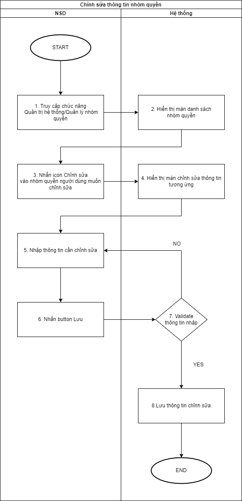

--	Mô tả luồng xử lý

Bước

Mô tả

Bước 1

Truy cập chức năng Quản trị hệ thống/Quản lý nhóm quyền.

Bước 2

Hiển thị màn danh sách nhóm quyền.

Bước 3

Nhấn icon chỉnh sửa nhóm quyền muốn chỉnh sửa.

Bước 4

Hiển thị màn chỉnh sửa thông tin nhóm quyền tương ứng.

Bước 5

Nhập thông tin cần chỉnh sửa

Bước 6

Nhấn button Lưu

Bước 7

Validate thông tin nhập. Check đã nhập đủ các thông tin yêu cầu hay chưa.

Nếu chưa thì hệ thống thông báo tại các trường lỗi, quay trở lại bước 5.

Nếu thông tin đã đúng và đầy đủ thì chuyển qua bước 8.

Bước 8

Hiển thị thông báo "Lưu thông tin thành công".

Quay trở lại màn danh sách đang tìm kiếm.

Kết thúc luồng.

Giao diện chức năng

Giao diện xem chi tiết thông tin nhóm quyền

--	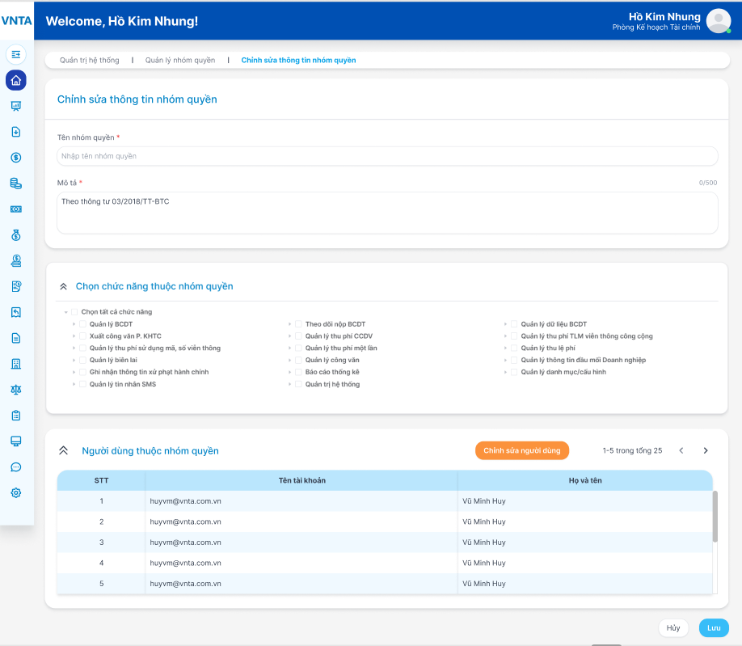

--	Tham khảo mô tả tương tự như chức năng thêm mới nhóm quyền tại mục 21.6.

Xem danh sách lịch sử hệ thống

Luồng chức năng

--	Thông tin chung

Tên chức năng

Xem danh sách lịch sử hệ thống

Mô tả

Chức năng cho phép người sử dụng xem danh sách lịch sử thao tác hệ thống

Tác nhân

Lãnh đạo, Cán bộ Phòng KHTC, Phòng CPTN, Phòng Kinh tế

Điều kiện trước

Đăng nhập vào hệ thống, có phân quyền chức năng

Điều kiện sau

	Xem, tìm kiếm được danh sách lịch sử hệ thống

Ngoại lệ

N/A

Các yêu cầu đặc biệt

N/A

--	Luồng chức năng

--	Mô tả luồng xử lý

Bước

Mô tả

Bước 1

NSD truy cập chức năng “Quản trị hệ thống/Lịch sử hệ thống”.

Bước 2

Hệ thống hiển thị giao diện danh sách lịch sử tất cả thao tác của tất cả NSD trong hệ thống.

Bước 3

NSD nhập các thông tin tìm kiếm tại các trường dữ liệu tương ứng.

Bước 4

Nhấn [Tìm kiếm].

Bước 5

Hệ thống kiểm tra tính hợp lệ thông tin nhập:

- Nếu hợp lệ, chuyển bước 6

- Nếu không hợp lệ, hệ thống đưa ra thông báo tại các trường nhập không hợp lệ. Quay lại bước 3.

Bước 6

Hệ thống hiển thị danh sách thông tin lịch sử thao tác hệ thống theo điều kiện tìm kiếm.

Kết thúc luồng.

Giao diện chức năng

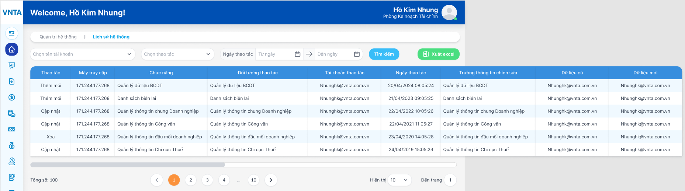

STT

Thông tin

Kiểu dữ liệu

Bắt buộc

Mô tả

Database

1

Tìm kiếm cơ bản

Tìm kiếm cơ bản

Tìm kiếm cơ bản

Tìm kiếm cơ bản

Tìm kiếm cơ bản

1.1

Chọn tên tài khoản

combobox search

- Chứa các tên tài khoản người dùng đã có thao tác xuất/chốt/thêm/sửa/xóa dữ liệu.

- Cho phép người dùng chọn 1/nhiều tài khoản thực hiện, mặc định không chọn là chọn tất cả.

- Autocomplete gõ nhập tên tài khoản thực hiện hệ thống tự động gợi ý.

1.2

Chọn thao tác

Dropdown list

Chức all các loại thao tác mà người dùng có thể chọn khi thao tác hệ thống, bao gồm:

- Đăng nhập/Đăng xuất

- Thêm mới

- Chỉnh sửa

- Xóa/Hủy

- Xuất công văn

- Xuất excel

- Xuất tờ khai

- Gửi tin nhắn

- Chốt thống kê

Mặc định không chọn là chọn tất cả.

1.3

Ngày thao tác

Datepicker

- Từ ngày <= Đến ngày

- Cho phép người dùng chọn khoảng thời gian thực hiện thao tác.

1.4

Tìm kiếm

button

Tìm kiếm theo các trường thông tin đã chọn

Hệ thống hiển thị bảng danh sách bên dưới, sắp xếp theo thứ tự Ngày thực hiện từ gần nhất đến xa nhất.

1.5

Xuất excel

button

File gồm các cột giống trên giao diện, tiêu đề của sheet là Quản lý lịch sử hệ thống, tên file: [Ngày xuất]_Lịch sử hệ thống.

2

Grid danh sách

Grid danh sách

Grid danh sách

Grid danh sách

Grid danh sách

2.1

Tài khoản thao tác

Text

Hiển thị tài khoản thực hiện.

2.2

Ngày thao tác

Date

Hiển thị ngày giờ thực hiện thao tác định dạng ngày giờ: <dd/mm/yyyy    hh/mm/ss>.

2.3

Chức năng

Text

Hiển thị nội dung chức năng liên quan đến thao tác của NSD.

2.4

Thao tác

Text

Hiển thị loại thao tác NSD thực hiện.

2.5

Đối tượng thao tác

Text

Hiển thị chi tiết dữ liệu tác động.

2.6

IP

Text

Hiển thị IP.

Quản lý danh mục đơn vị hành chính

Xem danh sách đơn vị hành chính

Luồng chức năng

--		Thông tin chung

Tên chức năng

Xem danh sách đơn vị hành chính.

Mô tả

Chức năng cho phép người sử dụng xem danh sách đơn vị hành chính từ cấp Tỉnh/TP thuộc TW đến cấp Xã, Phường.

Tác nhân

Admin

Điều kiện trước

Đăng nhập vào hệ thống, có phân quyền chức năng

Điều kiện sau

	Xem danh sách thành công

Ngoại lệ

N/A

Các yêu cầu đặc biệt

N/A

--	Luồng chức năng

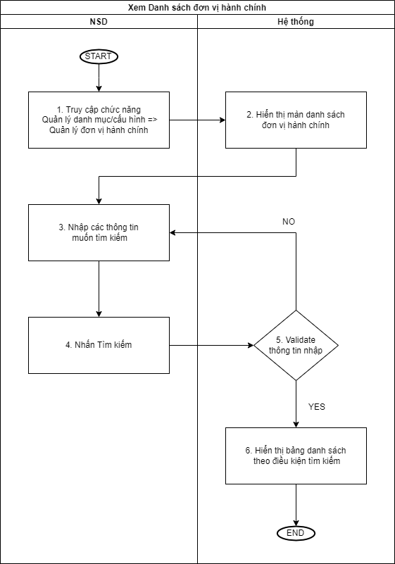

--	Mô tả luồng xử lý

Bước

Mô tả

Bước 1

NSD truy cập chức năng Quản lý danh mục/cấu hình => Quản lý đơn vị hành chính.

Bước 2

Hệ thống hiển thị màn danh sách đơn vị hành chính.

Sắp xếp Hà Nội, các tỉnh/TP trực thuộc TW sau đó sắp xếp theo alphabet

Trong cùng 1 Tỉnh, sắp xếp các Huyện theo alphabet

Trong cùng 1 Huyện, sắp xếp các Xã theo alphabet

Bước 3

Nhập các thông tin muốn tìm kiếm

Bước 4

Nhấn Tìm kiếm

Bước 5

Validate thông tin nhập

Bước 6

Hiển thị bảng danh sách theo điều kiện tìm kiếm.

Kết thúc luồng

Giao diện chức năng

--	Giao diện danh sách đơn vị hành chính – Hiển thị chưa tích chọn các đơn vị

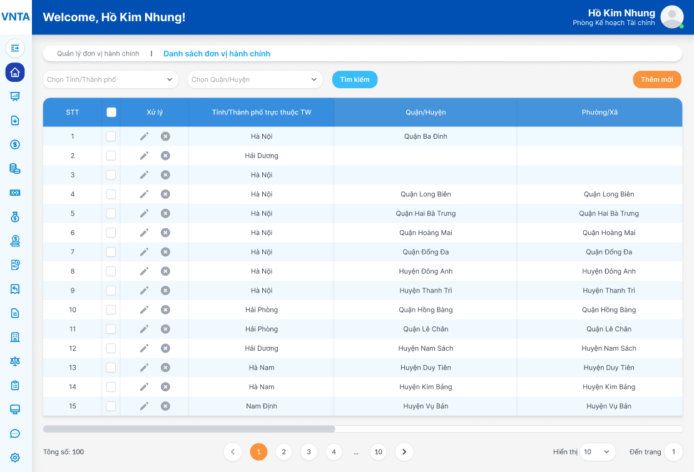

--	Giao diện danh sách đơn vị hành chính – Hiển thị đã tích chọn các đơn vị

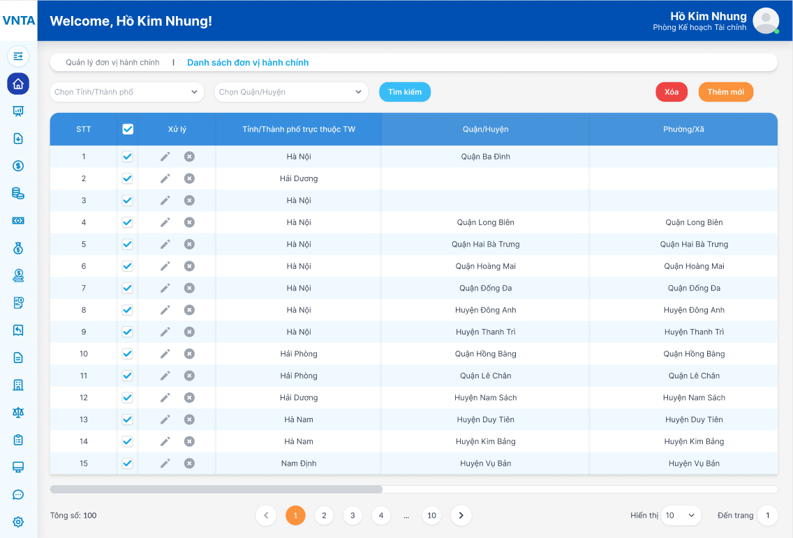

STT

Thông tin

Kiểu dữ liệu

Bắt buộc

Mô tả

Database

1

Khung tìm kiếm

Khung tìm kiếm

Khung tìm kiếm

Khung tìm kiếm

Khung tìm kiếm

1.1

Chọn tỉnh/thành phố

Combobox search

- Autocomplete.

- Mặc định ko chọn là Chọn tất cả.

- Cho phép chọn 1 hoặc nhiều Tỉnh/TP

1.2

Chọn quận/huyện

Combobox search

- Autocomplete.

- Mặc định ko chọn là Chọn tất cả.

- Cho phép chọn 1 hoặc nhiều quận/huyện.

1.3

Tìm kiếm

button

Nhấn để tìm kiếm theo điều kiện.

1.4

Thêm mới

button

Nhấn để hiển thị màn thêm mới đơn vị hành chính

2

Grid

Grid

Grid

Grid

Grid

2.1

STT

number

STT tăng dần

2.2

Xử lý

button

Gồm các icon button Sửa/Xóa. Nhấn icon Sửa để hiển thị màn Chỉnh sửa

Nhấn icon Xóa sẽ hiển thị popup xác nhận Xóa tương ứng với từng cấp đơn vị theo nguyên tắc:

- Xóa lần lượt từ đơn vị cấp Phường/Xã -> Quận/Huyện -> Tỉnh/TP trực thuộc TW. Xóa đơn vị cấp Phường/Xã thì nhấn icon “Xóa” sẽ hiển thị popup xác nhận Xóa cấp Phường/Xã.

- Chỉ xóa được cấp Quận/Huyện khi không còn đơn vị cấp Phường/Xã thuộc Quận/Huyện đó. Lúc này nhấn icon “Xóa” sẽ hiển thị popup xác nhận Xóa cấp Quận Huyện.

- Chỉ xóa được cấp Tỉnh/TP trực thuộc trung ương khi không còn đơn vị cấp Quận/Huyện thuộc Tỉnh/TP trực thuộc trung ương đó. Lúc này nhấn icon “Xóa” sẽ hiển thị popup xác nhận Xóa cấp Tỉnh/TP trực thuộc TW.

2.3

Checkbox

Tích chọn vào đơn vị muốn xóa. Hiển thị button Xóa.

2.4

Xóa

button

Nhấn để thực hiện Xóa. Hiển thị popup Xác nhận Xóa tương ứng.

2.5

Tỉnh/Thành phố trực thuộc TW

Text

Hiển thị tên Tỉnh/Thành phố trực thuộc TW

2.6

Quận/Huyện

Text

Hiển thị tên Quận/Huyện

2.7

Phường/Xã

Text

Hiển thị tên Phường/Xã

Popup xác nhận Xóa đơn vị cấp Phường/Xã

Popup xác nhận Xóa đơn vị cấp Quận/Huyện

Popup xác nhận Xóa đơn vị cấp Tỉnh/TP trực thuộc TW

--	Tham khảo mô tả tương tự như các popup xác nhận Xóa khác.

Thêm mới đơn vị hành chính

Luồng chức năng

--	Thông tin chung

Tên chức năng

Thêm mới đơn vị hành chính

Mô tả

Chức năng cho phép Thêm mới đơn vị hành chính từ cấp Tỉnh/TP trực thuộc TW đến Quận/Huyện và Phường/Xã.

Tác nhân

Admin

Điều kiện trước

Đăng nhập vào hệ thống, có phân quyền chức năng

Điều kiện sau

Thêm mới đơn vị hành chính thành công

Ngoại lệ

N/A

Các yêu cầu đặc biệt

N/A

--	Luồng chức năng

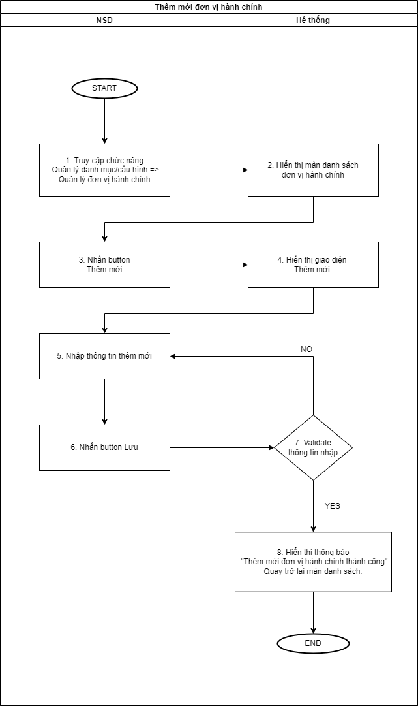

--	Mô tả luồng xử lý

Bước

Mô tả

Bước 1

NSD truy cập chức năng Quản lý danh mục/cấu hình => Quản lý đơn vị hành chính.

Bước 2

Hệ thống hiển thị màn danh sách đơn vị hành chính.

Sắp xếp Hà Nội, các tỉnh/TP trực thuộc TW sau đó sắp xếp theo alphabet

Trong cùng 1 Tỉnh, sắp xếp các Huyện theo alphabet

Trong cùng 1 Huyện, sắp xếp các Xã theo alphabet

Bước 3

Nhấn button Thêm mới

Bước 4

Hiển thị giao diện thêm mới

Bước 5

Nhập thông tin thêm mới

Bước 6

Nhấn button Lưu

Bước 7

Check nhập đủ thông tin yêu cầu. Nếu thiếu thì hệ thống thông báo lỗi tại các trường lỗi, quay trở lại bước 5.

Nếu thông tin đã đúng và đầy đủ thì chuyển qua bước 8.

Bước 8

Hiển thị thông báo "Thêm mới đơn vị hành chính thành công".

Quay trở lại màn danh sách.

Kết thúc luồng.

Giao diện chức năng

Giao diện thêm mới Đơn vị hành chính – Đơn vị cấp Tỉnh/Thành phố trực thuộc TW

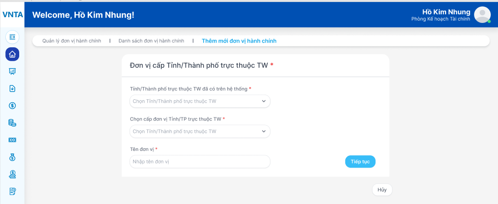

Giao diện thêm mới Đơn vị hành chính – Đơn vị cấp Quận/Huyện

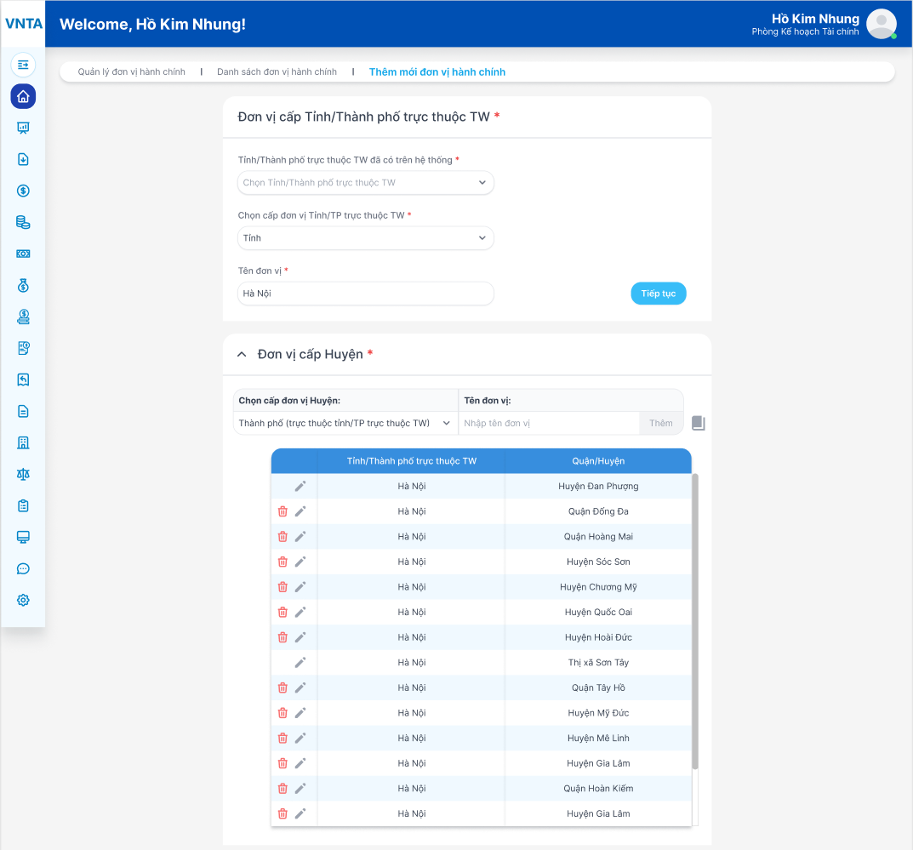

Giao diện thêm mới Đơn vị hành chính – Đơn vị cấp Phường/Xã

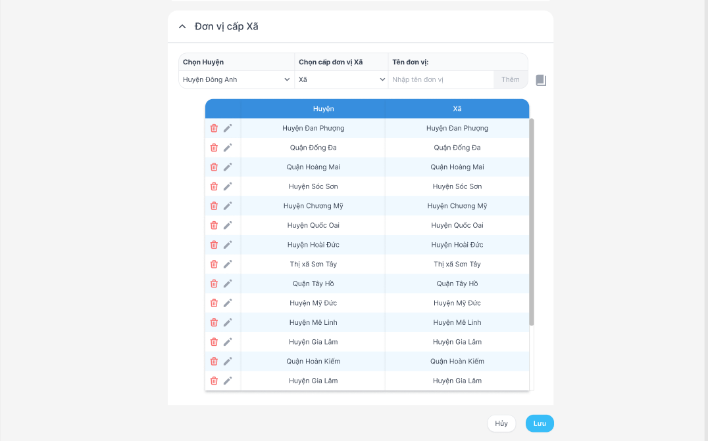

STT

Thông tin

Kiểu dữ liệu

Bắt buộc

Mô tả

Database

1

Đơn vị cấp Tỉnh/Thành phố trực thuộc TW *

Đơn vị cấp Tỉnh/Thành phố trực thuộc TW *

Đơn vị cấp Tỉnh/Thành phố trực thuộc TW *

Đơn vị cấp Tỉnh/Thành phố trực thuộc TW *

Đơn vị cấp Tỉnh/Thành phố trực thuộc TW *

1.1

Tỉnh/Thành phố trực thuộc TW đã có trên hệ thống

Combobox search

x

Gồm tất cả các Tỉnh/TP có trong hệ thống.

Chọn 1 Tỉnh/TP

Autocomplete

1.2

Thêm Tỉnh/TP

button

Nhấn vào để hiển thị 2 trường thông tin bên dưới: “Chọn cấp đơn vị Tỉnh/TP trực thuộc TW” và “Tên đơn vị”

1.3

Chọn cấp đơn vị Tỉnh/TP trực thuộc TW

Combobox search

x

Gồm các lựa chọn:

- Tỉnh

- Thành phố trực thuộc TW

1.4

Tên đơn vị

Textbox

x

Nhập tên đơn vị .

Max length: 50 ký tự

1.5

Tiếp tục

button

Nhấn vào để hệ thống load lại thông tin “Tỉnh/Thành phố trực thuộc TW” trong phần Đơn vị cấp Huyện phía dưới

2

Đơn vị cấp Huyện

Đơn vị cấp Huyện

Đơn vị cấp Huyện

Đơn vị cấp Huyện

Đơn vị cấp Huyện

2.1

Chọn cấp đơn vị Huyện

Combobox

x

Cho phép chọn 1 trong các lựa chọn:

- Quận

- Huyện

- Thị xã

- Thành phố

2.2

Tên đơn vị

Textbox

x

Nhập tên đơn vị

Max length: 50 ký tự

2.3

Thêm

button

Nhấn vào để thêm đơn vị cấp Huyện vừa nhập vào bảng danh sách phía dưới

2.4

button

Nhấn vào để hiển thị popup chọn các đơn vị cấp Huyện đã có trên hệ thống.

2.5

Grid

Grid

Grid

Grid

Grid

2.5.1

Tỉnh/Thành phố trực thuộc TW

Text

Hiển thị theo tên Tỉnh/Thành phố trực thuộc TW đã nhập.

2.5.2

Quận/Huyện

Text

Hiển thị tên đơn vị vừa Thêm.

2.5.3

Xử lý

Gồm 2 icon button “xóa”/”sửa”.

Chỉ những Quận/Huyện không có đơn vị con Phường/Xã thì mới có icon Xóa. Nhấn vào xóa hiển thị popup xác nhận xóa Quận/Huyện.

Nhấn vào icon Sửa cho phép chỉnh sửa tên Quận/Huyện.

3

Đơn vị cấp Xã

Đơn vị cấp Xã

Đơn vị cấp Xã

Đơn vị cấp Xã

Đơn vị cấp Xã

3.1

Chọn Huyện

Combobox Search

Gồm các đơn vị cấp Huyện bên trên đã thêm.

Cho phép chọn 1 đơn vị.

Autocomplete

3.2

Chọn cấp đơn vị Xã

Combobox

Cho phép chọn 1 trong các lựa chọn:

- Xã

- Phường

- Thị trấn

3.3

Tên đơn vị

Textbox

Nhập tên đơn vị

Max length: 50 ký tự

3.4

Thêm

button

Nhấn vào để thêm đơn vị cấp Xã vừa nhập vào bảng danh sách phía dưới

3.5

button

Nhấn vào để hiển thị popup chọn các đơn vị cấp Xã đã có trên hệ thống.

3.6

Grid

Grid

Grid

Grid

Grid

3.6.1

Quận/Huyện

Text

Hiển thị theo tên Quận/Huyện

3.6.2

Phường/Xã

Text

Hiển thị tên đơn vị vừa thêm theo quận/huyện tương ứng.

3.6.3

Xử lý

Gồm 2 icon button “xóa”/”sửa”.

Nhấn vào xóa hiển thị popup xác nhận xóa Phường/Xã.

Nhấn vào icon Sửa cho phép chỉnh sửa tên Phường/Xã.

4

Lưu

Button

Hệ thống check thông tin cần nhập theo yêu cầu. Báo lỗi tại các trường bị sai.

Nếu đúng thì thông báo “Thêm mới đơn vị hành chính thành công” và quay về màn danh sách.

5

Hủy

button

Nhấn để hiển thị popup xác nhận Hủy.

Giao diện popup chọn đơn vị cấp Huyện đã có trên hệ thống

--	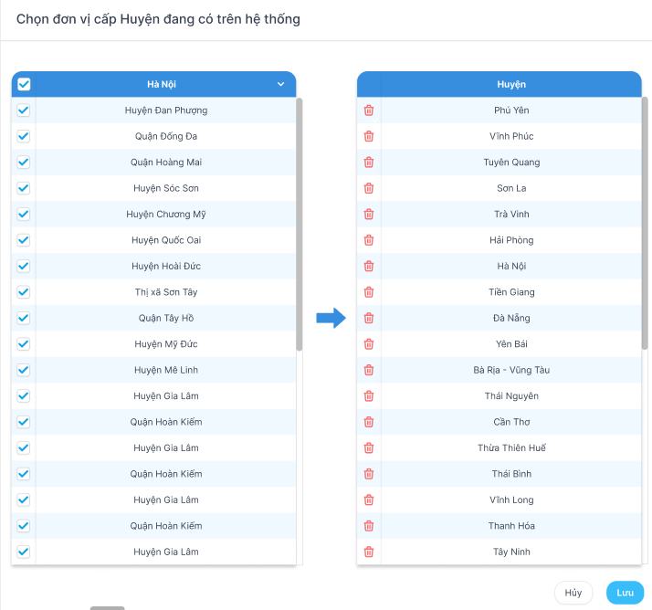

Giao diện popup chọn đơn vị cấp Xã đã có trên hệ thống

--	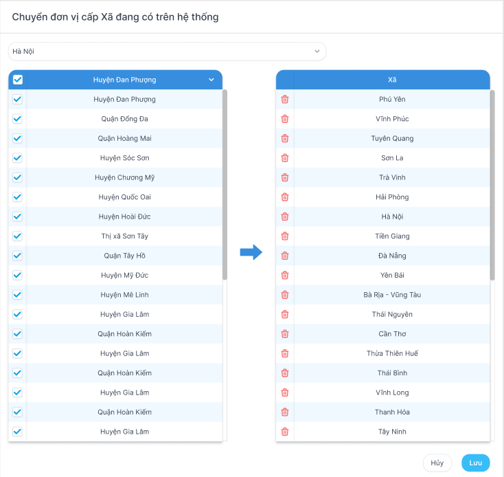

--	Tham khảo tương tự chức năng Chọn văn bản liên quan tại mục 13.2 Quản lý công văn/thêm mới công văn đến.

Chỉnh sửa thông tin đơn vị hành chính

Luồng chức năng

--	Thông tin chung

Tên chức năng

Chỉnh sửa thông tin đơn vị hành chính

Mô tả

Chức năng cho phép Chỉnh sửa thông tin đơn vị hành chính từ cấp Tỉnh/TP trực thuộc TW đến Quận/Huyện và Phường/Xã.

Tác nhân

Admin

Điều kiện trước

Đăng nhập vào hệ thống, có phân quyền chức năng

Điều kiện sau

Chỉnh sửa thông tin đơn vị hành chính thành công

Ngoại lệ

N/A

Các yêu cầu đặc biệt

N/A

--	Luồng chức năng

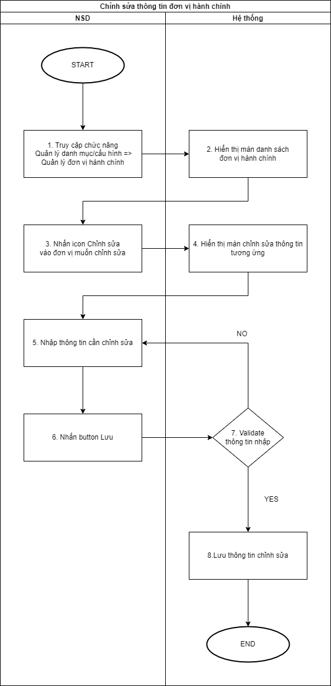

--	Mô tả luồng xử lý

Bước

Mô tả

Bước 1

NSD truy cập chức năng Quản lý danh mục/cấu hình => Quản lý đơn vị hành chính.

Bước 2

Hệ thống hiển thị màn danh sách đơn vị hành chính.

Sắp xếp Hà Nội, các tỉnh/TP trực thuộc TW sau đó sắp xếp theo alphabet

Trong cùng 1 Tỉnh, sắp xếp các Huyện theo alphabet

Trong cùng 1 Huyện, sắp xếp các Xã theo alphabet

Bước 3

Nhấn icon Chỉnh sửa vào đơn vị muốn chỉnh sửa

Bước 4

Hiển thị màn chỉnh sửa thông tin tương ứng

Bước 5

Nhập thông tin cần chỉnh sửa

Bước 6

Nhấn button Lưu

Bước 7

Check nhập đủ thông tin yêu cầu. Nếu thiếu thì hệ thống thông báo lỗi tại các trường lỗi, quay trở lại bước 5.

Nếu thông tin đã đúng và đầy đủ thì chuyển qua bước 8.

Bước 8

Hiển thị thông báo "Lưu thông tin thành công".

Quay trở lại màn danh sách.

Kết thúc luồng.

Giao diện chức năng

--	Tham khảo tương tự các trường thông tin tại mục 23.2 - Thêm mới đơn vị hành chính.

Doanh nghiệp (phase 1) (giữ nguyên form cũ, chỉ thêm trường “Cơ quan quản lý thuế”)

--	Thêm mới/chỉnh sửa/Xem chi tiết thông tin doanh nghiệp

STT

Thông tin

Kiểu dữ liệu

Bắt buộc

Mô tả

Database

1

Cơ quan quản lý Thuế

Combobox search

x

Cho phép chọn 1 cơ quan quản lý thuế trong số danh mục các cơ quan thuế đã có trên hệ thống.

--	Các trường thông tin còn lại không thay đổi, tương tự như hệ thống cũ đã xây dựng.

Thêm mới/chỉnh sửa giấy phép (phase 1)

--	Giao diện chức năng

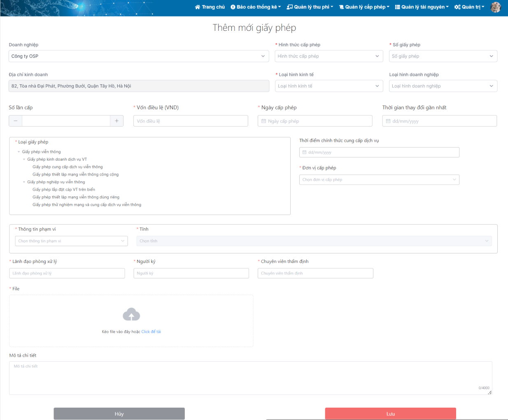

STT

Thông tin

Kiểu dữ liệu

Bắt buộc

Mô tả

Database

1

Địa chỉ kinh doanh

Text

Tự động fill theo tên Doanh nghiệp đã chọn. Ghép theo cấu trúc “Số nhà/tòa nhà/đường/phố, Phường/xã, Quận/Huyện, Tỉnh/TP”

--	Các trường thông tin còn lại không thay đổi, tương tự như hệ thống cũ đã xây dựng.

Xử phạt hành chính

Thêm mới thông tin xử phạt

Luồng chức năng

--		Thông tin chung

Tên chức năng

Thêm mới thông tin xử phạt

Mô tả

Chức năng cho phép người sử dụng Thêm mới thông tin xử phạt

Tác nhân

P. Thanh tra

Điều kiện trước

Đăng nhập vào hệ thống, có phân quyền chức năng

Điều kiện sau

	Thêm mới thông tin thành công

Ngoại lệ

N/A

Các yêu cầu đặc biệt

N/A

--	Luồng chức năng

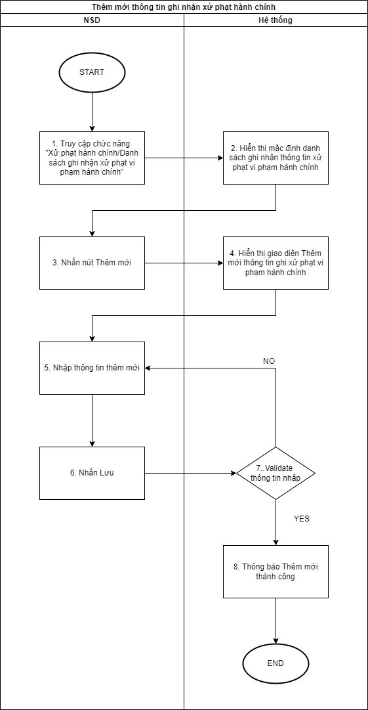

Bước

Mô tả

Bước 1

Truy cập chức năng "Xử phạt hành chính/Danh sách ghi nhận xử phạt vi phạm hành chính"

Bước 2

Hiển thị mặc định danh sách ghi nhận thông tin xử phạt vi phạm hành chính

Bước 3

Nhấn nút Thêm mới

Bước 4

Hiển thị giao diện Thêm mới thông tin ghi xử phạt vi phạm hành chính

Bước 5

Nhập thông tin thêm mới

Bước 6

Nhấn Lưu

Bước 7

Validate thông tin nhập.

Nếu thông tin hợp lệ thì tiếp đến bước 8. Nếu không hợp lệ hệ thống thông báo lỗi tại trường nhập thiếu/lỗi và quay trở lại bước 6.

Bước 8

Thông báo Thêm mới thành công. Kết thúc luồng.

Giao diện chức năng

Giao diện ban đầu của Thêm mới thông tin xử phạt

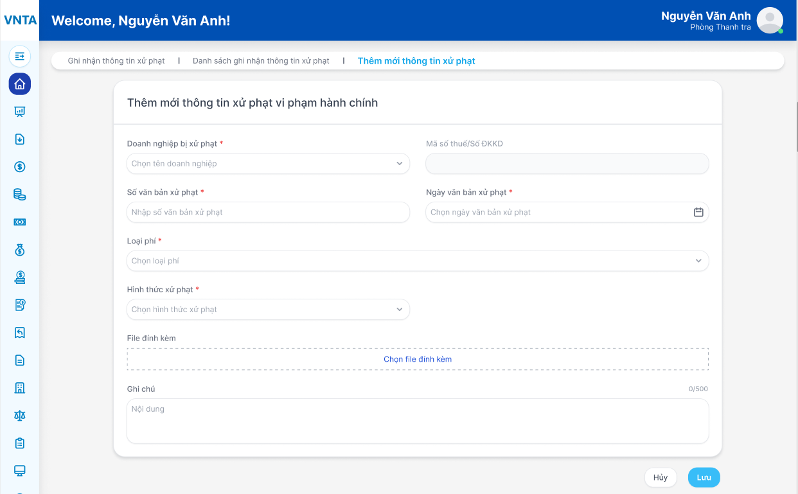

Giao diện Thêm mới xử phạt bằng phạt tiền

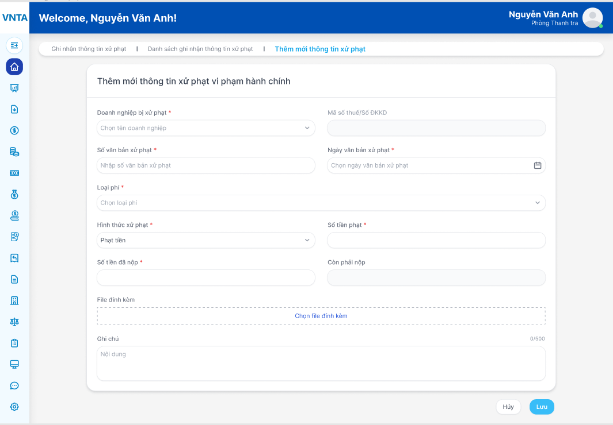

Giao diện thêm mới xử phạt bằng hình thức cảnh cáo

Giao diện thêm mới thông tin xử phạt bằng hình thức khác

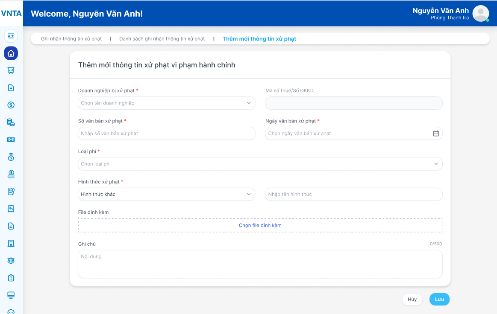

STT

Thông tin

Kiểu dữ liệu

Bắt buộc

Mô tả

Database

1

Doanh nghiệp bị xử phạt

Combobox search

x

- Hiển thị tất cả các doanh nghiệp có trên hệ thống.

- Sắp xếp các lựa chọn theo mã định danh.

- Cho phép chọn 1 DN.

2

Mã số thuế/Số ĐKKD

Text

Autofill theo tên Doanh nghiệp.

3

Số văn bản xử phạt

Textbox

x

Cho phép nhập số văn bản xử phạt.

Maxlength: 50 kí tự

4

Ngày văn bản xử phạt

datepicker

x

Cho phép chọn ngày văn bản xử phạt.

5

Loại phí

Combobox search

x

Cho phép chọn 1, nhiều loại phí, lệ phí.

Bao gồm:

- Phí sử dụng mã, số viễn thông

- Phí CCDV viễn thông

- Phí TLM viễn thông công cộng

- Phí TLM viễn thông dùng riêng

- Phí thử nghiệm mạng và dịch vụ viễn thông

- Phí lắp đặt cáp viễn thông trên biển

- Phí sửa chữa, bảo dưỡng cáp viễn thông trên biển.

- Lệ phí cấp phép

- Lệ phí phân bổ mã, số viễn thông

6

Hình thức xử phạt

Combobox

x

Bao gồm:

- Cảnh cáo

- Phạt tiền

- Hình thức khác

7

Nhập hình thức xử phạt

Textbox

x

Chỉ hiển thị trường thông tin này khi chọn hình thức xử phạt là “Hình thức khác”

Maxlength: 70 kí tự

8

Số tiền phạt

Textbox

x

Chỉ hiển thị trường thông tin này khi chọn hình thức xử phạt là “Phạt tiền”

Cho phép nhập số tiền.

Ngăn cách hàng nghìn bằng dấu “.” Đơn vị tiền mặc định là VNĐ.

Maxlength: 20 ký tự

9

Số tiền đã nộp

Textbox

x

Chỉ hiển thị trường thông tin này khi chọn hình thức xử phạt là “Phạt tiền”

Cho phép nhập số tiền.

Ngăn cách hàng nghìn bằng dấu “.” Đơn vị tiền mặc định là VNĐ.

Maxlength: 20 ký tự

10

Còn phải nộp

Textbox

Chỉ hiển thị trường thông tin này khi chọn hình thức xử phạt là “Phạt tiền”

Tự động tính = Số tiền phạt – Số tiền đã nộp

Ngăn cách hàng nghìn bằng dấu “.” Đơn vị tiền mặc định là VNĐ.

11

File đính kèm

x

Cho phép tải lên 1 hoặc nhiều file đính kèm dưới bất kỳ định dạng nào.

Dung lượng tối đa <= 15MB

12

Ghi chú

Textbox

Cho phép nhập ghi chú.

Maxlength: 500 kí tự

13

Hủy

button

Nhấn để hủy bỏ thao tác thêm mới thông tin xử phạt. Hiển thị popup Xác nhận Hủy.

Đồng ý Hủy thì về lại trang danh sách đang tìm kiếm trước đó.

14

Lưu

button

Nhấn để lưu thông tin. Hệ thống hiển thị popup Xác nhận Lưu. Hệ thống thông báo “Lưu thông tin xử phạt thành công”.

 Cập nhật thông tin xử phạt

Luồng chức năng

--		Thông tin chung

Tên chức năng

Cập nhật thông tin xử phạt

Mô tả

Chức năng cho phép người sử dụng Cập nhật thông tin xử phạt

Tác nhân

P. Thanh tra

Điều kiện trước

Đăng nhập vào hệ thống, có phân quyền chức năng

Điều kiện sau

	Cập nhật thông tin thành công

Ngoại lệ

N/A

Các yêu cầu đặc biệt

N/A

--	Luồng chức năng

--	

Bước

Mô tả

Bước 1

Truy cập chức năng "Xử phạt hành chính/Danh sách ghi nhận xử phạt vi phạm hành chính"

Bước 2

Hiển thị mặc định danh sách ghi nhận thông tin xử phạt vi phạm hành chính

Bước 3

Nhấn nút icon Chỉnh sửa

Bước 4

Hiển thị giao diện Chỉnh sửa thông tin ghi xử phạt vi phạm hành chính

Bước 5

Nhập thông tin chỉnh sửa

Bước 6

Nhấn Lưu

Bước 7

Validate thông tin nhập.

Nếu thông tin hợp lệ thì tiếp đến bước 8. Nếu không hợp lệ hệ thống thông báo lỗi tại trường nhập thiếu/lỗi và quay trở lại bước 6.

Bước 8

Thông báo Lưu thông tin chỉnh sửa thành công. Kết thúc luồng.

Giao diện chức năng

--	Giao diện Cập nhật thông tin xử phạt

--	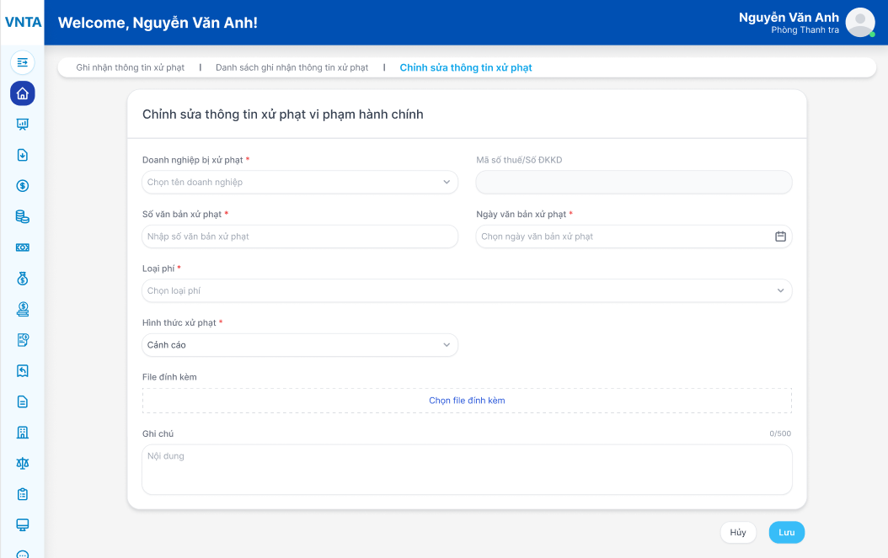

STT

Thông tin

Kiểu dữ liệu

Bắt buộc

Mô tả

Database

1

Doanh nghiệp bị xử phạt

Combobox search

x

- Hiển thị tất cả các doanh nghiệp có trên hệ thống.

- Sắp xếp các lựa chọn theo mã định danh.

- Cho phép chọn 1 DN.

2

Mã số thuế/Số ĐKKD

Text

Autofill theo tên Doanh nghiệp.

3

Số văn bản xử phạt

Textbox

x

Cho phép nhập số văn bản xử phạt.

Maxlength: 50 kí tự

4

Ngày văn bản xử phạt

datepicker

x

Cho phép chọn ngày văn bản xử phạt.

5

Loại phí

Combobox search

x

Cho phép chọn 1, nhiều loại phí, lệ phí.

Bao gồm:

- Phí sử dụng mã, số viễn thông

- Phí CCDV viễn thông

- Phí TLM viễn thông công cộng

- Phí TLM viễn thông dùng riêng

- Phí thử nghiệm mạng và dịch vụ viễn thông

- Phí lắp đặt cáp viễn thông trên biển

- Phí sửa chữa, bảo dưỡng cáp viễn thông trên biển.

- Lệ phí cấp phép

- Lệ phí phân bổ mã, số viễn thông

6

Hình thức xử phạt

Combobox

x

Bao gồm:

- Cảnh cáo

- Phạt tiền

- Hình thức khác

7

Nhập hình thức xử phạt

Textbox

x

Chỉ hiển thị trường thông tin này khi chọn hình thức xử phạt là “Hình thức khác”

Maxlength: 70 kí tự

8

Số tiền phạt

Textbox

x

Chỉ hiển thị trường thông tin này khi chọn hình thức xử phạt là “Phạt tiền”

Cho phép nhập số tiền.

Ngăn cách hàng nghìn bằng dấu “.” Đơn vị tiền mặc định là VNĐ.

Maxlength: 20 ký tự

9

Số tiền đã nộp

Textbox

x

Chỉ hiển thị trường thông tin này khi chọn hình thức xử phạt là “Phạt tiền”

Cho phép nhập số tiền.

Ngăn cách hàng nghìn bằng dấu “.” Đơn vị tiền mặc định là VNĐ.

Maxlength: 20 ký tự

10

Còn phải nộp

Textbox

Chỉ hiển thị trường thông tin này khi chọn hình thức xử phạt là “Phạt tiền”

Tự động tính = Số tiền phạt – Số tiền đã nộp

Ngăn cách hàng nghìn bằng dấu “.” Đơn vị tiền mặc định là VNĐ.

11

File đính kèm

x

Cho phép tải lên 1 hoặc nhiều file đính kèm dưới bất kỳ định dạng nào.

Dung lượng tối đa <= 15MB

12

Ghi chú

Textbox

Cho phép nhập ghi chú.

Maxlength: 500 kí tự

13

Hủy

button

Nhấn để hủy bỏ thao tác thêm mới thông tin xử phạt. Hiển thị popup Xác nhận Hủy.

Đồng ý Hủy thì về lại trang danh sách đang tìm kiếm trước đó.

14

Lưu

button

Nhấn để lưu thông tin. Hệ thống hiển thị popup Xác nhận Lưu. Hệ thống thông báo “Lưu thông tin xử phạt thành công”.

Popup Xác nhận Hủy

--	

Popup Xác nhận Lưu

--	

		1)	Xem danh sách ghi nhận xử phạt vi phạm hành chính

Luồng chức năng

--		Thông tin chung

Tên chức năng

Xem danh sách ghi nhận xử phạt vi phạm hành chính

Mô tả

Chức năng cho phép người sử dụng Xem, tra cứu danh sách ghi nhận xử phạt vi phạm hành chính.

Tác nhân

P. KHTC, P. Thanh tra

Điều kiện trước

Đăng nhập vào hệ thống, có phân quyền chức năng

Điều kiện sau

	Xem được danh sách, tra cứu thông tin xử phạt.

Ngoại lệ

N/A

Các yêu cầu đặc biệt

N/A

--	Luồng chức năng

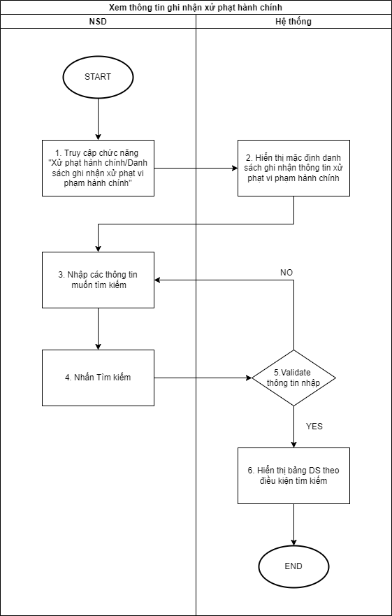

Bước

Mô tả

Bước 1

Truy cập chức năng "Xử phạt hành chính/Danh sách ghi nhận xử phạt vi phạm hành chính"

Bước 2

Hiển thị tất cả thông tin ghi nhận thông tin xử phạt vi phạm hành chính. Sắp xếp theo ngày văn bản từ gần nhất đến xa nhất.

Bước 3

Nhập các thông tin muốn tìm kiếm

Bước 4

Nhấn Tìm kiếm

Bước 5

Validate thông tin nhập. Nếu thông tin hợp lệ thì chuyển bước 6, nếu không hợp lệ hệ thống thông báo lỗi tại trường bị lỗi và quay lại bước 3

Bước 6

Hiển thị bảng DS theo điều kiện tìm kiếm. Kết thúc luồng.

Giao diện chức năng

Giao diện Tra cứu cơ bản

--	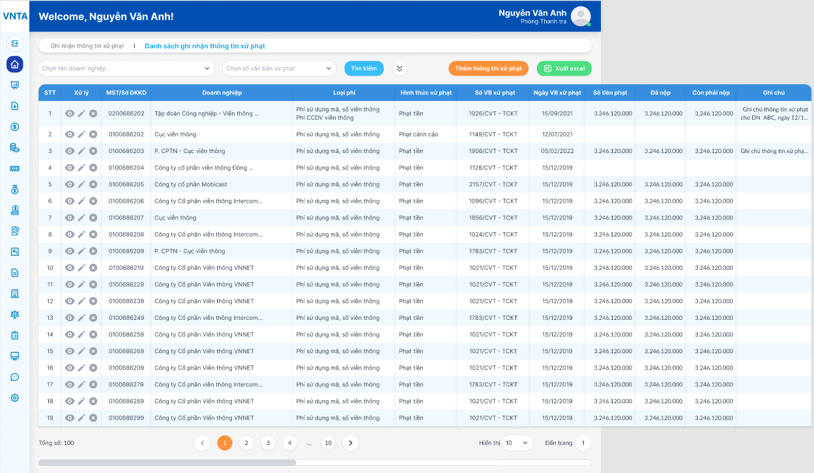

Giao diện Tra cứu nâng cao

--	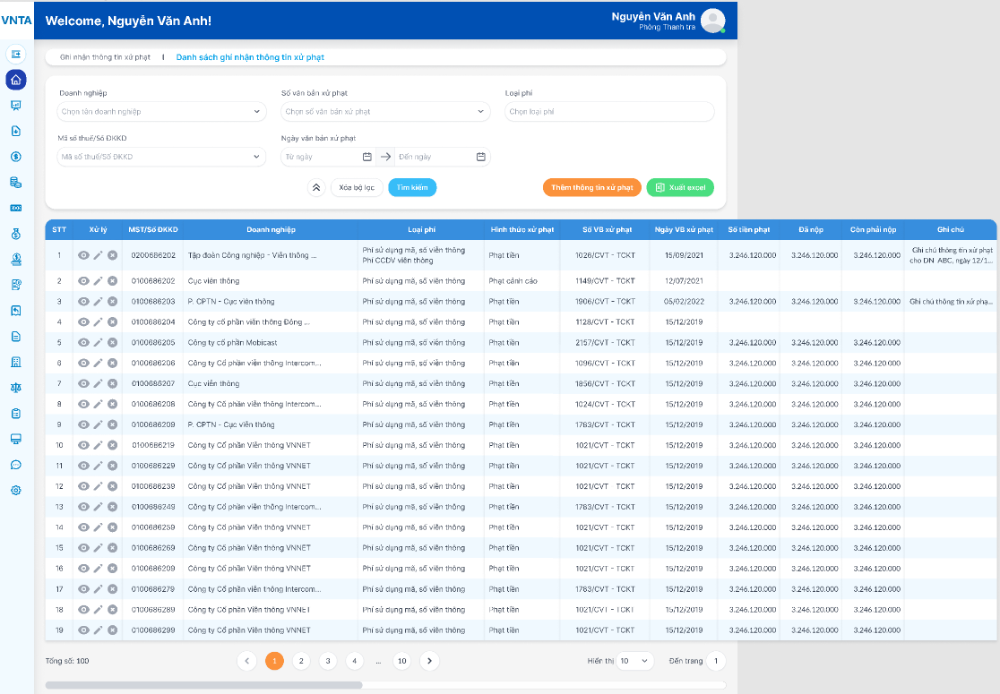

STT

Thông tin

Kiểu dữ liệu

Bắt buộc

Mô tả

Database

1

Tra cứu cơ bản

Tra cứu cơ bản

Tra cứu cơ bản

Tra cứu cơ bản

Tra cứu cơ bản

1.1

Chọn tên doanh nghiệp

Combobox search

- Hiển thị tất cả các doanh nghiệp có trên hệ thống.

- Sắp xếp các lựa chọn theo mã định danh.

- Cho phép chọn 1/nhiều DN.

1.2

Chọn số văn bản xử phạt

Combobox search

- Hiển thị tất cả các số VB xử phạt trên hệ thống. Sắp xếp theo thời gian cập nhật từ gần nhất đến xa nhất.

Cho phép 1/nhiều số văn bản xử phạt.

2

Tra cứu nâng cao

Tra cứu nâng cao

Tra cứu nâng cao

Tra cứu nâng cao

Tra cứu nâng cao

2.1

Chọn tên doanh nghiệp

Combobox search

- Hiển thị tất cả các doanh nghiệp có trên hệ thống.

- Sắp xếp các lựa chọn theo mã định danh.

- Cho phép chọn 1/nhiều DN.

2.2

Mã số thuế/Số ĐKKD

Combobox search

- Cho phép chọn 1/nhiều MST

2.3

Chọn số văn bản xử phạt

Combobox search

- Hiển thị tất cả các số VB xử phạt trên hệ thống. Sắp xếp theo thời gian cập nhật từ gần nhất đến xa nhất.

Cho phép 1/nhiều số văn bản xử phạt.

2.4

Ngày văn bản xử phạt

Datepicker

Cho phép chọn ngày văn bản

2.5

Loại phí

Combobox search

Cho phép chọn 1, nhiều loại phí, lệ phí.

Bao gồm:

- Phí sử dụng mã, số viễn thông

- Phí CCDV viễn thông

- Phí TLM viễn thông công cộng

- Phí TLM viễn thông dùng riêng

- Phí thử nghiệm mạng và dịch vụ viễn thông

- Phí lắp đặt cáp viễn thông trên biển

- Phí sửa chữa, bảo dưỡng cáp viễn thông trên biển.

- Lệ phí cấp phép

- Lệ phí phân bổ mã, số viễn thông

3

Xóa bộ lọc

button

Nhấn [Xóa bộ lọc], hệ thống xóa toàn bộ dữ liệu tiêu chí tìm kiếm đã nhập, giữ nguyên kết quả tìm kiếm

4

Tìm kiếm

button

Nhấn để tìm kiếm theo các điều kiện tìm kiếm

5

Thêm thông tin xử phạt

button

Nhấn để hiển thị màn thêm mới thông tin xử phạt vi phạm hành chính

6

Xuất excel

button

Cho phép người dùng xuất file excel bảng danh sách đang hiển thị.

File gồm các cột giống trên giao diện (trừ cột xử lý), tiêu đề của sheet là Danh sách Ghi nhận thông tin xử phạt vi phạm hành chính, tên file: [Ngày xuất]_Danh sách Ghi nhận thông tin xử phạt vi phạm hành chính.

7

Grid

Grid

Grid

Grid

Grid

7.1

STT

Text

Hiển thị STT

7.2

Xử lý

Có 3 button: Xem chi tiết, Chỉnh sửa, Xóa.

Nhấn Xem chi tiết => hiển thị màn Xem chi tiết

Nhấn Chỉnh sửa => hiển thị màn Chỉnh sửa thông tin

Nhấn Xóa => hiển thị popup xác nhận Xóa

7.3

MST/Số ĐKKD

Text

Hiển thị MST/Số ĐKKD của DN

7.4

Doanh nghiệp

Text

Hiển thị tên DN

7.5

Loại phí

Text

Hiển thị các loại phí đi theo từng văn bản xử phạt, mỗi dòng 1 loại phí.

7.6

Hình thức xử phạt

Text

Hiển thị tên hình thức xử phạt

7.7

Số VB xử phạt

Text

Hiển thị số VB xử phạt

7.8

Ngày VB xử phạt

date

Hiển thị ngày VB xử phạt, định dạng hiển thị dd/mm/yyyy.

7.9

Số tiền phạt

Currency

Hiển thị số tiền phạt.

Nếu là hình thức khác hình thức Phạt tiền thì bỏ trống.

Số tiền phạt hiển thị ngăn cách hàng nghìn bằng dấu “.” Mặc định đơn vị tiền VNĐ.

7.10

Đã nộp

Currency

Hiển thị số tiền phạt đã nộp.

Nếu là hình thức khác hình thức Phạt tiền thì bỏ trống.

Số tiền đã nộp hiển thị ngăn cách hàng nghìn bằng dấu “.” Mặc định đơn vị tiền VNĐ.

7.11

Còn phải nộp

Currency

Hiển thị số tiền còn phải nộp.

Nếu là hình thức khác hình thức Phạt tiền thì bỏ trống.

Số tiền đã nộp hiển thị ngăn cách hàng nghìn bằng dấu “.” Mặc định đơn vị tiền VNĐ.

7.12

Ghi chú

Text

Hiển thị thông tin ghi chú. Trường hợp thông tin vượt quá độ rộng cột, khi thu nhỏ cột thì cắt bớt chữ và tự ẩn bằng “ ...”

8

Phân trang

Phân trang

Phân trang

Phân trang

Phân trang

8.1

Tổng số bản ghi

Text

Hiển thị tổng số bản ghi theo điều kiện tìm kiếm

8.2

Phân trang

Button

Gồm các button: Về trang trước đó, 1, 2, 3, 4, 5 (nếu ít trang hơn sẽ tự cắt bớt), trang sau đó

8.3

Số bản ghi trên 1 trang

Combobox

Gồm:

10/trang

20/trang

50/trang

100/trang

Mặc định 10 bản ghi trên 1 trang

8.4

Đến trang

Text

- Nhập số trang => hệ thống nhảy đến dữ liệu trang tương ứng

Giao diện popup xác nhận Xóa

--	

--	Mô tả tương tự như các popup xác nhận xóa trước.

Xem chi tiết thông tin xử phạt vi phạm hành chính

Luồng chức năng

--		Thông tin chung

Tên chức năng

Xem chi tiết thông tin xử phạt vi phạm hành chính

Mô tả

Chức năng cho phép người sử dụng Xem chi tiết thông tin xử phạt vi phạm hành chính.

Tác nhân

P. KHTC, P. Thanh tra

Điều kiện trước

Đăng nhập vào hệ thống, có phân quyền chức năng

Điều kiện sau

	Xem được thông tin chi tiết của xử phạt vi phạm hành chính.

Ngoại lệ

N/A

Các yêu cầu đặc biệt

N/A

--	Luồng chức năng

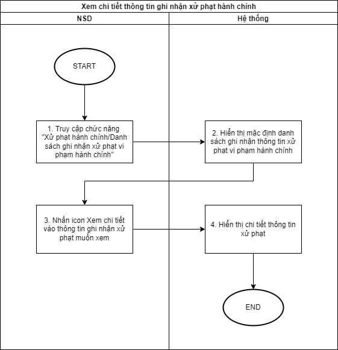

Bước

Mô tả

Bước 1

Truy cập chức năng "Xử phạt hành chính/Danh sách ghi nhận xử phạt vi phạm hành chính"

Bước 2

Hiển thị tất cả thông tin ghi nhận thông tin xử phạt vi phạm hành chính. Sắp xếp theo ngày văn bản từ gần nhất đến xa nhất.

Bước 3

Nhấn icon Xem chi tiết vào thông tin xử phạt muốn xem

Bước 4

Hiển thị chi tiết thông tin xử phạt vi phạm hành chính NSD cần xem.

Giao diện chức năng

Giao diện Xem chi tiết hình thức phạt tiền

--	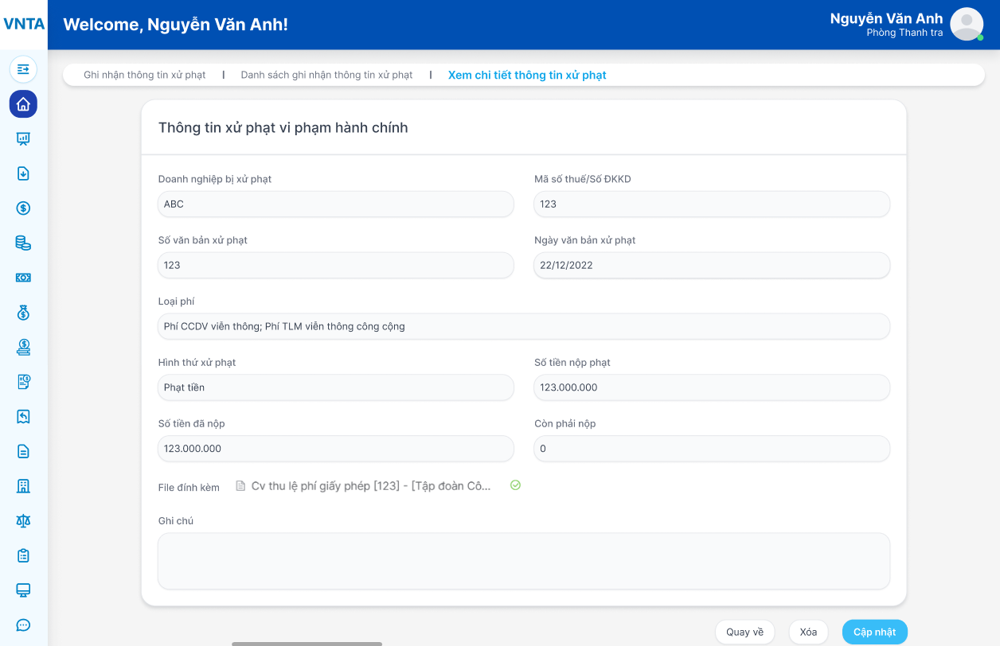

--

Giao diện Xem chi tiết hình thức cảnh cáo, hình thức khác

--	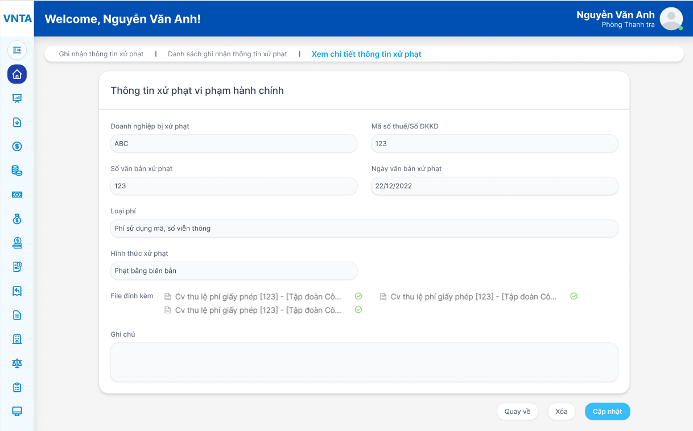

STT

Thông tin

Kiểu dữ liệu

Bắt buộc

Mô tả

Database

1

Doanh nghiệp bị xử phạt

Text

Hiển thị tên DN

2

Mã số thuế/Số ĐKKD

Text

Hiển thị MST/Số ĐKKD

3

Số văn bản xử phạt

Text

Hiển thị Số văn bản xử phạt

4

Ngày văn bản xử phạt

Date

Hiển thị Ngày văn bản xử phạt

5

Loại phí

Text

Hiển thị các Loại phí

6

Hình thức xử phạt

Text

Hiển thị Hình thức xử phạt

7

Số tiền nộp phạt

Currency

Hiển thị trường này nếu là hình thức Phạt tiền, nếu không ẩn đi.

8

Số tiền đã nộp

Currency

Hiển thị trường này nếu là hình thức Phạt tiền, nếu không ẩn đi.

9

Còn phải nộp

Currency

Hiển thị trường này nếu là hình thức Phạt tiền, nếu không ẩn đi.

10

File đính kèm

Hiển thị file đính kèm.

Mỗi dòng 2 file đính kèm (nếu nhiều file).

11

Ghi chú

Text

Hiển thị nội dung ghi chú.

12

Quay về

button

Nhấn để quay lại màn danh sách đang tìm kiếm trước đó.

13

Xóa

button

Nhấn để hiển thị popup xác nhận Xóa.

14

Cập nhật

button

Nhấn để hiển thị màn Cập nhật thông tin xử phạt vi phạm hành chính.

Báo cáo thống kê

Báo cáo công nợ phí, lệ phí khó đòi tính đến ngày

Luồng chức năng

--		Thông tin chung

Tên chức năng

Xem báo cáo công nợ phí, lệ phí khó đòi tính đến ngày

Mô tả

Chức năng cho phép người sử dụng xem, tra cứu Báo cáo công nợ, lệ phí khó đòi tính đến ngày bất kỳ

Tác nhân

P. KHTC

Điều kiện trước

Đăng nhập vào hệ thống, có phân quyền chức năng

Điều kiện sau

	Xem, tra cứu báo cáo thành công

Ngoại lệ

N/A

Các yêu cầu đặc biệt

N/A

--	Luồng chức năng

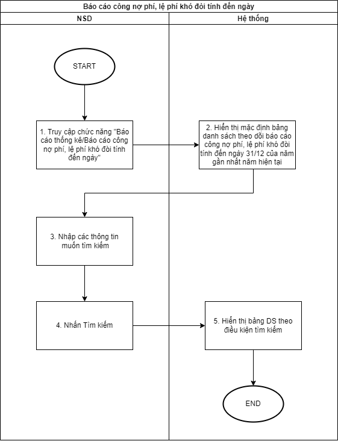

Bước

Mô tả

Bước 1

Truy cập chức năng "Báo cáo thống kê/Báo cáo công nợ phí, lệ phí khó đòi tính đến ngày"

Bước 2

Hiển thị mặc định bảng danh sách theo dõi báo cáo công nợ phí, lệ phí khó đòi tính đến ngày 31/12 của năm gần nhất năm hiện tại

Bước 3

Nhập các thông tin muốn tìm kiếm

Bước 4

Nhấn Tìm kiếm

Bước 5

Hiển thị bảng DS theo điều kiện tìm kiếm. Kết thúc luồng.

Giao diện chức năng

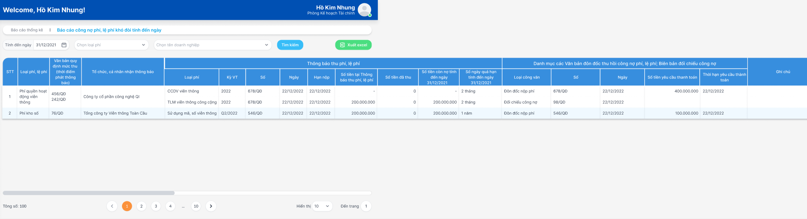

STT

Thông tin

Kiểu dữ liệu

Bắt buộc

Mô tả

Database

1

Tra cứu

Tra cứu

Tra cứu

Tra cứu

Tra cứu

1.1

Tính đến ngày

datepicker

x

Mặc định là ngày 31/12 của năm trước năm hiện tại.

Cho phép chọn lại ngày. Chặn không cho chọn ngày tương lai.

1.2

Chọn loại phí

Combobox search

Cho phép chọn 1 hoặc nhiều loại phí, mặc định không chọn là chọn tất cả.

Bao gồm, theo thứ tự:

- Phí CCDV viễn thông

- Phí TLM viễn thông công cộng

- Phí sử dụng mã, số viễn thông

- Phí TLM viễn thông dùng riêng

- Phí thử nghiệm mạng và dịch vụ viễn thông

- Phí sửa chữa cáp viễn thông trên biển

- Lệ phí cấp phép

- Lệ phí phân bổ mã, số viễn thông

1.3

Chọn tên doanh nghiệp

Combobox search

- Cho phép chọn 1 hoặc nhiều DN có GP/QĐ trên hệ thống. Autocomplete.

- Không chọn mặc định chọn tất cả.

- Sắp xếp các option theo thứ tự Mã định danh tăng dần (quy định ngầm trong hệ thống khi thêm mới)

1.4

Tìm kiếm

button

Nhấn, hệ thống tổng hợp báo cáo theo dữ liệu đang tìm kiếm.

1.5

Xuất excel

button

Nhấn, hệ thống xuất báo cáo theo tiêu chí đang tìm kiếm dưới dạng file excel.

File gồm các cột giống trên giao diện, tiêu đề của sheet là Báo cáo công nợ phí, lệ phí khó đòi tính đến ngày …, tên file: [Ngày xuất]_ Báo cáo công nợ phí, lệ phí khó đòi tính đến ngày…

2

Grid

Grid

Grid

Grid

Grid

2.1

STT

Text

Hiển thị số thứ tự tính theo đầu loại phí, lệ phí

2.2

Loại phí, lệ phí

Text

Hiển thị tên phí, gồm:
- Phí quyền hoạt động viễn thông

- Phí kho số

2.3

Văn bản quy định mức thu
(thời điểm phát thông báo)

Text

Liệt kê các văn bản quy định mức thu áp dụng đối với các khoản công nợ phí, lệ phí đang liệt kê.

Ví dụ: Nếu có công nợ phí CCDV từ Năm 2019, thì liệt kê VB quy định áp dụng trong năm 2019.

2.4

Tổ chức, cá nhân nhận thông báo

Text

Tên DN

Thông báo thu phí, lệ phí: dữ liệu lấy từ chức năng Quản lý công văn

Thông báo thu phí, lệ phí: dữ liệu lấy từ chức năng Quản lý công văn

Thông báo thu phí, lệ phí: dữ liệu lấy từ chức năng Quản lý công văn

Thông báo thu phí, lệ phí: dữ liệu lấy từ chức năng Quản lý công văn

Thông báo thu phí, lệ phí: dữ liệu lấy từ chức năng Quản lý công văn

2.5

Loại phí

Text

Tương ứng với mỗi DN, hiển thị tên các loại phí còn nợ:

Đối với phí quyền hoạt động viễn thông, hiển thị các loại phí:

- CCDV viễn thông

- TLM viễn thông công cộng

- TLM viễn thông dùng riêng

- Thử nghiệm mạng và dịch vụ viễn thông

- Sửa chữa, bảo dưỡng cáp viễn thông

- Lệ phí cấp phép

Đối với phí kho số, hiển thị các loại phí:

- Phí sử dụng mã, số viễn thông

- Lệ phí phân bổ mã, số viễn thông

Chỉ hiển thị các loại phí còn nợ.

2.6

Kỳ VT

date

Đối với phí quyền, chỉ hiển thị các khoản nợ theo kỳ Năm, không hiển thị khoản nợ theo kỳ Quý.

Đối với phí kho số, hiển thị theo kỳ Quý.

Hiển thị lần lượt các kỳ viễn thông từ gần nhất đến xa nhất.

2.7

Số

Text

Hiển thị số công văn của CV thông báo tương ứng với loại phí, kỳ VT.

2.8

Ngày

date

Hiển thị ngày công văn trong CV thông báo.

2.9

Hạn nộp

date

Hiển thị hạn nộp phí tương ứng với từng CV thông báo

2.10

Số tiền tại Thông báo thu phí, lệ phí

Currency

Hiển thị số tiền phải nộp của loại phí trong kỳ tương ứng.

Đối với phí CCDV để dấu “-” (vì khi xuất công văn thông báo không có số tiền).

2.11

Số tiền đã thu

Currency

Hiển thị số tiền đã thu tương ứng. Nếu DN chưa nộp thì hiển thị = 0

2.12

Số tiền còn nợ tính đến ngày….

Currency

= Số tiền tại thông báo – Số tiền đã thu

Đối với phí CCDV thì tính như sau:

= Số phải nộp – Số tiền đã thu

Trong đó: Số phải nộp nếu chưa có BCDT thì lấy số tối thiểu, nếu đã có BCDT tính tương tự như màn Theo dõi thu phí CCDV.

2.13

Số ngày quá hạn tính đến ngày….

Text

Hiển thị số ngày quá hạn tính từ ngày hạn nộp phí của công văn thông báo nộp phí đến mốc “Tính đến ngày” NSD tra cứu.

--	Từ 1 – 30 ngày hiển thị dạng ngày. VD: 1 ngày

--	> 30 ngày hiển thị dạng tháng (1 tháng = 30 ngày). VD: 1 tháng

--	> 12 tháng hiển thị dạng năm (1 năm = 12 tháng). VD: 1 năm

Danh mục các Văn bản đôn đốc thu hồi công nợ phí, lệ phí; Biên bản đối chiếu công nợ

Danh mục các Văn bản đôn đốc thu hồi công nợ phí, lệ phí; Biên bản đối chiếu công nợ

Danh mục các Văn bản đôn đốc thu hồi công nợ phí, lệ phí; Biên bản đối chiếu công nợ

Danh mục các Văn bản đôn đốc thu hồi công nợ phí, lệ phí; Biên bản đối chiếu công nợ

Danh mục các Văn bản đôn đốc thu hồi công nợ phí, lệ phí; Biên bản đối chiếu công nợ

2.14

Loại công văn

Text

- Được đồng bộ dữ liệu từ chức năng “Quản lý công văn”

- Bao gồm:

+ Đôn đốc nộp phí: liệt kê các CV đôn đốc đã từng đôn đốc 1 hoặc nhiều kỳ viễn thông đang còn dư nợ trong báo cáo hiện tại.

+ Đối chiếu công nợ.

2.15

Số

Text

Hiển thị số công văn tương ứng với từng loại công văn

2.16

Ngày

date

Hiển thị ngày công văn tương ứng với từng loại công văn

2.17

Số tiền yêu cầu thanh toán

Currency

Đối với CV đôn đốc phí quyền, hiển thị số tiền tổng “Còn phải nộp” của CCDV và TLM; CV đôn đốc phí kho số hiển thị số “Còn phải nộp” tổng cộng của tất cả các kỳ trong công văn đôn đốc đó.

Đối chiếu công nợ bỏ trống cột này.

2.18

Thời hạn yêu cầu thành toán

date

Hiển thị thời hạn yêu cầu thanh toán fill theo hạn nộp phí trên công văn thông báo nộp phí và công văn đôn đốc nộp phí.

Đối chiếu công nợ bỏ trống cột này.

2.19

Ghi chú

Bỏ trống

2.10

Tổng cộng

Currency

Tổng “Số tiền đã thu”, “Số tiền còn nợ tính đến ngày” của Phí quyền, Phí kho số.

Báo cáo công nợ, lệ phí khó đòi chi tiết theo đối tượng

Luồng chức năng

Thông tin chung

Tên chức năng

Xem báo cáo công nợ, lệ phí khó đòi chi tiết theo đối tượng.

Mô tả

Chức năng cho phép xem danh sách báo cáo công nợ, lệ phí khó đòi chi tiết của các doanh nghiệp còn nợ phí.

Tác nhân

Lãnh đạo, Cán bộ Phòng KHTC, Phòng CPTN, Phòng Kinh tế

Điều kiện trước

Đăng nhập vào hệ thống, có phân quyền chức năng

Điều kiện sau

Xem, tìm kiếm tra cứu được báo cáo công nợ, lệ phí khó đòi chi tiết theo đối tượng theo từng thời gian cụ thể

Ngoại lệ

N/A

Các yêu cầu đặc biệt

N/A

--	Luồng chức năng

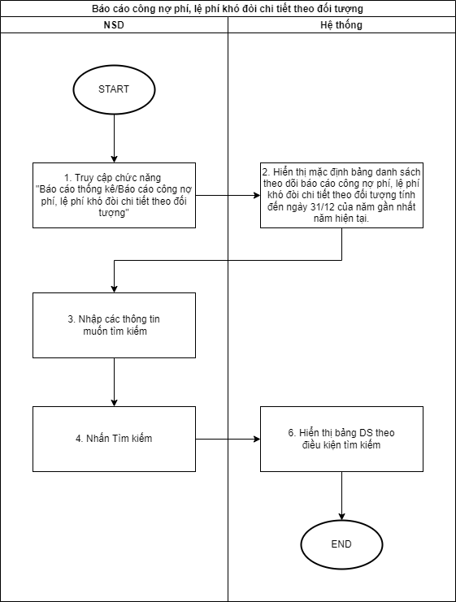

Bước

Mô tả

Bước 1

Truy cập chức năng "Báo cáo thống kê/Báo cáo công nợ phí, lệ phí khó đòi chi tiết theo đối tượng"

Bước 2

Hiển thị mặc định bảng danh sách theo dõi báo cáo công nợ phí, lệ phí khó đòi chi tiết theo đối tượng tính đến ngày 31/12 của năm gần nhất năm hiện tại.

Bước 3

Nhập các thông tin muốn tìm kiếm

Bước 4

Nhấn Tìm kiếm

Bước 5

Hiển thị bảng DS theo điều kiện tìm kiếm. Kết thúc luồng.

Giao diện chức năng

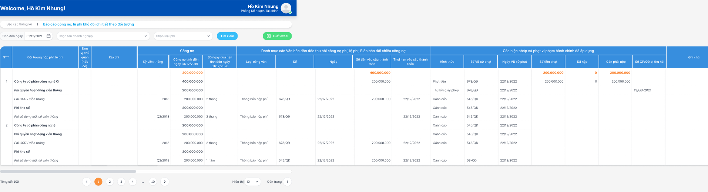

STT

Tên

Kiểu

dữ liệu

Bắt buộc

Mô tả

Database

1

Tra cứu báo cáo công nợ, lệ phí khó đòi chi tiết theo đối tượng

Tra cứu báo cáo công nợ, lệ phí khó đòi chi tiết theo đối tượng

Tra cứu báo cáo công nợ, lệ phí khó đòi chi tiết theo đối tượng

Tra cứu báo cáo công nợ, lệ phí khó đòi chi tiết theo đối tượng

Tra cứu báo cáo công nợ, lệ phí khó đòi chi tiết theo đối tượng

1.1

Tính đến ngày

datepicker

x

Mặc định là ngày 31/12 của năm trước năm hiện tại.

Cho phép chọn lại ngày. Chặn không cho chọn ngày tương lai.

1.2

Chọn tên doanh nghiệp

Combobox search

- Cho phép chọn 1 hoặc nhiều DN có GP/QĐ trên hệ thống.

- Không chọn mặc định chọn tất cả.

- Sắp xếp các option theo thứ tự Mã định danh tăng dần (quy định ngầm trong hệ thống khi thêm mới)

1.3

Chọn loại phí

Combobox search

Cho phép chọn 1 hoặc nhiều loại phí, mặc định không chọn là chọn tất cả.

Bao gồm, theo thứ tự:

- Phí CCDV viễn thông

- Phí TLM viễn thông công cộng

- Phí sử dụng mã, số viễn thông

- Phí TLM viễn thông dùng riêng

- Phí thử nghiệm mạng và dịch vụ viễn thông

- Phí sửa chữa cáp viễn thông trên biển

- Lệ phí cấp phép

- Lệ phí phân bổ mã, số viễn thông

1.4

Tìm kiếm

Button

Nhấn => hệ thống kiểm tra tính chính xác của dữ liệu tìm kiếm và đưa ra kết quả tại bảng dưới.

1.5

Xuất excel

Button

Nhấn => hệ thống tải về file excel bao gồm danh sách báo cáo công nợ, lệ phí khó đòi chi tiết theo từng đối tượng mà NSD đang tìm kiếm.

File gồm các cột giống trên giao diện, tiêu đề của sheet là Báo cáo công nợ, lệ phí khó đòi chi tiết theo đối tượng tính đến ngày …, tên file: [Ngày xuất]_ Báo cáo công nợ, lệ phí khó đòi chi tiết theo đối tượng tính đến ngày …

3

Bảng theo dõi báo cáo công nợ, lệ phí khó đòi theo đối tượng tính đến ngày…

Grid danh sách

Bảng theo dõi báo cáo công nợ, lệ phí khó đòi theo đối tượng tính đến ngày…

Grid danh sách

Bảng theo dõi báo cáo công nợ, lệ phí khó đòi theo đối tượng tính đến ngày…

Grid danh sách

Bảng theo dõi báo cáo công nợ, lệ phí khó đòi theo đối tượng tính đến ngày…

Grid danh sách

Bảng theo dõi báo cáo công nợ, lệ phí khó đòi theo đối tượng tính đến ngày…

Grid danh sách

1

STT

Number

Số thứ tự

2

Đối tượng nộp phí, lệ phí

Text

Hiển thị tên doanh nghiệp và liệt kê các loại phí/lệ phí còn nợ tương ứng mỗi DN, gồm:

- CCDV viễn thông

- TLM viễn thông công cộng

- TLM viễn thông dùng riêng

- Thử nghiệm mạng và dịch vụ viễn thông

- Phí sử dụng mã, số viễn thông

- Sửa chữa, bảo dưỡng cáp viễn thông

- Lệ phí cấp phép

- Lệ phí phân bổ mã, số viễn thông

3

Đơn vị chủ quản (nếu có)

Text

Hệ thống không có dữ liệu => Để trống đơn vị chủ quản. Sau khi xuất excel thì NSD tự thêm đơn vị chủ quản (nếu có)

4

Địa chỉ

Text

Hiển thị địa chỉ kinh doanh của doanh nghiệp.

Công nợ

Công nợ

Công nợ

Công nợ

Công nợ

5

Kỳ viễn thông

Date

Hiển thị lần lượt các kỳ viễn thông từ gần nhất đến xa nhất của các khoản nợ.

6

Công nợ tính đến ngày 31/12/…

Currency

Hiển thị số tiền còn nợ của từng loại phí tính đến ngày 31/12 của năm gần nhất trước đó.

7

Công nợ tính đến ngày…

Currency

Chỉ hiển thị cột này khi chọn “Tính đến ngày” khác ngày 31/12.

Hiển thị công nợ tính đến ngày được chọn trên thanh tìm kiếm.

8

Số ngày quá hạn tính đến ngày…

Text

Hiển thị số ngày quá hạn tính từ ngày hạn nộp phí của công văn thông báo nộp phí đến mốc “Tính đến ngày” NSD tra cứu.

• Từ 1 – 30 ngày hiển thị dạng ngày. VD: 1 ngày

• > 30 ngày hiển thị dạng tháng (1 tháng = 30 ngày). VD: 1 tháng

• > 12 tháng hiển thị dạng năm (1 năm = 12 tháng). VD: 1 năm

Danh mục các Văn bản đôn đốc thu hồi công nợ phí, lệ phí; Biên bản đối chiếu công nợ

Danh mục các Văn bản đôn đốc thu hồi công nợ phí, lệ phí; Biên bản đối chiếu công nợ

Danh mục các Văn bản đôn đốc thu hồi công nợ phí, lệ phí; Biên bản đối chiếu công nợ

Danh mục các Văn bản đôn đốc thu hồi công nợ phí, lệ phí; Biên bản đối chiếu công nợ

Danh mục các Văn bản đôn đốc thu hồi công nợ phí, lệ phí; Biên bản đối chiếu công nợ

9

Loại công văn

Text

- Được đồng bộ dữ liệu từ chức năng “Quản lý công văn”

- Bao gồm:

+ Thông báo nộp phí

+ Đôn đốc nộp phí: liệt kê các CV đôn đốc đã từng đôn đốc 1 hoặc nhiều kỳ viễn thông đang còn dư nợ trong báo cáo hiện tại.

+ Đối chiếu công nợ.

10

Số

Text

Hiển thị số công văn tương ứng từng loại công văn.

11

Ngày

Text

Hiển thị ngày công văn tương ứng với từng loại công văn.

12

Số tiền yêu cầu thanh toán

Currency

Đối với công văn thông báo, hiển thị số tiền phải nộp tương ứng với mỗi loại phí trong từng kỳ viễn thông. Phí CCDV nếu chưa có BCDT thì để dấu “-”.

Đối với CV đôn đốc phí quyền, hiển thị số tiền tổng “Còn phải nộp” của CCDV và TLM; CV đôn đốc phí kho số hiển thị số “Còn phải nộp” tổng cộng của tất cả các kỳ trong công văn đôn đốc đó.

Đối chiếu công nợ bỏ trống cột này.

13

Thời hạn yêu cầu thanh toán

Date

Hiển thị thời hạn yêu cầu thanh toán fill theo hạn nộp phí trên công văn thông báo nộp phí và công văn đôn đốc nộp phí.

Các biện pháp xử phạt vi phạm hành chính đã áp dụng

Các biện pháp xử phạt vi phạm hành chính đã áp dụng

Các biện pháp xử phạt vi phạm hành chính đã áp dụng

Các biện pháp xử phạt vi phạm hành chính đã áp dụng

Các biện pháp xử phạt vi phạm hành chính đã áp dụng

14

Hình thức

Text

Hiển thị các hình thức xử phạt vi phạm hành chính có ngày văn bản ban hành trong năm đang tìm kiếm. Đồng bộ dữ liệu từ chức năng “Ghi nhận thông tin xử phạt”

VD: Tính đến ngày thuộc năm 2021, hiển thị tất cả biện pháp xử phạt có ngày văn bản trong năm 2021.

15

Số VB xử phạt

Text

Hiển thị số văn bản xử phạt tương ứng

16

Ngày VB xử phạt

Date

Hiển thị ngày văn bản xử phạt tương ứng

17

Số tiền phạt

Currency

Hiển thị số tiền phạt doanh nghiệp phải nộp tương ứng với hình thức Phạt tiền.

Định dạng: Dấu “.” ngăn cách hàng nghìn

Nếu chưa có dữ liệu hiển thị dấu “-”

18

Đã nộp

Currency

Hiển thị số tiền phạt DN đã nộp.

Nếu chưa có dữ liệu hiển thị số 0

Định dạng: Dấu “.” ngăn cách hàng nghìn

19

Còn phải nộp

Currency

Hiển thị số tiền phạt doanh nghiệp còn phải nộp cho kỳ còn nợ = Số tiền phạt phải nộp – Số tiền phạt đã nộp.

Định dạng: Dấu “.” ngăn cách hàng nghìn

20

Số GP/QĐ bị thu hồi

Text

Hiển thị số GP/QĐ bị thu hồi có ngày quyết định thuộc năm đang tìm kiếm.

Fill theo dữ liệu phase 1 (liệt kê quyết định thu hồi trong năm đang tìm kiếm).

21

Ghi chú

Bỏ trống

Phân trang

Phân trang

Phân trang

Phân trang

Phân trang

22

Phân trang

button

Gồm các button: Về trang trước đó, 1, 2, 3 (nếu ít trang hơn sẽ tự cắt bớt), trang sau đó

23

Số bản ghi trên 1 trang

combobox

Gồm:

10/20/50/100

Mặc định 10 bản ghi trên 1 trang

24

Đến trang

Text

- Nhập số trang => hệ thống nhảy đến dữ liệu trang tương ứng

Báo cáo thống kê hoạt động doanh nghiệp theo năm

Luồng chức năng

Thông tin chung

Tên chức năng

Xem Báo cáo thống kê hoạt động doanh nghiệp theo năm.

Mô tả

Chức năng cho phép xem, tra cứu Báo cáo thống kê hoạt động doanh nghiệp theo từng năm cụ thể

Tác nhân

Lãnh đạo, Cán bộ Phòng KHTC, Phòng CPTN, Phòng Kinh tế

Điều kiện trước

Đăng nhập vào hệ thống, có phân quyền chức năng

Điều kiện sau

Xem, tìm kiếm được Báo cáo thống kê hoạt động doanh nghiệp theo từng năm.

Ngoại lệ

N/A

Các yêu cầu đặc biệt

N/A

--	Luồng chức năng

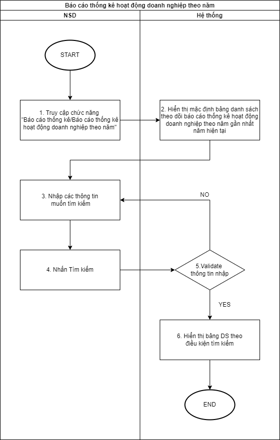

Bước

Mô tả

Bước 1

1. Truy cập chức năng "Báo cáo thống kê/Báo cáo thống kê hoạt động doanh nghiệp theo năm"

Bước 2

Hiển thị mặc định bảng danh sách theo dõi báo cáo công nợ phí, lệ phí khó đòi chi tiết theo đối tượng tính đến ngày 31/12 của năm gần nhất năm hiện tại.

Bước 3

Nhập các thông tin muốn tìm kiếm

Bước 4

Nhấn Tìm kiếm

Bước 5

Validate thông tin nhập.

Khi chọn cụ thể DN, không chọn loại phí: nếu DN ko có GP/QĐ nào trong năm hoặc không có công văn nào có ngày công văn phát sinh trong năm tìm kiếm => để trống từ cột Nội dung đến cột Số còn phải nộp.

Khi chọn cụ thể DN, chọn loại phí bất kì: nếu DN ko có GP/QĐ nào trong năm hoặc không có công văn nào có ngày công văn phát sinh trong năm tìm kiếm => để trống từ cột Loại giấy phép đến cột Số còn phải nộp.

Khi không chọn cụ thể DN nào, ko có GP/QĐ/công văn của loại phí nào trong năm tìm kiếm thì bảng hiển thị “không có dữ liệu”

Bước 6

Hiển thị bảng DS theo điều kiện tìm kiếm. Kết thúc luồng.

Giao diện chức năng

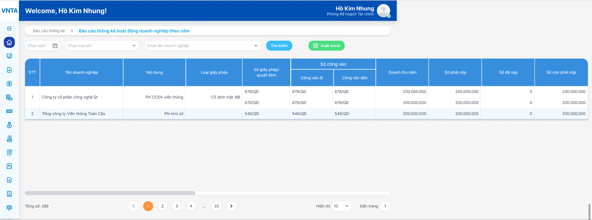

STT

Tên

Kiểu

dữ liệu

Bắt buộc

Mô tả

Database

1

Tra cứu

Tra cứu

Tra cứu

Tra cứu

Tra cứu

1.1

Chọn năm

datepicker

x

Mặc định là năm trước năm hiện tại.

Cho phép chọn lại năm. Chặn không cho chọn năm tương lai.

1.2

Chọn tên doanh nghiệp

Combobox search

- Cho phép chọn 1 hoặc nhiều DN có GP/QĐ trên hệ thống.

- Không chọn mặc định chọn tất cả.

- Sắp xếp các option theo thứ tự Mã định danh tăng dần (quy định ngầm trong hệ thống khi thêm mới)

1.3

Chọn loại phí

Combobox search

Cho phép chọn 1 hoặc nhiều loại phí, mặc định không chọn là chọn tất cả.

Bao gồm, theo thứ tự:

- Phí CCDV viễn thông

- Phí TLM viễn thông công cộng

- Phí sử dụng mã, số viễn thông

1.4

Tìm kiếm

Button

Nhấn => hệ thống kiểm tra tính chính xác của dữ liệu tìm kiếm và đưa ra kết quả tại bảng dưới.

1.5

Xuất excel

Button

Nhấn => hệ thống tải về file excel bao gồm danh sách báo cáo công nợ, lệ phí khó đòi chi tiết theo từng đối tượng mà NSD đang tìm kiếm.

File gồm các cột giống trên giao diện, tiêu đề của sheet là Báo cáo thống kê hoạt động doanh nghiệp theo năm…, tên file: [Ngày xuất]_ Báo cáo thống kê hoạt động doanh nghiệp theo năm …

2

Bảng theo dõi báo cáo công nợ, lệ phí khó đòi theo đối tượng tính đến ngày…

Grid danh sách

Bảng theo dõi báo cáo công nợ, lệ phí khó đòi theo đối tượng tính đến ngày…

Grid danh sách

Bảng theo dõi báo cáo công nợ, lệ phí khó đòi theo đối tượng tính đến ngày…

Grid danh sách

Bảng theo dõi báo cáo công nợ, lệ phí khó đòi theo đối tượng tính đến ngày…

Grid danh sách

Bảng theo dõi báo cáo công nợ, lệ phí khó đòi theo đối tượng tính đến ngày…

Grid danh sách

2.1

STT

Number

Số thứ tự

2.2

Tên doanh nghiệp

Text

Hiển thị tất cả tên các DN có GP/QĐ CCDV viễn thông, TLM viễn thông công cộng, kho số; hoặc các DN có công văn có ngày công văn phát sinh trong năm tìm kiếm.

2.3

Nội dung

Text

Hiển thị các loại phí tương ứng mỗi DN, gồm:

- CCDV viễn thông

- TLM viễn thông công cộng

- Phí sử dụng mã, số viễn thông.

2.4

Loại giấy phép

Text

Hiển thị loại giấy phép/quyết định CCDV viễn thông, TLM viễn thông công cộng, kho số trong năm tìm kiếm tương ứng với từng DN, từng loại phí.

2.5

Số giấy phép/
quyết định

Text

Hiển thị số giấy phép/quyết định CCDV viễn thông, TLM viễn thông công cộng, kho số trong năm tìm kiếm tương ứng với từng DN, từng loại phí.

3

Số công văn

Số công văn

Số công văn

Số công văn

Số công văn

3.1

Công văn đi

Text

Hiển thị các số công văn đi có ngày công văn phát sinh trong năm đang tìm kiếm.

Đồng bộ từ chức năng “Quản lý công văn”

3.2

Công văn đến

Text

Hiển thị các số công văn đến có ngày công văn phát sinh trong năm đang tìm kiếm.

Đồng bộ từ chức năng “Quản lý công văn”.

3.3

Doanh thu năm

Currency

Đối với phí CCDV, nếu chưa có BCDT để dấu

“-”

Đối với phí TLM và kho số để trống cột này.

3.4

Số phải nộp

Currency

Hiển thị số phải nộp theo loại phí và số GP/QĐ.

Đối với phí CCDV, nếu chưa có BCDT thì lấy theo mức tối thiểu năm.

3.5

Số đã nộp

Currency

Hiển thị số đã nộp theo biên lai phân bổ cho các phí.

Đối với phí CCDV thì lấy tổng biên lai phân bổ cho kỳ Quý và Năm của năm đang tìm kiếm.

Đối với phí kho số thì lấy tổng biên lai nộp cho tất cả các quý trong năm đang tìm kiếm.

Đối với phí TLM thì lấy các biên lai phân bổ cho năm đang tìm kiếm.

3.6

Số còn phải nộp

Currency

= Số phải nộp – Số đã nộp

4

Phân trang

Phân trang

Phân trang

Phân trang

Phân trang

4.1

Phân trang

button

Gồm các button: Về trang trước đó, 1, 2, 3 (nếu ít trang hơn sẽ tự cắt bớt), trang sau đó

4.2

Số bản ghi trên 1 trang

combobox

Gồm:

10/20/50/100

Mặc định 10 bản ghi trên 1 trang

4.3

Đến trang

Text

- Nhập số trang => hệ thống nhảy đến dữ liệu trang tương ứng

Đăng nhập – Đăng xuất

Đăng nhập

Luồng chức năng

Thông tin chung

Tên chức năng

Đăng nhập

Mô tả

Chức năng cho phép các tài khoản hợp lệ đăng nhập – đăng xuất vào sử dụng phần mềm.

Tác nhân

Lãnh đạo, Cán bộ Phòng KHTC, Phòng CPTN, Phòng Kinh tế.

Điều kiện trước

Điều kiện trước của đăng nhập là đã có tài khoản hợp lệ.

Điều kiện trước của đăng xuất là đang đăng nhập sử dụng phần mềm.

Điều kiện sau

Đăng nhập thành công.

Ngoại lệ

N/A

Các yêu cầu đặc biệt

N/A

--	Luồng chức năng

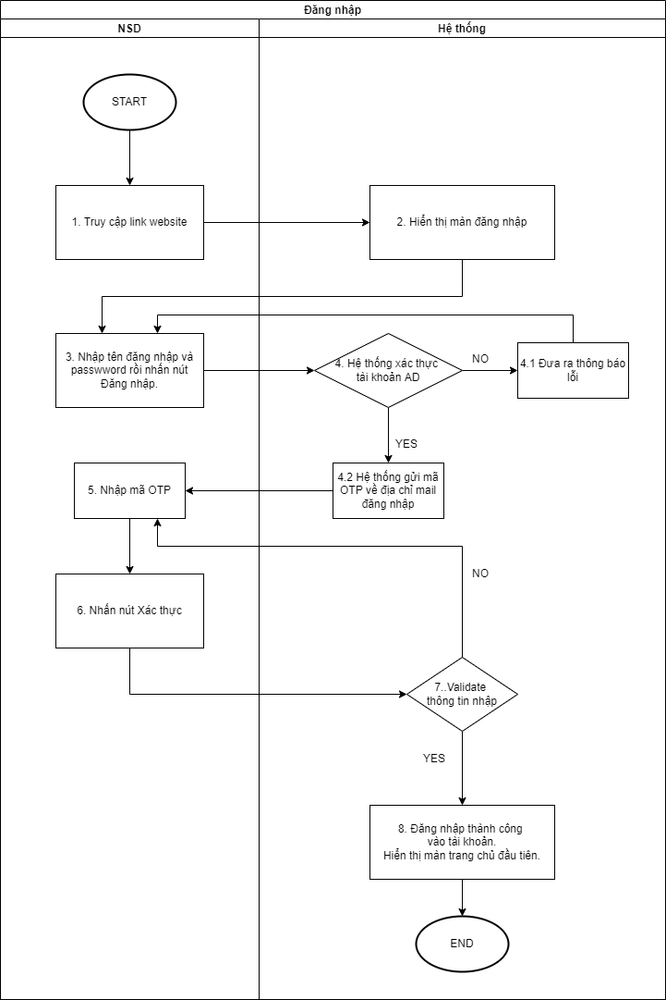

Bước

Mô tả

Bước 1

Truy cập link website

Bước 2

Hiển thị màn đăng nhập

Bước 3

Nhập tên đăng nhập và passwword rồi nhấn nút Đăng nhập.

Bước 4

Hệ thống xác thực giữa tài khoản AD + tài khoản đã được admin tạo mới trên hệ thống + tài khoản đang tiến hành đăng nhập. Nếu không phù hợp thì chuyển bước 4.1. Nếu phù hợp chuyển bước 5.

Bước 4.1

Hệ thống đưa ra thông báo lỗi.

Đối với tên tài khoản không hợp lệ hiển thị thông báo “Tài khoản không tồn tại!”

Đối với password sai hiển thị thông báo “Mật khẩu chưa chính xác. Vui lòng nhập lại!”

Bước 4.2

Hệ thống gửi mã OTP về địa chỉ mail đăng nhập. Đồng thời đưa ra thông báo: “Quý khách vui lòng nhập mã OTP đã được gửi về mail nhunght@vnta.com.vn”

Bước 5

NSD nhập mã OTP.

Bước 6

Nhấn nút Xác thực.

Bước 7

Validate thông tin nhập. Nếu chưa đúng báo lỗi xác thực “Mã xác thực không chính xác. Vui lòng nhập lại!”.

Thời gian hiệu lực mã OTP là 2 phút. Nếu đúng chuyển bước 8.

Bước 8

Đăng nhập thành công vào tài khoản.

Hiển thị màn trang chủ đầu tiên.

Giao diện chức năng

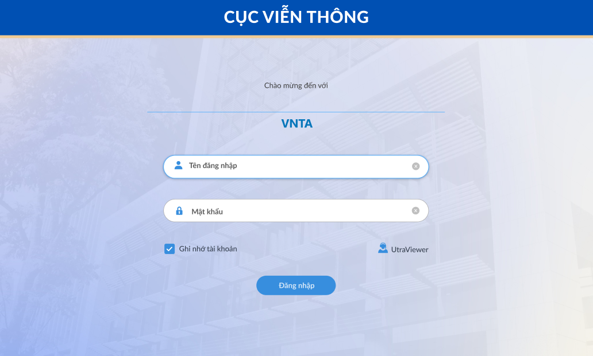

Giao diện xác thực OTP

--	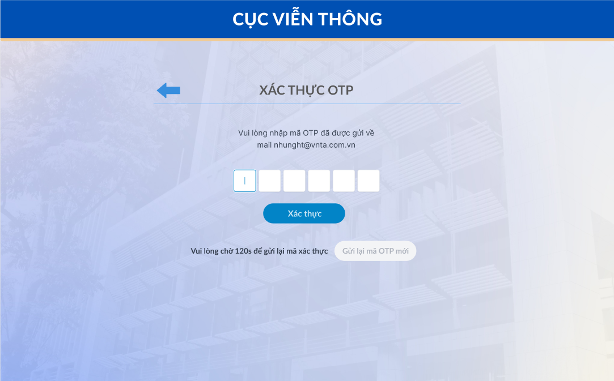

Giao diện khi đã hết hiệu lực gửi mã xác thực (120s)

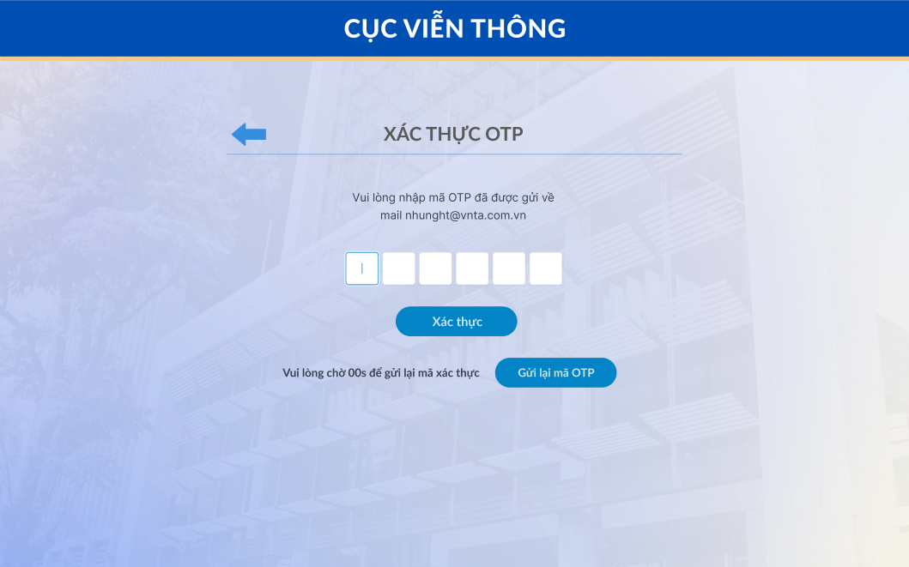

STT

Tên

Kiểu

dữ liệu

Bắt buộc

Mô tả

Database

1

Tên đăng nhập

Text

x

Nhập tên email, theo định dạng email.

Max-lenght 50 ký tự

2

Mật khẩu

Text

x

Nhập tạo password bao gồm có số, chữ cái, ký tự đặc biệt.

Max-lenght: 20 ký tự

3

Ghi nhớ tài khoản

Checkbox

Nếu tích chọn sẽ ghi nhớ “Tên đăng nhập” mỗi khi đăng xuất khỏi hệ thống.

4

Đăng nhập

button

Nhấn để tiến hành đăng nhập theo thông tin tên đăng nhập và mật khẩu.

Đăng nhập thành công khi:

- Tài khoản đã được thêm mới thành công trên phần mềm.

- Tài khoản có trên AD.

Đối với tên tài khoản không hợp lệ hiển thị thông báo “Tài khoản không tồn tại!”

Đối với password sai hiển thị thông báo “Mật khẩu chưa chính xác. Vui lòng nhập lại!”

Nếu tên tài khoản và mật khẩu hợp lệ thì chuyển qua màn Xác thực OTP.

5

Xác thực

button

Nhấn button Xác thực để tiến hành xác thực mã OTP. Nếu đúng thì đăng nhập thành công, truy cập vào màn hình trang chủ.

6

Gửi lại mã OTP

button

Mã OTP có hiệu lực trong 120s. Trong thời gian còn hiệu lực button này bị disable.

Hết hiệu lực cho phép NSD nhấn nút để gửi lại mã xác thực mới về mail + đồng thời clear mã OTP đang nhập trước đó.

7

Vui lòng chờ …s để gửi lại mã xác thực

Đếm ngược thời gian từ 120s về 00s để mở lock.

8

button

Nhấn nút quay lại để trở về màn đăng nhập trước đó (vẫn lưu thông tin đăng nhập).

Mã OTP sẽ hết hiệu lực kể từ thao tác ấn nút quay về này.

9

Đăng xuất

button

Nhấn để đăng xuất khỏi hệ thống. Quay về màn đăng nhập.

Đăng xuất

Luồng chức năng

Thông tin chung

Tên chức năng

Đăng xuất

Mô tả

Chức năng cho phép các tài khoản hợp lệ đăng xuất khỏi phần mềm.

Tác nhân

Lãnh đạo, Cán bộ Phòng KHTC, Phòng CPTN, Phòng Kinh tế.

Điều kiện trước

Điều kiện trước của đăng xuất là đang đăng nhập sử dụng phần mềm.

Điều kiện sau

Đăng xuất thành công.

Ngoại lệ

N/A

Các yêu cầu đặc biệt

N/A

--	Luồng chức năng

--	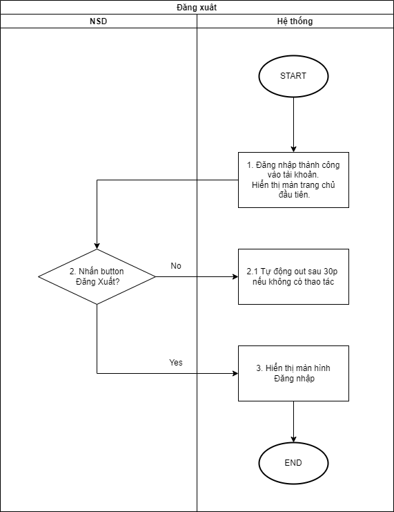

--

Bước

Mô tả

Bước 1

Hệ thống đăng nhập thành công vào tài khoản. Hiển thị màn Trang chủ đầu tiên

Bước 2

NSD nhấn button Đăng Xuất. Chuyển đến bước 3

Nếu không nhấn button Đăng Xuất. Chuyển đến bước 2.1

Bước 2.1

Hệ thống tự động out ra sau 30 phút nếu NSD không có thao tác trên hệ thống.

Bước 3

Hệ thống hiển thị màn hình Đăng nhập.

CÁC YÊU CẦU PHI CHỨC NĂNG

<Phần này dự án nào có loại yêu cầu thì viết, không có thì xoá section đi>

Yêu cầu bảo mật

[Bắt buộc]

[Guideline:

Đưa ra các yêu cầu về bảo mật:

--	Bảo mật hệ thống: các yêu cầu bảo mật hệ thống như khi triển khai hệ thống cần cài đặt firewall để bảo mật hoặc sử dụng CA.

--	Bảo mật dữ liệu: đối với các dữ liệu, đặc biệt là các dữ liệu quan trọng, nhạy cảm của hệ thống.Các dữ liệu này phải được mã hoá bảo mật chặt chẽ bằng thuật toán mã hoá tin cậy

--	Bảng phân mức độ nghiêm trọng các nguy cơ bảo mật, an toàn thông tin

]

[Ví dụ:

--	Chức năng ký duyệt văn bản phải sử dụng chữ ký số để đảm bảo bảo mật.

--	Các file attach upload lên server phải được mã hóa tên file.

--	Thông tin pass phải được mã hóa một chiều.

--	Bảng phân mức độ nghiêm trọng các nguy cơ bảo mật, an toàn thông tin

Mức độ

Nguy cơ

<Tùy thuộc vào mức bảo mật của hệ thống, đặc thù triển khai, người dùng sử dụng của hệ thống mà các nguy cơ sẽ chia vào các mức độ khác nhau>

Nghiêm trọng

<Các nguy cơ đặc biệt nghiêm trọng, xảy ra hậu quả nghiêm trọng >

Ví dụ:

Với hệ thống quản lý văn bản Voffice

--	Nguy cơ đọc được văn bản không được quyền đọc.

Với hệ thống trang chủ Viettel:

--	Nguy cơ deface trang chủ. Lỗi XSS

--	Nguy cơ upload file trái phép lên trang tin.

Cao

<Các nguy cơ nghiêm trọng, nếu xảy ra hậu quả cao>

Ví dụ:

Với hệ thống nội bộ:

--	Các nguy cơ chiếm quyền điều khiển hệ thống

Với các hệ thống public:

--	Các lỗi lộ thông tin hệ thống, lộ thông tin người dùng, lỗi cho phép liệt kê người dùng ,...

Trung bình

<Các nguy cơ trung bình, có khả năng xảy ra>

Thấp

<Các nguy cơ thấp,  khả năng xảy ra thấp>

]

Yêu cầu sao lưu

[Guideline:

--	Liệt kê các yêu cầu sao lưu của KH (khi đi khảo sát cán bộ khảo sát cần trao đổi với KH về nhu cầu sao lưu).

--	Nếu KH không đưa ra yêu cầu thì ghi rõ là “Khách hàng không có yêu cầu sao lưu” chứ không được để N/A.

--	Về cơ bản có thể một số yêu cầu sao lưu của KH không liên quan đến chức năng của hệ thống. Nhưng cần phải ghi lại trong PTYC để khi định cỡ hệ thống (dung lượng ổ cứng lưu trữ) cũng cần tính toán đến tham số này.

]

[Ví dụ:

--	Thời gian sao lưu của các file CDR là 6 tháng.

--	Các file người dùng attach lên được sao lưu định kỳ theo tháng.

]

Giao diện chức năng

--	Giao diện popup nhập thông tin gửi tin nhắn

--		Giao diện popup nhập thông tin gửi tin nhắn thông báo nộp lệ phí/phí 1 lần/phí cáp biển

--	Giao diện popup nhập thông tin gửi tin nhắn đôn đốc nộp phí

--	Giao diện popup nhập thông tin gửi tin nhắn đôn đốc nộp BCDT

--	Giao diện gửi tin nhắn đối chiếu công nợ phí kho số

--	Giao diện gửi tin nhắn đối chiếu công nợ phí quyền

--	Giao diện popup chọn đơn vị nhận

--	Giao diện popup khi đã chọn đơn vị nhận

STT

Tên

Kiểu

dữ liệu

Bắt buộc

Mô tả

Database

1

Popup nhập thông tin gửi tin nhắn thông báo

Popup nhập thông tin gửi tin nhắn thông báo

Popup nhập thông tin gửi tin nhắn thông báo

Popup nhập thông tin gửi tin nhắn thông báo

Popup nhập thông tin gửi tin nhắn thông báo

1.1

Loại phí/lệ phí/BCDT

combobox search

x

- Cho phép chọn 1/nhiều trong các loại phí/lệ phí/BCDT có trong hệ thống:

+ Phí CCDV viễn thông

+ Phí TLM viễn thông công cộng

+ Phí sử dụng mã, số viễn thông

+ Phí thử nghiệm mạng và dịch vụ viễn thông

+ Phí TLM viễn thông dùng riêng

+ Phí lắp đặt cáp viễn thông trên biển

+ Phí sửa chữa, bảo dưỡng cáp viễn

+ Lệ phí cấp phép

+ Lệ phí phân bổ mã, số viễn thông

+ Lệ phí lắp đặt cáp viễn thông trên biển

+ Báo cáo doanh thu

1.2

Loại tin nhắn

combobox search

x

- Autocomplete gõ nhập tên loại tin nhắn hệ thống tự động gợi ý.

- Cho phép chọn 1 trong các loại tin nhắn.

Hiển thị các lựa chọn loại tin nhắn tương ứng với Loại phí/lệ phí/BCDT:

--	Báo cáo doanh thu

+ Thông báo nộp BCDT

+ Đôn đốc nộp BCDT

--	Lệ phí cấp phép/Lệ phí phân bổ mã, số viễn thông/Lệ phí lắp đặt cáp viễn thông trên biển

+ Thông báo nộp lệ phí

--	Phí CCDV viễn thông/Phí TLM viễn thông công cộng

+ Thông báo nộp phí năm đầu

--	Chọn đồng thời Phí CCDV viễn thông và Phí TLM viễn thông công cộng

+ Đôn đốc nộp phí

+ Đối chiếu công nợ

--	Phí sử dụng mã, số viễn thông

+ Thông báo nộp phí

+ Đôn đốc nộp phí

+ Đối chiếu công nợ

--	Phí lắp đặt cáp viễn thông trên biển/Phí sửa chữa, bảo dưỡng cáp viễn thông trên biển/Phí thử nghiệm mạng và  dịch vụ viễn thông/Phí TLM dùng riêng.

+ Thông báo nộp phí

1.3

Kỳ viễn thông

combobox

x

Hiển thị trường này khi chọn:

+ Phí CCDV viễn thông/Thông báo nộp phí

+ Phí TLM viễn thông công cộng/ Thông báo nộp phí

+ Phí sử dụng mã, số viễn thông/Thông báo nộp phí

+ Báo cáo doanh thu/Thông báo nộp BCDT

+ Báo cáo doanh thu/Đôn đốc nộp BCDT

1.4

Hạn nộp

datepicker

x

- Hiển thị khi chọn các tin nhắn thông báo nộp phí/thông báo nộp lệ phí/thông báo nộp phí năm đầu/đôn đốc nộp phí/đôn đốc nộp BCDT

Cho phép chọn ngày hạn nộp.

Số GP/QĐ/CV

Combobox search

x

- Hiển thị trường này khi chọn:

+ Thông báo nộp lệ phí/ Thông báo nộp phí năm  đầu

+ Thông báo nộp phí các loại: Phí lắp đặt cáp viễn thông trên biển/Phí sửa chữa, bảo dưỡng cáp viễn thông trên biển/Phí thử nghiệm mạng và  dịch vụ viễn thông/Phí TLM dùng riêng.

- Cho phép nhập/chọn 1 số giấy phép/quyết định/công văn.

- Hệ thống autocomplete.

Tính đến ngày

datepicker

x

Cho phép chọn ngày.

Hiển thị trường này khi chọn:

+ Chọn đồng thời Phí CCDV viễn thông và Phí TLM viễn thông công cộng/Đôn đốc nộp phí

+ Phí sử dụng mã, số viễn thông/Đôn đốc nộp phí

1.5

Đơn vị gửi

datepicker

x

--	Hiển thị “P. CPTN – Cục Viễn thông” khi chọn:

+ Thông báo nộp lệ phí/Thông báo nộp phí năm đầu/Thông báo nộp phí (phí thử nghiệm, TLM dùng riêng, phí lắp đặt, phí sửa chữa cáp biển)

--	Hiển thị “P. Kinh tế – Cục Viễn thông” khi chọn:

+ Báo cáo doanh thu/Thông báo hoặc đôn đốc nộp BCDT

--	Hiển thị “P. KHTC – Cục Viễn thông” khi chọn:

+ Phí CCDV viễn thông, Phí TLM viễn thông công cộng/Thông báo hoặc đôn đốc nộp BCDT

1.6

Đơn vị nhận

button

x

Nhấn vào icon “+” => hiển thị popup chọn các đơn vị nhận tin nhắn.

1.7

Hủy

button

Nhấn => hiện popup xác nhận hủy.

1.8

Gửi tin nhắn

button

Nhấn để thực hiện gửi tin nhắn theo mẫu tới các đầu mối liên hệ các DN đã chọn.

--

Yêu cầu về tính ổn định

[Guideline: Đưa ra con số downtime của hệ thống theo kỳ (tháng/năm), tức là số lần hệ thống lỗi trong tháng/năm.

]

Yêu cầu về hiệu năng

[Guideline:

Liệt kê các yêu cầu về hiệu năng hệ thống của KH. Cần liệt kê rõ ràng cho từng mục bên dưới:

	--			Mục tiêu hiệu năng : 5 mục tiêu bắt buộc theo KPI phần mềm (bảng bên dưới)

	--			Các chức năng cần đáp ứng yêu cầu hiệu năng

	--			Tiêu chuẩn thành công (% pass, fail có thể chấp nhận được)

Các mục tiêu kiểm thử

Tên các chức năng nghiệp vụ kiểm thử tương ứng

Giá trị cần đạt và đơn vị đo lường

Response time

<Chọn những chức năng

--	Có mật độ sử dụng cao

--	Là nghiệp vụ quan trọng

--	Có xử lý logic phức tạp

--	Là nghiệp vụ quan trọng

--	Có sử dụng nhiều giao tiếp với các hệ thống ngoài>

Ví dụ:

--	Chức năng A

--	Chức năng B

<5 s>

Throughput

<Chọn những chức năng

--	Có mật độ sử dụng cao

--	Là nghiệp vụ quan trọng

--	Chiếm dụng và tranh chấp tài nguyên cao

--	Có sử dụng nhiều giao tiếp với các hệ thống ngoài>

<200 transactions>

Concurrency

<Chọn những chức năng

--	Có mật độ sử dụng cao

--	Là nghiệp vụ quan trọng>

<200 transactions>

CPU usage

<Chọn những chức năng

--	Có mật độ sử dụng cao

--	Là nghiệp vụ quan trọng

--	Có xử lý logic phức tạp>

<…%>

RAM usage

<Chọn những chức năng

--	Có mật độ sử dụng cao

--	Là nghiệp vụ quan trọng

--	Chiếm dụng và tranh chấp tài nguyên cao>

<…%>

]

[Ví dụ:

Với yêu cầu hiệu năng tương ứng với môi trường kiểm thử cần mô tả như sau:

--	Tổng số active user mà hệ thống cần đáp ứng là 200, số lượng user online đồng thời trung bình là 70 user và phân bổ theo các chức năng như sau:

Giao dịch

Số lượng active user thực

Số lượng concurrent user max

Đấu nối

800

100

Báo cáo tồn kho

40

10

--	Yêu cầu về thời gian xử lý giao dịch:

Giao dịch

Thời gian xử lý trung bình

Thời gian xử lý cao tải

Đấu nối

<= 5s

<= 10s

Báo cáo tồn kho

<= 6 s

<= 15s

--	Các chức năng cao tải cần kiểm thử với dung lượng lớn:

Chức năng

Tiêu chuẩn xử lý trung bình

Tiêu chuẩn xử lý tại thời điểm cao tải

Nhập hàng theo lô

5s/ lô 100.000 bản ghi

15s/ lô 200.000 bản ghi

 35s/ lô 1.000.000 bản ghi

5 phút/ lô 10.000.000 bản ghi

20 phút/ lô 40.000.000 bản ghi

15s/ lô 100.000 bản ghi

25s/ lô 200.000 bản ghi

 55s/ lô 1.000.000 bản ghi

15 phút/ lô 10.000.000 bản ghi

45 phút/ lô 40.000.000 bản ghi

Báo cáo xuất nhập tồn chi tiết

5s/ kho NVBH

15s/ Kho cửa hàng loại 2

35s/ Kho cửa hàng loại 1

5 phút/ Kho chi nhánh loại 2

20 phút/ Kho chi nhánh loại 1

1h/ Kho toàn quốc

15s/ kho NVBH

35s/ Kho cửa hàng loại 2

55s/ Kho cửa hàng loại 1

15 phút/ Kho chi nhánh loại 2

35 phút/ Kho chi nhánh loại 1

1h30’/ Kho toàn quốc

--	Các chức năng cần kiểm thử: chức năng bán hàng, chức năng đấu nối …

Yêu cầu về giao tiếp

[Phần này mô tả toàn bộ đầu vào và đầu ra của hệ thống]

Giao diện người dùng

[Phần này mô tả các yêu cầu chung của giao diện với người dùng của hệ thống.Các yêu cầu có thể bao gồm: mẫu của 1 giao diện, chuẩn mà giao diện tuân theo (nếu có), các cảnh bảo hiển thị, phím tắt…

Thiết kế cụ thể của từng giao diện sẽ được miêu tả riêng lẻ trong một file riêng, không bao hàm luôn ở đây]

 [Ví dụ:

Hệ thống đáp ứng các yêu cầu:

--	Giao diện web

--	Giao diện mang tính hiện đại, có tính thẩm mỹ

--	Font chữ Unicode 6909

--	Giao diện thiết kế trên màn hình độ phân giải tối thiểu 800x600, chế độ màu tối thiểu high color (16 bits)

--	Ngôn ngữ sử dụng trong toàn bộ hệ thống là tiếng việt

--	Định dạng ngày được sử dụng trong hệ thống là dd/mm/yyyy

--	Định dạng số được sử dụng trong hệ thống là 000.000,000]

Giao tiếp phần cứng

[Nếu hệ thống có giao tiếp với các phần cứng khác thì liệt kê ra ở đây]

[Ví dụ
Hệ thống kết nối với các thiết bị đầu cuối như: PDA, touch screen ….

]

Giao tiếp phần mềm bên ngoài

[Guideline:

Phần này để xác định các giao tiếp của hệ thống mới với các hệ thống phần mềm khác

]

[Ví dụ:

--	Hệ thống đảm bảo tích hợp với PM Tài chính đang có sẵn của cty.

--	Dữ liệu nhân viên đầu vào lấy từ PM nhân sự.

--	…

]

Yêu cầu về tính hỗ trợ

[Guideline:

Liệt kê các yêu cầu và cam kết vể khả năng hỗ trợ hệ thống

]

[Ví dụ:

--	Sau thời điểm triển khai, hệ thống được hỗ trợ bảo trì trong khoảng thời gian 2 tháng.

--	Trong vòng 1 năm sử dụng đầu tiên, mọi lỗi PM đều được ưu tiên xử lý]

Yêu cầu về công nghệ và ràng buộc

[Guideline:

Phần này chỉ ra các ràng buộc về công nghệ và thiết kế của hệ thống mới. Các quyết định về thiết kế phải bám chặt vào các ràng buộc thiết kế. Ví dụ bao gồm ngôn ngữ phần mềm, các yêu cầu về qui trình phần mềm, qui định về sử dụng công cụ lập trình, qui định về ràng buộc kiến trúc và thiết kế, các thành phần phải mua thêm, các thư viện, trình duyệt, platform.

]

[Ví dụ:

--	Hệ thống xây dựng trên nền tảng công nghệ JAVA và CSDL là ORACLE

--	Hệ thống đảm bảo chạy ổn định trên các trình duyệt Firefox và IE.

--	Hoặc hệ thống đảm bảo chạy được trên cả WIN va LINUX.

]

Các yêu cầu tài liệu người dùng và hỗ trợ trực tuyến

[Ví dụ:

--	Cung cấp HDSD bản mềm và có thể download tài liệu trực tiếp trên PM

--	Trên PM có thông tin đầu mối hỗ trợ (email, SDT)

--	PM cung cấp các câu hỏi thường gặp và cách giải quyết (help online)

--	…

]

Các thành phần mua ngoài

[Phần này mô tả các thành phần mua ngoài mà hệ thống sử dụng, license áp dụng hay hạn chế sử dụng, và bất cứ tieu chuẩn nào về tính tương thích, giao tiếp

Các yêu cầu được liệt kê hoặc điền N/A nếu không tồn tại yêu cầu loại này]

Yêu cầu về vận hành khai thác

[Phần này là bắt buộc, để xác định các yêu cầu cần thiết đơn vị VHKT đáp ứng cho quá trình vận hành khai thác ứng dụng. Đội dự án thực hiện khảo sát đơn vị VHKT về các điều kiện cần thiết vd như tool giám sát, mã hóa file cấu hình…]

Yêu cầu về giải pháp hạ tầng

[Phần này đưa ra giải pháp về hạ tầng phần cứng do QTDA chủ trì phối hợp với phòng KTHT thực hiện]

Yêu cầu về tính logic

[Bắt buộc]

[Phần này phải mô tả rõ những loại log nghiệp vụ nào cần phải ghi, nội dụng ghi như thế nào, mô tả các dữ liệu quan trọng của hệ thống (thường là dữ liệu về tiền, hàng, các dữ liệu lõi của hệ thống) và các thao tác cần phải lưu lại log đối với các dữ liệu quan trọng này. Đối với log tác động của người dùng, tài liệu phải đánh trọng số làm 3 loại mức cao – mức trung bình – mức thấp. Đối với các loại log nghiệp vụ được lưu trong CSDL hệ thống, giải pháp có thể quy định thêm về thời gian tối thiểu lưu log, nếu không quy định thì mặc định là không xóa dữ liệu log này. Đối với các loại log khác thì vận hành khai thác sẽ quyết định thời gian tối thiểu của việc lưu log]

<Thêm các loại yêu cầu khác, nếu cần>

2/969

