Fresher Academy – FA Management 	Functional Requirements Specification

Library Management 	Software Requirements Specification

Fresher Academy – FA Management 	Functional Requirements Specification

Fresher Academy – FA Management Functional Requirements Specification

Fresher Academy – FA Management Functional Requirements Specification

Fresher Academy – FA Management Functional Requirements Specification

Requirement Specification For LIBRARY MANAGEMENT

Version: 0.1

Hanoi, May 2023

Revision History

Date

Version

Author

Change Description

22/04/2023

01

Group 4

Create SRS for Library Management

TABLE OF CONTENTS

Contents

	TABLE OF CONTENTS	2

	1. Introduction	2

	1.1 Purpose	2

	1.2 Overview	2

	1.3 Intended Audience and Reading Suggestions	3

	1.4 Abbreviations	4

	1.5 References	4

	2. High Level Requirements	5

	2.1 Entity Relationship Diagram	5

	2.2 Workflow	7

	2.2.1 Class Management	7

	2.2.2 Candidate Management	9

	2.2.3 Trainee Management	9

	2.3 State Transition Diagram	10

	2.3.1 Class Management	10

	2.3.2 Candidate Management	12

	2.3.3 Trainee Management	12

	2.4 Use Case Diagram	12

	2.4.2 Candidate Management	15

	2.4.4 Trainer Management	18

	2.5 Permission Matrix	20

	3. Use Case Specifications	23

	3.1 General	23

	3.1.1 UC1: Log in	23

	Activities Flows	24

	Business Rules	24

	3.1.2 UC 2: Logout	25

	Activities Flows	26

	Business Rules	26

	3.2 Class Management	26

	3.2.1 UC3: Create a new Class	26

	3.2.2 UC4: Update an existing Class	30

	3.2.8 UC 10:  Remove Trainee from Class	47

	Activities Flows	68

	3.2.18 UC 20:  Update Status in Class of Trainee in a Class	70

	3.2.19 UC 21:  Update Attendance Status of Trainee(s) in a Class	72

	3.2.20 UC 22:  Update Topic Mark of Trainee(s) in a Class	75

	3.2.21 UC 23:  Update Reward and Penalty of Trainee(s) in a Class	79

	3.2.22 UC 24:  Update Allocation of Trainee(s) in a Class	82

	3.3 Candidate Management	85

	3.3.1 UC 25: Create a new Candidate Profile	85

	3.3.2 UC 26: Update an existing Candidate	88

	3.3.3 UC 27: Delete an existing Candidate	91

	3.3.4 UC 28: View an existing Candidate	93

	3.3.5 UC 29: Transfer Candidate	94

	3.4 Trainee Management	96

	3.4.1 UC 30: Update Trainee Profile	96

	3.4.2 UC 31: View Trainee Profile	101

	3.4.3 UC 32: Delete Trainee Profile	102

	3.4.4 UC 33:  Calculate Disciplinary Point	105

	3.4.5 UC 34:  Calculate Committed Working Duration	106

	3.4.6 UC 35:  Calculate Allowance	107

	3.5 Common Business Rules	109

	4. Mockups Screen	109

	4.1 General	109

	4.1.1 Log in	109

	4.1.2 Landing Page - TBU  This is Landing Page.	111

	4.2 Class Management	114

	4.2.1 Class listing	114

	4.2.2 Information Tab – create & edit mode This screen is to create a new Class.	119

	4.2.3 Information Tab – view mode	121

	4.2.4 Trainee Tab – view mode	133

	4.2.6 Trainee Tab – Add Trainee	143

	4.3 Candidate Management	160

	4.3.1 Candidate Listing	160

	4.3.2 Candidate Profile – Create mode	164

	4.3.3 Candidate Profile – View Candidate Information This screen is used to view a Candidate Profile.	166

	4.3.4 Candidate Profile – Update Candidate Information	168

	4.3.5 Candidate Profile – View result	174

	4.3.6 Candidate Profile – Update Result	175

	4.4 Trainee Management	178

	4.4.1 Trainee Listing	178

	4.4.3 Trainee Profile – Update Trainee Information	183

	4.4.4 Trainee Profile – Update Training Result	190

	4.4.5 Trainee Profile – View Training Result	193

	4.4.6 Trainee Profile – Training Result – Class Listing	195

	4.4.7 Trainee Profile – Training Result – Milestone Configuration	196

	4.4.8 Trainee Profile – Training Result – Attendance Status	201

	5. Other Requirements	218

	6. Integration	218

	7. Data Migration	0

	7.1 Migration Scope	0

	7.2 Data Mapping	0

	8. Appendices	0

	8.1 Messages List	0

	8.2 Email Templates	3

	8.2.1 ET 1: Sending email to Class Admin for assignment	3

	8.2.2 ET 2: Sending email to Class Admin for change	4

	8.2.3 ET 3: Sending email to Master Trainer and Trainer for class assignment	4

	8.2.4 ET 4: Sending email to Class Admin, Master Trainer, Trainer for cancelled Class	4

	8.2.5 ET 5: Sending email to Delivery Manager for approval	5

	8.2.6 ET 6: Sending email to FA Manager after a Class is approved by Delivery Manager	5

	8.2.7 ET 7: Sending email to Class Admin, Master Trainer, Trainer after a class is rejected by Delivery Manager	6

	8.2.8 ET 8: Sending email to Delivery Manager, Class Admin, Master Trainer, Trainer after a class is accepted by FA Manager	6

	8.2.9 ET 9: Sending email to Delivery Manager, Class Admin, Master Trainer, Trainer after a class is declined by FA Manager	6

	8.2.10 ET 10: Sending email to Delivery Manager, Master Trainer, Trainer, Trainee after a class is started by Class Admin	7

	8.2.11 ET 11: Sending email to Delivery Manager after a Class is finished.	7

	8.2.12 ET 12: Sending email to FA Manager after a Class is closed.	7

	8.2.13 ET 13: Sending email to Class Admin after a class is requested by Delivery Manager	8

	8.2.14 ET 14: Sending email to Candidate and Campus to inform after Candidate is transferred to Campus	8

	8.2.15 ET 15: Sending email to Candidate and FA to inform after Candidate is transferred to FA	9

	8.2.16 ET 16: Sending email to Candidate and Internship to inform after Candidate is transferred to Internship	9

1. Introduction

1.1 Purpose

The Software Requirements Specification will:

--	Define the scope of business objectives, business functions, and organizational units covered

--	Identify the business processes that the solution must facilitate

--	Facilitate a common understanding of what the functional requirements are for all parties involved,

--	Establish a basis for defining the acceptance tests for the solution to confirm that what is delivered meets requirements.

The purpose of the document is to collect and analyze all assorted ideas that have come up to define the system, its requirements with respect to consumers. Also, we shall predict and sort out how we hope this product will be used in order to gain a better understanding of the project, outline concepts that may be developed later, and document ideas that are being considered, but may be discarded as the product develops.

1.2 Overview

This system is used for activities at the Library such as:

--	Manage system

--	Manage borrow-return activities

--	Manage products

--	Report business status

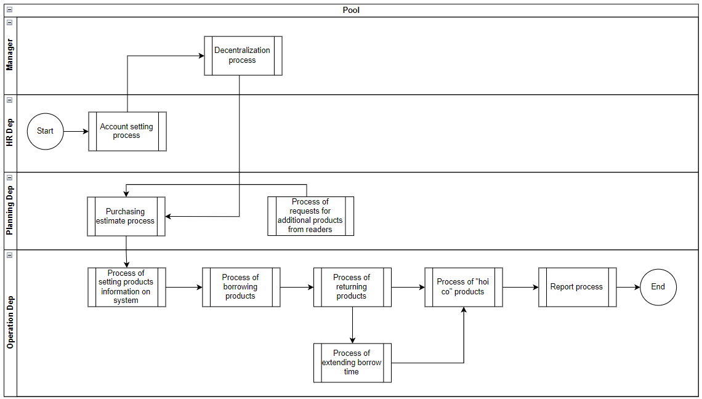

Figure 1: Actors and Roles in system

1.3 Intended Audience and Reading Suggestions

This document is intended for:

--	Development team: Responsible to develop detailed design, implement and perform unit test, integration test and system test for the migrated application ❖ Data Migration team: Responsible to create data migration scripts, and perform data migration for the application.

--	Documentation Team: Responsible for writing the User Guide for the application.

--	UAT team: Responsible for conducting user acceptance test sessions with end users.

1.4 Abbreviations

Acronym

Reference

UC

Use Case

BR

Business Rule

CBR

Common Business Rules

Dep

Department

1.5 References

N/A

2. High Level Requirements

This section describes the general overview of the system functions or business processes which are depicted in different diagrams. It shows the types of users, their granted permissions to perform specific system functions and the sequence required to complete a business workflow (if any). As the section name implies, it is high-level which mean not detailed enough. For detailed requirement specification, please see section below.

2.1 Entity Relationship Diagram

This section graphically illustrates an information system’s entities and the relationships between those entities.

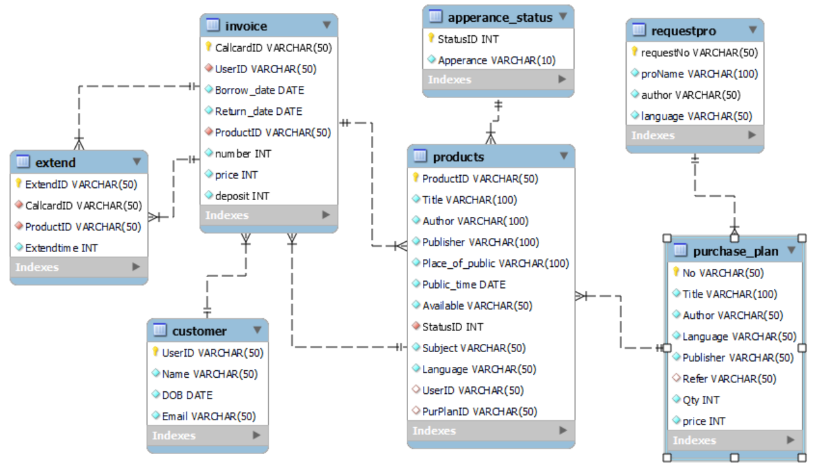

Figure 2: Entity Relationship Diagram

2.2 Business process

2.2.1 Process of borrow products

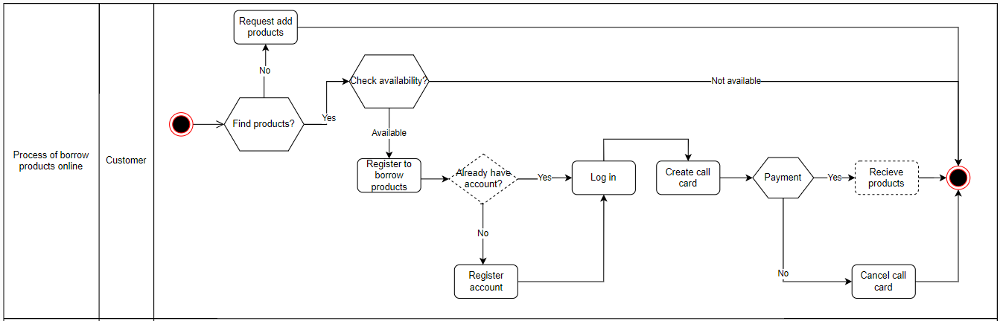

Figure : Process of borrow products online

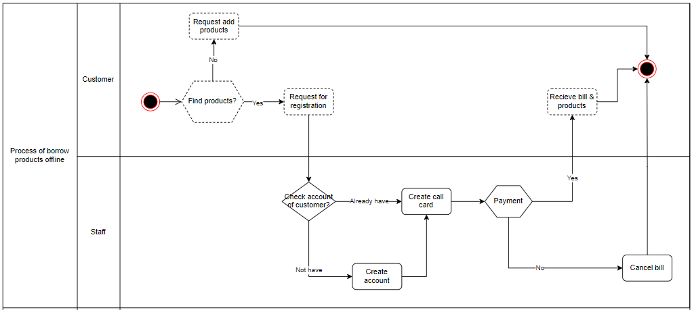

Figure : Process of borrow products offline

2.2.2 Process of return & extend time products

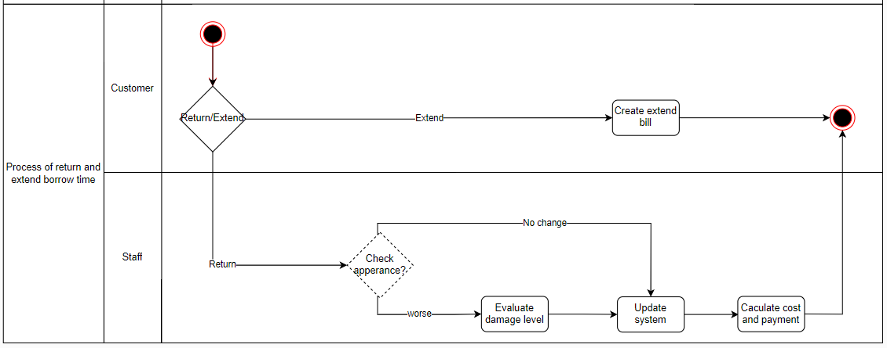

Figure : Process of return and extend borrow time

2.2.3 Process of planning for adding products

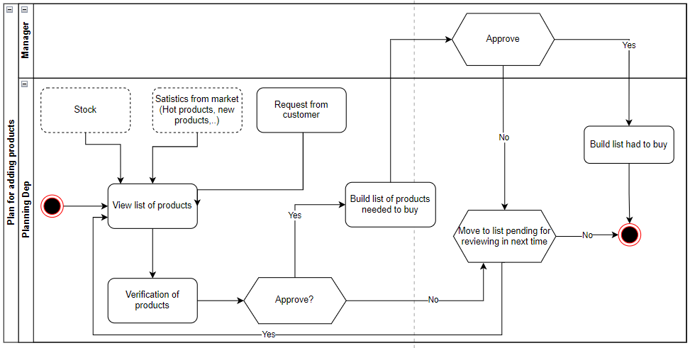

Figure : Process of planning for products needed to buy

2.2.4 Process of restore product status from unused list

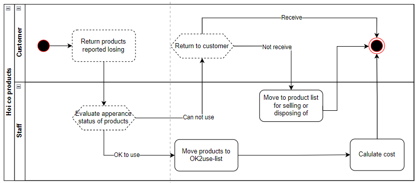

Figure : Process of restore product status

2.2.5 Process of product disposal/ liquidation/ removal

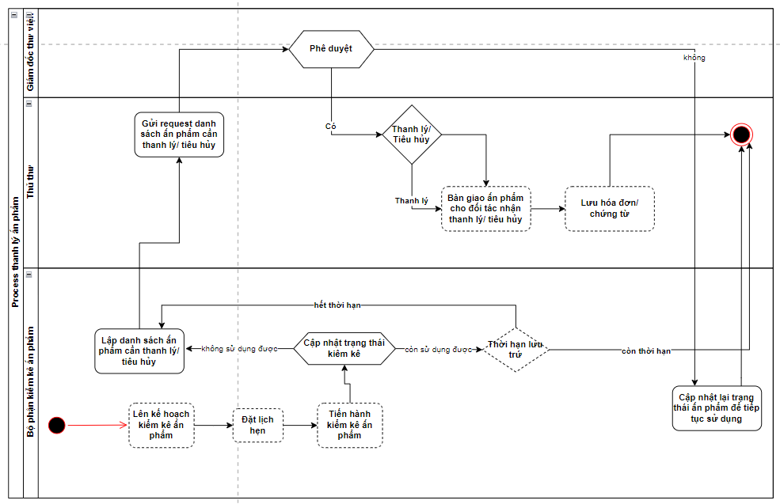

2.2.6 Process of exporting reports

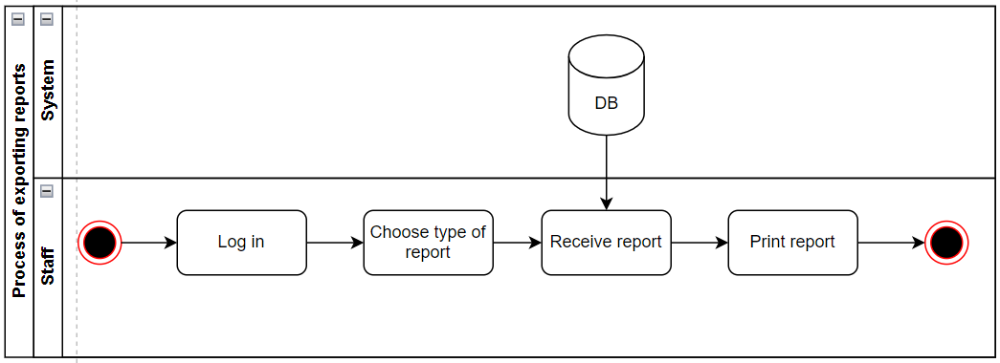

Figure : Process of exporting reports

2.4 Use Case Diagram

The use case diagram here shows the specific goal and objective or how the user interacts with the system. The eclipse in the system boundary represents the system use case/functions while the stickman represents the actor/user of the system. The line connecting the actor and the use case shows that the actor can perform that function in the system to achieve a goal.

2.4.1 Manage borrow-return-extend products

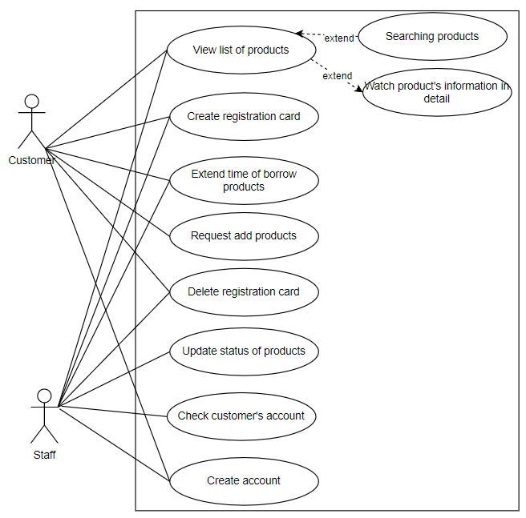

Figure : UC diagram of manage borrow-return-extend

#

UC Name

Description

1

View list of products

This function allows customer & staff  to view products

2

Create registration card

This function allows customer & staff to create registration card

3

Extend time of borrow products

This function allows customer & staff to extend time of borrow products

4

Request of adding products

This function allows customers to request library adding products

5

Delete registration card

This function allows customers to delete registration card out of their list

6

Update status of a product

This function allows staff to update status of a product

7

Check customer’s account status

This function allows customer & staff to check customer’s account status

2.4.2 Manage products

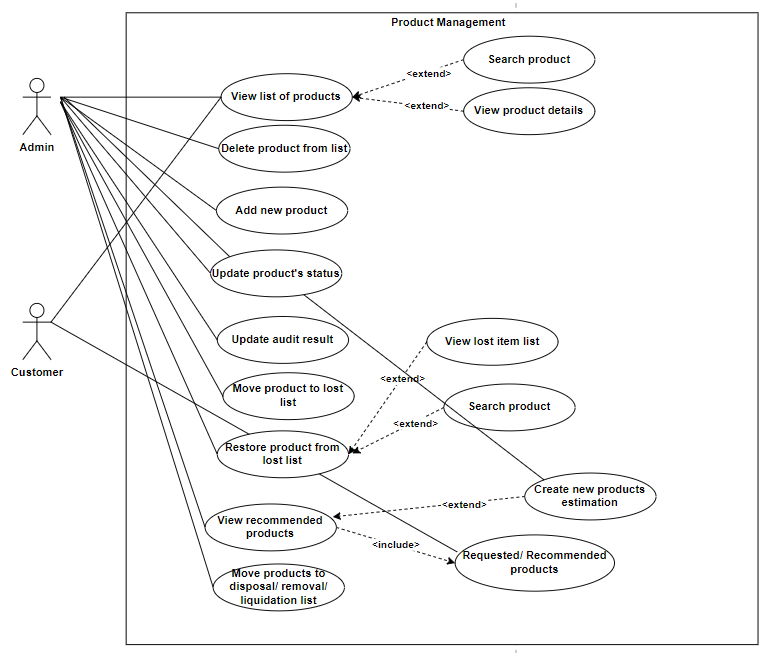

Figure : UC diagram of manage products

#

UC Name

Description

1

View list of products

This function allows customer & staff  to view products

2

Delete products

This function allows staff delete information of a product

3

Add new product

This function allows staff add information of a new product

4

Update product’s status

This function allows staff update status of a product

5

Update audit result

This function allows staff to upload the result of scheduled audit in which product’s details are updated

6

Move product to lost list

This function allow staff to update the status of product from available to “lost”

7

Restore products from lost list

This function allows staff restore products from lost items list

6

View recommended products

This function allows staff to view the products list that customer request/ recommend

7

Move products to disposal/ removal/ liquidation list

This function allows staff to update the condition of product in which they are no longer available for usage

2.4.3 Manage report

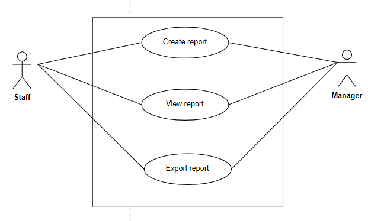

Figure : UC diagram of manage report

#

UC Name

Description

1

Generate Report

This function allows user to generate report basing on the selected criteria.

2

View Report

This function allows user to view generated report basing on the selected criteria.

3

Export Report

This function allows user to export generated report basing on the selected criteria to excel file.

2.5 Permission Matrix

Permission Matrix mapping functions and user roles for Library Management application is described as below:

Remarks:

X

User has permission to do this function with all records.

X*

User has permission to do this function with records pending for him/her or belonging to him/her only.

Manager

HR staff

Planning staff

Operation staff

Customer

Module 1: Manage borrow-rent-extend

Module 1: Manage borrow-rent-extend

Module 1: Manage borrow-rent-extend

Module 1: Manage borrow-rent-extend

Module 1: Manage borrow-rent-extend

View list of products

X

 X

X

X

X

Create registration card

X

X

X

Extend time of borrow products

X

X

X

Update status of a product

X

X

Check customer’s account status

X

X

X

Module 2: Manage products

Module 2: Manage products

Module 2: Manage products

Module 2: Manage products

Module 2: Manage products

View list of products

X

X

X

X

X

Delete products

X

 X

Add new product

X

X

X

Update product’s status

X

X

Restore products

X

X

View request of adding products from customers

X

X

X

Move products to unused list

X

X

Module 3: Report management

Module 3: Report management

Module 3: Report management

Module 3: Report management

Module 3: Report management

Create report

X

X

X

X

View report

X

X

X

X

Export report

X

X

X

X

3. Use Case Specifications

This section covers the system’s functional requirements which details what the system must do in terms of input, behavior and the expected output. It elicits the interaction between the actor(s) and the system, the system’s behavior and the results of their interactions.

3.1 General

3.1.1 UC1: Log in

Activity diagram

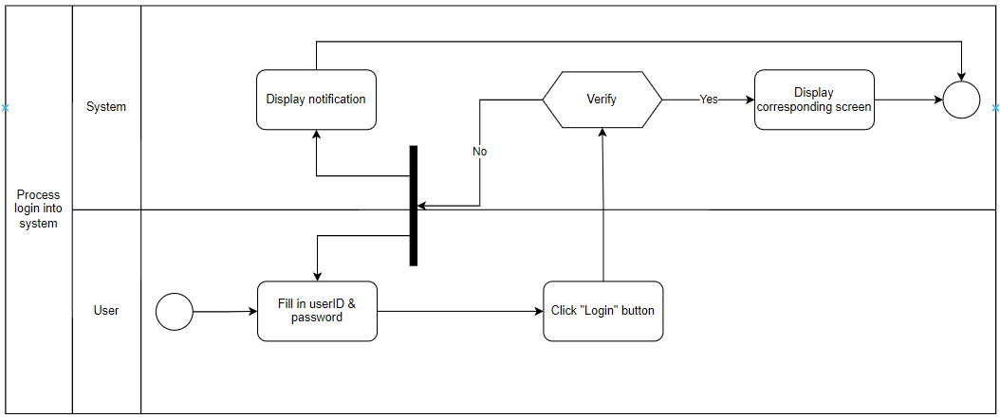

Use case description

Objective:

This function allows the user to login to the system.

Actor:

User

Trigger:

User selects to login on the Login screen.

Pre-condition:

User is not yet logged in to the system.

Post-condition:

User is logged in to the system successfully.

Step

Basic Flow

Exception Flow

Alternative Flow

1

User fill in ID & password

2

User clicks “Login” button

3

System verify login information

3a. Login information is invalid → System displays failed-in-login notification

3a1. User cancels or fill other information

4

System display corresponding screen

3.1.2 UC 2: Logout

Activities Diagram

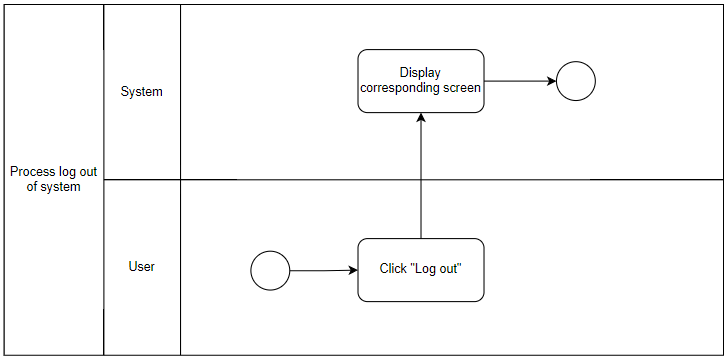

Use case description

Objective:

This function allows the user to logout from the system.

Actor:

User

Trigger:

User selects to logout.

Pre-condition:

User is logged in successfully.

Post-condition:

User is logged out from the system successfully.

Step

Basic Flow

Exception Flow

Alternative Flow

1

User clicks “Logout” button

2

System display corresponding screen

3.2 Manage borrow-return-extend products

3.2.1 UC3: Search a product

Activity Diagram

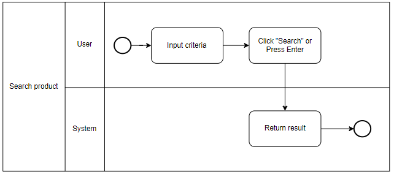

Use case description

Objective:

This function allows the user to search products

Actor:

User

Trigger:

Pre-condition:

Post-condition:

Users get information about the product they are looking for

Step

Basic Flow

Exception Flow

Alternative Flow

1

Users fill product’s name or select filter conditions to search products

2

Users click “Search” button or press “Enter”

3

System display corresponding screen

3. The product is not found in the system

3a. User click “Request adding products” button

3b. User search other products

3.2.2 UC4: View product information in detail

Activity Diagram

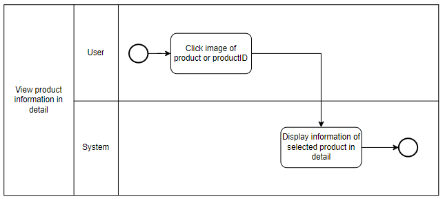

Use case description

Objective:

This function allows the user to view product’s information in detail

Actor:

User

Trigger:

Pre-condition:

Post-condition:

Users get detail  information about the product

Step

Basic Flow

Exception Flow

Alternative Flow

1

Users click on the image of the product or click product name/ID

2

System display the information of selected product in detail

3.2.4 UC6: Create borrowing card

Activity Diagram

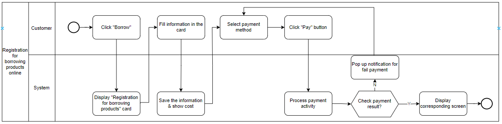

Use case description

Objective:

This function allows customers to borrow products online

Actor:

Customer

Trigger:

Pre-condition:

Customers have an account in the system and log in successfully

Post-condition:

--	Customers receive card of borrowing products

--	System record the successful registration activity to database

Step

Basic Flow

Exception Flow

Alternative Flow

1

Customer fill information in registration for borrowing card

1a. System notify that selected products are sold out

1a1. Customer click “OK” & delete them out of payment list

1a2. Customer move them to waiting list

1a3. Customer choose other products

2

Customer choose payment method and pay

3

System verify payment activity

3a. System confirm unsuccessful payment activity

3a1. Customer choose another payment method

3a2. Customer cancel payment activity

4

System record successful payment activity

5

Customer receive notification for successful payment

Use case description

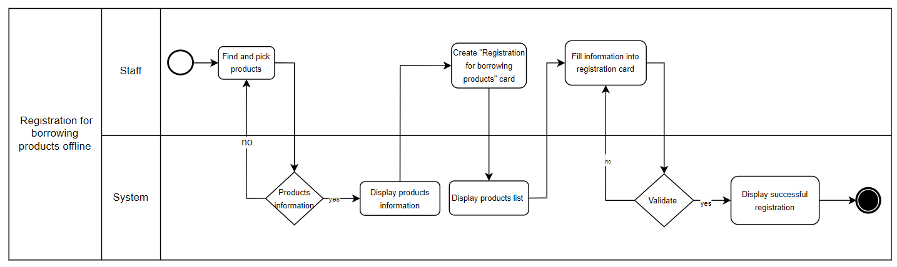

Objective:

This function allows customers to borrow products offline

Actor:

Library staff

Trigger:

Pre-condition:

Staffs have an admin account on the system

Post-condition:

--	Customers receive card of borrowing products

--	System record the successful registration activity to database

Step

Basic Flow

Exception Flow

Alternative Flow

1

Staff finds and picks products from products list

2

System displays products information

2a. System notices that products aren’t on the list

2b. System notices that products do not have enough quantity

3

Staff creates “Registration for borrowing products" card”

4

Staff fills informations into registration card

5

System validates the registration card

5.a  the registration card is not valid

6

System confirms the successful registration

3.2.5 UC7: Extend time of borrowing products

Activity Diagram

  Extend from customer

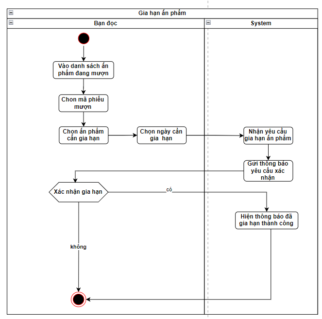

Use case description

Objective:

This function allows customers to extend the borrowed products online

Actor:

Customers

Trigger:

Customers want to extend the borrow time

Pre-condition:

Customers login and select manage borrowed products section.

Post-condition:

--	The selected product’s returned date is extended

--	System record the successful extended borrowing time

Step

Basic Flow

Exception Flow

Alternative Flow

1

Customers search/ filter and pick the desired products from borrowed products list

2

System displays products information/ detail

3

Customers choose the days to be extended

4.a. The extended days exceeds the maximum allowed extension.

4

Systems updates the deadline for return

5

System confirms the successful extension

Activity Diagram

  Extend from Library staff

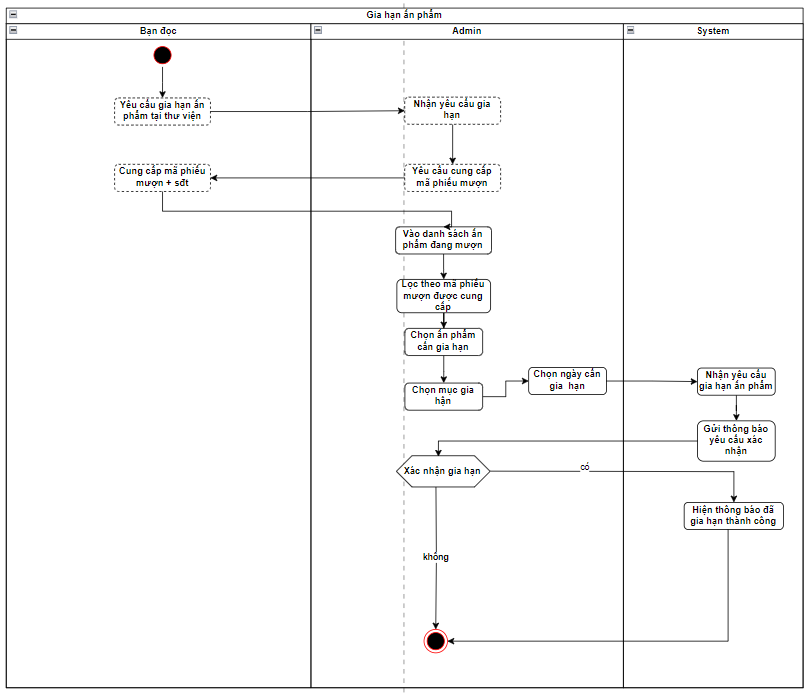

Use case description

Objective:

This function allows Library staff to extend the borrowed products when customer request at the library

Actor:

Library Staff

Trigger:

Customers want to extend the borrow time

Pre-condition:

Library Staff login and select manage borrow-return products section.

Post-condition:

--	The selected product’s returned date is extended

--	System record the successful extended borrowing time

Step

Basic Flow

Exception Flow

Alternative Flow

1

Library Staff search/ filter and pick the desired products from borrowed products list

2

System displays products information/ detail

3

Library Staff chooses Extend tab

4

Library staff select the new date for return by edition in the table

4.a. The extended days exceeds the maximum allowed extension.

5

Systems updates the deadline for return

6

System confirms the successful extension

3.2.6 UC8:  Delete borrowing card

Activity Diagram

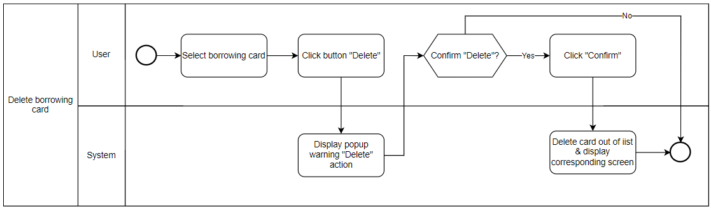

Use case description

Objective:

This function allows customers to delete a borrowing card out of their returned-list

Actor:

Customer

Trigger:

Pre-condition:

Customers borrowed and returned products

Post-condition:

Information of the borrowing card which is selected to delete is not existing in the customer’s list

Step

Basic Flow

Exception Flow

Alternative Flow

1

Customer selects the borrowing card which they want to delete in returned-list

2

Click button “Delete”

3

System display popup warning “Delete” action

4

Customer click “Confirm”

4a. Customer click “Cancel”

4a1. System cancel “delete action”

5

System delete information about the borrowing card out of the customer’s list

6

System displays notification “Delete successfully”

3.2.7 UC9:  Update status of products

Activity Diagram

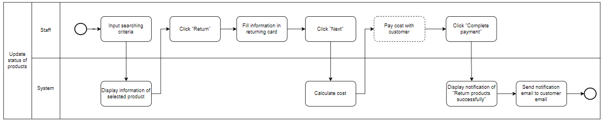

Use case description

Objective:

This function allows staff make returning card

Actor:

Staff

Trigger:

Pre-condition:

Post-condition:

--	System records returning action successfully

--	Customer receives notification email about returning action

Step

Basic Flow

Exception Flow

Alternative Flow

1

Staff inputs searching criteria

2

System displays selected product information

3

Staff click button “Return”

4

Staff fill information in the returning card

5

Staff click “Next”

6

System calculate cost which will be returned to customers

7

Staff returned cost to customer

8

Staff click “Complete payment”

9

System displays notification popup “Return the product successfully”

10

System sends notification email to customer

3.2.8 UC: Request add products

Activity Diagram

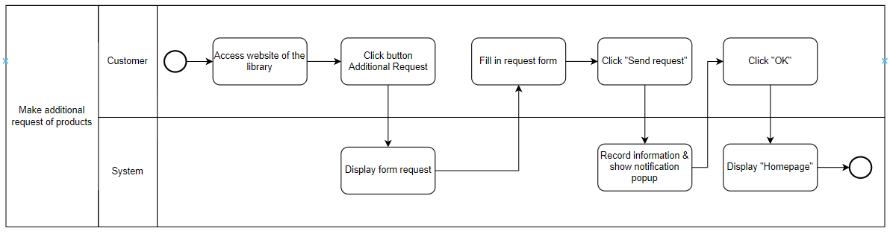

Use case description

Objective:

This function allows customers to request library adding products

Actor:

Customer

Trigger:

Pre-condition:

Post-condition:

System records requests successfully

Step

Basic Flow

Exception Flow

Alternative Flow

1

Customer accesses to the website of the library

2

Customer clicks to button “Additional Request”

3

System displays additional request form

4

Customer fills in the form

5

Customer clicks button “Send request”

6

System records the request

7

System shows popup “Send request successfully”

8

Customer clicks “OK”

9

System displays homepage

3.3 Mange products

3.3.1 UC: Add a new product

Activity Diagram

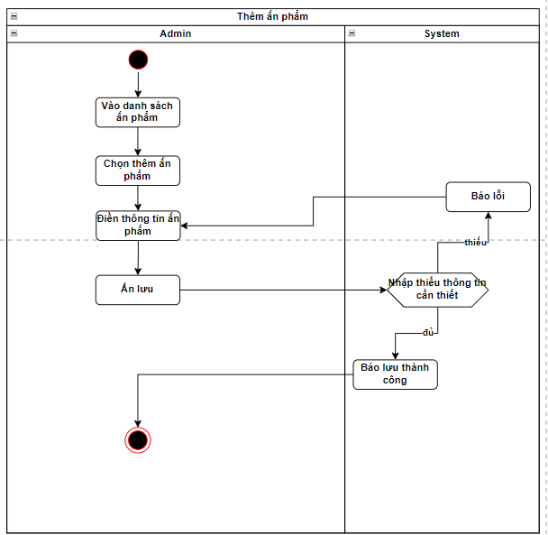

3.3.2 UC: View list of products

Activity Diagram

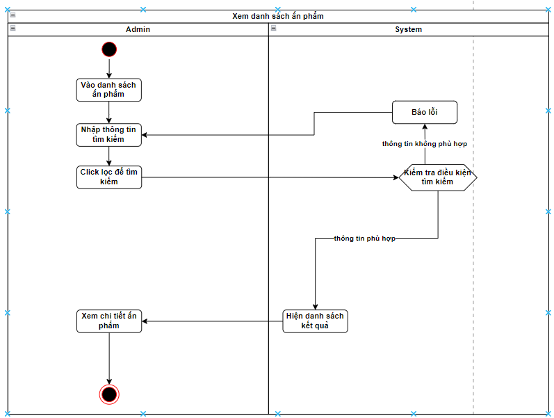

3.3.3 UC: Delete a product

Activity Diagram

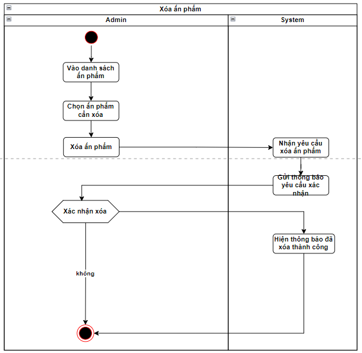

3.3.4 UC: Restore a product from lost item list

Activity Diagram

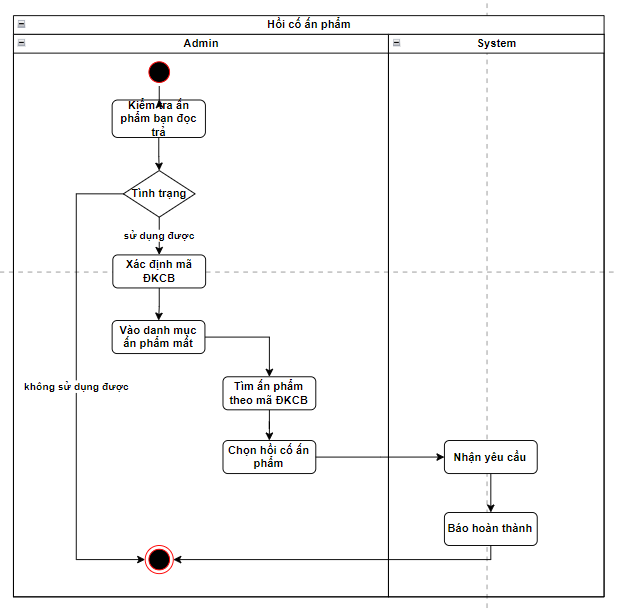

3.3.5 UC: New products estimation (adding new/ recommended products)

Activity Diagram

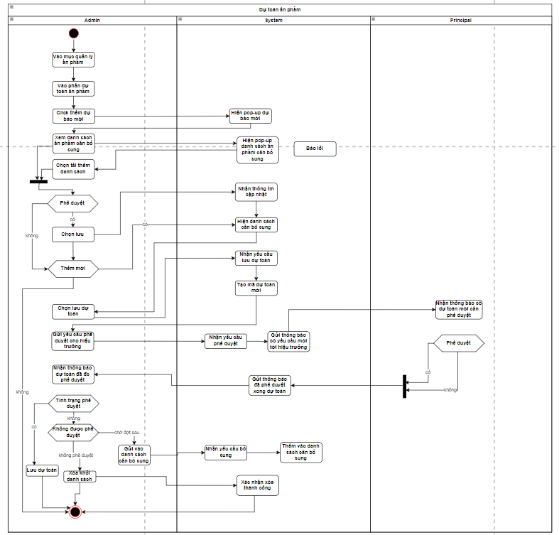

4. Sequence Diagram

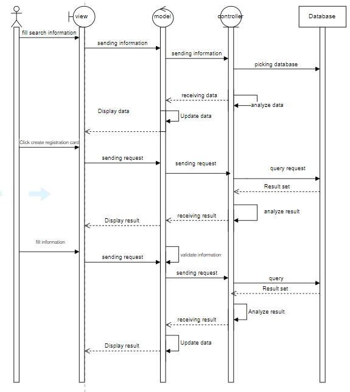

5. Wireframe Screen

5.1 General

5.1.1 Register account

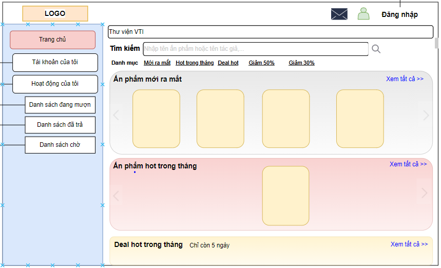

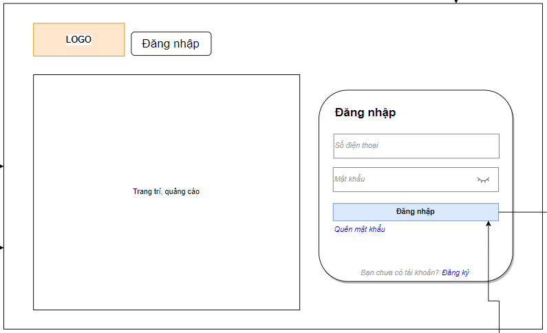

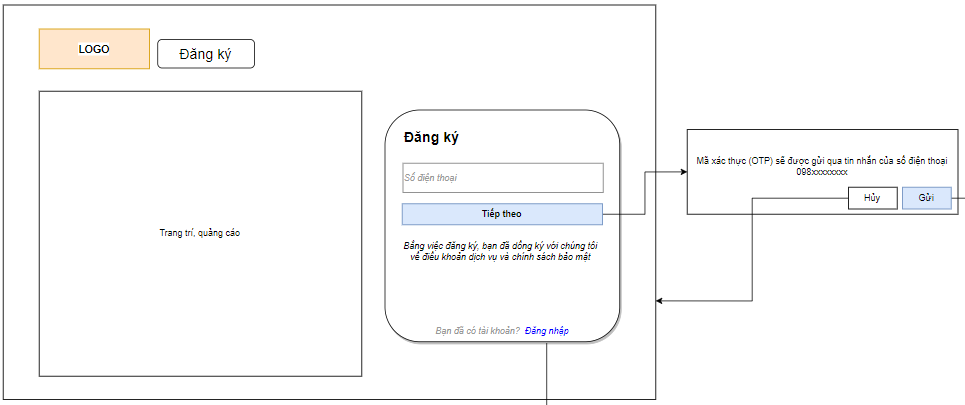

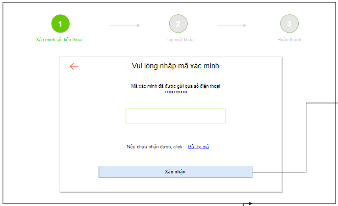

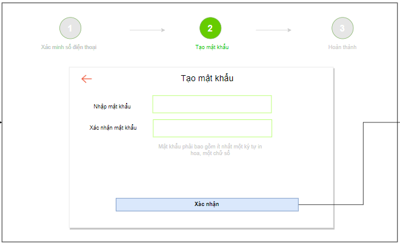

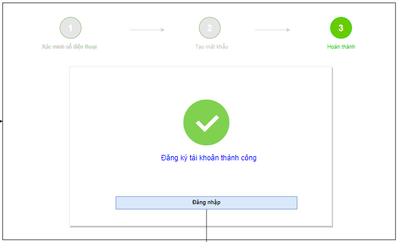

Screen No

Screen Name

Action

1

Library website without login

Click Đăng nhập

2

Login screen

Click 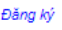

3

Register account

Fill phone number in the block 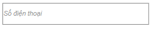

4

Register account

Click 

5

Register account

Click 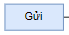 to receive OTP code

6

Register account

Fill the OTP code in block 

7

Register account

Fill new password

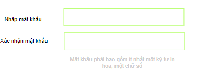

8

Register account

Click button to confirm new password

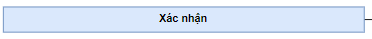

9

Register account

Click button to return Login screen

5.1.2 Log in

This screen is for user to log in to System.

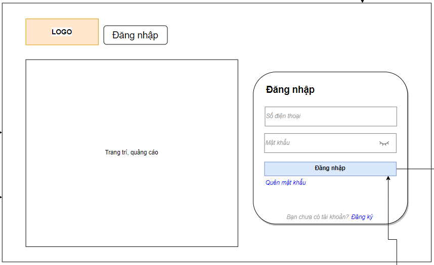

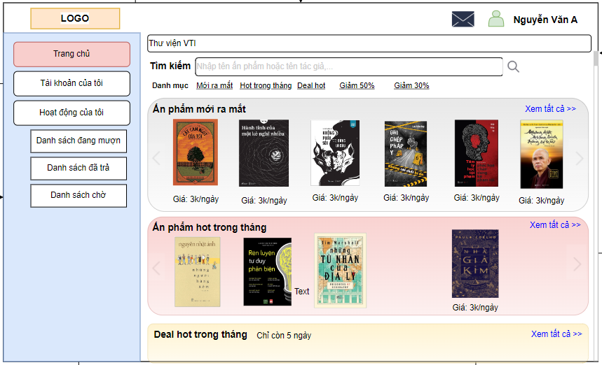

Screen No

Screen Name

Action

1

Login screen

Fill username & password to login

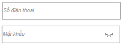

2

Login screen

Click

5.2 Manage borrow-return-extend products

5.2.1 Register borrowing products online

This screen displays registration card for borrowing products

In order to access this screen, user has to do the following steps:

--	Log in successfully.

--	Select products & click “Mượn ngay”

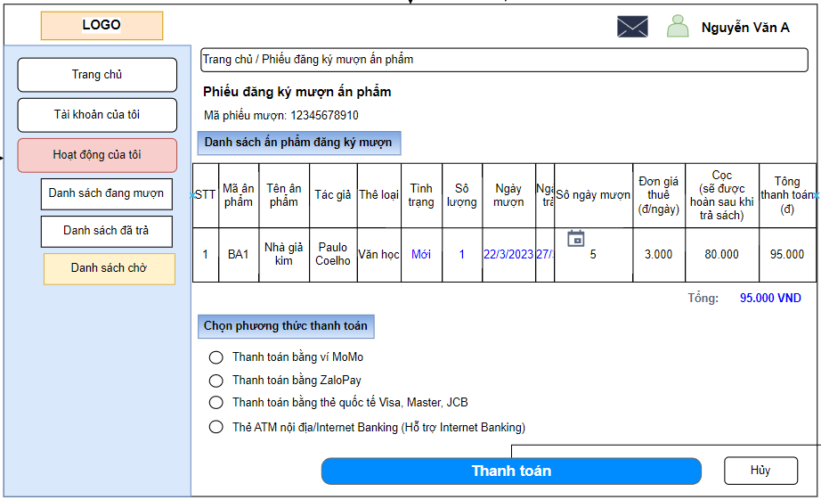

Screen No

Screen Name

Action

1

Register borrowing books

Choose status of product 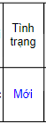

2

Register borrowing books

Select quantity for borrowing 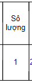

3

Register borrowing books

Select returning date

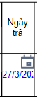

4

Register borrowing books

Select payment method  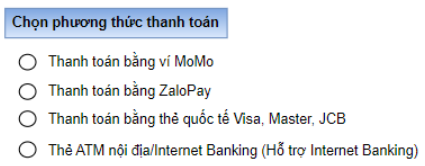

5

Register borrowing books

Click to pay

5.2.2 Extend time of borrowing products

This screen is to extend time of borrowing products

In order to access this screen in create mode, user has to do the following steps:

--	Log in successfully.

--	Click “Danh sách đang mượn”

--	Click on “Gia hạn” button

 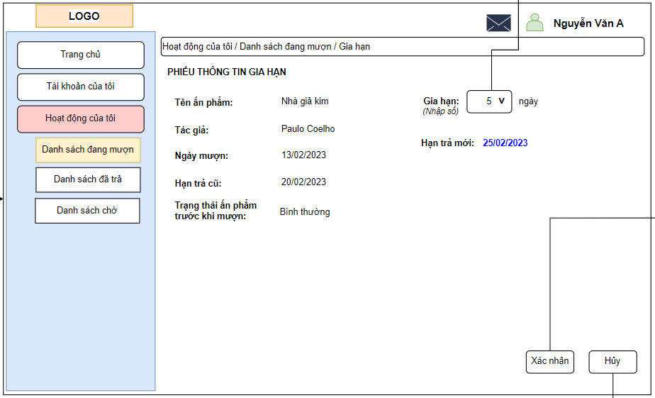

Screen No

Screen Name

Action

1

Extend time of borrowing books

Choose extend time

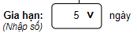

2

Extend time of borrowing books

Click


5.2.3 Register borrowing products offline

This screen displays registration card for borrowing products offline

In order to access this screen, user has to do the following steps:

--	Log in successfully.

--	Select category “Mượn”


Screen No

Screen Name

Action

1

Search products

Input criteria and click “Lọc”


2

Search products

Tick on checkbox to register for rent 

3

Search products

Click button


4

Create registration card

Fill ID of customer


5

Create registration card

Select status of product


6

Create registration card

Select time for returning products


7

Create registration card

Click button

8

Payment method

Choose payment method


5.2.4 Return product

These screens displays the information relating to returning activities

In order to access the screens, user has to do the following steps:

--	Log in successfully.

--	Select “Quản lý mượn-trả” → “Trả”


Screen No

Screen Name

Action

1

Search bill

Input criteria and click “Lọc”


2

Search bill

Click button to conduct returning action

3

Rented products in a bill

Select the product needed to return in checkbox 

4

Rented products in a bill

  Click to conduct payment

5

Payment

Fill information  

6

Payment

Check information & click 

5.3 Manage products

5.3.1 View products


5.3.2 Restore products from lost items list


5.3.3 Dispose/ Liquidate/ Remove Products


Figure: View Removal Notes after Principal’s Approval

5.3.4 New products estimation (adding new/ recommended products) - Library staff/ Admin


5.3.5 New products estimation (adding new/ recommended products) - Library staff/ Admin


Prepared By NhungTH1 	0.7 	/

Last modified on 13/09/2022 15:26:00

Prepared By NhungTH1 	0.7 	/

Last modified on 13/09/2022 15:26:00

Prepared By NhungTH1 0.7 /

Last modified on 13/09/2022 15:26:00

Prepared By NhungTH1 0.7 0/92

Last modified on 13/09/2022 15:26:00

Prepared By NhungTH1 0.7 /

Last modified on 13/09/2022 15:26:00

