# ĐẶC TẢ YÊU CẦU PHẦN MỀM (SRS) - EPHURIN NOVEL PLATFORM

## CHƯƠNG I: INTRODUCTION

### 1.1. Purpose of the Document
This Software Requirements Specification (SRS) describes the core requirements, actors, business flows, and operational scope of the **Ephurin Novel Platform**. It serves as a common foundation for analysts, designers, developers, testers, and supervisors to:
- Define goals, scope, and system boundaries.
- Describe key functions for Readers, Authors, Admins, and AI services.
- Clarify business workflows (Registration, Publishing, Moderation).
- Establish a basis for architectural design, UI design, and acceptance testing.

### 1.2. Project Scope
Ephurin is a platform for sharing and composing online novels, integrating Web, Mobile, and AI services.
- **Web Application:** For Authors (creation, stats) and Admins (management, moderation).
- **Mobile Application:** For Readers (search, read, interact).
- **Backend API:** Authentication, data management, and access control.
- **AI Service:** Metadata suggestion, classification, and automated moderation support.
- **Admin Dashboard:** Content review, report handling, and operational metrics.

### 1.3. Intended Audience
| Audience | Purpose |
| :--- | :--- |
| Supervisors | To evaluate the completeness, logic, and suitability of the requirements analysis. |
| Analysts | To unify scope, actors, functions, and business workflows. |
| Designers | To build architecture, database, and UI based on requirements. |
| Developers | To understand features, processing conditions, and business rules. |
| Testers | To build test cases, acceptance criteria, and functional testing scenarios. |

### 1.4. Terminology and Abbreviations
| Term | Meaning |
| :--- | :--- |
| SRS | Software Requirements Specification. |
| Actor | Entity interacting with the system. |
| Reader | Main user of the Mobile App (Reading, interacting). |
| Author | Creator and manager of stories (Web/Mobile). |
| Admin | System manager and content moderator. |
| AI Service | Service supporting classification, suggestions, and moderation. |
| JWT | JSON Web Token, session authentication mechanism. |
| OAuth 2.0 | Authentication standard for Google/Facebook login. |
| RBAC | Role-Based Access Control. |
| KYC | Know Your Customer - Identity verification for authors. |
| Dashboard | Control panel displaying data and administrative actions. |
| Coin | Internal currency for unlocking chapters or donations. |

### 1.5. Benchmarking and Market Analysis

#### 1.5.1. Online Novel Platform Comparison
| Criteria | Webnovel | Wattpad | Waka | Ephurin (Target) |
| :--- | :--- | :--- | :--- | :--- |
| **Publishing** | Contract model, exclusive content. | Open publishing model. | Conditional publishing (word count). | Authoring tools with AI-assisted metadata and scheduling. |
| **Reading** | Chapter-based, paid content. | Free/Paid with community focus. | Chapter-based, membership. | Mobile-first, UI customization, and synced history. |
| **Interaction** | Comments, reviews, gifts. | Inline comments, votes, follow. | Comments, bug reports. | Inline comments, follow, and transparent reporting. |
| **Moderation** | Keyword scan, manual review. | Community guidelines & reports. | Plagiarism check, manual review. | Hybrid: AI flagging with Admin final decision. |

#### 1.5.2. Content Distribution Reference (Netflix & Spotify)
Netflix and Spotify serve as references for:
- Large-scale library organization by genre and trends.
- AI-driven personalization and recommendation systems.
- Access control based on user rights or subscription status.
- **Competitive Advantage**: The integration of **AI as a creative partner** (not just a filter) helps reduce manual moderation and boosts author productivity through intelligent suggestions.

## CHAPTER II: SYSTEM OVERVIEW

### 2.1. System Architecture
The Ephurin Novel Platform is built on a **Microservices** architecture, ensuring stability, ease of maintenance, and independent scalability for each module (Web, Mobile, AI).

#### 2.1.1. General Architecture Diagram
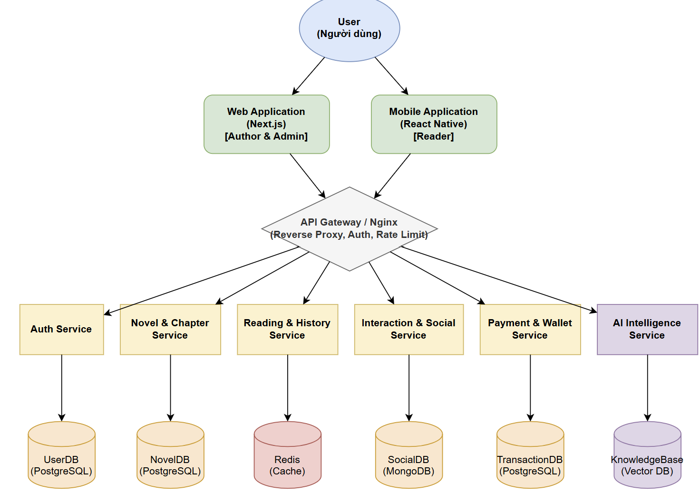

#### 2.1.2. Description of Core Components
1.  **Frontend Clients**:
    -   **Web Application (Next.js)**: The primary platform for Authors to write and Admins to manage. Uses Server-Side Rendering (SSR) to optimize SEO for literary works.
    -   **Mobile Application (React Native)**: A dedicated app for Readers, focusing on a smooth reading experience and real-time notifications.
2.  **API Gateway**: Acts as the single entry point for all client requests, handling routing to respective microservices and implementing outer security layers (Rate limiting, SSL).
3.  **Backend Microservices**:
    -   **Auth Service**: Manages authentication (JWT), authorization (RBAC), and user account data.
    -   **Novel & Chapter Service**: Handles business logic for story creation, chapter management, drafts, and publishing schedules.
    -   **Interaction Service**: Manages commenting systems (inline/chapter), likes, follows, and social interactions.
    -   **Reader Service**: Optimizes reading content retrieval, history management, and bookmarks.
    -   **Payment Service**: Processes virtual currency (Coins), chapter unlock transactions, and revenue settlement.
4.  **AI Intelligence Service**: A separate intelligent processing module using a Vector Database to store story knowledge, supporting author assistance and automated content moderation.
5.  **Infrastructure Layers**:
    -   **PostgreSQL**: Primary relational database for data requiring high consistency.
    -   **MongoDB**: Stores unstructured data such as activity logs and draft chapter versions.
    -   **Redis**: Caching layer to speed up access to frequently used data like rankings and login sessions.

### 2.2. Functional Decomposition Diagram (Functional Tree)
Below is the functional decomposition for the platform's core features:

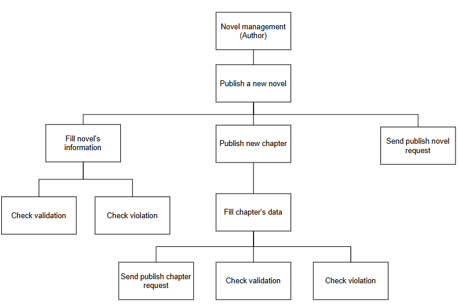

### 2.3. General Use Case Diagram
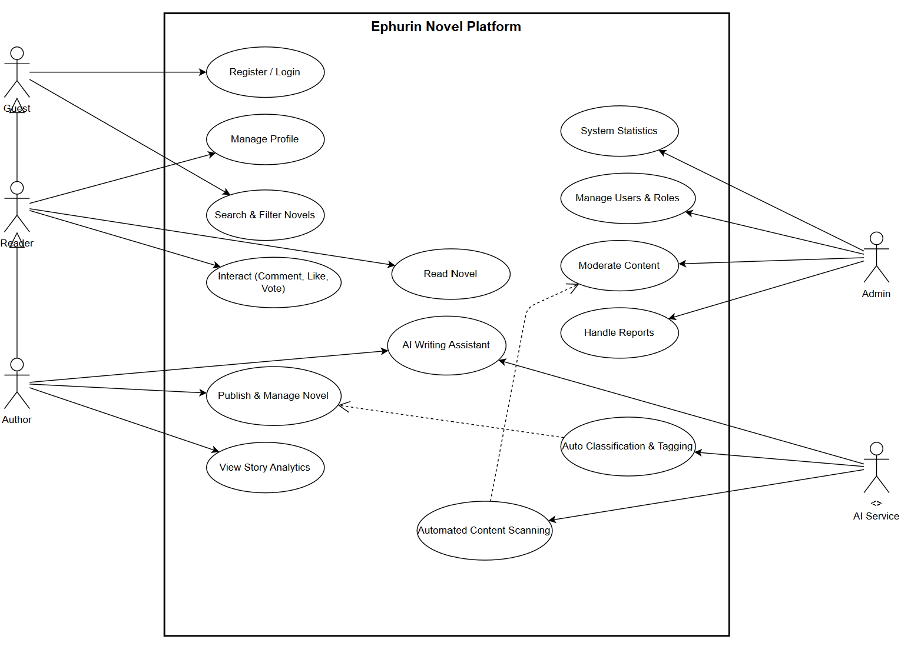

#### Use Case Descriptions Summary
| Category | Use Case | Description |
| :--- | :--- | :--- |
| **Account Management** | Register / Login / Profile | Allows Guests to create accounts and existing users to authenticate and manage personal profiles. |
| **Novel Management** | Publish / Edit / Manage | Enables Authors to create novels, upload chapters, and manage their portfolio on the Web platform. |
| **AI Intelligence** | AI Assistant / Auto-tagging | AI Service supports authors with genre suggestions, metadata tagging, and content violation checks. |
| **Reading Features** | Search / Read / Customize | Readers can discover novels through filters and personalize their reading experience (Font, Background). |
| **Interaction** | Comment / Like / Follow | Builds community engagement by allowing readers to interact with content and follow favorite authors. |
| **Administration** | Moderation / Stats / Users | Admins manage user accounts, review flagged content, and monitor system performance via dashboards. |

### 2.4. List of Actors
The Ephurin system involves the following primary actors:
*   **Guest**: Unauthenticated users who can browse story lists and read free chapters.
*   **Reader**: Registered users focused on the mobile experience with personalization and social features.
*   **Author**: Content creators focused on the Web platform for writing and work management.
*   **Admin/Editor**: Administrators responsible for operations, moderation, and user management.
*   **AI Service**: A system actor supporting data processing and author assistance.

### 2.5 Permission Matrix
The following matrix defines the level of access and actions (CRUD) each actor can perform on system resources.

| Resource | Guest | Reader | Author | Admin |
| :--- | :---: | :---: | :---: | :---: |
| **User Profile** | Create | R, U | R, U | R, U, D |
| **Novels (Own)** | - | - | C, R, U, D | R, U, D |
| **Novels (Others)** | R | R | R | R, U, D |
| **Chapters** | R (Free) | R | C, R, U, D | R, U, D |
| **Comments** | R | C, R, U, D | C, R, U, D | R, D |
| **Moderation** | - | - | - | C, R, U, D |
| **Statistics** | - | - | R (Own) | R (All) |

*Legend: C = Create, R = Read, U = Update, D = Delete*

## CHƯƠNG III: DATA REQUIREMENTS & WORKFLOWS

### 3.1 Entity Relationship Diagram (ERD)
The system utilizes a relational database (PostgreSQL) for structured data and MongoDB for non-structured data. Below is the ERD for the core components:

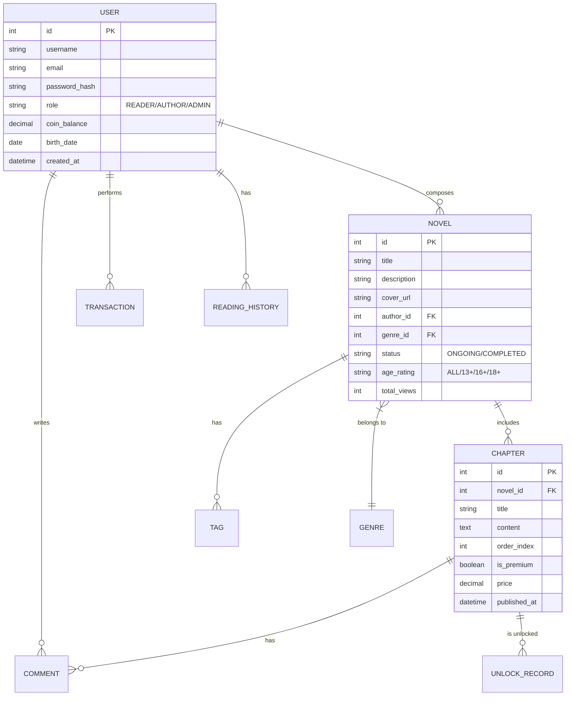
```mermaid
erDiagram
    USER ||--o{ NOVEL : "composes"
    USER ||--o{ COMMENT : "writes"
    USER ||--o{ TRANSACTION : "performs"
    USER ||--o{ READING_HISTORY : "has"
    
    NOVEL ||--o{ CHAPTER : "includes"
    NOVEL ||--o{ TAG : "has"
    NOVEL }|--|| GENRE : "belongs to"
    CHAPTER ||--o{ COMMENT : "has"
    CHAPTER ||--o{ UNLOCK_RECORD : "is unlocked"
    
    USER {
        int id PK
        string username
        string email
        string password_hash
        string role "READER/AUTHOR/ADMIN"
        decimal coin_balance
        date birth_date
        datetime created_at
    }
    
    NOVEL {
        int id PK
        string title
        string description
        string cover_url
        int author_id FK
        int genre_id FK
        string status "ONGOING/COMPLETED"
        string age_rating "ALL/13+/16+/18+"
        int total_views
    }
    
    CHAPTER {
        int id PK
        int novel_id FK
        string title
        text content
        int order_index
        boolean is_premium
        decimal price
        datetime published_at
    }
```

#### Data Dictionary Summary
- **USER**: Stores identification, roles, and wallet balance (Coin).
- **NOVEL**: Overview of the work, author, and moderation status.
- **CHAPTER**: Detailed content of chapters, supporting monetization settings (Premium).
- **TRANSACTION**: Logs of financial transactions (Deposit, Purchase, Donate).

### 3.2 Business Workflows

#### 3.2.1 Registration & Authentication (JWT)
*(To be added by the Account Module owner)*

#### 3.2.2 Quy trình Sáng tác & Xuất bản (Process of publish new novels)

**a. Publish a new novel**
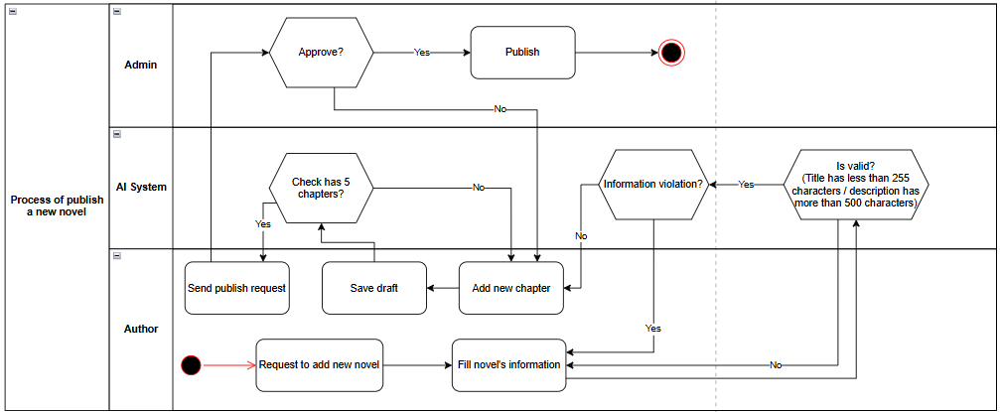
*Figure : Process of author request to publish a new novel*

**Detailed Specification:**
1.  **Initiation**: Author starts by requesting to add a new novel.
2.  **Information Entry**: Author fills in metadata (title, description, genre).
3.  **AI Validation**: 
    *   System checks format: Title must be < 255 chars, description > 500 chars.
    *   AI checks for content violations (sensitive topics, hate speech).
4.  **Chapter Creation**: Author must add and save chapters as drafts.
5.  **Requirement Check**: The AI system ensures the novel has at least 5 chapters before allowing a "Publish Request".
6.  **Human Review**: Once submitted, an Admin reviews the novel content.
7.  **Final Action**: If approved, the novel is published; otherwise, it is sent back for edits.

**b. Publish new chapter**
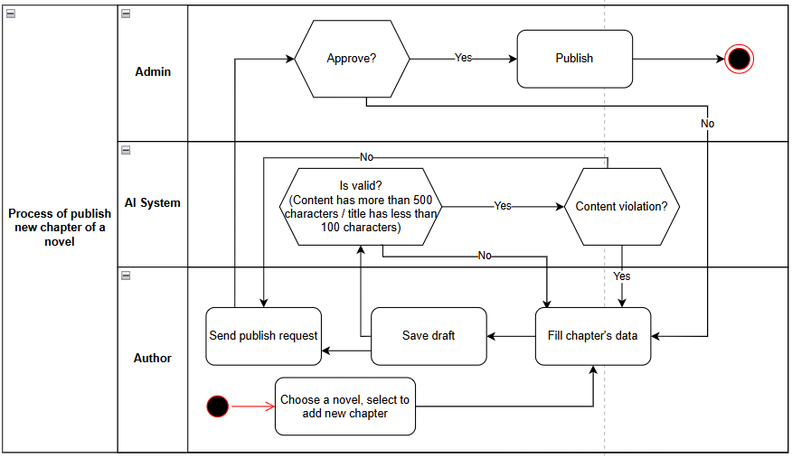
*Figure : Process of author request to publish a new chapter*

**Detailed Specification:**
1.  **Selection**: Author selects an existing novel to add a new chapter.
2.  **Drafting**: Author enters chapter title and content.
3.  **AI Guardrails**: AI validates content length (> 500 chars) and scans for policy violations.
4.  **Submission**: Author saves the draft and sends a publish request.
5.  **Moderation**: Admin verifies the chapter content. Upon approval, the chapter becomes visible to readers.

#### 3.2.3 AI-assisted Metadata Workflow
This is a unique feature of Ephurin, helping standardize content from the start:

1.  **Request Submission**: When the author finishes a chapter or story description, the text is sent to the AI Service.
2.  **Feature Extraction**: AI uses NLP models (PhoBERT/Transformer) to analyze keywords, context, and writing style.
3.  **Classification & Suggestion**:
    *   AI compares content with the existing Taxonomy (genres/tags) to provide the Top 5 most suitable suggestions.
    *   Detects sensitive topics to warn about mandatory Age Rating tags.
4.  **Feedback & Selection**: The author reviews the suggestions and selects which ones to apply. This improves search accuracy for readers.

**a. Publish a new novel**

*Figure : Process of author request to publish a new novel*

**Detailed Specification:**
1.  **Initiation**: Author starts by requesting to add a new novel.
2.  **Information Entry**: Author fills in metadata (title, description, genre).
3.  **AI Validation**: 
    *   System checks format: Title must be < 255 chars, description > 500 chars.
    *   AI checks for content violations (sensitive topics, hate speech).
4.  **Chapter Creation**: Author must add and save chapters as drafts.
5.  **Requirement Check**: The AI system ensures the novel has at least 5 chapters before allowing a "Publish Request".
6.  **Human Review**: Once submitted, an Admin reviews the novel content.
7.  **Final Action**: If approved, the novel is published; otherwise, it is sent back for edits.

**b. Publish new chapter**

*Figure : Process of author request to publish a new chapter*

**Detailed Specification:**
1.  **Selection**: Author selects an existing novel to add a new chapter.
2.  **Drafting**: Author enters chapter title and content.
3.  **AI Guardrails**: AI validates content length (> 500 chars) and scans for policy violations.
4.  **Submission**: Author saves the draft and sends a publish request.
5.  **Moderation**: Admin verifies the chapter content. Upon approval, the chapter becomes visible to readers.

#### 3.2.3 Quy trình AI hỗ trợ metadata (Gợi ý Tag/Thể loại)
Đây là quy trình đặc trưng của Ephurin, giúp chuẩn hóa nội dung ngay từ bước đầu:

1.  **Gửi yêu cầu**: Khi tác giả soạn thảo xong nội dung chương hoặc mô tả truyện, hệ thống gửi văn bản về AI Service.
2.  **Trích xuất đặc trưng**: AI sử dụng mô hình NLP (PhoBERT/Transformer) để phân tích từ khóa, ngữ cảnh và văn phong.
3.  **Phân loại & Gợi ý**:
    -   AI so sánh với bộ Taxonomy (thể loại/tag) hiện có để đưa ra Top 5 gợi ý phù hợp nhất.
    -   Phát hiện các chủ đề nhạy cảm để cảnh báo gắn tag độ tuổi (Age Rating).
4.  **Phản hồi & Lựa chọn**: Tác giả xem danh sách gợi ý và chọn áp dụng vào tác phẩm. Kết quả này giúp tăng độ chính xác khi độc giả tìm kiếm.

#### 3.2.4 Quy trình Kiểm duyệt nội dung (Admin Review)
*(Sẽ được bổ sung bởi thành viên phụ trách Module Quản trị)*

## CHƯƠNG IV: ĐẶC TẢ CHI TIẾT CÁC YÊU CẦU CHỨC NĂNG

### 4.1 Module 1: Account & Profile Management
This module allows users to register, log in, and manage personal information.

#### 4.1.1. UC: User Registration
**a. Activity diagram**
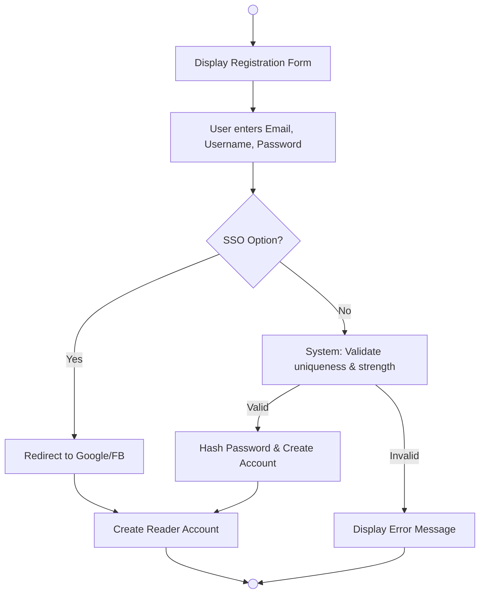
```mermaid
graph TD
    Start(( )) --> Screen[Display Registration Form]
    Screen --> Input[User enters Email, Username, Password]
    Input --> Method{SSO Option?}
    Method -- Yes --> SSO[Redirect to Google/FB]
    Method -- No --> Validate[System: Validate uniqueness & strength]
    SSO --> Success[Create Reader Account]
    Validate -- Valid --> Hash[Hash Password & Create Account]
    Validate -- Invalid --> Error[Display Error Message]
    Hash --> Success
    Success --> End(( ))
    Error --> End
```

**b. Use case description**
| Attribute | Description |
| :--- | :--- |
| **Objective** | Create a new account to access system features |
| **Actor** | Guest |
| **Trigger** | Guest clicks "Register" |
| **Pre-condition** | Guest is not logged in; Email/Username is unique |
| **Post-condition** | A new account is created with default role "Reader" |

| Step | Basic Flow | Exception Flow |
| :--- | :--- | :--- |
| 1 | Guest accesses the registration screen. | |
| 2 | System displays form (Email, Username, Password). | |
| 3 | Guest enters information and submits. | 3a. User chooses Google/FB (OAuth 2.0). |
| 4 | System validates email format and password strength. | 4a. Duplicate Email: System suggests Login. |
| 5 | System hashes password and creates account. | |
| 6 | System notifies registration success. | |

#### 4.1.2. UC: User Login
**a. Activity diagram**
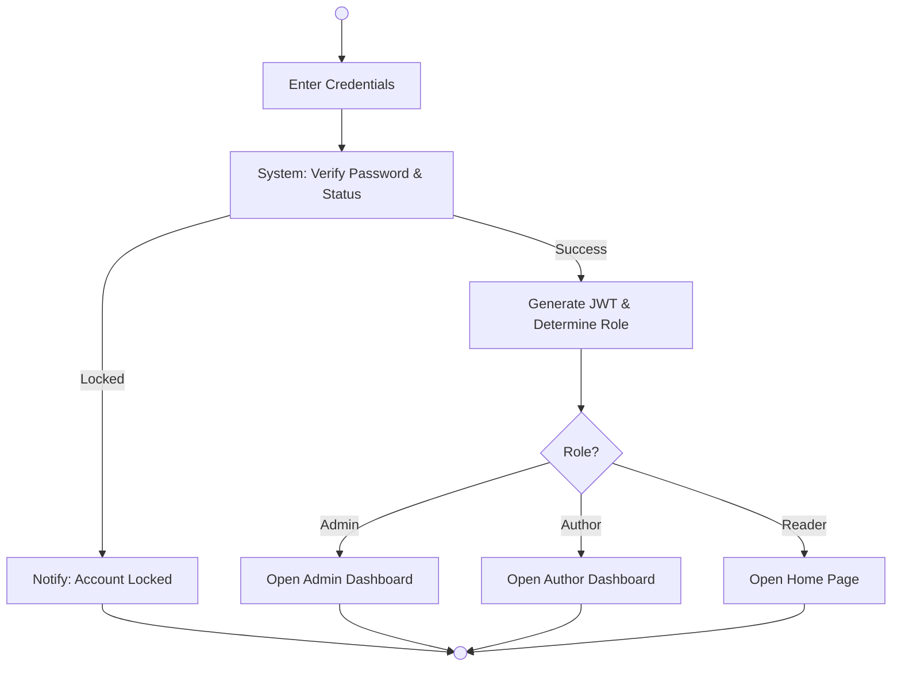
```mermaid
graph TD
    Start(( )) --> Input[Enter Credentials]
    Input --> Auth[System: Verify Password & Status]
    Auth -- Locked --> Msg[Notify: Account Locked]
    Auth -- Success --> Token[Generate JWT & Determine Role]
    Token --> Route{Role?}
    Route -- Admin --> AdminDB[Open Admin Dashboard]
    Route -- Author --> AuthorDB[Open Author Dashboard]
    Route -- Reader --> Home[Open Home Page]
    Msg --> End(( ))
    AdminDB --> End
    AuthorDB --> End
    Home --> End
```

**b. Use case description**
| Attribute | Description |
| :--- | :--- |
| **Objective** | Authenticate user and grant access based on role |
| **Actor** | Reader, Author, Admin |
| **Pre-condition** | User has a valid account |
| **Post-condition** | User receives a valid JWT and is redirected to the appropriate dashboard |

### 4.2 Module 2: Quản lý Tác phẩm (Novel Management - Web)

#### 4.2.1. UC: Publish a new novel
**a. Activity diagram**
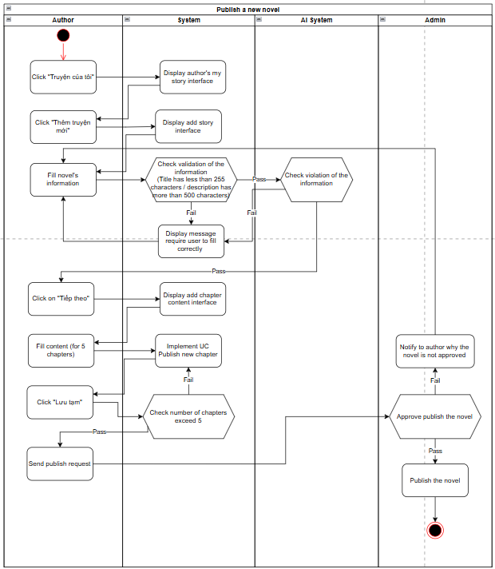

**b. Use case description**
| Objective | This function allows authors to publish a new novel on the platform |
| :--- | :--- |
| **Actor** | Author, System, AI System, Admin |
| **Trigger** | Author wants to publish a new novel |
| **Pre-condition** | Author has an account in the system and logged in successfully |
| **Post-condition** | - Novel is published on the platform |

| Step | Basic Flow | Exception Flow | Alternative Flow |
| :--- | :--- | :--- | :--- |
| 1 | Author clicks "Truyện của tôi" – System displays author's my story interface. Author clicks "Thêm truyện mới" – System displays add story interface |  |  |
| 2 | Author fills novel's information (title, description, genre, etc.) | 2a. System detects validation errors (Title ≥ 255 characters OR Description < 500 characters) 2a1. System displays message requiring user to fill correctly 2a2. Author re-fills the information |  |
| 3 | System validates information and passes to AI System to check for content violations | 3a. AI System detects violation of information 3a1. System notifies author of the violation 3a2. Author edits and re-submits the information |  |
| 4 | Author clicks "Tiếp theo" – System displays add chapter content interface |  |  |
| 5 | Author fills content for chapters – System implements UC Publish new chapter for each chapter | 5a. Chapter content fails UC Publish new chapter validation 5a1. Author re-edits the chapter content |  |
| 6 | Author clicks "Lưu tạm" – System checks if number of chapters meets requirement (≥ 5) | 6a. Number of chapters does not exceed 5 6a1. System notifies author to add more chapters 6a2. Author continues filling remaining chapters |  |
| 7 | Author sends publish request to Admin |  |  |
| 8 | Admin reviews and approves the novel – System publishes the novel | 8a. Admin does not approve the novel 8a1. System notifies author with the reason for rejection 8a2. Author edits novel and re-submits publish request |  |

#### 4.2.2. UC: Publish new chapter
**a. Activity diagram**
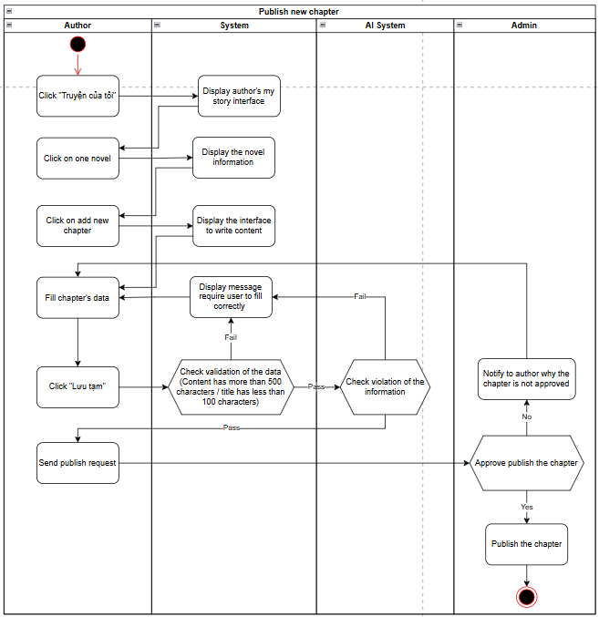

**b. Use case description**
| Objective | This function allows authors to publish a new chapter for an existing novel on the platform |
| :--- | :--- |
| **Actor** | Author, System, AI System, Admin |
| **Trigger** | Author wants to add and publish a new chapter to their novel |
| **Pre-condition** | Author has an account in the system, logged in successfully, and has at least one novel created in the system |
| **Post-condition** | - The new chapter is published on the platform - System records the successful chapter publication activity to database |

| Step | Basic Flow | Exception Flow | Alternative Flow |
| :--- | :--- | :--- | :--- |
| 1 | Author clicks "Truyện của tôi" – System displays author's my story interface |  |  |
| 2 | Author clicks on one novel – System displays the novel information |  |  |
| 3 | Author clicks on "Add new chapter" – System displays the interface to write content |  |  |
| 4 | Author fills chapter's data (title, content) |  |  |
| 5 | Author clicks "Lưu tạm" – System checks validation of the data (Content > 500 characters AND Title < 100 characters) | 5a. System detects validation errors 5a1. System displays message requiring user to fill correctly 5a2. Author re-fills chapter's data |  |
| 6 | System passes chapter to AI System to check for content violations | 6a. AI System detects violation of the information 6a1. System displays message requiring user to correct the content 6a2. Author edits and re-submits chapter's data |  |
| 7 | Author sends publish request to Admin |  |  |
| 8 | Admin reviews and approves the chapter – System publishes the chapter | 8a. Admin does not approve the chapter 8a1. System notifies author with the reason why the chapter is not approved 8a2. Author edits the chapter and re-sends the publish request |  |

### 4.3 Module 3: AI Intelligence (AI Story Assistant)
This module represents the core intelligence of Ephurin, supporting content optimization and automated moderation.

#### 4.3.1. UC: Automated Novel Classification
**a. Activity diagram**
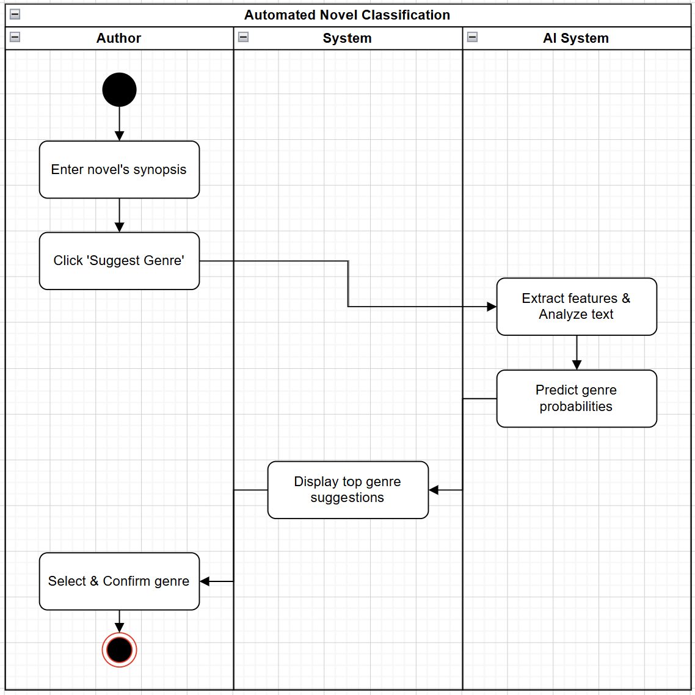

**b. Use case description**

| Attribute | Description |
| :--- | :--- |
| **Objective** | Use PhoBERT model to classify novel genres based on the synopsis |
| **Actor** | Author, AI System |
| **Trigger** | Author completes the synopsis and clicks "Suggest Genre" |
| **Pre-condition** | Author is in the story creation/editing interface and has entered a synopsis |
| **Post-condition** | System displays the most relevant genre suggestions |

| Step | Basic Flow | Exception Flow |
| :--- | :--- | :--- |
| 1 | Author enters or updates the novel's synopsis. | |
| 2 | Author requests genre suggestions. | |
| 3 | AI System processes text and extracts feature vectors. | 3a. Synopsis too short for analysis 3a1. System notifies author to provide more detail. |
| 4 | AI Model returns probability scores for various genres. | |
| 5 | System displays the top genre suggestions for the Author to select. | |

#### 4.3.2. UC: Suggest Tags and Title
**a. Activity diagram**
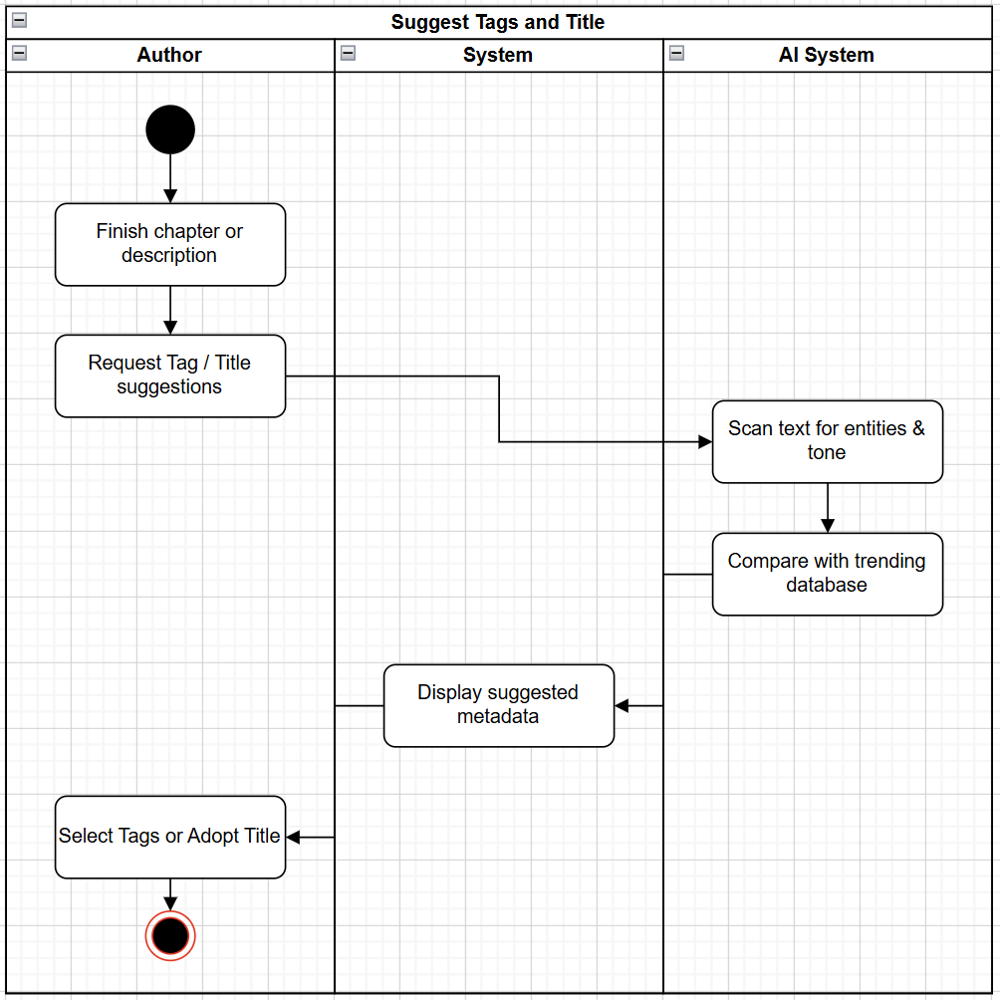

**b. Use case description**

| Attribute | Description |
| :--- | :--- |
| **Objective** | Extract prominent keywords (Tags) and suggest attractive titles based on content |
| **Actor** | Author, AI System |
| **Trigger** | Author completes a chapter or updates the story description |
| **Post-condition** | Author receives a list of suggested tags and titles |

| Step | Basic Flow | Exception Flow |
| :--- | :--- | :--- |
| 1 | Author finishes writing a chapter or updating story description. | |
| 2 | Author requests for Tag or Title suggestions. | |
| 3 | AI System scans the text for key entities, themes, and emotional tone. | 3a. Content is too short for meaningful analysis   3a1. System notifies author to add more content. |
| 4 | AI Model compares the analysis with trending metadata in the database. | |
| 5 | System displays a list of suggested Tags and potential Titles. | |
| 6 | Author selects desired Tags or adopts a suggested Title. | |

#### 4.3.3. UC: Analyze Writing Style and Length
**a. Activity diagram**
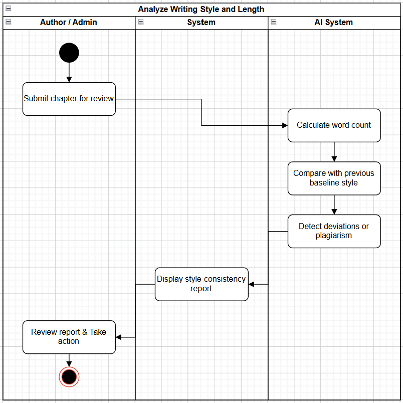

**b. Use case description**

| Attribute | Description |
| :--- | :--- |
| **Objective** | Detect sudden changes in writing style or insufficient chapter length |
| **Actor** | Author, Admin, AI System |
| **Trigger** | Author submits a new chapter for review |

| Step | Basic Flow | Exception Flow |
| :--- | :--- | :--- |
| 1 | Author submits a new chapter for review. | |
| 2 | AI System scans the chapter content and calculates word count. | 2a. Word count is below minimum requirement   2a1. System notifies author to expand the chapter. |
| 3 | AI System compares the writing style (vocabulary, sentence structure) with the author's previous baseline. | |
| 4 | AI System identifies any sudden deviations or potential plagiarism. | 4a. Significant style change detected   4a1. System flags the chapter for Admin manual review. |
| 5 | System displays a style consistency report and length validation. | |
| 6 | Author proceeds to publish or returns to edit based on the report. | |

### 4.4 Module 4: Trải nghiệm Đọc (Reading Features - Mobile)
Phân hệ này tập trung vào việc tối ưu hóa giao diện và tính năng hỗ trợ độc giả trong quá trình thưởng thức tác phẩm.

#### UC-RD-01: Cá nhân hóa giao diện đọc
**a. Activity diagram**
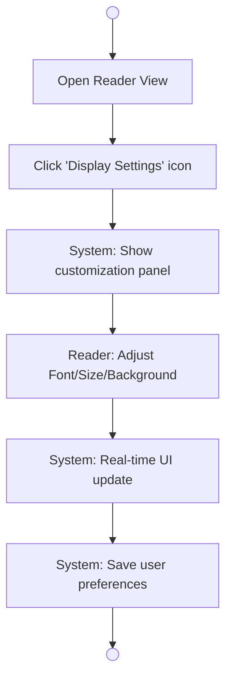
```mermaid
graph TD
    Start(( )) --> Open[Open Reader View]
    Open --> Trigger[Click 'Display Settings' icon]
    Trigger --> Show[System: Show customization panel]
    Show --> Change[Reader: Adjust Font/Size/Background]
    Change --> Preview[System: Real-time UI update]
    Preview --> Save[System: Save user preferences]
    Save --> End(( ))
```

**b. Use case description**
- **Objective:** Độc giả có thể thay đổi font chữ, kích thước, màu nền (Dark/Light mode) để phù hợp với sở thích và môi trường.
- **Actor:** Reader
- **Trigger:** Nhấn vào biểu tượng "Cài đặt hiển thị" trong màn hình đọc.
- **Pre-condition:** Đang ở trong màn hình đọc truyện.
- **Post-condition:** Cài đặt được áp dụng ngay lập tức và lưu lại cho lần đọc sau.
- **Kịch bản chi tiết:**
  | Bước | Basic Flow | Exception Flow |
  | :--- | :--- | :--- |
  | 1 | Hệ thống hiển thị bảng tùy chỉnh (Font, Size, Background). | |
  | 2 | Người dùng kéo slider để chỉnh cỡ chữ hoặc chọn màu nền. | |
  | 3 | Hệ thống cập nhật CSS/Theme trực tiếp trên màn hình đọc. | |
  | 4 | Hệ thống lưu thông tin cấu hình. | Lỗi lưu trữ: Hiển thị thông báo không thể đồng bộ cài đặt. |

#### UC-RD-02: Tìm kiếm, Lọc truyện nâng cao
**a. Activity diagram**
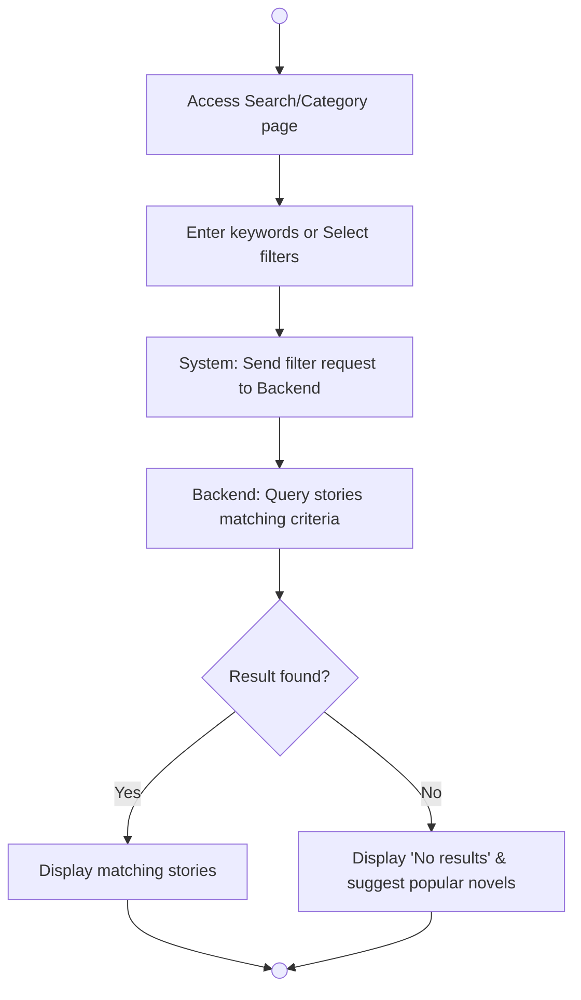
```mermaid
graph TD
    Start(( )) --> Access[Access Search/Category page]
    Access --> Input[Enter keywords or Select filters]
    Input --> Submit[System: Send filter request to Backend]
    Submit --> Fetch[Backend: Query stories matching criteria]
    Fetch --> Result{Result found?}
    Result -- Yes --> Display[Display matching stories]
    Result -- No --> Suggest[Display 'No results' & suggest popular novels]
    Display --> End(( ))
    Suggest --> End
```

**b. Use case description**
- **Objective:** Cho phép tìm kiếm tác phẩm theo từ khóa, thể loại, tình trạng, và các bộ lọc kết hợp.
- **Actor:** Reader, Guest
- **Trigger:** Truy cập thanh tìm kiếm hoặc trang danh mục.
- **Post-condition:** Hiển thị danh sách truyện phù hợp, sắp xếp theo độ liên quan/lượt xem.
- **Kịch bản chi tiết:**
  | Bước | Basic Flow | Alternative Flow |
  | :--- | :--- | :--- |
  | 1 | Người dùng nhập từ khóa và chọn các tiêu chí lọc (Thể loại, Tình trạng). | |
  | 2 | Hệ thống gửi request lọc đến Backend. | Nếu không có từ khóa, chỉ lọc theo tiêu chí sẵn có. |
  | 3 | Backend trả về danh sách kết quả. | Nếu không tìm thấy: Báo "Không có kết quả" và gợi ý truyện phổ biến. |
  | 4 | Hệ thống hiển thị kết quả (dạng List/Grid). | |

### 4.5 Module 5: Tương tác & Cộng đồng
Phân hệ này xây dựng không gian tương tác giữa độc giả với nhau và giữa độc giả với tác giả.

#### UC-IN-01: Bình luận (theo chương/đoạn)
**a. Activity diagram**
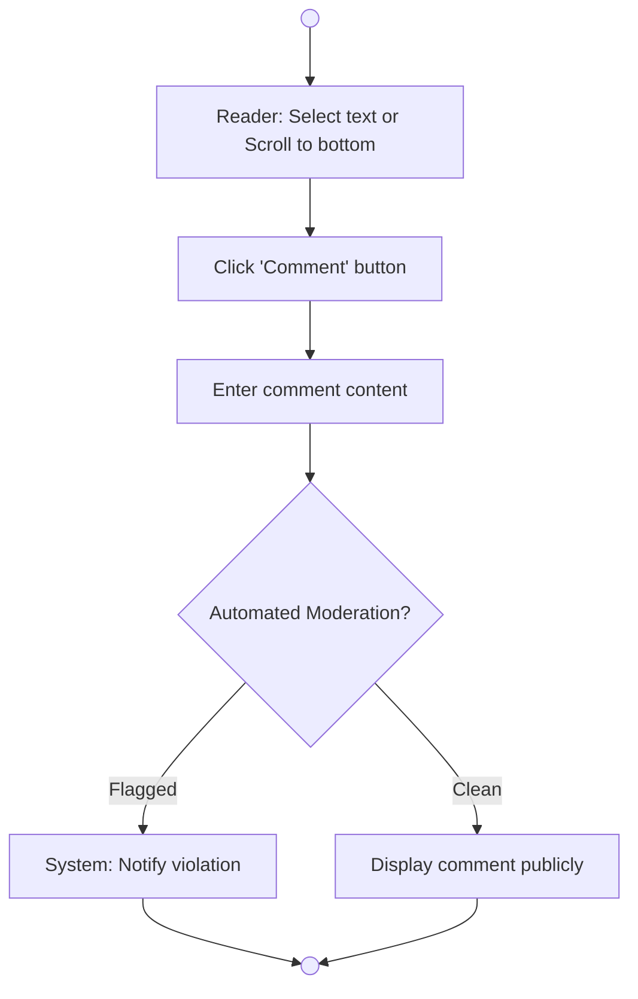
```mermaid
graph TD
    Start(( )) --> Select[Reader: Select text or Scroll to bottom]
    Select --> Click[Click 'Comment' button]
    Click --> Input[Enter comment content]
    Input --> Moderate{Automated Moderation?}
    Moderate -- Flagged --> Alert[System: Notify violation]
    Moderate -- Clean --> Post[Display comment publicly]
    Alert --> End(( ))
    Post --> End
```

**b. Use case description**
- **Objective:** Cho phép độc giả để lại bình luận tại một chương hoặc một đoạn văn bản cụ thể (Inline comment).
- **Actor:** Reader
- **Trigger:** Bôi đen đoạn văn bản hoặc cuộn xuống cuối chương và chọn "Bình luận".
- **Pre-condition:** Đã đăng nhập.
- **Post-condition:** Bình luận được hiển thị công khai hoặc đưa vào diện chờ duyệt.

#### UC-IN-02: Like và Bookmark
- **Objective:** Đánh dấu lưu lại truyện (Bookmark) hoặc thích (Like) để tăng độ phổ biến.
- **Actor:** Reader
- **Trigger:** Nhấn nút "Thêm vào tủ sách" (Bookmark) hoặc "Thích" (Like).
- **Pre-condition:** Đã đăng nhập.
- **Post-condition:** Tác phẩm thêm vào Tủ sách cá nhân; lượt Like tăng.

#### UC-IN-03: Theo dõi tác giả & Thông báo đẩy
- **Objective:** Nhận thông báo khi tác giả yêu thích ra chương mới.
- **Actor:** Reader
- **Trigger:** Nhấn "Theo dõi" tại trang hồ sơ tác giả.
- **Post-condition:** Hệ thống tự động đẩy thông báo (Push Notification) đến thiết bị khi có update.

### 4.6 Module 6: Administration & Statistics
This module provides Admins with tools to manage users, moderate content, handle reports, and monitor system performance.

#### 4.6.1. UC: Content Moderation
**a. Activity diagram**
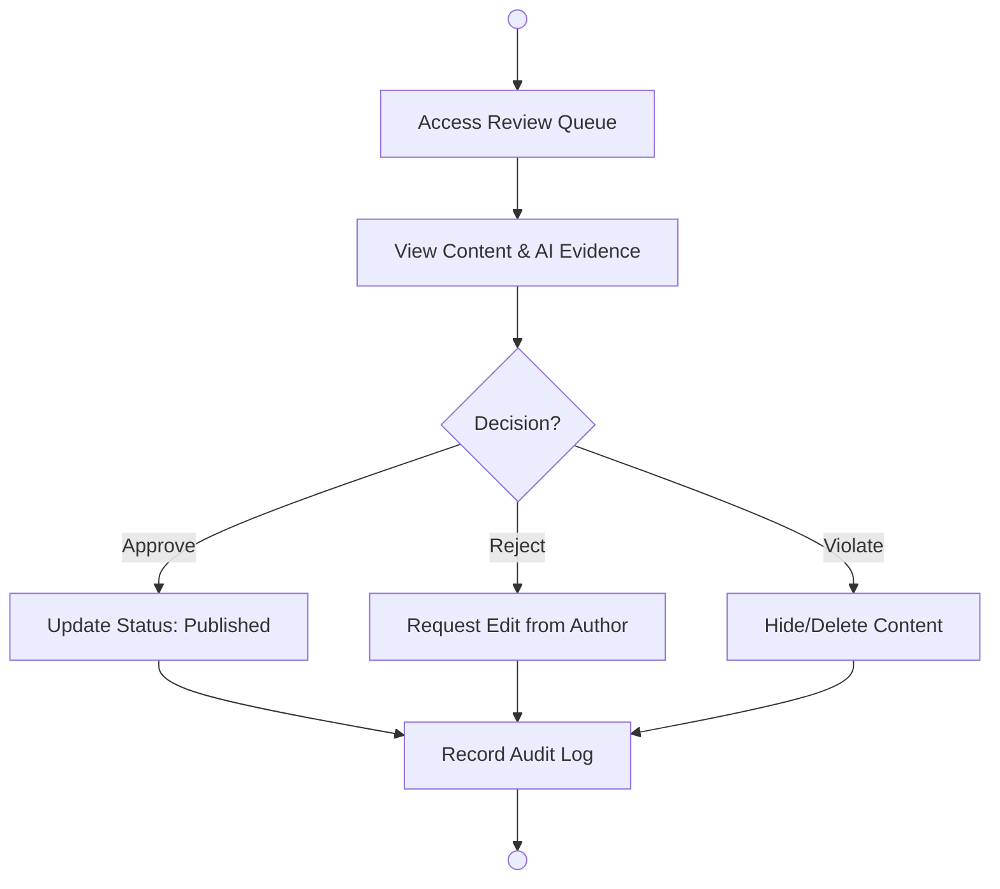
```mermaid
graph TD
    Start(( )) --> Queue[Access Review Queue]
    Queue --> View[View Content & AI Evidence]
    View --> Decision{Decision?}
    Decision -- Approve --> Active[Update Status: Published]
    Decision -- Reject --> Request[Request Edit from Author]
    Decision -- Violate --> Hidden[Hide/Delete Content]
    Active --> Log[Record Audit Log]
    Request --> Log
    Hidden --> Log
    Log --> End(( ))
```

**b. Use case description**
| Attribute | Description |
| :--- | :--- |
| **Objective** | Ensure novels and chapters comply with platform policies |
| **Actor** | Admin, AI System |
| **Pre-condition** | Content is pending or flagged by AI/Users |
| **Post-condition** | Content is approved, hidden, or deleted |

| Step | Basic Flow | Exception Flow |
| :--- | :--- | :--- |
| 1 | AI Service flags suspicious content with evidence. | |
| 2 | Admin accesses the Review Queue. | |
| 3 | Admin reviews content, metadata, and reports. | |
| 4 | Admin makes a decision (Approve/Reject/Hide). | |
| 5 | System updates content status and notifies author. | |
| 6 | System records the action in Audit Log. | |

#### 4.6.2. UC: Operational Dashboard
| Attribute | Description |
| :--- | :--- |
| **Objective** | Monitor growth, traffic, and content quality metrics |
| **Actor** | Admin |
| **Post-condition** | Admin views real-time charts and metrics |

## CHƯƠNG V: THIẾT KẾ GIAO DIỆN (UI/UX)

### 5.1 Screen Navigation Flow (Sitemap)
Below is the general sitemap for Ephurin Novel Platform:

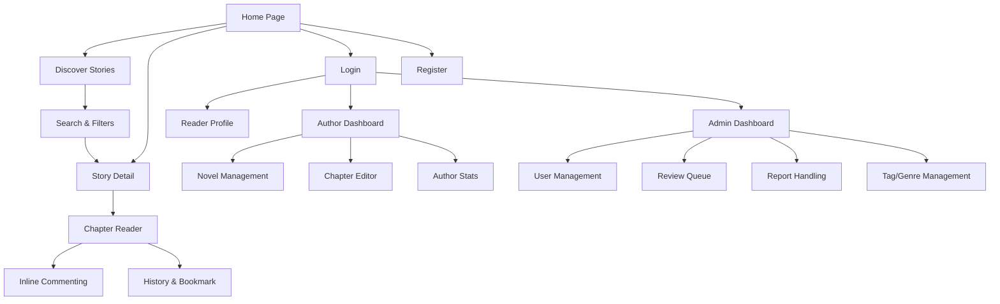
```mermaid
graph TD
    Home[Home Page] --> Discover[Discover Stories]
    Home --> Detail[Story Detail]
    Home --> Login[Login]
    Home --> Register[Register]

    Discover --> Search[Search & Filters]
    Search --> Detail
    Detail --> ReaderView[Chapter Reader]
    ReaderView --> Comment[Inline Commenting]
    ReaderView --> Bookmark[History & Bookmark]

    Login --> ReaderPage[Reader Profile]
    Login --> AuthorPage[Author Dashboard]
    Login --> AdminPage[Admin Dashboard]

    AuthorPage --> NovelMgmt[Novel Management]
    AuthorPage --> Editor[Chapter Editor]
    AuthorPage --> Stats[Author Stats]

    AdminPage --> UserMgmt[User Management]
    AdminPage --> ModQueue[Review Queue]
    AdminPage --> Reports[Report Handling]
    AdminPage --> Taxonomy[Tag/Genre Management]
```

### 5.2 Mockups giao diện Web (Author & Admin)
Below are the key interfaces for the Author module on the Web platform:

*   **Author “Truyện của tôi” page:** Displays the list of stories, statistics, and quick actions.
     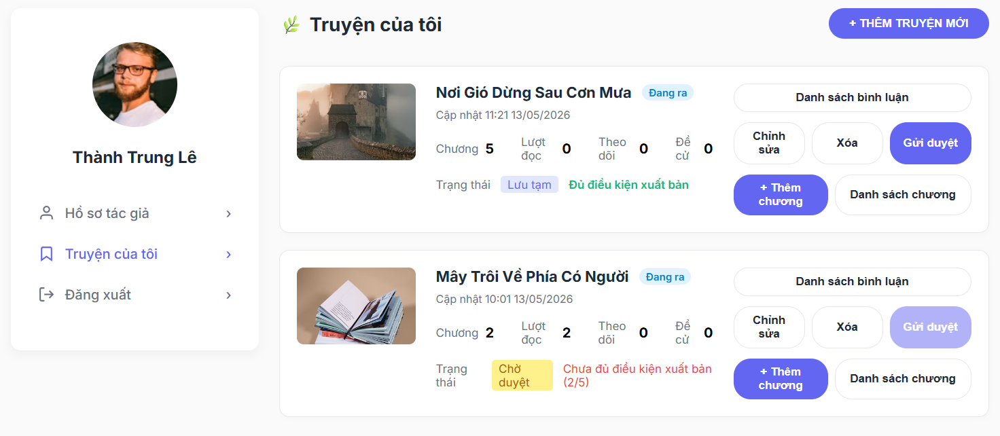
*   **Filling novel information page:** Form to input story metadata.
     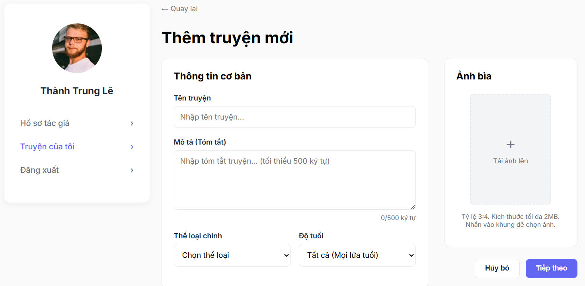
*   **Add new chapter page:** Writing interface for chapter content.
     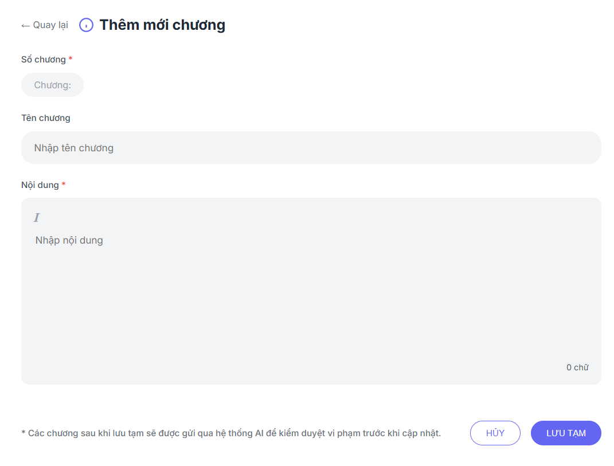
*   **Check information and send request page:** Final review before submission to Admin.
     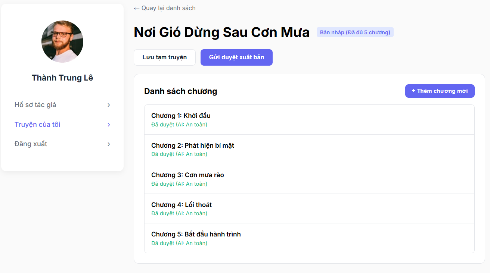

### 5.3 Mockups giao diện Mobile (Reader App)
Giao diện Mobile được thiết kế tối ưu cho trải nghiệm đọc lâu dài với các màn hình chính:

*   **Màn hình Home:** Hiển thị banner đề cử, các tác phẩm đang thịnh hành (top trending) và danh sách "Tiếp tục đọc" giúp người dùng quay lại nhanh chóng.
     
*   **Màn hình Khám phá & Lọc:** Cung cấp thanh tìm kiếm thông minh, danh mục thể loại phong phú và các bộ lọc nâng cao theo trạng thái/độ dài.
     
*   **Màn hình Chi tiết truyện:** Chứa thông tin tổng quan, tóm tắt nội dung, danh sách chương và các bài đánh giá từ cộng đồng.
     
*   **Màn hình Đọc truyện (Reader View):** Nội dung chương truyện với khả năng tùy chỉnh font, nền. Tích hợp tính năng bình luận theo dòng (inline comment).
     .png>)
*   **Màn hình Tủ sách (Thư viện):** Quản lý các truyện đã Bookmark và lịch sử đọc cá nhân.
     
*   **Màn hình Hồ sơ Tác giả:** Hiển thị thông tin tác giả, danh sách tác phẩm sáng tác và nút "Theo dõi" để nhận thông báo.
     

## CHƯƠNG VI: CÁC YÊU CẦU PHI CHỨC NĂNG

### 6.1 Hiệu năng (Performance)
- **Thời gian phản hồi**: Các tác vụ đọc truyện và tìm kiếm phải phản hồi dưới 2 giây.
- **Khả năng chịu tải**: Hệ thống đảm bảo phục vụ 10,000 người dùng đồng thời (Concurrent Users) thông qua cơ chế Auto-scaling.
- **Tối ưu hóa AI**: Các yêu cầu phân tích AI (NLP) không được treo quá 5 giây/request.

### 6.2 Bảo mật (Security)
- **Xác thực**: Sử dụng cơ chế JWT với thời gian hết hạn ngắn và Refresh Token để đảm bảo an toàn.
- **Mã hóa**: Toàn bộ mật khẩu người dùng phải được băm bằng thuật toán bcrypt. Dữ liệu giao dịch được mã hóa AES-256.
- **Phân quyền**: Áp dụng chặt chẽ mô hình RBAC để ngăn chặn truy cập trái phép vào trang quản trị.

### 6.3 Độ tin cậy (Reliability)
- **Sao lưu**: Tự động backup dữ liệu hàng ngày (Daily Backup) và lưu trữ đa vùng.
- **Uptime**: Cam kết thời gian hoạt động của hệ thống đạt 99.9%.

## PHỤ LỤC

### Appendix A: System Error Codes

| Code | Message | Cause | Resolution |
| :--- | :--- | :--- | :--- |
| **AUTH_001** | Invalid Email format | Email does not match regex | Check and re-enter email |
| **AUTH_003** | Invalid Credentials | Wrong username/password | Try again or reset password |
| **AUTH_004** | Account Locked | Banned by Admin | Contact support |
| **AUTH_008** | Unauthorized Action | Role has insufficient permissions | Use an account with appropriate role |
| **USER_004** | Username already exists | Duplicate username in DB | Choose another username |
| **AI_001** | AI Service Unavailable | Timeout or service down | Switch to manual review |
| **SYS_001** | Internal Server Error | Unhandled exception | Contact system admin |
| **CONTENT_001** | Content not found | Story/Chapter deleted | Refresh or check ID |

### Phụ lục B: Dataset & Phương pháp huấn luyện AI

