# Đặc tả yêu cầu phần mềm - Phần Quản trị & Hạ tầng

**Dự án:** Ephurin Novel Platform  
**Phạm vi:** Quản lý tài khoản, quản trị hệ thống, giới thiệu tài liệu, sơ đồ điều hướng và danh mục mã lỗi.

Trong phạm vi phần này, hệ thống sử dụng **Admin** là vai trò quản trị chính. AI chỉ hỗ trợ quét và gắn cờ nội dung có rủi ro; quyết định kiểm duyệt cuối cùng vẫn do Admin thực hiện. Các chức năng ví/Coin và doanh thu được nhắc ở mức tổng quan trong Dashboard, chưa đi sâu vào luồng thanh toán chi tiết.

---

## CHƯƠNG I: GIỚI THIỆU CHUNG

### 1.1. Mục đích tài liệu

Tài liệu đặc tả yêu cầu phần mềm (Software Requirements Specification - SRS) này mô tả các yêu cầu chính, tác nhân, luồng nghiệp vụ và phạm vi vận hành của hệ thống **Ephurin Novel Platform**.

Tài liệu được dùng làm cơ sở chung cho nhóm phân tích yêu cầu, nhóm thiết kế, nhóm phát triển, nhóm kiểm thử và giảng viên hướng dẫn. Nội dung SRS giúp:

- Xác định rõ mục tiêu, phạm vi và ranh giới của hệ thống.
- Mô tả các chức năng chính phục vụ độc giả, tác giả, quản trị viên và dịch vụ AI.
- Làm rõ các quy trình nghiệp vụ quan trọng như đăng ký, đăng nhập, sáng tác, xuất bản, kiểm duyệt và quản trị dữ liệu.
- Thiết lập cơ sở cho thiết kế kiến trúc, thiết kế giao diện, kiểm thử chấp nhận và đánh giá chất lượng phần mềm.

### 1.2. Phạm vi dự án

Ephurin Novel Platform là nền tảng chia sẻ và sáng tác tiểu thuyết trực tuyến. Hệ thống kết hợp Web, Mobile và dịch vụ AI để hỗ trợ tác giả sáng tác, độc giả đọc truyện và quản trị viên vận hành nội dung.

Phạm vi hệ thống bao gồm:

- **Web Application:** phục vụ tác giả và quản trị viên. Tác giả có thể tạo tác phẩm, quản lý chương, theo dõi thống kê và sử dụng công cụ hỗ trợ sáng tác. Quản trị viên có thể quản lý người dùng, kiểm duyệt nội dung và theo dõi dữ liệu hệ thống.
- **Mobile Application:** phục vụ độc giả. Độc giả có thể tìm kiếm truyện, đọc truyện, lưu lịch sử đọc, bookmark, bình luận và theo dõi tác giả.
- **Backend API:** cung cấp các dịch vụ xác thực, quản lý tài khoản, quản lý truyện/chương, tương tác cộng đồng, thống kê và phân quyền truy cập.
- **AI Service:** hỗ trợ gợi ý metadata, phân loại nội dung, phát hiện nội dung vi phạm và hỗ trợ tác giả trong quá trình sáng tác.
- **Admin Dashboard:** hỗ trợ quản trị viên kiểm duyệt nội dung, xử lý báo cáo vi phạm, quản lý người dùng và theo dõi các chỉ số vận hành.

Các nội dung ngoài phạm vi trong phiên bản SRS này:

- Xuất bản sách giấy.
- Marketplace mua bán bản quyền phức tạp.
- Hệ thống hợp đồng tác giả đầy đủ ở mức pháp lý thực tế.
- Quy trình kế toán, quyết toán và thuế chi tiết như một hệ thống thương mại hoàn chỉnh.

### 1.3. Đối tượng sử dụng tài liệu

Tài liệu SRS hướng đến các nhóm đối tượng sau:

| Đối tượng | Mục đích sử dụng |
| :--- | :--- |
| Giảng viên hướng dẫn | Đánh giá mức độ đầy đủ, logic và tính phù hợp của tài liệu phân tích yêu cầu. |
| Nhóm phân tích yêu cầu | Thống nhất phạm vi, tác nhân, chức năng và luồng nghiệp vụ của hệ thống. |
| Nhóm thiết kế hệ thống | Dựa vào yêu cầu để xây dựng kiến trúc, cơ sở dữ liệu và giao diện. |
| Nhóm phát triển | Hiểu rõ chức năng cần triển khai, điều kiện xử lý và quy tắc nghiệp vụ. |
| Nhóm kiểm thử | Xây dựng test case, acceptance criteria và kịch bản kiểm thử chức năng. |
| Chủ dự án/đơn vị vận hành | Nắm được mục tiêu, giá trị và phạm vi vận hành của nền tảng. |

### 1.4. Thuật ngữ và từ viết tắt

| Thuật ngữ | Ý nghĩa |
| :--- | :--- |
| SRS | Software Requirements Specification - Tài liệu đặc tả yêu cầu phần mềm. |
| Actor | Tác nhân tương tác với hệ thống. |
| Guest | Người dùng chưa đăng nhập. |
| Reader | Độc giả, người dùng chính của Mobile App. |
| Author | Tác giả, người sáng tác và quản lý truyện. |
| Admin | Quản trị viên, người quản lý hệ thống và kiểm duyệt nội dung. |
| Moderator | Vai trò kiểm duyệt mở rộng trong các phiên bản sau; trong phạm vi SRS này, trách nhiệm kiểm duyệt thuộc Admin. |
| AI Service | Dịch vụ AI hỗ trợ phân loại, gợi ý và kiểm duyệt nội dung. |
| JWT | JSON Web Token, cơ chế xác thực phiên đăng nhập. |
| OAuth 2.0 | Chuẩn xác thực dùng cho đăng nhập qua Google/Facebook. |
| RBAC | Role-Based Access Control - Phân quyền dựa trên vai trò. |
| KYC | Know Your Customer - xác thực định danh người dùng, áp dụng cho tác giả có phát sinh doanh thu. |
| Dashboard | Bảng điều khiển hiển thị dữ liệu, thao tác và báo cáo quản trị. |
| Moderation | Hoạt động kiểm duyệt nội dung. |
| Report | Báo cáo vi phạm do người dùng gửi. |
| Coin | Đơn vị tiền tệ nội bộ dùng để mở khóa chương, donate hoặc thanh toán dịch vụ nếu hệ thống triển khai monetization. |

### 1.5. Tài liệu tham khảo

### 1.6. Khảo sát và phân tích các hệ thống tương tự

#### 1.6.1. Mục tiêu benchmarking

Việc khảo sát các nền tảng tương tự nhằm xác định các chức năng phổ biến, điểm mạnh, điểm hạn chế và cơ hội khác biệt hóa cho Ephurin Novel Platform. Các hệ thống được xem xét gồm: Webnovel/Qidian, Wattpad, Tapas, Radish Fiction, Waka, Netflix và Spotify.

Trong đó:

- Webnovel/Qidian, Wattpad, Tapas, Radish Fiction và Waka được dùng để so sánh trực tiếp về nghiệp vụ truyện trực tuyến.
- Netflix và Spotify được dùng để tham chiếu mô hình phân phối nội dung, cá nhân hóa trải nghiệm và quản lý thư viện nội dung ở quy mô lớn.

#### 1.6.2. So sánh các nền tảng truyện trực tuyến

| Tiêu chí | Webnovel/Qidian | Wattpad | Tapas/Radish | Waka | Định hướng Ephurin |
| :--- | :--- | :--- | :--- | :--- | :--- |
| Đăng truyện | Tác giả đăng theo chương, có mô hình hợp đồng và độc quyền. | Người dùng tự đăng truyện theo mô hình mở. | Tập trung serial/episode, ưu tiên mobile. | Đăng truyện có điều kiện về số chương/số từ. | Cho phép tác giả tạo truyện, quản lý chương, lưu nháp, lên lịch đăng và dùng AI hỗ trợ. |
| Đọc truyện | Đọc theo chương, có chương trả phí. | Đọc miễn phí/trả phí, tối ưu tương tác cộng đồng. | Đọc theo episode ngắn, có cơ chế mở khóa. | Đọc theo chương, có hội viên. | Mobile-first, tùy chỉnh giao diện đọc, bookmark và đồng bộ lịch sử đọc. |
| Tương tác | Bình luận, review, quà tặng. | Bình luận theo đoạn, vote, follow. | Bình luận theo episode, phản hồi nhanh. | Bình luận, đề xuất truyện, báo lỗi chương. | Bình luận theo chương/đoạn, vote, follow, report nội dung. |
| Kiểm duyệt | Quét từ khóa, kiểm duyệt bản quyền, review thủ công. | Cơ chế report và guideline cộng đồng. | Review thủ công với nội dung nhạy cảm. | Kiểm tra đạo văn, blacklist và duyệt thủ công. | Kết hợp AI gắn cờ nội dung và Admin quyết định xử lý. |
| Quản trị | Quản lý nội dung, doanh thu, tác giả. | Quản lý cộng đồng và nội dung vi phạm. | Ticket xử lý report và quản lý nội dung. | Quản lý truyện, kiểm duyệt, hội viên. | Admin Dashboard quản lý người dùng, nội dung, report, thống kê và log thao tác. |
| Khác biệt hóa | Hệ sinh thái thương mại mạnh. | Cộng đồng sáng tác lớn. | Mobile-first và tối ưu trả phí theo episode. | Có nền tảng Việt Nam để tham chiếu hành vi nội địa. | Tập trung AI hỗ trợ sáng tác, kiểm duyệt bán tự động và dashboard minh bạch. |

#### 1.6.3. So sánh mô hình phân phối nội dung

Netflix và Spotify không phải nền tảng truyện, nhưng có giá trị tham khảo ở các điểm:

- Tổ chức thư viện nội dung lớn theo thể loại, xu hướng và cá nhân hóa.
- Gợi ý nội dung dựa trên hành vi sử dụng.
- Quản lý trạng thái truy cập nội dung theo gói dịch vụ hoặc quyền người dùng.
- Theo dõi dữ liệu tăng trưởng, lượt xem/nghe và hiệu quả phân phối.

Đối với Ephurin, các kinh nghiệm này có thể áp dụng vào:

- Trang khám phá truyện và ranking.
- Hệ thống đề xuất truyện cho độc giả.
- Dashboard thống kê cho tác giả và quản trị viên.
- Phân quyền nội dung theo trạng thái miễn phí, premium hoặc giới hạn độ tuổi.

#### 1.6.4. Nhận xét và định hướng áp dụng

Từ benchmarking, Ephurin cần ưu tiên các năng lực sau:

- Quản lý tài khoản và phân quyền rõ ràng theo vai trò Guest, Reader, Author, Admin.
- Quy trình kiểm duyệt kết hợp AI và con người để giảm tải cho quản trị viên.
- Dashboard quản trị có khả năng theo dõi nội dung chờ duyệt, báo cáo vi phạm, tăng trưởng người dùng và chỉ số tương tác.
- Cơ chế report minh bạch để độc giả, tác giả và quản trị viên cùng tham gia giữ chất lượng cộng đồng.
- Hạ tầng xác thực và ghi log đủ tốt để phục vụ kiểm thử, truy vết và xử lý tranh chấp.

---

## CHƯƠNG IV: ĐẶC TẢ CHI TIẾT CÁC YÊU CẦU CHỨC NĂNG

### Đánh giá nhu cầu Activity Diagram

Theo format SRS 2, phần Use Case chi tiết nên có Activity Flow/Activity Diagram để minh họa luồng xử lý nghiệp vụ, các điều kiện rẽ nhánh và kết quả sau thao tác. Trong phần Quản trị & Hạ tầng, các use case đều có liên quan đến xác thực, kiểm tra quyền, kiểm tra dữ liệu hoặc ghi log, nên tài liệu bổ sung Activity Diagram cho tất cả use case.

Các sơ đồ dưới đây dùng PlantUML để nhóm có thể xuất thành ảnh khi ghép vào bản SRS cuối cùng.

## 4.1. Module Quản lý Tài khoản & Hồ sơ

### 4.1.1. Mục tiêu module

Module Quản lý Tài khoản & Hồ sơ cho phép người dùng đăng ký, đăng nhập, quản lý thông tin cá nhân, sử dụng các quyền tương ứng với vai trò và tham gia hệ thống cấp bậc/huy hiệu. Module này là nền tảng cho các chức năng còn lại như đọc truyện, sáng tác, bình luận, thanh toán, quản trị và kiểm duyệt.

### 4.1.2. Tác nhân liên quan

| Tác nhân | Vai trò |
| :--- | :--- |
| Guest | Đăng ký tài khoản, đăng nhập, xem nội dung công khai nếu được cho phép. |
| Reader | Đọc truyện, bookmark, bình luận, follow, quản lý hồ sơ cá nhân. |
| Author | Có toàn bộ quyền Reader và thêm quyền tạo/quản lý truyện, chương. |
| Admin | Quản lý tài khoản, vai trò, trạng thái người dùng và xử lý vi phạm. |
| AI Service | Không trực tiếp quản lý tài khoản nhưng có thể dùng dữ liệu vai trò để kiểm soát luồng kiểm duyệt/gợi ý. |

### 4.1.3. Danh sách chức năng

| Tên chức năng | Mô tả |
| :--- | :--- |
| Đăng ký tài khoản | Cho phép Guest tạo tài khoản bằng email và mật khẩu. |
| Đăng nhập | Cho phép người dùng đăng nhập bằng email/username và mật khẩu. |
| Đăng nhập SSO | Hỗ trợ đăng nhập bằng Google/Facebook thông qua OAuth 2.0. |
| Quên mật khẩu | Cho phép người dùng yêu cầu đặt lại mật khẩu qua email. |
| Quản lý hồ sơ | Cho phép cập nhật avatar, bio, liên kết mạng xã hội và thông tin cá nhân. |
| Quản lý vai trò | Hệ thống phân quyền theo Reader, Author, Admin. |
| Theo dõi tác giả | Reader có thể follow/unfollow tác giả. |
| Cấp bậc và huy hiệu | Hệ thống ghi nhận hoạt động và cấp badge/rank cho người dùng. |
| Cài đặt thông báo | Người dùng bật/tắt email notification, push notification hoặc thông báo trong app. |
| Khóa/khôi phục tài khoản | Admin xử lý tài khoản vi phạm chính sách. |

### UC-ACC-01: Đăng ký tài khoản

| Thuộc tính | Nội dung |
| :--- | :--- |
| Actor | Guest |
| Mục tiêu | Tạo tài khoản mới để sử dụng các chức năng của hệ thống. |
| Tiền điều kiện | Guest chưa đăng nhập. Email/username chưa tồn tại trong hệ thống. |
| Hậu điều kiện | Tài khoản mới được tạo với vai trò mặc định là Reader. |
| Tần suất | Cao |
| Độ ưu tiên | High |

**Luồng chính:**

1. Guest truy cập màn hình đăng ký.
2. Hệ thống hiển thị form gồm email, username, mật khẩu và xác nhận mật khẩu.
3. Guest nhập thông tin bắt buộc và nhấn nút đăng ký.
4. Hệ thống kiểm tra định dạng email, độ mạnh mật khẩu và tính duy nhất của email/username.
5. Hệ thống mã hóa mật khẩu và tạo tài khoản mới.
6. Hệ thống gửi email xác thực tài khoản nếu cấu hình xác thực email được bật.
7. Hệ thống thông báo đăng ký thành công.

**Luồng thay thế:**

- Guest chọn đăng ký bằng Google/Facebook: hệ thống chuyển sang luồng OAuth 2.0 và tạo tài khoản sau khi nhà cung cấp xác thực thành công.
- Email đã tồn tại: hệ thống hiển thị thông báo và gợi ý đăng nhập hoặc quên mật khẩu.

**Ngoại lệ:**

- Email không hợp lệ: hệ thống trả lỗi `AUTH_001`.
- Mật khẩu không đạt yêu cầu: hệ thống trả lỗi `AUTH_002`.
- Lỗi gửi email xác thực: hệ thống tạo tài khoản ở trạng thái chưa xác thực và trả cảnh báo `AUTH_006`.

**Business Rules:**

- Mật khẩu phải được lưu dưới dạng hash, không lưu plain text.
- Vai trò mặc định của tài khoản mới là Reader.
- Email/username phải duy nhất.
- Tài khoản chưa xác thực email có thể bị giới hạn một số chức năng tùy chính sách hệ thống.

**Acceptance Criteria:**

- Người dùng đăng ký thành công khi dữ liệu hợp lệ.
- Hệ thống không cho phép trùng email/username.
- Mật khẩu không bao giờ được trả về trong API response.
- Tài khoản mới xuất hiện trong danh sách quản lý người dùng của Admin.

**Activity Diagram:**

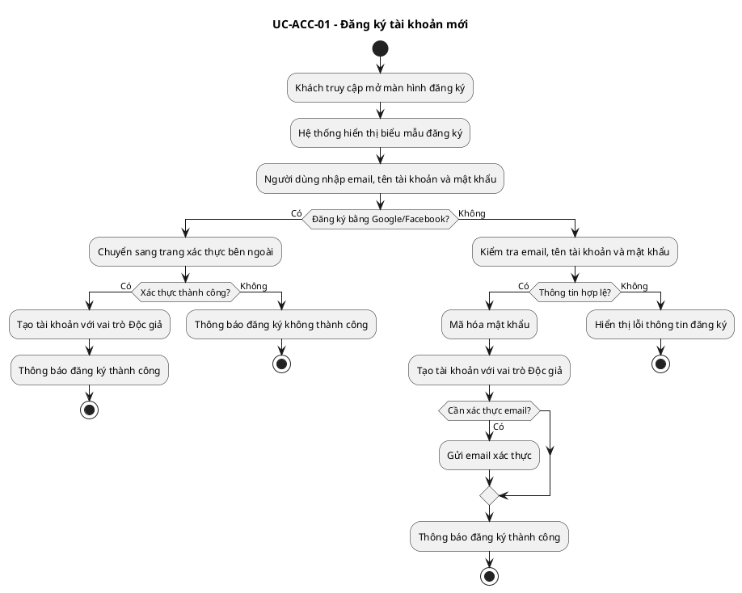

### UC-ACC-02: Đăng nhập hệ thống

| Thuộc tính | Nội dung |
| :--- | :--- |
| Actor | Reader, Author, Admin |
| Mục tiêu | Xác thực người dùng và cấp quyền truy cập theo vai trò. |
| Tiền điều kiện | Người dùng đã có tài khoản hợp lệ. |
| Hậu điều kiện | Người dùng nhận được JWT/session hợp lệ và được chuyển đến màn hình phù hợp. |
| Tần suất | Cao |
| Độ ưu tiên | High |

**Luồng chính:**

1. Người dùng truy cập màn hình đăng nhập.
2. Người dùng nhập email/username và mật khẩu.
3. Hệ thống kiểm tra thông tin đăng nhập.
4. Hệ thống kiểm tra trạng thái tài khoản.
5. Hệ thống sinh access token và refresh token.
6. Hệ thống xác định vai trò của người dùng.
7. Hệ thống điều hướng:
   - Reader vào trang chủ hoặc màn hình đọc gần nhất.
   - Author vào Author Dashboard nếu chọn chế độ tác giả.
   - Admin vào Admin Dashboard.

**Luồng thay thế:**

- Người dùng đăng nhập bằng Google/Facebook: hệ thống xác thực qua OAuth 2.0 và cấp token nội bộ.
- Người dùng bật xác thực hai bước: hệ thống yêu cầu nhập mã OTP trước khi cấp token.

**Ngoại lệ:**

- Sai thông tin đăng nhập: trả lỗi `AUTH_003`.
- Tài khoản bị khóa: trả lỗi `AUTH_004`.
- Token hết hạn: trả lỗi `AUTH_005`.

**Business Rules:**

- Token phải có thời hạn sử dụng.
- Mọi API yêu cầu đăng nhập phải kiểm tra token hợp lệ.
- Admin Dashboard chỉ cho phép tài khoản có role Admin truy cập.

**Acceptance Criteria:**

- Người dùng hợp lệ đăng nhập thành công.
- Người dùng sai mật khẩu không đăng nhập được.
- Reader không truy cập được API quản trị.
- Admin đăng nhập được vào Dashboard quản trị.

**Activity Diagram:**

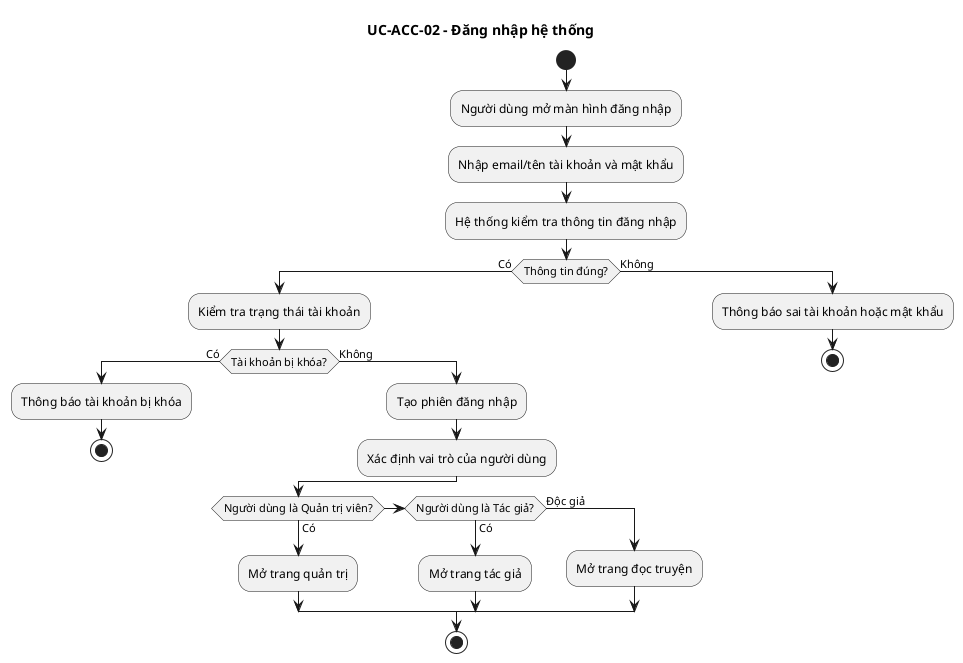

### UC-ACC-03: Quản lý hồ sơ cá nhân

| Thuộc tính | Nội dung |
| :--- | :--- |
| Actor | Reader, Author |
| Mục tiêu | Cập nhật thông tin hiển thị và thiết lập cá nhân. |
| Tiền điều kiện | Người dùng đã đăng nhập. |
| Hậu điều kiện | Hồ sơ người dùng được cập nhật và hiển thị theo cấu hình quyền riêng tư. |
| Tần suất | Trung bình |
| Độ ưu tiên | Medium |

**Luồng chính:**

1. Người dùng truy cập trang hồ sơ cá nhân.
2. Hệ thống hiển thị thông tin hiện tại gồm avatar, tên hiển thị, bio, liên kết mạng xã hội và cài đặt thông báo.
3. Người dùng chỉnh sửa thông tin.
4. Hệ thống kiểm tra định dạng dữ liệu và kích thước file ảnh.
5. Hệ thống lưu thay đổi.
6. Hệ thống hiển thị thông báo cập nhật thành công.

**Luồng thay thế:**

- Người dùng chỉ cập nhật một phần thông tin: hệ thống giữ nguyên các trường không thay đổi.
- Người dùng thay đổi cài đặt thông báo: hệ thống cập nhật cấu hình gửi email/push/in-app.

**Ngoại lệ:**

- Avatar vượt dung lượng cho phép: trả lỗi `USER_002`.
- Link mạng xã hội không hợp lệ: trả lỗi `USER_003`.

**Business Rules:**

- Người dùng chỉ được chỉnh sửa hồ sơ của chính mình.
- Admin có thể xem hồ sơ người dùng để phục vụ kiểm duyệt và hỗ trợ.
- Các thông tin nhạy cảm không được hiển thị công khai nếu người dùng không cho phép.

**Acceptance Criteria:**

- Người dùng cập nhật hồ sơ thành công khi dữ liệu hợp lệ.
- Người dùng không thể sửa hồ sơ của người khác.
- Avatar mới hiển thị đúng sau khi cập nhật.

**Activity Diagram:**

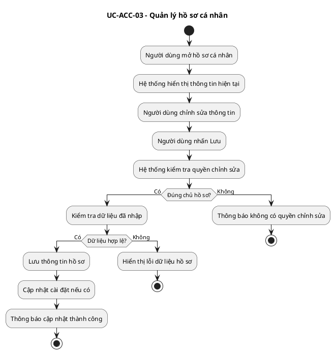

### UC-ACC-04: Hệ thống cấp bậc và huy hiệu

| Thuộc tính | Nội dung |
| :--- | :--- |
| Actor | Reader, Author |
| Mục tiêu | Ghi nhận hoạt động tích cực của người dùng thông qua rank và badge. |
| Tiền điều kiện | Người dùng đã đăng nhập và có hoạt động hợp lệ trên hệ thống. |
| Hậu điều kiện | Điểm kinh nghiệm, cấp bậc hoặc huy hiệu được cập nhật. |
| Tần suất | Trung bình |
| Độ ưu tiên | Medium |

**Luồng chính:**

1. Người dùng thực hiện hành động được tính điểm như đọc truyện, bình luận, đăng chương, nhận vote hoặc hoàn thành mốc hoạt động.
2. Hệ thống ghi nhận hành động hợp lệ.
3. Hệ thống cộng điểm kinh nghiệm hoặc cập nhật thống kê liên quan.
4. Hệ thống kiểm tra điều kiện đạt cấp bậc/huy hiệu.
5. Nếu đủ điều kiện, hệ thống cấp huy hiệu hoặc tăng cấp người dùng.
6. Hệ thống gửi thông báo thành tích cho người dùng.

**Luồng thay thế:**

- Hành động bị đánh dấu spam: hệ thống không cộng điểm.
- Huy hiệu đã tồn tại: hệ thống không cấp trùng, chỉ cập nhật tiến độ nếu có.

**Ngoại lệ:**

- Không truy xuất được dữ liệu điểm: trả lỗi `USER_005`.

**Business Rules:**

- Một hành động chỉ được tính điểm một lần theo quy tắc hệ thống.
- Hành vi spam, lạm dụng hoặc bị xóa do vi phạm không được tính điểm.
- Huy hiệu có thể phân loại theo Reader, Author hoặc Community.

**Acceptance Criteria:**

- Người dùng nhận điểm khi hành động hợp lệ.
- Hệ thống không cấp trùng huy hiệu.
- Admin có thể xem thông tin rank/badge trong hồ sơ người dùng.

**Activity Diagram:**

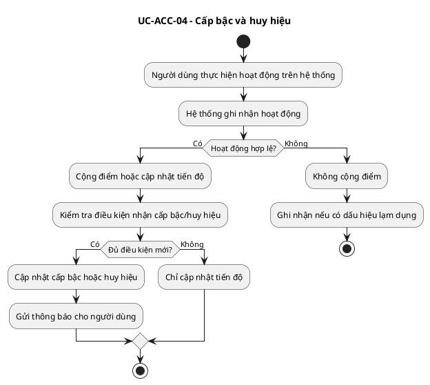

### UC-ACC-05: Phân quyền vai trò người dùng

| Thuộc tính | Nội dung |
| :--- | :--- |
| Actor | Admin |
| Mục tiêu | Quản lý quyền truy cập theo vai trò trong hệ thống. |
| Tiền điều kiện | Admin đã đăng nhập vào Dashboard quản trị. |
| Hậu điều kiện | Vai trò người dùng được cập nhật và áp dụng cho các API/màn hình liên quan. |
| Tần suất | Trung bình |
| Độ ưu tiên | High |

**Luồng chính:**

1. Admin truy cập màn hình quản lý người dùng.
2. Hệ thống hiển thị danh sách tài khoản và vai trò hiện tại.
3. Admin chọn một người dùng cần thay đổi vai trò.
4. Hệ thống hiển thị chi tiết tài khoản.
5. Admin cập nhật vai trò Reader, Author hoặc Admin.
6. Hệ thống kiểm tra quyền thao tác của Admin.
7. Hệ thống lưu thay đổi và ghi log.
8. Hệ thống áp dụng quyền mới ở lần truy cập tiếp theo hoặc sau khi token được làm mới.

**Luồng thay thế:**

- Người dùng gửi yêu cầu trở thành Author: Admin duyệt yêu cầu sau khi kiểm tra thông tin cần thiết.
- Nếu hệ thống mở rộng vai trò Moderator trong tương lai: Admin có thể cấp quyền kiểm duyệt giới hạn, nhưng vai trò này không có quyền quản lý tài khoản quản trị.

**Ngoại lệ:**

- Admin không đủ quyền cấp vai trò cao hơn: trả lỗi `AUTH_008`.
- Người dùng không tồn tại: trả lỗi `USER_001`.

**Business Rules:**

- Chỉ Admin được cấp hoặc thu hồi vai trò quản trị.
- Mọi thay đổi vai trò phải được ghi vào audit log.
- Author chỉ được quản lý truyện/chương thuộc sở hữu của mình.
- Reader chỉ được đọc nội dung đã được duyệt hoặc được phép hiển thị.

**Acceptance Criteria:**

- Vai trò thay đổi được lưu thành công.
- Người dùng sau khi đổi role có quyền đúng theo role mới.
- Hệ thống ghi nhận lịch sử thay đổi vai trò.

**Activity Diagram:**

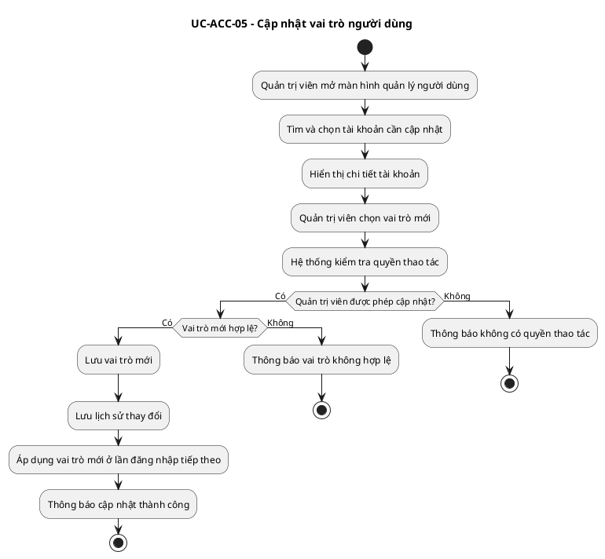

## 4.6. Module Quản trị & Thống kê

### 4.6.1. Mục tiêu module

Module Quản trị & Thống kê cung cấp cho Admin các công cụ để quản lý người dùng, kiểm duyệt nội dung, xử lý báo cáo vi phạm, theo dõi chỉ số vận hành và đảm bảo nền tảng hoạt động ổn định, đúng chính sách.

### 4.6.2. Tác nhân liên quan

| Tác nhân | Vai trò |
| :--- | :--- |
| Admin | Quản lý toàn bộ hệ thống, người dùng, nội dung, báo cáo và cấu hình. |
| Author | Nhận thông báo khi nội dung bị yêu cầu sửa, tạm ẩn hoặc gỡ bỏ. |
| Reader | Gửi report nội dung vi phạm, xem kết quả xử lý nếu được thông báo. |
| AI Service | Tự động quét nội dung, gắn cờ rủi ro và cung cấp bằng chứng hỗ trợ kiểm duyệt. |

### 4.6.3. Danh sách chức năng

| Tên chức năng | Mô tả |
| :--- | :--- |
| Quản lý người dùng | Xem, tìm kiếm, lọc, khóa, mở khóa và cập nhật vai trò người dùng. |
| Kiểm duyệt truyện/chương | Xem nội dung chờ duyệt, nội dung bị AI gắn cờ hoặc bị report. |
| Kiểm duyệt bình luận | Xử lý bình luận toxic, spam hoặc vi phạm chính sách cộng đồng. |
| Xử lý report | Tiếp nhận, phân loại và xử lý báo cáo vi phạm từ người dùng. |
| Quản lý tag/thể loại | Tạo, cập nhật, ẩn hoặc gộp tag/thể loại trùng lặp. |
| Dashboard thống kê | Theo dõi số người dùng, truyện, chương, lượt đọc, report và chỉ số doanh thu tổng quan nếu hệ thống bật monetization. |
| Audit log | Ghi nhận thao tác quản trị để phục vụ truy vết. |
| Quản lý banner/sự kiện | Cấu hình nội dung quảng bá hoặc chiến dịch nổi bật nếu hệ thống triển khai. |

### UC-ADM-01: Quản lý người dùng

| Thuộc tính | Nội dung |
| :--- | :--- |
| Actor | Admin |
| Mục tiêu | Theo dõi và xử lý tài khoản người dùng trong hệ thống. |
| Tiền điều kiện | Admin đã đăng nhập và có quyền quản lý người dùng. |
| Hậu điều kiện | Thông tin hoặc trạng thái tài khoản được cập nhật. |
| Tần suất | Cao |
| Độ ưu tiên | High |

**Luồng chính:**

1. Admin truy cập màn hình User Management.
2. Hệ thống hiển thị danh sách người dùng kèm thông tin cơ bản: ID, username, email, role, trạng thái, ngày tạo, số report liên quan.
3. Admin tìm kiếm hoặc lọc theo role, trạng thái, ngày tạo hoặc mức độ vi phạm.
4. Admin chọn một người dùng để xem chi tiết.
5. Hệ thống hiển thị hồ sơ, lịch sử hoạt động, nội dung đã đăng và các report liên quan.
6. Admin thực hiện thao tác phù hợp: cập nhật vai trò, khóa tài khoản, mở khóa tài khoản hoặc ghi chú xử lý.
7. Hệ thống xác nhận thao tác.
8. Hệ thống cập nhật dữ liệu và ghi audit log.

**Luồng thay thế:**

- Admin xuất danh sách người dùng theo bộ lọc để phục vụ báo cáo.
- Admin chỉ xem chi tiết nhưng không thay đổi dữ liệu.

**Ngoại lệ:**

- Người dùng không tồn tại: trả lỗi `USER_001`.
- Admin không đủ quyền: trả lỗi `AUTH_008`.
- Thao tác bị xung đột do dữ liệu đã thay đổi: trả lỗi `SYS_007`.

**Business Rules:**

- Không cho phép Admin tự khóa tài khoản của chính mình nếu là Admin cuối cùng của hệ thống.
- Mọi thao tác khóa/mở khóa/cập nhật vai trò phải được ghi log.
- Tài khoản bị khóa không được đăng nhập hoặc thực hiện hành động tương tác.

**Acceptance Criteria:**

- Admin xem và lọc danh sách người dùng thành công.
- Admin khóa tài khoản vi phạm và người dùng đó không thể đăng nhập.
- Hệ thống lưu log đầy đủ thao tác quản trị.

**Activity Diagram:**

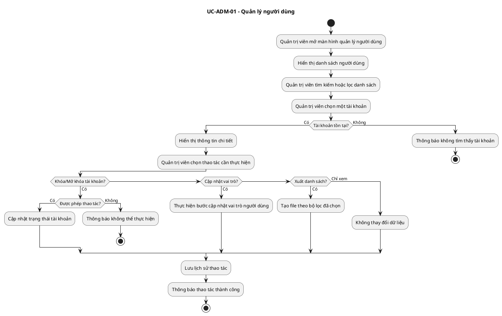

### UC-ADM-02: Kiểm duyệt nội dung

| Thuộc tính | Nội dung |
| :--- | :--- |
| Actor | Admin, AI Service |
| Mục tiêu | Đảm bảo truyện, chương và bình luận tuân thủ chính sách nền tảng. |
| Tiền điều kiện | Admin đã đăng nhập. Có nội dung mới, nội dung bị report hoặc bị AI gắn cờ. |
| Hậu điều kiện | Nội dung được phê duyệt, yêu cầu chỉnh sửa, tạm ẩn hoặc gỡ bỏ. |
| Tần suất | Cao |
| Độ ưu tiên | High |

**Luồng chính:**

1. AI Service quét nội dung mới hoặc nội dung bị report.
2. AI Service gắn cờ nội dung nghi ngờ vi phạm và lưu lý do gắn cờ.
3. Admin truy cập Dashboard kiểm duyệt.
4. Hệ thống hiển thị danh sách nội dung chờ xử lý theo mức độ ưu tiên.
5. Admin mở chi tiết nội dung, xem metadata, lịch sử report và bằng chứng AI.
6. Admin đưa ra quyết định:
   - Phê duyệt nội dung.
   - Yêu cầu tác giả chỉnh sửa.
   - Tạm ẩn nội dung.
   - Gỡ bỏ nội dung.
   - Khóa tài khoản nếu vi phạm nghiêm trọng.
7. Hệ thống cập nhật trạng thái nội dung.
8. Hệ thống ghi log kiểm duyệt.
9. Hệ thống gửi thông báo cho tác giả và người gửi report nếu cần.

**Luồng thay thế:**

- Nội dung bị report nhưng không vi phạm: Admin bác bỏ report và giữ nguyên nội dung.
- Nội dung có dấu hiệu vi phạm nhẹ: Admin yêu cầu chỉnh sửa thay vì gỡ bỏ.
- Tác giả khiếu nại: Admin mở lại hồ sơ xử lý để xem xét.

**Ngoại lệ:**

- Nội dung không tồn tại: trả lỗi `CONTENT_001`.
- Nội dung đã được xử lý bởi người khác: trả lỗi `MOD_006`.
- AI Service không phản hồi: nội dung vẫn vào hàng đợi kiểm duyệt thủ công với cảnh báo `AI_001`.

**Business Rules:**

- AI chỉ hỗ trợ gắn cờ và đưa ra đề xuất, quyết định cuối cùng thuộc Admin.
- Nội dung vi phạm nghiêm trọng có thể bị ẩn ngay để tránh lan truyền.
- Mọi quyết định kiểm duyệt phải có lý do xử lý.
- Hệ thống phải lưu lịch sử trạng thái nội dung.

**Acceptance Criteria:**

- Nội dung bị report xuất hiện trong hàng đợi kiểm duyệt.
- Admin có thể phê duyệt, yêu cầu sửa, ẩn hoặc gỡ nội dung.
- Tác giả nhận được thông báo khi nội dung bị xử lý.
- Log kiểm duyệt lưu đủ người thao tác, thời gian, quyết định và lý do.

**Activity Diagram:**

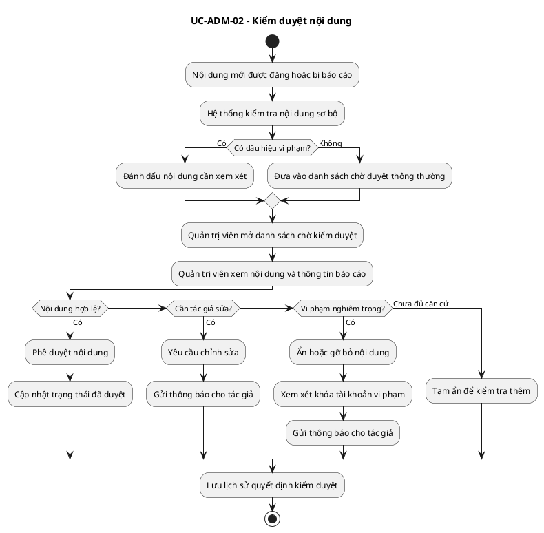

### UC-ADM-03: Xử lý báo cáo vi phạm

| Thuộc tính | Nội dung |
| :--- | :--- |
| Actor | Reader, Author, Admin |
| Mục tiêu | Cho phép người dùng báo cáo nội dung vi phạm và Admin xử lý minh bạch. |
| Tiền điều kiện | Người dùng đã đăng nhập. Nội dung được báo cáo đang tồn tại trên hệ thống. |
| Hậu điều kiện | Report được ghi nhận và chuyển vào hàng đợi xử lý. |
| Tần suất | Trung bình |
| Độ ưu tiên | High |

**Luồng chính:**

1. Người dùng chọn chức năng report tại truyện, chương, bình luận hoặc hồ sơ người dùng.
2. Hệ thống hiển thị form chọn lý do vi phạm và mô tả bổ sung.
3. Người dùng gửi report.
4. Hệ thống kiểm tra nội dung được report còn tồn tại hay không.
5. Hệ thống ghi nhận report và gán trạng thái `NEW`.
6. Hệ thống cập nhật độ ưu tiên dựa trên số lượng report, loại vi phạm và kết quả AI nếu có.
7. Admin xem report trong Dashboard.
8. Admin xử lý report theo luồng kiểm duyệt.

**Luồng thay thế:**

- Nhiều người cùng report một nội dung: hệ thống gom report theo cùng target để tránh trùng lặp xử lý.
- Người dùng gửi report sai/spam: Admin bác bỏ và có thể cảnh báo người gửi.

**Ngoại lệ:**

- Nội dung đã bị xóa trước khi report: trả lỗi `CONTENT_001`.
- Người dùng gửi report quá nhiều trong thời gian ngắn: trả lỗi `MOD_005`.

**Business Rules:**

- Một người dùng không được gửi nhiều report trùng lặp cho cùng một nội dung trong thời gian ngắn.
- Report phải có lý do thuộc danh mục hệ thống.
- Report spam có thể ảnh hưởng đến độ tin cậy của người gửi.

**Acceptance Criteria:**

- Người dùng gửi report thành công khi dữ liệu hợp lệ.
- Report xuất hiện trong Dashboard quản trị.
- Admin có thể lọc report theo trạng thái, loại vi phạm và mức ưu tiên.

**Activity Diagram:**

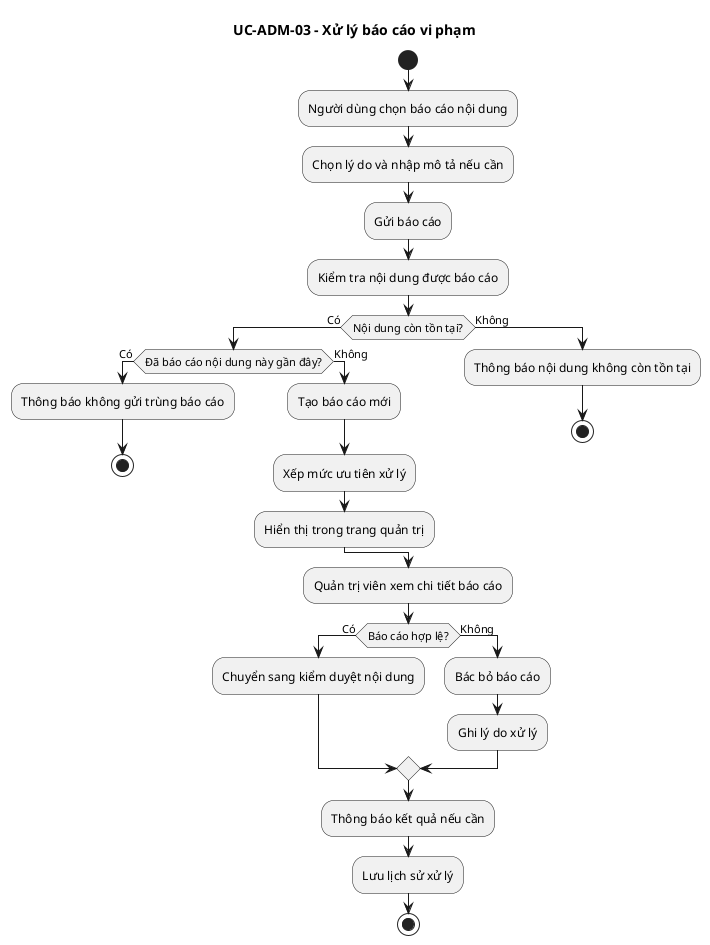

### UC-ADM-04: Dashboard thống kê hệ thống

| Thuộc tính | Nội dung |
| :--- | :--- |
| Actor | Admin |
| Mục tiêu | Theo dõi tình hình vận hành, tăng trưởng và chất lượng nội dung của nền tảng. |
| Tiền điều kiện | Admin đã đăng nhập vào Dashboard. |
| Hậu điều kiện | Admin xem được các chỉ số thống kê theo thời gian thực hoặc theo kỳ báo cáo. |
| Tần suất | Cao |
| Độ ưu tiên | Medium |

**Luồng chính:**

1. Admin truy cập Dashboard thống kê.
2. Hệ thống hiển thị các chỉ số tổng quan:
   - Tổng số người dùng.
   - Người dùng mới theo ngày/tuần/tháng.
   - Số tác giả hoạt động.
   - Số truyện và chương được tạo.
   - Số nội dung chờ duyệt.
   - Số report đang mở.
   - Lượt đọc, lượt tương tác và doanh thu nếu có.
3. Admin chọn bộ lọc thời gian.
4. Hệ thống cập nhật biểu đồ và bảng dữ liệu.
5. Admin có thể xuất báo cáo nếu được phân quyền.

**Luồng thay thế:**

- Dữ liệu chưa đủ để hiển thị biểu đồ: hệ thống hiển thị trạng thái trống có hướng dẫn.
- Admin xem thống kê theo từng phân hệ: User, Content, Moderation, Revenue.

**Ngoại lệ:**

- Dịch vụ thống kê không khả dụng: trả lỗi `SYS_005`.
- Không có quyền xuất báo cáo: trả lỗi `AUTH_008`.

**Business Rules:**

- Chỉ Admin được xem toàn bộ thống kê hệ thống.
- Nếu hệ thống tách Moderator trong tương lai, Moderator chỉ được xem thống kê liên quan đến kiểm duyệt.
- Dữ liệu doanh thu chỉ hiển thị cho role được cấp quyền tài chính.

**Acceptance Criteria:**

- Dashboard hiển thị dữ liệu tổng quan đúng theo bộ lọc.
- Admin lọc dữ liệu theo thời gian thành công.
- Hệ thống không hiển thị dữ liệu nhạy cảm cho người không đủ quyền.

**Activity Diagram:**

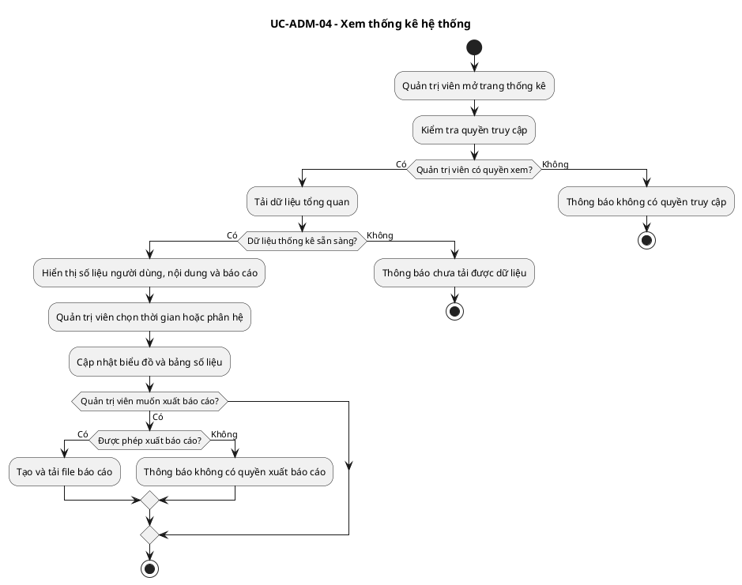

### UC-ADM-05: Quản lý tag và thể loại

| Thuộc tính | Nội dung |
| :--- | :--- |
| Actor | Admin |
| Mục tiêu | Chuẩn hóa hệ thống phân loại truyện để hỗ trợ tìm kiếm, gợi ý và quản trị nội dung. |
| Tiền điều kiện | Admin đã đăng nhập và có quyền quản lý taxonomy. |
| Hậu điều kiện | Tag/thể loại được tạo mới, cập nhật, ẩn hoặc gộp. |
| Tần suất | Trung bình |
| Độ ưu tiên | Medium |

**Luồng chính:**

1. Admin truy cập màn hình quản lý tag/thể loại.
2. Hệ thống hiển thị danh sách tag/thể loại hiện có.
3. Admin tìm kiếm hoặc lọc theo trạng thái sử dụng.
4. Admin tạo mới, chỉnh sửa, ẩn hoặc gộp tag/thể loại.
5. Hệ thống kiểm tra trùng tên, định dạng và số lượng truyện đang liên kết.
6. Hệ thống lưu thay đổi.
7. Hệ thống cập nhật chỉ mục tìm kiếm/gợi ý nếu cần.

**Luồng thay thế:**

- Tag đang được nhiều truyện sử dụng: hệ thống yêu cầu xác nhận trước khi ẩn/gộp.
- AI đề xuất tag mới: Admin duyệt trước khi đưa vào danh mục chính thức.

**Ngoại lệ:**

- Tag/thể loại trùng tên: trả lỗi `CONTENT_004`.
- Không thể gộp do xung đột dữ liệu: trả lỗi `SYS_007`.

**Business Rules:**

- Tag/thể loại phải có tên duy nhất trong cùng một nhóm phân loại.
- Không xóa cứng tag/thể loại đang có dữ liệu liên kết; ưu tiên ẩn hoặc gộp.
- Mọi thay đổi taxonomy cần ghi log.

**Acceptance Criteria:**

- Admin tạo và cập nhật tag/thể loại thành công.
- Hệ thống không cho phép tạo tag trùng tên.
- Truyện liên quan vẫn hiển thị đúng sau khi tag được gộp hoặc ẩn.

**Activity Diagram:**

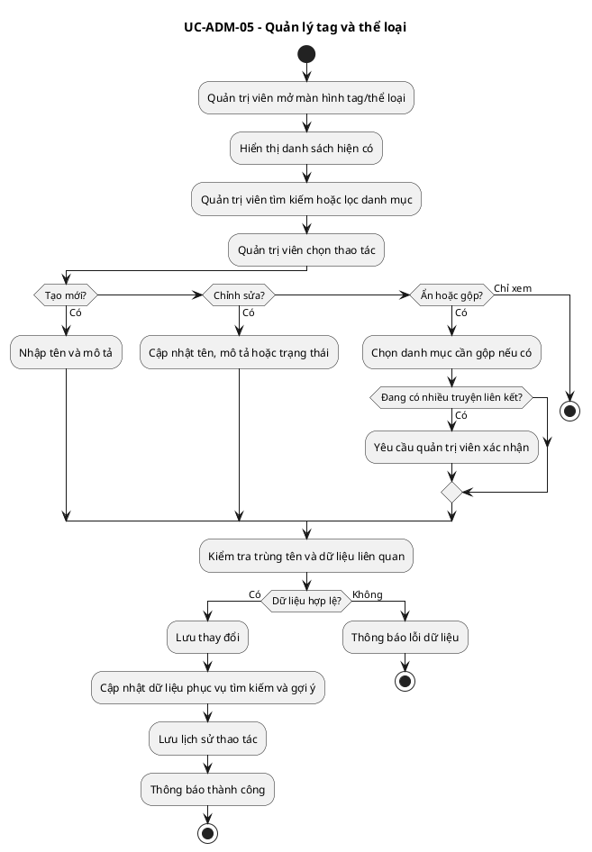

---

## CHƯƠNG V: THIẾT KẾ GIAO DIỆN

## 5.1. Sơ đồ điều hướng màn hình

### 5.1.1. Sitemap tổng quan

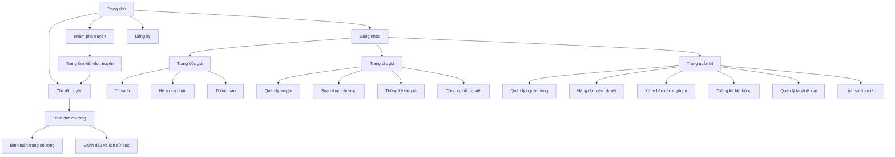

### 5.1.6. Danh sách màn hình thuộc phạm vi Quản trị & Hạ tầng

| Mã màn hình | Tên màn hình | Actor chính | Mô tả |
| :--- | :--- | :--- | :--- |
| SCR-ACC-01 | Đăng ký | Guest | Tạo tài khoản mới. |
| SCR-ACC-02 | Đăng nhập | Guest/Reader/Author/Admin | Xác thực và điều hướng theo quyền người dùng. |
| SCR-ACC-03 | Quên mật khẩu | Guest | Yêu cầu đặt lại mật khẩu. |
| SCR-ACC-04 | Hồ sơ cá nhân | Reader/Author | Xem và cập nhật hồ sơ. |
| SCR-ACC-05 | Cài đặt tài khoản | Reader/Author | Đổi mật khẩu, thông báo, quyền riêng tư. |
| SCR-ADM-01 | Trang quản trị | Admin | Tổng quan hệ thống. |
| SCR-ADM-02 | Quản lý người dùng | Admin | Danh sách, tìm kiếm, lọc, khóa/mở khóa tài khoản. |
| SCR-ADM-03 | Chi tiết người dùng | Admin | Xem hồ sơ, quyền, báo cáo vi phạm và lịch sử liên quan. |
| SCR-ADM-04 | Hàng đợi kiểm duyệt | Admin | Danh sách nội dung chờ xử lý. |
| SCR-ADM-05 | Chi tiết kiểm duyệt | Admin | Xem nội dung, bằng chứng AI, report và ra quyết định. |
| SCR-ADM-06 | Quản lý báo cáo vi phạm | Admin | Xử lý báo cáo vi phạm từ người dùng. |
| SCR-ADM-07 | Thống kê hệ thống | Admin | Biểu đồ người dùng, truyện, chương, tương tác, report. |
| SCR-ADM-08 | Quản lý tag/thể loại | Admin | Chuẩn hóa taxonomy nội dung. |
| SCR-ADM-09 | Lịch sử thao tác | Admin | Truy vết thao tác quản trị. |

---

## PHỤ LỤC: DANH MỤC MÃ LỖI HỆ THỐNG

### A. Nhóm lỗi xác thực và phân quyền

| Mã lỗi | Thông báo | Nguyên nhân | Hướng xử lý |
| :--- | :--- | :--- | :--- |
| AUTH_001 | Email không hợp lệ. | Email sai định dạng. | Kiểm tra và nhập lại email. |
| AUTH_002 | Mật khẩu không đạt yêu cầu bảo mật. | Mật khẩu quá ngắn hoặc thiếu ký tự bắt buộc. | Nhập mật khẩu mạnh hơn. |
| AUTH_003 | Tên đăng nhập hoặc mật khẩu không đúng. | Thông tin đăng nhập sai. | Nhập lại hoặc dùng quên mật khẩu. |
| AUTH_004 | Tài khoản đã bị khóa. | Admin khóa tài khoản do vi phạm hoặc yêu cầu bảo mật. | Liên hệ hỗ trợ hoặc chờ xử lý khiếu nại. |
| AUTH_005 | Phiên đăng nhập đã hết hạn. | JWT/session hết hạn. | Đăng nhập lại hoặc refresh token. |
| AUTH_006 | Không gửi được email xác thực. | Lỗi email service. | Thử gửi lại email xác thực. |
| AUTH_007 | Token không hợp lệ. | Token bị sửa, sai chữ ký hoặc không thuộc hệ thống. | Đăng nhập lại. |
| AUTH_008 | Bạn không có quyền thực hiện thao tác này. | Role không đủ quyền. | Dùng tài khoản có quyền phù hợp. |
| AUTH_009 | Tài khoản chưa xác thực email. | Người dùng chưa xác minh email. | Kiểm tra email và xác thực tài khoản. |
| AUTH_010 | Mã OTP không chính xác hoặc đã hết hạn. | OTP sai hoặc quá thời gian hiệu lực. | Yêu cầu gửi lại OTP. |

### B. Nhóm lỗi người dùng và hồ sơ

| Mã lỗi | Thông báo | Nguyên nhân | Hướng xử lý |
| :--- | :--- | :--- | :--- |
| USER_001 | Không tìm thấy người dùng. | ID người dùng không tồn tại hoặc đã bị xóa. | Kiểm tra lại dữ liệu truy vấn. |
| USER_002 | Ảnh đại diện vượt dung lượng cho phép. | File avatar quá lớn hoặc sai định dạng. | Chọn ảnh đúng định dạng và dung lượng. |
| USER_003 | Liên kết mạng xã hội không hợp lệ. | URL sai định dạng. | Nhập lại URL hợp lệ. |
| USER_004 | Username đã tồn tại. | Tên người dùng bị trùng. | Chọn username khác. |
| USER_005 | Không thể cập nhật cấp bậc/huy hiệu. | Lỗi dữ liệu rank/badge hoặc rule chưa hợp lệ. | Thử lại hoặc báo Admin. |
| USER_006 | Không thể cập nhật vai trò người dùng. | Role không hợp lệ hoặc người thao tác không đủ quyền. | Kiểm tra role và quyền Admin. |
| USER_007 | Không thể khóa tài khoản này. | Tài khoản là Admin cuối cùng hoặc thuộc nhóm bảo vệ. | Cần tạo Admin khác hoặc đổi chính sách xử lý. |

### C. Nhóm lỗi nội dung

| Mã lỗi | Thông báo | Nguyên nhân | Hướng xử lý |
| :--- | :--- | :--- | :--- |
| CONTENT_001 | Không tìm thấy nội dung. | Truyện/chương/bình luận không tồn tại hoặc đã bị xóa. | Tải lại trang hoặc kiểm tra ID. |
| CONTENT_002 | Nội dung đang chờ kiểm duyệt. | Nội dung chưa được duyệt công khai. | Chờ Admin xử lý. |
| CONTENT_003 | Nội dung đã bị ẩn hoặc gỡ bỏ. | Nội dung vi phạm chính sách hoặc bị tạm ẩn. | Xem lý do xử lý hoặc gửi khiếu nại. |
| CONTENT_004 | Tag hoặc thể loại đã tồn tại. | Tạo tag/thể loại trùng tên. | Dùng tag hiện có hoặc đổi tên. |
| CONTENT_005 | Nội dung không đạt yêu cầu xuất bản. | Thiếu tiêu đề, nội dung quá ngắn hoặc sai định dạng. | Bổ sung thông tin bắt buộc. |
| CONTENT_006 | Bạn không có quyền chỉnh sửa nội dung này. | Người dùng không phải chủ sở hữu hoặc không có quyền quản trị. | Dùng tài khoản phù hợp. |

### D. Nhóm lỗi kiểm duyệt và report

| Mã lỗi | Thông báo | Nguyên nhân | Hướng xử lý |
| :--- | :--- | :--- | :--- |
| MOD_001 | Report không hợp lệ. | Thiếu lý do hoặc target report. | Chọn lý do report hợp lệ. |
| MOD_002 | Nội dung đã được xử lý. | Report hoặc nội dung đã có quyết định trước đó. | Tải lại danh sách xử lý. |
| MOD_003 | Không thể phê duyệt nội dung. | Nội dung đang ở trạng thái không cho phép duyệt. | Kiểm tra trạng thái nội dung. |
| MOD_004 | Không thể gỡ bỏ nội dung. | Thiếu quyền hoặc nội dung đã bị xóa. | Kiểm tra quyền và trạng thái. |
| MOD_005 | Bạn gửi report quá thường xuyên. | Cơ chế chống spam report. | Chờ một thời gian trước khi gửi tiếp. |
| MOD_006 | Nội dung đang được xử lý bởi người khác. | Xung đột thao tác kiểm duyệt. | Tải lại hàng đợi kiểm duyệt. |
| MOD_007 | Thiếu lý do xử lý kiểm duyệt. | Admin chưa nhập lý do khi ẩn/gỡ/yêu cầu sửa. | Bổ sung lý do xử lý. |

### E. Nhóm lỗi thanh toán và ví nếu triển khai

| Mã lỗi | Thông báo | Nguyên nhân | Hướng xử lý |
| :--- | :--- | :--- | :--- |
| PAY_001 | Số dư không đủ. | Người dùng không đủ Coin để mở khóa nội dung. | Nạp thêm Coin hoặc chọn nội dung miễn phí. |
| PAY_002 | Giao dịch không tồn tại. | ID giao dịch sai hoặc đã bị xóa. | Kiểm tra lịch sử giao dịch. |
| PAY_003 | Giao dịch đang xử lý. | Payment gateway chưa trả kết quả cuối cùng. | Chờ cập nhật trạng thái. |
| PAY_004 | Giao dịch thất bại. | Lỗi cổng thanh toán hoặc người dùng hủy giao dịch. | Thử lại hoặc chọn phương thức khác. |
| PAY_005 | Nội dung đã được mở khóa. | Người dùng đã mua chương trước đó. | Truy cập trực tiếp nội dung. |

### F. Nhóm lỗi AI Service

| Mã lỗi | Thông báo | Nguyên nhân | Hướng xử lý |
| :--- | :--- | :--- | :--- |
| AI_001 | Dịch vụ AI tạm thời không phản hồi. | AI Service timeout hoặc unavailable. | Chuyển sang kiểm duyệt thủ công hoặc thử lại. |
| AI_002 | Không thể phân tích nội dung. | Nội dung rỗng, quá dài hoặc định dạng không hỗ trợ. | Kiểm tra và gửi lại nội dung. |
| AI_003 | Kết quả AI không hợp lệ. | Response từ AI thiếu trường bắt buộc. | Ghi log và yêu cầu xử lý thủ công. |
| AI_004 | Không thể gợi ý tag/thể loại. | Dữ liệu đầu vào không đủ hoặc lỗi model. | Bổ sung nội dung hoặc chọn tag thủ công. |

### G. Nhóm lỗi hệ thống

| Mã lỗi | Thông báo | Nguyên nhân | Hướng xử lý |
| :--- | :--- | :--- | :--- |
| SYS_001 | Lỗi hệ thống không xác định. | Exception chưa được phân loại. | Ghi log và liên hệ quản trị. |
| SYS_002 | Không thể kết nối cơ sở dữ liệu. | Database unavailable. | Kiểm tra hạ tầng database. |
| SYS_003 | Dữ liệu gửi lên không hợp lệ. | Request body sai schema. | Kiểm tra lại dữ liệu đầu vào. |
| SYS_004 | Tài nguyên không tồn tại. | Endpoint hoặc resource không đúng. | Kiểm tra URL/API. |
| SYS_005 | Dịch vụ tạm thời không khả dụng. | Service downtime hoặc maintenance. | Thử lại sau. |
| SYS_006 | Quá giới hạn yêu cầu. | Rate limit vượt ngưỡng. | Giảm tần suất request. |
| SYS_007 | Dữ liệu đã thay đổi, vui lòng tải lại. | Xung đột cập nhật đồng thời. | Reload dữ liệu và thao tác lại. |
| SYS_008 | Không thể xuất báo cáo. | Lỗi tạo file, thiếu quyền hoặc dữ liệu quá lớn. | Chọn bộ lọc nhỏ hơn hoặc kiểm tra quyền. |
